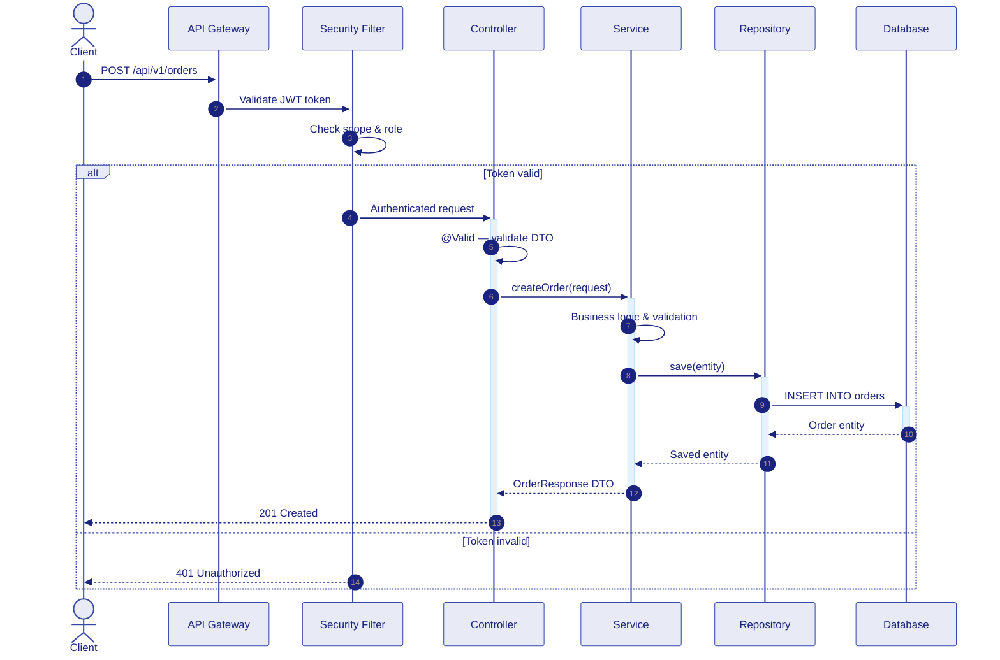
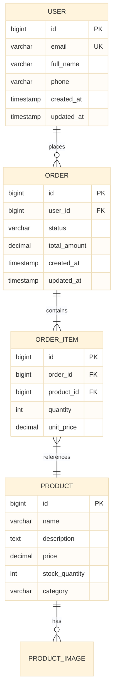
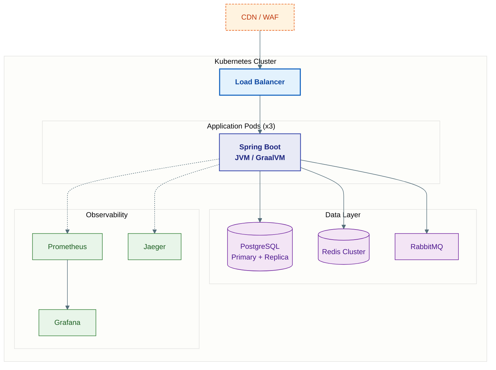
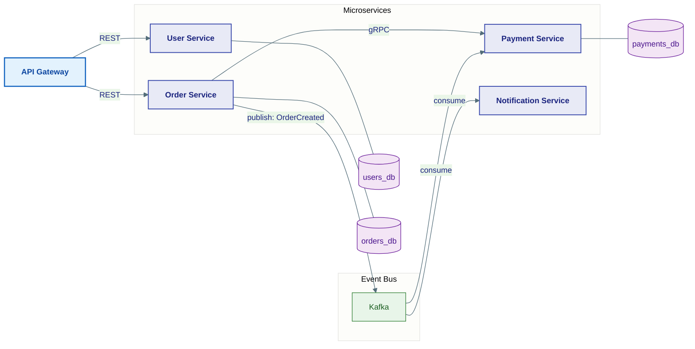
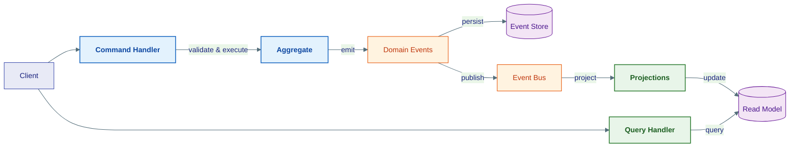
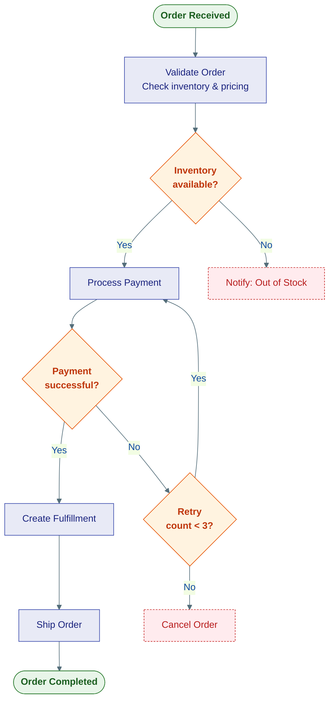
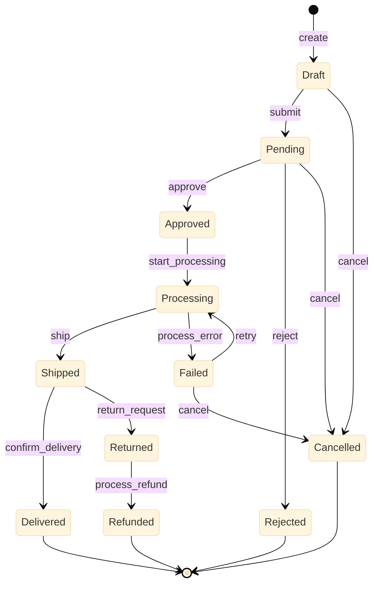

# Enterprise Mermaid Diagram Generator

Professional-grade Mermaid diagram generation for enterprise applications and systems documentation. This skill merges comprehensive Mermaid expertise with enterprise-specific templates, styling presets, and quality validation.

---

## When to Use

- Architecture documentation (C4 Model, deployment, component diagrams)
- API request/response flow diagrams (REST, GraphQL, gRPC)
- Database Entity-Relationship Diagrams (ERD)
- Microservices communication and service mesh diagrams
- Event-driven architecture flows (Kafka, RabbitMQ, CQRS)
- Business process flowcharts and decision trees
- State machines and user journey maps
- CI/CD pipeline visualizations
- Gantt charts for project timelines
- Class diagrams for domain models (JPA entities, DTOs)
- Sequence diagrams for API interactions
- Git branching strategy visualizations

## When NOT to Use

- For AI Agent System diagrams (LangGraph, AutoGen, CrewAI) → use `mermaid-diagram-agent/`
- For architecture pattern selection → use `architecture-patterns/`
- For full documentation packages (ebooks, manuals) → use `docs-architect/` with this skill as support
- For architecture decision records → use `software-architecture/`

---

## Supported Diagram Types

All Mermaid diagram types are supported:

| Type | Syntax | Best For |
|------|--------|----------|
| Flowchart | `flowchart TD/LR` | Architecture, decision trees, business processes |
| Sequence | `sequenceDiagram` | API flows, service interactions, auth flows |
| Class | `classDiagram` | Domain models, JPA entities, DTOs, interfaces |
| State | `stateDiagram-v2` | Order lifecycle, user states, workflow states |
| ERD | `erDiagram` | Database schema, entity relationships |
| Gantt | `gantt` | Project timelines, sprint planning |
| Pie | `pie` | Distribution charts, test coverage |
| Git Graph | `gitGraph` | Branching strategies, release flows |
| Journey | `journey` | User journeys, onboarding flows |
| Quadrant | `quadrantChart` | Priority matrices, technology radar |
| Timeline | `timeline` | Release history, milestones |
| Mind Map | `mindmap` | Feature brainstorming, requirement mapping |

---

## Step 0: Pre-Diagram Checklist

Before generating any diagram:

1. **Identify the audience**: Engineers? Stakeholders? Both?
2. **Choose the right diagram type** from the table above
3. **Determine scope**: Single service or cross-service?
4. **Check complexity**: If >30 nodes, use C4 layering
5. **Select theme**: Light (docs/GitHub) or Dark (presentations)?

---

## Enterprise Diagram Templates

### Template 1: API Request Flow (Spring Boot)

**Purpose:** Show the full lifecycle of an API request through the application layers.



---

### Template 2: Database ERD

**Purpose:** Document entity relationships and cardinality.



---

### Template 3: Deployment Architecture (Kubernetes)

**Purpose:** Visualize production deployment topology.



---

### Template 4: Microservices Communication

**Purpose:** Show inter-service communication patterns.



---

### Template 5: Event-Driven Architecture (CQRS)

**Purpose:** Command and Query separation with event sourcing.



---

### Template 6: Business Process Flow

**Purpose:** Document business workflows and approval chains.



---

### Template 7: State Machine (Order Lifecycle)



---

### Template 8: CI/CD Pipeline

```mermaid
%%{init: {'theme': 'base', 'themeVariables': {'primaryColor': '#E8EAF6','primaryTextColor': '#1A237E','primaryBorderColor': '#3949AB','lineColor': '#546E7A','fontSize': '14px'}}}%%
flowchart LR
    classDef stage    fill:#E8EAF6,stroke:#3949AB,stroke-width:1.5px,color:#1A237E,font-weight:bold
    classDef gate     fill:#FFF3E0,stroke:#E65100,color:#BF360C,font-weight:bold
    classDef deploy   fill:#E8F5E9,stroke:#2E7D32,stroke-width:1.5px,color:#1B5E20,font-weight:bold
    classDef test     fill:#E3F2FD,stroke:#1565C0,stroke-width:1px,color:#0D47A1

    GIT["Git Push"]:::stage
    BUILD["Build & Compile\nGradle / Maven"]:::stage
    UNIT["Unit Tests\nJUnit 5"]:::test
    SAST["SAST Scan\nSonarQube"]:::test
    INT["Integration Tests\nTestcontainers"]:::test
    GATE1{"Quality\nGate"}:::gate
    DOCKER["Docker Build\nMulti-stage"]:::stage
    SCAN["Image Scan\nTrivy"]:::test
    DEV["Deploy DEV"]:::deploy
    STG["Deploy STG"]:::deploy
    GATE2{"Manual\nApproval"}:::gate
    PROD["Deploy PROD\nBlue-Green"]:::deploy

    GIT --> BUILD --> UNIT --> SAST --> INT --> GATE1
    GATE1 -->|"Pass"| DOCKER --> SCAN --> DEV --> STG --> GATE2
    GATE2 -->|"Approved"| PROD
```



---

## Mermaid Syntax Guard — Quick Reference

> **Full reference:** `references/syntax-guard.md`

### Critical Rules

1. **`%%{init}` must be line 1** — no blank lines before, single quotes inside JSON
2. **Labels with special characters** → wrap in `["..."]`: `A["function(arg)"]`
3. **Subgraph IDs** → alphanumeric + underscore only: `subgraph AppLayer`
4. **Subgraph titles** → use quoted bracket syntax: `subgraph ID["Title With Spaces"]`
5. **Edge labels with spaces** → quote: `-->|"label text"| B`
6. **`classDef` before use** → define ALL classDef lines before any node references
7. **30-node limit** → split into C4 layers if exceeded
8. **Bracket matching** → every `[`, `(`, `{`, `"` must close; every `subgraph`/`loop` needs `end`
9. **Activation balancing** → in sequence diagrams, every `+` needs a matching `-`
10. **No raw HTML** → use `<br/>` for line breaks in flowcharts only

### Self-Repair Protocol

If Mermaid rendering fails:
1. Simplify labels (remove special chars)
2. Check bracket matching
3. Reduce nodes (split diagram)
4. Replace complex syntax with simpler alternatives
5. Verify against `references/syntax-guard.md` §6

---

## Styling Reference

### Light Theme (default — for docs, GitHub, Markdown)

**Architecture / flow:**
```
%%{init: {'theme': 'base', 'themeVariables': {'primaryColor': '#E8EAF6','primaryTextColor': '#1A237E','primaryBorderColor': '#3949AB','lineColor': '#546E7A','secondaryColor': '#E3F2FD','tertiaryColor': '#F3E5F5','background': '#FAFAFA','fontSize': '14px'}}}%%
```

**Sequence diagrams:**
```
%%{init: {'theme': 'base', 'themeVariables': {'actorBkg': '#E8EAF6','actorBorder': '#3949AB','actorTextColor': '#1A237E','activationBkgColor': '#E3F2FD','activationBorderColor': '#1565C0','noteBkgColor': '#FFFDE7','noteBorderColor': '#F57F17','signalColor': '#546E7A','signalTextColor': '#263238','fontSize': '13px'}}}%%
```

**Error flows:**
```
%%{init: {'theme': 'base', 'themeVariables': {'primaryColor': '#FFEBEE','primaryBorderColor': '#C62828','primaryTextColor': '#B71C1C','lineColor': '#B71C1C','tertiaryColor': '#FFF8E1'}}}%%
```

### Dark Theme (for presentations / dark-mode)

```
%%{init: {'theme': 'base', 'themeVariables': {'primaryColor': '#2D2D3F','primaryTextColor': '#E8EAF6','primaryBorderColor': '#7986CB','lineColor': '#90A4AE','secondaryColor': '#1A237E','tertiaryColor': '#311B92','background': '#1E1E2E','fontSize': '14px'}}}%%
```

### Standard classDef Palette

```
classDef service     fill:#E8EAF6,stroke:#3949AB,stroke-width:1.5px,color:#1A237E,font-weight:bold
classDef gateway     fill:#E3F2FD,stroke:#1565C0,stroke-width:2px,color:#0D47A1,font-weight:bold
classDef database    fill:#F3E5F5,stroke:#6A1B9A,stroke-width:1px,color:#4A148C
classDef queue       fill:#E8F5E9,stroke:#2E7D32,stroke-width:1px,color:#1B5E20
classDef external    fill:#FFF3E0,stroke:#E65100,stroke-width:1px,color:#BF360C,stroke-dasharray:4 2
classDef decision    fill:#FFF3E0,stroke:#E65100,color:#BF360C,font-weight:bold
classDef terminal    fill:#E8F5E9,stroke:#2E7D32,color:#1B5E20,font-weight:bold
classDef error       fill:#FFEBEE,stroke:#C62828,color:#B71C1C,stroke-dasharray:3 2
classDef human       fill:#FCE4EC,stroke:#880E4F,stroke-width:1px,color:#880E4F
classDef monitoring  fill:#E8F5E9,stroke:#2E7D32,stroke-width:1px,color:#1B5E20
```

### linkStyle Edge Typing

```
linkStyle 0 stroke:#1565C0,stroke-width:2px          %% primary control flow
linkStyle 1 stroke:#2E7D32,stroke-width:1px           %% data/tool call
linkStyle 2 stroke:#6A1B9A,stroke-dasharray:4 2       %% state/db read/write
linkStyle 3 stroke:#C62828,stroke-dasharray:2 2       %% error path
```

---

## Quality Gate

Before outputting any diagram, validate:

**Syntax:**
- [ ] Opens with `%%{init: ...}%%` as FIRST line
- [ ] `classDef` defined before node references
- [ ] All labels with special chars wrapped in `["..."]`
- [ ] All `subgraph`/`loop`/`alt`/`par` have matching `end`
- [ ] Total nodes ≤ 30 per diagram
- [ ] Activation `+`/`-` balanced in sequence diagrams

**Content:**
- [ ] Diagram type matches the data being visualized
- [ ] Labels are clear, concise, and meaningful
- [ ] Relationships have descriptive edge labels
- [ ] Consistent styling applied via classDef
- [ ] No overcrowding — readable at normal zoom

**Professional Quality:**
- [ ] Both basic and styled versions provided when requested
- [ ] Comments explain complex syntax
- [ ] Alternative diagram types suggested when applicable
- [ ] Export format recommendations included

---

## Special Cases

### Large Systems (>15 components) — C4 Layering

Split into layers:
- **L1 — Context**: System + external actors (5-8 nodes max)
- **L2 — Container**: Internal subsystems (API, services, databases)
- **L3 — Component**: Internals of one container

> Generate L1 first. Ask user which containers to expand to L2/L3.

### Multiple Diagram Outputs

When generating a diagram package:
1. Start with architecture overview (static structure)
2. Add runtime flow (sequence diagram)
3. Include decision logic (flowchart) if branching exists
4. Add ERD if database schema is involved
5. Add deployment diagram if infrastructure matters

### Incremental Updates

When updating after code changes:
1. Identify which diagrams are affected
2. Update only those diagrams
3. Mark changes: `> 🔄 Updated [date]: [summary]`

---

## Reference Files

- `references/syntax-guard.md` — Mermaid syntax pitfall guide, escaping rules, self-repair protocol
- `references/real-example.md` — End-to-end worked example: Spring Boot Order Management System → complete enterprise diagram deliverable (use as quality benchmark)

---

## Related Skills

| Skill | Relationship |
|-------|-------------|
| `mermaid-diagram-agent/` | AI Agent System diagrams (LangGraph, AutoGen, CrewAI) — use for multi-agent systems |
| `software-architecture/` | C4 Model, ADR templates, quality attributes — provides architecture context |
| `docs-architect/` | Technical documentation architecture — orchestrates full doc packages |
| `design-orchestration/` | Meta-skill routing — invokes this skill for design visualization |
| `architecture-patterns/` | Clean/Hexagonal/Onion patterns — provides structural context |
| `api-design-principles/` | REST & GraphQL API design — provides API context for sequence diagrams |
| `database-design/` | Database design patterns — provides schema context for ERD diagrams |
