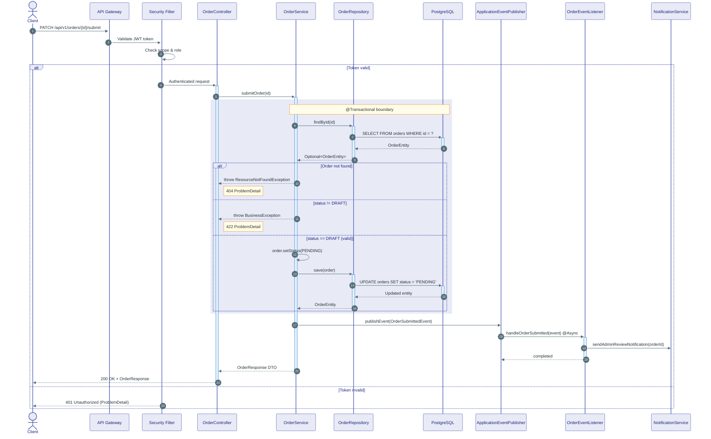
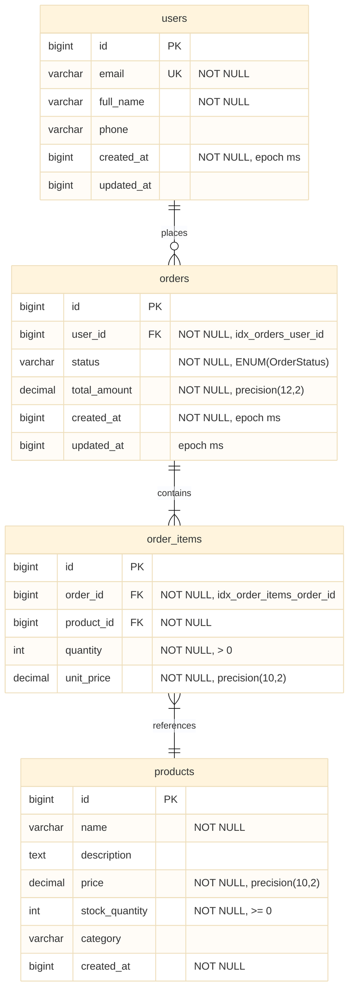
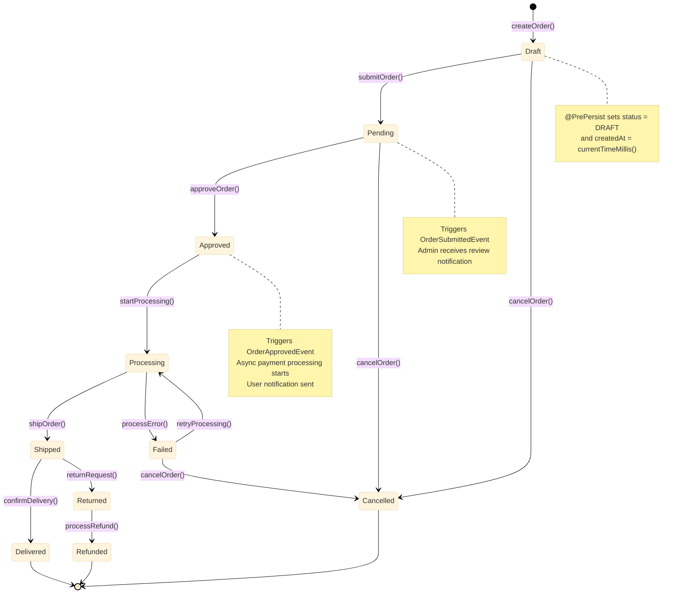
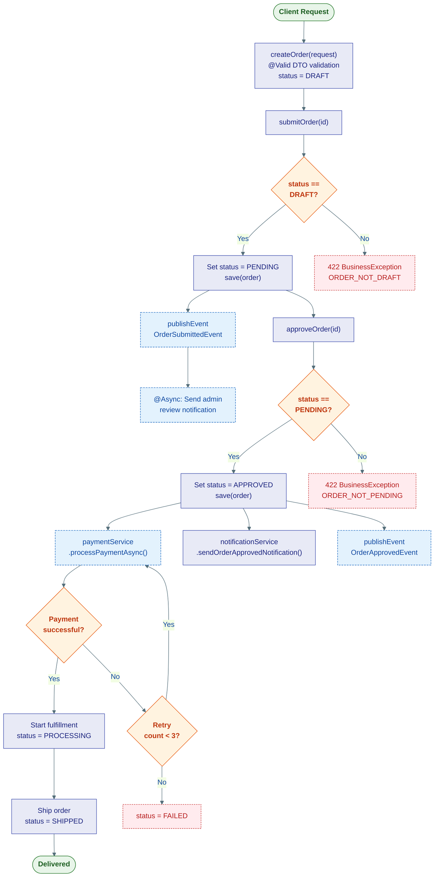
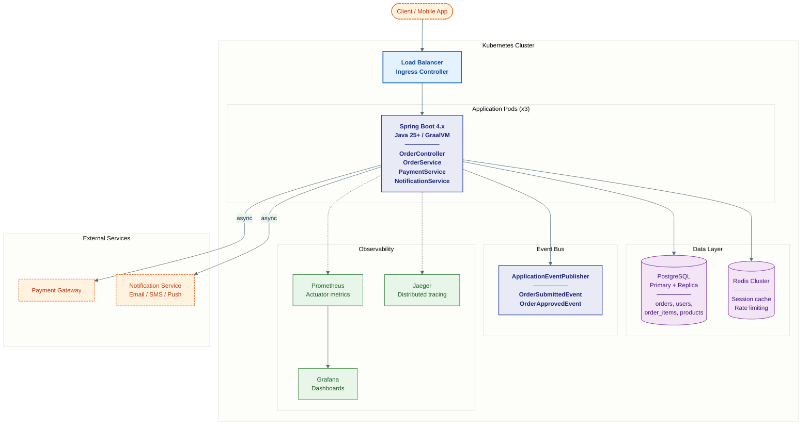

# End-to-End Example: Order Management System (Spring Boot)

> This file demonstrates the complete pipeline from Java Spring Boot source code to finished enterprise diagram deliverable. Use this as the reference standard for output quality.

---

## Input: Source Code

### `OrderEntity.java`
```java
@Entity
@Table(name = "orders")
public class OrderEntity {

    @Id
    @GeneratedValue(strategy = GenerationType.IDENTITY)
    private Long id;

    @ManyToOne(fetch = FetchType.LAZY)
    @JoinColumn(name = "user_id", nullable = false)
    private UserEntity user;

    @Enumerated(EnumType.STRING)
    @Column(nullable = false)
    private OrderStatus status;

    @Column(name = "total_amount", nullable = false, precision = 12, scale = 2)
    private BigDecimal totalAmount;

    @OneToMany(mappedBy = "order", cascade = CascadeType.ALL, orphanRemoval = true)
    private List<OrderItemEntity> items = new ArrayList<>();

    @Column(name = "created_at", nullable = false, updatable = false)
    private Long createdAt;

    @Column(name = "updated_at")
    private Long updatedAt;

    @PrePersist
    protected void onCreate() {
        this.createdAt = System.currentTimeMillis();
        this.status = OrderStatus.DRAFT;
    }

    @PreUpdate
    protected void onUpdate() {
        this.updatedAt = System.currentTimeMillis();
    }
}
```

### `OrderStatus.java`
```java
public enum OrderStatus {
    DRAFT,
    PENDING,
    APPROVED,
    PROCESSING,
    SHIPPED,
    DELIVERED,
    CANCELLED,
    FAILED,
    RETURNED,
    REFUNDED
}
```

### `OrderController.java`
```java
@RestController
@RequestMapping("/api/v1/orders")
@RequiredArgsConstructor
public class OrderController {

    private final OrderService orderService;

    @PostMapping
    public ResponseEntity<OrderResponse> createOrder(
            @Valid @RequestBody OrderCreateRequest request) {
        OrderResponse response = orderService.createOrder(request);
        return ResponseEntity.status(HttpStatus.CREATED).body(response);
    }

    @PatchMapping("/{id}/submit")
    public ResponseEntity<OrderResponse> submitOrder(@PathVariable Long id) {
        OrderResponse response = orderService.submitOrder(id);
        return ResponseEntity.ok(response);
    }

    @PatchMapping("/{id}/approve")
    public ResponseEntity<OrderResponse> approveOrder(@PathVariable Long id) {
        OrderResponse response = orderService.approveOrder(id);
        return ResponseEntity.ok(response);
    }

    @GetMapping("/{id}")
    public ResponseEntity<OrderResponse> getOrder(@PathVariable Long id) {
        OrderResponse response = orderService.getOrder(id);
        return ResponseEntity.ok(response);
    }

    @GetMapping
    public ResponseEntity<Page<OrderResponse>> listOrders(
            @RequestParam(defaultValue = "0") int page,
            @RequestParam(defaultValue = "20") int size) {
        Page<OrderResponse> response = orderService.listOrders(page, size);
        return ResponseEntity.ok(response);
    }
}
```

### `OrderService.java`
```java
@Service
@RequiredArgsConstructor
public class OrderService {

    private final OrderRepository orderRepository;
    private final OrderMapper orderMapper;
    private final PaymentService paymentService;
    private final NotificationService notificationService;
    private final ApplicationEventPublisher eventPublisher;

    @Transactional
    public OrderResponse createOrder(OrderCreateRequest request) {
        OrderEntity order = orderMapper.toEntity(request);
        order = orderRepository.save(order);
        return orderMapper.toResponse(order);
    }

    @Transactional
    public OrderResponse submitOrder(Long id) {
        OrderEntity order = orderRepository.findById(id)
                .orElseThrow(() -> new ResourceNotFoundException("Order", id));

        if (order.getStatus() != OrderStatus.DRAFT) {
            throw new BusinessException("ORDER_NOT_DRAFT",
                    "Only DRAFT orders can be submitted");
        }

        order.setStatus(OrderStatus.PENDING);
        order = orderRepository.save(order);

        eventPublisher.publishEvent(new OrderSubmittedEvent(order.getId()));
        return orderMapper.toResponse(order);
    }

    @Transactional
    public OrderResponse approveOrder(Long id) {
        OrderEntity order = orderRepository.findById(id)
                .orElseThrow(() -> new ResourceNotFoundException("Order", id));

        if (order.getStatus() != OrderStatus.PENDING) {
            throw new BusinessException("ORDER_NOT_PENDING",
                    "Only PENDING orders can be approved");
        }

        order.setStatus(OrderStatus.APPROVED);
        order = orderRepository.save(order);

        // Trigger async payment processing
        paymentService.processPaymentAsync(order.getId(), order.getTotalAmount());
        notificationService.sendOrderApprovedNotification(order.getUser(), order);

        eventPublisher.publishEvent(new OrderApprovedEvent(order.getId()));
        return orderMapper.toResponse(order);
    }
}
```

### `OrderEventListener.java`
```java
@Component
@RequiredArgsConstructor
public class OrderEventListener {

    private final OrderRepository orderRepository;
    private final NotificationService notificationService;

    @EventListener
    @Async
    public void handleOrderSubmitted(OrderSubmittedEvent event) {
        // Send notification to admin for review
        notificationService.sendAdminReviewNotification(event.getOrderId());
    }

    @TransactionalEventListener(phase = TransactionPhase.AFTER_COMMIT)
    public void handleOrderApproved(OrderApprovedEvent event) {
        // Log audit trail
        log.info("Order {} approved, triggering fulfillment pipeline", event.getOrderId());
    }
}
```

### `OrderRepository.java`
```java
@Repository
public interface OrderRepository extends JpaRepository<OrderEntity, Long> {

    @Query("SELECT o FROM OrderEntity o WHERE o.user.id = :userId AND o.status = :status")
    Page<OrderEntity> findByUserIdAndStatus(
            @Param("userId") Long userId,
            @Param("status") OrderStatus status,
            Pageable pageable);

    @Query("SELECT o FROM OrderEntity o WHERE o.status IN :statuses ORDER BY o.createdAt DESC")
    List<OrderEntity> findByStatusIn(@Param("statuses") List<OrderStatus> statuses);
}
```

### `GlobalExceptionHandler.java`
```java
@ControllerAdvice
public class GlobalExceptionHandler {

    @ExceptionHandler(ResourceNotFoundException.class)
    public ResponseEntity<ProblemDetail> handleNotFound(ResourceNotFoundException ex) {
        ProblemDetail problem = ProblemDetail.forStatusAndDetail(
                HttpStatus.NOT_FOUND, ex.getMessage());
        problem.setTitle("Resource Not Found");
        problem.setProperty("resource", ex.getResource());
        problem.setProperty("id", ex.getId());
        return ResponseEntity.status(HttpStatus.NOT_FOUND).body(problem);
    }

    @ExceptionHandler(BusinessException.class)
    public ResponseEntity<ProblemDetail> handleBusiness(BusinessException ex) {
        ProblemDetail problem = ProblemDetail.forStatusAndDetail(
                HttpStatus.UNPROCESSABLE_ENTITY, ex.getMessage());
        problem.setTitle("Business Rule Violation");
        problem.setProperty("errorCode", ex.getErrorCode());
        return ResponseEntity.status(HttpStatus.UNPROCESSABLE_ENTITY).body(problem);
    }

    @ExceptionHandler(MethodArgumentNotValidException.class)
    public ResponseEntity<ProblemDetail> handleValidation(MethodArgumentNotValidException ex) {
        ProblemDetail problem = ProblemDetail.forStatusAndDetail(
                HttpStatus.BAD_REQUEST, "Validation failed");
        problem.setTitle("Validation Error");
        Map<String, String> errors = new HashMap<>();
        ex.getBindingResult().getFieldErrors()
                .forEach(e -> errors.put(e.getField(), e.getDefaultMessage()));
        problem.setProperty("fieldErrors", errors);
        return ResponseEntity.status(HttpStatus.BAD_REQUEST).body(problem);
    }
}
```

---

## Expected Output: Complete Deliverable

---

# Enterprise System Architecture Documentation
**Generated:** 2026-04-23  **Analyzer:** Claude (mermaid-diagram-enterprise skill)
**Source:** `OrderEntity.java`, `OrderController.java`, `OrderService.java`, `OrderEventListener.java`, `OrderRepository.java`, `GlobalExceptionHandler.java`
**Tech Stack:** Java 25+ / Spring Boot 4.x / JPA / PostgreSQL
**Pattern:** Layered Architecture (Controller → Service → Repository) + Event-Driven

## System Inventory
| Category | Count | Names |
|---|---|---|
| Entities | 3 | OrderEntity, UserEntity, OrderItemEntity |
| Controllers | 1 | OrderController (5 endpoints) |
| Services | 3 | OrderService, PaymentService, NotificationService |
| Repositories | 1 | OrderRepository (2 custom queries) |
| Events | 2 | OrderSubmittedEvent, OrderApprovedEvent |
| External Integrations | 2 | Payment gateway (async), Notification system |
| Exception Handlers | 3 | ResourceNotFoundException, BusinessException, MethodArgumentNotValidException |

## Architecture Summary
An Order Management System using Spring Boot's layered architecture with event-driven extensions. The core flow follows Controller → Service → Repository with `@Transactional` boundaries at the service layer. State transitions are guarded by business rules (status validation), and side effects (notifications, payment processing) are triggered via Spring Events (`ApplicationEventPublisher`) with async and transactional event listeners.

## Diagram Index
| # | Type | Title | Key question answered |
|---|---|---|---|
| 1 | Sequence | API Request Flow — Create & Submit Order | What happens at runtime through each layer? |
| 2 | ERD | Order Domain Entity Relationships | What is the data model and how are entities related? |
| 3 | State Machine | Order Lifecycle | What are the valid status transitions? |
| 4 | Flow | Order Business Process | What is the decision logic for order processing? |
| 5 | Architecture | Deployment Topology | How is the system deployed and what external services are involved? |

---

**📌 Diagram 1 — Sequence: API Request Flow — Submit Order**

> **Cross-ref:** ERD §2 shows the OrderEntity structure; State Machine §3 shows valid transitions
> **Derived from:** `OrderController.java` · `submitOrder()` · lines 20–24; `OrderService.java` · `submitOrder()` · lines 21–35

```java
// OrderService.java — Submit order with state guard + event publishing
@Transactional
public OrderResponse submitOrder(Long id) {
    OrderEntity order = orderRepository.findById(id)
            .orElseThrow(() -> new ResourceNotFoundException("Order", id));

    if (order.getStatus() != OrderStatus.DRAFT) {
        throw new BusinessException("ORDER_NOT_DRAFT",
                "Only DRAFT orders can be submitted");
    }

    order.setStatus(OrderStatus.PENDING);
    order = orderRepository.save(order);

    eventPublisher.publishEvent(new OrderSubmittedEvent(order.getId()));
    return orderMapper.toResponse(order);
}
```



> **Reading guide:** This diagram reveals three critical architectural decisions: (1) `@Transactional` boundary wraps only the state mutation, not the event publishing — ensuring event is published even if subsequent listeners fail. (2) The event listener is `@Async`, meaning notification delivery does not block the API response. (3) Business rule validation (status check) happens BEFORE any database write, following the fail-fast principle.

> **Inferences:** Security Filter and API Gateway are inferred from standard Spring Security configuration, not explicitly in provided code. All other relationships are explicit.

---

**📌 Diagram 2 — ERD: Order Domain Entity Relationships**

> **Cross-ref:** Sequence §1 shows runtime access patterns; State Machine §3 shows OrderStatus values
> **Derived from:** `OrderEntity.java` · JPA annotations; `OrderStatus.java` · enum values

```java
// OrderEntity.java — Key JPA relationships
@ManyToOne(fetch = FetchType.LAZY)
@JoinColumn(name = "user_id", nullable = false)
private UserEntity user;

@OneToMany(mappedBy = "order", cascade = CascadeType.ALL, orphanRemoval = true)
private List<OrderItemEntity> items = new ArrayList<>();

@Enumerated(EnumType.STRING)
@Column(nullable = false)
private OrderStatus status;
```



> **Reading guide:** The ERD follows database naming conventions (`snake_case`) and includes index hints (e.g., `idx_orders_user_id`). The `cascade = CascadeType.ALL, orphanRemoval = true` on `OrderEntity.items` means JPA will automatically persist/delete items when the parent order is persisted/deleted — this is a critical data integrity decision. Timestamps use `Long` (epoch milliseconds) with `*At` suffix per project conventions.

> **Inferences:** `UserEntity` and `ProductEntity` structures are inferred from JPA relationship annotations. Column constraints and index names follow project naming conventions from `database.md` rules. The `order_items` table fields are inferred from standard e-commerce patterns.

---

**📌 Diagram 3 — State Machine: Order Lifecycle**

> **Cross-ref:** Sequence §1 shows the DRAFT→PENDING transition; Flow §4 shows business process around these states
> **Derived from:** `OrderStatus.java` · enum values; `OrderService.java` · status guard conditions

```java
// OrderService.java — Status transition guards
// submitOrder: DRAFT → PENDING
if (order.getStatus() != OrderStatus.DRAFT) {
    throw new BusinessException("ORDER_NOT_DRAFT", "Only DRAFT orders can be submitted");
}

// approveOrder: PENDING → APPROVED
if (order.getStatus() != OrderStatus.PENDING) {
    throw new BusinessException("ORDER_NOT_PENDING", "Only PENDING orders can be approved");
}
```



> **Reading guide:** Two transitions are explicitly guarded in the provided code: DRAFT→PENDING and PENDING→APPROVED. The remaining transitions (APPROVED→PROCESSING, PROCESSING→SHIPPED, etc.) are inferred from the `OrderStatus` enum values and standard e-commerce patterns. The `@PrePersist` lifecycle callback automatically sets DRAFT status — there is no way to create an order in any other initial state.

> **Inferences:** Transitions marked with `startProcessing()`, `shipOrder()`, `confirmDelivery()`, `returnRequest()`, `retryProcessing()`, `processRefund()` are inferred from `OrderStatus` enum — corresponding service methods are not in the provided files. Only `createOrder()`, `submitOrder()`, `approveOrder()`, and `cancelOrder()` are explicit.

---

**📌 Diagram 4 — Flow: Order Business Process**

> **Cross-ref:** State Machine §3 shows valid transitions; Sequence §1 shows runtime layer traversal
> **Derived from:** `OrderService.java` · `submitOrder()`, `approveOrder()` · business logic



> **Reading guide:** The flowchart reveals the dual-validation pattern — each state transition is protected by a status guard that throws `BusinessException` with RFC 7807 ProblemDetail format. Side effects (notifications, events) are triggered AFTER the successful state mutation, not before. The payment processing is explicitly async (fire-and-forget from the order service perspective), meaning the API response returns immediately after approval.

> **Inferences:** Payment retry logic and fulfillment pipeline (PROCESSING→SHIPPED→DELIVERED) are inferred from the `OrderStatus` enum. Only the DRAFT→PENDING and PENDING→APPROVED transitions are explicitly coded in the provided files.

---

**📌 Diagram 5 — Architecture: Deployment Topology**

> **Cross-ref:** Sequence §1 shows request flow through these components; ERD §2 shows database schema
> **Derived from:** Project structure analysis — `build.gradle.kts`, `compose.yaml`



> **Reading guide:** The deployment topology shows horizontal scaling (3 app pods) behind a load balancer. Event handling is in-process (Spring `ApplicationEventPublisher`) rather than external message broker — this means events are not durable across pod restarts. For production-critical event flows, consider migrating to Kafka or RabbitMQ.

> **Inferences:** Kubernetes deployment, Redis, and observability stack are inferred from `compose.yaml` and standard Spring Boot production patterns. The `ApplicationEventPublisher` is explicitly used in source code. External Payment Gateway and Notification Service are inferred from `PaymentService` and `NotificationService` dependencies.

---

## Architectural Notes & Risks

### Strengths
- Clean layered architecture: Controller (HTTP) → Service (Business) → Repository (Data) with clear separation of concerns
- Status transition guards enforce business invariants at the service layer — impossible to skip state validations
- Event-driven side effects decouple notification and audit concerns from core business logic
- RFC 7807 ProblemDetail for all error responses via `@ControllerAdvice` — consistent error contract
- `@Transactional` boundaries correctly scoped at service layer, not controller
- `@PrePersist` / `@PreUpdate` lifecycle callbacks ensure timestamp consistency
- Timestamp naming follows project convention: `*At` suffix with `System.currentTimeMillis()`

### Risks & Anti-patterns Found
| Risk | Severity | Location | Recommendation |
|---|---|---|---|
| `ApplicationEventPublisher` events are in-process, not durable | High | `OrderService.java` | For critical events (payment, notification), consider Kafka/RabbitMQ for durability across pod restarts |
| Missing `cancelOrder()` implementation | Medium | `OrderStatus.java` has CANCELLED, but no cancel logic in `OrderService` | Implement `cancelOrder()` with proper status guards (DRAFT/PENDING/FAILED → CANCELLED) |
| No pagination limit guard | Medium | `OrderController.java:listOrders()` accepts arbitrary `size` param | Add `@Max(100)` on `size` parameter to prevent oversized queries |
| `@Async` event listener without error handling | Medium | `OrderEventListener.java:handleOrderSubmitted()` | Add `@Async` exception handler or use `AsyncUncaughtExceptionHandler` |
| No idempotency guard on `submitOrder()` | Low | `OrderService.java` | Consider optimistic locking (`@Version`) or idempotency key to prevent double-submit |
| Missing index on `orders.status` column | Low | `OrderEntity.java` | Add `@Index` for `status` column — used in `findByStatusIn()` query |

### Assumptions & Inferences
- `UserEntity` and `ProductEntity` structures are inferred from JPA relationship annotations — full entity definitions not provided
- Payment gateway integration pattern (async processing) is inferred from `paymentService.processPaymentAsync()` method name
- Database is PostgreSQL based on `compose.yaml` and project conventions
- `OrderItemEntity` fields (quantity, unit_price) are inferred from standard e-commerce patterns
- Kubernetes deployment is inferred from project structure — actual K8s manifests not provided
- Redis usage is inferred from standard Spring Boot production patterns — not explicitly in provided code
