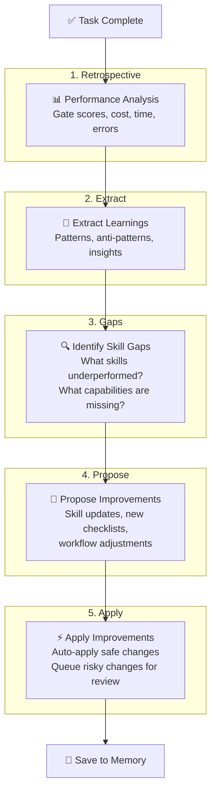

# Self-Improvement Loop

## Purpose

Sau mỗi task hoàn thành, agent **tự đánh giá → tự học → tự cải thiện**. Cụ thể:
- Phân tích performance (gate scores, cost, time)
- Trích xuất patterns và anti-patterns mới
- Xác định skill gaps và đề xuất cải tiến
- Tự cập nhật skills/workflows nếu cải tiến đã được chứng minh

**Nguyên tắc**: Agent sau 10 tasks phải tốt hơn đáng kể so với task đầu tiên.

---

## When to Use

- **ALWAYS** after completing any pipeline (`/wf_e2e`, `/wf_feature_add`)
- After a phase gate FAIL (learn from failure)
- After user gives feedback on quality issues
- Periodically (every 5 tasks) for deep retrospective

---

## The Improvement Cycle



---

## Phase 1: Retrospective Analysis

After task completion, automatically analyze:

### 1a. Gate Score Analysis

```markdown
## Gate Score Retrospective

| Phase | Score | vs History Avg | Trend |
|:---|:---:|:---:|:---:|
| Research | 7.6 | 7.8 (-0.2) | ↘️ |
| BRD | 8.3 | 7.5 (+0.8) | ↗️ |
| Tech | 6.9 | 7.2 (-0.3) | ↘️ |
| Code | 7.8 | 7.0 (+0.8) | ↗️ |

### Observations
- BRD quality improved after adding debate protocol → PAT-012
- Tech design dropped because DDD section was thin → investigate
```

### 1b. Cost Analysis

```markdown
## Cost Retrospective

| Phase | Budget | Actual | Variance |
|:---|:---:|:---:|:---:|
| Research | 80K | 65K | -19% ✅ |
| BRD | 300K | 340K | +13% ⚠️ |
| Tech | 250K | 230K | -8% ✅ |

### Observations
- BRD over budget due to 3 revision cycles → need better initial prompts
- Research under budget → can afford more depth
```

### 1c. Error Analysis

```markdown
## Error Retrospective

| Error | Phase | Recovery Used | Time Lost | Preventable? |
|:---|:---|:---|:---:|:---:|
| Build fail | Code | Auto-fix 2x | 10min | ✅ Better entity mapping |
| Gate REVISE | Tech | Auto-revise 1x | 15min | ✅ Add DDD checklist |
| Test fail | Test | Manual fix | 20min | ✅ State machine coverage |
```

---

## Phase 2: Extract Learnings

From the retrospective, extract concrete learnings:

### Pattern Extraction Rules

```
IF gate score improved after a specific action:
  → Extract as PAT-NNN (new pattern)

IF gate score dropped in a dimension:
  → Root cause → Extract as ANTI-NNN (anti-pattern)

IF a decision was made that worked well:
  → Log in decision_history with "REUSE" tag

IF cost was under budget due to model routing:
  → Log in tech-insights.md
```

### Learning Format

```markdown
## Learning: {Title}
- **Source**: Task TASK-{NNN}, Phase {N}
- **Type**: Pattern / Anti-Pattern / Domain / Technical
- **Confidence**: 🟢 Proven (3+ uses) / 🟡 Likely (1-2 uses) / 🔴 Hypothesis
- **Description**: {What was learned}
- **Action**: {How to apply in future}
```

---

## Phase 3: Identify Skill Gaps

### Gap Detection Rules

```
FOR each skill used in pipeline:
  IF skill's output caused gate REVISE/FAIL:
    → Skill gap detected
    → Log in skill_effectiveness.md
    → Add to improvement queue

FOR each phase that scored < 7.0:
  → Analyze which skill was responsible
  → Check if skill's checklist is complete
  → Identify missing checklist items

FOR each error that took > 10min to resolve:
  → Check if a skill could have prevented it
  → If no skill exists → flag as new skill candidate
```

### Gap Report Format

```markdown
## Skill Gap Report — TASK-{NNN}

### Underperforming Skills
| Skill | Issue | Proposed Fix |
|:---|:---|:---|
| tech-design-generator | DDD section thin | Add DDD aggregate checklist |
| auto-test-generator | State machine tests miss edge cases | Add transition matrix test |

### Missing Capabilities
| Gap | Impact | Proposed New Skill |
|:---|:---|:---|
| No API versioning guidance | Medium | api-versioning-patterns |
| No caching strategy template | Low | caching-strategy |

### Skill Update Queue
1. [HIGH] tech-design-generator: add DDD checklist to TECH_TEMPLATES
2. [MED] auto-test-generator: add state matrix exhaustive test pattern
3. [LOW] code-generator: improve JPA @ManyToMany handling
```

---

## Phase 4: Propose Improvements

### Auto-Safe Improvements (apply immediately)

These changes are safe to auto-apply:

| Type | Example | Criteria |
|:---|:---|:---|
| Add checklist item | "Verify DDD aggregates have IDs" | Adding, not modifying |
| Add template section | New section in TECH_TEMPLATES | Additive |
| Update gate checklist | New validation check | Additive |
| Update cost profile | Adjust token budget based on actual | Config only |
| Add anti-pattern entry | Document known failure | Memory only |

### Queue-For-Review Improvements (need validation)

| Type | Example | Why Review Needed |
|:---|:---|:---|
| Modify skill logic | Change debate protocol | Could break existing flow |
| New skill creation | api-versioning-patterns | Architecture decision |
| Modify workflow sequence | Reorder phases | Could break pipeline |
| Change gate thresholds | Lower PASS from 7.0 to 6.5 | Quality impact |

---

## Phase 5: Apply Improvements

### Auto-Apply Protocol

```
1. Classify improvement as SAFE or REVIEW-NEEDED
2. For SAFE improvements:
   a. Create improvement branch: improvement/{skill-name}-{date}
   b. Apply changes to skill/workflow files
   c. Verify: no existing tests/checks broken
   d. Commit: "improve({skill}): {description} [auto-learned from TASK-{NNN}]"
   e. Log in skill_effectiveness.md
3. For REVIEW-NEEDED improvements:
   a. Add to `.agent/memory/improvement_queue.md`
   b. Include in next session's startup report
   c. Wait for human approval or next retrospective
```

### Improvement Commit Format

```bash
git commit -m "improve({skill-name}): {what changed}

Source: TASK-{NNN} retrospective
Trigger: Gate score {dimension} was {score} (below 7.0)
Learning: {PAT/ANTI-NNN description}
Expected impact: +{X}% in {dimension} for future tasks"
```

---

## Metrics Dashboard

Maintained in `.agent/memory/metrics_dashboard.md`:

```markdown
# Agent Performance Dashboard

## Overall Metrics (Last 10 Tasks)

| Metric | Value | Trend |
|:---|:---:|:---:|
| Average gate score | 7.6 | ↗️ +0.3 |
| Tasks completed | 10 | — |
| Success rate | 90% | ↗️ +10% |
| Avg cost per task | $18.50 | ↘️ -15% |
| Avg duration | 2.5h | ↘️ -20% |
| Auto-resolve rate | 85% | ↗️ +5% |
| Human escalations | 1.5/task | ↘️ -30% |

## Skill Performance (Top 5 Used)

| Skill | Uses | Avg Score Impact | Trend |
|:---|:---:|:---:|:---:|
| brd-generator | 8 | +0.8 | ↗️ |
| tech-design-generator | 7 | +0.2 | → |
| code-generator | 5 | +0.5 | ↗️ |
| phase-gate-controller | 10 | — | → |
| autonomous-deliberation | 10 | +0.3 | ↗️ |

## Learning Velocity

| Period | Patterns | Anti-Patterns | Improvements Applied |
|:---|:---:|:---:|:---:|
| Week 1 | 5 | 3 | 2 |
| Week 2 | 8 | 2 | 5 |
| Week 3 | 3 | 1 | 4 |

## Quality Trend (Gate Scores Over Time)

| Task | Ph0 | Ph1 | Ph2 | Ph3 | Ph4 | Avg |
|:---|:---:|:---:|:---:|:---:|:---:|:---:|
| 1 | 6.5 | 6.8 | 6.2 | 6.0 | — | 6.4 |
| 2 | 7.0 | 7.2 | 6.8 | 7.0 | 6.5 | 6.9 |
| 5 | 7.8 | 8.0 | 7.5 | 7.8 | 7.2 | 7.7 |
| 10 | 8.5 | 8.8 | 8.0 | 8.2 | 7.8 | 8.3 |
```

---

## Trigger: When to Run

| Trigger | Depth | Duration |
|:---|:---|:---:|
| After each task | Quick retro (Phase 1-2) | 5 min |
| After gate FAIL | Deep analysis (Phase 1-3) | 10 min |
| Every 5 tasks | Full cycle (Phase 1-5) | 15 min |
| User feedback | Targeted improvement (Phase 3-5) | 10 min |

---

## Guardrails

- **DO** run at least quick retro after EVERY task
- **DO** save all learnings to memory (non-negotiable)
- **DO** track metrics over time for trend analysis
- **DO** auto-apply only SAFE improvements
- **DO NOT** auto-apply workflow sequence changes
- **DO NOT** lower gate thresholds without human approval
- **DO NOT** delete past learnings — they form institutional knowledge
- **DO NOT** apply improvements that haven't been validated by at least 1 task
- **MAX 5** auto-improvements per retrospective cycle

## Limitations
- Self-improvement is bounded by the agent's ability to analyze its own output — blind spots exist.
- Pattern extraction relies on gate scores — if gate checklists are incomplete, learnings may be shallow.
- Apply only to skills/workflows within this project — does not modify global agent configuration.
