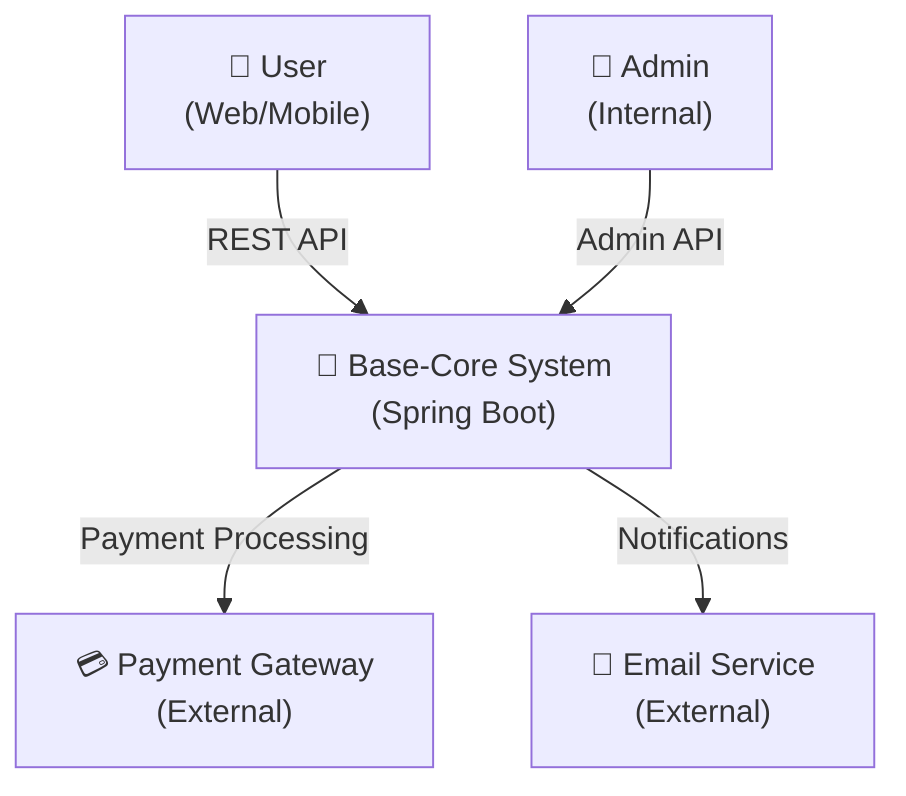
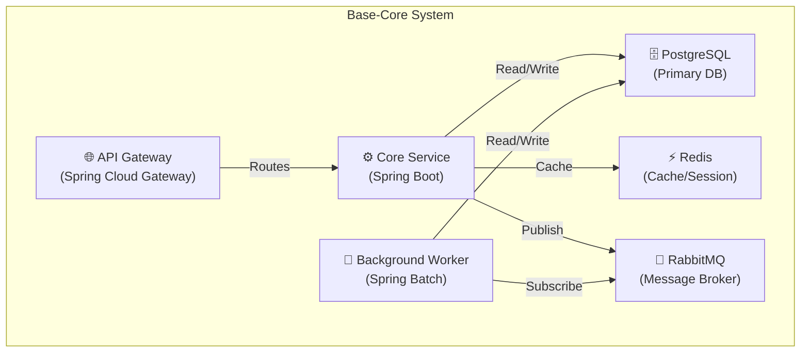
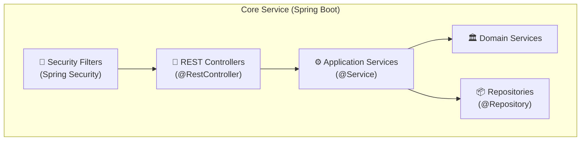
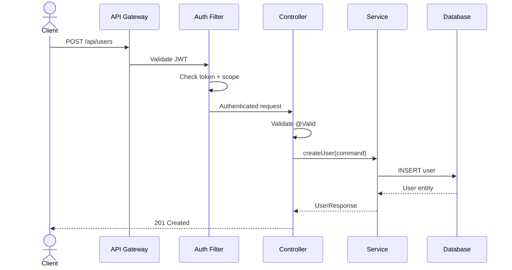
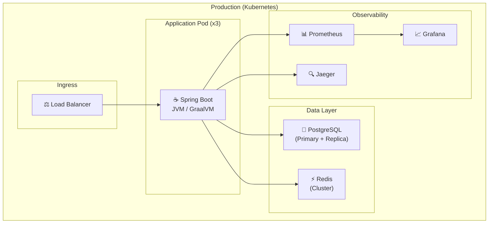

# Software Architecture Documentation & Visualization

Comprehensive guide for documenting, visualizing, and assessing software architecture quality. Covers C4 Model, Architecture Decision Records, diagramming, and quality attributes analysis.

## Use this skill when

- Documenting system architecture for stakeholders
- Creating architecture diagrams (C4, sequence, component)
- Writing Architecture Decision Records (ADR)
- Assessing quality attributes (performance, scalability, security)
- Onboarding new team members to system architecture
- Preparing architecture review presentations

## Do not use this skill when

- You need to choose between architecture patterns (use `architecture-patterns`)
- You need domain modeling (use `domain-driven-design`)
- You need implementation-level patterns (use `design-patterns`)

---

## C4 Model

### Level 1: System Context

Shows the system and its interactions with users and external systems.



**Template:**
```markdown
## System Context
| Element | Type | Description |
|---------|------|-------------|
| [System Name] | Software System | [What it does] |
| [User Type] | Person | [Who uses it and why] |
| [External System] | External System | [What it provides] |
```

### Level 2: Container

Shows the high-level technology choices and how containers communicate.



### Level 3: Component

Shows the internal components of a container.



### Level 4: Code

Maps to actual package structure. See `architecture-patterns` skill for detailed package layouts.

---

## Architecture Decision Records (ADR)

### Template

```markdown
# ADR-NNN: [Decision Title]

## Status
[Proposed | Accepted | Deprecated | Superseded by ADR-XXX]

## Context
[What is the issue that we're seeing that is motivating this decision?]

## Decision
[What is the change that we're proposing and/or doing?]

## Consequences

### Positive
- [Benefit 1]
- [Benefit 2]

### Negative
- [Trade-off 1]
- [Trade-off 2]

### Risks
- [Risk 1 + mitigation]

## Alternatives Considered

### Alternative 1: [Name]
- Pros: ...
- Cons: ...
- Why rejected: ...
```

### ADR Naming Convention

```
docs/adr/
├── 001-use-spring-boot-4.md
├── 002-choose-hexagonal-architecture.md
├── 003-postgresql-as-primary-database.md
├── 004-redis-for-caching-and-sessions.md
└── 005-jwt-with-refresh-token-rotation.md
```

---

## Architecture Diagrams

### Sequence Diagram (API Flow)



### Deployment Diagram



---

## Quality Attributes Assessment (ATAM)

### Quality Attribute Table

| Attribute | Priority | Measure | Target |
|-----------|----------|---------|--------|
| **Performance** | High | Response time (P95) | < 200ms |
| **Scalability** | High | Concurrent users | 10K+ |
| **Availability** | High | Uptime SLA | 99.9% |
| **Security** | Critical | Vulnerabilities | Zero critical |
| **Maintainability** | Medium | Code coverage | > 80% |
| **Testability** | Medium | Test execution time | < 5 min |
| **Deployability** | Medium | Deploy frequency | Daily |
| **Observability** | Medium | MTTR | < 30 min |

### Trade-off Analysis

```
Performance ←——→ Maintainability
  (Cache everything)    (Keep it simple)

Consistency ←——→ Availability
  (Strong consistency)  (Eventual consistency)

Security ←——→ Usability
  (MFA everywhere)      (Frictionless login)
```

---

## Code Style Rules (Cross-cutting)

### General Principles

- **Early return pattern**: Use guard clauses over nested conditions
- Avoid code duplication through reusable functions
- Decompose methods > 20 lines into smaller methods
- Avoid deep nesting (max 3 levels)
- Keep files under 200 lines when possible

### Naming Conventions

- **AVOID** generic names: `utils`, `helpers`, `common`, `shared`
- **USE** domain-specific names: `OrderCalculator`, `UserAuthenticator`, `InvoiceGenerator`
- Follow bounded context naming patterns
- Each module should have a single, clear purpose

### Anti-Patterns

- ❌ Business logic in controllers or infrastructure
- ❌ `utils.java` with 50 unrelated functions
- ❌ Database queries directly in controllers
- ❌ Missing separation of concerns
- ❌ NIH syndrome (building what libraries already solve)

---

## References

- `skills/architecture-patterns/` — Clean/Onion/Hexagonal deep-dive
- `skills/architect-review/` — Architecture review process
- `skills/senior-architect/` — Comprehensive architecture toolkit
- `skills/domain-driven-design/` — DDD patterns
- `skills/mermaid-diagram-enterprise/` — Professional Mermaid diagrams with syntax guard, styling presets, and quality gate
- `skills/mermaid-diagram-agent/` — Mermaid diagrams for AI Agent Systems (LangGraph, AutoGen, CrewAI)
