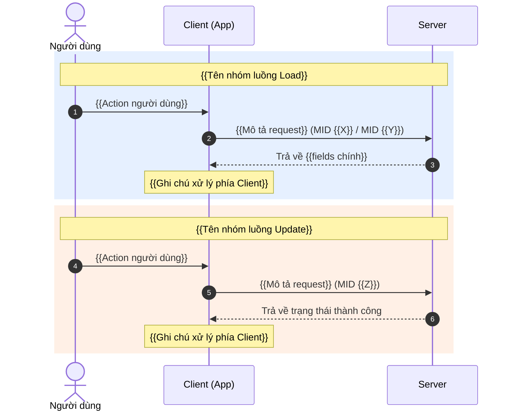

# Client Integration Guide — {{FEATURE_NAME}}

_Tài liệu tích hợp cho team Client/Mobile._
_Generated on {{DATE}} — Change: `{{CHANGE_NAME}}`_

---

## 1. Danh sách MID

<!--
Phân loại MID theo mục đích sử dụng.
Chỉ liệt kê MID liên quan đến feature này.
Nếu MID đã có sẵn bị ảnh hưởng (ví dụ: login response thêm fields), ghi rõ.
-->

*   **Mô tả tên mid, chức năng:** MID {{X}} ({{mô tả}}), MID {{Y}} ({{mô tả}}).
*   **Mô tả tên mid:** MID {{Z}} ({{mô tả}}).

<!--
Các loại phân nhóm khác nếu cần:
*   **Action (Thực hiện hành động):** MID {{W}} ({{mô tả}}).
*   **Query (Truy vấn dữ liệu):** MID {{V}} ({{mô tả}}).
-->

---

## 2. Sequence Diagram

<!--
Quy tắc:
- Chỉ vẽ 3 thành phần: Người dùng, Client (App), Server
- KHÔNG vẽ chi tiết internal server (Handler, DB, Cache)
- Ghi rõ MID number ở mỗi bước gọi API
- Nhóm MID cùng chức năng vào 1 rect block
- Màu xanh cho Load, cam cho Update/Action
-->



---

## 3. API Request / Response Specs

### A. {{Tên nhóm — ví dụ: Luồng Load Config}} (MID {{X}}, MID {{Y}})

<!--
Nếu nhiều MID cùng trả về response giống nhau (ví dụ: login, active đều trả soundNotiEnabled),
gom chung vào 1 section.
-->

{{Mô tả ngắn khi nào luồng này được gọi.}}

**Server Response:**
```json
{
  "code": "00",
  "des": "Thành công",
  // ... các field response mặc định của luồng ...

  "{{field_1}}": "{{value_1}}",
  "{{field_2}}": "{{value_2}}"
}
```

### B. {{Tên MID riêng — ví dụ: Luồng Cập nhật Cấu hình}} (MID {{Z}})

{{Mô tả ngắn khi nào MID này được gọi.}}

**Client Request (MID {{Z}}):**
```json
{
  "mid": "{{Z}}",
  "sessionId": "xxxxx-yyyyy-zzzzz",
  "user": "{{phone}}",
  "cif": "{{cif}}",
  "clientId": {{clientId}},
  // --- Fields của feature ---
  "{{field_1}}": "{{value_1}}",
  "{{field_2}}": "{{value_2}}"
}
```

**Server Response (MID {{Z}}):**
```json
{
  "mid": "{{Z}}",
  "code": "00",
  "des": "Success"
}
```

---

## 4. Error Codes

<!--
Liệt kê các error code Client có thể nhận được.
Lấy từ handler code: VnpayException, CommonMessageCode, etc.
-->

| Code | Mô tả | Khi nào xảy ra |
|------|--------|----------------|
| `00` | Thành công | Request hợp lệ, xử lý thành công |
| `01` | Tham số không hợp lệ | {{Điều kiện cụ thể}} |
| `96` | Lỗi hệ thống | {{Điều kiện cụ thể}} |

---

## 5. Lưu ý tích hợp

<!--
Ghi nhận các lưu ý quan trọng cho team Client khi tích hợp.
-->

### Fallback Values
- Nếu Server chưa có dữ liệu (user chưa từng cài đặt), response sẽ trả về **giá trị mặc định**:
  - `{{field_1}}`: `{{default_value_1}}`
  - `{{field_2}}`: `{{default_value_2}}`

### Validation Rules
- `{{field_1}}`: {{Mô tả rule — ví dụ: chỉ chấp nhận 'Y' hoặc 'N'}}
- `{{field_2}}`: {{Mô tả rule — ví dụ: phải thuộc enum [A, B, C]}}

### Dependencies
- {{Mô tả dependency — ví dụ: Cần gọi MID X trước khi gọi MID Z}}
- {{Hoặc: Feature này yêu cầu app version >= X.Y.Z}}

### Đồng bộ trạng thái
- {{Mô tả cách đồng bộ — ví dụ: Cấu hình được trả về trong luồng Login/Active, Client KHÔNG cần gọi API riêng}}
