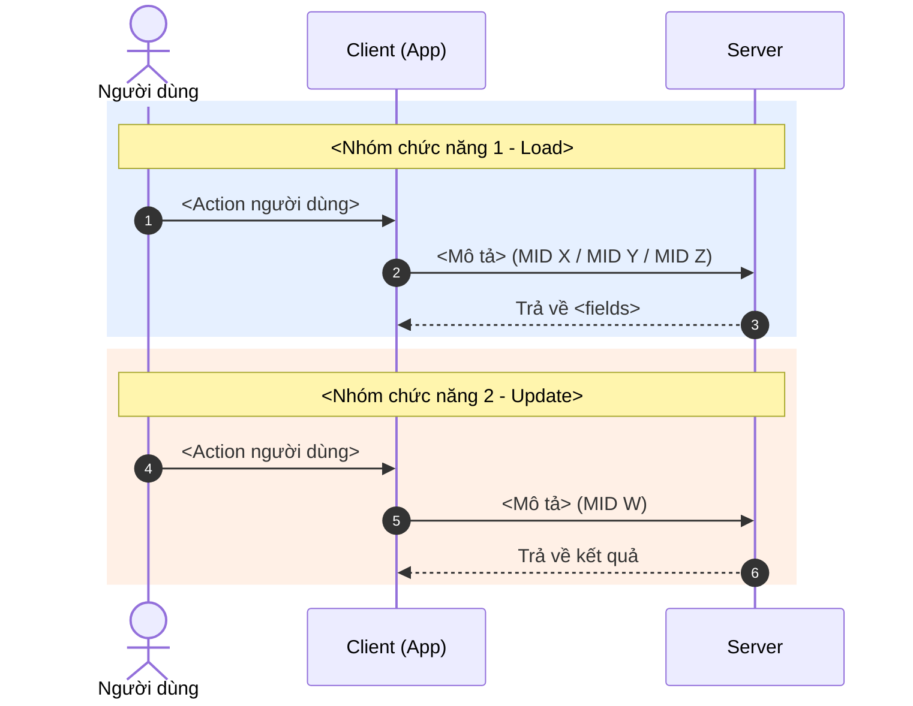

Tạo tài liệu `client_integration.md` cho team Client/Mobile tích hợp. Dựa vào design ban đầu + context code thay đổi.

**Pipeline position**: ... → `/wf_openspec_apply` → `/wf_integ_test` ⟂ **`/wf_client_doc`** → `/wf_archive` → `/wf_gen_change_doc`

> Chạy **song song** với `/wf_integ_test`. Cả hai đều dựa vào trạng thái sau apply.

---

**Input**: Argument after `/wf_client_doc` is the change name (e.g., `/wf_client_doc sound-notification`).

**Output**: `openspec/changes/<name>/client_integration.md`

**Template**: Sử dụng template chuẩn tại `.agent/skills/writing-skills/templates/client_integration_template.md`

**Steps**

## 1. Load context từ change

a. **Validate** change tồn tại ở `openspec/changes/<name>/`
b. **Read** files:
   - `design.md` — kiến trúc, flow overview
   - `specs/` — delta specs (MID descriptions, business rules)
   - `tasks.md` — danh sách code changes thực tế
   - `proposal.md` — mô tả tính năng tổng quan
c. **Read** template tại `.agent/skills/writing-skills/templates/client_integration_template.md`

## 2. Extract danh sách MID từ source code

a. **Đọc `Mid.java`** — trích MID mới/thay đổi:
   ```
   // Tìm MID numbers liên quan đến change
   // Phân loại theo chức năng
   ```

b. **Phân loại MID** theo mục đích sử dụng:
   - **Load Config**: MID trả về cấu hình/trạng thái cho Client (các luồng Login, Active, Get...)
   - **Update Config**: MID nhận dữ liệu mới từ Client để cập nhật
   - **Action**: MID thực hiện một hành động cụ thể (transfer, OTP...)
   - **Query**: MID truy vấn dữ liệu (list, search...)

c. **Xác định MID đã có sẵn bị ảnh hưởng**: Các MID login/active có thể response thêm fields mới.

## 3. Extract Request/Response từ DTO classes

Cho mỗi MID liên quan:

a. **Đọc Request DTO** (`*Request.java`):
   - List tất cả fields
   - Ghi nhận validation rules (@NotNull, @NotBlank, enum...)
   - Tạo JSON example với dữ liệu mẫu

b. **Đọc Response DTO** (`*Response.java` hoặc `BaseResponse`, `ActiveMobileRp`...):
   - List tất cả fields trả về
   - Ghi nhận default values, fallback logic
   - Tạo JSON example

c. **Xác định Error codes**: Từ handler → tìm các VnpayException, error code mapping.

## 4. Generate Sequence Diagram

Vẽ Mermaid Sequence Diagram đơn giản với 3 thành phần: **Người dùng → Client (App) → Server**.

**Quy tắc vẽ diagram:**
- KHÔNG vẽ thành phần con phía server (Handler, DB, Cache...)
- Chỉ ghi MID number ở mỗi bước gọi API
- Nhóm các MID cùng chức năng vào 1 rect block
- Sử dụng màu phân biệt: xanh cho Load, cam cho Update/Action

**Template diagram:**


## 5. Generate client_integration.md

Tổng hợp tất cả thành tài liệu hoàn chỉnh theo template, lưu tại `openspec/changes/<name>/client_integration.md`.

**Nội dung bắt buộc:**
- [ ] Tên feature + mô tả ngắn gọn
- [ ] Danh sách MID (phân loại theo chức năng)
- [ ] Sequence Diagram (Mermaid)
- [ ] API Specs cho từng MID (Request JSON + Response JSON)
- [ ] Error codes + mô tả
- [ ] Lưu ý tích hợp (fallback values, validation rules, dependencies...)

## 6. Verify & Save

a. **Verify** document có đủ thông tin cho team Client tích hợp
b. **Verify** JSON examples khớp với actual DTO fields
c. **Save** tại `openspec/changes/<name>/client_integration.md`
d. **Show summary**

---

**Output On Success**

```
## Client Integration Doc Generated

**Change:** <change-name>
**File:** openspec/changes/<name>/client_integration.md

### Content Summary
| Section | Items |
|---------|-------|
| MIDs - Load Config | N |
| MIDs - Update Config | M |
| Sequence Diagrams | K |
| API Specs | N+M |
| Error Codes | P |

Ready for Client/Mobile team review.
```

---

**Guardrails**

- MUST đọc source code thật (DTO, Handler) — KHÔNG đoán fields
- MUST dùng template chuẩn từ `.agent/skills/writing-skills/templates/`
- MUST vẽ Sequence Diagram đơn giản (User → Client → Server only)
- MUST include JSON examples cho cả Request VÀ Response
- MUST ghi nhận MID đã có sẵn bị ảnh hưởng (ví dụ: login response thêm fields)
- MUST phân loại MID theo chức năng (Load / Update / Action / Query)
- DO NOT vẽ chi tiết internal server (Handler, DB, Cache) trong diagram
- DO NOT push lên Confluence — chỉ lưu file local
- DO NOT đoán business logic — lấy từ design.md + specs/ + actual code
