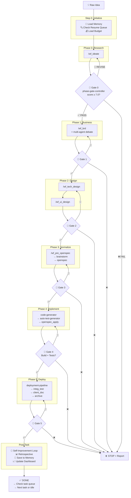

# Workflow: End-to-End Pipeline (`/wf_e2e`)

## Overview

Orchestrator chạy **toàn bộ pipeline tự động** từ raw idea → deployed app.

**3 trụ cột autonomous**:
1. 🧠 **Long-term Memory** — nhớ qua mỗi session, tái sử dụng learnings
2. 🚪 **Auto Phase Gates** — tự validate + go/no-go không cần human
3. 🔄 **Self-Improvement** — tự học + cải thiện sau mỗi task

---

## Trigger

```
/wf_e2e "{idea description}" --project {project-name}
```

---

## Full Pipeline (with Autonomous Controls)



---

## Step 0: Initialize (AUTONOMOUS)

```markdown
### 0a. Load Memory
READ .agent/memory/index.md
READ .agent/memory/learnings/patterns.md
READ .agent/memory/learnings/anti-patterns.md
IF project exists in memory:
  READ .agent/memory/context/{project}/project_summary.md

### 0b. Check Resume Queue
READ .agent/task_queue/running/
IF interrupted task found:
  → Load checkpoint → resume from last gate
  → SKIP to that phase

### 0c. Initialize
1. Parse idea and project name
2. Create project_docs/{project-name}/
3. Load budget: agent-config/budget_overview.yaml
4. Create git branch: feature/{project-name}-e2e
5. Create task in .agent/task_queue/running/
6. Apply learnings from memory to pipeline config
```

---

## Phase Execution Loop (AUTONOMOUS)

For each phase:

```markdown
### Execute Phase
1. Load cost profile for this phase
2. RECALL memory — any relevant patterns/anti-patterns?
3. Execute phase workflow
4. SAVE phase artifacts

### Run Phase Gate (AUTONOMOUS — no human needed)
5. Load phase-gate-controller skill
6. Validate output against checklist
7. Score 4 dimensions (Completeness, Consistency, Quality, Actionability)
8. Calculate composite score

### Auto-Decide
9. IF score ≥ 7.0:
     → Log [PASS] to phase_gates.md
     → Commit: "feat({project}): phase-{N} complete [gate: {score}]"
     → SAVE learnings to memory
     → Proceed to next phase

   ELIF score ≥ 5.0:
     → Log [REVISE] — identify weak dimensions
     → Auto-fix: re-run quality-relevant steps only
     → Re-score (max 2 revision cycles)
     → IF improved ≥ 7.0 → PASS
     → IF still < 7.0 after 2x → treat as FAIL

   ELIF score < 5.0:
     → Log [FAIL] → STOP protocol
     → Save checkpoint
     → Generate status report
     → Move task to .agent/task_queue/failed/
     → STOP and wait for human
```

---

## Step 1-5: Phase Details

### Phase 0: Research (`/wf_ideate`)
- Budget: 80K tokens
- Gate checks: research_notes.md, competitor_analysis.md exist
- Commit: `feat({project}): phase-0 research [gate: X.X]`

### Phase 1: BRD (`/wf_brd`)
- Budget: 300K tokens
- Gate checks: 9 BRD + 3 debate artifacts, quality gate APPROVED
- Commit: `docs({project}): phase-1 BRD [gate: X.X]`

### Phase 2: Design (`/wf_tech_design` + `/wf_ui_design`)
- Budget: 430K tokens (250K + 180K)
- Gate checks: 10 tech + 7 UI docs, no 🔴 Critical issues
- Commit: `docs({project}): phase-2 design [gate: X.X]`

### Phase 3: OpenSpec (`/wf_pre_openspec` + brainstorm + `/wf_openspec`)
- Budget: 300K tokens
- Gate checks: OpenSpec artifacts generated, tasks actionable
- Commit: `docs({project}): phase-3 openspec [gate: X.X]`

### Phase 4: Code Gen (code-generator + auto-test-generator)
- Budget: 200K tokens
- Gate checks: BUILD SUCCESS, tests PASS, coverage > 60%
- Commit: `feat({project}): phase-4 code [gate: X.X]`

### Phase 5: Deploy (deployment-pipeline + integ_test + archive)
- Budget: 80K tokens
- Gate checks: all services healthy, smoke tests pass
- Commit: `deploy({project}): phase-5 deploy [gate: X.X]`

---

## Post-Task: Self-Improvement (AUTONOMOUS)

After pipeline completes (success or partial):

```markdown
### Load self-improvement-loop skill
1. Retrospective Analysis
   - Gate scores vs historical average
   - Cost vs budget
   - Errors encountered and recovery time

2. Extract Learnings
   - New patterns → .agent/memory/learnings/patterns.md
   - New anti-patterns → .agent/memory/learnings/anti-patterns.md
   - Domain insights → .agent/memory/learnings/domain-knowledge.md

3. Identify Skill Gaps
   - Which skills underperformed?
   - What capabilities are missing?

4. Apply Safe Improvements
   - Add checklist items to gate controllers
   - Update cost profiles based on actual usage
   - Log improvement in improvement_queue.md

5. Update Dashboard
   - .agent/memory/metrics_dashboard.md
   - .agent/memory/history/completed_tasks.md
   - .agent/memory/history/gate_scores.md

6. Commit improvements
   - "improve(agent): post-task learnings from {project}"
```

---

## After Task: Next Task or Idle

```markdown
### Continuous Runner Protocol
1. Move completed task to .agent/task_queue/completed/
2. Check .agent/task_queue/pending/ — any new tasks?
   → YES: Execute next highest-priority task
   → NO: Check improvement_queue.md
     → YES: Apply queued improvements
     → NO: Consolidate memory if > 5 tasks since last
       → Done: Report IDLE status
```

---

## Error Recovery

| Error | Phase | Recovery | Human Needed? |
|:---|:---|:---|:---:|
| Gate PASS (≥ 7.0) | Any | Auto-proceed | ❌ |
| Gate REVISE (5.0-6.9) | Any | Auto-fix, max 2x | ❌ |
| Gate FAIL (< 5.0) | Any | STOP + report | ✅ |
| Tier 1 decision | Any | Auto-decide | ❌ |
| Tier 2 decision | Any | Multi-agent debate | ❌ |
| Tier 3 decision | Any | STOP + escalate | ✅ |
| Build failure | 4 | Auto-fix, max 3x | ❌ |
| Test failure (< 5) | 4 | Auto-fix | ❌ |
| Test failure (> 5) | 4 | STOP + analyze | ✅ |
| Budget 80% | Any | Downgrade model tier | ❌ |
| Budget 95% | Any | STOP + report | ✅ |
| Session crash | Any | Auto-resume from checkpoint | ❌ |

---

## Checkpoint & Resume

Saved at every gate:
```yaml
# project_docs/{project}/checkpoint.yaml
project: "{project-name}"
mode: "e2e"
current_phase: 3
completed_phases: [0, 1, 2]
gate_scores: {0: 7.6, 1: 8.3, 2: 7.2}
total_tokens: 630000
last_commit: "abc1234"
started_at: "2026-07-02T10:00:00Z"
```

Resume: `/wf_e2e --resume {project-name}`

---

## Guardrails

- **DO** load memory at pipeline start — always
- **DO** run phase gate at every boundary — no exceptions
- **DO** save checkpoint at every gate — crash recovery
- **DO** run self-improvement after every task — learning
- **DO** commit at every gate pass — traceability
- **DO NOT** skip gates — even if "looks good"
- **DO NOT** continue after FAIL without human
- **DO NOT** exceed budget without approval
- **DO NOT** auto-decide Tier 3 — always escalate
