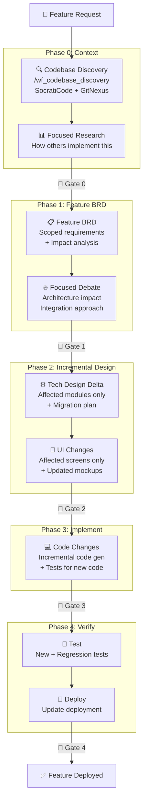

# Workflow: Feature Add (`/wf_feature_add`)

## Overview

Pipeline cho **thêm tính năng mới** vào sản phẩm đã có. Khác với `/wf_e2e` (greenfield), workflow này phân tích codebase hiện tại trước khi thiết kế, và chỉ tạo incremental docs + code.

---

## Trigger

```
/wf_feature_add "{feature description}" --project {project-name}
```

**Ví dụ**:
```
/wf_feature_add "Thêm tính năng thông báo qua Zalo khi đến hạn đóng tiền" --project rentivo
/wf_feature_add "Add social login with Google/Facebook" --project rentivo
```

---

## Khác biệt so với `/wf_e2e`

| Aspect | `/wf_e2e` (Greenfield) | `/wf_feature_add` (Incremental) |
|:---|:---|:---|
| Input | Raw idea | Feature description + existing codebase |
| Research | Full competitor analysis | Focused: how others implement this feature |
| BRD | 9 full BRD docs | 1 Feature BRD (scoped) |
| Tech Design | 10 full docs | Incremental design (affected modules only) |
| UI/UX | 7 full docs | Affected screens only |
| Code Gen | Full project scaffold | Incremental changes to existing code |
| Risk Level | Always HIGH (new project) | Varies (LOW-HIGH based on scope) |

---

## Full Pipeline



---

## Steps

### Step 0: Initialize (AUTONOMOUS)

```markdown
### 0a. Load Memory
READ .agent/memory/index.md
READ .agent/memory/learnings/patterns.md
READ .agent/memory/learnings/anti-patterns.md
READ .agent/memory/context/{project}/project_summary.md
→ Apply learnings: skip known anti-patterns, reuse proven patterns
```

1. Parse feature description
2. Identify existing project: `project_docs/{project-name}/`
3. Verify project exists (has prior BRD/tech docs)
4. **Load project memory** — architecture decisions, known issues, past features
5. Create feature branch: `feature/{project-name}-{feature-slug}`
6. Create feature directory: `project_docs/{project-name}/features/{feature-slug}/`
7. Initialize cost tracking
8. Create task in `.agent/task_queue/running/`

### Step 1: 🔍 Codebase Discovery (Phase 0)

**If source code exists**, analyze current state:

```
/wf_codebase_discovery {project-name}
```

OR manually using skills:
- Read existing tech design → understand current architecture
- `gitnexus query "{feature keywords}"` → find related code
- `gitnexus context "{module}"` → understand affected modules
- `socraticode codebase_search` → find patterns

**Output**: `features/{feature-slug}/codebase_context.md`
```markdown
## Current Architecture
- Modules: {list}
- Tech stack: {from system-overview}
- Related existing features: {list}

## Impact Zones
- Modules affected: {list with confidence}
- Database changes: {tables to add/modify}
- API changes: {endpoints to add/modify}
- UI changes: {screens to add/modify}

## Reuse Opportunities
- Existing services: {list that can be reused}
- Existing patterns: {patterns to follow}
```

### Step 2: 📊 Focused Research (Phase 0)

Lightweight research focused on the specific feature:

1. Search how top competitors implement this feature
2. Find 3-5 GitHub repos with similar feature implementation
3. Document patterns and approaches found

**Output**: `features/{feature-slug}/feature_research.md`

### 🚪 Gate 0: Context → BRD

Run `phase-gate-controller`:
- Codebase context complete
- Impact zones identified
- Research has ≥ 3 references

### Step 3: 📋 Feature BRD (Phase 1)

Generate **scoped BRD** (not full 9 docs):

**Output**: `features/{feature-slug}/feature_brd.md`

```markdown
# Feature BRD: {Feature Name}

## 1. Feature Overview
- Description, goals, success criteria

## 2. User Stories
- As a {role}, I want {feature}, so that {benefit}

## 3. Functional Requirements
- FR-F001: {requirement} (Given/When/Then)
- FR-F002: ...

## 4. Business Rules
- BR-F001: {rule}

## 5. Impact Analysis
- Existing modules affected: {list}
- New modules needed: {list}
- Database changes: {DDL}
- API changes: {new/modified endpoints}
- UI changes: {screens}

## 6. State Changes (if any)
- New states: {list}
- Modified transitions: {list}

## 7. Non-Functional Requirements
- Performance impact
- Security considerations

## 8. Acceptance Criteria
- AC-001: {criterion}
```

### Step 4: 🔥 Focused Debate (Phase 1)

Only if feature is MODERATE/HIGH risk:

| Agent | Focus |
|:---|:---|
| 🏗️ **Architect** | Integration approach, module boundaries |
| 😈 **Skeptic** | Regression risk, breaking changes |
| 🎯 **Pragmatist** | MVP scope, incremental delivery |

**Output**: `features/{feature-slug}/architecture_decision.md`

### 🚪 Gate 1: BRD → Tech Design

Run `phase-gate-controller`:
- Feature BRD complete
- Impact analysis identifies all affected modules
- Architecture decision made (if risk ≥ MODERATE)

### Step 5: ⚙️ Tech Design Delta (Phase 2)

Generate **only changes** to existing tech design:

**Output**: `features/{feature-slug}/tech_design_delta.md`

```markdown
# Tech Design Delta: {Feature Name}

## 1. Module Changes
### Modified: {module-name}
- New classes: {list}
- Modified classes: {list}
- New interfaces: {list}

## 2. Domain Model Changes
- New entities: {list with fields}
- Modified entities: {field additions}
- New value objects: {list}

## 3. Database Migration
```sql
-- V{NNN}__{feature-slug}.sql
ALTER TABLE {table} ADD COLUMN ...;
CREATE TABLE {new_table} (...);
CREATE INDEX idx_...;
```

## 4. API Changes
### New Endpoints
| Method | Path | Auth | Description |
|:---|:---|:---|:---|

### Modified Endpoints
| Method | Path | Change | Backward Compatible? |
|:---|:---|:---|:---:|

## 5. Integration Points
- Existing services called: {list}
- New external integrations: {list}

## 6. Migration Plan
- Data migration: {if needed}
- Backward compatibility: {strategy}
- Rollback plan: {steps}
```

### Step 6: 🎨 UI Changes (Phase 2)

Generate **only affected screens**:
- New screen mockups (if any)
- Modified screen mockups
- New components needed

**Output**: `features/{feature-slug}/ui_changes.md` + `mockups/`

### 🚪 Gate 2: Design → Implement

Run `phase-gate-controller`:
- Tech design delta complete
- Database migration scripted
- API backward compatibility assessed

### Step 7: 💻 Implementation (Phase 3)

Using existing project code as base:

1. Apply database migration
2. Generate new entity/repo/service/controller code
3. Modify existing code (incremental changes)
4. Generate tests for new code
5. Run all tests (new + existing)

**Key difference from greenfield**: Uses `wf_openspec_apply` approach — modifies existing files, not creates from scratch.

### 🚪 Gate 3: Implement → Test

Run `phase-gate-controller`:
- Code compiles
- New tests pass
- Existing tests still pass (regression)

### Step 8: 🧪 Testing (Phase 4)

1. Unit tests for new code
2. Integration tests for new API endpoints
3. **Regression tests** — all existing tests still pass
4. Cross-feature testing — new feature doesn't break existing

### Step 9: 🚀 Deploy (Phase 4)

1. Update Docker configuration if needed
2. Run database migration
3. Rebuild and redeploy
4. Health checks + smoke tests
5. Feature-specific smoke test

### 🚪 Gate 4: Deploy → Complete

Run `phase-gate-controller`:
- All services healthy
- Feature endpoint responds correctly
- Existing endpoints unaffected

### Step 10: Auto-Commit & Report

```bash
git add .
git commit -m "feat({project}/{feature-slug}): {feature description}

Feature: {name}
Changes: {N} files modified, {M} files created
New APIs: {list}
DB Migration: V{NNN}
Tests: {T} new, {E} existing (all pass)"
```

---

## Feature Report

```
═══════════════════════════════════════
FEATURE ADD COMPLETE
═══════════════════════════════════════
Project:      {project-name}
Feature:      {feature-name}
Duration:     {time}
Tokens:       {N} (~${cost})

Changes:
  Modules affected: {list}
  Files modified:   {N}
  Files created:    {M}
  DB migrations:    {K}
  New APIs:         {L}
  New tests:        {T}
  Regression:       ✅ All pass

Gates Passed:  5/5
Commits:       {N}
Branch:        feature/{project}-{feature}
═══════════════════════════════════════
```

---

## Post-Task: Self-Improvement (AUTONOMOUS)

After feature pipeline completes:

```markdown
### Load self-improvement-loop skill
1. Retrospective: gate scores vs history, cost vs budget, errors
2. Extract learnings → save to .agent/memory/
   - New patterns → learnings/patterns.md
   - New anti-patterns → learnings/anti-patterns.md
   - Domain insights → learnings/domain-knowledge.md
3. Update project context → .agent/memory/context/{project}/
4. Update metrics → metrics_dashboard.md
5. Apply safe improvements to skills
6. Commit: "improve(agent): learnings from {project}/{feature}"
7. Move task to .agent/task_queue/completed/
8. Check queue for next task
```

---

## Error Recovery

| Error | Recovery | Human? |
|:---|:---|:---:|
| Codebase scan fails | Use existing docs as fallback | ❌ |
| Gate PASS (≥ 7.0) | Auto-proceed | ❌ |
| Gate REVISE (5.0-6.9) | Auto-fix, max 2 cycles | ❌ |
| Gate FAIL (< 5.0) | STOP + detailed report | ✅ |
| Regression test fails | Revert changes + analyze | ✅ |
| Migration conflict | Check schema + adjust | ❌ |
| Tier 1/2 decision | Auto-decide / debate | ❌ |
| Tier 3 decision | STOP + escalate | ✅ |
| Session crash | Auto-resume from checkpoint | ❌ |

---

## Checkpoint & Resume

Saved at every gate:
```yaml
# project_docs/{project}/features/{feature}/checkpoint.yaml
project: "{project-name}"
feature: "{feature-slug}"
mode: "feature_add"
current_phase: 2
completed_phases: [0, 1]
gate_scores: {0: 7.8, 1: 8.1}
total_tokens: 120000
last_commit: "abc1234"
```

Resume: `/wf_feature_add --resume {project-name}/{feature-slug}`

---

## Guardrails

- **DO** load memory at pipeline start — always
- **DO** analyze existing code BEFORE designing changes
- **DO** check backward compatibility for all API changes
- **DO** run regression tests (not just new tests)
- **DO** keep database migrations reversible when possible
- **DO** run self-improvement after every feature task
- **DO** save checkpoint at every gate boundary
- **DO NOT** modify existing BRD/tech docs — create delta docs
- **DO NOT** skip codebase discovery — it prevents conflicts
- **DO NOT** break existing features — regression tests are mandatory
- **DO NOT** skip gates or memory operations
