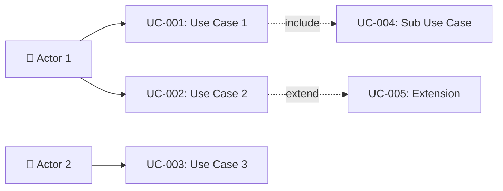

# Tài liệu phân tích nghiệp vụ: {{FEATURE_NAME}}

> Phân tích nghiệp vụ chi tiết — chia nhỏ theo use case, đặc tả ngữ nghĩa từng chức năng.

---

## 1. Tổng quan (Overview)

### 1.1 Bối cảnh nghiệp vụ (Business Context)
<!-- Tại sao tính năng này cần tồn tại? Bài toán business gì? -->

### 1.2 Mục tiêu (Objectives)
<!-- Mục tiêu business cần đạt -->

| # | Mục tiêu | KPI đo lường | Độ ưu tiên |
|---|---------|-------------|-----------|
| O-01 | ... | ... | High/Med/Low |

### 1.3 Phạm vi (Scope)

| In Scope | Out of Scope |
|----------|-------------|
| ... | ... |

### 1.4 Stakeholders & Actors

| Actor | Loại | Mô tả | Tương tác chính |
|-------|------|--------|----------------|
| {{Actor_1}} | Primary | ... | ... |
| {{Actor_2}} | Secondary | ... | ... |
| {{System_1}} | External System | ... | ... |

---

## 2. Use Case Diagram (tổng quan)



---

## 3. Danh sách Use Case (Use Case Index)

| UC-ID | Tên Use Case | Actor | Nhóm chức năng | Độ ưu tiên | Trạng thái |
|-------|-------------|-------|----------------|-----------|-----------|
| UC-001 | {{Tên UC}} | {{Actor}} | {{Group}} | High | Draft |
| UC-002 | ... | ... | ... | Medium | Draft |

---

## 4. Đặc tả Use Case chi tiết

### UC-001: {{Tên Use Case}}

#### 4.1 Thông tin chung

| Mục | Nội dung |
|-----|----------|
| **Mã** | UC-001 |
| **Tên** | {{Động từ + Danh từ}} |
| **Mô tả ngữ nghĩa** | {{Giải thích ý nghĩa business — TẠI SAO cần use case này, GIÁ TRỊ mang lại}} |
| **Actor** | {{Ai thực hiện}} |
| **Trigger** | {{Sự kiện/hành động kích hoạt}} |
| **Độ ưu tiên** | High / Medium / Low |
| **Tần suất** | {{Bao lâu 1 lần — daily/weekly/on-demand}} |
| **Nhóm chức năng** | {{Module/Feature group}} |

#### 4.2 Điều kiện

| Loại | Mô tả |
|------|--------|
| **Pre-conditions** | {{Trạng thái/data cần có TRƯỚC khi thực hiện}} |
| **Post-conditions (Success)** | {{Trạng thái hệ thống SAU KHI thành công}} |
| **Post-conditions (Failure)** | {{Trạng thái hệ thống KHI thất bại}} |
| **Invariants** | {{Điều kiện luôn phải đúng trước VÀ sau}} |

#### 4.3 Luồng chính (Basic Flow)

| Step | Actor Action | System Response | Data | Ghi chú |
|------|-------------|----------------|------|---------|
| 1 | {{Hành động của actor}} | {{Phản hồi hệ thống}} | {{Data liên quan}} | ... |
| 2 | ... | ... | ... | ... |
| 3 | ... | ... | ... | ... |

#### 4.4 Luồng thay thế (Alternative Flows)

##### AF-001: {{Tên luồng thay thế}}
- **Trigger**: Tại Step {{N}} khi {{điều kiện}}
- **Steps**:
  1. ...
  2. ...
- **Rejoin**: Quay lại Step {{M}} của Basic Flow

##### AF-002: ...

#### 4.5 Luồng ngoại lệ (Exception Flows)

##### EF-001: {{Tên exception}}
- **Trigger**: Tại Step {{N}} khi {{lỗi xảy ra}}
- **Error**: {{Mã lỗi + mô tả}}
- **Handling**:
  1. Hiển thị thông báo lỗi: "{{message}}"
  2. {{Recovery action}}
- **Post-condition**: {{Trạng thái sau xử lý lỗi}}

##### EF-002: ...

#### 4.6 Quy tắc nghiệp vụ (Business Rules)

| BR-ID | Quy tắc | Mô tả chi tiết | Validation |
|-------|---------|----------------|-----------|
| BR-001 | {{Tên rule}} | {{Ràng buộc business cần tuân thủ}} | {{Cách validate}} |
| BR-002 | ... | ... | ... |

#### 4.7 Yêu cầu phi chức năng (cho UC này)

| Loại | Yêu cầu | Target |
|------|---------|--------|
| Performance | Response time | < {{N}}ms |
| Security | Authentication | {{JWT/OAuth/...}} |
| Availability | Uptime | {{99.x%}} |
| Concurrency | Max concurrent | {{N}} users |

#### 4.8 Mockup / Wireframe Description

<!-- Mô tả text-based layout cho screen liên quan -->
```
┌─────────────────────────────┐
│  Header: {{Title}}          │
├─────────────────────────────┤
│  Form:                      │
│    [ Field 1: _________ ]   │
│    [ Field 2: _________ ]   │
│    [ Submit ]  [ Cancel ]   │
├─────────────────────────────┤
│  Footer: {{Status info}}    │
└─────────────────────────────┘
```

---

### UC-002: {{Tên Use Case tiếp theo}}
<!-- Lặp lại cấu trúc 4.1 → 4.8 cho mỗi UC -->

---

## 5. Ma trận truy xuất (Traceability Matrix)

| UC-ID | FR-ID | NFR-ID | BR-ID | Screen | API Endpoint | DB Entity |
|-------|-------|--------|-------|--------|-------------|-----------|
| UC-001 | FR-001, FR-002 | NFR-001 | BR-001 | SCR-001 | POST /api/v1/... | EntityA |
| UC-002 | FR-003 | NFR-002 | BR-002 | SCR-002 | GET /api/v1/... | EntityB |

---

## 6. Yêu cầu chức năng tổng hợp (Functional Requirements)

| FR-ID | Tên | Mô tả | UC liên quan | Độ ưu tiên |
|-------|-----|--------|-------------|-----------|
| FR-001 | {{Tên FR}} | {{Hệ thống phải...}} | UC-001 | High |
| FR-002 | ... | ... | UC-001, UC-002 | Medium |

---

## 7. Yêu cầu phi chức năng tổng hợp (Non-Functional Requirements)

| NFR-ID | Loại | Yêu cầu | Target | Measurement |
|--------|------|---------|--------|-------------|
| NFR-001 | Performance | Response time | < 500ms | P95 latency |
| NFR-002 | Security | Data encryption | AES-256 | Audit check |
| NFR-003 | Scalability | Concurrent users | 1000+ | Load test |

---

## 8. Thuật ngữ nghiệp vụ (Glossary)

| Thuật ngữ | Định nghĩa | Context sử dụng |
|-----------|-----------|-----------------|
| {{Term_1}} | {{Định nghĩa rõ ràng}} | {{Dùng ở đâu}} |

---

## 9. Phụ lục (Appendix)

### 9.1 Research References
<!-- Link đến research findings đã thu thập -->
- [opensource_findings.md](./opensource_findings.md)
- [web_research.md](./web_research.md)
- [comparison_analysis.md](./comparison_analysis.md)

### 9.2 Open Questions
<!-- Câu hỏi chưa resolve -->
- [ ] OQ-001: ...

### 9.3 Assumptions
<!-- Giả định đang dùng -->
- ⚠️ AS-001: {{Assumption}} — Lý do: {{reason}}

---

> **Next step**: Technical Specification (technical_spec.md)
> **Traceability**: Research Brief → Business Analysis → Technical Spec
