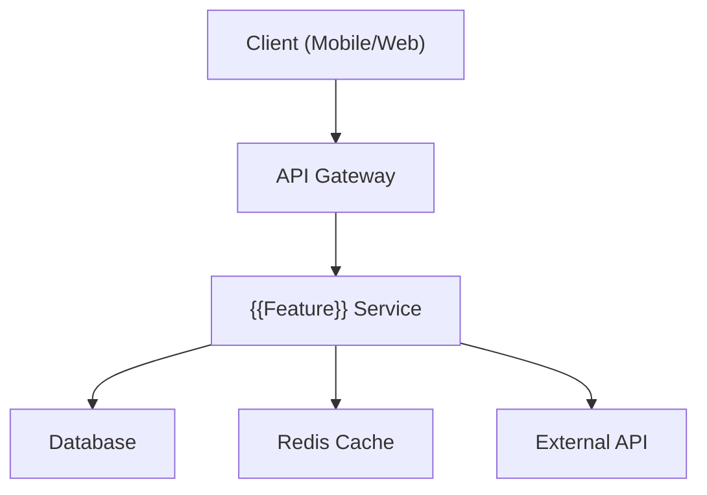
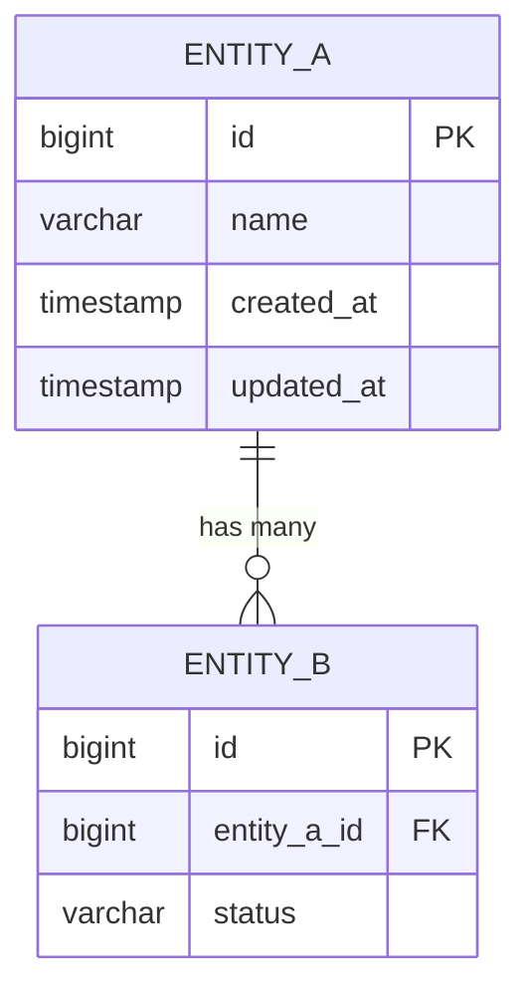
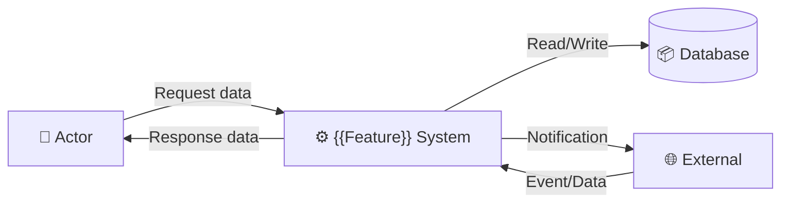
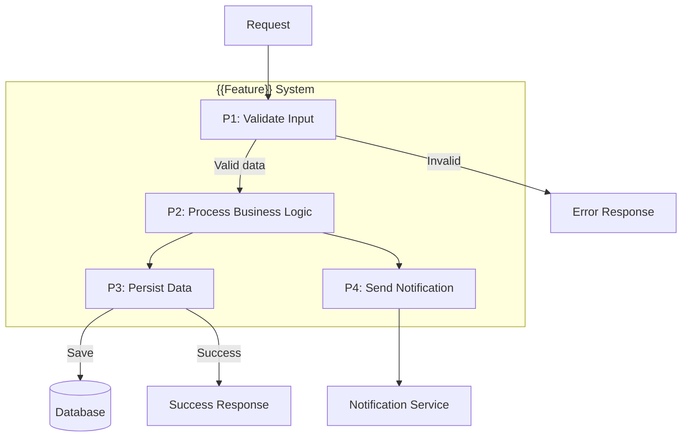
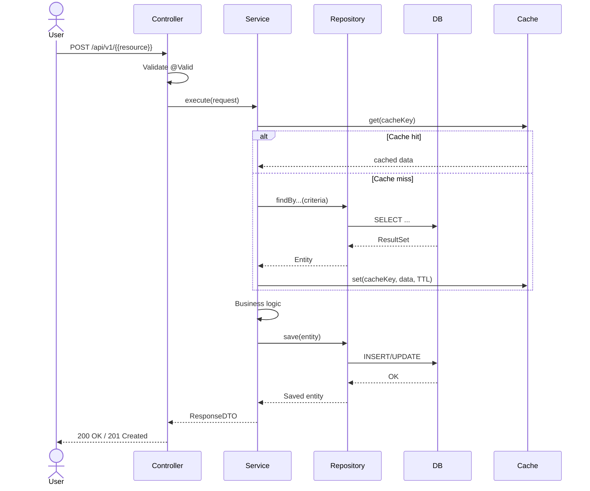
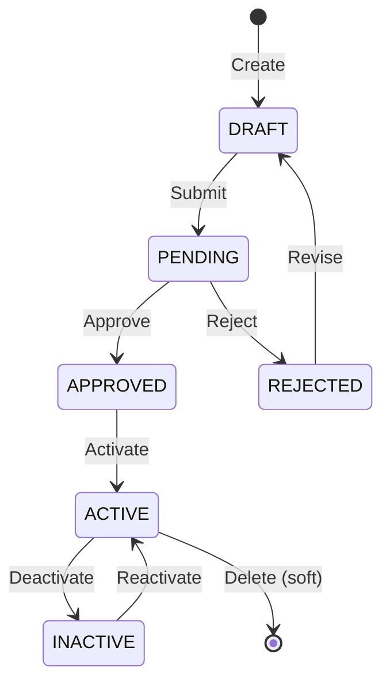
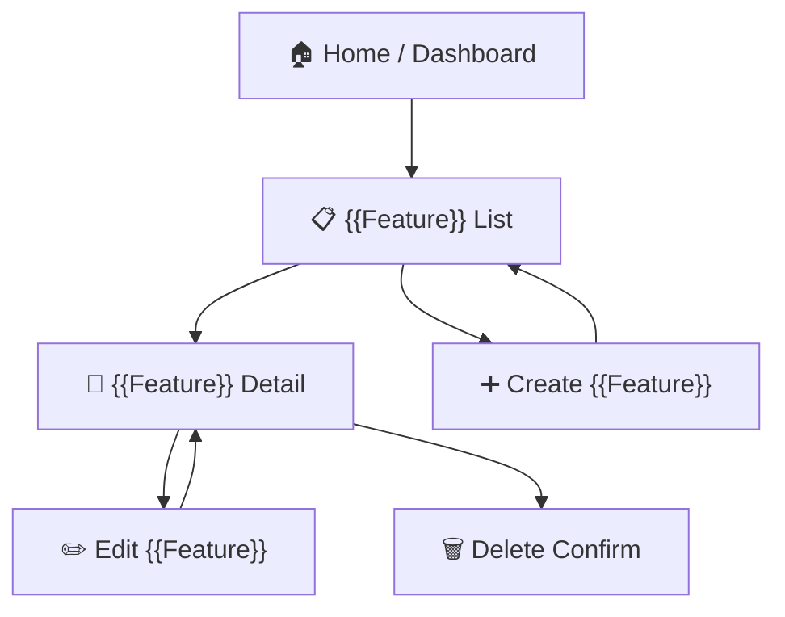

# Đặc tả kỹ thuật: {{FEATURE_NAME}}

> Technical specification chi tiết — thiết kế để agent có thể đọc và dev code trực tiếp.

---

## 1. Tổng quan hệ thống (System Overview)

### 1.1 Kiến trúc tổng thể



### 1.2 Technology Stack

| Layer | Technology | Version | Ghi chú |
|-------|-----------|---------|---------|
| Language | Kotlin / Java | ... | ... |
| Framework | Spring Boot | 4.x | ... |
| Database | PostgreSQL / MySQL | ... | ... |
| Cache | Redis | ... | ... |
| Message Queue | Kafka / RabbitMQ | ... | Nếu cần |

### 1.3 Dependencies & Integrations

| Dependency | Type | Purpose | Interface |
|-----------|------|---------|-----------|
| {{Service_A}} | Internal | ... | REST API |
| {{External_B}} | External | ... | HTTP/gRPC |

---

## 2. Lược đồ dữ liệu (Data Schema)

### 2.1 Entity-Relationship Diagram



### 2.2 Bảng chi tiết Entity

#### Entity: {{entity_name}}

| Field | Type | Constraint | Default | Mô tả |
|-------|------|-----------|---------|--------|
| `id` | `BIGINT` | PK, AUTO_INCREMENT | - | Primary key |
| `name` | `VARCHAR(255)` | NOT NULL | - | Tên... |
| `status` | `VARCHAR(50)` | NOT NULL | `'ACTIVE'` | Trạng thái |
| `created_at` | `TIMESTAMP` | NOT NULL | `CURRENT_TIMESTAMP` | Thời điểm tạo |
| `updated_at` | `TIMESTAMP` | NOT NULL | `CURRENT_TIMESTAMP` | Thời điểm cập nhật |
| `deleted_at` | `TIMESTAMP` | NULLABLE | `NULL` | Soft delete |

#### Indexes

| Index Name | Columns | Type | Purpose |
|-----------|---------|------|---------|
| `idx_{{table}}_status` | `status` | BTREE | Filter by status |
| `idx_{{table}}_created_at` | `created_at` | BTREE | Sort/range query |

### 2.3 Database Migration Scripts (draft)

```sql
-- V1__create_{{table}}.sql
CREATE TABLE {{table_name}} (
    id BIGINT AUTO_INCREMENT PRIMARY KEY,
    -- columns here
    created_at TIMESTAMP NOT NULL DEFAULT CURRENT_TIMESTAMP,
    updated_at TIMESTAMP NOT NULL DEFAULT CURRENT_TIMESTAMP ON UPDATE CURRENT_TIMESTAMP,
    deleted_at TIMESTAMP NULL
);

CREATE INDEX idx_{{table}}_status ON {{table_name}} (status);
```

---

## 3. Luồng dữ liệu (Data Flow)

### 3.1 Data Flow Diagram — Level 0 (Context)



### 3.2 Data Flow Diagram — Level 1 (chi tiết)



### 3.3 Data Transformation Rules

| # | Input | Process | Output | Validation Rules |
|---|-------|---------|--------|-----------------|
| 1 | `RequestDTO.field_a` | Trim + uppercase | `Entity.fieldA` | NOT NULL, max 255 chars |
| 2 | `RequestDTO.amount` | Calculate tax | `Entity.totalAmount` | > 0, precision(18,2) |

---

## 4. Luồng xử lý (Processing Steps)

### 4.1 Sequence Diagram — UC-001



### 4.2 Bảng Step xử lý chi tiết

#### UC-001: {{Tên Use Case}}

| Step | Component | Action | Input | Output | Error Handling | Ghi chú |
|------|-----------|--------|-------|--------|---------------|---------|
| 1 | Controller | Validate request | `RequestDTO` | Valid request | `400 Bad Request` | Bean Validation |
| 2 | Service | Check authorization | `UserContext` | Authorized | `403 Forbidden` | @PreAuthorize |
| 3 | Service | Check duplicate | `uniqueKey` | Not exists | `409 Conflict` | Idempotency |
| 4 | Service | Execute business logic | Valid data | Processed data | `422 Unprocessable` | Domain rules |
| 5 | Repository | Persist to DB | Entity | Saved entity | `500 Internal` | @Transactional |
| 6 | Service | Invalidate cache | Cache key | Cache cleared | Log warning | Best-effort |
| 7 | Controller | Map response | Entity | `ResponseDTO` | - | MapStruct/manual |

### 4.3 State Machine (nếu có stateful entity)



| Transition | From | To | Trigger | Guard Condition | Side Effect |
|-----------|------|-----|---------|----------------|------------|
| Submit | DRAFT | PENDING | User action | All required fields filled | Send notification |
| Approve | PENDING | APPROVED | Admin action | Valid review | Update audit log |

---

## 5. Luồng màn hình (Screen Flow)

### 5.1 Screen Map (Sitemap)



### 5.2 Chi tiết từng Screen

| Screen ID | Tên | Mục đích | Data hiển thị | User Actions | Navigation |
|-----------|-----|----------|--------------|-------------|-----------|
| SCR-001 | {{Feature}} List | Danh sách + tìm kiếm | Table: id, name, status, date | Search, Filter, Sort, Create | → SCR-002 (click row) |
| SCR-002 | {{Feature}} Detail | Xem chi tiết | All fields + related data | Edit, Delete, Back | → SCR-003 (edit), ← SCR-001 (back) |
| SCR-003 | Create/Edit | Tạo mới hoặc chỉnh sửa | Form: input fields | Save, Cancel, Validate | → SCR-001 (save), ← SCR-002 (cancel) |

### 5.3 Wireframe Description (text-based)

#### SCR-001: {{Feature}} List
```
┌─────────────────────────────────────────────┐
│  Header: {{Feature}} Management             │
├─────────────────────────────────────────────┤
│  🔍 Search: [___________]  [Filter ▼]      │
│                              [+ Create New] │
├────┬──────────┬────────┬───────┬────────────┤
│ #  │ Name     │ Status │ Date  │ Actions    │
├────┼──────────┼────────┼───────┼────────────┤
│ 1  │ Item A   │ Active │ 01/01 │ [View][Del]│
│ 2  │ Item B   │ Draft  │ 01/02 │ [View][Del]│
├────┴──────────┴────────┴───────┴────────────┤
│  ◀ Prev  Page 1 of N  Next ▶               │
└─────────────────────────────────────────────┘
```

---

## 6. API Specification

### 6.1 Endpoint List

| # | Method | Path | Description | Auth | Request Body | Response |
|---|--------|------|------------|------|-------------|----------|
| 1 | `GET` | `/api/v1/{{resources}}` | List all | JWT | Query params | Page<DTO> |
| 2 | `GET` | `/api/v1/{{resources}}/{id}` | Get by ID | JWT | - | DTO |
| 3 | `POST` | `/api/v1/{{resources}}` | Create new | JWT | CreateRequest | DTO (201) |
| 4 | `PUT` | `/api/v1/{{resources}}/{id}` | Update | JWT | UpdateRequest | DTO |
| 5 | `DELETE` | `/api/v1/{{resources}}/{id}` | Soft delete | JWT | - | 204 |

### 6.2 Request/Response chi tiết

#### POST /api/v1/{{resources}}

**Request:**
```json
{
  "field_a": "string (required, max 255)",
  "field_b": "number (required, > 0)",
  "field_c": "string (optional)"
}
```

**Response (201 Created):**
```json
{
  "id": 1,
  "field_a": "value",
  "field_b": 100,
  "status": "DRAFT",
  "created_at": "2026-01-01T00:00:00Z"
}
```

**Error Response (400 Bad Request):**
```json
{
  "type": "https://api.example.com/errors/validation",
  "title": "Validation Failed",
  "status": 400,
  "detail": "field_a must not be blank",
  "instance": "/api/v1/{{resources}}",
  "errors": [
    { "field": "field_a", "message": "must not be blank" }
  ]
}
```

### 6.3 Error Response Format (RFC 7807)

| HTTP Status | Error Type | Khi nào |
|-------------|-----------|---------|
| 400 | Validation Error | Input không hợp lệ |
| 401 | Unauthorized | Chưa đăng nhập |
| 403 | Forbidden | Không có quyền |
| 404 | Not Found | Resource không tồn tại |
| 409 | Conflict | Duplicate/conflict |
| 422 | Unprocessable Entity | Business rule violation |
| 500 | Internal Server Error | Lỗi hệ thống |

---

## 7. Security Considerations

### 7.1 Authentication Flow
<!-- Mô tả auth flow cho feature này -->

### 7.2 Authorization Matrix

| Role | UC-001 (Create) | UC-002 (Read) | UC-003 (Update) | UC-004 (Delete) |
|------|:---:|:---:|:---:|:---:|
| Admin | ✅ | ✅ | ✅ | ✅ |
| User | ✅ | ✅ (own) | ✅ (own) | ❌ |
| Guest | ❌ | ✅ (public) | ❌ | ❌ |

### 7.3 Data Protection
<!-- Encryption, masking, GDPR considerations -->

---

## 8. Performance Requirements

| Metric | Target | Measurement Method |
|--------|--------|-------------------|
| Response time (P95) | < 500ms | APM monitoring |
| Throughput | > 100 req/s | Load test |
| Database query time | < 100ms | Slow query log |
| Cache hit ratio | > 80% | Redis metrics |

---

## 9. Agent Implementation Notes

> **Section này dành cho AI agent** — chỉ rõ code cần tạo để agent dev trực tiếp.

### 9.1 Classes to Create

| # | Class | Package | Type | Extends/Implements | Mô tả |
|---|-------|---------|------|-------------------|--------|
| 1 | `{{Feature}}Controller` | `presentation.controller` | @RestController | - | API endpoints |
| 2 | `{{Feature}}UseCase` | `application.usecase` | @Service | - | Business logic |
| 3 | `{{Feature}}Repository` | `infrastructure.repository` | Interface | JpaRepository | Data access |
| 4 | `{{Feature}}Entity` | `domain.entity` | @Entity | BaseEntity | Domain model |
| 5 | `Create{{Feature}}Request` | `presentation.dto` | Record/Data class | - | Input DTO |
| 6 | `{{Feature}}Response` | `presentation.dto` | Record/Data class | - | Output DTO |

### 9.2 Pattern References

| Pattern | Reference | Ghi chú |
|---------|----------|---------|
| Flow style | `base_knowledge/knowledge_code_patterns.md` → {{flow_style}} | Follow existing pattern |
| Auth pattern | `base_knowledge/knowledge_code_patterns.md` → {{auth_pattern}} | Same as similar features |
| Base class | {{BaseClass nếu có}} | Extend nếu applicable |
| Error handling | `base_knowledge/standards/error_handling_standard.md` | RFC 7807 |

### 9.3 Integration Points

| Integration | Type | Protocol | Endpoint | Data Format |
|------------|------|----------|----------|------------|
| {{Service}} | Sync | REST | `GET /api/...` | JSON |
| {{Event}} | Async | Kafka | `topic.name` | Avro/JSON |

### 9.4 Test Cases (high-level)

| # | Test | Type | Scenario | Expected |
|---|------|------|----------|----------|
| 1 | Create success | Integration | Valid request | 201 + entity saved |
| 2 | Create validation error | Unit | Missing required field | 400 + error details |
| 3 | Create duplicate | Integration | Same unique key | 409 Conflict |
| 4 | Get by ID | Integration | Existing ID | 200 + full DTO |
| 5 | Get not found | Integration | Non-existing ID | 404 |
| 6 | Auth required | Integration | No JWT token | 401 |
| 7 | Forbidden | Integration | Wrong role | 403 |

---

> **Traceability**: Research Brief → Business Analysis → **Technical Spec** → Implementation
> **Ready for**: `/wf_pre_openspec` hoặc `/wf_openspec` hoặc direct coding
