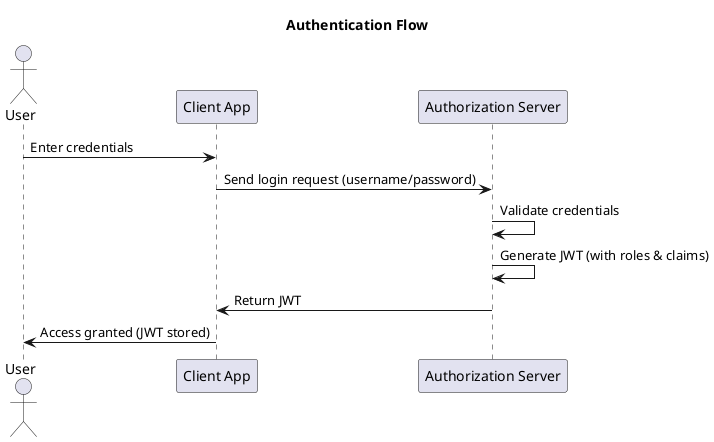
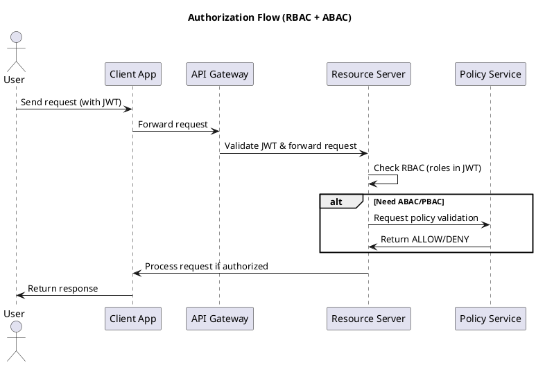
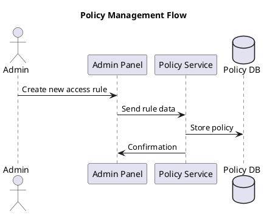
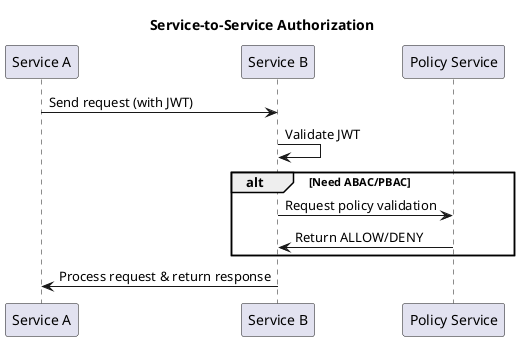
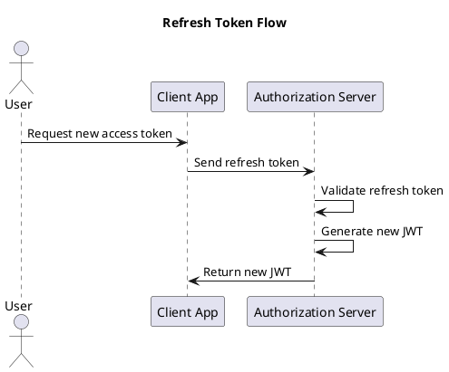

# Authentication/Authorization RBAC & ABAC/PBAC

Tài liệu này mô tả toàn bộ hệ thống theo hướng tích hợp **RBAC** và **ABAC/PBAC** cho việc phân quyền, 
các API phục vụ cho **Admin Dashboard Web** (paging-based) và **Mobile App** (infinite scrolling / cursor-based).

- Mô tả tổng quan hệ thống
- Luồng nghiệp vụ (Flow Business) & Sơ đồ (PlantUML)
- Thiết kế API chi tiết: Endpoint, Request/Response, cấu trúc Paging, Infinite Scrolling
- Các API liên quan đến Auth, User Management, Policy Service
- Hỗ trợ i18n đa ngôn ngữ & chuẩn thời gian ISO 8601

---

## Mục Lục

1. [Tổng Quan Hệ Thống](#tổng-quan-hệ-thống)
2. [Luồng Nghiệp Vụ (Flow Business)](#luồng-nghiệp-vụ-flow-business)
    - [Authentication Flow](#authentication-flow)
    - [Authorization Flow (RBAC + ABAC)](#authorization-flow-rbac--abac)
    - [Policy Management Flow](#policy-management-flow)
    - [Service-to-Service Request Flow](#service-to-service-request-flow)
    - [Refresh Token Flow](#refresh-token-flow)
3. [Thiết Kế API](#thiết-kế-api)
    - [1. Authentication & Authorization APIs](#1-authentication--authorization-apis)
    - [2. User Management (RBAC) APIs](#2-user-management-rbac-apis)
    - [3. Policy Service (ABAC/PBAC) APIs](#3-policy-service-abacpbac-apis)
    - [4. Order Management APIs](#4-order-management-apis)
    - [5. Notification Service APIs](#5-notification-service-apis)
    - [6. Timezone Service API](#6-timezone-service-api)
4. [Kết Luận & Lưu Ý Chung](#kết-luận--lưu-ý-chung)

---

## Tổng Quan Hệ Thống

Hệ thống được xây dựng theo kiến trúc microservices với các thành phần chính:

- **Authorization Server**: Quản lý đăng nhập, đăng ký, cấp JWT, refresh token, xác thực email, đăng xuất, quên/mật khẩu reset.
- **API Gateway**: Xác thực JWT, phân luồng request đến các Resource Server.
- **User Service (Resource Server)**: Quản lý thông tin người dùng theo RBAC.
- **Policy Service**: Cung cấp dịch vụ kiểm tra quyền truy cập theo ABAC/PBAC.
- **Order Service (Resource Server)**: Quản lý đơn hàng, tích hợp hỗ trợ timezone.
- **Notification Service**: Gửi thông báo đa ngôn ngữ (i18n).
- **Timezone Service**: Hỗ trợ chuyển đổi múi giờ.

Hệ thống hỗ trợ hai kiểu phân trang:
- **Paging-based**: Dành cho các ứng dụng web admin dashboard.
- **Cursor-based/Infinite Scrolling**: Dành cho mobile app.

Mỗi API trả về có cấu trúc chuẩn:
- Với dữ liệu đơn: sử dụng trường `data`
- Với danh sách: sử dụng trường `list` và `meta` (bao gồm thông tin phân trang hoặc cursor).

Các response đều có định dạng:
- `status`: success/error
- `code`: Mã thông báo (có thể hỗ trợ i18n)
- `message`: Nội dung thông báo
- `data` hoặc `list` + `meta`: Nội dung trả về

---

## Luồng Nghiệp Vụ (Flow Business)

### Authentication Flow

Mô tả quá trình đăng nhập và cấp JWT.

### Authorization Flow (RBAC + ABAC)
Mô tả quá trình kiểm tra quyền truy cập:

### Policy Management Flow
Quá trình quản lý policies:

### Service-to-Service Request Flow
Mô tả khi một service gọi API của service khác:

### Refresh Token Flow
Quá trình cấp lại JWT khi token hết hạn:

se su dung filter de custom lay role cua user theo endpoint
khong can khai bao @PreAuthorize("hasAuthority('ROLE_ADMIN')")