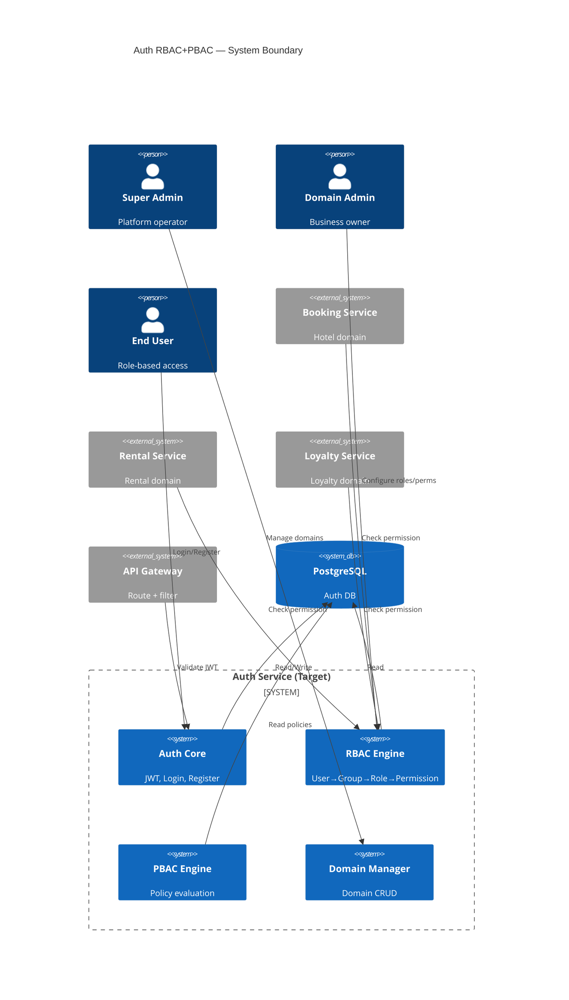

# BRD-01: Stakeholders & Scope

## Stakeholders

### Primary Stakeholders
| Role | Who | Interest |
|:---|:---|:---|
| **System Architect** | Dev team lead | Architecture decisions, code quality |
| **Backend Developer** | Dev team | Implementation, testing |
| **Domain Admin** | Business owner (chủ KS, chủ trọ) | Configure roles/permissions cho domain |
| **Super Admin** | Platform operator | Manage all domains, users |

### End Users (by Domain)

#### Domain: Booking (Khách sạn)
| Persona | Role | Behavior |
|:---|:---|:---|
| Nguyễn Văn A | HOTEL_OWNER | Quản lý toàn bộ khách sạn: nhân viên, phòng, booking, tài chính |
| Trần Thị B | RECEPTIONIST | Tiếp tân: check-in/out, tạo booking, xem room status |
| Lê Văn C | HOUSEKEEPER | Dọn phòng: xem danh sách phòng cần dọn, cập nhật trạng thái |
| Phạm Thị D | GUEST | Khách: xem booking của mình, thanh toán, đánh giá |

#### Domain: Rental (Nhà trọ)
| Persona | Role | Behavior |
|:---|:---|:---|
| Hoàng Văn E | LANDLORD | Chủ trọ: quản lý phòng, hợp đồng, thu tiền, xem báo cáo |
| Ngô Thị F | TENANT | Người thuê: xem phòng, hợp đồng, đóng tiền (read-only cho reports) |

#### Domain: Customer Loyalty
| Persona | Role | Behavior |
|:---|:---|:---|
| Admin G | LOYALTY_ADMIN | Quản trị: cấu hình tier, rules, campaigns |
| Manager H | LOYALTY_MANAGER | Quản lý: duyệt đổi điểm, xem reports |
| Member I | MEMBER | Thành viên: xem điểm, lịch sử, đổi rewards (read-only cho rules) |

## Scope Boundaries

### System Boundary

### Module Scope (In-Scope Modules)

| Module | Description | MVP |
|:---|:---|:---:|
| `auth-core` | Authentication (login, register, JWT) | ✅ |
| `domain-management` | Domain CRUD + configuration | ✅ |
| `user-management` | User CRUD + domain membership | ✅ |
| `group-management` | Group CRUD (domain-scoped) | ✅ |
| `role-management` | Role CRUD + hierarchy | ✅ |
| `permission-management` | Permission matrix (Resource × Action) | ✅ |
| `policy-engine` | PBAC evaluation engine | ✅ |
| `admin-api` | RESTful APIs cho management | ✅ |
| `api-gateway-integration` | Spring Cloud Gateway filter | ❌ Post-MVP |
| `audit-logging` | Event-driven audit trail | ❌ Post-MVP |
| `caching` | Redis permission cache | ❌ Post-MVP |
