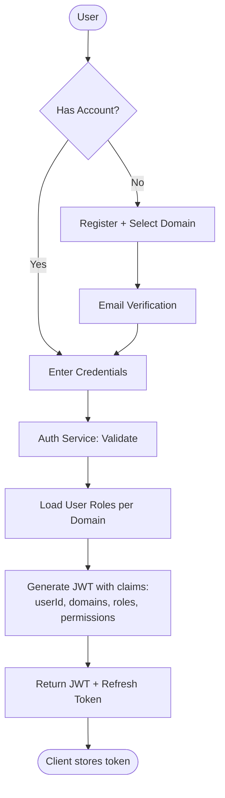
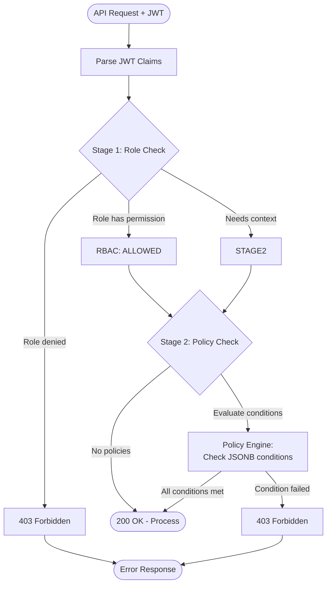
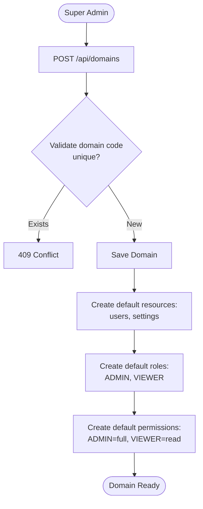
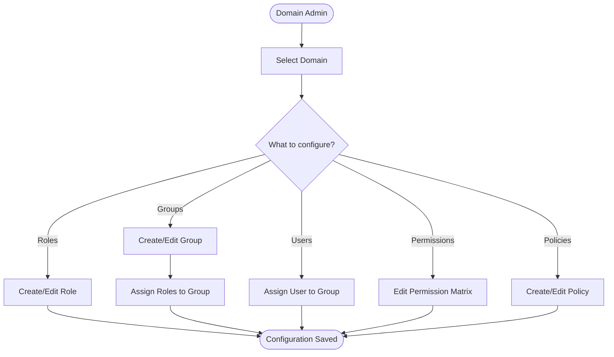
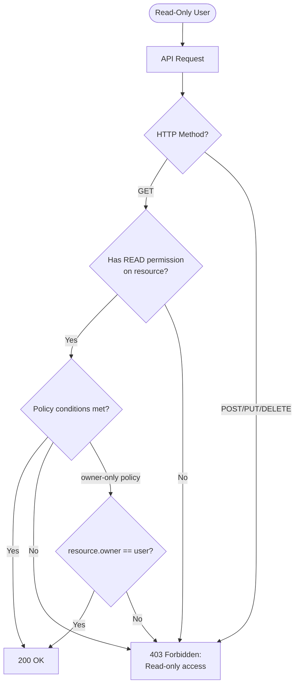
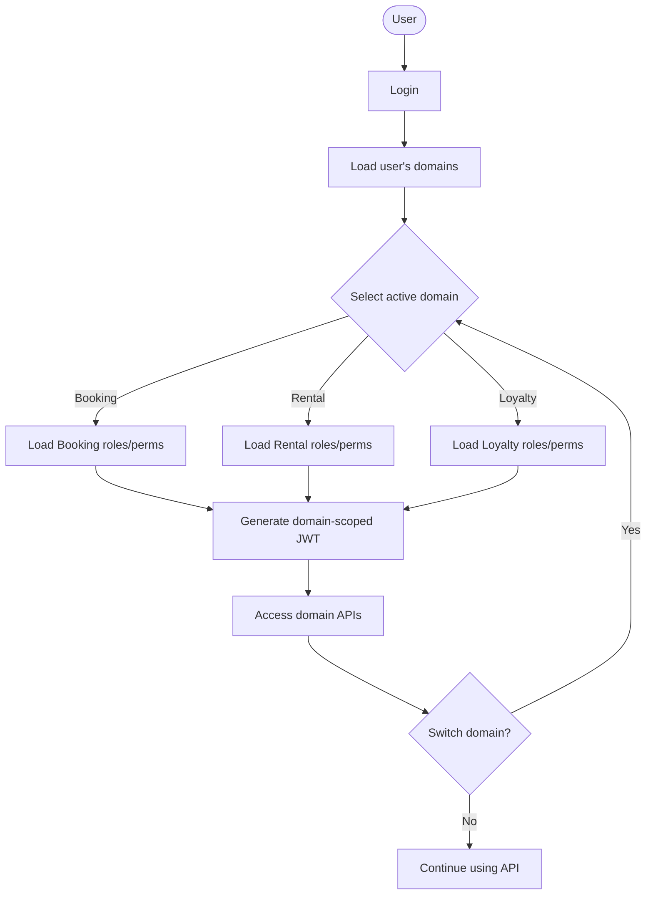

# BRD-02: Business Workflow

## WF-01: User Authentication Flow

## WF-02: Authorization Check Flow (2-Stage)

## WF-03: Domain Registration Flow

## WF-04: Permission Assignment Flow

## WF-05: Read-Only User Access Flow

## WF-06: Multi-Domain User Flow

