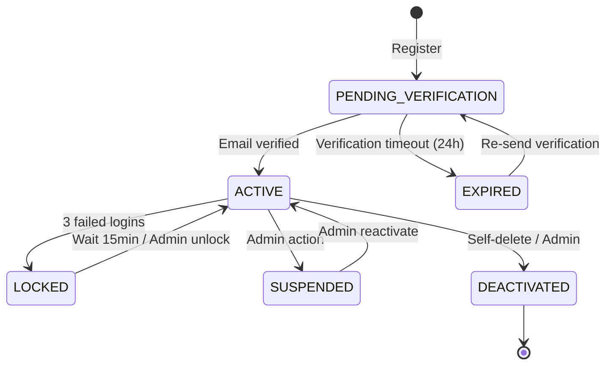
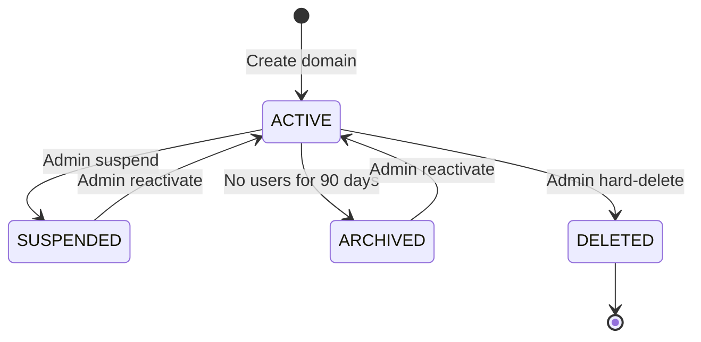
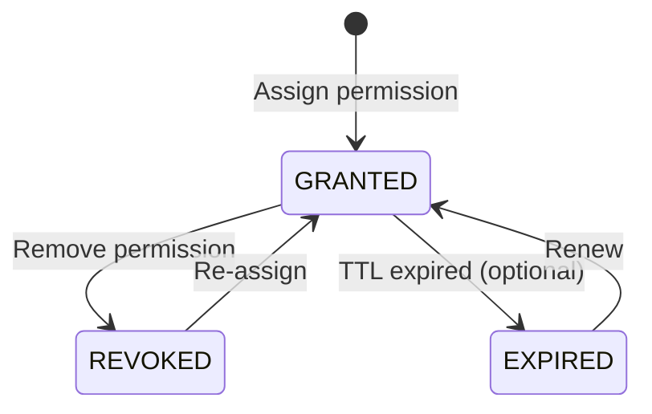
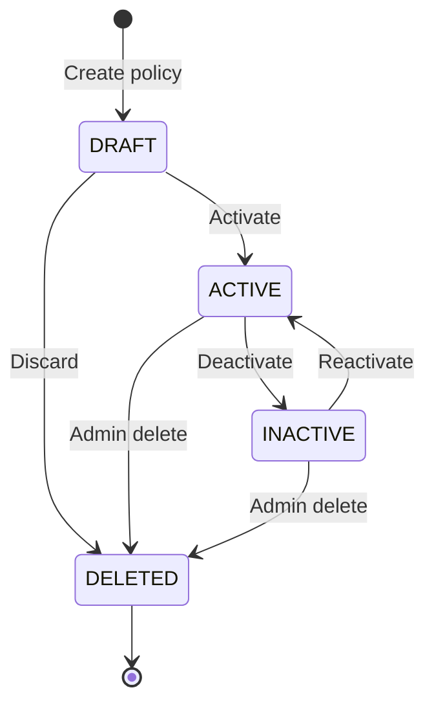
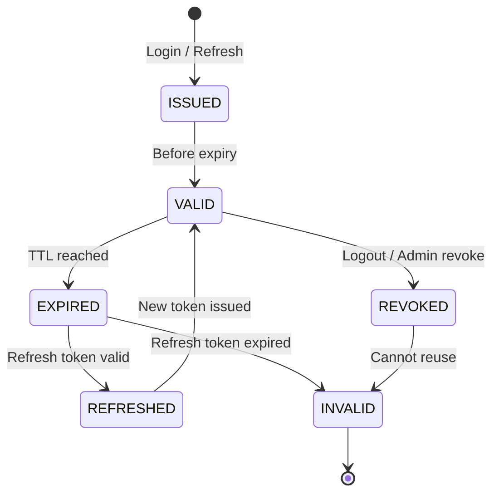

# BRD-05: State Machine

## SM-01: User Account States

```mermaid
stateDiagram-v2
    [*] --> PENDING_VERIFICATION : Register
    PENDING_VERIFICATION --> ACTIVE : Email verified
    PENDING_VERIFICATION --> EXPIRED : Verification timeout (24h)
    EXPIRED --> PENDING_VERIFICATION : Re-send verification
    ACTIVE --> LOCKED : 3 failed logins
    LOCKED --> ACTIVE : Wait 15min / Admin unlock
    ACTIVE --> SUSPENDED : Admin action
    SUSPENDED --> ACTIVE : Admin reactivate
    ACTIVE --> DEACTIVATED : Self-delete / Admin
    DEACTIVATED --> [*]
```

## SM-02: Domain States

```mermaid
stateDiagram-v2
    [*] --> ACTIVE : Create domain
    ACTIVE --> SUSPENDED : Admin suspend
    SUSPENDED --> ACTIVE : Admin reactivate
    ACTIVE --> ARCHIVED : No users for 90 days
    ARCHIVED --> ACTIVE : Admin reactivate
    ACTIVE --> DELETED : Admin hard-delete
    DELETED --> [*]
```

## SM-03: Permission Grant States

```mermaid
stateDiagram-v2
    [*] --> GRANTED : Assign permission
    GRANTED --> REVOKED : Remove permission
    REVOKED --> GRANTED : Re-assign
    GRANTED --> EXPIRED : TTL expired (optional)
    EXPIRED --> GRANTED : Renew
```

## SM-04: Policy States

```mermaid
stateDiagram-v2
    [*] --> DRAFT : Create policy
    DRAFT --> ACTIVE : Activate
    DRAFT --> DELETED : Discard
    ACTIVE --> INACTIVE : Deactivate
    INACTIVE --> ACTIVE : Reactivate
    ACTIVE --> DELETED : Admin delete
    INACTIVE --> DELETED : Admin delete
    DELETED --> [*]
```

## SM-05: JWT Token Lifecycle

```mermaid
stateDiagram-v2
    [*] --> ISSUED : Login / Refresh
    ISSUED --> VALID : Before expiry
    VALID --> EXPIRED : TTL reached
    VALID --> REVOKED : Logout / Admin revoke
    EXPIRED --> REFRESHED : Refresh token valid
    REFRESHED --> VALID : New token issued
    EXPIRED --> INVALID : Refresh token expired
    REVOKED --> INVALID : Cannot reuse
    INVALID --> [*]
```
