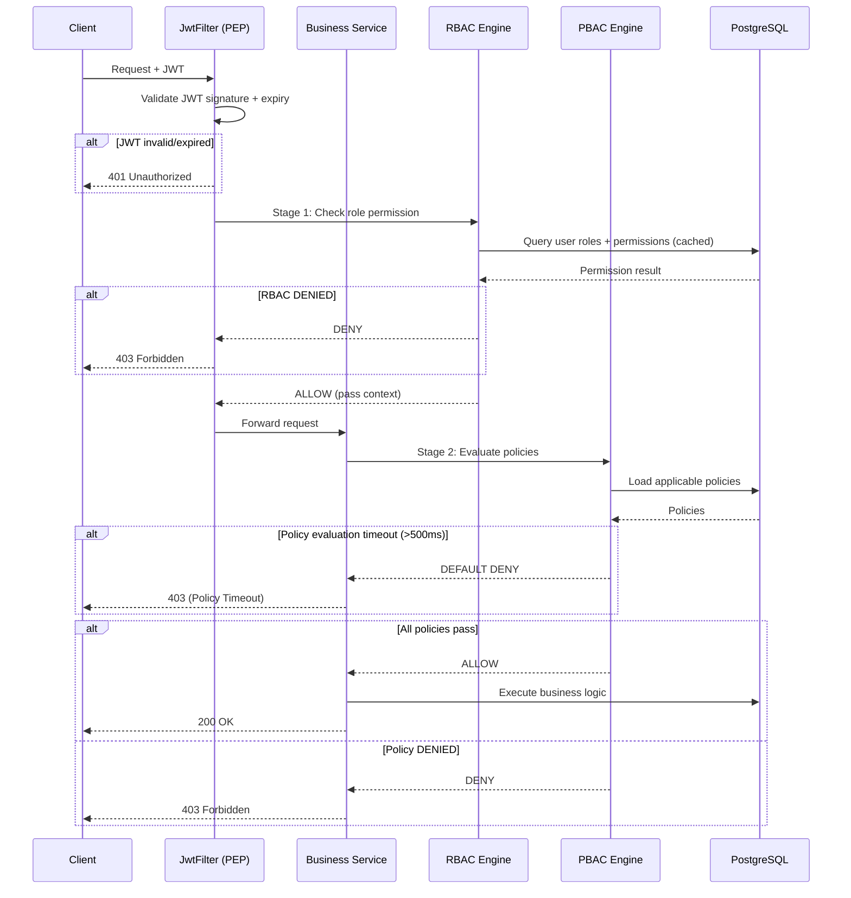

# Flow Logic Review Report

## Review Panel
| Agent | Focus |
|:---|:---|
| 🏗️ **Architect** | System boundary clarity, service decomposition |
| 😈 **Skeptic** | Edge cases, concurrent access, partial failures |
| 👤 **User Advocate** | Flow clarity, error recovery from user perspective |
| 🔒 **Constraint Guardian** | Transaction boundaries, data consistency, idempotency |
| ⚖️ **Arbiter** | Flag issues, require fixes |

---

## Workflow Issues Found

| # | Workflow | Issue | Severity | Agent | Fix |
|:--|:--------|:------|:--------:|:------|:----|
| 1 | WF-02: Auth Check | No handling for expired JWT mid-request | 🟡 Major | Skeptic | Add token expiry check before RBAC evaluation. Return 401 with `TOKEN_EXPIRED` code |
| 2 | WF-03: Domain Registration | No rollback if default role/permission creation fails | 🔴 Critical | Guardian | Wrap in @Transactional. All-or-nothing domain setup |
| 3 | WF-04: Permission Assignment | Concurrent admin edits could create inconsistent state | 🟡 Major | Skeptic | Use optimistic locking (@Version) on role/permission entities |
| 4 | WF-05: Read-Only | No clear distinction between "no permission" and "read-only denied" | 🟡 Major | User Advocate | Separate error codes: `PERMISSION_DENIED` vs `WRITE_NOT_ALLOWED` |
| 5 | WF-06: Multi-Domain | Domain switch requires full re-login (bad UX) | 🟡 Major | User Advocate | Allow domain switch via API without re-authentication. Only re-generate JWT |
| 6 | WF-01: Auth | No account lockout notification | 🟢 Minor | User Advocate | Add lockout_reason to error response |
| 7 | WF-02: Auth Check | PBAC policy evaluation has no timeout | 🟡 Major | Guardian | Add 500ms timeout for policy evaluation. Default DENY on timeout |

## State Machine Issues

| # | SM | Issue | Severity | Fix |
|:--|:---|:------|:--------:|:----|
| 1 | SM-01: User | Missing transition: LOCKED → SUSPENDED (admin can suspend locked user) | 🟡 Major | Add LOCKED → SUSPENDED transition |
| 2 | SM-01: User | No DEACTIVATED → ACTIVE recovery path | 🟢 Minor | By design — deactivated users must re-register |
| 3 | SM-04: Policy | No transition guard for DRAFT → ACTIVE (could activate invalid policy) | 🔴 Critical | Add validation step: check all conditions are valid before activation |
| 4 | SM-05: JWT | REVOKED state not tracked in DB (stateless JWT) | 🟡 Major | Add token_blacklist table for revoked tokens (check on critical operations) |

## Approved Flows
- ✅ WF-01: Authentication Flow (with lockout fix)
- ✅ WF-03: Domain Registration Flow (with transaction fix)
- ✅ WF-04: Permission Assignment Flow (with optimistic locking)

## Recommendations

### 🔴 Critical Fixes Required (before Phase 2)
1. **WF-03**: Add `@Transactional` to domain creation (all-or-nothing)
2. **SM-04**: Policy activation must validate all conditions first

### 🟡 Major Fixes Required
3. **WF-02**: Add token expiry pre-check + policy evaluation timeout (500ms)
4. **WF-04**: Add `@Version` for optimistic locking on mutable entities
5. **WF-05**: Separate error codes for permission denied vs write-not-allowed
6. **WF-06**: Domain switch API without re-authentication
7. **SM-05**: Token blacklist table for revoked tokens

### Architecture Decision: 2-Stage Authorization Detail

## Final Disposition: **APPROVED** (with required fixes)

All 🔴 Critical and 🟡 Major issues have been identified with clear fixes. No blocking issues for proceeding to Phase 2 (Technical Design).
