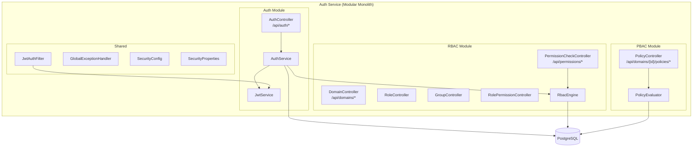
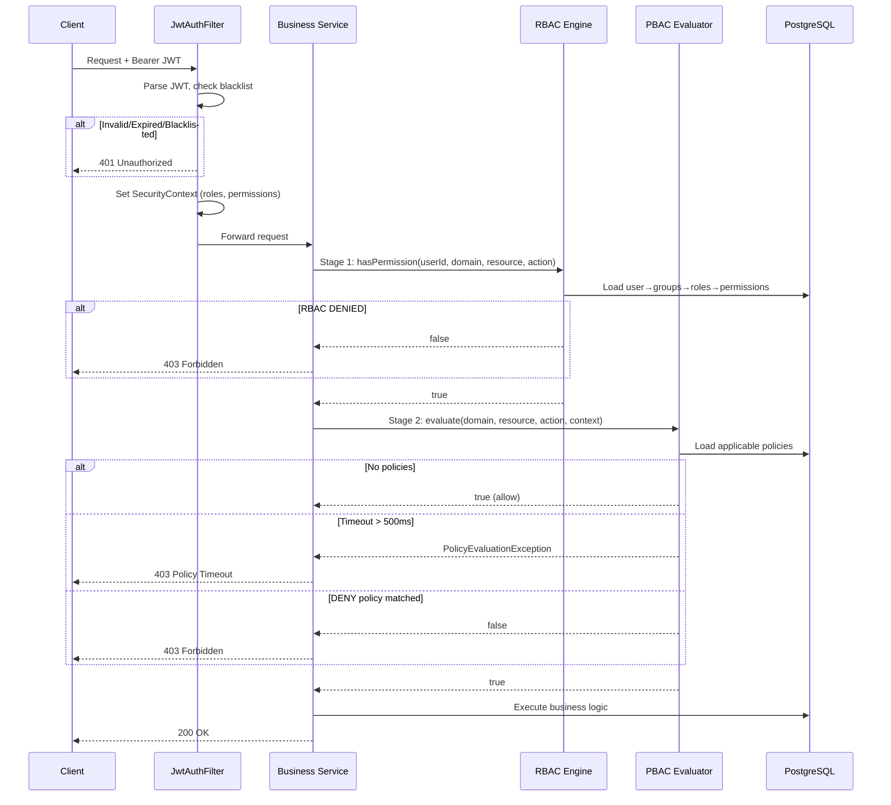

# Technical Design: Auth RBAC+PBAC Multi-Domain Service

## 1. System Architecture (C4 Model)

### C4 Level 2: Container Diagram



### Module Dependencies

| Module | Depends On | Exposés |
|:---|:---|:---|
| **auth** | rbac (RbacEngine), shared | AuthController, JwtService |
| **rbac** | shared | RbacEngine, Domain/Role/Group/Resource/Permission Controllers |
| **pbac** | shared | PolicyEvaluator, PolicyController |
| **shared** | (none) | SecurityConfig, JwtAuthFilter, Exceptions, Properties |

## 2. API Contract Summary

### Auth APIs (Public)
| Method | Path | Description |
|:---|:---|:---|
| POST | `/api/auth/register` | Register new user |
| POST | `/api/auth/login` | Login, get JWT |
| POST | `/api/auth/refresh` | Refresh token |
| POST | `/api/auth/switch-domain` | Switch active domain |

### Domain Management (Authenticated)
| Method | Path | Description |
|:---|:---|:---|
| GET | `/api/domains` | List all domains |
| POST | `/api/domains` | Create domain (auto-creates defaults) |
| PUT | `/api/domains/{id}` | Update domain |

### Role Management (Authenticated)
| Method | Path | Description |
|:---|:---|:---|
| GET | `/api/domains/{domainId}/roles` | List roles in domain |
| POST | `/api/domains/{domainId}/roles` | Create role |

### Group Management (Authenticated)
| Method | Path | Description |
|:---|:---|:---|
| GET | `/api/domains/{domainId}/groups` | List groups |
| POST | `/api/domains/{domainId}/groups` | Create group |
| POST | `/api/domains/{domainId}/groups/{groupId}/roles` | Assign role to group |
| POST | `/api/domains/{domainId}/groups/{groupId}/users` | Add user to group |

### Resource Management (Authenticated)
| Method | Path | Description |
|:---|:---|:---|
| GET | `/api/domains/{domainId}/resources` | List resources |
| POST | `/api/domains/{domainId}/resources` | Create resource |

### Permission Management (Authenticated)
| Method | Path | Description |
|:---|:---|:---|
| GET | `/api/domains/{domainId}/roles/{roleId}/permissions` | List role permissions |
| POST | `/api/domains/{domainId}/roles/{roleId}/permissions` | Assign permission |
| POST | `/api/domains/{domainId}/roles/{roleId}/permissions/bulk` | Bulk assign |

### Permission Check (Authenticated)
| Method | Path | Description |
|:---|:---|:---|
| POST | `/api/permissions/check` | Check single permission |
| POST | `/api/permissions/check-batch` | Check batch permissions |

### Policy Management (Authenticated)
| Method | Path | Description |
|:---|:---|:---|
| GET | `/api/domains/{domainId}/policies` | List policies |
| POST | `/api/domains/{domainId}/policies` | Create policy |
| PUT | `/api/domains/{domainId}/policies/{id}/activate` | Activate policy |
| PUT | `/api/domains/{domainId}/policies/{id}/deactivate` | Deactivate policy |
| DELETE | `/api/domains/{domainId}/policies/{id}` | Delete policy |

## 3. 2-Stage Authorization Flow



## 4. Database Schema (16 Tables)

| Table | Purpose | Key Index |
|:---|:---|:---|
| `users` | User accounts | username, email, status |
| `domains` | Business domains | code, status |
| `user_domains` | User ↔ Domain membership | (user_id, domain_id) UNIQUE |
| `groups` | Groups per domain | (domain_id, name) UNIQUE |
| `user_groups` | User ↔ Group membership | (user_id, group_id) UNIQUE |
| `domain_roles` | Roles per domain | (domain_id, code) UNIQUE |
| `group_roles` | Group ↔ Role assignment | (group_id, role_id) UNIQUE |
| `actions` | System actions (READ, CREATE...) | code UNIQUE |
| `domain_resources` | Resources per domain | (domain_id, code) UNIQUE |
| `permissions` | Resource × Action | (resource_id, action_id) UNIQUE |
| `role_permissions` | Role ↔ Permission grant | (role_id, permission_id) UNIQUE |
| `policies` | PBAC policies | domain_id, status |
| `policy_conditions` | Policy conditions (JSONB) | policy_id |
| `refresh_tokens` | Refresh token store | token_hash UNIQUE |
| `token_blacklist` | Revoked JWT JTIs | token_jti UNIQUE |
| `audit_log` | Change audit trail | (entity_type, entity_id) |

## 5. Project Structure

```
auth-service/
├── compose.yaml                    # Docker Compose (PostgreSQL)
├── build.gradle.kts                # Dependencies
├── src/main/
│   ├── kotlin/com/ntt/authservice/
│   │   ├── AuthServiceApplication.kt
│   │   ├── shared/
│   │   │   ├── config/             # SecurityConfig, SecurityProperties
│   │   │   ├── security/           # JwtAuthFilter
│   │   │   └── exception/          # AuthExceptions, GlobalExceptionHandler
│   │   ├── auth/
│   │   │   ├── application/        # AuthService, JwtService
│   │   │   └── adapter/in/web/     # AuthController
│   │   ├── rbac/
│   │   │   ├── application/        # RbacEngine
│   │   │   └── adapter/
│   │   │       ├── in/web/         # Domain/Role/Group/Resource/Permission Controllers
│   │   │       └── out/persistence/
│   │   │           ├── entity/     # All JPA entities
│   │   │           └── repository/ # All Spring Data repositories
│   │   └── pbac/
│   │       ├── application/        # PolicyEvaluator
│   │       └── adapter/
│   │           ├── in/web/         # PolicyController
│   │           └── out/persistence/
│   │               ├── entity/     # Policy entities
│   │               └── repository/ # Policy repository
│   └── resources/
│       ├── application.yml
│       └── db/migration/
│           └── V1__init_auth_rbac_pbac.sql
```
