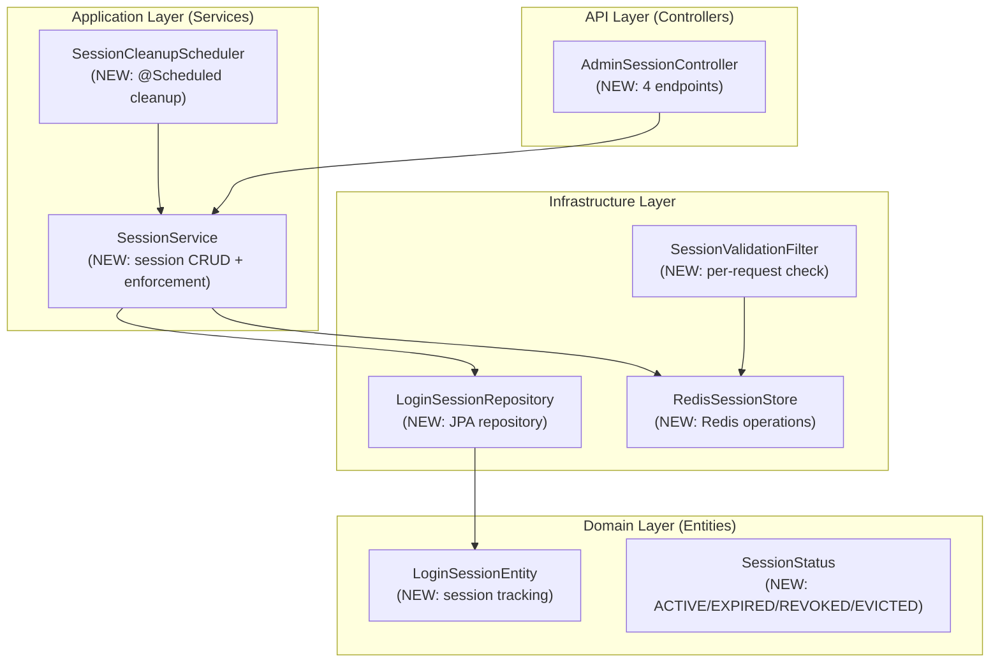

# Design: FR-008 Session Management

> **Change**: FR-008-session-management | **Type**: NEWBUILD | **Flow**: Non-Financial

---

## 1. Component Architecture



## 2. API Design

### 2.1 Admin Session Management

| Method | Endpoint | Description | Permission |
|--------|----------|-------------|------------|
| GET | `/api/v1/admin/sessions` | List active sessions | SESSION_VIEW |
| GET | `/api/v1/admin/sessions/stats` | Session statistics | SESSION_VIEW |
| DELETE | `/api/v1/admin/sessions/{sessionId}` | Revoke single session | SESSION_MANAGE |
| POST | `/api/v1/admin/sessions/revoke-bulk` | Bulk revoke sessions | SESSION_MANAGE |

### 2.2 Request/Response DTOs

```kotlin
// Request
data class BulkRevokeRequest(
    val userId: Long? = null,
    val sessionIds: List<String>? = null,
    val reason: String? = null
)

// Response
data class SessionResponse(
    val sessionId: String,
    val userId: Long,
    val username: String,
    val deviceInfo: String?,
    val ipAddress: String?,
    val loginAt: Instant,
    val lastActivityAt: Instant,
    val status: SessionStatus,
    val rememberMe: Boolean
)

data class SessionStatsResponse(
    val totalActiveSessions: Long,
    val uniqueActiveUsers: Long,
    val sessionsCreatedToday: Long,
    val sessionsExpiredToday: Long,
    val avgSessionDuration: Duration?
)
```

## 3. Data Design

### 3.1 PostgreSQL Schema

```sql
-- Migration: V7__session_management.sql
CREATE TABLE login_sessions (
    id              BIGINT PRIMARY KEY,
    user_id         BIGINT NOT NULL,
    session_id      VARCHAR(36) NOT NULL UNIQUE,
    device_info     VARCHAR(500),
    ip_address      VARCHAR(45),
    user_agent      VARCHAR(1000),
    login_at        TIMESTAMPTZ NOT NULL DEFAULT NOW(),
    last_activity_at TIMESTAMPTZ NOT NULL DEFAULT NOW(),
    expired_at      TIMESTAMPTZ,
    revoked_at      TIMESTAMPTZ,
    revoked_by      BIGINT,
    status          VARCHAR(20) NOT NULL DEFAULT 'ACTIVE',
    remember_me     BOOLEAN NOT NULL DEFAULT FALSE,
    created_at      TIMESTAMPTZ NOT NULL DEFAULT NOW(),
    updated_at      TIMESTAMPTZ NOT NULL DEFAULT NOW()
);

CREATE INDEX idx_login_sessions_user_status ON login_sessions(user_id, status);
CREATE INDEX idx_login_sessions_session_id ON login_sessions(session_id);
CREATE INDEX idx_login_sessions_last_activity ON login_sessions(last_activity_at) WHERE status = 'ACTIVE';
```

### 3.2 Redis Schema

```
session:{userId}:{sessionId}    Hash    TTL=1800s   (session data)
session:user:{userId}:sessions  Set     TTL=86400s  (active session IDs)
session:config:{domainId}       Hash    TTL=3600s   (config cache)
session:cleanup:lock            String  TTL=300s    (distributed lock)
```

## 4. Integration Points

### 4.1 Login Flow Integration
- After successful authentication, `AuthService` calls `SessionService.createSession()`
- SessionId embedded in JWT claims for per-request validation
- Existing `TokenService.generateJWT()` modified to accept sessionId parameter

### 4.2 Request Filter Integration
- `SessionValidationFilter` registered in Spring Security filter chain
- Order: after JwtAuthenticationFilter, before authorization
- Redis lookup: O(1) per request, target < 5ms

### 4.3 Cleanup Integration
- `@Scheduled(fixedRate = 300_000)` on `SessionCleanupScheduler`
- Distributed lock via Redis SETNX to prevent overlap across instances
- Batch size: 100 sessions per run

## 5. Error Handling

| Error | HTTP Code | Response |
|-------|-----------|----------|
| Session not found | 404 | `SESSION_NOT_FOUND` |
| Session already expired | 200 | Idempotent success |
| Max concurrent exceeded | 200 | Oldest session evicted (logged) |
| Redis unavailable | 503 | Fallback to DB-only mode |
| Permission denied | 403 | `INSUFFICIENT_PERMISSION` |

## 6. Configuration

```yaml
session:
  max-concurrent: 5           # default max concurrent sessions
  idle-timeout: 30m            # idle timeout before auto-expire
  absolute-timeout: 24h        # absolute max session lifetime
  remember-me-timeout: 7d      # extended timeout for remember-me
  cleanup:
    interval: 5m               # cleanup scheduler interval
    batch-size: 100            # max sessions cleaned per run
    lock-timeout: 5m           # distributed lock TTL
```

## Changes

### New Components
- `LoginSessionEntity` — JPA entity with SnowflakePersistentAuditableEntity base
- `SessionStatus` — Enum: ACTIVE, EXPIRED, REVOKED, LOGGED_OUT, EVICTED
- `LoginSessionRepository` — JPA repository with custom queries
- `RedisSessionStore` — Redis hash/set operations for session data
- `SessionService` — Core business logic (create, revoke, cleanup, stats)
- `SessionCleanupScheduler` — @Scheduled background cleanup
- `AdminSessionController` — 4 REST endpoints for admin
- `SessionValidationFilter` — Per-request session validation

### Modified Components
- `AuthService` — Add `sessionService.createSession()` after authentication
- `TokenService` — Embed sessionId in JWT claims
- `SecurityConfig` — Register SessionValidationFilter in filter chain
- `application.yml` — Add session configuration block

### Database Changes
- NEW TABLE: `login_sessions` with 15 columns
- 3 indexes for query optimization
