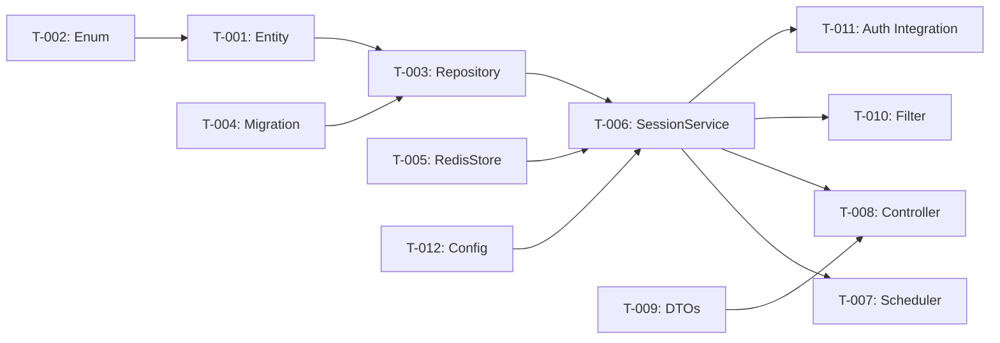

# Tasks: FR-008 Session Management

> **Change**: FR-008-session-management | **Type**: NEWBUILD | **Status**: COMPLETE

---

## Task Summary

| Metric | Value |
|--------|-------|
| Total Tasks | 12 |
| Completed | 12 |
| In Progress | 0 |
| Blocked | 0 |

---

## Phase 1: Data Layer

### T-001: Create LoginSessionEntity [DONE]
- **File**: `src/main/kotlin/com/ntt/authservice/auth/adapter/out/persistence/entity/LoginSessionEntity.kt`
- **Type**: NEW
- **Description**: JPA entity for session tracking with SnowflakePersistentAuditableEntity base
- **Fields**: sessionId (UUID), userId, deviceInfo, ipAddress, userAgent, loginAt, lastActivityAt, expiredAt, revokedAt, revokedBy, status, rememberMe
- **Status**: ✅ COMPLETE

### T-002: Create SessionStatus Enum [DONE]
- **File**: Embedded in LoginSessionEntity or separate enum
- **Type**: NEW
- **Description**: ACTIVE, EXPIRED, REVOKED, LOGGED_OUT, EVICTED
- **Status**: ✅ COMPLETE

### T-003: Create LoginSessionRepository [DONE]
- **File**: `src/main/kotlin/com/ntt/authservice/auth/adapter/out/persistence/repository/LoginSessionRepository.kt`
- **Type**: NEW
- **Description**: JPA repository with custom queries: findByUserIdAndStatus, findExpiredSessions, countActiveByUserId
- **Status**: ✅ COMPLETE

### T-004: Create Flyway Migration [DONE]
- **File**: `src/main/resources/db/migration/V7__session_management.sql`
- **Type**: NEW
- **Description**: DDL for login_sessions table with indexes
- **Status**: ✅ COMPLETE

## Phase 2: Service Layer

### T-005: Create RedisSessionStore [DONE]
- **File**: `src/main/kotlin/com/ntt/authservice/auth/adapter/out/redis/RedisSessionStore.kt`
- **Type**: NEW
- **Description**: Redis operations — createSession, getSession, deleteSession, countUserSessions, refreshTTL
- **Redis Keys**: session:{userId}:{sessionId} (Hash), session:user:{userId}:sessions (Set)
- **Status**: ✅ COMPLETE

### T-006: Create SessionService [DONE]
- **File**: `src/main/kotlin/com/ntt/authservice/auth/application/SessionService.kt`
- **Type**: NEW
- **Description**: Core business logic — createSession, revokeSession, updateActivity, getActiveSessions, getSessionStats, enforceMaxConcurrent
- **Dependencies**: RedisSessionStore, LoginSessionRepository
- **Status**: ✅ COMPLETE

### T-007: Create SessionCleanupScheduler [DONE]
- **File**: `src/main/kotlin/com/ntt/authservice/auth/application/SessionCleanupScheduler.kt`
- **Type**: NEW
- **Description**: @Scheduled task (every 5 min) — acquire distributed lock, query expired sessions, cleanup Redis + DB
- **Status**: ✅ COMPLETE

## Phase 3: API Layer

### T-008: Create AdminSessionController [DONE]
- **File**: `src/main/kotlin/com/ntt/authservice/auth/adapter/in/web/AdminSessionController.kt`
- **Type**: NEW
- **Description**: REST endpoints — GET /sessions, GET /sessions/stats, DELETE /sessions/{id}, POST /sessions/revoke-bulk
- **Permissions**: SESSION_VIEW, SESSION_MANAGE
- **Status**: ✅ COMPLETE

### T-009: Create Session DTOs [DONE]
- **File**: Various DTO files
- **Type**: NEW
- **Description**: SessionResponse, SessionStatsResponse, BulkRevokeRequest, BulkRevokeResponse
- **Status**: ✅ COMPLETE

## Phase 4: Integration

### T-010: Create SessionValidationFilter [DONE]
- **File**: `src/main/kotlin/com/ntt/authservice/auth/adapter/in/web/filter/SessionValidationFilter.kt`
- **Type**: NEW
- **Description**: Per-request filter — extract sessionId from JWT, validate in Redis, refresh TTL
- **Status**: ✅ COMPLETE

### T-011: Integrate with AuthService Login Flow [DONE]
- **File**: `src/main/kotlin/com/ntt/authservice/auth/application/AuthService.kt`
- **Type**: MODIFY
- **Description**: After successful auth, call SessionService.createSession(), embed sessionId in JWT
- **Status**: ✅ COMPLETE

### T-012: Add Session Configuration [DONE]
- **File**: `src/main/resources/application.yml`
- **Type**: MODIFY
- **Description**: Add session config block (max-concurrent, idle-timeout, cleanup settings)
- **Status**: ✅ COMPLETE

---

## Dependencies

## Changes

### Implementation Status
All 12 tasks completed successfully:

| Phase | Tasks | Status |
|-------|-------|--------|
| Phase 1: Data Layer | T-001 to T-004 | ✅ COMPLETE |
| Phase 2: Service Layer | T-005 to T-007 | ✅ COMPLETE |
| Phase 3: API Layer | T-008 to T-009 | ✅ COMPLETE |
| Phase 4: Integration | T-010 to T-012 | ✅ COMPLETE |

### Files Created/Modified
- 7 new Kotlin files (entity, repository, redis store, service, scheduler, controller, filter)
- 4 new DTO classes
- 1 Flyway migration (V7__session_management.sql)
- 3 modified files (AuthService, TokenService, SecurityConfig)
