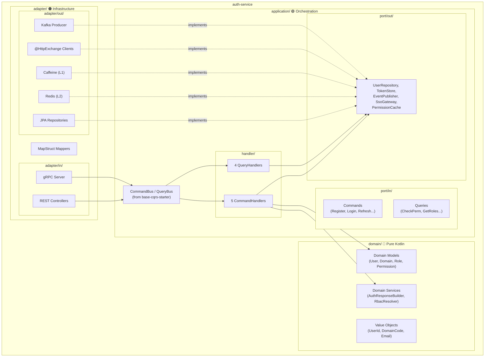

# Design: Architecture Optimization — auth-service

## 1. Architecture Overview

### 1.1 Target Architecture — Hexagonal + CQRS



### 1.2 Dependency Direction (HARD CONSTRAINT)

```
domain/     ← application/     ← adapter/
(pure)         (ports+handlers)    (infrastructure)

Rules:
✅ adapter → application → domain
❌ domain → application
❌ domain → adapter
❌ application → adapter
```

---

## 2. Component Design

### 2.1 Domain Layer

#### Domain Models

| Model | Package | Type | Mutable? |
|-------|---------|------|:--------:|
| `User` | `auth.domain.model` | Class (mixed) | ⚠️ status, passwordHash |
| `AuthToken` | `auth.domain.model` | Data class | ❌ Immutable |
| `UserStatus` | `auth.domain.model` | Sealed interface | ❌ Immutable |
| `Permission` | `rbac.domain.model` | Data class | ❌ Immutable |
| `Role` | `rbac.domain.model` | Data class | ⚠️ permissions list |
| `Policy` | `pbac.domain.model` | Class (mixed) | ⚠️ conditions |

#### Value Objects

| VO | Type | Validation |
|----|------|------------|
| `UserId` | `@JvmInline value class UserId(val value: Long)` | — |
| `DomainCode` | `@JvmInline value class DomainCode(val value: String)` | Non-blank |
| `Email` | `@JvmInline value class Email(val value: String)` | Contains `@` |
| `PasswordHash` | `@JvmInline value class PasswordHash(val value: String)` | Non-blank |

#### Domain Services

| Service | Responsibility | Source |
|---------|---------------|--------|
| `AuthResponseBuilder` | Build AuthResponse from domain models, JWT generation orchestration | Extracted from `AuthService.generateAuthResponse()` |
| `DomainLookupService` | Resolve primary domain for user | Extracted from `AuthService.getPrimaryDomain()` |
| `TokenHasher` | SHA-256 token hashing utility | Extracted from `AuthService.hashToken()` |
| `RbacResolver` | Resolve user → groups → roles → permissions chain | Extracted from `RbacEngine.resolveUserRoleIds/Permissions()` |

### 2.2 Application Layer — CQRS Handlers

#### Commands (Write Operations)

| # | Handler | Command Class | Return Type | Deps (ports) |
|---|---------|--------------|-------------|:------------:|
| 1 | `RegisterUserHandler` | `RegisterUserCommand(username, email, password, fullName, phone?, domainCode)` | `UserId` | UserPort, DomainPort, EventPublisher, AuthResponseBuilder |
| 2 | `LoginHandler` | `LoginCommand(username, password, domainCode?, captchaToken?, trustedDeviceHash?)` | `LoginResult` | UserPort, CaptchaGateway, MfaPort, AuthResponseBuilder |
| 3 | `RefreshTokenHandler` | `RefreshTokenCommand(refreshToken)` | `AuthResponse` | TokenStore, UserPort, AuthResponseBuilder |
| 4 | `SwitchDomainHandler` | `SwitchDomainCommand(userId, newDomainCode)` | `AuthResponse` | UserPort, DomainPort, AuthResponseBuilder |
| 5 | `RevokeSessionsHandler` | `RevokeSessionsCommand(userId)` | `Int` | TokenStore |

#### Queries (Read Operations)

| # | Handler | Query Class | Return Type | Deps (ports) |
|---|---------|------------|-------------|:------------:|
| 6 | `CheckPermissionHandler` | `CheckPermissionQuery(userId, domainId, resourceCode, actionCode)` | `Boolean` | PermissionCache, RbacResolver |
| 7 | `GetUserRolesHandler` | `GetUserRolesQuery(userId, domainId)` | `List<String>` | RbacResolver, DomainPort |
| 8 | `GetPermissionsHandler` | `GetPermissionsQuery(userId, domainId)` | `List<String>` | PermissionCache (batch JOIN) |
| 9 | `BuildAuthResponseHandler` | `BuildAuthResponseQuery(userId)` | `AuthResponse` | UserPort, AuthResponseBuilder |

#### Bus Configuration

```kotlin
// Auto-configured by base-cqrs-starter
// CqrsAutoConfiguration registers:
//   - SpringCommandBus(List<CommandHandler>)
//   - SpringQueryBus(List<QueryHandler>)
// All @Component-annotated handlers auto-discovered
```

### 2.3 Adapter Layer

#### Inbound Adapters

| Adapter | Type | Dispatches To |
|---------|------|---------------|
| `AuthController` | REST | CommandBus (Register, Login, Refresh, SwitchDomain) |
| `TokenController` | REST | CommandBus (Refresh, Revoke) + QueryBus (BuildAuthResponse) |
| `SsoController` | REST | CommandBus (SsoLogin) |
| `MfaController` | REST | CommandBus (MfaVerify) |
| `RbacControllers` | REST | QueryBus (CheckPermission, GetRoles, GetPermissions) |
| `PermissionGrpcService` | gRPC | QueryBus (CheckPermission, GetPermissions, ValidateToken) |

#### Outbound Ports → Implementations

| Port Interface | Implementation | Technology |
|---------------|---------------|------------|
| `UserRepository` (port) | `JpaUserRepositoryAdapter` | JPA + MapStruct |
| `DomainRepository` (port) | `JpaDomainRepositoryAdapter` | JPA + MapStruct |
| `TokenStore` | `RedisTokenStore` | StringRedisTemplate |
| `EventPublisher` | `KafkaEventPublisher` | KafkaTemplate |
| `SsoGateway` | `HttpSsoGateway` | @HttpExchange `SsoProviderClient` |
| `CaptchaGateway` | `HttpCaptchaGateway` | @HttpExchange `CaptchaClient` |
| `PermissionCache` | `MultiTierPermissionCache` | Caffeine L1 + Redis L2 |

### 2.4 Exception Bridge Design

```
ErrorCodeBase (base-core)
    ↑
AuthErrorCode (enum, auth-service) + httpStatus: HttpStatus
    ↓
BusinessException (base-core)
    ↑
AuthException (auth-service) extends BusinessException
    ↑
├── InvalidCredentialsException (AUTH_001, 401)
├── AccountLockedException (AUTH_002, 403)
├── TokenExpiredException (AUTH_003, 401)
├── PermissionDeniedException (AUTH_004, 403)
├── ResourceNotFoundException (AUTH_005, 404)
├── DuplicateResourceException (AUTH_006, 409)
└── ... (6 more)

BaseControllerAdvice (base-core)
    ↑
AuthControllerAdvice (auth-service) extends + @ExceptionHandler override
    → AuthException → ProblemDetail (RFC 7807) + correct httpStatus
    → BusinessException → delegates to super (ApiResponse, 422)
```

---

## 3. gRPC Design

### 3.1 Proto Schema

```protobuf
syntax = "proto3";
package com.ntt.auth.grpc;

service PermissionService {
  rpc CheckPermission(CheckPermissionRequest) returns (CheckPermissionResponse);
  rpc GetEffectivePermissions(EffectivePermissionsRequest) returns (PermissionSet);
  rpc ValidateToken(ValidateTokenRequest) returns (TokenValidationResponse);
  rpc CheckPermissions(stream CheckPermissionRequest) returns (stream CheckPermissionResponse);
}
```

### 3.2 gRPC Server Implementation

```kotlin
@GrpcService
class PermissionGrpcService(
    private val queryBus: QueryBus
) : PermissionServiceGrpc.PermissionServiceImplBase() {
    
    override fun checkPermission(request: CheckPermissionRequest, observer: StreamObserver<CheckPermissionResponse>) {
        val allowed = queryBus.dispatch(
            CheckPermissionQuery(request.userId, request.domainId, request.resourceCode, request.actionCode)
        )
        observer.onNext(CheckPermissionResponse.newBuilder().setAllowed(allowed).build())
        observer.onCompleted()
    }
}
```

---

## 4. Cache Architecture

### 4.1 Multi-Tier Cache Strategy

```
Request → Caffeine L1 (30s TTL) → Redis L2 (5min TTL) → DB (batch JOIN)
                                                              ↓
Kafka ← PermissionChangedEvent ← DB write ← CommandHandler

Invalidation: Kafka event → Consumer → Invalidate L1 + L2
```

### 4.2 Cache Key Design

```
L1 (Caffeine): permissions:{userId}:{domainId}
L2 (Redis):    permissions:{userId}:{domainId}
               roles:{userId}:{domainId}
```

---

## 5. @HttpExchange Design

### 5.1 SSO Provider Client

```kotlin
@HttpExchange
interface SsoProviderClient {
    @PostExchange("/oauth2/token")
    fun exchangeToken(@RequestBody request: TokenExchangeRequest): TokenResponse
    
    @GetExchange("/oauth2/userinfo")
    fun getUserInfo(@RequestHeader("Authorization") bearerToken: String): SsoUserInfo
}
```

### 5.2 CAPTCHA Client

```kotlin
@HttpExchange
interface CaptchaClient {
    @PostExchange("/recaptcha/api/siteverify")
    fun verify(@RequestBody request: CaptchaVerifyRequest): CaptchaVerifyResponse
}
```

---

## 6. Package Structure

```
auth-service/src/main/kotlin/com/ntt/authservice/
├── auth/
│   ├── domain/model/          ← Pure Kotlin
│   │   ├── User.kt
│   │   ├── AuthToken.kt
│   │   ├── UserStatus.kt
│   │   └── vo/ (UserId, Email, PasswordHash)
│   ├── domain/service/        ← Domain services
│   │   ├── AuthResponseBuilder.kt
│   │   ├── DomainLookupService.kt
│   │   └── TokenHasher.kt
│   ├── application/
│   │   ├── port/in/           ← Commands/Queries
│   │   ├── port/out/          ← Outbound ports
│   │   └── handler/           ← CQRS handlers
│   └── adapter/
│       ├── in/web/            ← REST controllers
│       ├── in/grpc/           ← gRPC service
│       └── out/
│           ├── persistence/   ← JPA + MapStruct
│           ├── cache/         ← Caffeine + Redis
│           └── http/          ← @HttpExchange
├── rbac/
│   ├── domain/service/        ← RbacResolver
│   ├── application/
│   │   ├── port/in/           ← Permission queries
│   │   └── handler/           ← RBAC handlers
│   └── adapter/               ← (existing unchanged)
├── pbac/                      ← (Phase 2 later)
└── shared/exception/          ← AuthErrorCode, AuthException, AuthControllerAdvice

services/shared/
├── grpc-proto/                ← .proto files
├── domain-common/             ← Shared VOs (pure Kotlin)
└── security-common/           ← JWT + Cache client
```

---

## 7. Gradle Dependencies

```kotlin
// auth-service/build.gradle.kts
dependencies {
    implementation(platform("com.ntt:platform"))
    
    // Shared modules
    implementation(project(":services:shared:grpc-proto"))
    implementation(project(":services:shared:domain-common"))
    implementation(project(":services:shared:security-common"))
    
    // base-core starters
    implementation("com.ntt:base-web-starter")
    implementation("com.ntt:base-data-starter")
    implementation("com.ntt:base-security-starter")
    implementation("com.ntt:base-cqrs-starter")         // CommandBus/QueryBus
    implementation("com.ntt:base-messaging-starter")     // EventBus
    implementation("com.ntt:base-resilience-starter")    // CircuitBreaker
    implementation("com.ntt:base-observability-starter") // Metrics/Tracing
    
    // gRPC
    implementation("org.springframework.boot:spring-boot-starter-grpc")
    
    // MapStruct
    implementation(libs.mapstruct)
    kapt(libs.mapstruct.processor)
    
    // Cache
    implementation("com.github.ben-manes.caffeine:caffeine")
    
    // Testing
    testImplementation("com.ntt:base-testing-starter")
    testImplementation(libs.archunit.junit5)
}
```

---

## 8. Feature Flag Strategy

```yaml
# application.yml
app:
  cqrs:
    enabled: true  # Toggle CQRS dispatch in controllers
```

```kotlin
// In controller
@ConditionalOnProperty("app.cqrs.enabled", havingValue = "true")
class CqrsAuthController(val commandBus: CommandBus) { ... }

@ConditionalOnProperty("app.cqrs.enabled", havingValue = "false", matchIfMissing = true)
class LegacyAuthController(val authService: AuthService) { ... }
```
