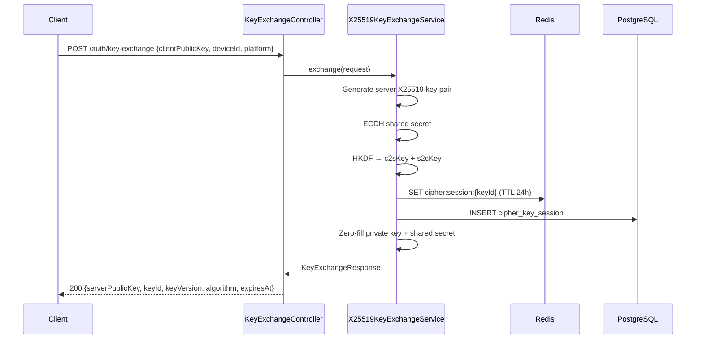
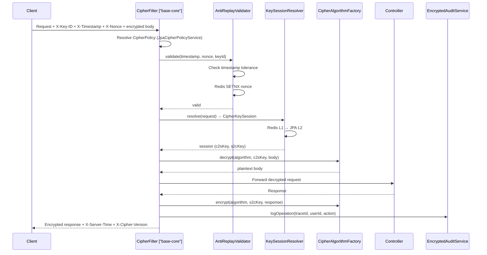

## Context

auth-service hiện có encryption cơ bản trong `TotpService.kt` (AES-256-GCM, plaintext key từ env var). `base-security-starter` đã cung cấp 39 cipher files bao gồm `CipherFilter` (272 LOC), `CipherProperties` (192 LOC), `DecryptRequestAdvice`, `EncryptResponseAdvice`, và 10+ interface contracts. auth-service chỉ cần implement các interface đó — EXTEND pattern.

See `proposal.md` — Why for full motivation. See `impact_analysis.md` for reuse map.

### Current Architecture Constraints
- Backend: Clean Architecture (port/adapter), CQRS (auth module)
- base-core: `base-security-starter` cipher module — 39 files, 8 auto-configurations, `@ConditionalOnMissingBean` pattern
- Crypto: Google Tink AEAD (recommended by `DefaultCipherAlgorithmFactory`)
- Cache: `TwoLevelCache` (L1 Caffeine + L2 Redis) — ready for DEK/policy cache
- Config: `CipherProperties` (app.cipher.*) — all properties pre-defined
- Naming: `AuthErrorCode` enum (AUTH_XXX), exception extends `AuthException`

## Goals / Non-Goals

**Goals:**
- Activate `CipherFilter` via `app.cipher.enabled=true` — zero filter code in auth-service
- Implement `CipherAlgorithmFactory` with Google Tink AEAD — automatic nonce management
- Implement `KeyExchangeService` with X25519 ECDH + HKDF-SHA256
- Implement `AntiReplayValidator` with Redis SETNX nonce dedup
- Implement `FieldSigningService` with HMAC-SHA256
- Implement key session persistence (Redis L1 + JPA L2)
- Add encrypted audit logging + break-glass Decryption Vault
- Add 10 new error codes (AUTH_030 ~ AUTH_039) to `AuthErrorCode`

**Non-Goals:**
- Modify base-core source code (consume only)
- gRPC streaming encryption (P2 — no gRPC dependency yet)
- TotpService migration to CipherAlgorithmFactory (P2 — optional refactor)
- Custom KMS provider implementation (use Tink KMS adapters)
- Standalone Decryption Vault microservice (design only, implementation separate project)

## Decisions

### D1: Reuse CipherFilter + Auto-configurations from base-core

**Choice**: Activate base-core's `CipherFilter` via config, NOT build custom filter
**Why**: `CipherFilter` (272 LOC) already handles ENCRYPT_FULL + ENCRYPT_PARTIAL, anti-replay validation, key session resolution, device binding, MDC logging, magic byte detection. Building custom = duplicate 272 LOC + risk inconsistency.
**Alternative**: Custom `E2eeEncryptionFilter` in auth-service — violates reuse-first principle
**Trade-off**: Coupled to base-core filter design, but gains consistency + zero maintenance

**Implementation**:
```yaml
# application.yml
app:
  cipher:
    enabled: true
    http:
      enabled: true
      order: 50  # after Spring Security (-100), after JwtAuthFilter
      exclude-paths:
        - /actuator/**
        - /auth/key-exchange
        - /health
        - /v3/api-docs/**
```

### D2: Tink AEAD — Override DefaultCipherAlgorithmFactory

**Choice**: Provide `TinkCipherAlgorithmFactory` as `@Service` bean — `@ConditionalOnMissingBean` in base-core will defer
**Why**: `DefaultCipherAlgorithmFactory` (base-core) throws `UnsupportedOperationException` — needs real Tink wiring. auth-service provides production impl.
**Alternative**: Wire Tink directly in `DefaultCipherAlgorithmFactory` (base-core) — affects all services, adds Tink dependency globally
**Trade-off**: Each service provides own `CipherAlgorithmFactory` impl — but most services won't need E2EE

**Implementation**:
```kotlin
@Service
class TinkCipherAlgorithmFactory : CipherAlgorithmFactory {

    init {
        AeadConfig.register()  // Register Tink AEAD primitives
    }

    override fun encrypt(
        algorithm: CipherAlgorithm,
        keyBytes: ByteArray,
        plaintext: ByteArray,
        associatedData: ByteArray
    ): ByteArray {
        val aead = resolveAead(algorithm, keyBytes)
        return aead.encrypt(plaintext, associatedData)
    }

    override fun decrypt(
        algorithm: CipherAlgorithm,
        keyBytes: ByteArray,
        ciphertext: ByteArray,
        associatedData: ByteArray
    ): ByteArray {
        val aead = resolveAead(algorithm, keyBytes)
        return aead.decrypt(ciphertext, associatedData)
    }

    private fun resolveAead(algorithm: CipherAlgorithm, keyBytes: ByteArray): Aead {
        val keyTemplate = when (algorithm) {
            CipherAlgorithm.AES_GCM -> AesGcmKeyManager.aes256GcmTemplate()
            CipherAlgorithm.CHACHA20_POLY1305 -> ChaCha20Poly1305KeyManager.chaCha20Poly1305Template()
        }
        // Import raw key bytes into Tink keyset
        val keysetHandle = KeysetHandle.importKey(
            AesGcmKey.builder().setKeyBytes(SecretBytes.copyFrom(keyBytes, InsecureSecretKeyAccess.get())).build()
        )
        return keysetHandle.getPrimitive(RegistryConfiguration.get(), Aead::class.java)
    }
}
```

### D3: X25519 ECDH Key Exchange — Implement KeyExchangeService

**Choice**: Implement `KeyExchangeService` interface (base-core) in auth-service
**Why**: Contract already defined with `KeyExchangeRequest` / `KeyExchangeResponse` DTOs. Session model `CipherKeySession` has DB schema in comments.
**Alternative**: Custom key exchange API — loses compatibility with `CipherKeySessionResolver`
**Trade-off**: Must follow exact contract (public key 32 bytes, HKDF labels "cipher-c2s"/"cipher-s2c")

**Implementation**:
```kotlin
@Service
class X25519KeyExchangeServiceImpl(
    private val sessionRepository: CipherKeySessionRepository,
    private val redisTemplate: StringRedisTemplate,
    private val cipherProperties: CipherProperties
) : KeyExchangeService {

    override fun exchange(request: KeyExchangeRequest): KeyExchangeResponse {
        // 1. Check idempotency (same clientPublicKey + deviceId)
        // 2. Generate ephemeral X25519 server key pair
        // 3. ECDH: sharedSecret = agree(serverPrivate, clientPublic)
        // 4. HKDF-SHA256: c2sKey = HKDF(secret, salt, "cipher-c2s", 32)
        // 5. HKDF-SHA256: s2cKey = HKDF(secret, salt, "cipher-s2c", 32)
        // 6. Create CipherKeySession, persist Redis + JPA
        // 7. Zero-fill serverPrivateKey + sharedSecret
        // 8. Return KeyExchangeResponse
    }
}
```

### D4: Redis Anti-Replay — Implement AntiReplayValidator

**Choice**: Redis `SETNX` + TTL for nonce dedup, timestamp range check
**Why**: Stateless, horizontally scalable, TTL auto-cleanup
**Alternative**: In-memory ConcurrentHashMap — not cluster-safe
**Trade-off**: Redis latency (~1ms) per request, but necessary for cluster safety

**Implementation**:
```kotlin
@Service
class RedisAntiReplayValidator(
    private val redisTemplate: StringRedisTemplate,
    private val cipherProperties: CipherProperties
) : AntiReplayValidator {

    override fun validate(timestamp: String, nonce: String, keyId: String): Boolean {
        // 1. Check timestamp tolerance (±windowSeconds)
        // 2. Redis SETNX (nonce key, TTL = nonceTtlSeconds)
        // 3. Return false if SETNX returns false (duplicate)
    }
}
```

### D5: Key Session Persistence — Redis L1 + JPA L2

**Choice**: `RedisCipherKeySessionResolver` looks up Redis first, fallback JPA
**Why**: `CipherKeySession` data class already has DB schema definition. `TwoLevelCache` pattern from base-cache-starter.
**Alternative**: Redis-only (no JPA backup) — data loss on Redis flush
**Trade-off**: JPA adds 1-2ms on cache miss, but provides durability

### D6: Encrypted Audit — Extend AuditLogService

**Choice**: Add `logEncryptedOperation()` method to existing `AuditLogService` — backward compatible
**Why**: `AuditLogService` already has 5+ callers, changing signature breaks them
**Alternative**: New `EncryptedAuditService` completely separate — duplicates audit infrastructure
**Trade-off**: Slightly larger `AuditLogService` class, but consistent audit interface

### D7: Error Codes — AUTH_030 to AUTH_039

**Choice**: Add 10 new codes in `AuthErrorCode` enum, range AUTH_030~039
**Why**: Follows existing convention (AUTH_001~021), leaves gap for future MFA codes (022~029)
**Alternative**: New `CipherErrorCode` enum — breaks single error code namespace
**Trade-off**: Larger enum, but consistent error handling via `GlobalExceptionHandler`

## Component Mapping

### New Components (auth-service)

| Component | Package | Implements | FR |
|-----------|---------|-----------|-----|
| `TinkCipherAlgorithmFactory` | `auth.adapter.out.cipher` | `CipherAlgorithmFactory` | FR-005, FR-006 |
| `X25519KeyExchangeServiceImpl` | `auth.application.cipher` | `KeyExchangeService` | FR-014~019, FR-031 |
| `RedisCipherKeySessionResolver` | `auth.adapter.out.cipher` | `CipherKeySessionResolver` | FR-016 |
| `CipherKeySessionEntity` | `auth.adapter.out.persistence.entity` | JPA entity | FR-014 |
| `CipherKeySessionJpaRepository` | `auth.adapter.out.persistence.repository` | `CipherKeySessionRepository` | FR-014 |
| `RedisAntiReplayValidator` | `auth.adapter.out.cipher` | `AntiReplayValidator` | FR-009~013 |
| `HmacFieldSigningServiceImpl` | `auth.adapter.out.cipher` | `FieldSigningService` | FR-005 |
| `EncryptedAuditService` | `auth.application.cipher` | NEW | FR-020, FR-032 |
| `DecryptionVaultService` | `auth.application.cipher` | NEW | FR-021~025 |
| `VaultAccessLogEntity` | `auth.adapter.out.persistence.entity` | JPA entity | FR-025 |
| `KeyExchangeController` | `auth.adapter.in.web` | REST | FR-014 |
| `CipherVersionNegotiator` | `auth.application.cipher` | NEW | FR-026~030 |
| `CipherExceptions` | `auth.shared.exception` | AuthException subclasses | FR all |

### Modified Components

| Component | Change | Impact |
|-----------|--------|--------|
| `AuthErrorCode` | Add AUTH_030~039 | 🟢 Low — additive enum values |
| `AuditLogService` | Add `logEncryptedOperation()` | 🟢 Low — backward compatible |
| `application.yml` | Add `app.cipher.*` block | 🟢 Low — new config section |
| `build.gradle.kts` | Add `com.google.crypto.tink:tink:1.15+` | 🟢 Low — new dependency |

### Reused Components (base-core — NO modification)

| Component | From | Role |
|-----------|------|------|
| `CipherFilter` | base-security-starter | HTTP filter |
| `DecryptRequestAdvice` | base-security-starter | Field decrypt |
| `EncryptResponseAdvice` | base-security-starter | Field encrypt |
| `CipherProperties` | base-security-starter | Config |
| `JpaCipherPolicyService` | base-business | Policy persistence |
| `TwoLevelCache` | base-cache-starter | DEK/policy cache |
| 8 auto-configuration classes | base-security-starter | Bean wiring |

## Database Schema

### cipher_key_session (NEW)

```sql
CREATE TABLE cipher_key_session (
    key_id               VARCHAR(36)  PRIMARY KEY,
    user_id              VARCHAR(100),
    device_id            VARCHAR(200) NOT NULL,
    platform             VARCHAR(20)  NOT NULL,
    algorithm_id         VARCHAR(50)  NOT NULL,
    client_to_server_key BYTEA        NOT NULL,
    server_to_client_key BYTEA        NOT NULL,
    key_version          INT          NOT NULL,
    app_version          VARCHAR(50)  NOT NULL,
    created_at           BIGINT       NOT NULL,
    expires_at           BIGINT       NOT NULL,
    is_active            BOOLEAN      DEFAULT TRUE
);
CREATE INDEX idx_key_session_user_device ON cipher_key_session(user_id, device_id);
CREATE INDEX idx_key_session_active ON cipher_key_session(is_active) WHERE is_active = TRUE;
```

### audit_log_encrypted (NEW)

```sql
CREATE TABLE audit_log_encrypted (
    id                   BIGSERIAL    PRIMARY KEY,
    trace_id             VARCHAR(36)  NOT NULL,
    user_id              VARCHAR(100),
    action               VARCHAR(50)  NOT NULL,
    encrypted_payload_ref VARCHAR(500),
    key_id_used          VARCHAR(36),
    created_at           BIGINT       NOT NULL
);
CREATE INDEX idx_audit_encrypted_user ON audit_log_encrypted(user_id, created_at);
CREATE INDEX idx_audit_encrypted_trace ON audit_log_encrypted(trace_id);
```

### vault_access_log (NEW)

```sql
CREATE TABLE vault_access_log (
    id                   BIGSERIAL    PRIMARY KEY,
    requester_id         VARCHAR(100) NOT NULL,
    approver_id          VARCHAR(100),
    request_type         VARCHAR(50)  NOT NULL,
    status               VARCHAR(20)  NOT NULL DEFAULT 'PENDING',
    target_audit_id      BIGINT,
    decrypt_count        INT          NOT NULL DEFAULT 0,
    max_decrypts         INT          NOT NULL DEFAULT 10,
    expires_at           BIGINT,
    created_at           BIGINT       NOT NULL,
    approved_at          BIGINT
);
CREATE INDEX idx_vault_access_requester ON vault_access_log(requester_id, status);
```

## Sequence Diagrams

### Key Exchange Flow



### Encrypted Request Flow


