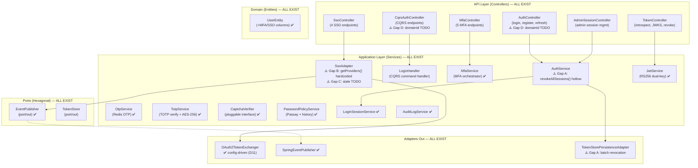

# Design: Auth Core Features — Final Completion & Production Readiness

> **Change**: auth-core-features | **Type**: EXTEND | **Flow**: Non-Financial
> **Direction**: Approach B — Remaining Gaps Closure + Testing Validation + Production Readiness (from brainstorm)
> **_Generated**: 2026-08-20 (v3 — merged from v2 2026-08-19)
> **Status**: ~95% code exists — design focuses on 4 micro-gaps from brainstorm 2026-08-20

## Changes

[CHANGED] D11-D14 from previous brainstorm now IMPLEMENTED. Design updated to reflect 4 remaining gaps (A/B/C/D).
[REMOVED] Gap 1 (Config-Driven SSO): Already implemented — `OAuth2TokenExchanger` uses `securityProperties.sso.providers[provider]`
[REMOVED] Gap 2 (Trusted Device Save): Already implemented — `MfaService.verifyMfa()` saves `trustedDeviceHash`
[REMOVED] Gap 3 (SSO Provisioning Event): Already implemented — `SsoAdapter` calls `eventPublisher.publish(SsoProvisionedEvent(...))`
[NEW] Gap A: `revokeAllSessions()` hollow implementation
[NEW] Gap B: `SsoAdapter.getProviders()` hardcoded provider list
[NEW] Gap C: Stale TODO in SsoAdapter.kt:170
[NEW] Gap D: `domainId` resolution in password change controllers

---

## 1. Component Architecture (Current State — Post D11-D14)

All components EXIST. Diagram reflects current codebase state. Red markers (⚠️) indicate gap fixes needed.



---

## 2. Gap Analysis — Components to MODIFY

### 2.1 AuthService.revokeAllSessions() — MODIFY (Gap A: Hollow Implementation)

> **Brainstorm Q2**: revokeAllSessions() returns 0 and doesn't actually revoke anything

```
Package: com.ntt.authservice.auth.application
File: AuthService.kt (EXISTING — L281-289)

BEFORE (hollow):
  @Transactional
  fun revokeAllSessions(userId: Long): Int {
      val user = userRepository.findById(userId).orElseThrow { ... }
      log.info("All sessions revoked for userId={}", userId)
      return 0 // TODO: count revoked tokens
  }

AFTER (complete):
  @Transactional
  fun revokeAllSessions(userId: Long): Int {
      val user = userRepository.findById(userId).orElseThrow {
          ResourceNotFoundException("User", "id", userId.toString())
      }

      // 1. Revoke all active refresh tokens
      val revokedCount = refreshTokenRepository.revokeAllByUserId(userId)

      // 2. End all login sessions
      loginSessionRepository.deleteAllByUserId(userId)

      // 3. Access tokens expire naturally (max 15min) — industry standard for JWT
      // No per-token JTI blacklisting for bulk revoke

      auditLogService.logEvent(userId, AuditAction.SESSION_REVOKED,
          entityType = "User", entityId = userId.toString())
      log.info("All sessions revoked for userId={}: {} tokens revoked", userId, revokedCount)
      return revokedCount
  }

DEPENDENCIES:
  - refreshTokenRepository: RefreshTokenRepository — needs new query method
  - loginSessionRepository: LoginSessionRepository — deleteAllByUserId exists? verify
  - auditLogService: AuditLogService — already injected

IMPACT:
  - ~20 lines changed in AuthService.kt
  - No public API change — revokeAllSessions(userId) signature unchanged
  - Callers: RevokeSessionsHandler (1 caller) — unaffected
```

### 2.2 RefreshTokenRepository — MODIFY (Gap A: Batch Revocation Query)

```
Package: com.ntt.authservice.rbac.adapter.out.persistence.repository
File: Repositories.kt (EXISTING — RefreshTokenRepository section)

ADD query method:
  @Modifying
  @Query("UPDATE RefreshTokenEntity r SET r.revoked = true WHERE r.userId = :userId AND r.revoked = false")
  fun revokeAllByUserId(@Param("userId") userId: Long): Int

IMPACT:
  - 3 lines added (annotation + query + method)
  - No breaking changes — new method only
```

### 2.3 SsoAdapter.getProviders() — MODIFY (Gap B: Config-Driven)

> **Brainstorm Q3**: Simple config-driven approach

```
Package: com.ntt.authservice.auth.application
File: SsoAdapter.kt (EXISTING — L83-91)

BEFORE (hardcoded):
  fun getProviders(): List<SsoProviderInfo> {
      if (!securityProperties.sso.enabled) return emptyList()
      return listOf(
          SsoProviderInfo("google", "Google", true),
          SsoProviderInfo("microsoft", "Microsoft", true),
          SsoProviderInfo("keycloak", "Keycloak", true)
      )
  }

AFTER (config-driven):
  fun getProviders(): List<SsoProviderInfo> {
      if (!securityProperties.sso.enabled) return emptyList()
      return securityProperties.sso.providers
          .filter { (_, config) -> config.enabled }
          .map { (id, _) -> SsoProviderInfo(
              id = id,
              name = id.replaceFirstChar { it.uppercase() },
              enabled = true
          )}
  }

IMPACT:
  - ~10 lines changed
  - No public API change — getProviders() return type unchanged
  - Callers: SsoController.getProviders() (1 caller) — unaffected
  - Now consistent with OAuth2TokenExchanger config-driven approach
```

### 2.4 SsoAdapter — MODIFY (Gap C: Remove Stale TODO)

```
Package: com.ntt.authservice.auth.application
File: SsoAdapter.kt (EXISTING — L170)

REMOVE:
  // TODO: Implement per-provider token exchange (already resolved by OAuth2TokenExchanger)

IMPACT:
  - 1 line removed
  - No functional change — comment only
```

### 2.5 AuthController + CqrsAuthController — MODIFY (Gap D: domainId Resolution)

```
Package: com.ntt.authservice.auth.adapter.in.web
Files: AuthController.kt (L67), CqrsAuthController.kt (L197)

BEFORE (TODO):
  // TODO: resolve domainId from user's active domain
  val domainId: Long? = null  // placeholder

AFTER (resolved):
  val domainId = domainLookupService.getActiveDomainId(userId)
      ?: throw ResourceNotFoundException("Domain", "userId", userId.toString())

DEPENDENCIES:
  - DomainLookupService — already exists at auth/application/DomainLookupService.kt
  - Need to inject into controllers if not already injected

IMPACT:
  - ~8 lines changed per controller (2 controllers)
  - Enables password policy enforcement per domain
  - No API change — internal logic only
```

---

## 3. Existing Component Specifications (REUSE — No Changes)

> These components are fully implemented and verified. No changes needed.

### 3.1 LoginResult (Sealed Class) — EXISTS ✅
```
File: auth/application/LoginResult.kt
sealed class LoginResult { Success(response), MfaRequired(mfaToken, method, expiresIn) }
```

### 3.2 MfaService — EXISTS ✅ (D12 IMPLEMENTED)
```
File: auth/application/MfaService.kt (8775 bytes)
Methods: initiateMfa(), verifyMfa(mfaToken, code, trustDevice, deviceHash), setupTotp(), confirmTotp(), resendOtp(), updateSettings()
Trusted device save: lines 109-118 — saves trustedDeviceHash on verifyMfa() success
```

### 3.3 OtpService — EXISTS ✅
```
File: auth/application/OtpService.kt (3614 bytes)
Methods: generateOtp(), verifyOtp(), deleteOtp()
Redis keys: otp:{userId}:{channel}, mfa:totp:setup:{userId}
```

### 3.4 TotpService — EXISTS ✅
```
File: auth/application/TotpService.kt (4585 bytes)
Library: dev.samstevens.totp:totp:1.7.1, AES-256-GCM encryption
```

### 3.5 CaptchaVerifier — EXISTS ✅
```
File: auth/application/CaptchaVerifier.kt (2120 bytes)
Interface: CaptchaVerifier { fun verify(token: String): Boolean }
```

### 3.6 OAuth2TokenExchanger — EXISTS ✅ (D11 IMPLEMENTED)
```
File: auth/adapter/out/sso/OAuth2TokenExchanger.kt
Config-driven: securityProperties.sso.providers[provider]?.tokenEndpoint
Supports: Google, Microsoft, Keycloak (any OIDC via config)
```

### 3.7 EventPublisher + SsoProvisionedEvent — EXISTS ✅ (D13 IMPLEMENTED)
```
Port: auth/application/port/out/EventPublisher.kt — interface EventPublisher { fun publish(event: DomainEvent) }
Event: SsoProvisionedEvent(userId, provider, email, domainCode) : DomainEvent
Adapter: auth/adapter/out/event/SpringEventPublisher.kt — ApplicationEventPublisher
Usage: SsoAdapter.handleCallback() line 76 — eventPublisher.publish(SsoProvisionedEvent(...))
```

### 3.8 JwtService — EXISTS ✅
```
File: auth/application/JwtService.kt (8698 bytes)
RS256 primary, HMAC legacy fallback, kid header, JWKS generation
```

### 3.9 PasswordPolicyService — EXISTS ✅
```
File: auth/application/PasswordPolicyService.kt (6703 bytes)
Passay integration, ConcurrentHashMap cache per domainId
```

### 3.10 SecurityProperties — EXISTS ✅ (D11 IMPLEMENTED)
```
File: shared/config/SecurityProperties.kt
SsoProperties.providers: Map<String, ProviderConfig> — already added
ProviderConfig(tokenEndpoint, userInfoEndpoint, clientId, clientSecret, enabled)
```

---

## 4. Entity Design (ALL EXIST — V2 Migration Applied, No Changes)

All entities and DB columns exist from prior migrations. No new DDL needed.

### UserEntity — EXISTS ✅
```kotlin
var mfaEnabled: Boolean = false
var mfaMethod: String = "NONE"
var totpSecretEncrypted: String? = null
var trustedDeviceHash: String? = null
var passwordChangedAt: Instant? = null
```

### RefreshTokenEntity — EXISTS ✅ (Gap A adds query method only)
```
Fields: id, userId, tokenHash, expiresAt, revoked, createdAt
Repository: RefreshTokenRepository — needs revokeAllByUserId() query
```

### LoginSessionEntity — EXISTS ✅
```
Fields: id, userId, sessionToken, ipAddress, userAgent, createdAt, expiresAt
Repository: LoginSessionRepository — deleteAllByUserId() may exist
```

---

## 5. Controller Design (ALL EXIST — Gap D Fix Only)

### 5.1 MfaController — EXISTS ✅ (No changes — D12 already wired)
```
POST /api/auth/mfa/verify        → mfaService.verifyMfa(mfaToken, code, trustDevice, deviceHash)  ✅
POST /api/auth/mfa/totp/setup    → mfaService.setupTotp(userId)
POST /api/auth/mfa/totp/confirm  → mfaService.confirmTotp(userId, code)
POST /api/auth/mfa/resend        → mfaService.resendOtp(mfaToken)
PUT  /api/auth/mfa/settings      → mfaService.updateSettings(userId, enabled, method)
```

### 5.2 SsoController — EXISTS ✅ (No changes — Gap B is in SsoAdapter)
```
POST   /api/auth/sso/callback            → ssoAdapter.handleCallback(code, provider, redirectUri)
GET    /api/auth/sso/providers            → ssoAdapter.getProviders()  ← Gap B fix is in SsoAdapter
POST   /api/auth/sso/link                → ssoAdapter.linkIdentity(userId, code, provider)
DELETE /api/auth/sso/unlink/{provider}    → ssoAdapter.unlinkIdentity(userId, provider)
```

### 5.3 TokenController — EXISTS ✅
```
POST /api/auth/introspect                   → jwtService.introspect(token)
GET  /.well-known/jwks.json                  → jwtService.getJwks()
```

### 5.4 AdminSessionController — EXISTS ✅ (Gap A fix is in AuthService)
```
POST /api/auth/sessions/{userId}/revoke-all  → revokeSessionsHandler.handle(command) → authService.revokeAllSessions(userId)
```

### 5.5 AuthController + CqrsAuthController — EXISTS (MODIFY for Gap D)
```
POST /api/auth/change-password → ⚠️ domainId = domainLookupService.getActiveDomainId(userId)
                                  → passwordPolicyService.changePassword(userId, domainId, oldPassword, newPassword)
```

---

## 6. Exception Design (ALL EXIST — No New Exceptions)

All exception classes and error codes already exist. No additions needed for v3 gaps.

---

## 7. Testing Strategy (Updated for v3 Gaps)

### 7.1 Existing Tests (REUSE)

| Test Class | Type | Status |
|-----------|------|--------|
| `LoginHandlerTest` | Unit | ✅ EXISTS |
| `MfaServiceTest` | Unit | ✅ EXISTS |
| `MfaServiceEdgeCaseTest` | Unit | ✅ EXISTS (7025 bytes) |
| `PasswordPolicyServiceTest` | Unit | ✅ EXISTS |
| `OtpServiceTest` | Unit | ✅ EXISTS |
| `SsoAdapterTest` | Unit | ✅ EXISTS |
| `MfaRateLimitServiceTest` | Unit | ✅ EXISTS |
| `MfaLoginFlowIntegrationTest` | Integration | ✅ EXISTS (9678 bytes) |
| `SsoCallbackIntegrationTest` | Integration | ✅ EXISTS (10177 bytes) |
| `TokenIntrospectionIntegrationTest` | Integration | ✅ EXISTS |
| `JwksEndpointIntegrationTest` | Integration | ✅ EXISTS |
| `PasswordChangeIntegrationTest` | Integration | ✅ EXISTS |
| `TotpSetupFlowIntegrationTest` | Integration | ✅ EXISTS |

### 7.2 New Test Scenarios (for v3 Gaps)

| # | Scenario | Target Test Class | Type | Gap |
|---|----------|-------------------|------|-----|
| T1 | revokeAllSessions revokes refresh tokens + cleans sessions + returns count | Existing integration test or new `AdminSessionIntegrationTest.kt` | Integration | Gap A |
| T2 | getProviders() returns only config-enabled providers | `SsoAdapterTest.kt` (add method) | Unit | Gap B |
| T3 | Password change with domainId resolution | `PasswordChangeIntegrationTest.kt` (add method) | Integration | Gap D |

---

## 8. Design Decisions (Final State — v3)

| # | Decision | Status | Impact |
|---|----------|--------|--------|
| D1-D10 | Prior sprint decisions | ✅ IMPLEMENTED | — |
| D11 | Config-driven SSO providers | ✅ IMPLEMENTED | OAuth2TokenExchanger |
| D12 | Trusted device save on MFA verify | ✅ IMPLEMENTED | MfaService |
| D13 | EventPublisher port for SSO provisioning | ✅ IMPLEMENTED | SsoAdapter |
| D14 | Defer trusted device TTL | ✅ ACCEPTED | No code change |
| D15 | **revokeAllSessions: refresh token revocation only** | **PENDING** | AuthService |
| D16 | **getProviders() reads from config** | **PENDING** | SsoAdapter |
| D17 | **domainId from authenticated user's active domain** | **PENDING** | AuthController, CqrsAuthController |
