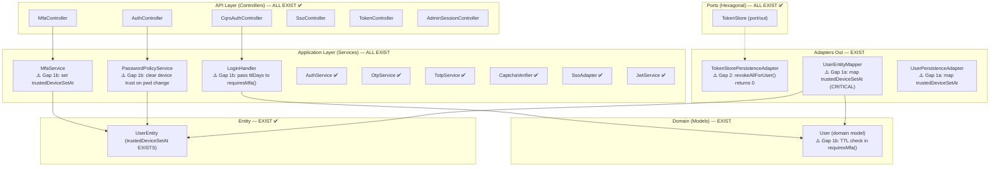

# Design: Auth Core Features — Trusted Device Hardening & Final Cleanup (v5)

> **Change**: auth-core-features | **Type**: EXTEND | **Flow**: Non-Financial
> **Direction**: Approach B — TTL Enforcement + Mapper Gap Fix + Adapter Cleanup + Test Coverage (from brainstorm v5)
> **_Generated**: 2026-08-25 (v5 — delta from v4 2026-08-21)
> **Status**: ~95% code exists — design focuses on mapper fix (CRITICAL) + FR-005 TTL + adapter fix
> **Archive**: `openspec/changes/archive/2026-08-20-auth-core-features/design.md`

## Changes

[CHANGED] v4→v5: Code re-scan 2026-08-25 confirms V10 applied, entity fields exist. Mapper gap elevated to CRITICAL.
[CHANGED] Gap 1 restructured: mapper fix (1a) is PREREQUISITE for TTL logic (1b). Without mapper, TTL logic sees null.
[CHANGED] V10 migration section REMOVED — already applied. No new migration files.
[CHANGED] UserEntity section updated — field already exists, no modification needed.
[UNCHANGED] Gap 2 (TokenStorePersistenceAdapter) — same fix.
[UNCHANGED] Testing strategy — same scenarios.

---

## 1. Component Architecture (Current State)

All components EXIST. Red markers (⚠️) indicate gap fixes needed in v5.



---

## 2. Gap Analysis — Components to MODIFY

### 2.1 UserEntityMapper — MODIFY (Gap 1a: Map `trustedDeviceSetAt` — CRITICAL)

```
Package: com.ntt.authservice.auth.adapter.out.persistence.mapper
File: UserEntityMapper.kt (EXISTING — 53 lines)

BEFORE — toDomain() L15-32:
  fun UserEntity.toDomain() = User(
      ...
      trustedDeviceHash = this.trustedDeviceHash,
      passwordChangedAt = this.passwordChangedAt,    // ← trustedDeviceSetAt MISSING
      ...
  )

AFTER — toDomain():
  fun UserEntity.toDomain() = User(
      ...
      trustedDeviceHash = this.trustedDeviceHash,
      trustedDeviceSetAt = this.trustedDeviceSetAt,  // ← ADD
      passwordChangedAt = this.passwordChangedAt,
      ...
  )

BEFORE — toEntity() L34-53:
  entity.apply {
      ...
      trustedDeviceHash = this@toEntity.trustedDeviceHash
      passwordChangedAt = this@toEntity.passwordChangedAt  // ← trustedDeviceSetAt MISSING
  }

AFTER — toEntity():
  entity.apply {
      ...
      trustedDeviceHash = this@toEntity.trustedDeviceHash
      trustedDeviceSetAt = this@toEntity.trustedDeviceSetAt  // ← ADD
      passwordChangedAt = this@toEntity.passwordChangedAt
  }

IMPACT:
  - 2 lines added (1 per direction)
  - CRITICAL: Without this fix, User.trustedDeviceSetAt is always null in domain model
  - No breaking changes — existing callers unaffected
  - Must be done BEFORE TTL logic (Gap 1b)
```

### 2.2 UserPersistenceAdapter — MODIFY (Gap 1a: Map `trustedDeviceSetAt`)

```
Package: com.ntt.authservice.auth.adapter.out.persistence
File: UserPersistenceAdapter.kt (EXISTING)

Verify if adapter has manual User() construction or uses UserEntityMapper.toDomain().
If manual → add trustedDeviceSetAt mapping:
    trustedDeviceSetAt = this.trustedDeviceSetAt,

If uses UserEntityMapper → Task 2.1 handles it automatically.

IMPACT:
  - 0-1 lines added (depends on usage pattern)
  - No breaking changes
```

### 2.3 User Domain Model — MODIFY (Gap 1b: TTL Check in requiresMfa)

```
Package: com.ntt.authservice.auth.domain.model
File: User.kt (EXISTING — 78 lines)

BEFORE (L73-76):
  fun requiresMfa(deviceHash: String?): Boolean {
      if (!mfaEnabled || mfaMethod == "NONE") return false
      return deviceHash == null || deviceHash != trustedDeviceHash
  }

AFTER:
  fun requiresMfa(deviceHash: String?, ttlDays: Long = 30): Boolean {
      if (!mfaEnabled || mfaMethod == "NONE") return false
      if (deviceHash == null || deviceHash != trustedDeviceHash) return true
      // Device hash matches — check TTL
      val setAt = trustedDeviceSetAt ?: return true  // No timestamp → treat as expired
      return setAt.plus(ttlDays, ChronoUnit.DAYS).isBefore(Instant.now())
  }

NOTE: User.kt already imports ChronoUnit (L7). Field trustedDeviceSetAt already in constructor (L27).

DEPENDENCIES:
  - java.time.temporal.ChronoUnit — ALREADY IMPORTED (L7)
  - No external dependencies

IMPACT:
  - requiresMfa() signature change: new optional parameter (default 30 — backward-compatible)
  - Callers: LoginHandler.kt (1 production caller) — will pass ttlDays explicitly
  - Test callers: UserTest.kt — needs TTL test scenarios
```

### 2.4 MfaService.verifyMfa() — MODIFY (Gap 1b: Set Timestamp)

```
Package: com.ntt.authservice.auth.application
File: MfaService.kt (EXISTING — trusted device save section)

BEFORE (trusted device save section):
    user.trustedDeviceHash = deviceHash
    userRepository.save(user)

AFTER:
    user.trustedDeviceHash = deviceHash
    user.trustedDeviceSetAt = Instant.now()    // ← NEW LINE
    userRepository.save(user)

NOTE: MfaService operates on UserEntity directly (not domain model).
  UserEntity.trustedDeviceSetAt already exists (confirmed in entity).

IMPACT:
  - 1 line added
  - No signature change — internal logic only
```

### 2.5 LoginHandler — MODIFY (Gap 1b: Pass TTL Config)

```
Package: com.ntt.authservice.auth.application.command
File: LoginHandler.kt (EXISTING)

BEFORE:
    if (user.requiresMfa(command.trustedDeviceHash)) {

AFTER:
    if (user.requiresMfa(command.trustedDeviceHash, securityProperties.mfa.trustedDeviceTtlDays)) {

DEPENDENCIES:
  - securityProperties: SecurityProperties — verify if already injected
  - If not injected → add constructor parameter: `private val securityProperties: SecurityProperties`

IMPACT:
  - 1 line changed
  - No public API change
  - SecurityProperties.mfa.trustedDeviceTtlDays already exists and defaults to 30
```

### 2.6 PasswordPolicyService.changePassword() — MODIFY (Gap 1b: Clear Device Trust)

```
Package: com.ntt.authservice.auth.application
File: PasswordPolicyService.kt (EXISTING — after user.passwordChangedAt = Instant.now())

ADD after passwordChangedAt assignment:
    // Clear trusted device on password change — security best practice (D19)
    user.trustedDeviceHash = null
    user.trustedDeviceSetAt = null

IMPACT:
  - 3 lines added (comment + 2 null assignments)
  - No public API change — internal logic only
  - Security improvement: password change invalidates device trust
```

### 2.7 TokenStorePersistenceAdapter.revokeAllForUser() — MODIFY (Gap 2: Fix Stale TODO)

```
Package: com.ntt.authservice.auth.adapter.out.persistence
File: TokenStorePersistenceAdapter.kt (EXISTING — L46-49)

BEFORE (L46-49):
    override fun revokeAllForUser(userId: Long): Int {
        // TODO: Add custom query findAllByUserIdAndRevokedFalse for batch revocation
        return 0
    }

AFTER:
    override fun revokeAllForUser(userId: Long): Int {
        return refreshTokenRepository.revokeAllByUserId(userId)
    }

DEPENDENCIES:
  - refreshTokenRepository: RefreshTokenRepository — ALREADY INJECTED (L14)
  - revokeAllByUserId(userId: Long): Int — ALREADY EXISTS in Repositories.kt

IMPACT:
  - 2 lines changed (remove TODO, add delegation)
  - TokenStore port signature unchanged
  - Callers: RevokeSessionsHandler.kt (1 caller via TokenStore port) — now receives actual count
```

---

## 3. Existing Component Specifications (REUSE — No Changes in v5)

> These components are fully implemented and verified. No changes needed.

### 3.1 OtpService — EXISTS ✅
`File: auth/application/OtpService.kt` — Redis-backed OTP with constant-time compare.

### 3.2 TotpService — EXISTS ✅
`File: auth/application/TotpService.kt` — dev.samstevens.totp, AES-256-GCM encryption.

### 3.3 CaptchaVerifier + AltchaCaptchaVerifier — EXISTS ✅
`File: auth/application/CaptchaVerifier.kt` — pluggable interface. ALTCHA default implementation.

### 3.4 SsoAdapter — EXISTS ✅
`File: auth/application/SsoAdapter.kt` — handleCallback(), linkIdentity(), unlinkIdentity(), getProviders(). All config-driven.

### 3.5 OAuth2TokenExchanger — EXISTS ✅
`File: auth/adapter/out/sso/OAuth2TokenExchanger.kt` — config-driven via securityProperties.sso.providers.
[CHANGED] v5: Confirmed Keycloak = config-only (no code change needed).

### 3.6 JwtService — EXISTS ✅
`File: auth/application/JwtService.kt` — RS256 primary, HMAC legacy fallback, JWKS generation.

### 3.7 AuthService — EXISTS ✅
`File: auth/application/AuthService.kt` — revokeAllSessions() fully functional.

### 3.8 KafkaEventPublisher — EXISTS ✅
`File: auth/adapter/out/event/KafkaEventPublisher.kt` — @Primary, @ConditionalOnProperty, retry 3 attempts.

### 3.9 AuditLogService — EXISTS ✅
`File: shared/audit/AuditLogService.kt` — 25 AuditAction types including TRUSTED_DEVICE_SET.

### 3.10 SecurityProperties — EXISTS ✅
`File: shared/config/SecurityProperties.kt` — mfa.trustedDeviceTtlDays = 30 (will be activated by Gap 1b).

### 3.11 IdempotencyFilter — EXISTS ✅
`File: shared/filter/IdempotencyFilter.kt` — Redis-backed, X-Idempotency-Key header, 24h TTL.

---

## 4. Entity Design

### UserEntity — NO CHANGES NEEDED IN v5
```kotlin
// File: rbac/adapter/out/persistence/entity/UserEntity.kt
// Both fields ALREADY EXIST (confirmed code scan 2026-08-25):
@Column(name = "trusted_device_hash", length = 255)
var trustedDeviceHash: String? = null

@Column(name = "trusted_device_set_at")     // ← ALREADY EXISTS
var trustedDeviceSetAt: java.time.Instant? = null  // ← ALREADY EXISTS
```

### V10 Migration — ALREADY APPLIED ✅
`src/main/resources/db/migration/V10__trusted_device_ttl.sql` — confirmed exists.

### RefreshTokenEntity — NO CHANGES
`revokeAllByUserId()` query already exists in `Repositories.kt`.

---

## 5. Controller Design — NO CHANGES in v5

All controllers are fully implemented. No controller modifications needed.

---

## 6. Exception Design — NO NEW EXCEPTIONS

Trusted device TTL expiry is transparent — user gets `MfaRequiredResponse` (existing `MfaRequiredResponse`). No new exception classes or error codes needed.

---

## 7. Testing Strategy (v5 — TTL Focus)

### 7.1 Existing Tests to MODIFY

| Test Class | Change | Gap |
|-----------|--------|-----|
| `UserTest.kt` | Add TTL expiry scenarios to `requiresMfa()` tests | Gap 1b |
| `MfaLoginFlowIntegrationTest.kt` | Add TTL-aware trusted device test (skip MFA → expire → require MFA) | Gap 1b |

### 7.2 New Test Scenarios

| # | Scenario | Target Test Class | Type | Gap |
|---|----------|-------------------|------|-----|
| T1 | `requiresMfa()` with valid device hash + valid TTL → false (skip MFA) | `UserTest.kt` (extend) | Unit | Gap 1b |
| T2 | `requiresMfa()` with valid hash + expired TTL → true (require MFA) | `UserTest.kt` (extend) | Unit | Gap 1b |
| T3 | `requiresMfa()` with valid hash + null setAt → true (treat as expired) | `UserTest.kt` (extend) | Unit | Gap 1b |
| T4 | Login → MFA verify → trust device → re-login → MFA skipped (device trusted) | `MfaLoginFlowIntegrationTest.kt` (extend) | Integration | Gap 1b |
| T5 | MFA verify with trustDevice=true → trustedDeviceSetAt saved with Instant.now() | `MfaLoginFlowIntegrationTest.kt` (extend) | Integration | Gap 1b |
| T6 | Password change → trustedDeviceHash + trustedDeviceSetAt cleared | `PasswordChangeIntegrationTest.kt` (extend) | Integration | Gap 1b |
| T7 | `revokeAllForUser()` returns actual revoked count (not 0) | `TokenStorePersistenceAdapter` test | Unit | Gap 2 |

---

## 8. Design Decisions (Final State — v5)

| # | Decision | Status | Impact |
|---|----------|--------|--------|
| D1-D17 | Prior sprint decisions | ✅ ALL IMPLEMENTED | — |
| D18 | **DB-only `trusted_device_set_at` — no Redis TTL** | ✅ V10 APPLIED | Migration exists, entity field exists |
| D19 | **Clear device trust on password change — not force-logout** | **PENDING** | PasswordPolicyService |
| D20 | **Fix `TokenStorePersistenceAdapter.revokeAllForUser()`** | **PENDING** | TokenStorePersistenceAdapter |
| D21 | **Fix UserEntityMapper trustedDeviceSetAt mapping (CRITICAL)** | **PENDING** | UserEntityMapper, UserPersistenceAdapter |
| D22 | **`requiresMfa()` receives `ttlDays` as parameter** | **PENDING** | User domain model, LoginHandler |
| D23 | **MfaService set `trustedDeviceSetAt = now()` on trust save** | **PENDING** | MfaService |
| D24 | **Keep domain model pure (no framework deps)** | DECIDED | Pass config as params (D22) |
| D25 | **Keycloak support = config-only** | ✅ RESOLVED | OAuth2TokenExchanger already config-driven |
| D26 | **Force-logout does NOT clear trusted device** | DECIDED | Only password change does |

---

## 9. Sequence Diagram — Trusted Device TTL Flow

```
Login with Trusted Device (Happy Path):

    Client              LoginHandler            User (domain)          SecurityProperties
      |                      |                       |                        |
      |-- POST /login ------>|                       |                        |
      |   {deviceHash}       |                       |                        |
      |                      |-- requiresMfa() ----->|                        |
      |                      |   (deviceHash,        |                        |
      |                      |    ttlDays=30) ------>|                        |
      |                      |                       |-- check hash match     |
      |                      |                       |-- check setAt + 30d    |
      |                      |                       |   > now()? → valid     |
      |                      |<-- false (skip MFA) --|                        |
      |<-- AuthResponse -----|                       |                        |

Login with Expired Device Trust:

    Client              LoginHandler            User (domain)
      |                      |                       |
      |-- POST /login ------>|                       |
      |   {deviceHash}       |-- requiresMfa() ----->|
      |                      |   (deviceHash, 30)    |-- hash matches ✅
      |                      |                       |-- setAt + 30d < now()
      |                      |                       |   → EXPIRED
      |                      |<-- true (MFA req) ----|
      |<-- MfaRequired ------|                       |

MFA Verify + Trust Device (sets timestamp):

    Client              MfaController           MfaService            UserEntity (DB)
      |                      |                       |                      |
      |-- POST /mfa/verify ->|                       |                      |
      |   {code, trust=true} |-- verifyMfa() ------->|                      |
      |                      |                       |-- verify code ✅     |
      |                      |                       |-- user.trustedDeviceHash = hash
      |                      |                       |-- user.trustedDeviceSetAt = now()  ← NEW
      |                      |                       |-- userRepository.save(user) ----->|
      |                      |                       |                      |
      |<-- AuthResponse -----|<-- response ----------|                      |

Password Change (Clear Device Trust):

    Client              PasswordPolicyService    UserEntity (DB)
      |                      |                       |
      |-- POST /change-pwd ->|                       |
      |   {old, new}         |-- validate + save --->|
      |                      |   passwordHash = new   |
      |                      |   passwordChangedAt    |
      |                      |   trustedDeviceHash=null ← CLEAR
      |                      |   trustedDeviceSetAt=null ← CLEAR
      |                      |   save()               |
      |<-- 200 OK -----------|                       |
```

---

## 10. Data Flow — Trusted Device TTL (End-to-End)

```
DB Layer (EXIST ✅):
  users.trusted_device_set_at → UserEntity.trustedDeviceSetAt ✅

Mapper Layer (GAP 1a — CRITICAL FIX):
  UserEntityMapper.toDomain()   → trustedDeviceSetAt ❌ → ADD mapping
  UserEntityMapper.toEntity()   → trustedDeviceSetAt ❌ → ADD mapping
  UserPersistenceAdapter manual → trustedDeviceSetAt ❌ → ADD mapping (if used)

Domain Layer (GAP 1b — TTL LOGIC):
  User.trustedDeviceSetAt       ✅ EXISTS (L27)
  User.requiresMfa(hash, days)  ❌ → ADD TTL check

Application Layer (GAP 1b — SERVICE LOGIC):
  LoginHandler.handle()         → pass ttlDays param     ❌ → MODIFY
  MfaService.verifyMfa()        → set trustedDeviceSetAt  ❌ → ADD
  PasswordPolicyService.change  → clear trust fields       ❌ → ADD

Adapter Layer (GAP 2 — STALE TODO):
  TokenStorePersistenceAdapter  → revokeAllForUser()       ❌ → FIX
```
