# Design: Auth Core Features — Testing, Hardening & Legacy Cleanup (v6)

> **Change**: auth-core-features | **Type**: EXTEND | **Flow**: Non-Financial
> **Direction**: Approach D — Hybrid: Testing + Hardening + Legacy Cleanup (from brainstorm v6)
> **_Generated**: 2026-08-26 (v6 — delta from v5 2026-08-25)
> **Status**: ~98% code exists — design focuses on legacy path fix + comprehensive test architecture
> **Archive**: `openspec/changes/archive/2026-08-21-auth-core-features/design.md` (v5)

## Changes

[CHANGED] v5→v6: All v5 design components (mapper, User.kt TTL, MfaService timestamp, LoginHandler, PasswordPolicyService, TokenStorePersistenceAdapter) — ALL IMPLEMENTED in codebase. Removed from "Components to MODIFY" section.
[NEW] Gap 1: AuthService.kt legacy login path alignment — single production file modification.
[NEW] Gap 2: SecurityProperties.kt KDoc fix — 3 lines.
[NEW] Gap 3: Comprehensive test architecture — 10+ new test files with detailed specifications.
[UNCHANGED] All existing component specs (Section 3) — no changes, all fully implemented.

---

## 1. Component Architecture (Current State)

All components EXIST and are fully implemented. Only `AuthService.kt` (legacy login path) has a security gap.

```mermaid
graph TB
    subgraph "API Layer — ALL EXIST ✅"
        AuthCtrl["AuthController<br/>/api/auth/login<br/>⚠️ Legacy path"]
        CqrsCtrl["CqrsAuthController<br/>/api/v2/auth/login<br/>✅ Full TTL"]
        MfaCtrl["MfaController ✅"]
        SsoCtrl["SsoController ✅"]
        TokenCtrl["TokenController ✅"]
        AdminSessCtrl["AdminSessionController ✅"]
        EventStoreCtrl["EventStoreController ✅"]
    end

    subgraph "Application Layer — ALL EXIST"
        AuthSvc["AuthService<br/>⚠️ Gap 1: login() no TTL"]
        LoginH["LoginHandler ✅<br/>requiresMfa(hash, ttlDays)"]
        MfaSvc["MfaService ✅"]
        PwdSvc["PasswordPolicyService ✅"]
        OtpSvc["OtpService ✅"]
        TotpSvc["TotpService ✅"]
        CaptchaV["CaptchaVerifier ✅"]
        SsoAdapt["SsoAdapter ✅"]
        JwtSvc["JwtService ✅"]
        EvtSvc["EventService ✅"]
        TokenEvtRec["TokenEventRecorder ✅"]
    end

    subgraph "Domain — ALL EXIST ✅"
        UserDM["User (domain model)<br/>requiresMfa(hash, ttlDays) ✅"]
    end

    subgraph "Event Sourcing — ALL EXIST ✅"
        EventStorePrt["EventStorePort"]
        OutboxPrt["OutboxPort"]
        KafkaPub["KafkaEventPublisher"]
        OutboxPoll["OutboxPoller"]
    end

    AuthCtrl --> AuthSvc
    CqrsCtrl --> LoginH
    LoginH --> UserDM
    AuthSvc -.->|"⚠️ should use"| UserDM
    EvtSvc --> EventStorePrt
    EvtSvc --> OutboxPrt
    OutboxPoll --> KafkaPub
```



---

## 2. Gap Analysis — Components to MODIFY (v6)

### 2.1 AuthService.kt — MODIFY (Gap 1: Legacy Login Path TTL Alignment)

```
Package: com.ntt.authservice.auth.application
File: AuthService.kt (EXISTING)

BEFORE (lines 131-137):
  if (user.mfaEnabled && user.mfaMethod != "NONE") {
      val trustedHash = request.trustedDeviceHash
      if (trustedHash != null && trustedHash == user.trustedDeviceHash) {
          log.debug("Trusted device matched — skipping MFA for userId={}", user.id)
      } else {
          return mfaService.initiateMfa(user.id!!, user.mfaMethod)
      }
  }

AFTER:
  if (user.mfaEnabled && user.mfaMethod != "NONE") {
      val domainUser = userEntityMapper.toDomain(user)
      if (domainUser.requiresMfa(request.trustedDeviceHash, securityProperties.mfa.trustedDeviceTtlDays)) {
          return mfaService.initiateMfa(user.id!!, user.mfaMethod)
      }
  }

ADDITIONAL:
  // Add @Deprecated annotation on the login() method:
  @Deprecated("Use LoginHandler.handle() via CqrsAuthController (/api/v2/auth/login). " +
              "Legacy path retained for backward compatibility.",
              replaceWith = ReplaceWith("loginHandler.handle(LoginCommand(...))"))

DEPENDENCIES (verify injection):
  - userEntityMapper: UserEntityMapper — MAY NEED injection (check current constructor)
  - securityProperties: SecurityProperties — verify if already injected
  
  If not injected, add to constructor:
    class AuthService(
        ...existing params...,
        private val userEntityMapper: UserEntityMapper,    // ← ADD if needed
        private val securityProperties: SecurityProperties  // ← ADD if needed
    )

IMPACT:
  - 1 method body changed (~6 lines)
  - @Deprecated annotation added
  - No public API change (same endpoint behavior)
  - Security improvement: legacy path now enforces TTL like CQRS path
  - Backward-compatible: all existing callers unaffected
```

### 2.2 SecurityProperties.kt — MODIFY (Gap 2: KDoc Fix)

```
Package: com.ntt.authservice.shared.config
File: SecurityProperties.kt (EXISTING)

BEFORE (line 14-15, in KDoc/comment):
  "Trusted device: `mfa.trustedDeviceTtlDays` (default: 30 days) — currently stored as
   SHA-256 hash on UserEntity, TTL enforcement deferred to future migration
   (no Redis-backed expiry yet)."

AFTER:
  "Trusted device: `mfa.trustedDeviceTtlDays` (default: 30 days) — SHA-256 hash on
   UserEntity. TTL enforcement implemented in User.requiresMfa() via
   trustedDeviceSetAt column (V10 migration). Used by LoginHandler (CQRS path)
   and AuthService (legacy path, deprecated)."

IMPACT:
  - Documentation only — no behavioral change
  - 3 lines modified
```

---

## 3. Existing Component Specifications (REUSE — No Changes in v6)

> All components below are fully implemented and verified. No changes needed.

### 3.1 MFA Stack — ALL EXIST ✅
- `OtpService.kt` — Redis-backed OTP (6-digit, TTL 300s, constant-time compare)
- `TotpService.kt` — dev.samstevens.totp, AES-256-GCM encryption at rest
- `MfaService.kt` — MFA settings, verify, trusted device save (with `trustedDeviceSetAt = now()`)
- `MfaRateLimitService.kt` — Redis sliding window, fail-open strategy
- `CaptchaVerifier.kt` + `AltchaCaptchaVerifier.kt` — pluggable CAPTCHA

### 3.2 SSO Stack — ALL EXIST ✅
- `SsoAdapter.kt` — handleCallback(), linkIdentity(), unlinkIdentity()
- `OAuth2TokenExchanger.kt` — config-driven (Google, Microsoft, Keycloak)
- `HttpSsoGateway.kt` + `SsoProviderClient.kt` — HTTP client chain

### 3.3 Token Stack — ALL EXIST ✅
- `JwtService.kt` — RS256 primary, HMAC legacy fallback, JWKS generation
- `TokenGenerator.kt` — CQRS command for token generation
- `TokenController.kt` — jwks(), introspect()
- `TokenEventRecorder.kt` — records issuance + revocation events

### 3.4 Session Stack — ALL EXIST ✅
- `LoginHandler.kt` — CQRS login (MFA, TTL, password expiry, session policy, events)
- `LoginSessionService.kt` — session tracking
- `SessionPolicyService.kt` — session limit enforcement
- `AdminSessionController.kt` — admin force logout
- `RevokeSessionsHandler.kt` — CQRS session revocation

### 3.5 Password Stack — ALL EXIST ✅
- `PasswordPolicyService.kt` — Passay, cache, history check, clears trusted device on change

### 3.6 Event Sourcing Stack — ALL EXIST ✅
- `EventService.kt` — event envelope → event store + outbox (transactional)
- `EventStorePort.kt` → `EventStorePersistenceAdapter.kt` — append-only store
- `OutboxPort.kt` → `OutboxPersistenceAdapter.kt` — transactional outbox
- `OutboxPoller.kt` — SELECT FOR UPDATE SKIP LOCKED, batch=50, poll=100ms
- `KafkaEventPublisher.kt` — @Primary, retry 3 attempts, exponential backoff
- `SpringEventPublisher.kt` — fallback (in-process)

### 3.7 Domain Model — ALL EXIST ✅
- `User.kt` — requiresMfa(hash, ttlDays), status transitions
- `UserStatus.kt` — sealed interface (Active, Locked, Deactivated, etc.)
- `TokenIssuedEvent.kt`, `TokenRevokedEvent.kt`, `UserRegisteredEvent.kt` — domain events
- `EventEnvelope.kt` — CloudEvents-inspired wrapper

### 3.8 Shared Infrastructure — ALL EXIST ✅
- `IdempotencyFilter.kt` — Redis-backed, X-Idempotency-Key, TTL 24h
- `AuditLogService.kt` — 25 AuditAction types
- `SecurityConfig.kt`, `SecurityProperties.kt`, `RedisConfig.kt`, `KafkaConfig.kt`, etc.

---

## 4. Entity Design — NO CHANGES in v6

All entities are complete. V1-V15 migrations applied. No new entities or migrations needed.

---

## 5. Controller Design — NO CHANGES in v6

All 14 auth controllers are fully implemented. No controller modifications needed.

⚠️ OPEN QUESTION Q4: MFA recovery code controller endpoints may need to be added to `MfaController`. Entity + repository exist (`MfaRecoveryCodeEntity`, `MfaRecoveryCodeRepository`) but no REST endpoints found. This is flagged for future scope — not blocking for v6.

---

## 6. Exception Design — NO NEW EXCEPTIONS

No new exception classes or error codes needed. All 52 error codes exist.

---

## 7. Testing Architecture (v6 — Comprehensive Coverage)

### 7.1 Test File Design — Unit Tests

#### T1: LoginHandlerTest.kt
```
Location: src/test/kotlin/com/ntt/authservice/auth/application/command/LoginHandlerTest.kt
Type: Unit (MockK/Mockito)
Target: LoginHandler.handle(LoginCommand)

Mocks:
  - userPort: UserPort
  - passwordEncoder: PasswordEncoder
  - mfaService: MfaService
  - sessionPolicyService: SessionPolicyService
  - passwordPolicyService: PasswordPolicyService
  - tokenGenerator: TokenGenerator
  - tokenEventRecorder: TokenEventRecorder
  - loginSessionService: LoginSessionService
  - auditLogService: AuditLogService
  - captchaVerifier: CaptchaVerifier
  - securityProperties: SecurityProperties

Test Cases:
  1. Successful login (no MFA, no CAPTCHA) → returns AuthResponse
  2. MFA enabled + no trusted device → returns MfaRequired
  3. MFA enabled + trusted device valid TTL → skip MFA → returns AuthResponse
  4. MFA enabled + trusted device expired TTL → returns MfaRequired
  5. MFA enabled + wrong device hash → returns MfaRequired
  6. Account locked → throws AccountLockedException
  7. Invalid credentials → throws InvalidCredentialsException
  8. CAPTCHA required (exceeded login attempts) → throws CaptchaRequiredException
  9. CAPTCHA required + valid token → proceeds with login
  10. Password expired → throws PasswordExpiredException (AUTH_018)
  11. Session limit exceeded → throws SessionLimitExceededException
  12. Token event recorded on successful login
  13. Audit log recorded on successful login
```

#### T2: EventServiceTest.kt
```
Location: src/test/kotlin/com/ntt/authservice/auth/application/event/EventServiceTest.kt
Type: Unit (MockK/Mockito)
Target: EventService.record()

Mocks:
  - eventStorePort: EventStorePort
  - outboxPort: OutboxPort

Test Cases:
  1. record() creates EventEnvelope with correct fields (aggregateType, aggregateId, eventType, payload, timestamp)
  2. record() persists to eventStorePort.append()
  3. record() persists to outboxPort.insert()
  4. record() ensures both store + outbox called in same invocation
  5. eventStorePort.append() failure → propagates exception
  6. outboxPort.insert() failure → propagates exception
  7. EventEnvelope.sequenceNumber auto-incremented for same aggregate
```

#### T3: TokenEventRecorderTest.kt
```
Location: src/test/kotlin/com/ntt/authservice/auth/application/event/TokenEventRecorderTest.kt
Type: Unit (MockK/Mockito)
Target: TokenEventRecorder

Mocks:
  - eventService: EventService

Test Cases:
  1. recordIssuance() creates TokenIssuedEvent with correct jti, userId, issuanceContext
  2. recordIssuance() with IssuanceContext.LOGIN → correct event type
  3. recordIssuance() with IssuanceContext.REFRESH → correct event type
  4. recordIssuance() with IssuanceContext.SSO → correct event type
  5. recordRevocation() creates TokenRevokedEvent with correct jti, revocationType
  6. recordRevocation() with RevocationType.LOGOUT → correct event
  7. recordRevocation() with RevocationType.FORCE_LOGOUT → correct event
  8. recordRevocation() with RevocationType.TOKEN_REFRESH → correct event
  9. Both methods delegate to eventService.record()
```

#### T4: CaptchaVerifierTest.kt
```
Location: src/test/kotlin/com/ntt/authservice/auth/application/CaptchaVerifierTest.kt
Type: Unit (MockK/Mockito)
Target: CaptchaVerifier interface + AltchaCaptchaVerifier implementation

Mocks:
  - captchaGateway: CaptchaGateway (for AltchaCaptchaVerifier)

Test Cases:
  1. AltchaCaptchaVerifier.verify(validToken) → true
  2. AltchaCaptchaVerifier.verify(invalidToken) → false
  3. AltchaCaptchaVerifier.verify(null) → false
  4. AltchaCaptchaVerifier.verify("") → false
  5. CaptchaGateway timeout → returns false (graceful failure)
  6. CaptchaGateway error → returns false (graceful failure)
```

### 7.2 Test File Design — Integration Tests

#### T5: OutboxPollerTest.kt
```
Location: src/test/kotlin/com/ntt/authservice/auth/adapter/out/event/OutboxPollerTest.kt
Type: Integration (@SpringBootTest + @EmbeddedKafka or Mock KafkaTemplate)
Target: OutboxPoller scheduled polling

Setup:
  - @Testcontainers: PostgreSQL (for EventOutboxEntity)
  - @EmbeddedKafka or @MockBean KafkaTemplate

Test Cases:
  1. Empty outbox → no Kafka publish, no errors
  2. Single outbox entry → publish to Kafka → mark as SENT
  3. Batch of 50 entries → all published in single poll cycle
  4. Batch of 51 entries → first 50 published, 1 remaining for next cycle
  5. Kafka publish timeout → no retry count increment, entry stays PENDING
  6. Kafka publish confirmed failure → retry count incremented
  7. Entry with maxRetries (3) exceeded → marked as FAILED
  8. SELECT FOR UPDATE SKIP LOCKED → concurrent pollers don't process same entry
  9. OutboxProperties config respected (batchSize, pollIntervalMs, maxRetries, kafkaTimeoutMs)
```

#### T6: AdminSessionControllerTest.kt
```
Location: src/test/kotlin/com/ntt/authservice/auth/integration/AdminSessionControllerTest.kt
Type: Integration (@SpringBootTest + @AutoConfigureMockMvc + @Testcontainers)

Test Cases:
  1. POST /api/admin/sessions/{userId}/revoke-all with ADMIN role → 200 + revokedCount
  2. POST /api/admin/sessions/{userId}/revoke-all without ADMIN → 403
  3. POST /api/admin/sessions/{userId}/revoke-all without auth → 401
  4. GET /api/admin/sessions/{userId} → list active sessions
  5. Revoke all sessions → all refresh tokens revoked, all login sessions invalidated
```

#### T7: IdempotencyFilterTest.kt
```
Location: src/test/kotlin/com/ntt/authservice/shared/filter/IdempotencyFilterTest.kt
Type: Integration (@SpringBootTest + @AutoConfigureMockMvc + Redis Testcontainer)

Test Cases:
  1. POST with X-Idempotency-Key → processes normally, stores result in Redis
  2. Duplicate POST with same X-Idempotency-Key → returns cached response (no re-processing)
  3. POST with different X-Idempotency-Key → independent processing
  4. GET requests → idempotency filter skipped (non-mutating)
  5. Redis key TTL = 24h verified
  6. POST without X-Idempotency-Key → normal processing (passthrough)
```

#### T8: MfaRecoveryCodeFlowTest.kt
```
Location: src/test/kotlin/com/ntt/authservice/auth/integration/MfaRecoveryCodeFlowTest.kt
Type: Integration (@SpringBootTest + @Testcontainers)

Test Cases:
  1. Generate recovery codes → 10 codes returned, SHA-256 hashed in DB
  2. Verify valid recovery code → success, code deleted (single-use)
  3. Verify already-used code → failure
  4. Verify invalid code → failure
  5. Count remaining codes → correct count after usage
  6. Re-generate codes → old codes invalidated, 10 new codes created
```

#### T9: LoginRateLimitFilterTest.kt
```
Location: src/test/kotlin/com/ntt/authservice/auth/integration/LoginRateLimitFilterTest.kt
Type: Integration (@SpringBootTest + @AutoConfigureMockMvc + Redis Testcontainer)

Test Cases:
  1. Under limit → login proceeds normally
  2. Exceed IP rate limit → 429 AUTH_020
  3. Exceed username rate limit → 429 AUTH_020
  4. Rate limit counter reset after successful login
  5. Redis unavailable → fail-open (login proceeds)
```

#### T10: PasswordExpiryLoginTest.kt
```
Location: src/test/kotlin/com/ntt/authservice/auth/integration/PasswordExpiryLoginTest.kt
Type: Integration (@SpringBootTest + @Testcontainers)

Test Cases:
  1. Login with expired password → 403 AUTH_018
  2. Login with non-expired password → 200 AuthResponse
  3. Password expiry determined by domain policy
```

#### T11: LegacyLoginTtlTest.kt
```
Location: src/test/kotlin/com/ntt/authservice/auth/integration/LegacyLoginTtlTest.kt
Type: Integration (@SpringBootTest + @AutoConfigureMockMvc + @Testcontainers)

Test Cases:
  1. POST /api/auth/login with trusted device hash + valid TTL → skip MFA
  2. POST /api/auth/login with trusted device hash + expired TTL → MFA required
  3. POST /api/auth/login with trusted device hash + null trustedDeviceSetAt → MFA required
  4. POST /api/auth/login without trusted device hash + MFA enabled → MFA required
  5. Verify parity with CQRS path (POST /api/v2/auth/login) for same inputs
```

### 7.3 Test Dependency Graph

```
T1 (LoginHandlerTest)     ─── independent (unit, mocked)
T2 (EventServiceTest)     ─── independent (unit, mocked)
T3 (TokenEventRecorderTest) ─ independent (unit, mocked)
T4 (CaptchaVerifierTest)  ─── independent (unit, mocked)
T5 (OutboxPollerTest)     ─── requires DB Testcontainer + Kafka
T6 (AdminSessionCtrlTest) ─── requires full Spring context
T7 (IdempotencyFilterTest)── requires Redis Testcontainer
T8 (MfaRecoveryCodeTest)  ─── requires full Spring context
T9 (LoginRateLimitTest)   ─── requires Redis Testcontainer
T10 (PasswordExpiryTest)  ─── requires full Spring context
T11 (LegacyLoginTtlTest)  ─── requires full Spring context + Gap 1 fix applied
```

---

## 8. Sequence Diagram — Legacy Login Path Fix

```
BEFORE (Security Gap):

    Client              AuthController          AuthService
      |                      |                       |
      |-- POST /api/auth/ -->|                       |
      |   login              |-- login() ----------->|
      |   {hash}             |                       |-- check mfaEnabled
      |                      |                       |-- hash == user.hash?
      |                      |                       |   ✅ match → SKIP MFA
      |                      |                       |   ⚠️ NO TTL CHECK
      |<-- AuthResponse -----|<----------------------|

AFTER (Gap 1 Fix):

    Client              AuthController          AuthService          User (domain)
      |                      |                       |                    |
      |-- POST /api/auth/ -->|                       |                    |
      |   login              |-- login() ----------->|                    |
      |   {hash}             |                       |-- toDomain(entity) |
      |                      |                       |-- user.requiresMfa(|
      |                      |                       |     hash, ttlDays) |
      |                      |                       |                    |-- check hash
      |                      |                       |                    |-- check TTL ✅
      |                      |                       |<-- true/false -----|
      |                      |                       |-- MFA or skip      |
      |<-- Response ---------|<----------------------|                    |
```

---

## 9. Design Decisions (Final State — v6)

| # | Decision | Status | Impact |
|---|----------|--------|--------|
| D1-D26 | Prior sprint decisions | ✅ ALL IMPLEMENTED | See v5 archive |
| D27 | **Fix AuthService.login() to use User.requiresMfa() + @Deprecated** | **PENDING** | 1 file, ~10 lines. Security fix. |
| D28 | **Fix SecurityProperties.kt KDoc** | **PENDING** | 1 file, ~3 lines. Doc only. |
| D29 | **Unit tests mock ports/services; integration tests use Testcontainers** | **PENDING** | Standard Spring Boot pattern. |
| D30 | **OutboxPoller test: @EmbeddedKafka preferred, mock KafkaTemplate fallback** | **PENDING** | Full round-trip vs speed trade-off. |
| D31 | **MFA recovery code endpoints: future scope** | ⚠️ OPEN Q4 | Entity exists, endpoints don't. Not blocking v6. |
| D32 | **Keep legacy AuthService.login() with @Deprecated** | **PENDING** | Backward compat. Future consolidation. |
