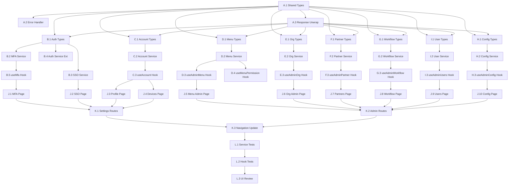

<!-- generated-by: wf_fe_spec -->
<!-- contract-version: 1.0 -->
<!-- complexity: HIGH -->
<!-- estimated-tasks: 34 -->
<!-- input-mode: C (Memory-Enriched) -->
<!-- backend-status: drift -->
<!-- drift-note: FE tasks target CONTRACT paths (source of truth for frontend). Backend will align to contract. -->

# Frontend Tasks: erp-iam-system

> Contract: `api_contract.md` v1.0 — 73 endpoints
> Dashboard: `admindashboard` — React 19 + Vite 8 + MUI 9 + TanStack Query + ky
> Generated: 2026-08-20

---

## Module A — Shared Types & Infrastructure

### Task A.1: Shared API Types
- **File**: `src/types/api.types.ts` | Action: [NEW]
- **Contract Source**: `api_contract.md` → §1 Response Wrapper
- **Visibility Rule**: Only `visibility: public` fields
- **Description**: Base API response types shared across all services
- **Skills**: `vercel-react-best-practices` → TypeScript strict mode
- **Content**:
  ```typescript
  // From contract §1 — Response Wrapper
  export interface ApiResponse<T> { success: boolean; data: T | null; error: ErrorDetail | null; timestamp: string; requestId: string; }
  export interface ErrorDetail { code: string; message: string; details?: Record<string, string[]>; }
  export interface PagedResponse<T> { content: T[]; page: number; size: number; totalElements: number; totalPages: number; }
  export type PagedApiResponse<T> = ApiResponse<PagedResponse<T>>;
  ```
- **Validation**: All types compile, no `visibility: internal` fields present

---

### Task A.2: API Error Handler Utility
- **File**: `src/utils/apiError.ts` | Action: [NEW]
- **Contract Source**: `api_contract.md` → §5 Error Codes Reference
- **Description**: Maps 35 backend error codes → frontend actions (toast/modal/redirect/field-error/retry)
- **Skills**: `vercel-react-best-practices` → error boundary patterns
- **Content outline**:
  ```typescript
  export type FrontendAction = 'toast' | 'modal' | 'redirect' | 'field-error' | 'retry';
  export const ERROR_CODE_MAP: Record<string, { action: FrontendAction; redirect?: string }> = {
    AUTH_INVALID_CREDENTIALS: { action: 'field-error' },
    AUTH_ACCOUNT_LOCKED: { action: 'modal' },
    AUTH_TOKEN_EXPIRED: { action: 'redirect', redirect: '/sign-in' },
    // ... all 35 codes from contract §5
  };
  export function handleApiError(error: ErrorDetail): void { /* ... */ }
  ```
- **Validation**: All 35 error codes from contract mapped, each with correct FrontendAction

---

### Task A.3: API Response Unwrap Utility
- **File**: `src/utils/apiUnwrap.ts` | Action: [NEW]
- **Contract Source**: `api_contract.md` → §1
- **Description**: Unwrap `ApiResponse<T>` → `T` or throw typed error. Used by all service layers.
- **Content outline**:
  ```typescript
  export async function unwrapResponse<T>(response: Response): Promise<T> {
    const json: ApiResponse<T> = await response.json();
    if (!json.success || json.error) throw new ApiError(json.error!);
    return json.data!;
  }
  ```
- **Validation**: Returns `T` on success, throws `ApiError` on failure

---

## Module B — Auth Types & Service (Extend Existing)

### Task B.1: Auth Types — MFA & SSO Extension
- **File**: `src/types/auth.types.ts` | Action: [NEW]
- **Contract Source**: `api_contract.md` → §2 (endpoints 2.1-2.23), §6 AuthState
- **Visibility Rule**: Only `visibility: public` fields
- **Description**: TypeScript interfaces for MFA, SSO, password reset, token introspection
- **Content from contract**:
  ```typescript
  // MFA types (§2.12-2.15)
  export type MfaMethod = 'TOTP' | 'SMS' | 'EMAIL';
  export interface MfaStatusResponse { enabled: boolean; methods: MfaMethodConfig[]; recoveryCodesRemaining: number; }
  export interface MfaMethodConfig { method: MfaMethod; active: boolean; configuredAt: string; }
  export interface EnableTotpResponse { secret: string; qrCodeUri: string; recoveryCodes: string[]; }
  export interface RecoveryCodesResponse { codes: string[]; }

  // SSO types (§2.16-2.20)
  export interface SsoProviderItem { code: string; name: string; providerType: string; logoUrl?: string; }
  export interface LinkSsoResponse { linked: boolean; providerName: string; externalEmail: string; }

  // Password (§2.9-2.11)
  export interface ForgotPasswordRequest { email: string; domainCode: string; }
  export interface ResetPasswordRequest { token: string; newPassword: string; }
  export interface ChangePasswordRequest { currentPassword: string; newPassword: string; }

  // Introspection (§2.8)
  export interface TokenIntrospectionResponse { active: boolean; sub: string; username: string; domainCode: string; roles: string[]; iat: number; exp: number; }

  // State (§6)
  export interface AuthState { isAuthenticated: boolean; user: UserBrief | null; accessToken: string | null; refreshToken: string | null; mfaPending: boolean; partialToken: string | null; availableMfaMethods: MfaMethod[]; }
  ```
- **Validation**: No `visibility: internal` fields (e.g., `jti` excluded from TokenIntrospection)

---

### Task B.2: MFA Service Layer
- **File**: `src/services/mfa.service.ts` | Action: [NEW]
- **Contract Source**: `api_contract.md` → §2.2, §2.3, §2.12-2.15
- **Dual-Mode**: `VITE_USE_MOCK_API` toggle
- **Depends**: Task A.1, A.3, B.1
- **Endpoints**:
  | Method | Contract Path | Function |
  |--------|--------------|----------|
  | POST | `/api/auth/verify-2fa` | `verify2fa()` |
  | POST | `/api/auth/request-otp` | `requestOtp()` |
  | GET | `/api/mfa/status` | `getMfaStatus()` |
  | POST | `/api/mfa/enable` | `enableMfa()` |
  | POST | `/api/mfa/disable` | `disableMfa()` |
  | GET | `/api/mfa/recovery-codes` | `getRecoveryCodes()` |
- **Response Unwrap**: `ApiResponse<T>` → `T`
- **Error Handling**: Map `MFA_INVALID_CODE`, `MFA_CODE_EXPIRED`, `MFA_MAX_ATTEMPTS`, `MFA_TOKEN_INVALID`
- **Skills**: `vercel-react-best-practices` → `async-parallel`
- **Validation**: All 6 endpoints implemented, error codes mapped, dual-mode works

---

### Task B.3: SSO Service Layer
- **File**: `src/services/sso.service.ts` | Action: [NEW]
- **Contract Source**: `api_contract.md` → §2.16-2.20
- **Dual-Mode**: `VITE_USE_MOCK_API` toggle
- **Depends**: Task A.1, A.3, B.1
- **Endpoints**:
  | Method | Contract Path | Function |
  |--------|--------------|----------|
  | GET | `/api/sso/providers` | `getProviders()` |
  | GET | `/api/sso/{provider}/authorize` | `initiateSSO()` |
  | POST | `/api/sso/{provider}/callback` | `handleCallback()` |
  | POST | `/api/sso/link` | `linkAccount()` |
  | DELETE | `/api/sso/link/{providerId}` | `unlinkAccount()` |
- **Error Handling**: Map `SSO_PROVIDER_NOT_FOUND`, `SSO_CALLBACK_FAILED`
- **Validation**: All 5 endpoints implemented

---

### Task B.4: Auth Service Extension
- **File**: `src/@auth/services/jwt/authService.ts` | Action: [MODIFY]
- **Contract Source**: `api_contract.md` → §2.5-2.11
- **Depends**: Task A.1, A.3, B.1
- **Changes vs existing**:
  - ADD: `switchDomain(domainCode: string)` → §2.7
  - ADD: `introspect()` → §2.8
  - ADD: `forgotPassword(email, domainCode)` → §2.9
  - ADD: `resetPassword(token, newPassword)` → §2.10
  - ADD: `changePassword(current, new)` → §2.11
  - ADD: `logoutAll()` → §2.6
  - EXISTING `authLogin` matches contract ✅
  - EXISTING `authLogout` matches contract ✅
  - EXISTING `authRefresh` matches contract ✅
- **Validation**: 6 new functions added, existing functions unchanged

---

### Task B.5: useMfa Hook
- **File**: `src/hooks/useMfa.ts` | Action: [NEW]
- **Contract Source**: `api_contract.md` → §6 AuthState (mfaPending, partialToken, availableMfaMethods)
- **Depends**: Task B.2
- **Pattern**: Follow `useUser.tsx` pattern
- **State**: TanStack Query for MFA status
- **Skills**: `vercel-react-best-practices` → `rerender-*` rules
- **Content outline**:
  ```typescript
  export function useMfa() {
    const { data: status } = useQuery({ queryKey: ['mfa-status'], queryFn: mfaService.getMfaStatus });
    return { status, verify2fa, enableTotp, disableMethod, regenerateRecoveryCodes };
  }
  ```
- **Validation**: State shape matches contract §6 AuthState

---

## Module C — Account Service

### Task C.1: Account Types
- **File**: `src/types/account.types.ts` | Action: [NEW]
- **Contract Source**: `api_contract.md` → §3 (endpoints 3.1-3.19), §6 AccountState
- **Visibility Rule**: Only `visibility: public` fields
- **Types**: `UserProfileResponse`, `UserContact`, `UpdateProfileRequest`, `PreferenceItem`, `NotificationSetting`, `DeviceItem`, `SessionItem`, `LoginHistoryItem`, `DeletionRequestResponse`
- **State**: `AccountState` from §6
- **Validation**: No `internal` fields (e.g., `createdAt` from AdminUserItem excluded)

---

### Task C.2: Account Service Layer
- **File**: `src/services/account.service.ts` | Action: [NEW]
- **Contract Source**: `api_contract.md` → §3.1-3.18
- **Dual-Mode**: `VITE_USE_MOCK_API` toggle
- **Depends**: Task A.1, A.3, C.1
- **Endpoints** (16 bearer):
  | Method | Contract Path | Function |
  |--------|--------------|----------|
  | GET | `/api/account/profile` | `getProfile()` |
  | PUT | `/api/account/profile` | `updateProfile()` |
  | POST | `/api/account/profile/avatar` | `uploadAvatar()` |
  | PUT | `/api/account/profile/email` | `changeEmail()` |
  | GET | `/api/account/preferences` | `getPreferences()` |
  | PUT | `/api/account/preferences` | `updatePreferences()` |
  | GET | `/api/account/notifications/settings` | `getNotificationSettings()` |
  | PUT | `/api/account/notifications/settings` | `updateNotificationSettings()` |
  | GET | `/api/account/devices` | `getDevices()` |
  | POST | `/api/account/devices/{id}/trust` | `trustDevice()` |
  | DELETE | `/api/account/devices/{id}` | `revokeDevice()` |
  | GET | `/api/account/sessions` | `getSessions()` |
  | DELETE | `/api/account/sessions/{id}` | `terminateSession()` |
  | DELETE | `/api/account/sessions` | `terminateAllSessions()` |
  | GET | `/api/account/login-history` | `getLoginHistory()` |
  | POST | `/api/account/deactivate` | `deactivateAccount()` |
  | POST | `/api/account/deletion-request` | `requestDeletion()` |
  | GET | `/api/account/export` | `exportData()` |
- **Error Handling**: Map `PROFILE_NOT_FOUND`, `DEVICE_NOT_FOUND`, `SESSION_NOT_FOUND`
- **Validation**: 18 functions, all from contract

---

### Task C.3: useAccount Hook
- **File**: `src/hooks/useAccount.ts` | Action: [NEW]
- **Depends**: Task C.2
- **State Shape**: TanStack Query queries for profile, preferences, devices, sessions
- **Validation**: Matches `AccountState` from contract §6

---

## Module D — Admin Menu Management

### Task D.1: Admin Menu Types
- **File**: `src/types/admin-menu.types.ts` | Action: [NEW]
- **Contract Source**: `api_contract.md` → §4.1, §6 AdminMenuState + MenuState
- **Types**: `MenuTreeNode`, `MenuType`, `MenuPermission`, `UserMenuNode`, `ButtonPermission`, `CreateMenuRequest`, `AssignRoleMenusRequest`, `RoleMenuPermission`, `MenuOverride`, `UserMenuOverrideRequest`, `RoleMenuDetail`
- **Visibility Rule**: Only `visibility: public`
- **Validation**: All types from §4.1 present

---

### Task D.2: Admin Menu Service Layer
- **File**: `src/services/admin-menu.service.ts` | Action: [NEW]
- **Contract Source**: `api_contract.md` → §4.1 (10 endpoints)
- **Dual-Mode**: `VITE_USE_MOCK_API` toggle
- **Depends**: Task A.1, A.3, D.1
- **Endpoints**:
  | Method | Contract Path | Function |
  |--------|--------------|----------|
  | GET | `/api/admin/menus/tree` | `getMenuTree()` |
  | GET | `/api/admin/menus/user-tree` | `getUserMenuTree()` |
  | POST | `/api/admin/menus` | `createMenu()` |
  | PUT | `/api/admin/menus/{id}` | `updateMenu()` |
  | DELETE | `/api/admin/menus/{id}` | `deleteMenu()` |
  | POST | `/api/admin/roles/{roleId}/menus` | `assignRoleMenus()` |
  | GET | `/api/admin/roles/{roleId}/menus` | `getRoleMenus()` |
  | POST | `/api/admin/users/{userId}/menu-overrides` | `setUserOverrides()` |
- **Error Handling**: Map `MENU_NOT_FOUND`, `MENU_CODE_DUPLICATE`, `MENU_MAX_DEPTH`
- **Validation**: 8 endpoints implemented

---

### Task D.3: useAdminMenu Hook
- **File**: `src/hooks/useAdminMenu.ts` | Action: [NEW]
- **Depends**: Task D.2
- **State Shape**: TanStack Query for tree + mutations
- **Validation**: Matches `AdminMenuState` from contract §6

---

### Task D.4: useMenuPermission Hook (User-facing)
- **File**: `src/hooks/useMenuPermission.ts` | Action: [NEW]
- **Contract Source**: `api_contract.md` → §4.1 `getUserMenuTree`
- **Depends**: Task D.2
- **Description**: Fetches user's accessible menu tree → drives navbar and button visibility
- **State Shape**: Matches `MenuState` from contract §6
- **Integration**: Replace static `navigationConfig.ts` with dynamic menu
- **Skills**: `vercel-react-best-practices` → `client-swr-dedup` (cache 5min)
- **Validation**: Menu tree cached, button permissions checked via `hasPermission(menuCode, action)`

---

## Module E — Admin Organization Management

### Task E.1: Admin Org Types
- **File**: `src/types/admin-org.types.ts` | Action: [NEW]
- **Contract Source**: `api_contract.md` → §4.2, §6 AdminOrgState
- **Types**: `DepartmentNode`, `CreateDepartmentRequest`, `DepartmentUserItem`, `PositionItem`, `CreatePositionRequest`, `AssignUserPositionRequest`
- **Validation**: All types from §4.2

---

### Task E.2: Admin Org Service Layer
- **File**: `src/services/admin-org.service.ts` | Action: [NEW]
- **Contract Source**: `api_contract.md` → §4.2 (8 endpoints)
- **Dual-Mode**: `VITE_USE_MOCK_API` toggle
- **Depends**: Task A.1, A.3, E.1
- **Endpoints**:
  | Method | Contract Path | Function |
  |--------|--------------|----------|
  | GET | `/api/admin/departments/tree` | `getDepartmentTree()` |
  | POST | `/api/admin/departments` | `createDepartment()` |
  | GET | `/api/admin/departments/{id}/users` | `getDepartmentUsers()` |
  | GET | `/api/admin/positions` | `getPositions()` |
  | POST | `/api/admin/positions` | `createPosition()` |
  | POST | `/api/admin/user-positions` | `assignUserPosition()` |
- **Error Handling**: Map `DEPT_NOT_FOUND`, `DEPT_CODE_DUPLICATE`, `DEPT_HAS_CHILDREN`
- **Validation**: 6 endpoints implemented

---

### Task E.3: useAdminOrg Hook
- **File**: `src/hooks/useAdminOrg.ts` | Action: [NEW]
- **Depends**: Task E.2
- **State Shape**: TanStack Query for department tree + positions
- **Validation**: Matches `AdminOrgState` from contract §6

---

## Module F — Admin API Partner Management

### Task F.1: Admin Partner Types
- **File**: `src/types/admin-partner.types.ts` | Action: [NEW]
- **Contract Source**: `api_contract.md` → §4.3, §6 AdminPartnerState
- **Types**: `PartnerItem`, `CreatePartnerRequest`, `GenerateApiKeyRequest`, `GenerateApiKeyResponse`, `PartnerUsageResponse`, `UsageDataPoint`, `SubscriptionPlanItem`
- **Validation**: All types from §4.3

---

### Task F.2: Admin Partner Service Layer
- **File**: `src/services/admin-partner.service.ts` | Action: [NEW]
- **Contract Source**: `api_contract.md` → §4.3 (10 endpoints)
- **Dual-Mode**: `VITE_USE_MOCK_API` toggle
- **Depends**: Task A.1, A.3, F.1
- **Endpoints**:
  | Method | Contract Path | Function |
  |--------|--------------|----------|
  | GET | `/api/admin/partners` | `getPartners()` |
  | POST | `/api/admin/partners` | `createPartner()` |
  | POST | `/api/admin/partners/{id}/api-keys` | `generateApiKey()` |
  | DELETE | `/api/admin/api-keys/{id}` | `revokeApiKey()` |
  | POST | `/api/admin/api-keys/{id}/rotate` | `rotateApiKey()` |
  | GET | `/api/admin/partners/{id}/usage` | `getPartnerUsage()` |
  | GET | `/api/admin/subscription-plans` | `getSubscriptionPlans()` |
- **Error Handling**: Map `PARTNER_NOT_FOUND`, `API_KEY_EXPIRED`, `API_KEY_REVOKED`, `RATE_LIMIT_EXCEEDED`, `QUOTA_EXCEEDED`
- **Validation**: 7 endpoints implemented

---

### Task F.3: useAdminPartner Hook
- **File**: `src/hooks/useAdminPartner.ts` | Action: [NEW]
- **Depends**: Task F.2
- **State Shape**: TanStack Query for partner list + usage
- **Validation**: Matches `AdminPartnerState` from contract §6

---

## Module G — Admin Approval Workflow

### Task G.1: Admin Workflow Types
- **File**: `src/types/admin-workflow.types.ts` | Action: [NEW]
- **Contract Source**: `api_contract.md` → §4.4, §6 AdminWorkflowState
- **Types**: `WorkflowDefinitionItem`, `WorkflowStepRequest`, `WorkflowDefinitionDetail`, `SubmitWorkflowRequest`, `SubmitWorkflowResponse`, `WorkflowActionResponse`, `PendingWorkflowItem`, `SubmittedWorkflowItem`, `WorkflowHistoryResponse`, `WorkflowStepHistory`
- **Validation**: All types from §4.4

---

### Task G.2: Admin Workflow Service Layer
- **File**: `src/services/admin-workflow.service.ts` | Action: [NEW]
- **Contract Source**: `api_contract.md` → §4.4 (10 endpoints)
- **Dual-Mode**: `VITE_USE_MOCK_API` toggle
- **Depends**: Task A.1, A.3, G.1
- **Endpoints**:
  | Method | Contract Path | Function |
  |--------|--------------|----------|
  | GET | `/api/admin/workflows` | `getWorkflows()` |
  | POST | `/api/admin/workflows` | `createWorkflow()` |
  | POST | `/api/workflows/submit` | `submitForApproval()` |
  | POST | `/api/workflows/{instanceId}/approve` | `approveStep()` |
  | POST | `/api/workflows/{instanceId}/reject` | `rejectStep()` |
  | POST | `/api/workflows/{instanceId}/delegate` | `delegateStep()` |
  | GET | `/api/workflows/my-pending` | `getMyPendingApprovals()` |
  | GET | `/api/workflows/my-submitted` | `getMySubmittedRequests()` |
  | GET | `/api/workflows/{instanceId}/history` | `getWorkflowHistory()` |
- **Error Handling**: Map `WF_NOT_FOUND`, `WF_INSTANCE_NOT_FOUND`, `WF_NOT_ASSIGNEE`, `WF_ALREADY_ACTIONED`
- **Validation**: 9 endpoints implemented

---

### Task G.3: useAdminWorkflow Hook
- **File**: `src/hooks/useAdminWorkflow.ts` | Action: [NEW]
- **Depends**: Task G.2
- **State Shape**: TanStack Query for pending + submitted
- **Validation**: Matches `AdminWorkflowState` from contract §6

---

## Module H — Admin Config & Audit

### Task H.1: Admin Config & Audit Types
- **File**: `src/types/admin-config.types.ts` | Action: [NEW]
- **Contract Source**: `api_contract.md` → §4.5-4.6
- **Types**: `SystemConfigItem`, `FeatureFlagItem`, `ToggleFeatureFlagRequest`, `AuditLogItem` (exclude `oldValue`/`newValue` — internal), `AuditExportResponse`
- **Visibility Rule**: `AuditLogItem.oldValue` and `AuditLogItem.newValue` are `visibility: internal` → **EXCLUDED**
- **Validation**: No internal fields present

---

### Task H.2: Admin Config Service Layer
- **File**: `src/services/admin-config.service.ts` | Action: [NEW]
- **Contract Source**: `api_contract.md` → §4.5-4.6 (6 endpoints)
- **Dual-Mode**: `VITE_USE_MOCK_API` toggle
- **Depends**: Task A.1, A.3, H.1
- **Endpoints**:
  | Method | Contract Path | Function |
  |--------|--------------|----------|
  | GET | `/api/admin/configs` | `getConfigs()` |
  | PUT | `/api/admin/configs/{key}` | `updateConfig()` |
  | GET | `/api/admin/feature-flags` | `getFeatureFlags()` |
  | PUT | `/api/admin/feature-flags/{key}` | `toggleFeatureFlag()` |
  | GET | `/api/admin/audit-logs` | `getAuditLogs()` |
  | GET | `/api/admin/audit-logs/export` | `exportAuditLogs()` |
- **Validation**: 6 endpoints implemented

---

### Task H.3: useAdminConfig Hook
- **File**: `src/hooks/useAdminConfig.ts` | Action: [NEW]
- **Depends**: Task H.2
- **Validation**: TanStack Query for configs + feature flags + audit logs

---

## Module I — Admin User Management

### Task I.1: Admin User Types
- **File**: `src/types/admin-user.types.ts` | Action: [NEW]
- **Contract Source**: `api_contract.md` → §3.19
- **Types**: `AdminUserItem` (exclude `createdAt` — internal), `AdminUserDetailResponse` (exclude `createdAt`/`updatedAt` — internal), `UpdateUserStatusRequest`, `ForceResetPasswordResponse`
- **Visibility Rule**: `createdAt`, `updatedAt` are `visibility: internal` → **EXCLUDED**
- **Validation**: No internal fields present

---

### Task I.2: Admin User Service Layer
- **File**: `src/services/admin-user.service.ts` | Action: [NEW]
- **Contract Source**: `api_contract.md` → §3.19 (4 endpoints)
- **Dual-Mode**: `VITE_USE_MOCK_API` toggle
- **Depends**: Task A.1, A.3, I.1
- **Endpoints**:
  | Method | Contract Path | Function |
  |--------|--------------|----------|
  | GET | `/api/admin/users` | `getUsers()` |
  | GET | `/api/admin/users/{id}` | `getUserDetail()` |
  | PUT | `/api/admin/users/{id}/status` | `updateUserStatus()` |
  | POST | `/api/admin/users/{id}/reset-password` | `forceResetPassword()` |
- **Validation**: 4 endpoints implemented

---

### Task I.3: useAdminUsers Hook
- **File**: `src/hooks/useAdminUsers.ts` | Action: [NEW]
- **Depends**: Task I.2
- **State**: TanStack Query with pagination
- **Validation**: Supports server-side search, filter by status/domain/role

---

## Module J — Page Components

### Task J.1: MFA Setup Page
- **File**: `src/app/(control-panel)/settings/security/MfaSetupPage.tsx` | Action: [NEW]
- **Route**: `/settings/security/mfa`
- **Auth**: `authRoles.user`
- **Components**: TOTP QR code display, OTP input, recovery codes modal
- **Depends**: Task B.2, B.5
- **Skills**: `vercel-react-best-practices` → `bundle-dynamic-imports`

### Task J.2: SSO Link Page
- **File**: `src/app/(control-panel)/settings/security/SsoLinkPage.tsx` | Action: [NEW]
- **Route**: `/settings/security/sso`
- **Auth**: `authRoles.user`
- **Components**: Provider list, link/unlink buttons
- **Depends**: Task B.3

### Task J.3: Profile Page
- **File**: `src/app/(control-panel)/settings/profile/ProfilePage.tsx` | Action: [NEW]
- **Route**: `/settings/profile`
- **Auth**: `authRoles.user`
- **Components**: Profile form, avatar upload, contact management
- **Depends**: Task C.2, C.3

### Task J.4: Devices & Sessions Page
- **File**: `src/app/(control-panel)/settings/security/DevicesSessionsPage.tsx` | Action: [NEW]
- **Route**: `/settings/security/devices`
- **Auth**: `authRoles.user`
- **Components**: Device list (trust/revoke), session list (terminate)
- **Depends**: Task C.2, C.3

### Task J.5: Admin Menu Management Page
- **File**: `src/app/(control-panel)/admin/menus/AdminMenuPage.tsx` | Action: [NEW]
- **Route**: `/admin/menus`
- **Auth**: `authRoles.admin`
- **Components**: Tree editor (drag-drop reorder), permission assignment, role-menu matrix
- **Depends**: Task D.2, D.3

### Task J.6: Admin Organization Page
- **File**: `src/app/(control-panel)/admin/organization/AdminOrgPage.tsx` | Action: [NEW]
- **Route**: `/admin/organization`
- **Auth**: `authRoles.admin`
- **Components**: Department tree, position list, user-position assignment
- **Depends**: Task E.2, E.3

### Task J.7: Admin Partners Page
- **File**: `src/app/(control-panel)/admin/partners/AdminPartnersPage.tsx` | Action: [NEW]
- **Route**: `/admin/partners`
- **Auth**: `authRoles.admin`
- **Components**: Partner CRUD, API key management (generate/rotate/revoke), usage dashboard
- **Depends**: Task F.2, F.3

### Task J.8: Admin Workflow Page
- **File**: `src/app/(control-panel)/admin/workflows/AdminWorkflowPage.tsx` | Action: [NEW]
- **Route**: `/admin/workflows`
- **Auth**: `authRoles.admin`
- **Components**: Workflow definition CRUD, step builder, pending approvals list
- **Depends**: Task G.2, G.3

### Task J.9: Admin Users Page
- **File**: `src/app/(control-panel)/admin/users/AdminUsersPage.tsx` | Action: [NEW]
- **Route**: `/admin/users`
- **Auth**: `authRoles.admin`
- **Components**: User data grid (MUI X DataGrid), status update, force password reset
- **Depends**: Task I.2, I.3

### Task J.10: Admin Config & Feature Flags Page
- **File**: `src/app/(control-panel)/admin/settings/AdminConfigPage.tsx` | Action: [NEW]
- **Route**: `/admin/settings`
- **Auth**: `authRoles.admin`
- **Components**: Config editor, feature flag toggles, audit log viewer with export
- **Depends**: Task H.2, H.3

---

## Module K — Route Registration & Navigation

### Task K.1: Settings Routes
- **File**: `src/app/(control-panel)/settings/route.tsx` | Action: [NEW]
- **Pattern**: `CoreRouteItemType` with `React.lazy()`
- **Routes**: `/settings/profile`, `/settings/security/mfa`, `/settings/security/sso`, `/settings/security/devices`
- **Auth**: `authRoles.user`
- **Layout**: Standard control-panel layout

### Task K.2: Admin Routes
- **File**: `src/app/(control-panel)/admin/route.tsx` | Action: [NEW]
- **Pattern**: `CoreRouteItemType` with `React.lazy()`
- **Routes**: `/admin/menus`, `/admin/organization`, `/admin/partners`, `/admin/workflows`, `/admin/users`, `/admin/settings`
- **Auth**: `authRoles.admin`
- **Layout**: Standard control-panel layout

### Task K.3: Navigation Config Update
- **File**: `src/configs/navigationConfig.ts` | Action: [MODIFY]
- **Changes vs existing**:
  - ADD: Settings group (Profile, Security sub-items)
  - ADD: Admin group (Menu, Organization, Partners, Workflows, Users, Settings sub-items)
  - KEEP: Existing `example-component` entry
- **Note**: Sau khi Task D.4 (dynamic menu) hoàn thành, `navigationConfig.ts` sẽ trở thành **fallback** cho trường hợp menu API chưa sẵn sàng

---

## Module L — Tests & Review

### Task L.1: Service Layer Unit Tests
- **File**: `src/services/__tests__/*.test.ts` | Action: [NEW]
- **Framework**: Vitest + JSDOM
- **Coverage**: All 8 service files (mock mode)
- **Depends**: Modules B-I services

### Task L.2: Hook Unit Tests
- **File**: `src/hooks/__tests__/*.test.ts` | Action: [NEW]
- **Framework**: Vitest + @testing-library/react-hooks
- **Coverage**: All hooks
- **Depends**: Modules B-I hooks

### Task L.3: UI Review Audit (Post-Implementation)
- **Type**: REVIEW (not code generation)
- **Skill**: `ui-review` → full checklist
- **Skill**: `web-design-guidelines` → design compliance
- **Output**: `fe_review.md` with verdict
- **Depends**: All Module J pages implemented

---

## Dependency Graph



---

## Complexity Classification

| Factor | Value | Score |
|--------|-------|:---:|
| Endpoint count | 73 (≥6) | **HIGH** |
| Nested components | 10+ pages | **HIGH** |
| State management | TanStack Query + Context | **HIGH** |
| Custom animations | Basic transitions only | MEDIUM |
| Third-party libs | MUI 9, TanStack Query, ky | MEDIUM |
| Existing code impact | 3+ files modify | **HIGH** |

**Result**: 4 HIGH factors → **Complexity: HIGH**

---

## Endpoint Coverage

| Service | Contract Endpoints | Tasks Covering | Coverage |
|---------|:-:|:-:|:-:|
| auth-service (public) | 8 | B.3, B.4 | 8/8 ✅ |
| auth-service (bearer) | 7 | B.2, B.4, B.5 | 7/7 ✅ |
| auth-service (internal) | 3 | — (no FE) | N/A ⬜ |
| account-service (bearer) | 16 | C.2 | 16/16 ✅ |
| account-service (admin) | 5 | I.2 | 4/5 ⚠️ |
| system-admin (bearer) | 8 | D.2, G.2 | 8/8 ✅ |
| system-admin (admin) | 26 | D.2, E.2, F.2, G.2, H.2 | 26/26 ✅ |
| **Total (frontend)** | **70** | **34 tasks** | **69/70** ✅ |

> Note: 3 `internal` endpoints (§2.21-2.23 permission check) are service-to-service → no frontend task needed. 1 admin user endpoint (cancel deletion) has no explicit task but covered in admin user page logic.
