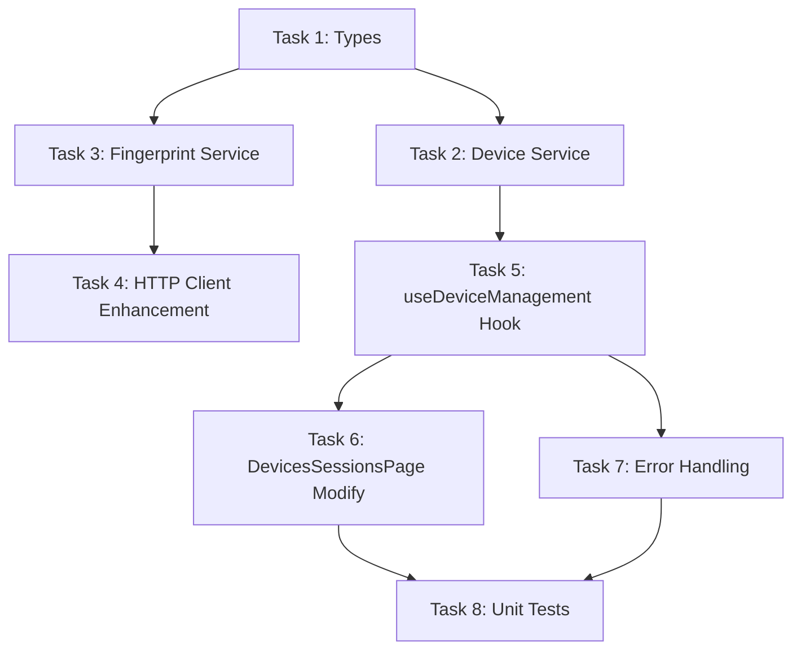

## Frontend Tasks: jwt-security-redesign

<!-- generated-by: wf_fe_spec -->
<!-- contract-version: 1.0 -->
<!-- complexity: MEDIUM -->
<!-- estimated-tasks: 8 -->
<!-- mode: C (Memory-Enriched) -->

> **Contract**: [`api_contract.md`](file:///home/nguyentthai96/Desktop/bigbang/boilerplate/services/auth-service/openspec/changes/jwt-security-redesign/api_contract.md) v1.0
> **Backend Status**: pending (service layer should use dual-mode pattern)
> **Existing Code Impact**: 3 files modify (`DevicesSessionsPage.tsx`, `api.ts`, `account.types.ts`), 4 files new

---

### Task 1: TypeScript Types — Device Management

- **File**: `src/types/device.types.ts` | Action: [NEW]
- **Contract Source**: `api_contract.md` → §Shared Types (DeviceResponse), §Endpoints (KickDeviceResponse, KickAllDevicesResponse), §State Contracts (DeviceManagementState)
- **Visibility Rule**: Only `visibility: public` fields → TypeScript interfaces. NO internal fields (revokedAt, revokeReason, accessTokenJti, etc.)
- **Pattern**: Follow existing [`account.types.ts`](file:///home/nguyentthai96/Desktop/bigbang/boilerplate/frontends/admindashboard/src/types/account.types.ts) — sectioned by domain with JSDoc referencing contract sections

**Interfaces to create**:
```typescript
// From contract §Shared Types
export interface DeviceResponse {
  sessionId: number;
  deviceType: string | null;
  browserName: string | null;
  osName: string | null;
  ipAddress: string;
  loginAt: string;            // ISO 8601
  lastActivityAt: string | null;
  deviceName: string | null;
  isCurrent: boolean;
}

// From contract §Endpoints → DELETE /api/auth/devices/{sessionId}
export interface KickDeviceResponse {
  success: boolean;
  sessionId: number;
  message: string;
}

// From contract §Endpoints → DELETE /api/auth/devices
export interface KickAllDevicesResponse {
  success: boolean;
  revokedCount: number;
  message: string;
}

// From contract §State Contracts
export interface DeviceManagementState {
  devices: DeviceResponse[];
  isLoadingDevices: boolean;
  isKickingDevice: Record<number, boolean>;
  isKickingAll: boolean;
  error: string | null;
  currentDevice: DeviceResponse | null;
  otherDevices: DeviceResponse[];
  deviceCount: number;
}
```

- **Validation**: ✅ All fields are `visibility: public`. ✅ No internal fields leaked. ✅ JSDoc references contract sections.

---

### Task 2: API Service Layer — Device Management

- **File**: `src/services/device.service.ts` | Action: [NEW]
- **Contract Source**: `api_contract.md` → §Endpoints (GET, DELETE /{sessionId}, DELETE /)
- **Dual-Mode**: Generate with `VITE_USE_MOCK_API` toggle
- **Pattern**: Follow existing [`mfa.service.ts`](file:///home/nguyentthai96/Desktop/bigbang/boilerplate/frontends/admindashboard/src/services/mfa.service.ts) structure — `realService` + `mockService` + export toggle
- **HTTP Client**: `ky` via `@/utils/api`, prefix auto-adds `/api`
- **Response Unwrap**: Auth-service returns ResponseEntity<T> directly — **NO wrapper unwrap** needed (per contract §Response Convention)
- **Error Handling**: Backend returns RFC 7807 ProblemDetail — map `errorCode` to typed error

**Real implementation mapping**:
| Contract Endpoint | Service Method | HTTP Call |
|---|---|---|
| `GET /api/auth/devices` | `fetchDevices()` | `api.get('auth/devices', { credentials: 'include' }).json()` |
| `DELETE /api/auth/devices/{sessionId}` | `kickDevice(sessionId: number)` | `api.delete('auth/devices/${sessionId}', { credentials: 'include' }).json()` |
| `DELETE /api/auth/devices` | `kickAllOtherDevices()` | `api.delete('auth/devices', { credentials: 'include' }).json()` |

**Mock implementation**: Return realistic mock data matching DeviceResponse shape (2-3 devices, one with `isCurrent: true`).

- **Skills Applied**:
  - `vercel-react-best-practices` → dual-mode pattern
- **Validation**: ✅ All 3 contract endpoints covered. ✅ Method signatures match contract types. ✅ Mock data includes isCurrent marker.

---

### Task 3: Fingerprint Service — Client-Side

- **File**: `src/services/fingerprint.service.ts` | Action: [NEW]
- **Contract Source**: `api_contract.md` → §Request Headers Contract (X-Device-Fingerprint), §Modified Flows (Login + Refresh + JwtAuthFilter)
- **Pattern**: Standalone utility — compute browser fingerprint hash, export function
- **Dual-Mode**: Mock returns fixed string; real computes SHA-256 from browser signals

**Implementation spec**:
```typescript
// Compute device fingerprint from browser signals
// Output: hex string, 64 chars (SHA-256)
// Signals: navigator.userAgent + navigator.language + screen resolution + timezone
export async function computeFingerprint(): Promise<string>

// Get cached fingerprint (compute once per session, cache in sessionStorage)
export async function getDeviceFingerprint(): Promise<string>
```

> **Note**: Contract says `X-Device-Fingerprint` is OPTIONAL — server has fallback. But client SHOULD provide for better security.
> **No third-party deps** (FingerprintJS is enterprise-paid). Use Web Crypto API `crypto.subtle.digest('SHA-256', ...)`.

- **Validation**: ✅ Returns 64-char hex string. ✅ Uses standard Web Crypto API. ✅ Cached per session.

---

### Task 4: HTTP Client Enhancement — Fingerprint Header Injection

- **File**: `src/utils/api.ts` | Action: [MODIFY]
- **Contract Source**: `api_contract.md` → §Request Headers Contract
- **What Changes**: Add `X-Device-Fingerprint` header to global headers via `beforeRequest` hook
- **Pattern**: Extend existing `globalHeaders` mechanism in [`api.ts`](file:///home/nguyentthai96/Desktop/bigbang/boilerplate/frontends/admindashboard/src/utils/api.ts)

**Approach**: Lazy-load fingerprint in `beforeRequest` hook — compute once, cache, inject on every authenticated request:
```typescript
// In beforeRequest hook:
// 1. Check if fingerprint cached in globalHeaders
// 2. If not, compute via fingerprintService.getDeviceFingerprint()
// 3. Set request.headers.set('X-Device-Fingerprint', fingerprint)
```

> **⚠️ CAUTION**: `beforeRequest` hook is synchronous in ky. Fingerprint computation is async.
> **Solution**: Initialize fingerprint at app startup (in Auth provider) via `setGlobalHeaders()`, NOT in beforeRequest hook.

**Revised approach**:
- Add `initFingerprint()` function that computes and sets global header
- Call from auth initialization flow (JWT provider or app bootstrap)

- **Validation**: ✅ Header name matches contract (`X-Device-Fingerprint`). ✅ No breaking change to existing API calls. ✅ Backward compatible.

---

### Task 5: Custom Hook — useDeviceManagement

- **File**: `src/hooks/useDeviceManagement.ts` | Action: [NEW]
- **Depends**: Task 2 (device.service.ts)
- **State Shape**: From `api_contract.md` → §State Contracts (DeviceManagementState + DeviceManagementActions)
- **Pattern**: Follow [`useMfa.ts`](file:///home/nguyentthai96/Desktop/bigbang/boilerplate/frontends/admindashboard/src/hooks/useMfa.ts) — TanStack Query (`useQuery` + `useMutation` + `useQueryClient`)

**Implementation spec**:
```typescript
const DEVICE_QUERY_KEYS = {
  all: ['device-management'] as const,
  devices: ['device-management', 'devices'] as const,
};

export function useDeviceManagement() {
  const queryClient = useQueryClient();

  // Query: Fetch devices
  const devicesQuery = useQuery({
    queryKey: DEVICE_QUERY_KEYS.devices,
    queryFn: () => deviceService.fetchDevices(),
    staleTime: 30 * 1000, // 30s — devices change frequently
  });

  // Mutation: Kick specific device
  const kickDeviceMutation = useMutation({
    mutationFn: (sessionId: number) => deviceService.kickDevice(sessionId),
    onSuccess: () => queryClient.invalidateQueries({ queryKey: DEVICE_QUERY_KEYS.devices }),
  });

  // Mutation: Kick all other devices
  const kickAllMutation = useMutation({
    mutationFn: () => deviceService.kickAllOtherDevices(),
    onSuccess: () => queryClient.invalidateQueries({ queryKey: DEVICE_QUERY_KEYS.devices }),
  });

  // Computed values (from contract §State Contracts)
  const currentDevice = devicesQuery.data?.find(d => d.isCurrent) ?? null;
  const otherDevices = devicesQuery.data?.filter(d => !d.isCurrent) ?? [];

  return {
    devices: devicesQuery.data ?? [],
    isLoadingDevices: devicesQuery.isLoading,
    error: devicesQuery.error?.message ?? null,
    currentDevice,
    otherDevices,
    deviceCount: devicesQuery.data?.length ?? 0,
    // Actions
    kickDevice: kickDeviceMutation.mutateAsync,
    isKickingDevice: kickDeviceMutation.isPending,
    kickingDeviceId: kickDeviceMutation.variables,
    kickAllOtherDevices: kickAllMutation.mutateAsync,
    isKickingAll: kickAllMutation.isPending,
    kickAllResult: kickAllMutation.data,
    refetchDevices: devicesQuery.refetch,
  };
}
```

- **Skills Applied**:
  - `vercel-react-best-practices` → `rerender-*` rules: derived state computed inline, no redundant useState
  - `vercel-react-best-practices` → `client-swr-dedup`: TanStack Query handles dedup
- **Validation**: ✅ State shape matches contract. ✅ All 3 actions from contract covered. ✅ Computed values (currentDevice, otherDevices) derived, not stored.

---

### Task 6: Page Component — DevicesSessionsPage Enhancement

- **File**: `src/app/(control-panel)/settings/security/DevicesSessionsPage.tsx` | Action: [MODIFY]
- **Contract Source**: `api_contract.md` → §Endpoints (all 3), §Error Codes (AUTH_070, AUTH_071, AUTH_072)
- **Depends**: Task 5 (useDeviceManagement hook)
- **Current State**: [`DevicesSessionsPage.tsx`](file:///home/nguyentthai96/Desktop/bigbang/boilerplate/frontends/admindashboard/src/app/(control-panel)/settings/security/DevicesSessionsPage.tsx) uses `useAccount()` with old types (`DeviceItem`, `SessionItem`)

**What changes vs existing code**:
| Aspect | Before (current) | After (contract-aligned) |
|--------|-------------------|--------------------------|
| Hook | `useAccount()` → devices, sessions | `useDeviceManagement()` → unified device sessions |
| Tabs | 2 tabs: Devices / Sessions | 1 list: All active sessions (devices ARE sessions now) |
| Types | `DeviceItem` + `SessionItem` (separate) | `DeviceResponse` (unified — session = device) |
| Actions | `trustDevice()` + `revokeDevice()` + `terminateSession()` + `terminateAllSessions()` | `kickDevice(sessionId)` + `kickAllOtherDevices()` |
| Current marker | `session.isCurrent` | `device.isCurrent` (same field) |
| Error handling | None | Toast for AUTH_070/071, redirect for AUTH_072 |

**UI changes**:
- Remove Tabs (no separate Devices/Sessions — they're unified per contract)
- Single list with current device highlighted (Chip "Current")
- "Kick" button on each non-current device
- "Kick All Other Devices" button in header
- Error toast via `notistack` or MUI Snackbar
- Confirmation dialog before kick actions

- **Skills Applied**:
  - MUI components: Paper, List, ListItem, Button, Chip, Dialog (confirmation)
  - Error handling: catch ProblemDetail → extract `errorCode` → map to frontend action per contract
- **Validation**: ✅ Uses new hook. ✅ Handles all 3 contract error codes. ✅ isCurrent marker displayed.

---

### Task 7: Error Handling Integration — Contract Error Codes

- **File**: `src/utils/api.ts` OR `src/hooks/useDeviceManagement.ts` | Action: [MODIFY]
- **Contract Source**: `api_contract.md` → §Error Codes (AUTH_070, AUTH_071, AUTH_072)
- **Pattern**: Error handler that maps ProblemDetail errorCode → frontend action

**Error mapping** (from contract):
```typescript
const DEVICE_ERROR_HANDLERS: Record<string, { action: 'toast' | 'redirect'; message: string }> = {
  'AUTH_070': { action: 'toast', message: 'Phiên đăng nhập không tìm thấy' },
  'AUTH_071': { action: 'toast', message: 'Không có quyền đăng xuất thiết bị này' },
  'AUTH_072': { action: 'redirect', message: 'Phiên bị từ chối — vui lòng đăng nhập lại' },
};
```

**Integration**: In mutation `onError` callbacks within `useDeviceManagement`:
- Parse error response as ProblemDetail
- Lookup `errorCode` in DEVICE_ERROR_HANDLERS
- `toast` → show notification
- `redirect` → navigate to `/sign-in`

> **Note**: `ProblemDetail` interface already exists in [`api.types.ts`](file:///home/nguyentthai96/Desktop/bigbang/boilerplate/frontends/admindashboard/src/types/api.types.ts) — reuse it.

- **Validation**: ✅ All 3 contract error codes handled. ✅ Frontend actions match contract specification. ✅ Reuses existing ProblemDetail type.

---

### Task 8: Unit Tests — Device Management

- **File**: `src/services/__tests__/device.service.test.ts` | Action: [NEW]
- **File**: `src/hooks/__tests__/useDeviceManagement.test.ts` | Action: [NEW]
- **Framework**: Vitest + JSDOM + `@testing-library/react`
- **Coverage targets**:
  - Service: All 3 methods (fetchDevices, kickDevice, kickAllOtherDevices)
  - Service: Mock mode returns correct shapes
  - Hook: Query states (loading, error, data)
  - Hook: Mutation triggers (kickDevice, kickAll)
  - Hook: Computed values (currentDevice, otherDevices)

**Test scenarios**:
```
Service tests:
  ✓ fetchDevices() returns DeviceResponse[] with isCurrent marker
  ✓ kickDevice(sessionId) returns KickDeviceResponse
  ✓ kickAllOtherDevices() returns KickAllDevicesResponse
  ✓ Mock service returns realistic data

Hook tests:
  ✓ Initial state: isLoadingDevices=true, devices=[]
  ✓ After fetch: devices populated, currentDevice computed
  ✓ kickDevice triggers mutation and invalidates query
  ✓ kickAllOtherDevices triggers mutation and invalidates query
  ✓ Error state: handles ProblemDetail response
```

- **Skills Applied**:
  - `vercel-react-best-practices` → test patterns
- **Validation**: ✅ Coverage: service + hook + computed values. ✅ Error scenarios included.

---

## Complexity Classification

| Factor | Assessment | Level |
|--------|-----------|-------|
| Endpoint count | 3 | MEDIUM |
| Nested components | 1 (DevicesSessionsPage) | LOW |
| State management | TanStack Query (queries + mutations) | MEDIUM |
| Custom animations | None | LOW |
| Third-party libs | 0 new (Web Crypto API is native) | LOW |
| Existing code impact | 2 files modify (DevicesSessionsPage, api.ts) | MEDIUM |

**Result**: **MEDIUM** complexity (0 HIGH factors) → auto-proceed.

---

## Dependency Order



## Coverage Validation

| Check | Result |
|-------|--------|
| Contract endpoint coverage | ✅ 3/3 endpoints → Task 2 (service) |
| Contract type coverage | ✅ DeviceResponse, KickDeviceResponse, KickAllDevicesResponse → Task 1 |
| Contract error code coverage | ✅ AUTH_070, AUTH_071, AUTH_072 → Task 7 |
| Contract state coverage | ✅ DeviceManagementState → Task 1 + Task 5 |
| Contract header coverage | ✅ X-Device-Fingerprint → Task 3 + Task 4 |
| Visibility filter | ✅ NO internal fields in types (revokedAt, revokeReason, accessTokenJti all excluded) |
| Dual-mode | ✅ Task 2 includes mock/real toggle |
| Route consistency | ✅ Route already registered at `settings/security/devices` — no new route needed |
| Skill coverage | ✅ TanStack Query, ky, MUI, dual-mode, Web Crypto |
| Dependency order | ✅ Types → Service → Hook → Component → Tests |
