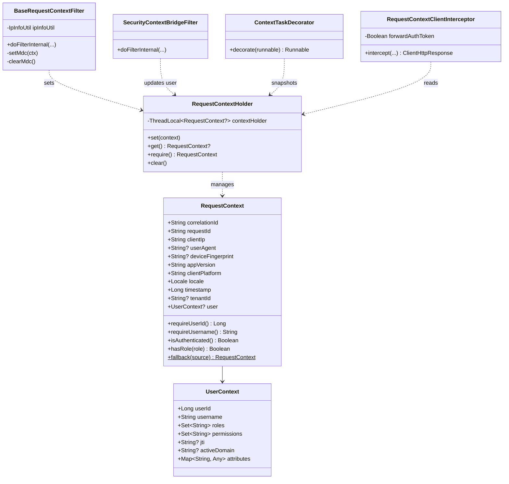

# Design: shared-request-context

## Context

Hiện tại, các microservices trong hệ sinh thái (`auth-service`, `account-service`, `system-admin-service`, `notification-service`) đều cần quản lý thông tin phiên làm việc, danh tính người dùng và dấu vết giao dịch (Correlation ID). Tuy nhiên, mỗi service đang tự xử lý một cách chắp vá (xem chi tiết tại `proposal.md` và `pre_openspec.md`).
Ràng buộc kỹ thuật chính:
- Spring Boot 3.4.x, Java 21 Virtual Threads (Project Loom).
- Cần tuân thủ Clean Architecture: Domain Context không phụ thuộc framework Web Servlet hay Spring Security.
- Tận dụng tối đa các thành phần đã có trong `components/base-core/common-log` (`IpInfoUtil`, `VirtualThreadMdcFilter`).

## Goals / Non-Goals

**Goals:**
- Tách biệt hoàn toàn giữa **Web Transport Context** (thuần metadata giao vận) và **Security Identity Context** (thông tin người dùng xác thực).
- Đảm bảo an toàn 100% trên Java 21 Virtual Threads, cấm sử dụng `InheritableThreadLocal` để tránh ô nhiễm carrier thread.
- Hỗ trợ đầy đủ cả Inbound Filter (đọc headers, nạp MDC) lẫn Outbound Propagation (truyền `X-Correlation-ID` qua HTTP client và Kafka producer).
- Cung cấp cơ chế non-web fallback an toàn để tránh lỗi `ScopeNotActiveException` khi gọi từ Kafka Consumers hoặc Scheduled Jobs.
- Cung cấp Spring Boot Starter auto-configuration để các microservices chỉ cần import dependency là tự động kích hoạt.

**Non-Goals:**
- Thay thế API Gateway: Gateway vẫn giữ vai trò cổng biên bảo vệ perimeter, xác thực ban đầu và sanitize `X-Forwarded-For`.
- Thay đổi định dạng mã hóa hoặc logic sinh/hủy token JWT của `auth-service`.

## Decisions

### 1. Kiến trúc phân tầng Starter trong `base-core`
- **Quyết định**: Phân bổ các thành phần theo đúng chức năng của các starter hiện có:
  - `base-core` / `base-model`: Chứa `RequestContext`, `UserContext`, `RequestContextHolder`.
  - `starters/base-web-starter`: Chứa `BaseRequestContextFilter`, `ContextTaskDecorator`, `RequestContextAutoConfiguration`.
  - `starters/base-security-starter`: Chứa `SecurityContextBridgeFilter`.
  - `starters/base-http-client-starter`: Chứa `RequestContextClientInterceptor`.
- **Lý do**: Tuân thủ nguyên tắc Single Responsibility. Các service không dùng Spring Security (như public telemetry service) không bị ép phải kéo theo các class bảo mật.
- **Giải pháp thay thế đã bác bỏ**:
  - *Tạo `starters/base-context-starter` riêng*: Làm tăng số lượng module con trong Gradle, bắt downstream service phải khai báo thêm dependency mới.
  - *Bê nguyên si vào `base-web-starter`*: Khiến `base-web-starter` bị phụ thuộc cứng vào Spring Security (`SecurityContextHolder`).

### 2. Quản lý luồng và Concurrency: `ThreadLocal` chuẩn + `TaskDecorator`
- **Quyết định**: Sử dụng `ThreadLocal<RequestContext?>` thông thường cho `RequestContextHolder`. Sử dụng `ContextTaskDecorator` chụp snapshot context và MDC khi ủy thác tác vụ cho ThreadPool/VirtualThreads.
- **Lý do**:
  - `InheritableThreadLocal` bị nghiêm cấm trên Virtual Threads vì JVM tái sử dụng carrier threads liên tục, gây rò rỉ dữ liệu giữa các request khác nhau.
  - `@RequestScope` bean của Spring chỉ hoạt động trong Servlet Web Request, sẽ gây crash khi gọi từ Kafka Consumers (`@KafkaListener`) hoặc Scheduled Jobs (`@Scheduled`).
- **Giải pháp thay thế đã bác bỏ**:
  - *Dùng `@RequestScope` bean*: Không tương thích với Kafka listeners và background threads.
  - *Dùng Alibaba TransmittableThreadLocal (TTL)*: Không được tối ưu cho Virtual Threads của JDK 21.

### 3. Outbound Propagation & Cờ cấu hình Token Relay (OQ-01 Resolution)
- **Quyết định**: Mặc định HTTP Client Interceptor chỉ tự động chuyển tiếp `X-Correlation-ID` (và `X-Tenant-Id` nếu có). Cung cấp cấu hình `app.http-client.forward-auth-token: false` (mặc định tắt), cho phép bật chuyển tiếp `Authorization: Bearer <token>` khi một service hạ nguồn cụ thể yêu cầu thẩm quyền của user gốc.
- **Lý do**: Tuân thủ nguyên tắc Zero-Trust nội bộ và Least Privilege, tránh gửi token người dùng bừa bãi giữa các service nội bộ nếu không cần thiết.

### 4. Chuẩn hóa Khóa MDC và Thứ tự Filter Chain
- **Quyết định**:
  - Thống nhất 5 khóa MDC tiêu chuẩn: `correlationId`, `clientIp`, `appVersion`, `clientPlatform`, `userId`.
  - Thứ tự bộ lọc:
    1. `VirtualThreadMdcFilter` (`Ordered.HIGHEST_PRECEDENCE`): Dọn sạch MDC còn sót lại trên thread.
    2. `BaseRequestContextFilter` (`Ordered.HIGHEST_PRECEDENCE + 10`): Khởi tạo RequestContext, đọc IP qua `IpInfoUtil`, nạp 4 khóa MDC ban đầu.
    3. `Spring Security Filter Chain` (`Ordered.LOWEST_PRECEDENCE - 100` đến `- 50`): Xác thực token JWT.
    4. `SecurityContextBridgeFilter` (`Ordered.LOWEST_PRECEDENCE - 20`): Ánh xạ Authentication sang `UserContext`, nạp thêm `userId` vào MDC.

## Component & Class Design

### Class Diagram

## Risks / Trade-offs

| Rủi ro (Risk) | Khả năng | Tác động | Giải pháp giảm thiểu (Mitigation) |
|:---|:---:|:---:|:---|
| **Rò rỉ Carrier Thread trên Virtual Threads** | Thấp | Cao | Sử dụng `VirtualThreadMdcFilter` ở `HIGHEST_PRECEDENCE` dọn rác trước khi request bắt đầu, và khối `finally` dọn rác bắt buộc ở mọi filter. |
| **Token Relay bị lạm dụng chuyển tiếp token ra ngoài** | Thấp | Cao | Mặc định tắt `forward-auth-token: false`. Chỉ bật khi có cấu hình tường minh cho từng domain client nội bộ. |
| **Bất tương thích Controller cũ trong `auth-service`** | Thấp | Trung bình | Giữ `com.ntt.authservice.shared.web.RequestContext` là lớp adapter/kế thừa từ `com.ntt.basecore.context.RequestContext` để giữ backward-compatibility. |

## Migration Plan

1. **Giai đoạn 1 (`base-core`)**:
   - Triển khai core models và `RequestContextHolder` trong `base-core` / `base-model`.
   - Triển khai `BaseRequestContextFilter` và `ContextTaskDecorator` trong `starters/base-web-starter`.
   - Triển khai `SecurityContextBridgeFilter` trong `starters/base-security-starter`.
   - Triển khai `RequestContextClientInterceptor` trong `starters/base-http-client-starter`.
2. **Giai đoạn 2 (Downstream Microservices)**:
   - `auth-service`: Refactor `RequestContextFilter` cục bộ sang sử dụng starter từ `base-core`.
   - `system-admin-service`: Refactor `AuditAspect.kt` sử dụng `RequestContextHolder.require().clientIp` và `requireUserId()`.
   - `account-service` & `notification-service`: Thừa hưởng correlation ID và structured MDC logging.

## Open Questions

- Không có câu hỏi mở (Toàn bộ quyết định thiết kế đã được giải quyết và phê duyệt trong brainstorm).
