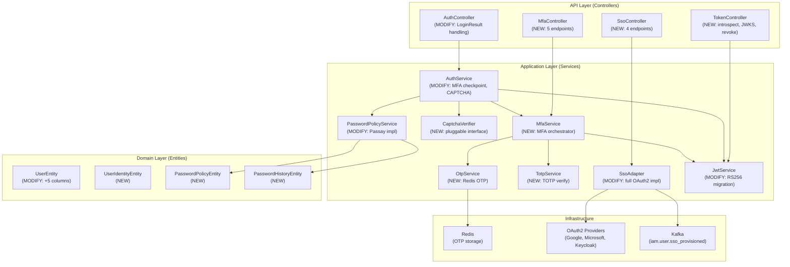

# Design: Auth Core Features

> **Change**: auth-core-features | **Type**: EXTEND | **Flow**: Non-Financial

---

## 1. Component Architecture



---

## 2. Component Specifications

### 2.1 LoginResult (Sealed Class) — NEW

```
Package: com.ntt.authservice.auth.application
File: LoginResult.kt

sealed class LoginResult
  ├── data class Success(response: AuthResponse)
  └── data class MfaRequired(mfaToken: String, method: String, expiresIn: Long)
```

**Purpose**: Type-safe return from `AuthService.login()` to distinguish MFA-pending vs full authentication.

### 2.2 MfaService — NEW

```
Package: com.ntt.authservice.auth.application
File: MfaService.kt
Dependencies: OtpService, TotpService, JwtService, UserRepository, SecurityProperties

Methods:
  ├── initiateMfa(userId: Long, method: String): MfaInitResult
  │     → Generate OTP or prepare TOTP challenge
  │     → Return mfaToken (JWT, TTL=5min, type=mfa)
  │
  ├── verifyMfa(mfaToken: String, code: String): AuthResponse
  │     → Parse mfaToken → extract userId, method
  │     → Delegate to OtpService.verifyOtp() or TotpService.verifyTotp()
  │     → On success: generateAuthResponse() via AuthService
  │     → On fail: increment attempts, throw MfaCodeInvalidException
  │
  ├── setupTotp(userId: Long): TotpSetupResponse
  │     → Generate secret → store pending in Redis (TTL=10min)
  │     → Return { secret, qrCodeUri, issuer }
  │
  ├── confirmTotp(userId: Long, code: String): Boolean
  │     → Load pending secret from Redis → verify code
  │     → On success: AES-256 encrypt → save to UserEntity.totpSecretEncrypted
  │
  ├── resendOtp(mfaToken: String): MfaInitResult
  │     → Parse mfaToken → regenerate OTP → store Redis
  │
  └── updateSettings(userId: Long, enabled: Boolean, method: String?): MfaSettingsResponse
        → Validate TOTP setup if switching to TOTP
        → Update UserEntity.mfaEnabled, mfaMethod
```

### 2.3 OtpService — NEW

```
Package: com.ntt.authservice.auth.application
File: OtpService.kt
Dependencies: StringRedisTemplate, SecurityProperties

Methods:
  ├── generateOtp(userId: Long, channel: String): String
  │     → code = 6-digit SecureRandom
  │     → Redis SET "otp:{userId}:{channel}" = code, TTL=300s
  │     → Redis SET "otp:{userId}:{channel}:attempts" = 0, TTL=300s
  │     → Return code (for SMS/Email delivery)
  │
  ├── verifyOtp(userId: Long, channel: String, code: String): Boolean
  │     → Redis GET "otp:{userId}:{channel}"
  │     → Compare code (constant-time comparison)
  │     → If match: Redis DEL both keys → return true
  │     → If no match: Redis INCR attempts
  │     →   If attempts >= maxAttempts: DEL keys → throw MfaMaxAttemptsException
  │     →   Else: throw MfaCodeInvalidException
  │
  └── deleteOtp(userId: Long, channel: String): Unit
        → Redis DEL "otp:{userId}:{channel}" + ":attempts"

Redis Key Schema:
  otp:{userId}:{channel}           → "482931"    (TTL 300s)
  otp:{userId}:{channel}:attempts  → "2"          (TTL 300s)
  mfa:totp:setup:{userId}          → "JBSWY3DPEHPK3PXP" (TTL 600s)
```

### 2.4 TotpService — NEW

```
Package: com.ntt.authservice.auth.application
File: TotpService.kt
Dependencies: dev.samstevens.totp (DefaultSecretGenerator, DefaultCodeGenerator, DefaultCodeVerifier)

Methods:
  ├── generateSecret(): String
  │     → new DefaultSecretGenerator(32).generate()
  │
  ├── generateQrUri(secret: String, username: String, issuer: String): String
  │     → new QrData.Builder().secret(secret).issuer(issuer).label(username).build()
  │     → Return otpauth:// URI
  │
  ├── verifyCode(secret: String, code: String): Boolean
  │     → DefaultCodeVerifier(DefaultCodeGenerator())
  │     → verifier.isValidCode(secret, code) with discrepancy=1
  │
  ├── encryptSecret(secret: String): String
  │     → AES-256-GCM encrypt with key from env TOTP_ENCRYPTION_KEY
  │     → Return Base64(iv + ciphertext + tag)
  │
  └── decryptSecret(encrypted: String): String
        → Decode Base64 → extract iv, ciphertext, tag
        → AES-256-GCM decrypt → return plaintext secret
```

### 2.5 CaptchaVerifier (Interface + Adapters) — NEW

```
Package: com.ntt.authservice.auth.application
File: CaptchaVerifier.kt

Interface:
  fun verify(token: String): Boolean

Implementations (selected by app.security.captcha.provider):
  ├── TurnstileCaptchaVerifier   → Cloudflare Turnstile API
  ├── HCaptchaVerifier           → hCaptcha API
  ├── RecaptchaVerifier           → Google reCAPTCHA v2/v3
  └── NoopCaptchaVerifier         → Always returns true (dev/test)

Factory:
  @Bean
  fun captchaVerifier(props: SecurityProperties, restTemplate: RestTemplate): CaptchaVerifier =
      when (props.captcha.provider) {
          "turnstile" -> TurnstileCaptchaVerifier(props.captcha, restTemplate)
          "hcaptcha"  -> HCaptchaVerifier(props.captcha, restTemplate)
          "recaptcha" -> RecaptchaVerifier(props.captcha, restTemplate)
          else        -> NoopCaptchaVerifier()
      }
```

### 2.6 SsoAdapter — MODIFY (full rewrite)

```
Package: com.ntt.authservice.auth.application
File: SsoAdapter.kt (existing → full rewrite)
Dependencies: RestTemplate (OAuth2), UserRepository, UserIdentityRepository, DomainRepository,
              KafkaTemplate, JwtService, SecurityProperties

Methods:
  ├── handleCallback(code: String, provider: String, redirectUri: String): AuthResponse
  │     → Exchange code for tokens (POST IdP /token endpoint)
  │     → Parse id_token → extract sub, email, name
  │     → Lookup UserIdentityEntity by (provider, sub)
  │     → If found: generate internal JWT
  │     → If not found: check domain autoProvision
  │     →   If true: create user + identity → Kafka event → generate JWT
  │     →   If false: throw SsoUserNotProvisionedException
  │
  ├── getProviders(domainCode: String?): List<SsoProviderInfo>
  │     → Read from Spring OAuth2 client registrations
  │     → Filter by domain SSO config (if domainCode specified)
  │
  ├── linkIdentity(userId: Long, code: String, provider: String): UserIdentityEntity
  │     → Exchange code → parse id_token → create UserIdentityEntity
  │     → Validate: sub not already linked to another user
  │
  └── unlinkIdentity(userId: Long, provider: String): Unit
        → Delete UserIdentityEntity
        → Validate: user has password OR other SSO identities
```

### 2.7 JwtService — MODIFY (RS256 Migration)

```
Package: com.ntt.authservice.auth.application
File: JwtService.kt (existing → modify)

Changes:
  ├── signingKey property:
  │     BEFORE: Keys.hmacShaKeyFor(secretKey.toByteArray())
  │     AFTER:  loadKeyPair(privateKeyPath, publicKeyPath)
  │
  ├── legacyKey property (7-day migration):
  │     IF secretKey is non-empty → Keys.hmacShaKeyFor() for fallback verify
  │
  ├── generateAccessToken():
  │     BEFORE: .signWith(signingKey)
  │     AFTER:  .signWith(keyPair.private, Jwts.SIG.RS256)
  │     + Add "kid" header for JWKS matching
  │
  ├── parseToken():
  │     BEFORE: .verifyWith(signingKey)
  │     AFTER:  try RS256 first → catch → fallback HMAC verify → catch → throw
  │
  ├── getJwks(): Map<String, Any> (NEW)
  │     → Build JWK from public key: { kty, kid, n, e, alg, use }
  │     → Return { keys: [...] }
  │
  ├── generateMfaToken(userId: Long, method: String): String (NEW)
  │     → Short-lived JWT (TTL=5min, type=mfa, sub=userId, method=method)
  │
  └── parseMfaToken(token: String): Claims (NEW)
        → Parse JWT → validate type=mfa → return claims
```

### 2.8 PasswordPolicyService — MODIFY (Passay implementation)

```
Package: com.ntt.authservice.auth.application
File: PasswordPolicyService.kt (existing stub → full impl)

State:
  validatorCache: ConcurrentHashMap<Long, PasswordValidator>  // domainId → Passay validator

Methods:
  ├── validatePasswordStrength(password: String, domainId: Long): List<String>
  │     → Load or build Passay PasswordValidator from domain policy
  │     → validator.validate(PasswordData(password))
  │     → Return list of violation messages (empty = valid)
  │
  ├── checkPasswordHistory(userId: Long, newPassword: String, historyCount: Int): Boolean
  │     → Load last N hashes from PasswordHistoryEntity
  │     → BCrypt.matches(newPassword, eachHash)
  │     → Return true if no match
  │
  ├── changePassword(userId: Long, oldPassword: String, newPassword: String): Unit
  │     → Validate old password
  │     → Load domain policy → validate strength
  │     → Check history → insert history → update user.passwordHash
  │     → Update user.passwordChangedAt → prune old history entries
  │
  ├── getPolicy(domainId: Long): PasswordPolicyEntity
  │     → Repository lookup with fallback defaults
  │
  ├── updatePolicy(domainId: Long, dto: PasswordPolicyUpdateRequest): PasswordPolicyEntity
  │     → Save entity → invalidate cached validator
  │
  └── buildValidator(policy: PasswordPolicyEntity): PasswordValidator (private)
        → Passay rules: LengthRule, CharacterRule (upper/lower/digit/special)
        → CharacterCharacteristicsRule (minCharacterTypes)
        → WhitespaceRule
```

---

## 3. Entity Design

### 3.1 UserEntity — MODIFY

```kotlin
// Add to existing UserEntity.kt
@Column(name = "mfa_enabled", nullable = false)
var mfaEnabled: Boolean = false

@Column(name = "mfa_method", length = 20)
var mfaMethod: String = "NONE"  // NONE | SMS | EMAIL | TOTP

@Column(name = "totp_secret_encrypted", length = 500)
var totpSecretEncrypted: String? = null

@Column(name = "trusted_device_hash", length = 255)
var trustedDeviceHash: String? = null

@Column(name = "password_changed_at")
var passwordChangedAt: java.time.Instant? = null
```

### 3.2 UserIdentityEntity — NEW

```kotlin
package com.ntt.authservice.rbac.adapter.out.persistence.entity

@Entity
@Table(name = "user_identities",
       uniqueConstraints = [UniqueConstraint(columnNames = ["provider", "provider_sub"])])
class UserIdentityEntity : SnowflakeBaseEntity() {

    @Column(name = "user_id", nullable = false)
    var userId: Long = 0

    @Column(nullable = false, length = 50)
    lateinit var provider: String  // google | microsoft | keycloak

    @Column(name = "provider_sub", nullable = false, length = 255)
    lateinit var providerSub: String

    @Column(name = "provider_email", length = 255)
    var providerEmail: String? = null

    @Column(name = "provider_name", length = 200)
    var providerName: String? = null

    @Column(name = "linked_at", nullable = false)
    var linkedAt: Instant = Instant.now()

    @Column(nullable = false)
    var active: Boolean = true
}
```

### 3.3 PasswordPolicyEntity — NEW

```kotlin
package com.ntt.authservice.rbac.adapter.out.persistence.entity

@Entity
@Table(name = "password_policies")
class PasswordPolicyEntity : SnowflakeBaseEntity() {

    @Column(name = "domain_id", nullable = false, unique = true)
    var domainId: Long = 0

    @Column(name = "min_length", nullable = false)
    var minLength: Int = 8

    @Column(name = "max_length", nullable = false)
    var maxLength: Int = 128

    @Column(name = "require_uppercase", nullable = false)
    var requireUppercase: Boolean = true

    @Column(name = "require_lowercase", nullable = false)
    var requireLowercase: Boolean = true

    @Column(name = "require_digit", nullable = false)
    var requireDigit: Boolean = true

    @Column(name = "require_special", nullable = false)
    var requireSpecial: Boolean = false

    @Column(name = "min_character_types", nullable = false)
    var minCharacterTypes: Int = 3

    @Column(name = "history_count", nullable = false)
    var historyCount: Int = 5

    @Column(name = "max_age_days", nullable = false)
    var maxAgeDays: Int = 90

    @Column(name = "lockout_threshold", nullable = false)
    var lockoutThreshold: Int = 5

    @Column(name = "lockout_duration_minutes", nullable = false)
    var lockoutDurationMinutes: Int = 15

    @Column(name = "created_at", nullable = false, updatable = false)
    var createdAt: Instant = Instant.now()

    @Column(name = "updated_at", nullable = false)
    var updatedAt: Instant = Instant.now()
}
```

### 3.4 PasswordHistoryEntity — NEW

```kotlin
package com.ntt.authservice.rbac.adapter.out.persistence.entity

@Entity
@Table(name = "password_history")
class PasswordHistoryEntity : SnowflakeBaseEntity() {

    @Column(name = "user_id", nullable = false)
    var userId: Long = 0

    @Column(name = "password_hash", nullable = false, length = 255)
    lateinit var passwordHash: String

    @Column(name = "created_at", nullable = false, updatable = false)
    var createdAt: Instant = Instant.now()
}
```

---

## 4. SecurityProperties Extended Design

```kotlin
@ConfigurationProperties(prefix = "app.security")
data class SecurityProperties(
    val enabled: Boolean = true,
    val jwt: JwtProperties = JwtProperties(),
    val password: PasswordProperties = PasswordProperties(),
    val mfa: MfaProperties = MfaProperties(),          // NEW
    val captcha: CaptchaProperties = CaptchaProperties(), // NEW
    val sso: SsoProperties = SsoProperties()             // NEW
) {
    data class JwtProperties(
        val secretKey: String = "",              // HMAC legacy (remove after migration)
        val algorithm: String = "RS256",          // NEW
        val privateKeyPath: String = "",          // NEW
        val publicKeyPath: String = "",           // NEW
        val keyId: String = "auth-service-key-1", // NEW
        val accessTokenExpirationMs: Long = 1_800_000,
        val refreshTokenExpirationMs: Long = 604_800_000,
        val issuer: String = "auth-service"
    )

    data class PasswordProperties(
        val bcryptStrength: Int = 12,
        val maxFailedAttempts: Int = 3,
        val lockDurationMinutes: Int = 15
    )

    data class MfaProperties(                     // NEW
        val otpTtlSeconds: Long = 300,
        val maxAttempts: Int = 3,
        val totpWindow: Int = 1,
        val mfaTokenTtlSeconds: Long = 300,
        val trustedDeviceTtlDays: Long = 30
    )

    data class CaptchaProperties(                  // NEW
        val provider: String = "noop",  // turnstile | hcaptcha | recaptcha | noop
        val secretKey: String = "",
        val siteKey: String = "",
        val verifyUrl: String = ""
    )

    data class SsoProperties(                      // NEW
        val enabled: Boolean = false,
        val autoProvisionEnabled: Boolean = false,
        val defaultDomainCode: String = "default",
        val timeoutMs: Long = 10_000
    )
}
```

---

## 5. Controller Design

### 5.1 AuthController — MODIFY

```
Existing endpoints (unchanged):
  POST /api/auth/register
  POST /api/auth/refresh
  POST /api/auth/switch-domain

Modified:
  POST /api/auth/login
    Request: LoginRequestDto + optional captchaToken
    Response: LoginResult → when {
      is Success → 200 OK (AuthResponse)
      is MfaRequired → 200 OK (MfaRequiredResponse)
    }

New endpoints:
  POST /api/auth/change-password (JWT auth)
    Request: { oldPassword, newPassword }
    Response: 200 OK

  POST /api/auth/forgot-password (Public)
    Request: { email }
    Response: 200 OK (always — prevent email enumeration)
```

### 5.2 MfaController — NEW

```
Package: com.ntt.authservice.auth.adapter.in.web

POST /api/auth/mfa/verify        → mfaService.verifyMfa(mfaToken, code)
POST /api/auth/mfa/totp/setup    → mfaService.setupTotp(userId)
POST /api/auth/mfa/totp/confirm  → mfaService.confirmTotp(userId, code)
POST /api/auth/mfa/resend        → mfaService.resendOtp(mfaToken)
PUT  /api/auth/mfa/settings      → mfaService.updateSettings(userId, enabled, method)
```

### 5.3 SsoController — NEW

```
Package: com.ntt.authservice.auth.adapter.in.web

POST   /api/auth/sso/callback            → ssoAdapter.handleCallback(code, provider, redirectUri)
GET    /api/auth/sso/providers            → ssoAdapter.getProviders(domainCode)
POST   /api/auth/sso/link                → ssoAdapter.linkIdentity(userId, code, provider)
DELETE /api/auth/sso/unlink/{provider}    → ssoAdapter.unlinkIdentity(userId, provider)
```

### 5.4 TokenController — NEW

```
Package: com.ntt.authservice.auth.adapter.in.web

POST /api/auth/introspect                   → jwtService.parseToken(token) → IntrospectionResponse
GET  /.well-known/jwks.json                  → jwtService.getJwks()
POST /api/auth/sessions/{userId}/revoke-all  → authService.revokeAllSessions(userId)
```

---

## 6. Exception Design

```
AuthException (existing base)
  ├── MfaCodeInvalidException       → 401 MFA_CODE_INVALID
  ├── MfaTokenExpiredException      → 401 MFA_TOKEN_EXPIRED
  ├── MfaMaxAttemptsException       → 403 MFA_MAX_ATTEMPTS
  ├── TotpNotSetupException         → 400 TOTP_NOT_SETUP
  ├── CaptchaRequiredException      → 403 CAPTCHA_REQUIRED
  ├── CaptchaFailedException        → 403 CAPTCHA_FAILED
  ├── SsoTokenInvalidException      → 401 SSO_TOKEN_INVALID
  ├── SsoUserNotProvisionedException → 403 SSO_USER_NOT_PROVISIONED
  ├── SsoIdentityConflictException   → 409 SSO_IDENTITY_CONFLICT
  ├── CannotUnlinkLastIdentityException → 400 CANNOT_UNLINK_LAST_IDENTITY
  ├── SsoProviderTimeoutException    → 504 SSO_PROVIDER_TIMEOUT
  ├── PasswordRecentlyUsedException  → 400 PASSWORD_RECENTLY_USED
  ├── PasswordExpiredException       → 403 PASSWORD_EXPIRED
  └── PasswordPolicyViolationException → 400 PASSWORD_POLICY_VIOLATION
```

---

## 7. Open Questions Carried Forward

> ⚠️ OPEN QUESTION: Q8 — TOTP secret encryption: Jasypt vs custom EncryptionService?
> **Impact**: TotpService encrypt/decrypt methods implementation.
> **Recommendation**: Custom EncryptionService with AES-256-GCM — more transparent, no framework dependency.

> ⚠️ OPEN QUESTION: Q9 — JWKS key rotation: auto-rotate vs manual?
> **Impact**: JwtService.getJwks() — single key vs multi-key support.
> **Recommendation**: Manual initially (single kid), design getJwks() as `List<JWK>` for future rotation.

> ⚠️ OPEN QUESTION: Q10 — SSO auto-provision default domain mapping?
> **Impact**: SsoAdapter.handleCallback() — which domain to assign JIT users.
> **Recommendation**: Use `app.security.sso.default-domain-code` config property.
