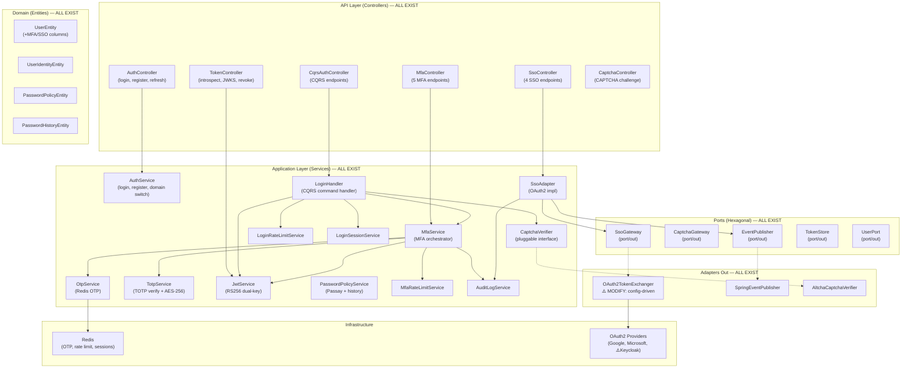

# Design: Auth Core Features — Completion & Hardening

> **Change**: auth-core-features | **Type**: EXTEND | **Flow**: Non-Financial
> **Direction**: Approach B — Gap Completion + Hardening + Testing (from brainstorm)
> **_Generated**: 2026-08-19 (v2 — merged from v1 2026-08-05)
> **Status**: ~90% code exists — design focuses on 3 gaps + testing + hardening

---

## 1. Component Architecture (Current State)

[CHANGED] All components EXIST. Diagram reflects current codebase, not planned state.



---

## 2. Gap Analysis — Components to MODIFY

### 2.1 OAuth2TokenExchanger — MODIFY (Config-Driven Providers) [Gap 1]

> **Brainstorm D11**: Config-driven SSO providers — eliminate hardcoded URLs

```
Package: com.ntt.authservice.auth.adapter.out.sso
File: OAuth2TokenExchanger.kt (EXISTING — 98 lines)

BEFORE (lines 43-52 — hardcoded):
  getTokenEndpoint("google")     → "https://oauth2.googleapis.com/token"         ✅
  getTokenEndpoint("microsoft")  → "https://login.microsoftonline.com/..."       ✅
  getTokenEndpoint("keycloak")   → throws "Unsupported SSO provider"             ❌

AFTER (config lookup):
  getTokenEndpoint(provider) →
    securityProperties.sso.providers[provider]?.tokenEndpoint
      ?: throw SsoTokenInvalidException("Unknown SSO provider: $provider")

IMPACT:
  - ~20 lines changed in OAuth2TokenExchanger.kt
  - No public API change — exchange() signature unchanged
  - All existing callers (SsoAdapter.handleCallback, linkIdentity) unaffected
  - Config: application.yml → add providers map with Google/Microsoft/Keycloak endpoints
```

### 2.2 SecurityProperties.SsoProperties — MODIFY (Providers Map) [Gap 1]

> **Brainstorm D11**: Add per-provider config

```
Package: com.ntt.authservice.shared.config
File: SecurityProperties.kt (EXISTING)

ADD to SsoProperties:
  data class SsoProperties(
      val enabled: Boolean = false,
      val autoProvisionEnabled: Boolean = false,
      val defaultDomainCode: String = "default",
      val timeoutMs: Long = 10_000,
      // [NEW] Config-driven provider endpoints
      val providers: Map<String, ProviderConfig> = emptyMap()
  ) {
      data class ProviderConfig(
          val tokenEndpoint: String,
          val userInfoEndpoint: String,
          val clientId: String = "",
          val clientSecret: String = "",
          val enabled: Boolean = true
      )
  }

CONFIG (application.yml):
  app:
    security:
      sso:
        providers:
          google:
            token-endpoint: https://oauth2.googleapis.com/token
            user-info-endpoint: https://openidconnect.googleapis.com/v1/userinfo
          microsoft:
            token-endpoint: https://login.microsoftonline.com/common/oauth2/v2.0/token
            user-info-endpoint: https://graph.microsoft.com/oidc/userinfo
          keycloak:
            token-endpoint: ${KEYCLOAK_TOKEN_ENDPOINT:http://localhost:8080/realms/master/protocol/openid-connect/token}
            user-info-endpoint: ${KEYCLOAK_USERINFO_ENDPOINT:http://localhost:8080/realms/master/protocol/openid-connect/userinfo}
```

### 2.3 MfaService.verifyMfa() — MODIFY (Trusted Device Save) [Gap 2]

> **Brainstorm D12**: Save trustedDeviceHash on MFA verify success

```
Package: com.ntt.authservice.auth.application
File: MfaService.kt (EXISTING — ~175 lines)

MODIFY verifyMfa() — add parameters + save logic:

  BEFORE:
    fun verifyMfa(mfaToken: String, code: String, ...): AuthResponse

  AFTER:
    fun verifyMfa(mfaToken: String, code: String,
                  trustDevice: Boolean = false,
                  deviceHash: String? = null, ...): AuthResponse

  NEW LOGIC (after successful verify, before return):
    if (trustDevice && !deviceHash.isNullOrBlank()) {
        val user = userRepository.findById(userId).orElseThrow()
        user.trustedDeviceHash = deviceHash
        userRepository.save(user)
        auditLogService.logEvent(userId, AuditAction.TRUSTED_DEVICE_SET, ...)
    }

IMPACT:
  - MfaController.verifyMfa() → pass new params from DTO
  - LoginHandler → no change (already reads trustedDeviceHash from command)
  - MfaVerifyRequest DTO → add trustDevice + deviceHash fields
```

### 2.4 MfaVerifyRequest DTO — MODIFY (Trusted Device Fields) [Gap 2]

```
Package: com.ntt.authservice.auth.adapter.in.web.dto
File: MfaDtos.kt (EXISTING)

ADD fields to MfaVerifyRequest:
  data class MfaVerifyRequest(
      @field:NotBlank val mfaToken: String,
      @field:NotBlank val code: String,
      // [NEW] Trusted device opt-in
      val trustDevice: Boolean = false,
      val deviceHash: String? = null
  )
```

### 2.5 SsoAdapter — MODIFY (EventPublisher Usage) [Gap 3]

> **Brainstorm D13**: Replace TODO with EventPublisher port call

```
Package: com.ntt.authservice.auth.application
File: SsoAdapter.kt (EXISTING — ~150 lines)

CURRENT (TODO):
  // TODO: Emit event via EventPublisher when Kafka is configured
  // kafkaTemplate.send("iam.user.sso_provisioned", ...)

AFTER:
  eventPublisher.publish(SsoProvisionedEvent(
      userId = user.id,
      provider = provider,
      email = exchangeResult.email,
      domainCode = domainCode
  ))

EventPublisher port ALREADY EXISTS: auth/application/port/out/EventPublisher.kt
SpringEventPublisher adapter ALREADY EXISTS: auth/adapter/out/event/SpringEventPublisher.kt

NEW: Add SsoProvisionedEvent to EventPublisher.kt:
  data class SsoProvisionedEvent(
      val userId: Long,
      val provider: String,
      val email: String?,
      val domainCode: String
  ) : DomainEvent {
      override val eventType: String = "iam.user.sso_provisioned"
  }
```

---

## 3. Existing Component Specifications (REUSE — No Changes)

> These components are fully implemented and verified. Documented for reference only.

### 3.1 LoginResult (Sealed Class) — EXISTS

```
File: auth/application/LoginResult.kt (EXISTING — 534 bytes)
sealed class LoginResult
  ├── data class Success(response: AuthResponse)
  └── data class MfaRequired(mfaToken: String, method: String, expiresIn: Long)
```

### 3.2 MfaService — EXISTS

```
File: auth/application/MfaService.kt (EXISTING — 8775 bytes)
Methods: initiateMfa(), verifyMfa(), setupTotp(), confirmTotp(), resendOtp(), updateSettings()
Dependencies: OtpService, TotpService, JwtService, UserRepository, MfaRateLimitService, AuditLogService
```

### 3.3 OtpService — EXISTS

```
File: auth/application/OtpService.kt (EXISTING — 3614 bytes)
Methods: generateOtp(), verifyOtp(), deleteOtp()
Redis keys: otp:{userId}:{channel}, otp:{userId}:{channel}:attempts, mfa:totp:setup:{userId}
```

### 3.4 TotpService — EXISTS

```
File: auth/application/TotpService.kt (EXISTING — 4585 bytes)
Methods: generateSecret(), generateQrUri(), verifyCode(), encryptSecret(), decryptSecret()
Library: dev.samstevens.totp:totp:1.7.1
Encryption: AES-256-GCM via TOTP_ENCRYPTION_KEY env var
```

### 3.5 CaptchaVerifier — EXISTS

```
File: auth/application/CaptchaVerifier.kt (EXISTING — 2120 bytes)
Interface: CaptchaVerifier { fun verify(token: String): Boolean }
Adapters: AltchaCaptchaVerifier (primary), NoopCaptchaVerifier (dev)
```

### 3.6 SsoAdapter — EXISTS (MODIFY for EventPublisher)

```
File: auth/application/SsoAdapter.kt (EXISTING — 7624 bytes)
Methods: handleCallback(), getProviders(), linkIdentity(), unlinkIdentity()
Dependencies: OAuth2TokenExchanger, UserRepository, UserIdentityRepository, DomainRepository, EventPublisher, AuditLogService
```

### 3.7 JwtService — EXISTS (RS256 Dual-Key)

```
File: auth/application/JwtService.kt (EXISTING — 8698 bytes)
Features: RS256 primary, HMAC legacy fallback, kid header, JWKS generation
Methods: generateAccessToken(), generateRefreshToken(), parseToken(), getJwks(), generateMfaToken(), parseMfaToken()
```

### 3.8 PasswordPolicyService — EXISTS (Passay Integration)

```
File: auth/application/PasswordPolicyService.kt (EXISTING — 6703 bytes)
Methods: validatePasswordStrength(), checkPasswordHistory(), changePassword(), getPolicy(), updatePolicy()
Cache: ConcurrentHashMap<Long, PasswordValidator> per domainId
```

### 3.9 LoginHandler (CQRS) — EXISTS

```
File: auth/application/command/LoginHandler.kt (EXISTING — 7152 bytes)
Entry: handleLogin(LoginCommand) → LoginResult
Flow: validate credentials → CAPTCHA check → MFA check → token generation
Dependencies: UserPort, CaptchaVerifier, MfaService, JwtService, LoginRateLimitService, LoginSessionService
```

---

## 4. Entity Design (ALL EXIST — V2 Migration Applied)

### 4.1 UserEntity — EXISTS (MFA/SSO columns applied)

```kotlin
// Fields added by V2 migration — ALL EXIST in UserEntity.kt
var mfaEnabled: Boolean = false
var mfaMethod: String = "NONE"  // NONE | SMS | EMAIL | TOTP
var totpSecretEncrypted: String? = null
var trustedDeviceHash: String? = null
var passwordChangedAt: Instant? = null
```

### 4.2 UserIdentityEntity — EXISTS

```
File: rbac/adapter/out/persistence/entity/UserIdentityEntity.kt
Base: SnowflakeBaseEntity
Fields: userId, provider, providerSub, providerEmail, providerName, linkedAt, active
Constraint: UNIQUE(provider, provider_sub)
```

### 4.3 PasswordPolicyEntity — EXISTS

```
File: rbac/adapter/out/persistence/entity/PasswordPolicyEntity.kt
Base: SnowflakeBaseEntity
Fields: domainId (unique), minLength..maxAgeDays, lockout config, timestamps
```

### 4.4 PasswordHistoryEntity — EXISTS

```
File: rbac/adapter/out/persistence/entity/PasswordHistoryEntity.kt
Base: SnowflakeBaseEntity
Fields: userId, passwordHash, createdAt
```

---

## 5. SecurityProperties Design (EXISTS — Extend for Providers)

[CHANGED] Only addition: `SsoProperties.providers` map + `ProviderConfig` nested class.

```kotlin
// EXISTING — all nested classes already present
@ConfigurationProperties(prefix = "app.security")
data class SecurityProperties(
    val enabled: Boolean = true,
    val jwt: JwtProperties = JwtProperties(),          // ✅ EXISTS — RS256 config
    val password: PasswordProperties = PasswordProperties(), // ✅ EXISTS
    val mfa: MfaProperties = MfaProperties(),          // ✅ EXISTS
    val captcha: CaptchaProperties = CaptchaProperties(), // ✅ EXISTS
    val sso: SsoProperties = SsoProperties()             // ✅ EXISTS — MODIFY: add providers map
)

// [MODIFY] Add providers map to SsoProperties
data class SsoProperties(
    val enabled: Boolean = false,
    val autoProvisionEnabled: Boolean = false,
    val defaultDomainCode: String = "default",
    val timeoutMs: Long = 10_000,
    val providers: Map<String, ProviderConfig> = emptyMap()  // [NEW]
) {
    data class ProviderConfig(                                 // [NEW]
        val tokenEndpoint: String,
        val userInfoEndpoint: String,
        val clientId: String = "",
        val clientSecret: String = "",
        val enabled: Boolean = true
    )
}
```

---

## 6. Controller Design (ALL EXIST — No Changes)

### 6.1 MfaController — EXISTS

```
POST /api/auth/mfa/verify        → mfaService.verifyMfa(mfaToken, code, trustDevice, deviceHash)  [MODIFY: add trusted device params]
POST /api/auth/mfa/totp/setup    → mfaService.setupTotp(userId)
POST /api/auth/mfa/totp/confirm  → mfaService.confirmTotp(userId, code)
POST /api/auth/mfa/resend        → mfaService.resendOtp(mfaToken)
PUT  /api/auth/mfa/settings      → mfaService.updateSettings(userId, enabled, method)
```

### 6.2 SsoController — EXISTS

```
POST   /api/auth/sso/callback            → ssoAdapter.handleCallback(code, provider, redirectUri)
GET    /api/auth/sso/providers            → ssoAdapter.getProviders(domainCode)
POST   /api/auth/sso/link                → ssoAdapter.linkIdentity(userId, code, provider)
DELETE /api/auth/sso/unlink/{provider}    → ssoAdapter.unlinkIdentity(userId, provider)
```

### 6.3 TokenController — EXISTS

```
POST /api/auth/introspect                   → jwtService.introspect(token)
GET  /.well-known/jwks.json                  → jwtService.getJwks()
POST /api/auth/sessions/{userId}/revoke-all  → revokeSessionsHandler.handle(command)
```

---

## 7. Exception Design (ALL EXIST)

```
AuthException (shared/exception/AuthExceptions.kt)
AuthCoreExceptions (shared/exception/AuthCoreExceptions.kt — 4878 bytes):
  ├── MfaCodeInvalidException        → 401 MFA_CODE_INVALID
  ├── MfaTokenExpiredException       → 401 MFA_TOKEN_EXPIRED
  ├── MfaMaxAttemptsException        → 429 MFA_MAX_ATTEMPTS
  ├── TotpNotSetupException          → 400 TOTP_NOT_SETUP
  ├── CaptchaRequiredException       → 403 CAPTCHA_REQUIRED
  ├── CaptchaFailedException         → 403 CAPTCHA_FAILED
  ├── SsoTokenInvalidException       → 401 SSO_TOKEN_INVALID
  ├── SsoUserNotProvisionedException → 403 SSO_USER_NOT_PROVISIONED
  ├── SsoIdentityConflictException   → 409 SSO_IDENTITY_CONFLICT
  ├── CannotUnlinkLastIdentityException → 400 CANNOT_UNLINK_LAST_IDENTITY
  ├── SsoProviderTimeoutException    → 504 SSO_PROVIDER_TIMEOUT
  ├── PasswordRecentlyUsedException  → 400 PASSWORD_RECENTLY_USED
  ├── PasswordExpiredException       → 403 PASSWORD_EXPIRED
  └── PasswordPolicyViolationException → 400 PASSWORD_POLICY_VIOLATION

AuthErrorCode enum (shared/exception/AuthErrorCode.kt — 5469 bytes)
  → Contains all error code constants with HTTP status mappings
```

---

## 8. Testing Strategy (from brainstorm Q5)

### 8.1 Existing Tests (REUSE)

| Test Class | Type | Status |
|-----------|------|--------|
| `LoginHandlerTest` | Unit | ✅ EXISTS |
| `MfaServiceTest` | Unit | ✅ EXISTS |
| `PasswordPolicyServiceTest` | Unit | ✅ EXISTS |
| `OtpServiceTest` | Unit | ✅ EXISTS |
| `SsoAdapterTest` | Unit | ✅ EXISTS |
| `MfaRateLimitServiceTest` | Unit | ✅ EXISTS |
| `AuthControllerIntegrationTest` | Integration | ✅ EXISTS |
| `MfaRateLimitIntegrationTest` | Integration | ✅ EXISTS |

### 8.2 New Integration Tests (Phase 4)

| # | Test Class | Coverage | Effort |
|---|-----------|----------|--------|
| T1 | `MfaLoginFlowIntegrationTest` | UC-001: login → MFA → verify → tokens | 3h |
| T2 | `SsoCallbackIntegrationTest` | UC-002: SSO callback + WireMock IdP + Keycloak | 3h |
| T3 | `TokenIntrospectionIntegrationTest` | UC-003: active + blacklisted tokens | 1h |
| T4 | `JwksEndpointIntegrationTest` | FR-010: JWKS response + Cache-Control | 0.5h |
| T5 | `PasswordChangeIntegrationTest` | UC-004: policy + history enforcement | 2h |
| T6 | `TotpSetupFlowIntegrationTest` | UC-005: setup → confirm → MFA verify | 2h |

### 8.3 Edge Case Unit Tests (Phase 5)

| Test Case | Expected Behavior | FR |
|-----------|------------------|-----|
| Expired mfaToken + valid code | `MfaTokenExpiredException` | FR-001 |
| Wrong MFA method in token claims | `MfaCodeInvalidException` | FR-001 |
| SSO callback with revoked auth code | `SsoTokenInvalidException` | FR-006 |
| Password change without domain policy | Fallback to default policy | FR-013 |
| TOTP confirm with expired Redis key | `TotpNotSetupException` | FR-002 |
| Concurrent MFA verify (same mfaToken) | First succeeds, second fails (Redis DEL idempotency) | FR-015 |

---

## 9. Design Decisions (Final State)

| # | Decision | Status | Impact |
|---|----------|--------|--------|
| D1 | Sealed class `LoginResult` | ✅ IMPLEMENTED | - |
| D2 | MFA token = JWT stateless (5min TTL) | ✅ IMPLEMENTED | - |
| D3 | RS256 via refresh-based migration | ✅ IMPLEMENTED | - |
| D4 | CAPTCHA at service level | ✅ IMPLEMENTED | - |
| D5 | SSO hybrid (OAuth2 Client + manual controller) | ✅ IMPLEMENTED | - |
| D6 | UserEntity columns (not separate entity) | ✅ IMPLEMENTED | - |
| D7 | Passay factory per domain (ConcurrentHashMap cache) | ✅ IMPLEMENTED | - |
| D8 | SSO-only: passwordHash = "!SSO_ONLY!" | ✅ IMPLEMENTED | - |
| D9 | Redis key namespace: `otp:{userId}:{channel}` | ✅ IMPLEMENTED | - |
| D10 | Feature config via SecurityProperties | ✅ IMPLEMENTED | - |
| D11 | Config-driven SSO providers (SsoProperties.providers map) | **PENDING** | OAuth2TokenExchanger, SecurityProperties |
| D12 | Trusted device save on MFA verify success | **PENDING** | MfaService, MfaDtos |
| D13 | EventPublisher port for SSO provisioning event | **PENDING** | SsoAdapter (port exists, usage pending) |
| D14 | Defer trusted device TTL to separate migration | **ACCEPTED** | No code change needed now |
