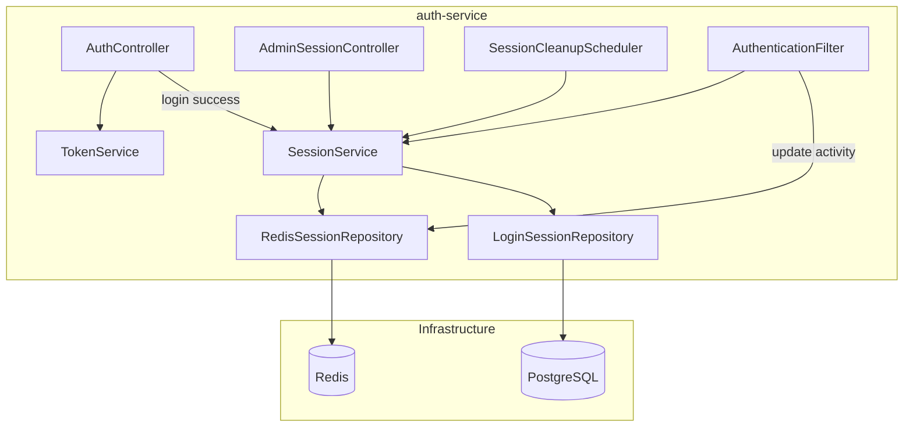
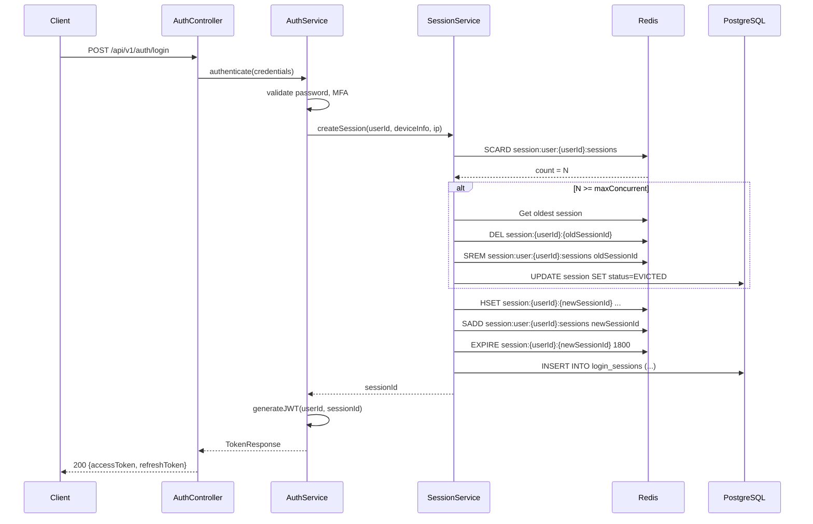
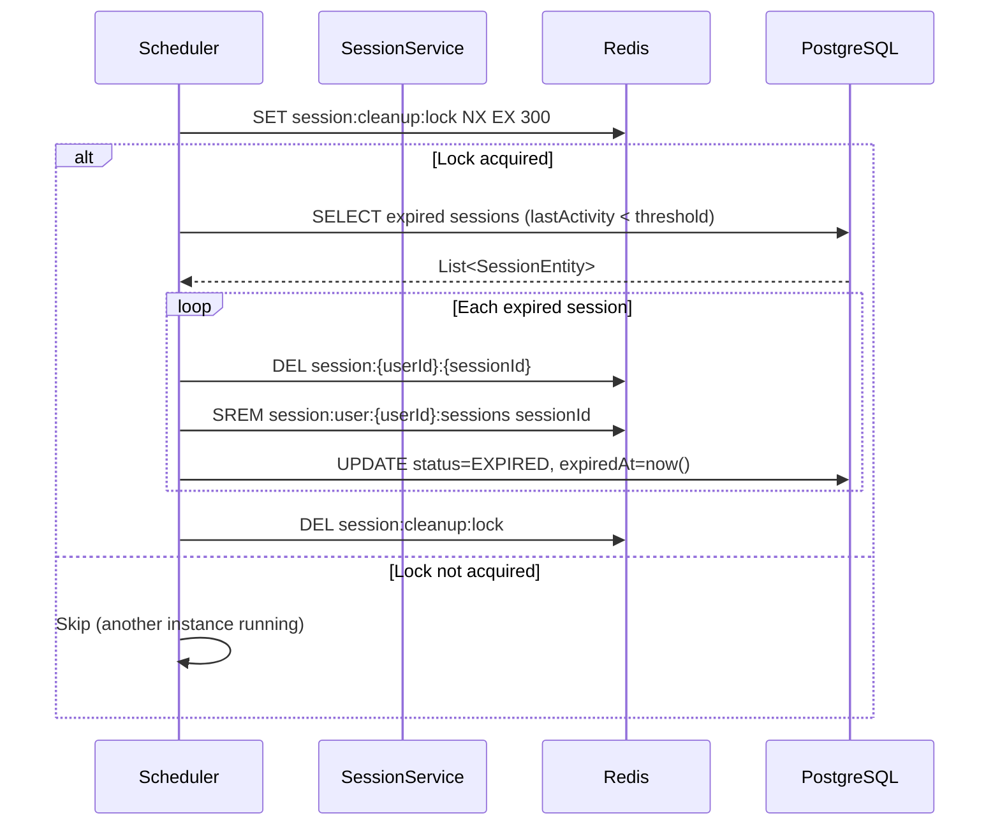

# Technical Specification: FR-008 Session Management

> Đặc tả kỹ thuật cho tính năng quản lý Session trong auth-service

## Keywords
session management, Redis session store, Spring Boot session, JWT session binding, concurrent session control, session expiration, distributed session, session cleanup scheduler

## 1. Architecture Overview

### 1.1 Component Diagram



### 1.2 Sequence Diagram — Login with Session Creation



### 1.3 Sequence Diagram — Session Cleanup



## 2. Data Schema

### 2.1 PostgreSQL — login_sessions

```sql
CREATE TABLE login_sessions (
    id              BIGINT PRIMARY KEY,
    user_id         BIGINT NOT NULL REFERENCES users(id),
    session_id      VARCHAR(36) NOT NULL UNIQUE,
    device_info     VARCHAR(500),
    ip_address      VARCHAR(45),
    user_agent      VARCHAR(1000),
    login_at        TIMESTAMP WITH TIME ZONE NOT NULL DEFAULT NOW(),
    last_activity_at TIMESTAMP WITH TIME ZONE NOT NULL DEFAULT NOW(),
    expired_at      TIMESTAMP WITH TIME ZONE,
    revoked_at      TIMESTAMP WITH TIME ZONE,
    revoked_by      BIGINT REFERENCES users(id),
    status          VARCHAR(20) NOT NULL DEFAULT 'ACTIVE',
    remember_me     BOOLEAN NOT NULL DEFAULT FALSE,
    created_at      TIMESTAMP WITH TIME ZONE NOT NULL DEFAULT NOW(),
    updated_at      TIMESTAMP WITH TIME ZONE NOT NULL DEFAULT NOW()
);

CREATE INDEX idx_login_sessions_user_id ON login_sessions(user_id);
CREATE INDEX idx_login_sessions_status ON login_sessions(status);
CREATE INDEX idx_login_sessions_session_id ON login_sessions(session_id);
CREATE INDEX idx_login_sessions_last_activity ON login_sessions(last_activity_at);
```

### 2.2 Redis Keys

| Key Pattern | Type | TTL | Description |
|-------------|------|-----|-------------|
| `session:{userId}:{sessionId}` | Hash | 1800s (30 min) | Session data (device, ip, timestamps) |
| `session:user:{userId}:sessions` | Set | 86400s (24h) | All active sessionIds for user |
| `session:config:{domainId}` | Hash | 3600s (1h) | Session config (maxConcurrent, idleTimeout) |
| `session:cleanup:lock` | String | 300s (5 min) | Distributed lock for cleanup scheduler |

## 3. API Specification

### 3.1 Admin Session APIs

#### GET /api/v1/admin/sessions
Query active sessions with filtering.

**Request Parameters:**
| Param | Type | Required | Default | Description |
|-------|------|----------|---------|-------------|
| userId | Long | No | — | Filter by user |
| status | String | No | ACTIVE | ACTIVE, EXPIRED, REVOKED |
| page | Int | No | 0 | Page number |
| size | Int | No | 20 | Page size (max 100) |

**Response:** `200 OK`
```json
{
  "content": [
    {
      "sessionId": "550e8400-e29b-41d4-a716-446655440000",
      "userId": 12345,
      "username": "john.doe",
      "deviceInfo": "Chrome 120 / macOS",
      "ipAddress": "192.168.1.100",
      "loginAt": "2026-08-16T10:30:00Z",
      "lastActivityAt": "2026-08-16T11:00:00Z",
      "status": "ACTIVE",
      "rememberMe": false
    }
  ],
  "totalElements": 42,
  "totalPages": 3,
  "number": 0
}
```

#### DELETE /api/v1/admin/sessions/{sessionId}
Revoke a single session.

**Response:** `200 OK`
```json
{
  "message": "Session revoked successfully",
  "sessionId": "550e8400-e29b-41d4-a716-446655440000",
  "revokedAt": "2026-08-16T11:05:00Z"
}
```

#### POST /api/v1/admin/sessions/revoke-bulk
Revoke multiple sessions.

**Request Body:**
```json
{
  "userId": 12345,
  "sessionIds": ["id1", "id2"],
  "reason": "Security incident"
}
```

**Response:** `200 OK`
```json
{
  "revokedCount": 2,
  "revokedAt": "2026-08-16T11:05:00Z"
}
```

#### GET /api/v1/admin/sessions/stats
Session statistics for dashboard.

**Response:** `200 OK`
```json
{
  "totalActiveSessions": 156,
  "uniqueActiveUsers": 89,
  "sessionsCreatedToday": 234,
  "sessionsExpiredToday": 178,
  "avgSessionDuration": "PT2H15M"
}
```

## 4. Implementation Classes

### 4.1 Entity Layer
- `LoginSessionEntity.kt` — JPA entity extending `SnowflakePersistentAuditableEntity`
- `SessionStatus.kt` — Enum: ACTIVE, EXPIRED, REVOKED, LOGGED_OUT, EVICTED

### 4.2 Repository Layer
- `LoginSessionRepository.kt` — JPA repository with custom queries
- `RedisSessionStore.kt` — Redis operations for active sessions

### 4.3 Service Layer
- `SessionService.kt` — Core business logic
  - `createSession()` — Create + enforce concurrent limit
  - `revokeSession()` — Admin revoke
  - `updateActivity()` — Refresh lastActivityAt
  - `getActiveSessions()` — Query sessions
  - `getSessionStats()` — Dashboard stats
- `SessionCleanupScheduler.kt` — `@Scheduled` cleanup task

### 4.4 Controller Layer
- `AdminSessionController.kt` — Admin REST API (requires SESSION_VIEW/SESSION_MANAGE permissions)

### 4.5 Filter Layer
- `SessionValidationFilter.kt` — Verify session exists in Redis on each request

## 5. Configuration

```yaml
# application.yml
session:
  max-concurrent: 5
  idle-timeout: 30m
  absolute-timeout: 24h
  remember-me-timeout: 7d
  cleanup:
    interval: 5m
    batch-size: 100
    lock-timeout: 5m
```

## 6. Performance Considerations

| Operation | Target Latency | Approach |
|-----------|---------------|----------|
| Session validation (per request) | < 5ms | Redis GET with connection pool |
| Session creation | < 20ms | Redis pipeline (3 ops) + async DB write |
| Session cleanup | < 1s per batch | Batched DB updates, Redis pipeline |
| Session stats | < 100ms | Redis SCARD + cached aggregates |

## 7. Security Considerations

- Session ID = UUID v4 (cryptographically random)
- Redis keys namespaced per service instance
- Admin APIs require specific permissions (SESSION_VIEW, SESSION_MANAGE)
- Rate limiting on admin revoke APIs (prevent abuse)
- Session fixation prevention: new sessionId on each login
- IP binding optional (configurable): warn on IP change mid-session
