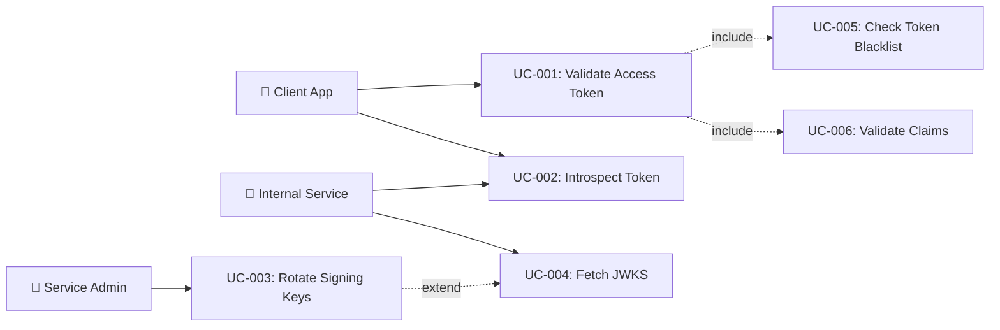

# Tài liệu phân tích nghiệp vụ: JWT Token Validation

> Phân tích nghiệp vụ chi tiết — chia nhỏ theo use case, đặc tả ngữ nghĩa từng chức năng.

---

## 1. Tổng quan (Overview)

### 1.1 Bối cảnh nghiệp vụ (Business Context)

Hệ thống auth-service sử dụng JWT cho stateless authentication. Mỗi request từ client mang Bearer token, và hệ thống cần validate token đó trước khi cho phép truy cập tài nguyên. Hiện tại, quá trình validation có các vấn đề: blacklist check qua DB (chậm khi throughput cao), thiếu audience validation (rủi ro token reuse across services), chưa có JWKS key rotation strategy (không thể rotate key mà không downtime), và chưa tối ưu caching cho hot validation data.

JWT Token Validation là critical path — mọi authenticated request đều đi qua. Performance và security của bước này ảnh hưởng trực tiếp tới toàn bộ hệ thống.

### 1.2 Mục tiêu (Objectives)

| # | Mục tiêu | KPI đo lường | Độ ưu tiên |
|---|---------|-------------|-----------|
| O-01 | Giảm latency validation xuống sub-millisecond | P95 blacklist check < 1ms (từ ~3-5ms hiện tại) | High |
| O-02 | Đảm bảo compliance với RFC 8725 JWT BCP | 100% claim validation coverage (iss, aud, exp, nbf, jti) | High |
| O-03 | Hỗ trợ JWKS key rotation không downtime | Zero-downtime key rotation thành công trong < 5 phút | Medium |
| O-04 | Cải thiện introspection endpoint theo RFC 7662 | Response format compliant với RFC 7662 | Medium |
| O-05 | Tối ưu tài nguyên qua two-tier caching | Cache hit ratio > 80% cho blacklist checks | High |

### 1.3 Phạm vi (Scope)

| In Scope | Out of Scope |
|----------|-------------|
| Access token validation (RS256 + HMAC fallback) | Token generation logic (already implemented) |
| Token blacklist migration (DB → Redis + Caffeine) | Refresh token rotation logic (already implemented) |
| Claim validation pipeline (iss, aud, exp, nbf, jti, type) | MFA token generation |
| JWKS key rotation mechanism | OAuth2 provider integration |
| Token introspection (RFC 7662) | User registration/login flows |
| Two-tier caching for validation data | Frontend token storage |
| Clock skew tolerance configuration | Password policy changes |
| Validation event recording | Session management UI |

### 1.4 Stakeholders & Actors

| Actor | Loại | Mô tả | Tương tác chính |
|-------|------|--------|----------------|
| Client Application | Primary | Web/mobile app sending authenticated requests | Gửi Bearer token trong Authorization header |
| Service Administrator | Primary | Ops/DevOps quản lý key rotation và monitoring | Trigger key rotation, monitor validation metrics |
| Internal Microservice | Secondary | Service-to-service calls cần verify token | Token introspection, JWKS endpoint consumption |
| JwtAuthFilter | External System | Spring Security filter trên request pipeline | Parse + validate token, set SecurityContext |
| Redis | External System | Distributed cache cho blacklist và validation data | SISMEMBER check, EXPIRE-based auto-cleanup |
| Caffeine | External System | Local in-process cache | L1 cache cho hot validation data |

---

## 2. Use Case Diagram (tổng quan)



---

## 3. Danh sách Use Case (Use Case Index)

| UC-ID | Tên Use Case | Actor | Nhóm chức năng | Độ ưu tiên | Trạng thái |
|-------|-------------|-------|----------------|-----------|-----------|
| UC-001 | Validate Access Token | Client App | Token Validation | High | Draft |
| UC-002 | Introspect Token (RFC 7662) | Internal Service / Client | Token Introspection | High | Draft |
| UC-003 | Rotate Signing Keys | Service Admin | Key Management | Medium | Draft |
| UC-004 | Fetch JWKS | Internal Service | Key Distribution | Medium | Draft |
| UC-005 | Check Token Blacklist | System (internal) | Token Revocation | High | Draft |
| UC-006 | Validate Claims | System (internal) | Token Validation | High | Draft |

---

## 4. Đặc tả Use Case chi tiết

### UC-001: Validate Access Token

#### 4.1 Thông tin chung

| Mục | Nội dung |
|-----|----------|
| **Mã** | UC-001 |
| **Tên** | Validate Access Token |
| **Mô tả ngữ nghĩa** | Mỗi authenticated request đều cần validate JWT access token để xác thực identity và authorize quyền truy cập. Use case này là critical path — xử lý hàng nghìn lần/giây, nên cần tối ưu performance (sub-millisecond) đồng thời đảm bảo security (chặn token revoked, expired, tampered). |
| **Actor** | Client Application (implicit — thông qua HTTP request) |
| **Trigger** | HTTP request với Authorization: Bearer <token> header |
| **Độ ưu tiên** | High |
| **Tần suất** | Per-request — hàng nghìn lần/giây (continuous) |
| **Nhóm chức năng** | Token Validation |

#### 4.2 Điều kiện

| Loại | Mô tả |
|------|--------|
| **Pre-conditions** | Request có Authorization header bắt đầu bằng "Bearer ". RS256 public key hoặc HMAC secret key đã được cấu hình. |
| **Post-conditions (Success)** | SecurityContext chứa authentication với subject, roles, permissions. Request tiếp tục qua filter chain. |
| **Post-conditions (Failure)** | SecurityContext không set (anonymous). Endpoint secured sẽ trả 401/403. |
| **Invariants** | Token signature phải verified bằng configured signing key. Revoked tokens phải bị reject. |

#### 4.3 Luồng chính (Basic Flow)

| Step | Actor Action | System Response | Data | Ghi chú |
|------|-------------|----------------|------|---------|
| 1 | Client gửi HTTP request với Bearer token | JwtAuthFilter extract token từ Authorization header | Token string | OncePerRequestFilter |
| 2 | — | Parse token: verify signature (RS256 → HMAC fallback) | Claims object | JJWT parseSignedClaims() |
| 3 | — | Validate claims: iss, aud, exp, nbf | Validated claims | Claim validation pipeline |
| 4 | — | Check blacklist: L1 Caffeine → L2 Redis → DB fallback | JTI string | Two-tier cache check |
| 5 | — | Extract token type (access/anonymous/mfa/refresh) | Type string | Claim "type" |
| 6 | — | Extract authorities (roles + permissions) hoặc ROLE_ANONYMOUS | Authority list | Depends on token type |
| 7 | — | Set SecurityContext with authentication | UsernamePasswordAuthenticationToken | SecurityContextHolder |
| 8 | — | Continue filter chain | — | filterChain.doFilter() |

#### 4.4 Luồng thay thế (Alternative Flows)

##### AF-001: Anonymous Token Validation
- **Trigger**: Tại Step 5 khi token type = "anonymous"
- **Steps**:
  1. Set authorities = [ROLE_ANONYMOUS]
  2. Set authDetails = {type: "anonymous", sessionId: subject}
- **Rejoin**: Step 7 của Basic Flow

##### AF-002: HMAC Fallback (Migration Period)
- **Trigger**: Tại Step 2 khi RS256 verification fails
- **Steps**:
  1. Attempt HMAC-SHA256 verification with legacy key
  2. If success → continue with claims
  3. If fail → Exception Flow EF-001
- **Rejoin**: Step 3 của Basic Flow

##### AF-003: No Authorization Header
- **Trigger**: Tại Step 1 khi header missing or not "Bearer" prefix
- **Steps**:
  1. Skip validation entirely
  2. Continue filter chain without authentication
- **Rejoin**: End — anonymous access, secured endpoints will reject

#### 4.5 Luồng ngoại lệ (Exception Flows)

##### EF-001: Token Signature Invalid
- **Trigger**: Tại Step 2 khi both RS256 and HMAC verification fail
- **Error**: JwtException — signature mismatch or malformed token
- **Handling**:
  1. Log debug: "JWT validation failed: {message}"
  2. Continue filter chain without authentication (do not block)
- **Post-condition**: No authentication set, secured endpoints return 401

##### EF-002: Token Expired
- **Trigger**: Tại Step 3 khi exp claim < current time - clock skew
- **Error**: TokenExpiredException (AUTH_003, 401)
- **Handling**:
  1. Log debug: "JWT expired"
  2. Continue without authentication
- **Post-condition**: Client must refresh token or re-authenticate

##### EF-003: Token Blacklisted
- **Trigger**: Tại Step 4 khi JTI found in blacklist
- **Error**: 401 Unauthorized (direct response)
- **Handling**:
  1. Log debug: "Token {jti} is blacklisted"
  2. Return 401 immediately, do not continue filter chain
- **Post-condition**: Request rejected, client must re-authenticate

##### EF-004: Audience Mismatch
- **Trigger**: Tại Step 3 khi aud claim does not contain service identifier
- **Error**: JwtException — audience validation failed
- **Handling**:
  1. Log warn: "JWT audience mismatch: expected={service-id}, got={aud}"
  2. Continue without authentication
- **Post-condition**: Token rejected for this service

#### 4.6 Quy tắc nghiệp vụ (Business Rules)

| BR-ID | Quy tắc | Mô tả chi tiết | Validation |
|-------|---------|----------------|-----------|
| BR-001 | RS256 Primary, HMAC Fallback | Luôn thử RS256 trước, chỉ fallback HMAC trong 7-day migration window | Algorithm check order |
| BR-002 | Clock Skew Tolerance | Cho phép 60 seconds clock skew cho exp và nbf claims | JJWT allowedClockSkewSeconds(60) |
| BR-003 | Issuer Validation | iss claim phải match SecurityProperties.jwt.issuer ("auth-service") | String exact match |
| BR-004 | Audience Validation | aud claim phải chứa service identifier | String contains check |
| BR-005 | Blacklist Check Required | Mọi token có JTI phải check blacklist trước khi accept | L1 → L2 → DB check |
| BR-006 | Token Type Discrimination | Token type quyết định authority set: null/access → full roles, anonymous → ROLE_ANONYMOUS, mfa/refresh → reject | Claim "type" check |
| BR-007 | Fail-Open for Filter | Validation failure KHÔNG block request — filter continues, endpoint security decides | Security by endpoint config |

#### 4.7 Yêu cầu phi chức năng (cho UC này)

| Loại | Yêu cầu | Target |
|------|---------|--------|
| Performance | Validation total time | < 2ms P95 |
| Security | Reject revoked tokens | < 30s acceptance window |
| Availability | Filter must not crash | 99.99% |
| Concurrency | Max concurrent validations | > 10,000 req/s |

#### 4.8 Mockup / Wireframe Description

```
N/A — Internal filter, no UI
```

---

### UC-002: Introspect Token (RFC 7662)

#### 4.1 Thông tin chung

| Mục | Nội dung |
|-----|----------|
| **Mã** | UC-002 |
| **Tên** | Introspect Token |
| **Mô tả ngữ nghĩa** | Cho phép internal services query trạng thái hiện tại của token — active hay revoked, kèm claims. RFC 7662 compliant: luôn trả 200 OK với active=true/false. Giá trị: service-to-service validation mà không cần share signing key. |
| **Actor** | Internal Microservice, Client Application |
| **Trigger** | POST /api/auth/introspect với token payload |
| **Độ ưu tiên** | High |
| **Tần suất** | On-demand — service-to-service calls |
| **Nhóm chức năng** | Token Introspection |

#### 4.2 Điều kiện

| Loại | Mô tả |
|------|--------|
| **Pre-conditions** | Caller authenticated. Token to introspect provided. |
| **Post-conditions (Success)** | Response with active=true and full claims returned |
| **Post-conditions (Failure)** | Response with active=false (invalid/expired/revoked) |
| **Invariants** | Response luôn trả 200 OK, chỉ active field thay đổi (per RFC 7662) |

#### 4.3 Luồng chính (Basic Flow)

| Step | Actor Action | System Response | Data | Ghi chú |
|------|-------------|----------------|------|---------|
| 1 | POST /api/auth/introspect {token: "..."} | Validate request body | IntrospectionRequest | @Valid |
| 2 | — | Parse token via JwtService.parseToken() | Claims | RS256 → HMAC |
| 3 | — | Check blacklist via JTI | Boolean isBlacklisted | L1→L2→DB |
| 4 | — | Build RFC 7662 response | IntrospectionResponse | active, sub, username, roles, permissions, exp, iat, iss, jti |
| 5 | — | Return 200 OK with response | JSON | Always 200 per RFC |

#### 4.4 Luồng thay thế (Alternative Flows)

##### AF-001: Invalid/Expired Token
- **Trigger**: Tại Step 2 khi parseToken() throws exception
- **Steps**:
  1. Return IntrospectionResponse(active = false) with 200 OK
- **Rejoin**: End

#### 4.5 Luồng ngoại lệ (Exception Flows)

##### EF-001: Missing Token Field
- **Trigger**: Tại Step 1 khi token field blank/missing
- **Error**: 400 Bad Request — validation error
- **Handling**: Return standard validation error response
- **Post-condition**: No introspection performed

#### 4.6 Quy tắc nghiệp vụ (Business Rules)

| BR-ID | Quy tắc | Mô tả chi tiết | Validation |
|-------|---------|----------------|-----------|
| BR-008 | Always 200 OK | RFC 7662: introspection MUST return 200, use active field | HTTP status |
| BR-009 | Blacklisted = inactive | Token with blacklisted JTI returns active=false | Blacklist check |
| BR-010 | No token secrets in response | Never return token signature or signing key information | Response filtering |

#### 4.7 Yêu cầu phi chức năng (cho UC này)

| Loại | Yêu cầu | Target |
|------|---------|--------|
| Performance | Response time | < 50ms P95 |
| Security | Caller authentication | Authenticated endpoint only |

#### 4.8 Mockup / Wireframe Description

```
N/A — REST API endpoint
```

---

### UC-003: Rotate Signing Keys

#### 4.1 Thông tin chung

| Mục | Nội dung |
|-----|----------|
| **Mã** | UC-003 |
| **Tên** | Rotate Signing Keys |
| **Mô tả ngữ nghĩa** | Cho phép admin rotate RSA signing keys mà không gây downtime. Sử dụng dual-key overlap strategy: publish cả old+new key trong JWKS, sign với new key, chờ old tokens expire, loại bỏ old key. Đảm bảo zero-downtime rotation. |
| **Actor** | Service Administrator |
| **Trigger** | Admin trigger key rotation (scheduled hoặc manual) |
| **Độ ưu tiên** | Medium |
| **Tần suất** | Monthly hoặc on-demand |
| **Nhóm chức năng** | Key Management |

#### 4.2 Điều kiện

| Loại | Mô tả |
|------|--------|
| **Pre-conditions** | New RSA key pair generated. Current key pair đang active. |
| **Post-conditions (Success)** | New key pair active for signing. Both keys in JWKS. Old key removed after overlap period. |
| **Post-conditions (Failure)** | Rollback to current key pair. No disruption. |
| **Invariants** | At least one valid signing key always available. |

#### 4.3 Luồng chính (Basic Flow)

| Step | Actor Action | System Response | Data | Ghi chú |
|------|-------------|----------------|------|---------|
| 1 | Admin places new key files and updates configuration | Load new key pair (kid=new-key-id) | KeyPair | PEM files |
| 2 | — | Add new key to JWKS endpoint (both old+new published) | JWKS with 2 keys | kid-based selection |
| 3 | — | Switch signing to new key (kid in JWT header) | New tokens signed with new key | Zero-downtime |
| 4 | — | Wait for overlap period (> max token lifetime = 7 days for refresh) | Timer | Configurable |
| 5 | Admin removes old key configuration | Remove old key from JWKS | JWKS with 1 key | Post-overlap |

#### 4.5 Luồng ngoại lệ (Exception Flows)

##### EF-001: New Key Load Failure
- **Trigger**: Tại Step 1 khi key file invalid or unreadable
- **Error**: IllegalStateException — key load failed
- **Handling**: Log error, continue with current key pair
- **Post-condition**: No rotation, current key remains active

#### 4.6 Quy tắc nghiệp vụ (Business Rules)

| BR-ID | Quy tắc | Mô tả chi tiết | Validation |
|-------|---------|----------------|-----------|
| BR-011 | Dual-Key Overlap | Both old and new keys MUST be in JWKS during overlap period | JWKS endpoint check |
| BR-012 | Overlap Duration | Overlap period MUST > max token lifetime (7 days for refresh tokens) | Configuration check |
| BR-013 | Kid Header Required | All tokens MUST include kid header for key selection | JWT header verification |

---

### UC-004: Fetch JWKS

#### 4.1 Thông tin chung

| Mục | Nội dung |
|-----|----------|
| **Mã** | UC-004 |
| **Tên** | Fetch JWKS |
| **Mô tả ngữ nghĩa** | Expose RSA public key(s) ở /.well-known/jwks.json cho internal services và external consumers verify JWT signature. Cached 24h, supports multiple keys cho key rotation. |
| **Actor** | Internal Microservice |
| **Trigger** | GET /.well-known/jwks.json |
| **Độ ưu tiên** | Medium |
| **Tần suất** | Daily (with 24h cache) |
| **Nhóm chức năng** | Key Distribution |

#### 4.3 Luồng chính (Basic Flow)

| Step | Actor Action | System Response | Data | Ghi chú |
|------|-------------|----------------|------|---------|
| 1 | GET /.well-known/jwks.json | Serialize RSA public key(s) as JWK(s) | JWKS JSON | Cache-Control: max-age=86400 |
| 2 | — | Return keys array with kty, kid, alg, use, n, e | Response body | RFC 7517 format |

#### 4.6 Quy tắc nghiệp vụ (Business Rules)

| BR-ID | Quy tắc | Mô tả chi tiết | Validation |
|-------|---------|----------------|-----------|
| BR-014 | Public endpoint | JWKS endpoint MUST be publicly accessible (no auth required) | SecurityConfig permitAll() |
| BR-015 | Cache-Control | Response MUST include Cache-Control: max-age=86400, public | HTTP header |
| BR-016 | JWK format | Each key MUST include kty, kid, alg, use, n, e fields | RFC 7517 validation |

---

### UC-005: Check Token Blacklist

#### 4.1 Thông tin chung

| Mục | Nội dung |
|-----|----------|
| **Mã** | UC-005 |
| **Tên** | Check Token Blacklist |
| **Mô tả ngữ nghĩa** | Kiểm tra JTI có trong blacklist không — sử dụng two-tier cache (L1 Caffeine → L2 Redis → DB fallback) để đảm bảo sub-millisecond lookup cho critical path validation. Token bị blacklist khi: logout, session revoke, token rotation, admin action. |
| **Actor** | System (internal, gọi từ UC-001 và UC-002) |
| **Trigger** | Token validation hoặc introspection cần check revocation status |
| **Độ ưu tiên** | High |
| **Tần suất** | Per-request — hàng nghìn lần/giây |
| **Nhóm chức năng** | Token Revocation |

#### 4.3 Luồng chính (Basic Flow)

| Step | Actor Action | System Response | Data | Ghi chú |
|------|-------------|----------------|------|---------|
| 1 | — | Check L1 Caffeine cache for JTI | Boolean / miss | TTL 15-30s |
| 2 | L1 miss | Check L2 Redis (SISMEMBER token_blacklist JTI) | Boolean / miss | O(1) lookup |
| 3 | L2 miss | Check DB (TokenBlacklistRepository.existsByTokenJti) | Boolean | Fallback only |
| 4 | — | If found in L2/DB → populate L1 cache | Cache write | Write-through |
| 5 | — | Return blacklisted status | Boolean | true = revoked |

#### 4.6 Quy tắc nghiệp vụ (Business Rules)

| BR-ID | Quy tắc | Mô tả chi tiết | Validation |
|-------|---------|----------------|-----------|
| BR-017 | L1 Cache TTL | Caffeine TTL = 15-30 seconds (short for consistency) | Configuration |
| BR-018 | L2 TTL = Token TTL | Redis blacklist entry TTL = remaining token lifetime | Auto-eviction |
| BR-019 | Write-Through on Revoke | When token blacklisted → write to L1 + L2 + DB simultaneously | Consistency |
| BR-020 | Fail-Open on Cache Miss | If both L1 and L2 unavailable → fallback to DB | Resilience |

---

### UC-006: Validate Claims

#### 4.1 Thông tin chung

| Mục | Nội dung |
|-----|----------|
| **Mã** | UC-006 |
| **Tên** | Validate Claims |
| **Mô tả ngữ nghĩa** | Validate các standard claims (iss, aud, exp, nbf) và custom claims (type, roles) của JWT. Sử dụng chain of responsibility pattern để modular và testable. Đảm bảo compliance với RFC 8725 best practices. |
| **Actor** | System (internal, gọi từ UC-001) |
| **Trigger** | After successful signature verification in UC-001 |
| **Độ ưu tiên** | High |
| **Tần suất** | Per-request |
| **Nhóm chức năng** | Token Validation |

#### 4.3 Luồng chính (Basic Flow)

| Step | Actor Action | System Response | Data | Ghi chú |
|------|-------------|----------------|------|---------|
| 1 | — | Validate iss claim == configured issuer | iss string | "auth-service" |
| 2 | — | Validate aud claim contains service identifier | aud list | Optional until multi-service |
| 3 | — | Validate exp > current time - clock skew | exp timestamp | 60s tolerance |
| 4 | — | Validate nbf < current time + clock skew (if present) | nbf timestamp | Optional claim |
| 5 | — | Validate token type is allowed for context | type string | access/anonymous allowed in filter |

#### 4.6 Quy tắc nghiệp vụ (Business Rules)

| BR-ID | Quy tắc | Mô tả chi tiết | Validation |
|-------|---------|----------------|-----------|
| BR-021 | Issuer Must Match | iss MUST equal SecurityProperties.jwt.issuer | Exact string match |
| BR-022 | Algorithm Allowlist | Only RS256 and HS256 accepted, reject all others | Algorithm check |
| BR-023 | Type Restriction | JwtAuthFilter only accepts access (null type) and anonymous tokens. MFA/refresh tokens rejected. | Type claim check |

---

## 5. Ma trận truy xuất (Traceability Matrix)

| UC-ID | FR-ID | NFR-ID | BR-ID | Screen | API Endpoint | DB Entity |
|-------|-------|--------|-------|--------|-------------|-----------|
| UC-001 | FR-001, FR-002, FR-003, FR-005 | NFR-001, NFR-002 | BR-001 to BR-007 | N/A | Filter (every endpoint) | TokenBlacklistEntity |
| UC-002 | FR-004 | NFR-003 | BR-008, BR-009, BR-010 | N/A | POST /api/auth/introspect | TokenBlacklistEntity |
| UC-003 | FR-006 | NFR-004 | BR-011, BR-012, BR-013 | N/A | Admin configuration | N/A |
| UC-004 | FR-007 | NFR-005 | BR-014, BR-015, BR-016 | N/A | GET /.well-known/jwks.json | N/A |
| UC-005 | FR-002 | NFR-001 | BR-017, BR-018, BR-019, BR-020 | N/A | Internal (from filter) | TokenBlacklistEntity |
| UC-006 | FR-003 | NFR-002 | BR-021, BR-022, BR-023 | N/A | Internal (from filter) | N/A |

---

## 6. Yêu cầu chức năng tổng hợp (Functional Requirements)

| FR-ID | Tên | Mô tả | UC liên quan | Độ ưu tiên |
|-------|-----|--------|-------------|-----------|
| FR-001 | JWT Signature Verification | Hệ thống phải verify JWT signature bằng RS256 (primary) với HMAC-SHA256 fallback | UC-001 | High |
| FR-002 | Token Blacklist Check (Two-Tier) | Hệ thống phải check JTI against blacklist qua L1 Caffeine → L2 Redis → DB pipeline | UC-001, UC-005 | High |
| FR-003 | Comprehensive Claim Validation | Hệ thống phải validate iss, aud (khi configured), exp, nbf claims theo RFC 8725 | UC-001, UC-006 | High |
| FR-004 | Token Introspection (RFC 7662) | Hệ thống phải expose introspection endpoint trả RFC 7662 compliant response | UC-002 | High |
| FR-005 | Token Type Discrimination | Hệ thống phải discriminate token type (access, anonymous, mfa, refresh) và set appropriate authorities | UC-001 | High |
| FR-006 | JWKS Key Rotation | Hệ thống phải support dual-key overlap strategy cho zero-downtime key rotation | UC-003 | Medium |
| FR-007 | JWKS Endpoint | Hệ thống phải expose JWKS endpoint tại /.well-known/jwks.json với caching | UC-004 | Medium |
| FR-008 | Clock Skew Tolerance | Hệ thống phải cho phép configurable clock skew (default 60s) cho exp/nbf validation | UC-001, UC-006 | Medium |
| FR-009 | Validation Event Recording | Hệ thống phải record validation failure events cho audit trail | UC-001 | Low |

---

## 7. Yêu cầu phi chức năng tổng hợp (Non-Functional Requirements)

| NFR-ID | Loại | Yêu cầu | Target | Measurement |
|--------|------|---------|--------|-------------|
| NFR-001 | Performance | Token validation total time | < 2ms P95 | APM monitoring |
| NFR-002 | Performance | Blacklist check time | < 1ms P95 | Redis latency metrics |
| NFR-003 | Performance | Introspection response time | < 50ms P95 | APM monitoring |
| NFR-004 | Availability | Key rotation without downtime | 0 seconds downtime | Rotation test |
| NFR-005 | Availability | JWKS endpoint availability | 99.9% uptime | Health check |
| NFR-006 | Security | Revoked token max acceptance window | < 30 seconds | Cache TTL config |
| NFR-007 | Scalability | Concurrent validation throughput | > 10,000 req/s | Load test |

---

## 8. Thuật ngữ nghiệp vụ (Glossary)

| Thuật ngữ | Định nghĩa | Context sử dụng |
|-----------|-----------|-----------------|
| JWT | JSON Web Token — compact, URL-safe token format per RFC 7519 | Stateless authentication |
| JTI | JWT ID — unique identifier per token, used for blacklist tracking | Revocation, replay prevention |
| JWKS | JSON Web Key Set — endpoint exposing public keys for signature verification | Key distribution |
| kid | Key ID — JWT header identifying which key signed the token | Key rotation, JWKS lookup |
| RS256 | RSA Signature with SHA-256 — asymmetric signing algorithm | Primary signing algorithm |
| HS256 | HMAC with SHA-256 — symmetric signing algorithm | Legacy fallback |
| Token blacklist | Registry of revoked JTI values, checked during validation | Token revocation |
| Introspection | Server-side token state query per RFC 7662 | Service-to-service validation |
| Clock skew | Time difference between distributed systems | exp/nbf tolerance |

---

## 9. Phụ lục (Appendix)

### 9.1 Research References
- [opensource_findings.md](./opensource_findings.md)
- [web_research.md](./web_research.md)
- [comparison_analysis.md](./comparison_analysis.md)

### 9.2 Open Questions
- [ ] OQ-001: Should audience (aud) claim be mandatory immediately or phased in with feature flag?
- [ ] OQ-002: What is the acceptable L1 cache inconsistency window (15s vs 30s)?

### 9.3 Assumptions
- ⚠️ AS-001: DB-backed blacklist is a bottleneck at >500 req/s — Lý do: benchmarks suggest PostgreSQL indexed query ~1-5ms vs Redis SISMEMBER ~0.1ms
- ⚠️ AS-002: Clock skew of 60 seconds is acceptable — Lý do: follows Spring Security default, NTP-synced servers typically <1s skew
- ⚠️ AS-003: base-cache-starter's TwoLevelCacheManager can be extended for blacklist — Lý do: AbstractTwoTierCache exists, but API needs verification

---

> **Next step**: Technical Specification (technical_spec.md)
> **Traceability**: Research Brief → Business Analysis → Technical Spec
