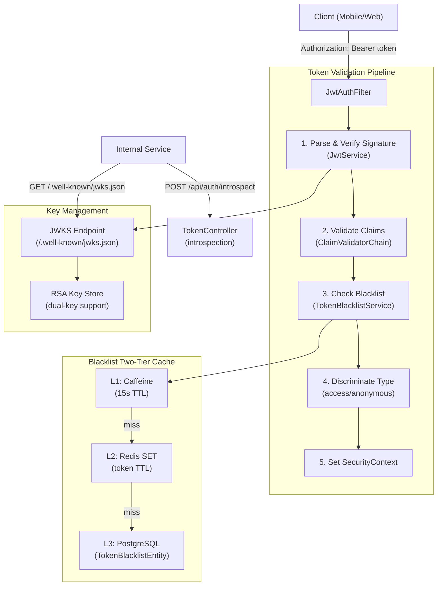
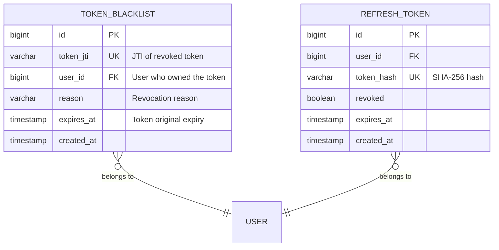
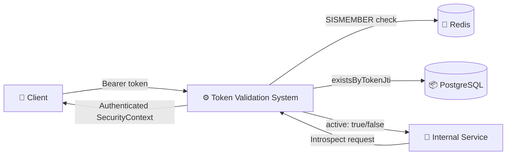
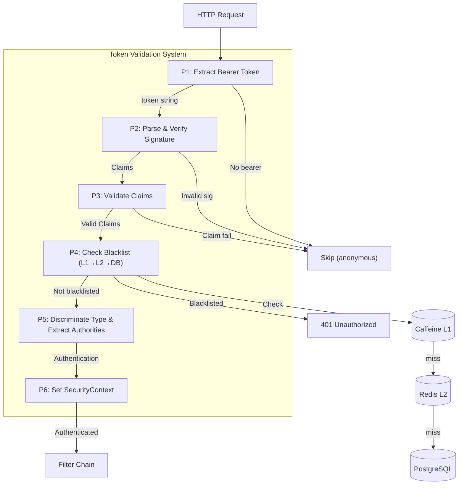
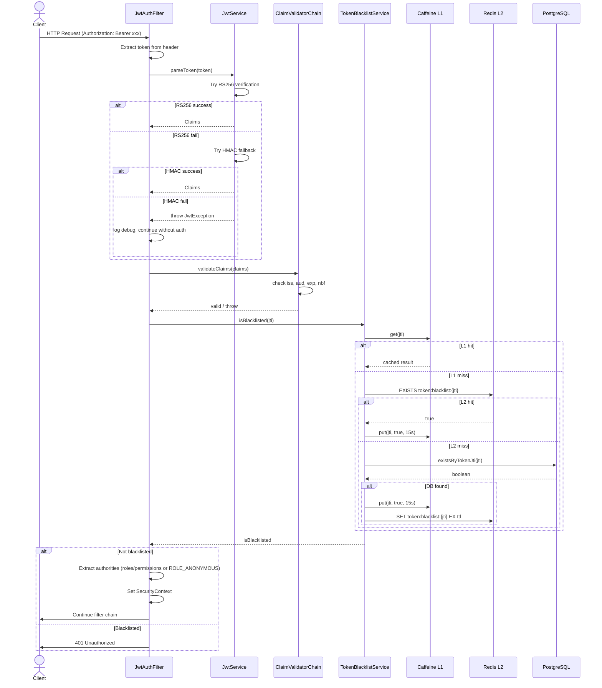
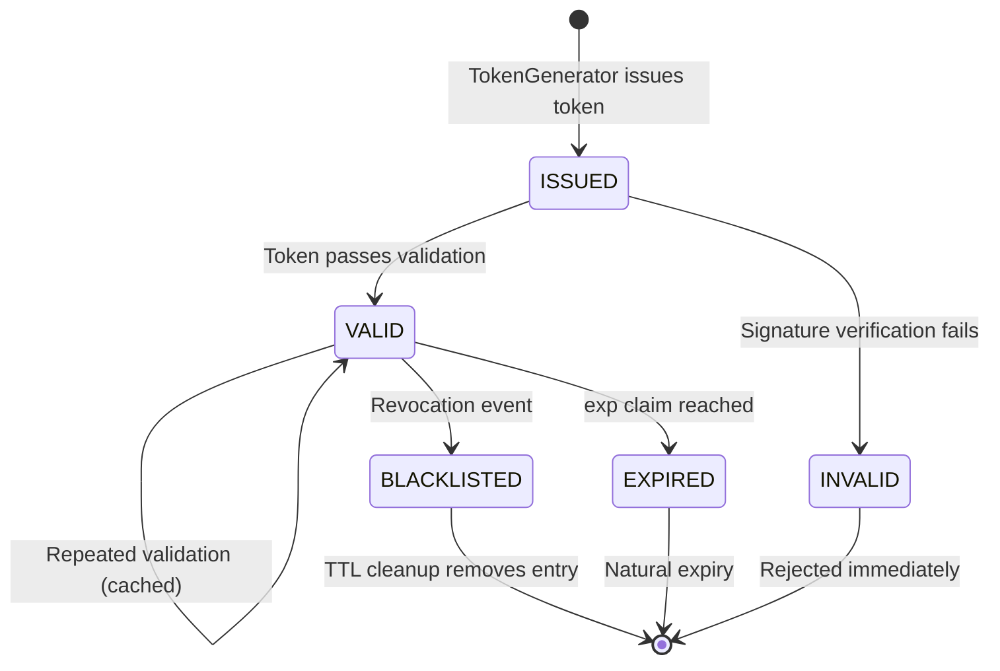
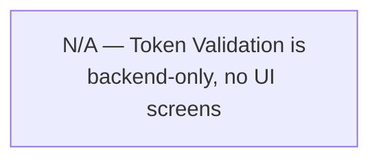

# Đặc tả kỹ thuật: JWT Token Validation

> Technical specification chi tiết — thiết kế để agent có thể đọc và dev code trực tiếp.

---

## 1. Tổng quan hệ thống (System Overview)

### 1.1 Kiến trúc tổng thể



### 1.2 Technology Stack

| Layer | Technology | Version | Ghi chú |
|-------|-----------|---------|---------|
| Language | Kotlin | 1.9+ | JVM target |
| Framework | Spring Boot | 3.x | Spring Security filter chain |
| JWT Library | JJWT (io.jsonwebtoken) | 0.12.x | jjwt-api, jjwt-impl, jjwt-jackson |
| L1 Cache | Caffeine | Latest | In-process, time-bounded |
| L2 Cache | Redis | 7.x | Distributed, TTL-based eviction |
| Database | PostgreSQL | 15+ | Fallback for blacklist |
| Event Store | eventsourcing-utils | 0.0.1-SNAPSHOT | Validation event recording |
| Cache Starter | base-cache-starter | 0.0.1-SNAPSHOT | TwoLevelCacheManager |

### 1.3 Dependencies & Integrations

| Dependency | Type | Purpose | Interface |
|-----------|------|---------|-----------|
| JwtService | Internal | Token parsing and signature verification | Direct method call |
| TokenBlacklistRepository | Internal | DB-backed blacklist (fallback) | JPA Repository |
| Redis (StringRedisTemplate) | Internal | L2 blacklist cache + blacklist SET | Redis SISMEMBER/SADD |
| Caffeine Cache | Internal | L1 blacklist cache | CaffeineCache get/put |
| SecurityProperties | Internal | JWT configuration (keys, TTLs, issuer) | @ConfigurationProperties |
| base-cache-starter | Library | TwoLevelCacheManager base | Bean injection |

---

## 2. Lược đồ dữ liệu (Data Schema)

### 2.1 Entity-Relationship Diagram



### 2.2 Bảng chi tiết Entity

#### Entity: TokenBlacklistEntity (existing)

| Field | Type | Constraint | Default | Mô tả |
|-------|------|-----------|---------|--------|
| `id` | `BIGINT` | PK (Snowflake) | Generated | Primary key |
| `token_jti` | `VARCHAR(255)` | NOT NULL, UNIQUE | - | JWT ID of revoked token |
| `user_id` | `BIGINT` | NOT NULL | - | Owner user ID |
| `reason` | `VARCHAR(255)` | NULLABLE | - | Revocation reason (logout, rotation, admin) |
| `expires_at` | `TIMESTAMP` | NOT NULL | - | Original token expiry (for cleanup) |
| `created_at` | `TIMESTAMP` | NOT NULL | `CURRENT_TIMESTAMP` | When blacklisted |

#### Indexes

| Index Name | Columns | Type | Purpose |
|-----------|---------|------|---------|
| `uk_token_blacklist_jti` | `token_jti` | UNIQUE | Fast JTI lookup |
| `idx_token_blacklist_expires_at` | `expires_at` | BTREE | Cleanup expired entries |
| `idx_token_blacklist_user_id` | `user_id` | BTREE | Find all blacklisted tokens for user |

### 2.3 Redis Data Structures

```
# Blacklist SET — JTI-based, with TTL auto-eviction
# Key: token:blacklist:{jti}
# Value: "1" (existence check only)
# TTL: remaining token lifetime
SET token:blacklist:{jti} "1" EX {remaining_seconds}

# JWKS Cache (optional, for external JWKS consumption)
# Key: jwks:cache
# Value: serialized JWKS JSON
# TTL: 86400 (24 hours)
SET jwks:cache "{jwks_json}" EX 86400
```

---

## 3. Luồng dữ liệu (Data Flow)

### 3.1 Data Flow Diagram — Level 0 (Context)



### 3.2 Data Flow Diagram — Level 1 (chi tiết)



### 3.3 Data Transformation Rules

| # | Input | Process | Output | Validation Rules |
|---|-------|---------|--------|-----------------|
| 1 | Authorization header | Extract after "Bearer " prefix | Token string | Header present and starts with "Bearer " |
| 2 | Token string | JJWT parseSignedClaims (RS256 → HMAC) | Claims object | Valid signature, not malformed |
| 3 | Claims.iss | Compare with configured issuer | Boolean | Must equal SecurityProperties.jwt.issuer |
| 4 | Claims.aud | Check contains service identifier | Boolean | Must contain service name (when configured) |
| 5 | Claims.exp | Compare with current time ± clock skew | Boolean | exp > now - 60s |
| 6 | Claims.id (jti) | Lookup in L1→L2→DB blacklist | Boolean | Must NOT be in blacklist |
| 7 | Claims["type"] | Map to authority set | List<GrantedAuthority> | null→roles+permissions, "anonymous"→ROLE_ANONYMOUS |

---

## 4. Luồng xử lý (Processing Steps)

### 4.1 Sequence Diagram — UC-001: Validate Access Token



### 4.2 Bảng Step xử lý chi tiết

#### UC-001: Validate Access Token

| Step | Component | Action | Input | Output | Error Handling | Ghi chú |
|------|-----------|--------|-------|--------|---------------|---------|
| 1 | JwtAuthFilter | Extract Bearer token from Authorization header | HttpServletRequest | Token string or null | No header → skip filter | OncePerRequestFilter |
| 2 | JwtService | Parse and verify signature (RS256 → HMAC) | Token string | Claims | JwtException → log + skip | Lazy-loaded KeyPair |
| 3 | ClaimValidatorChain | Validate iss claim | Claims.iss | Valid | Mismatch → log + skip | SecurityProperties.jwt.issuer |
| 4 | ClaimValidatorChain | Validate aud claim (if configured) | Claims.aud | Valid | Mismatch → log + skip | Feature-flagged |
| 5 | ClaimValidatorChain | Validate exp with clock skew | Claims.exp | Valid | Expired → TokenExpiredException | 60s skew |
| 6 | TokenBlacklistService | Check JTI in L1→L2→DB | JTI string | Boolean | L1/L2 unavailable → DB fallback | Circuit breaker on Redis |
| 7 | JwtAuthFilter | Discriminate token type | Claims["type"] | Authority list | Unknown type → skip | access/anonymous |
| 8 | JwtAuthFilter | Set SecurityContext | Authentication | SecurityContextHolder | Never fails | Thread-local |

### 4.3 State Machine — Token Lifecycle



| Transition | From | To | Trigger | Guard Condition | Side Effect |
|-----------|------|-----|---------|----------------|------------|
| Issue | [*] | ISSUED | Token generation | User authenticated | TokenIssuedEvent |
| Validate | ISSUED | VALID | Request with Bearer token | Signature + claims valid, not blacklisted | SecurityContext set |
| Expire | VALID | EXPIRED | Time passage | exp < now - clock_skew | None |
| Blacklist | VALID | BLACKLISTED | Logout / rotation / admin revoke | TokenStore.blacklistToken() | TokenRevokedEvent, L1+L2+DB write |
| Cleanup | BLACKLISTED | [*] | Scheduler cleanup | expires_at < now | Delete from DB, auto-evict from Redis |

---

## 5. Luồng màn hình (Screen Flow)

### 5.1 Screen Map (Sitemap)



Token validation is an internal backend concern — no user-facing screens. The relevant API endpoints are:
- `POST /api/auth/introspect` — token introspection
- `GET /.well-known/jwks.json` — JWKS key distribution

### 5.2 Chi tiết từng Screen

| Screen ID | Tên | Mục đích | Data hiển thị | User Actions | Navigation |
|-----------|-----|----------|--------------|-------------|-----------|
| N/A | No UI screens | Backend-only feature | — | — | — |

---

## 6. API Specification

### 6.1 Endpoint List

| # | Method | Path | Description | Auth | Request Body | Response |
|---|--------|------|------------|------|-------------|----------|
| 1 | `POST` | `/api/auth/introspect` | Token introspection (RFC 7662) | JWT (authenticated) | IntrospectionRequest | IntrospectionResponse |
| 2 | `GET` | `/.well-known/jwks.json` | JWKS public keys | None (public) | - | JWKS JSON |

### 6.2 Request/Response chi tiết

#### POST /api/auth/introspect

**Request:**
```json
{
  "token": "string (required, JWT token to introspect)"
}
```

**Response (200 OK — active token):**
```json
{
  "active": true,
  "sub": "12345",
  "username": "john.doe",
  "roles": ["ADMIN", "USER"],
  "permissions": ["user:read", "user:write"],
  "exp": 1735689600,
  "iat": 1735688700,
  "iss": "auth-service",
  "jti": "550e8400-e29b-41d4-a716-446655440000"
}
```

**Response (200 OK — inactive token):**
```json
{
  "active": false
}
```

**Error Response (400 Bad Request):**
```json
{
  "type": "https://api.auth-service.com/errors/validation",
  "title": "Validation Failed",
  "status": 400,
  "detail": "token must not be blank",
  "instance": "/api/auth/introspect",
  "errors": [
    { "field": "token", "message": "must not be blank" }
  ]
}
```

#### GET /.well-known/jwks.json

**Response (200 OK):**
```json
{
  "keys": [
    {
      "kty": "RSA",
      "kid": "auth-service-key-1",
      "alg": "RS256",
      "use": "sig",
      "n": "base64url-encoded-modulus",
      "e": "AQAB"
    }
  ]
}
```

**Headers:**
```
Cache-Control: max-age=86400, public
```

### 6.3 Error Response Format (RFC 7807)

| HTTP Status | Error Type | Khi nào |
|-------------|-----------|---------|
| 400 | Validation Error | IntrospectionRequest.token blank |
| 401 | Unauthorized | Caller not authenticated (introspect endpoint) |
| 500 | Internal Server Error | Redis/DB connectivity failure |

---

## 7. Security Considerations

### 7.1 Authentication Flow

Token validation is the authentication mechanism itself. Key security properties:
- **Signature verification**: RS256 asymmetric (private key never exposed, only public key in JWKS)
- **Algorithm confusion prevention**: Only RS256 and HS256 accepted, explicit allowlist
- **Blacklist enforcement**: Revoked tokens rejected within 30-second window (L1 cache TTL)
- **Type discrimination**: Only access and anonymous tokens accepted by JwtAuthFilter; MFA and refresh tokens rejected
- **Clock skew tolerance**: 60 seconds to handle distributed system time differences

### 7.2 Authorization Matrix

| Role | Introspect (UC-002) | JWKS (UC-004) | Key Rotation (UC-003) |
|------|:---:|:---:|:---:|
| Admin | ✅ | ✅ | ✅ |
| User | ❌ | ✅ (public) | ❌ |
| Service | ✅ | ✅ (public) | ❌ |
| Anonymous | ❌ | ✅ (public) | ❌ |

### 7.3 Data Protection
- **No secrets in JWKS**: Only public key exposed (n, e). Private key never serialized.
- **JTI in blacklist**: Only JTI stored, not full token. No sensitive data in blacklist.
- **Introspection security**: Endpoint requires authentication — prevents token enumeration.
- **HMAC secret**: Only used during migration period. Stored in environment variable, not in code.

---

## 8. Performance Requirements

| Metric | Target | Measurement Method |
|--------|--------|-------------------|
| Token validation total time (P95) | < 2ms | APM monitoring (Micrometer) |
| Blacklist L1 cache lookup | < 0.01ms | Caffeine stats |
| Blacklist L2 Redis lookup | < 0.5ms | Redis latency metrics |
| Blacklist DB fallback | < 5ms | Slow query log |
| Cache hit ratio (L1) | > 60% | Caffeine hit rate metric |
| Cache hit ratio (L1+L2) | > 95% | Combined cache metrics |
| Introspection response time (P95) | < 50ms | APM |
| JWKS endpoint response time (P95) | < 10ms | APM |
| Concurrent validation throughput | > 10,000 req/s | K6 load test |

---

## 9. Agent Implementation Notes

> **Section này dành cho AI agent** — chỉ rõ code cần tạo để agent dev trực tiếp.

### 9.1 Classes to Create

| # | Class | Package | Type | Extends/Implements | Mô tả |
|---|-------|---------|------|-------------------|--------|
| 1 | `TokenBlacklistCacheService` | `auth.application` | @Service | - | Two-tier blacklist check: L1 Caffeine → L2 Redis → DB fallback |
| 2 | `ClaimValidatorChain` | `auth.application.validation` | @Component | - | Chain of claim validators (iss, aud, exp, nbf) |
| 3 | `IssuerClaimValidator` | `auth.application.validation` | @Component | `ClaimValidator` | Validate iss claim |
| 4 | `AudienceClaimValidator` | `auth.application.validation` | @Component | `ClaimValidator` | Validate aud claim (feature-flagged) |
| 5 | `TimestampClaimValidator` | `auth.application.validation` | @Component | `ClaimValidator` | Validate exp/nbf with clock skew |
| 6 | `ClaimValidator` | `auth.application.validation` | Interface | - | Validator contract: validate(Claims): ValidationResult |
| 7 | `JwksKeyManager` | `auth.application` | @Component | - | Multi-key management, kid-based selection, rotation support |

### 9.2 Classes to Modify

| # | Class | Package | Changes |
|---|-------|---------|---------|
| 1 | `JwtAuthFilter` | `shared.security` | Replace direct TokenBlacklistRepository call with TokenBlacklistCacheService. Add ClaimValidatorChain call after parseToken(). |
| 2 | `JwtService` | `auth.application` | Add clock skew configuration (allowedClockSkewSeconds). Add audience validation support. Support multiple key pairs for JWKS rotation. |
| 3 | `TokenController` | `auth.adapter.in.web` | Update introspection response to full RFC 7662 format. Use TokenBlacklistCacheService. |
| 4 | `SecurityProperties` | `shared.config` | Add jwt.clockSkewSeconds (default 60), jwt.audience (optional), jwt.rotationKeys (list for multi-key). |
| 5 | `SecurityConfig` | `shared.config` | No changes needed — JwtAuthFilter already wired. |
| 6 | `TokenStorePersistenceAdapter` | `auth.adapter.out.persistence` | Add Redis write-through on blacklistToken(). |

### 9.3 Pattern References

| Pattern | Reference | Ghi chú |
|---------|----------|---------|
| Two-tier cache | `shared.cache.AbstractTwoTierCache` | Follow existing L1+L2 pattern |
| Handler style | `auth.application.command.*Handler` | CQRS command handler pattern |
| Port/Adapter | `auth.application.port.out.TokenStore` | Hexagonal architecture |
| Error handling | `shared.exception.AuthExceptions` → RFC 7807 | Use existing error codes |
| Event recording | `auth.application.event.TokenEventRecorder` | Follow existing event pattern |
| Configuration | `shared.config.SecurityProperties` | @ConfigurationProperties |

### 9.4 Integration Points

| Integration | Type | Protocol | Endpoint | Data Format |
|------------|------|----------|----------|------------|
| Redis (blacklist) | Sync | Redis SET/GET | `token:blacklist:{jti}` | String "1" |
| Caffeine (L1 cache) | Sync | In-process | Cache name: `token-blacklist` | Boolean |
| TokenBlacklistRepository | Sync | JPA | `existsByTokenJti(jti)` | Boolean |
| TokenEventRecorder | Async | Event Sourcing | Domain events | TokenValidationFailedEvent (new) |

### 9.5 Configuration Properties (New/Modified)

```yaml
app:
  security:
    jwt:
      # Existing
      issuer: "auth-service"
      access-token-expiration-ms: 900000
      refresh-token-expiration-ms: 604800000
      # New
      clock-skew-seconds: 60          # Clock skew tolerance
      audience: "auth-service"         # Optional audience claim
      validate-audience: false         # Feature flag (disabled initially)
    blacklist:
      caffeine-ttl-seconds: 15        # L1 cache TTL
      caffeine-max-size: 10000        # L1 max entries
      redis-enabled: true             # Enable Redis L2
      redis-key-prefix: "token:blacklist:"
```

### 9.6 Test Cases (high-level)

| # | Test | Type | Scenario | Expected |
|---|------|------|----------|----------|
| 1 | Valid RS256 token | Integration | Valid token with all claims | 200, SecurityContext set with roles |
| 2 | Valid HMAC fallback | Integration | Valid HMAC token (migration) | 200, SecurityContext set |
| 3 | Expired token | Unit | Token with exp < now - 60s | Skip authentication, 401 on secured endpoint |
| 4 | Blacklisted token (L1 hit) | Integration | JTI in Caffeine cache | 401 Unauthorized |
| 5 | Blacklisted token (L2 hit) | Integration | JTI in Redis, not L1 | 401, L1 populated |
| 6 | Blacklisted token (DB hit) | Integration | JTI in DB only | 401, L1+L2 populated |
| 7 | Invalid signature | Unit | Tampered token | Skip authentication |
| 8 | Issuer mismatch | Unit | Token with wrong iss | Skip authentication |
| 9 | Audience mismatch | Unit | Token with wrong aud (when enabled) | Skip authentication |
| 10 | Anonymous token | Integration | Token with type=anonymous | SecurityContext with ROLE_ANONYMOUS |
| 11 | MFA token rejected | Unit | Token with type=mfa in filter | Skip authentication |
| 12 | Introspect valid token | Integration | POST /api/auth/introspect | 200, active=true + claims |
| 13 | Introspect blacklisted | Integration | Introspect revoked token | 200, active=false |
| 14 | Introspect expired | Integration | Introspect expired token | 200, active=false |
| 15 | JWKS endpoint | Integration | GET /.well-known/jwks.json | 200, keys array with kty/kid/n/e |
| 16 | Clock skew tolerance | Unit | Token exp = now - 30s (within skew) | Token accepted |
| 17 | Redis unavailable fallback | Integration | Redis down, JTI in DB | DB fallback, token validated |
| 18 | No Authorization header | Integration | Request without Bearer | Skip filter, anonymous access |
| 19 | Concurrent validation | Load | 10K concurrent requests | All pass within 2ms P95 |

---

> **Traceability**: Research Brief → Business Analysis → **Technical Spec** → Implementation
> **Ready for**: `/wf_pre_openspec` hoặc `/wf_openspec` hoặc direct coding
