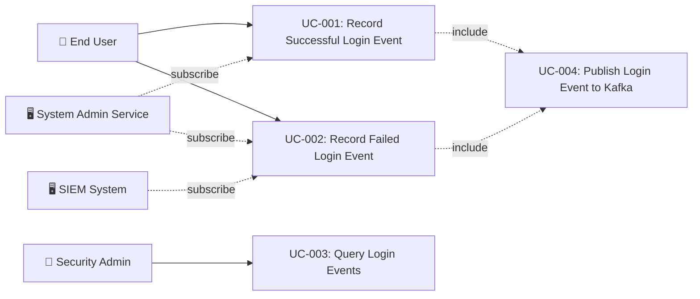

# Tài liệu phân tích nghiệp vụ: User Login Event

> Phân tích nghiệp vụ chi tiết — chia nhỏ theo use case, đặc tả ngữ nghĩa từng chức năng.

---

## 1. Tổng quan (Overview)

### 1.1 Bối cảnh nghiệp vụ (Business Context)

Hệ thống auth-service hiện tại xử lý đăng nhập qua `LoginHandler` (CQRS CommandHandler) nhưng **không ghi nhận sự kiện đăng nhập dưới dạng domain event** vào event store. Điều này tạo ra khoảng trống trong audit trail — trong khi `UserRegisteredEvent` được lưu đầy đủ (event store + outbox → Kafka), login event chỉ được ghi vào `login_sessions` table và publish in-process qua `SpringEventPublisher` (không persist, không Kafka).

Tính năng này đóng khoảng trống bằng cách:
1. Tạo `UserLoggedInEvent` enriched với đầy đủ context (device, IP, MFA status, session info)
2. Tạo `UserLoginFailedEvent` cho các lần đăng nhập thất bại (security monitoring)
3. Tích hợp với `EventService.record()` để persist vào event store + transactional outbox
4. Relay qua `OutboxPoller` → Kafka topics cho downstream consumers

### 1.2 Mục tiêu (Objectives)

| # | Mục tiêu | KPI đo lường | Độ ưu tiên |
|---|---------|-------------|-----------|
| O-01 | Audit trail hoàn chỉnh cho login events | 100% login attempts recorded in event store | High |
| O-02 | Downstream consumer support via Kafka | Login events available on Kafka topics within 5s of occurrence | High |
| O-03 | Security monitoring qua failed login events | All failed login attempts emitted as UserLoginFailedEvent | High |
| O-04 | Enriched event payload for analytics | Event payload contains ≥ 12 context fields (IP, device, MFA, geo, etc.) | Medium |
| O-05 | Consistent event pattern across auth domain | UserLoggedInEvent follows same pattern as UserRegisteredEvent | Medium |

### 1.3 Phạm vi (Scope)

| In Scope | Out of Scope |
|----------|-------------|
| UserLoggedInEvent domain event class | Real-time anomaly detection logic |
| UserLoginFailedEvent domain event class | Geo-IP resolution service implementation |
| EventService.record() integration in LoginHandler | LoginHandler authentication logic changes |
| Kafka topics iam.user.logged_in, iam.user.login_failed | Kafka consumer implementations |
| LoginCommand enrichment with correlationId | Controller/API endpoint changes |
| Event schema versioning | Event upcaster infrastructure |
| Unit/integration tests for event recording | Full E2E tests |

### 1.4 Stakeholders & Actors

| Actor | Loại | Mô tả | Tương tác chính |
|-------|------|--------|----------------|
| End User | Primary | Người dùng thực hiện đăng nhập | Trigger LoginCommand → UserLoggedInEvent |
| Security Admin | Secondary | Quản trị viên giám sát bảo mật | Xem audit trail, theo dõi failed login events |
| System Admin Service | External System | Downstream service consuming audit events | Subscribe Kafka topic iam.user.logged_in |
| SIEM System | External System | Security Information and Event Management | Subscribe Kafka topics for security analytics |
| Analytics Service | External System | Business analytics/BI platform | Subscribe Kafka topics for login analytics |

---

## 2. Use Case Diagram (tổng quan)



---

## 3. Danh sách Use Case (Use Case Index)

| UC-ID | Tên Use Case | Actor | Nhóm chức năng | Độ ưu tiên | Trạng thái |
|-------|-------------|-------|----------------|-----------|-----------|
| UC-001 | Record Successful Login Event | End User (indirect) | Event Recording | High | Draft |
| UC-002 | Record Failed Login Event | End User (indirect) | Event Recording | High | Draft |
| UC-003 | Query Login Events from Event Store | Security Admin | Event Query | Medium | Draft |
| UC-004 | Publish Login Event to Kafka | System (OutboxPoller) | Event Publishing | High | Draft |

---

## 4. Đặc tả Use Case chi tiết

### UC-001: Record Successful Login Event

#### 4.1 Thông tin chung

| Mục | Nội dung |
|-----|----------|
| **Mã** | UC-001 |
| **Tên** | Record Successful Login Event |
| **Mô tả ngữ nghĩa** | Khi người dùng đăng nhập thành công, hệ thống ghi nhận sự kiện dưới dạng domain event enriched vào event store và transactional outbox. Điều này đảm bảo audit trail hoàn chỉnh và cho phép downstream services (audit, analytics, SIEM) react to login events qua Kafka. |
| **Actor** | End User (indirect — triggered by LoginHandler) |
| **Trigger** | Successful authentication in LoginHandler.handle() |
| **Độ ưu tiên** | High |
| **Tần suất** | On-demand — every successful login (potentially 100-1000s/day depending on user base) |
| **Nhóm chức năng** | Event Recording |

#### 4.2 Điều kiện

| Loại | Mô tả |
|------|--------|
| **Pre-conditions** | User exists, password validated, MFA passed (if required), account not locked |
| **Post-conditions (Success)** | UserLoggedInEvent persisted in event_store table; Outbox entry created with status PENDING; LoginResult returned to caller |
| **Post-conditions (Failure)** | Event recording failure logged as warning; Login still succeeds (event recording is best-effort within TX) |
| **Invariants** | Event store remains append-only; Event payload is immutable after creation |

#### 4.3 Luồng chính (Basic Flow)

| Step | Actor Action | System Response | Data | Ghi chú |
|------|-------------|----------------|------|---------|
| 1 | User submits login credentials | LoginHandler validates credentials successfully | LoginCommand | Steps 1-6 are existing LoginHandler flow |
| 2 | — | System passes MFA checkpoint (if applicable) | MFA status | Existing flow |
| 3 | — | System generates auth tokens | AuthToken | Existing flow — token generation |
| 4 | — | System records login session | LoginSessionEntity | Existing flow — LoginSessionService.recordLogin() |
| 5 | — | System creates UserLoggedInEvent with enriched payload | UserLoggedInEvent | **NEW** — event creation with full context |
| 6 | — | System calls EventService.record() within same @Transactional | event_store row + event_outbox row | **NEW** — transactional persist |
| 7 | — | System returns LoginResult.Success | LoginResult | Existing flow — response to controller |

#### 4.4 Luồng thay thế (Alternative Flows)

##### AF-001: MFA Pending Login
- **Trigger**: Tại Step 2 khi user requires MFA verification
- **Steps**:
  1. System returns LoginResult with MFA challenge (mfaRequired=true)
  2. NO UserLoggedInEvent emitted (login not yet complete)
  3. Event will be emitted after MFA verification succeeds (separate MFA verification handler)
- **Rejoin**: Flow ends — UserLoggedInEvent emitted by MFA verification flow

##### AF-002: Anonymous Session Promotion
- **Trigger**: Tại Step 4 khi LoginCommand contains anonymousSessionId
- **Steps**:
  1. System promotes anonymous session to authenticated
  2. UserLoggedInEvent includes promotionResult context
  3. Continue to Step 5 with promotion metadata in event
- **Rejoin**: Quay lại Step 5 của Basic Flow

#### 4.5 Luồng ngoại lệ (Exception Flows)

##### EF-001: EventService.record() Failure
- **Trigger**: Tại Step 6 khi event_store or outbox INSERT fails
- **Error**: `EventStorePersistException` — AUTH_050
- **Handling**:
  1. Transaction rolls back (login + event recording are in same TX)
  2. Login fails with 500 Internal Server Error
  3. Log error with full context for debugging
- **Post-condition**: No login session created, no event recorded, user must retry

##### EF-002: Event Payload Serialization Failure
- **Trigger**: Tại Step 5 khi ObjectMapper fails to serialize event
- **Error**: `JsonProcessingException`
- **Handling**:
  1. Log error with event details
  2. Transaction rolls back
  3. Return 500 Internal Server Error
- **Post-condition**: No login, no event — consistent state

#### 4.6 Quy tắc nghiệp vụ (Business Rules)

| BR-ID | Quy tắc | Mô tả chi tiết | Validation |
|-------|---------|----------------|-----------|
| BR-001 | Event must be recorded in same TX | UserLoggedInEvent must be persisted in same @Transactional boundary as login session to ensure consistency | EventService.record() called within LoginHandler.handle() @Transactional |
| BR-002 | Event payload must be self-contained | Event must contain all necessary context without requiring joins to other tables | Event class includes userId, username, domainCode, ipAddress, deviceFingerprint, userAgent, mfaMethod, loginSource |
| BR-003 | Event type follows naming convention | Event type must follow `iam.user.logged_in` pattern (domain.aggregate.action) | DomainEvent.eventType validated |
| BR-004 | Partition key is userId | Kafka partition key must be userId.toString() to ensure per-user ordering | EventService.record() partitionKey parameter |
| BR-005 | Event must include correlation ID | Every login event must carry a correlation ID for distributed tracing | UUID generated if not provided |

#### 4.7 Yêu cầu phi chức năng (cho UC này)

| Loại | Yêu cầu | Target |
|------|---------|--------|
| Performance | Event recording overhead | < 5ms additional latency per login |
| Reliability | Event store + outbox consistency | Same TX — atomic success/failure |
| Throughput | Concurrent login event recording | ≥ 100 concurrent logins without contention |
| Storage | Event store growth | ~1KB per event, partitioned by created_at |

#### 4.8 Mockup / Wireframe Description

```
N/A — This is a backend event recording feature with no user-facing UI.
The event is recorded transparently during the existing login flow.

Downstream consumers (audit dashboard, SIEM) will visualize the events,
but those UIs are out of scope for this feature.
```

---

### UC-002: Record Failed Login Event

#### 4.1 Thông tin chung

| Mục | Nội dung |
|-----|----------|
| **Mã** | UC-002 |
| **Tên** | Record Failed Login Event |
| **Mô tả ngữ nghĩa** | Khi đăng nhập thất bại (sai mật khẩu, tài khoản bị khóa, CAPTCHA fail), hệ thống ghi nhận sự kiện thất bại vào event store. Điều này cung cấp dữ liệu cho security monitoring, anomaly detection, và compliance audit trail. Failed login events thường QUAN TRỌNG HƠN success events cho bảo mật. |
| **Actor** | End User (indirect — triggered by LoginHandler exception paths) |
| **Trigger** | Authentication failure in LoginHandler.handle() |
| **Độ ưu tiên** | High |
| **Tần suất** | On-demand — every failed login attempt |
| **Nhóm chức năng** | Event Recording |

#### 4.2 Điều kiện

| Loại | Mô tả |
|------|--------|
| **Pre-conditions** | Login attempt initiated with username + password |
| **Post-conditions (Success)** | UserLoginFailedEvent persisted in event_store; Outbox entry created; Exception thrown to caller |
| **Post-conditions (Failure)** | If event recording fails, login failure still propagates (event is best-effort) |
| **Invariants** | Failed events never contain password/credential data (security) |

#### 4.3 Luồng chính (Basic Flow)

| Step | Actor Action | System Response | Data | Ghi chú |
|------|-------------|----------------|------|---------|
| 1 | User submits incorrect credentials | LoginHandler detects authentication failure | LoginCommand | InvalidCredentialsException path |
| 2 | — | System creates UserLoginFailedEvent with failure context | UserLoginFailedEvent | Event includes failureReason, IP, device |
| 3 | — | System calls EventService.record() | event_store + event_outbox | Recorded before throwing exception |
| 4 | — | System throws authentication exception | InvalidCredentialsException | Original exception flow continues |

#### 4.4 Luồng thay thế (Alternative Flows)

##### AF-001: Account Locked Failure
- **Trigger**: Account is locked due to previous failed attempts
- **Steps**:
  1. UserLoginFailedEvent created with failureReason = `ACCOUNT_LOCKED`
  2. Event includes lockUntil timestamp
- **Rejoin**: Step 3 (record event)

##### AF-002: CAPTCHA Required/Failed
- **Trigger**: CAPTCHA verification required or failed
- **Steps**:
  1. UserLoginFailedEvent created with failureReason = `CAPTCHA_REQUIRED` or `CAPTCHA_FAILED`
- **Rejoin**: Step 3 (record event)

##### AF-003: User Not Found
- **Trigger**: Username does not exist
- **Steps**:
  1. UserLoginFailedEvent created with failureReason = `USER_NOT_FOUND`
  2. Event includes username but NO userId (user doesn't exist)
  3. aggregateId = 0 (system-level event)
- **Rejoin**: Step 3 (record event)

#### 4.5 Luồng ngoại lệ (Exception Flows)

##### EF-001: Event Recording Failure (non-blocking)
- **Trigger**: Tại Step 3 khi EventService.record() fails
- **Error**: Database error during event persist
- **Handling**:
  1. Log warning — failed login event recording should NOT block the authentication failure response
  2. Original authentication exception still thrown
  3. ⚠️ Assumption: For failed login events, recording failure is logged but does NOT prevent the auth error response
- **Post-condition**: Login failure response still returned; event lost (accepted trade-off for availability)

#### 4.6 Quy tắc nghiệp vụ (Business Rules)

| BR-ID | Quy tắc | Mô tả chi tiết | Validation |
|-------|---------|----------------|-----------|
| BR-006 | No credentials in event | UserLoginFailedEvent must NEVER contain password, passwordHash, or any credential data | Code review, no password field in event class |
| BR-007 | Failure reason categorized | failureReason must use standardized enum: INVALID_CREDENTIALS, ACCOUNT_LOCKED, CAPTCHA_REQUIRED, CAPTCHA_FAILED, USER_NOT_FOUND, MFA_FAILED, RATE_LIMITED | Enum validation |
| BR-008 | Failed events use separate topic | Topic `iam.user.login_failed` is separate from success topic for independent consumer scaling | Separate topic parameter |
| BR-009 | Recording is best-effort | Failed login event recording should not prevent auth failure response | Try-catch with logging |

#### 4.7 Yêu cầu phi chức năng (cho UC này)

| Loại | Yêu cầu | Target |
|------|---------|--------|
| Security | No credential leakage | Event payload reviewed for PII compliance |
| Performance | Non-blocking recording | < 3ms overhead, async-safe |
| Compliance | Audit completeness | ≥ 99% failed attempts captured |

#### 4.8 Mockup / Wireframe Description

```
N/A — Backend event recording feature.
Security dashboard consumers will visualize failed login patterns.
```

---

### UC-003: Query Login Events from Event Store

#### 4.1 Thông tin chung

| Mục | Nội dung |
|-----|----------|
| **Mã** | UC-003 |
| **Tên** | Query Login Events from Event Store |
| **Mô tả ngữ nghĩa** | Security admin queries the event store to retrieve login history for a specific user or time range. This enables audit trail review, incident investigation, and compliance reporting. |
| **Actor** | Security Admin |
| **Trigger** | Admin requests login event history via API or dashboard |
| **Độ ưu tiên** | Medium |
| **Tần suất** | On-demand — during security reviews or incident investigations |
| **Nhóm chức năng** | Event Query |

#### 4.2 Điều kiện

| Loại | Mô tả |
|------|--------|
| **Pre-conditions** | Admin authenticated with appropriate role (ROLE_ADMIN or ROLE_SECURITY_ADMIN) |
| **Post-conditions (Success)** | List of login events returned, sorted by timestamp descending |
| **Post-conditions (Failure)** | Error response with appropriate status code |
| **Invariants** | Event store data is read-only — queries never modify events |

#### 4.3 Luồng chính (Basic Flow)

| Step | Actor Action | System Response | Data | Ghi chú |
|------|-------------|----------------|------|---------|
| 1 | Admin requests login events for userId/dateRange | System queries event_store table | Query params: aggregateType=User, eventType=iam.user.logged_in | EventStorePort.findByAggregate() |
| 2 | — | System deserializes EventEnvelope payloads | List<EventEnvelope<UserLoggedInEvent>> | JSON → object mapping |
| 3 | — | System returns paginated results | Page<LoginEventResponse> | Response DTO with event metadata |

#### 4.4 Luồng thay thế (Alternative Flows)

##### AF-001: Query by Event Type (all users)
- **Trigger**: Admin queries all login events (no userId filter)
- **Steps**:
  1. System queries event_store WHERE event_type = 'iam.user.logged_in'
  2. Results paginated by created_at DESC
- **Rejoin**: Step 3

#### 4.5 Luồng ngoại lệ (Exception Flows)

##### EF-001: Unauthorized Access
- **Trigger**: Non-admin user attempts to query login events
- **Error**: 403 Forbidden
- **Handling**: Return error response
- **Post-condition**: No data exposed

#### 4.6 Quy tắc nghiệp vụ (Business Rules)

| BR-ID | Quy tắc | Mô tả chi tiết | Validation |
|-------|---------|----------------|-----------|
| BR-010 | Admin-only access | Login event queries require ROLE_ADMIN or ROLE_SECURITY_ADMIN | @PreAuthorize |
| BR-011 | Paginated results | Max page size = 100, default = 20 | PageRequest validation |

#### 4.7 Yêu cầu phi chức năng (cho UC này)

| Loại | Yêu cầu | Target |
|------|---------|--------|
| Performance | Query response time | < 500ms for paginated results |
| Security | Access control | Admin roles only |

#### 4.8 Mockup / Wireframe Description

```
N/A — API-level feature. Dashboard UI is out of scope.
API returns JSON paginated list of login events.
```

---

### UC-004: Publish Login Event to Kafka

#### 4.1 Thông tin chung

| Mục | Nội dung |
|-----|----------|
| **Mã** | UC-004 |
| **Tên** | Publish Login Event to Kafka |
| **Mô tả ngữ nghĩa** | OutboxPoller (existing infrastructure) picks up pending login event entries from event_outbox table and publishes to Kafka topics. This enables downstream services to react to login events asynchronously. |
| **Actor** | System (OutboxPoller — scheduled task) |
| **Trigger** | OutboxPoller scheduled execution (existing @Scheduled polling) |
| **Độ ưu tiên** | High |
| **Tần suất** | Every polling interval (configurable, default 5s) |
| **Nhóm chức năng** | Event Publishing |

#### 4.2 Điều kiện

| Loại | Mô tả |
|------|--------|
| **Pre-conditions** | event_outbox has entries with status=PENDING for login events |
| **Post-conditions (Success)** | Outbox entry status = PUBLISHED, publishedAt set, Kafka message delivered |
| **Post-conditions (Failure)** | Outbox entry retry_count incremented; DLT after max retries |
| **Invariants** | At-least-once delivery guarantee |

#### 4.3 Luồng chính (Basic Flow)

| Step | Actor Action | System Response | Data | Ghi chú |
|------|-------------|----------------|------|---------|
| 1 | OutboxPoller polls for PENDING entries | SELECT ... FOR UPDATE SKIP LOCKED | OutboxEntity | Existing OutboxPoller flow |
| 2 | — | Publish payload to Kafka topic | kafkaTemplate.send(topic, partitionKey, payload) | topic = iam.user.logged_in |
| 3 | — | Mark outbox entry as PUBLISHED | UPDATE status = PUBLISHED, published_at = NOW() | Existing flow |

#### 4.4 Luồng thay thế (Alternative Flows)

N/A — OutboxPoller handles all event types uniformly. No login-specific alternative flows.

#### 4.5 Luồng ngoại lệ (Exception Flows)

##### EF-001: Kafka Timeout
- **Trigger**: Kafka send times out
- **Error**: TimeoutException
- **Handling**: Entry remains PENDING, retried next cycle (FR-021 — existing behavior)
- **Post-condition**: Entry not marked failed, will be retried

#### 4.6 Quy tắc nghiệp vụ (Business Rules)

| BR-ID | Quy tắc | Mô tả chi tiết | Validation |
|-------|---------|----------------|-----------|
| BR-012 | At-least-once delivery | Outbox ensures at-least-once delivery to Kafka | OutboxPoller retry logic |
| BR-013 | Consumer-side idempotency | Downstream consumers must handle duplicate events via processed_events table | Consumer responsibility |

#### 4.7 Yêu cầu phi chức năng (cho UC này)

| Loại | Yêu cầu | Target |
|------|---------|--------|
| Latency | Event-to-Kafka delivery | < 5s (polling interval) |
| Reliability | Delivery guarantee | At-least-once |

#### 4.8 Mockup / Wireframe Description

```
N/A — Infrastructure component, no UI.
```

---

## 5. Ma trận truy xuất (Traceability Matrix)

| UC-ID | FR-ID | NFR-ID | BR-ID | Screen | API Endpoint | DB Entity |
|-------|-------|--------|-------|--------|-------------|-----------|
| UC-001 | FR-001, FR-002, FR-003 | NFR-001, NFR-002 | BR-001, BR-002, BR-003, BR-004, BR-005 | N/A | POST /api/auth/login | event_store, event_outbox |
| UC-002 | FR-004, FR-005 | NFR-003, NFR-004 | BR-006, BR-007, BR-008, BR-009 | N/A | POST /api/auth/login | event_store, event_outbox |
| UC-003 | FR-006 | NFR-005 | BR-010, BR-011 | N/A | GET /api/admin/events/login | event_store |
| UC-004 | FR-007 | NFR-006 | BR-012, BR-013 | N/A | N/A (scheduled) | event_outbox |

---

## 6. Yêu cầu chức năng tổng hợp (Functional Requirements)

| FR-ID | Tên | Mô tả | UC liên quan | Độ ưu tiên |
|-------|-----|--------|-------------|-----------|
| FR-001 | UserLoggedInEvent creation | System must create enriched UserLoggedInEvent with ≥ 12 context fields after successful login | UC-001 | High |
| FR-002 | Event store persistence | System must persist UserLoggedInEvent to event_store table via EventService.record() | UC-001 | High |
| FR-003 | Outbox entry creation | System must insert outbox entry for Kafka relay in same transaction as event store | UC-001 | High |
| FR-004 | UserLoginFailedEvent creation | System must create UserLoginFailedEvent with failure reason for every failed login attempt | UC-002 | High |
| FR-005 | Failed event best-effort recording | Failed login event recording must not prevent authentication error response | UC-002 | High |
| FR-006 | Login event query API | System must provide admin API to query login events from event store | UC-003 | Medium |
| FR-007 | Kafka publishing via OutboxPoller | Login events must be published to Kafka topics via existing OutboxPoller infrastructure | UC-004 | High |

---

## 7. Yêu cầu phi chức năng tổng hợp (Non-Functional Requirements)

| NFR-ID | Loại | Yêu cầu | Target | Measurement |
|--------|------|---------|--------|-------------|
| NFR-001 | Performance | Event recording overhead | < 5ms per login | APM timing |
| NFR-002 | Reliability | Transactional consistency | event_store + outbox in same TX | Integration test |
| NFR-003 | Security | No credential data in events | Zero password/hash fields | Code review |
| NFR-004 | Compliance | Failed login audit completeness | ≥ 99% capture rate | Event count vs login attempt count |
| NFR-005 | Performance | Event query response time | < 500ms P95 | APM monitoring |
| NFR-006 | Reliability | Kafka delivery latency | < 5s event-to-topic | Outbox polling interval |

---

## 8. Thuật ngữ nghiệp vụ (Glossary)

| Thuật ngữ | Định nghĩa | Context sử dụng |
|-----------|-----------|-----------------|
| UserLoggedInEvent | Domain event representing a successful user authentication — immutable fact in event store | UC-001, event payload |
| UserLoginFailedEvent | Domain event representing a failed authentication attempt — used for security monitoring | UC-002, security audit |
| EventService | Application service that wraps event store persist + outbox insert in caller's @Transactional boundary | UC-001, UC-002 |
| Event Store | Append-only PostgreSQL table (event_store) storing domain events as JSONB | UC-001, UC-002, UC-003 |
| Transactional Outbox | Pattern ensuring event persistence and async publishing share the same database transaction | UC-001, UC-004 |
| OutboxPoller | Scheduled component that relays pending outbox entries to Kafka | UC-004 |
| Correlation ID | UUID linking related events across asynchronous flow for distributed tracing | All UCs |
| Login Source | Classification of login origin: DIRECT, SSO, ANONYMOUS_PROMOTION, MFA_COMPLETED | UC-001 event payload |

---

## 9. Phụ lục (Appendix)

### 9.1 Research References
- [opensource_findings.md](./opensource_findings.md)
- [web_research.md](./web_research.md)
- [comparison_analysis.md](./comparison_analysis.md)

### 9.2 Open Questions
- [ ] OQ-001: Should geo-IP resolution happen inline during event creation or as async enrichment downstream?
- [ ] OQ-002: Should MFA verification success emit a separate event or be captured as loginSource=MFA_COMPLETED in UserLoggedInEvent?

### 9.3 Assumptions
- ⚠️ AS-001: LoginCommand already carries ipAddress, userAgent, deviceFingerprint from controller layer — Lý do: AuthController extracts these from HttpServletRequest and passes to LoginCommand
- ⚠️ AS-002: EventService.record() performance is adequate for login frequency — Lý do: Already proven for registration events; login frequency is similar order of magnitude
- ⚠️ AS-003: Failed login event recording uses try-catch (best-effort) rather than same TX — Lý do: Failed login path may not have a clean @Transactional context since exception is thrown

---

> **Next step**: Technical Specification (technical_spec.md)
> **Traceability**: Research Brief → Business Analysis → Technical Spec
