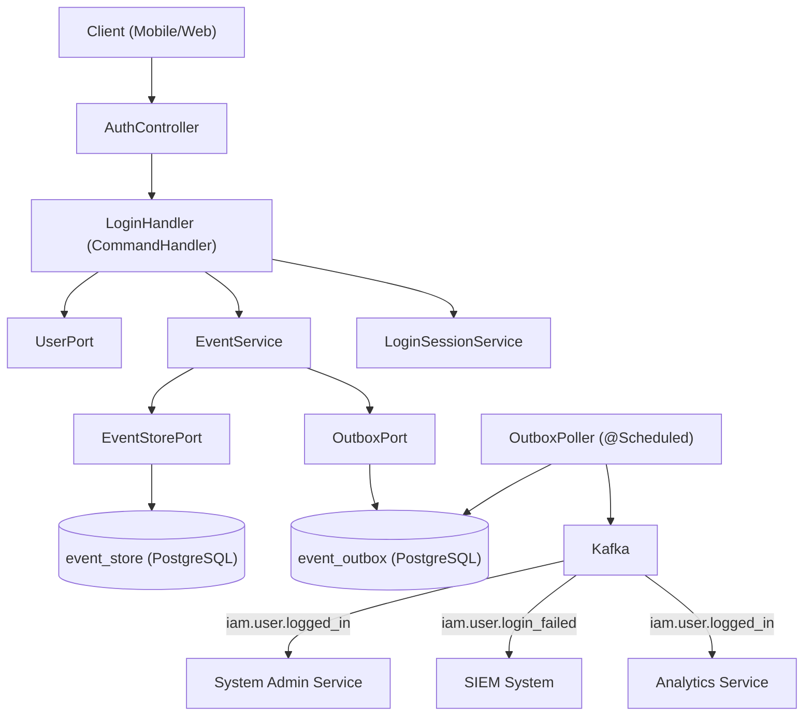
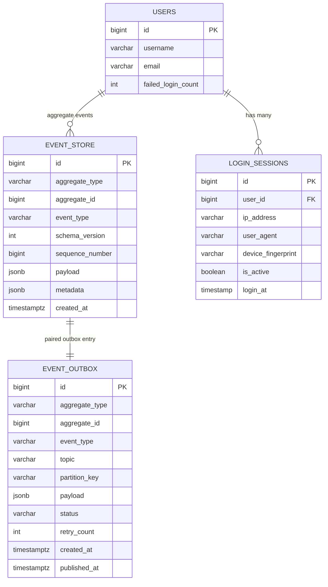
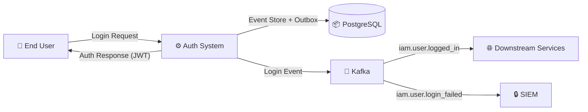
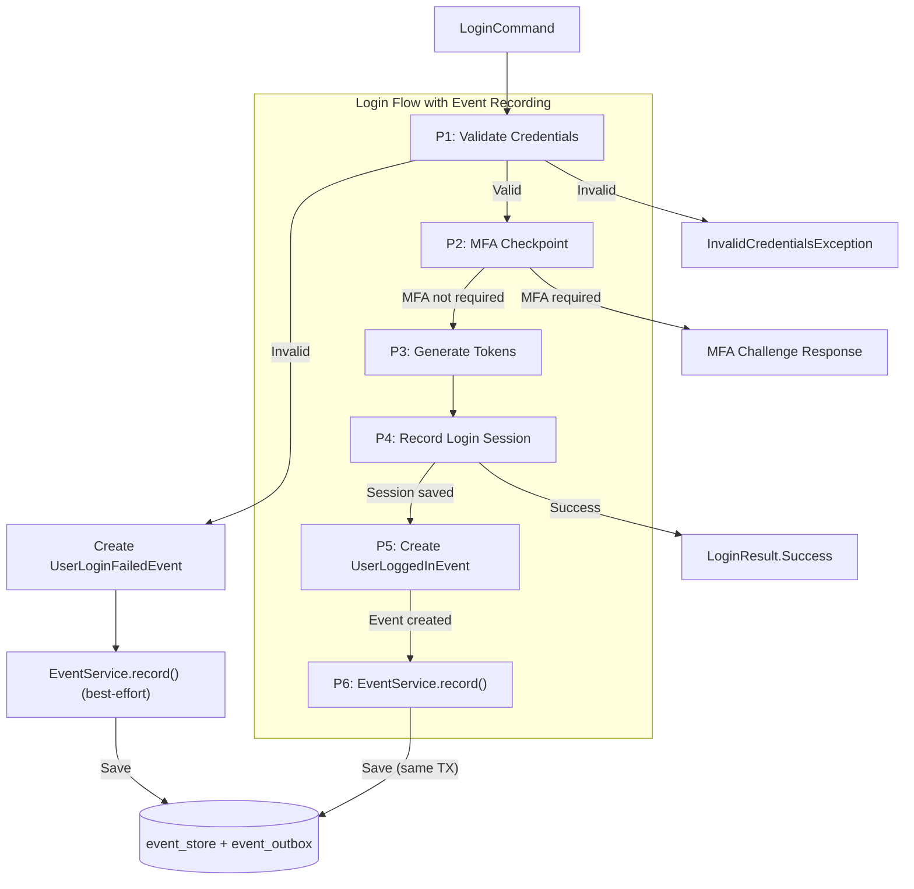
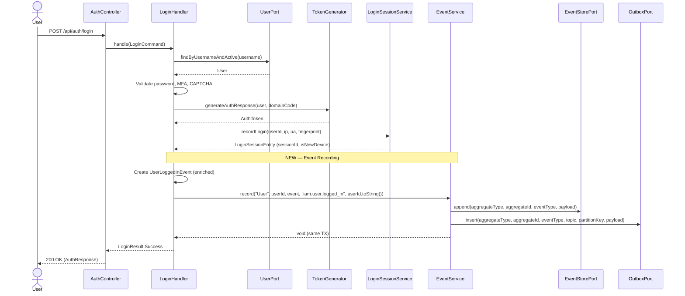
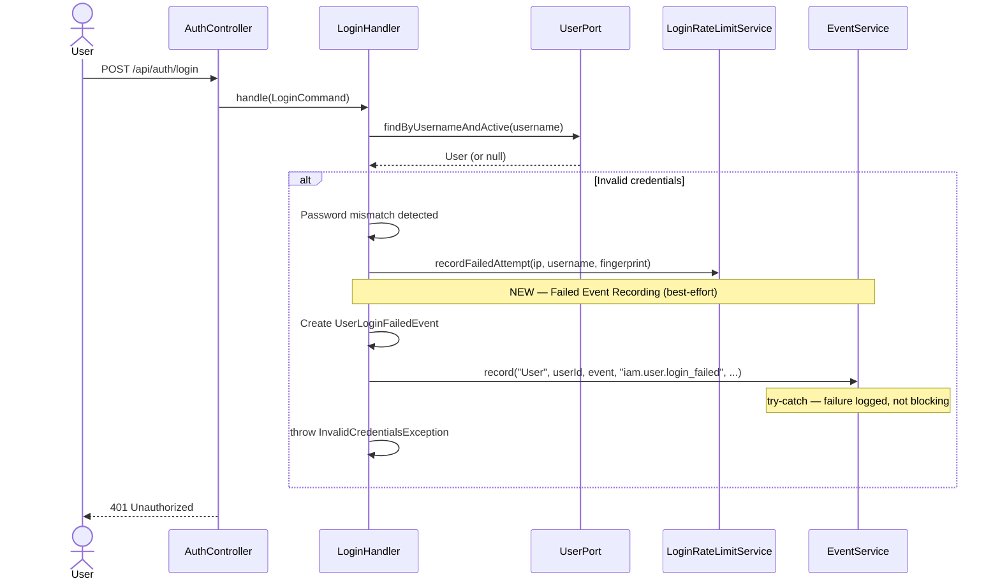

# Đặc tả kỹ thuật: User Login Event

> Technical specification chi tiết — thiết kế để agent có thể đọc và dev code trực tiếp.

---

## 1. Tổng quan hệ thống (System Overview)

### 1.1 Kiến trúc tổng thể



### 1.2 Technology Stack

| Layer | Technology | Version | Ghi chú |
|-------|-----------|---------|---------|
| Language | Kotlin | 1.9+ | JVM 21 |
| Framework | Spring Boot | 3.x | With spring-boot-starter-web |
| Database | PostgreSQL | 15+ | Flyway managed migrations |
| Cache | Redis + Caffeine | Latest | Two-tier caching |
| Message Queue | Kafka | 3.x | Via spring-kafka |
| ES Library | eventsourcing-utils | 0.0.1-SNAPSHOT | Custom CQRS Command/Query |
| Serialization | Jackson | 2.x | ObjectMapper for JSON |

### 1.3 Dependencies & Integrations

| Dependency | Type | Purpose | Interface |
|-----------|------|---------|-----------|
| EventService | Internal | Event recording (event store + outbox) | Direct method call |
| EventStorePort | Internal | Append-only event persistence | Port interface |
| OutboxPort | Internal | Transactional outbox entry | Port interface |
| OutboxPoller | Internal | Async Kafka relay | @Scheduled polling |
| LoginSessionService | Internal | Login session recording | Direct method call |
| LoginRateLimitService | Internal | Failed attempt tracking | Direct method call |
| Kafka (iam.user.logged_in) | External | Downstream event consumers | Kafka topic |
| Kafka (iam.user.login_failed) | External | Security monitoring consumers | Kafka topic |

---

## 2. Lược đồ dữ liệu (Data Schema)

### 2.1 Entity-Relationship Diagram



### 2.2 Bảng chi tiết Entity

No new tables required. `UserLoggedInEvent` and `UserLoginFailedEvent` are stored in the existing `event_store` table as JSONB payload within `EventEnvelope`. The `event_outbox` table handles async Kafka relay.

#### Event Payload: UserLoggedInEvent (stored in event_store.payload as JSONB)

| Field | Type | Constraint | Default | Mô tả |
|-------|------|-----------|---------|--------|
| `userId` | `Long` | NOT NULL | - | User ID who logged in |
| `username` | `String` | NOT NULL | - | Username for audit readability |
| `email` | `String` | NOT NULL | - | User email |
| `domainCode` | `String` | NOT NULL | - | Active domain code |
| `domainId` | `Long?` | NULLABLE | null | Domain ID (if resolved) |
| `ipAddress` | `String` | NOT NULL | "unknown" | Client IP address |
| `userAgent` | `String?` | NULLABLE | null | HTTP User-Agent header |
| `deviceFingerprint` | `String?` | NULLABLE | null | SHA-256 device fingerprint |
| `deviceType` | `String?` | NULLABLE | null | DESKTOP/MOBILE/TABLET |
| `browserName` | `String?` | NULLABLE | null | Parsed browser name |
| `osName` | `String?` | NULLABLE | null | Parsed OS name |
| `mfaMethod` | `String` | NOT NULL | "NONE" | MFA method used (NONE/TOTP/SMS) |
| `mfaBypassed` | `Boolean` | NOT NULL | false | True if trusted device bypassed MFA |
| `loginSource` | `String` | NOT NULL | "DIRECT" | DIRECT/SSO/ANONYMOUS_PROMOTION/MFA_COMPLETED |
| `sessionPromoted` | `Boolean` | NOT NULL | false | True if anonymous session was promoted |
| `isNewDevice` | `Boolean` | NOT NULL | false | True if device not seen before |
| `loginSessionId` | `Long?` | NULLABLE | null | ID of created login_sessions record |

#### Event Payload: UserLoginFailedEvent (stored in event_store.payload as JSONB)

| Field | Type | Constraint | Default | Mô tả |
|-------|------|-----------|---------|--------|
| `username` | `String` | NOT NULL | - | Attempted username |
| `userId` | `Long?` | NULLABLE | null | User ID if user found (null for unknown users) |
| `failureReason` | `String` | NOT NULL | - | Categorized failure: INVALID_CREDENTIALS, ACCOUNT_LOCKED, CAPTCHA_REQUIRED, CAPTCHA_FAILED, USER_NOT_FOUND, RATE_LIMITED |
| `ipAddress` | `String` | NOT NULL | "unknown" | Client IP address |
| `userAgent` | `String?` | NULLABLE | null | HTTP User-Agent header |
| `deviceFingerprint` | `String?` | NULLABLE | null | Device fingerprint |
| `failedAttemptCount` | `Int` | NOT NULL | 0 | Current failed attempt count for this user |
| `accountLocked` | `Boolean` | NOT NULL | false | Whether this attempt triggered account lock |
| `lockUntil` | `Instant?` | NULLABLE | null | Lock expiry timestamp (if locked) |

### 2.3 Database Migration Scripts (draft)

```sql
-- No new migration needed.
-- UserLoggedInEvent and UserLoginFailedEvent use existing event_store and event_outbox tables.
-- Schema created in V11__event_sourcing_tables.sql.
--
-- Optional: Add index for querying login events by event_type (if not already covered by idx_event_store_type)
-- Already exists: CREATE INDEX idx_event_store_type ON event_store(event_type);
```

---

## 3. Luồng dữ liệu (Data Flow)

### 3.1 Data Flow Diagram — Level 0 (Context)



### 3.2 Data Flow Diagram — Level 1 (chi tiết)



### 3.3 Data Transformation Rules

| # | Input | Process | Output | Validation Rules |
|---|-------|---------|--------|-----------------|
| 1 | `LoginCommand.username` | Pass-through | `UserLoggedInEvent.username` | NOT NULL |
| 2 | `LoginCommand.ipAddress` | Default to "unknown" if null | `UserLoggedInEvent.ipAddress` | NOT NULL, max 45 chars |
| 3 | `LoginCommand.userAgent` | Parse via LoginSessionService.parseUserAgent() | `deviceType`, `browserName`, `osName` | Optional fields |
| 4 | `LoginCommand.deviceFingerprint` | Pass-through | `UserLoggedInEvent.deviceFingerprint` | Optional, SHA-256 hash |
| 5 | `User.mfaMethod` | Pass-through | `UserLoggedInEvent.mfaMethod` | NONE/TOTP/SMS |
| 6 | `User.requiresMfa()` result | Invert logic | `UserLoggedInEvent.mfaBypassed` | Boolean |
| 7 | Promotion result | Check status | `UserLoggedInEvent.sessionPromoted` | Boolean |

---

## 4. Luồng xử lý (Processing Steps)

### 4.1 Sequence Diagram — UC-001 (Successful Login Event)



### 4.2 Sequence Diagram — UC-002 (Failed Login Event)



### 4.3 Bảng Step xử lý chi tiết

#### UC-001: Record Successful Login Event

| Step | Component | Action | Input | Output | Error Handling | Ghi chú |
|------|-----------|--------|-------|--------|---------------|---------|
| 1 | LoginHandler | Validate credentials (existing) | LoginCommand | Valid user | InvalidCredentialsException | Existing flow |
| 2 | LoginHandler | MFA checkpoint (existing) | User, Command | MFA pass/challenge | MFA challenge response | Existing flow |
| 3 | TokenGenerator | Generate tokens (existing) | User, domainCode | AuthToken | Exception | Existing flow |
| 4 | LoginSessionService | Record login session (existing) | userId, ip, ua, fp | LoginSessionEntity | Exception | Existing flow |
| 5 | LoginHandler | Create UserLoggedInEvent | User, Command, Session | UserLoggedInEvent | N/A (data class creation) | **NEW** |
| 6 | EventService | record() — event store + outbox | Event, topic, partitionKey | void | EventStorePersistException → TX rollback | **NEW** |
| 7 | LoginHandler | Return LoginResult.Success (existing) | AuthToken | LoginResult | N/A | Existing flow |

#### UC-002: Record Failed Login Event

| Step | Component | Action | Input | Output | Error Handling | Ghi chú |
|------|-----------|--------|-------|--------|---------------|---------|
| 1 | LoginHandler | Detect authentication failure | LoginCommand | Failure context | N/A | Existing flow |
| 2 | LoginHandler | Create UserLoginFailedEvent | Command, failureReason | UserLoginFailedEvent | N/A | **NEW** |
| 3 | EventService | record() — best-effort | Event, topic, partitionKey | void | Try-catch: log warning, continue | **NEW** |
| 4 | LoginHandler | Throw auth exception (existing) | N/A | Exception | N/A | Existing flow |

---

## 5. Luồng màn hình (Screen Flow)

### 5.1 Screen Map (Sitemap)

```
N/A — This is a backend event recording feature.
No user-facing screens are created.
Login flow UI remains unchanged.
```

### 5.2 Chi tiết từng Screen

| Screen ID | Tên | Mục đích | Data hiển thị | User Actions | Navigation |
|-----------|-----|----------|--------------|-------------|-----------|
| N/A | No UI changes | Backend event recording is transparent to users | N/A | N/A | N/A |

### 5.3 Wireframe Description (text-based)

```
N/A — No UI changes required.
Login form and response remain unchanged.
Event recording happens transparently in the backend.
```

---

## 6. API Specification

### 6.1 Endpoint List

| # | Method | Path | Description | Auth | Request Body | Response |
|---|--------|------|------------|------|-------------|----------|
| 1 | `POST` | `/api/auth/login` | Login (existing — modified to record events) | None | LoginRequest | AuthResponse |
| 2 | `GET` | `/api/admin/events/login` | Query login events (new — UC-003) | JWT (Admin) | Query params | Page<LoginEventResponse> |

### 6.2 Request/Response chi tiết

#### POST /api/auth/login (existing — no API changes)

No request/response format changes. Event recording is transparent.

#### GET /api/admin/events/login (new — UC-003, Medium priority)

**Request (Query Params):**
```
GET /api/admin/events/login?userId=123&eventType=iam.user.logged_in&from=2025-01-01T00:00:00Z&to=2025-12-31T23:59:59Z&page=0&size=20
```

**Response (200 OK):**
```json
{
  "content": [
    {
      "eventId": "550e8400-e29b-41d4-a716-446655440000",
      "eventType": "iam.user.logged_in",
      "aggregateType": "User",
      "aggregateId": 123,
      "schemaVersion": 1,
      "createdAt": "2025-08-22T10:30:00Z",
      "correlationId": "abc-123-def",
      "data": {
        "userId": 123,
        "username": "john.doe",
        "domainCode": "default",
        "ipAddress": "192.168.1.100",
        "deviceType": "DESKTOP",
        "browserName": "Chrome",
        "mfaMethod": "NONE",
        "loginSource": "DIRECT"
      }
    }
  ],
  "totalElements": 150,
  "totalPages": 8,
  "number": 0,
  "size": 20
}
```

### 6.3 Error Response Format (RFC 7807)

| HTTP Status | Error Type | Khi nào |
|-------------|-----------|---------|
| 400 | Validation Error | Invalid query parameters |
| 401 | Unauthorized | No JWT token |
| 403 | Forbidden | Non-admin role |
| 500 | Internal Server Error | Event store query failure |

---

## 7. Security Considerations

### 7.1 Authentication Flow

No changes to the authentication flow. Event recording is transparent — occurs within the existing `LoginHandler.handle()` method after successful/failed authentication.

### 7.2 Authorization Matrix

| Role | UC-001 (Record Login Event) | UC-002 (Record Failed Event) | UC-003 (Query Events) | UC-004 (Kafka Publish) |
|------|:---:|:---:|:---:|:---:|
| System (internal) | ✅ (automatic) | ✅ (automatic) | ❌ | ✅ (OutboxPoller) |
| Admin | N/A | N/A | ✅ | N/A |
| User | N/A (triggered by login) | N/A (triggered by login) | ❌ | N/A |

### 7.3 Data Protection

- **CRITICAL**: `UserLoginFailedEvent` must NEVER contain password or passwordHash
- **CRITICAL**: Event payloads must not contain tokens (JWT, refresh tokens)
- IP addresses are considered PII under GDPR — event store retention policy must comply with data retention requirements
- Device fingerprints are hashed (SHA-256) — no raw device data stored

---

## 8. Performance Requirements

| Metric | Target | Measurement Method |
|--------|--------|-------------------|
| Event recording overhead (per login) | < 5ms | APM timing on EventService.record() |
| Login response time (with event recording) | < 200ms P95 | APM end-to-end timing |
| Event store INSERT throughput | > 500 ops/s | Load test |
| Outbox → Kafka delivery latency | < 5s | Outbox polling interval |
| Event store query response time | < 500ms P95 | APM monitoring |

---

## 9. Agent Implementation Notes

> **Section này dành cho AI agent** — chỉ rõ code cần tạo để agent dev trực tiếp.

### 9.1 Classes to Create

| # | Class | Package | Type | Extends/Implements | Mô tả |
|---|-------|---------|------|-------------------|--------|
| 1 | `UserLoggedInEvent` | `auth.domain.event` | data class | DomainEvent | Enriched login success domain event |
| 2 | `UserLoginFailedEvent` | `auth.domain.event` | data class | DomainEvent | Login failure domain event |
| 3 | `LoginFailureReason` | `auth.domain.event` | enum class | — | Standardized failure reason enum |

### 9.2 Classes to Modify

| # | Class | Package | Type | Change Description |
|---|-------|---------|------|--------------------|
| 1 | `LoginHandler` | `auth.application.command` | @Component | Add EventService.record() call after successful login; add try-catch failed event recording on auth failures |
| 2 | `LoginCommand` | `auth.application.command` | data class | Add `correlationId: String?` field |
| 3 | `AuthDomainEvents.kt` | `auth.application.command` | File | Remove old `UserLoggedInEvent` (moved to domain.event package) |

### 9.3 Pattern References

| Pattern | Reference | Ghi chú |
|---------|----------|---------|
| Event recording | `RegisterHandler.kt` lines 88-102 | Follow exact EventService.record() pattern |
| Event class | `UserRegisteredEvent.kt` | Follow enriched event pattern with DomainEvent interface |
| Event envelope | `EventEnvelope.kt` | Automatic wrapping by EventService |
| Error handling | `shared/exception/AuthErrorCode.kt` | Use AUTH_050 for event store errors |
| Audit log | `AuditLogService.kt` — AuditAction enum | LOGIN_SUCCESS, LOGIN_FAILED already defined |

### 9.4 Integration Points

| Integration | Type | Protocol | Endpoint | Data Format |
|------------|------|----------|----------|------------|
| EventService.record() | Sync (same TX) | Direct method call | N/A | DomainEvent → EventEnvelope → JSONB |
| Kafka (iam.user.logged_in) | Async | Kafka | `iam.user.logged_in` topic | JSON (EventEnvelope) |
| Kafka (iam.user.login_failed) | Async | Kafka | `iam.user.login_failed` topic | JSON (EventEnvelope) |

### 9.5 Implementation Code Sketch

#### UserLoggedInEvent (new file)

```kotlin
// File: auth/domain/event/UserLoggedInEvent.kt
package com.ntt.authservice.auth.domain.event

import com.ntt.authservice.auth.application.port.out.DomainEvent

data class UserLoggedInEvent(
    val userId: Long,
    val username: String,
    val email: String,
    val domainCode: String,
    val domainId: Long?,
    val ipAddress: String,
    val userAgent: String?,
    val deviceFingerprint: String?,
    val deviceType: String?,
    val browserName: String?,
    val osName: String?,
    val mfaMethod: String,
    val mfaBypassed: Boolean,
    val loginSource: String,
    val sessionPromoted: Boolean,
    val isNewDevice: Boolean,
    val loginSessionId: Long?
) : DomainEvent {
    override val eventType: String = "iam.user.logged_in"
}
```

#### UserLoginFailedEvent (new file)

```kotlin
// File: auth/domain/event/UserLoginFailedEvent.kt
package com.ntt.authservice.auth.domain.event

import com.ntt.authservice.auth.application.port.out.DomainEvent
import java.time.Instant

data class UserLoginFailedEvent(
    val username: String,
    val userId: Long?,
    val failureReason: String,
    val ipAddress: String,
    val userAgent: String?,
    val deviceFingerprint: String?,
    val failedAttemptCount: Int,
    val accountLocked: Boolean,
    val lockUntil: Instant?
) : DomainEvent {
    override val eventType: String = "iam.user.login_failed"
}

enum class LoginFailureReason {
    INVALID_CREDENTIALS,
    ACCOUNT_LOCKED,
    CAPTCHA_REQUIRED,
    CAPTCHA_FAILED,
    USER_NOT_FOUND,
    RATE_LIMITED,
    MFA_FAILED,
    PASSWORD_EXPIRED
}
```

#### LoginHandler modification sketch

```kotlin
// In LoginHandler.handle() — AFTER token generation and session recording:

// --- NEW: Record enriched login event ---
val loginEvent = UserLoggedInEvent(
    userId = user.id.value,
    username = user.username,
    email = user.email.value,
    domainCode = domainCode,
    domainId = domain?.id,
    ipAddress = command.ipAddress ?: "unknown",
    userAgent = command.userAgent,
    deviceFingerprint = command.deviceFingerprint,
    deviceType = loginSession.deviceType,
    browserName = loginSession.browserName,
    osName = loginSession.osName,
    mfaMethod = user.mfaMethod,
    mfaBypassed = user.mfaEnabled && !user.requiresMfa(command.trustedDeviceHash, securityProperties.mfa.trustedDeviceTtlDays),
    loginSource = determineLoginSource(command, promotionResult),
    sessionPromoted = promotionResult?.status == PromotionResult.Status.PROMOTED,
    isNewDevice = loginSession.isNewDevice,
    loginSessionId = loginSession.id?.value
)

eventService.record(
    aggregateType = "User",
    aggregateId = user.id.value,
    event = loginEvent,
    topic = "iam.user.logged_in",
    partitionKey = user.id.value.toString(),
    correlationId = command.correlationId
)
```

### 9.6 Test Cases (high-level)

| # | Test | Type | Scenario | Expected |
|---|------|------|----------|----------|
| 1 | Login records event to event store | Integration | Successful login | event_store has row with event_type=iam.user.logged_in |
| 2 | Login creates outbox entry | Integration | Successful login | event_outbox has PENDING row with topic=iam.user.logged_in |
| 3 | Event payload enriched | Unit | Create UserLoggedInEvent | All 17 fields populated correctly |
| 4 | Failed login records event | Integration | Invalid credentials | event_store has row with event_type=iam.user.login_failed |
| 5 | Failed event has no password | Unit | Create UserLoginFailedEvent | No password/hash field exists in event class |
| 6 | Failed event is best-effort | Integration | EventService throws | Login failure response still returned (not 500) |
| 7 | Correlation ID propagated | Integration | LoginCommand with correlationId | Event envelope contains same correlationId |
| 8 | Partition key is userId | Unit | EventService.record() call | partitionKey = userId.toString() |
| 9 | Event schema version | Unit | EventEnvelope wrapping | schemaVersion = 1 |
| 10 | Old UserLoggedInEvent removed | Unit | AuthDomainEvents.kt | No duplicate UserLoggedInEvent class |

---

> **Traceability**: Research Brief → Business Analysis → **Technical Spec** → Implementation
> **Ready for**: `/wf_pre_openspec` hoặc `/wf_openspec` hoặc direct coding
