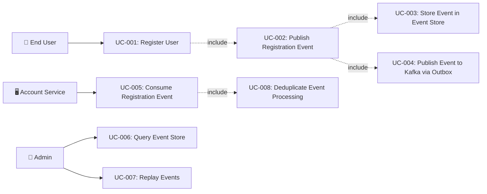

# Tài liệu phân tích nghiệp vụ: User Registration Event

> Phân tích nghiệp vụ chi tiết — chia nhỏ theo use case, đặc tả ngữ nghĩa từng chức năng.

---

## 1. Tổng quan (Overview)

### 1.1 Bối cảnh nghiệp vụ (Business Context)

Hệ thống auth-service hiện tại đã triển khai CQRS pattern với `RegisterHandler` phát sinh `UserRegisteredEvent` sau khi đăng ký thành công. Tuy nhiên, event hiện tại chỉ chứa thông tin tối thiểu (userId, username, domainCode) và được publish theo kiểu fire-and-forget qua Kafka — không có event store, không có đảm bảo delivery, không có schema versioning.

Bài toán business: Khi một user đăng ký, nhiều downstream service cần phản ứng (tạo profile, gán role mặc định, gửi welcome notification, ghi audit trail). Nếu event bị mất hoặc chứa thiếu thông tin, các service downstream sẽ hoạt động không chính xác, gây trải nghiệm kém cho user và mất dữ liệu audit.

### 1.2 Mục tiêu (Objectives)

| # | Mục tiêu | KPI đo lường | Độ ưu tiên |
|---|---------|-------------|-----------|
| O-01 | Zero event loss cho registration events | 100% event delivery rate (outbox → Kafka) | High |
| O-02 | Enriched event payload cho downstream consumers | Tất cả downstream consumers nhận đủ data mà không cần callback | High |
| O-03 | Full audit trail qua event store | 100% registration events lưu trong event_store table | High |
| O-04 | Backward-compatible schema evolution | Support ≥ 2 event versions đồng thời | Medium |
| O-05 | Idempotent consumer processing | Zero duplicate side-effects khi Kafka retry | Medium |
| O-06 | Consolidate duplicate event definitions | Single source of truth cho UserRegisteredEvent | High |

### 1.3 Phạm vi (Scope)

| In Scope | Out of Scope |
|----------|-------------|
| Enriched UserRegisteredEvent payload design | Full event sourcing cho tất cả aggregates |
| PostgreSQL event_store table (append-only) | Dedicated event store database (EventStoreDB) |
| Transactional outbox pattern cho reliable publishing | CDC (Debezium) infrastructure |
| Event schema versioning strategy | Saga/Process Manager implementation |
| Idempotent consumer pattern + deduplication | Implementing all downstream consumers |
| Consolidate duplicate UserRegisteredEvent definitions | Refactoring legacy AuthService.register() |
| CloudEvents-inspired event envelope | Full CloudEvents SDK adoption |
| Kafka topic strategy for user lifecycle events | Kafka cluster operations |

### 1.4 Stakeholders & Actors

| Actor | Loại | Mô tả | Tương tác chính |
|-------|------|--------|----------------|
| End User | Primary | Người dùng đăng ký tài khoản mới | Gửi registration request |
| Auth Service | System | Service xử lý authentication & registration | Xử lý RegisterCommand, tạo event, lưu event store |
| Account Service | External System | Service quản lý profile/device/preference | Consume UserRegisteredEvent để tạo user profile |
| Notification Service | External System | Service gửi thông báo | Consume UserRegisteredEvent để gửi welcome email |
| Admin | Secondary | Quản trị viên hệ thống | Xem audit trail, replay events |
| System Admin Service | External System | Service quản trị hệ thống | Consume audit events cho immutable storage |

---

## 2. Use Case Diagram (tổng quan)



---

## 3. Danh sách Use Case (Use Case Index)

| UC-ID | Tên Use Case | Actor | Nhóm chức năng | Độ ưu tiên | Trạng thái |
|-------|-------------|-------|----------------|-----------|-----------|
| UC-001 | Register User (existing — enhanced) | End User | Authentication | High | Draft |
| UC-002 | Publish Registration Event | Auth Service (internal) | Event Publishing | High | Draft |
| UC-003 | Store Event in Event Store | Auth Service (internal) | Event Persistence | High | Draft |
| UC-004 | Publish Event to Kafka via Outbox | Auth Service (internal) | Event Delivery | High | Draft |
| UC-005 | Consume Registration Event | Account Service | Event Consumption | High | Draft |
| UC-006 | Query Event Store | Admin | Audit & Diagnostics | Medium | Draft |
| UC-007 | Replay Events for Projection | Admin | Data Recovery | Low | Draft |
| UC-008 | Deduplicate Event Processing | Account Service | Reliability | Medium | Draft |

---

## 4. Đặc tả Use Case chi tiết

### UC-001: Register User (Enhanced)

#### 4.1 Thông tin chung

| Mục | Nội dung |
|-----|----------|
| **Mã** | UC-001 |
| **Tên** | Register User |
| **Mô tả ngữ nghĩa** | User đăng ký tài khoản mới. Sau khi lưu user vào database, hệ thống tạo một enriched domain event chứa đầy đủ thông tin cần thiết cho downstream consumers, lưu event vào event store và outbox trong cùng một transaction. Giá trị: đảm bảo tất cả hệ thống downstream nhận được thông tin đăng ký mà không bị mất data |
| **Actor** | End User |
| **Trigger** | User gửi POST /api/auth/register |
| **Độ ưu tiên** | High |
| **Tần suất** | On-demand — hundreds to thousands per day |
| **Nhóm chức năng** | Authentication |

#### 4.2 Điều kiện

| Loại | Mô tả |
|------|--------|
| **Pre-conditions** | User chưa có tài khoản (username + email unique); Domain exists and is active |
| **Post-conditions (Success)** | User record saved in `users` table; `UserRegisteredEvent` saved in `event_store` table; Event record saved in `event_outbox` table; Auth tokens returned to user |
| **Post-conditions (Failure)** | No user created; No event generated; Error response returned |
| **Invariants** | User + Event + Outbox record saved in same transaction (all-or-nothing) |

#### 4.3 Luồng chính (Basic Flow)

| Step | Actor Action | System Response | Data | Ghi chú |
|------|-------------|----------------|------|---------|
| 1 | User gửi registration request (username, email, password, fullName, phone, domainCode) | Validate input (@Valid annotations) | RegisterRequestDto | Bean Validation |
| 2 | - | CqrsAuthController tạo RegisterCommand | RegisterCommand | Includes anonymousSessionId if present |
| 3 | - | RegisterHandler validates uniqueness (username, email) | UserPort.existsByUsername/Email | Throws DuplicateResourceException if exists |
| 4 | - | RegisterHandler validates domain exists | DomainPort.findByCodeAndActive | Throws ResourceNotFoundException if not found |
| 5 | - | Create User domain model, encode password | User, PasswordHash | BCrypt strength 12 |
| 6 | - | Save user via UserPort.save() | User (with generated Snowflake ID) | @Transactional |
| 7 | - | **[NEW]** Create enriched UserRegisteredEvent with full payload | UserRegisteredEvent v2 | Includes email, fullName, phone, ipAddress, correlationId |
| 8 | - | **[NEW]** Save event to event_store table (append-only) | EventStoreEntry | Same transaction as step 6 |
| 9 | - | **[NEW]** Save event to event_outbox table (pending publication) | OutboxEntry | Same transaction as step 6 |
| 10 | - | Generate auth tokens (access + refresh) | AuthToken | JWT RS256 signed |
| 11 | - | Return RegisterResult.Success | AuthResponse (201 Created) | Includes promotion metadata if anonymous session |
| 12 | - | **[ASYNC]** Outbox poller picks up pending event and publishes to Kafka | Kafka topic: `iam.user.events` | Background thread, 100ms poll interval |

#### 4.4 Luồng thay thế (Alternative Flows)

##### AF-001: Registration with Anonymous Session Promotion
- **Trigger**: Tại Step 1 khi request includes `anonymousSessionId` and `anonymousToken`
- **Steps**:
  1. Extract JTI from anonymous token
  2. After Step 10, call SessionPromotionService.promoteSession()
  3. Include promotion result in RegisterResult.Success
- **Rejoin**: Quay lại Step 11 của Basic Flow (with promotion metadata)

##### AF-002: SSO-Provisioned User Registration
- **Trigger**: Khi user đăng ký qua SSO JIT (Just-In-Time) provisioning
- **Steps**:
  1. SsoAdapter creates user without password
  2. Publishes SsoProvisionedEvent instead of UserRegisteredEvent
  3. Event contains provider info (Google, Microsoft, etc.)
- **Rejoin**: Không rejoin — separate flow

#### 4.5 Luồng ngoại lệ (Exception Flows)

##### EF-001: Duplicate Username
- **Trigger**: Tại Step 3 khi username already exists
- **Error**: `409 Conflict` — DuplicateResourceException("User", "username", value)
- **Handling**:
  1. Hiển thị thông báo lỗi: "User with username 'xxx' already exists"
  2. Transaction rolled back — no event generated
- **Post-condition**: No changes to database

##### EF-002: Duplicate Email
- **Trigger**: Tại Step 3 khi email already exists
- **Error**: `409 Conflict` — DuplicateResourceException("User", "email", value)
- **Handling**:
  1. Hiển thị thông báo lỗi: "User with email 'xxx' already exists"
  2. Transaction rolled back — no event generated
- **Post-condition**: No changes to database

##### EF-003: Domain Not Found
- **Trigger**: Tại Step 4 khi domain code does not exist or is inactive
- **Error**: `404 Not Found` — ResourceNotFoundException("Domain", code)
- **Handling**:
  1. Hiển thị thông báo lỗi: "Domain 'xxx' not found"
  2. Transaction rolled back
- **Post-condition**: No changes to database

##### EF-004: Database Write Failure
- **Trigger**: Tại Step 6/8/9 khi database write fails
- **Error**: `500 Internal Server Error`
- **Handling**:
  1. @Transactional rolls back all changes (user + event_store + outbox)
  2. Log error with correlation ID
- **Post-condition**: No partial writes — atomic rollback

##### EF-005: Outbox Publication Failure
- **Trigger**: Tại Step 12 khi Kafka publish fails
- **Error**: No user-facing error (async process)
- **Handling**:
  1. Outbox poller retries on next poll cycle (100ms interval)
  2. Max 10 retries with exponential backoff
  3. After max retries, mark as FAILED in outbox, alert operations
- **Post-condition**: Event remains in outbox table; user registration succeeded

#### 4.6 Quy tắc nghiệp vụ (Business Rules)

| BR-ID | Quy tắc | Mô tả chi tiết | Validation |
|-------|---------|----------------|-----------|
| BR-001 | Event immutability | Events in event_store MUST NEVER be updated or deleted | Database: no UPDATE/DELETE permissions on event_store table |
| BR-002 | Atomic event + domain write | Event store entry and outbox entry MUST be saved in same transaction as domain entity | @Transactional on RegisterHandler.handle() |
| BR-003 | Event contains correlation ID | Every event MUST carry a correlation ID (UUID) for distributed tracing | Validation in EventEnvelope constructor |
| BR-004 | Event type versioning | Event type MUST include version suffix: `user.registered.v1` | Convention enforced in event type constant |
| BR-005 | Idempotent registration | Registration with same username/email MUST be rejected (not create duplicate event) | Uniqueness check before event creation |
| BR-006 | Event ordering | Events for same aggregate (userId) MUST be ordered by sequence number | Partition by userId in Kafka topic |
| BR-007 | Outbox* | UC-002 |
| **Tên** | Publish Registration Event |
| **Mô tả ngữ nghĩa** | Sau khi user được tạo thành công, hệ thống tạo một enriched domain event (UserRegisteredEvent) chứa đầy đủ thông tin cho downstream consumers. Event được wrap trong CloudEvents-inspired envelope với metadata (id, type, source, time, correlationId). GIÁ TRỊ: downstream consumers không cần callback API để lấy thêm thông tin — event là self-contained |
| **Actor** | Auth Service (internal — triggered by RegisterHandler) |
| **Trigger** | User record saved successfully (Step 6 of UC-001) |
| **Độ ưu tiên** | High |
| **Tần suất** | 1:1 với user registration |
| **Nhóm chức năng** | Event Publishing |

#### 4.2 Điều kiện

| Loại | Mô tả |
|------|--------|
| **Pre-conditions** | User entity saved with valid Snowflake ID; Domain info available |
| **Post-conditions (Success)** | Enriched event created with all required fields; Event passed to UC-003 and UC-004 |
| **Post-conditions (Failure)** | Transaction rolled back (event creation is part of registration transaction) |
| **Invariants** | Event MUST contain: eventId (UUID), userId, username, email, domainCode, correlationId, timestamp, eventType with version |

#### 4.3 Luồng chính (Basic Flow)

| Step | Actor Action | System Response | Data | Ghi chú |
|------|-------------|----------------|------|---------|
| 1 | - | Generate UUID for event ID | eventId: UUID | Globally unique |
| 2 | - | Extract correlation ID from request context (MDC/header) | correlationId: UUID | From X-Correlation-ID header or auto-generated |
| 3 | - | Build enriched UserRegisteredEvent | Full payload (see event schema below) | Includes all fields downstream consumers need |
| 4 | - | Wrap in EventEnvelope with CloudEvents metadata | EventEnvelope | specversion, source, type with version |
| 5 | - | Pass to EventStoreService.save() (UC-003) | - | Same transaction |
| 6 | - | Pass to OutboxService.save() (UC-004) | - | Same transaction |

#### 4.4 Luồng thay thế (Alternative Flows)

N/A — internal system flow with no alternatives.

#### 4.5 Luồng ngoại lệ (Exception Flows)

##### EF-001: Missing Required Field
- **Trigger**: Khi user entity missing required field for event
- **Error**: IllegalStateException
- **Handling**: Transaction rollback — registration fails
- **Post-condition**: No user, no event

#### 4.6 Quy tắc nghiệp vụ (Business Rules)

| BR-ID | Quy tắc | Mô tả chi tiết | Validation |
|-------|---------|----------------|-----------|
| BR-008 | Self-contained event | Event MUST contain all info downstream consumers need — no need for callback API | Review checklist: account-service needs email, fullName for profile creation |
| BR-009 | CloudEvents envelope | Event MUST follow CloudEvents-inspired envelope format | EventEnvelope class enforces structure |
| BR-010 | Deterministic event ID | Event ID MUST be UUID v4 (random) for uniqueness across nodes | UUID.randomUUID() |

#### 4.7 Yêu cầu phi chức năng (cho UC này)

| Loại | Yêu cầu | Target |
|------|---------|--------|
| Performance | Event construction overhead | < 1ms |
| Reliability | Event creation MUST be atomic with user save | Same @Transactional |

#### 4.8 Mockup / Wireframe Description

```
Event Payload (UserRegisteredEvent v2):
┌──────────────────────────────────────────┐
│  EventEnvelope:                          │
│    id: "550e8400-e29b-..."               │
│    type: "user.registered.v2"            │
│    source: "auth-service"                │
│    specversion: "1.0"                    │
│    time: "2025-08-21T10:00:00Z"          │
│    correlationId: "a1b2c3d4-..."         │
│    data:                                 │
│      userId: 123456789                   │
│      username: "john_doe"                │
│      email: "john@example.com"           │
│      fullName: "John Doe"                │
│      phone: "+84123456789"               │
│      domainCode: "default"               │
│      domainId: 1                         │
│      status: "ACTIVE"                    │
│      registrationSource: "DIRECT"        │
│      ipAddress: "192.168.1.1"            │
│      userAgent: "Mozilla/5.0..."         │
└──────────────────────────────────────────┘
```

---

### UC-003: Store Event in Event Store

#### 4.1 Thông tin chung

| Mục | Nội dung |
|-----|----------|
| **Mã** | UC-003 |
| **Tên** | Store Event in Event Store |
| **Mô tả ngữ nghĩa** | Mỗi domain event được lưu vĩnh viễn trong event_store table (append-only). Bảng này là source of truth cho tất cả sự kiện đã xảy ra trong hệ thống — phục vụ audit trail, temporal queries, và khả năng replay events để rebuild projections. GIÁ TRỊ: truy vấn lịch sử đầy đủ, compliance, debugging production issues |
| **Actor** | Auth Service (internal) |
| **Trigger** | Event created (UC-002 Step 5) |
| **Độ ưu tiên** | High |
| **Tần suất** | 1:1 với mỗi domain event |
| **Nhóm chức năng** | Event Persistence |

#### 4.2 Điều kiện

| Loại | Mô tả |
|------|--------|
| **Pre-conditions** | EventEnvelope created with valid payload |
| **Post-conditions (Success)** | Event record inserted into event_store table with sequence_number |
| **Post-conditions (Failure)** | Transaction rolled back — registration fails |
| **Invariants** | event_store is append-only — no UPDATE, no DELETE |

#### 4.3 Luồng chính (Basic Flow)

| Step | Actor Action | System Response | Data | Ghi chú |
|------|-------------|----------------|------|---------|
| 1 | - | Serialize event payload to JSON | JSONB payload | Jackson ObjectMapper |
| 2 | - | Insert into event_store table | event_id, aggregate_type, aggregate_id, event_type, version, payload, metadata, created_at | Snowflake ID for primary key |
| 3 | - | Auto-increment sequence_number per aggregate | sequence_number | Used for optimistic concurrency if needed |

#### 4.4 Luồng thay thế (Alternative Flows)

N/A

#### 4.5 Luồng ngoại lệ (Exception Flows)

##### EF-001: Database Write Failure
- **Trigger**: PostgreSQL write failure
- **Error**: DataAccessException
- **Handling**: Transaction rollback (entire registration fails)
- **Post-condition**: No user, no event

#### 4.6 Quy tắc nghiệp vụ (Business Rules)

| BR-ID | Quy tắc | Mô tả chi tiết | Validation |
|-------|---------|----------------|-----------|
| BR-011 | Append-only | event_store table MUST NOT support UPDATE or DELETE operations | Database permissions + no repository methods for update/delete |
| BR-012 | Ordered per aggregate | sequence_number MUST be monotonically increasing per aggregate_id | Database sequence or application-level counter |

#### 4.7 Yêu cầu phi chức năng (cho UC này)

| Loại | Yêu cầu | Target |
|------|---------|--------|
| Performance | Event store INSERT latency | < 10ms P95 |
| Storage | Event store growth rate | ~200 bytes per event × registration volume |
| Durability | Data retention | Indefinite (archive policy for events > 90 days) |

#### 4.8 Mockup / Wireframe Description

```
event_store table row:
┌──────────────────────────────────────────────────┐
│  id: 987654321 (Snowflake)                       │
│  aggregate_type: "User"                          │
│  aggregate_id: 123456789                         │
│  event_type: "user.registered.v2"                │
│  version: 2                                      │
│  sequence_number: 1                              │
│  payload: {"userId":123,"username":"john",...}    │
│  metadata: {"correlationId":"a1b2","source":...} │
│  created_at: 2025-08-21T10:00:00Z                │
└──────────────────────────────────────────────────┘
```

---

### UC-004: Publish Event to Kafka via Outbox

#### 4.1 Thông tin chung

| Mục | Nội dung |
|-----|----------|
| **Mã** | UC-004 |
| **Tên** | Publish Event to Kafka via Transactional Outbox |
| **Mô tả ngữ nghĩa** | Thay vì publish trực tiếp vào Kafka (fire-and-forget), event được lưu trong outbox table trong cùng transaction với domain change. Background poller đọc outbox và publish tới Kafka. GIÁ TRỊ: đảm bảo zero event loss — nếu Kafka down, events vẫn nằm trong outbox và được retry khi Kafka available |
| **Actor** | Auth Service (internal — background poller) |
| **Trigger** | Event saved in event_outbox table (UC-001 Step 9) |
| **Độ ưu tiên** | High |
| **Tần suất** | Background poller runs every 100ms |
| **Nhóm chức năng** | Event Delivery |

#### 4.2 Điều kiện

| Loại | Mô tả |
|------|--------|
| **Pre-conditions** | Unpublished events exist in event_outbox table |
| **Post-conditions (Success)** | Event published to Kafka topic; outbox record marked as PUBLISHED |
| **Post-conditions (Failure)** | Outbox record remains PENDING; retry on next poll cycle |
| **Invariants** | At-least-once delivery guarantee |

#### 4.3 Luồng chính (Basic Flow)

| Step | Actor Action | System Response | Data | Ghi chú |
|------|-------------|----------------|------|---------|
| 1 | - | Outbox poller queries for PENDING events (batch, ordered by created_at) | SELECT ... WHERE status = 'PENDING' ORDER BY created_at LIMIT 50 | Scheduled every 100ms |
| 2 | - | For each event, publish to Kafka topic | KafkaTemplate.send(topic, key, payload) | Topic: `iam.user.events`, key: userId |
| 3 | - | On successful Kafka ack, mark outbox record as PUBLISHED | UPDATE event_outbox SET status = 'PUBLISHED', published_at = NOW() | Individual record update |
| 4 | - | On failure, increment retry_count | UPDATE event_outbox SET retry_count = retry_count + 1 | Max 10 retries |
| 5 | - | Cleanup: delete PUBLISHED records older than 24 hours | DELETE FROM event_outbox WHERE status = 'PUBLISHED' AND published_at < NOW() - 24h | Scheduled cleanup job |

#### 4.4 Luồng thay thế (Alternative Flows)

##### AF-001: Batch Publishing
- **Trigger**: Multiple pending events in outbox
- **Steps**: Process up to 50 events per poll cycle
- **Rejoin**: Continue polling

#### 4.5 Luồng ngoại lệ (Exception Flows)

##### EF-001: Kafka Unavailable
- **Trigger**: Kafka cluster is down
- **Error**: KafkaProducerException
- **Handling**: Events remain in outbox with status PENDING; retry on next cycle
- **Post-condition**: No data loss; events queued in outbox

##### EF-002: Max Retries Exceeded
- **Trigger**: retry_count >= 10
- **Error**: Alert triggered via logging
- **Handling**: Mark as FAILED; require manual intervention
- **Post-condition**: Event in outbox with status FAILED; operations alerted

#### 4.6 Quy tắc nghiệp vụ (Business Rules)

| BR-ID | Quy tắc | Mô tả chi tiết | Validation |
|-------|---------|----------------|-----------|
| BR-013 | At-least-once delivery | Events MUST be delivered to Kafka at least once | Outbox poller retries until PUBLISHED or FAILED |
| BR-014 | Ordered publishing | Events for same aggregate MUST be published in order | ORDER BY created_at in outbox query; partition by userId in Kafka |
| BR-015 | Outbox cleanup | PUBLISHED entries MUST be cleaned up within 24 hours | Scheduled cleanup job |

#### 4.7 Yêu cầu phi chức năng (cho UC này)

| Loại | Yêu cầu | Target |
|------|---------|--------|
| Latency | Outbox → Kafka publish latency | < 500ms P95 |
| Reliability | Delivery success rate | 99.99% |
| Performance | Outbox poller throughput | 500 events/second |

#### 4.8 Mockup / Wireframe Description

```
event_outbox table row:
┌──────────────────────────────────────────────────┐
│  id: 111222333 (Snowflake)                       │
│  aggregate_type: "User"                          │
│  aggregate_id: 123456789                         │
│  event_type: "user.registered.v2"                │
│  topic: "iam.user.events"                        │
│  partition_key: "123456789"                      │
│  payload: {"id":"550e...","type":"user.reg..."}  │
│  status: PENDING → PUBLISHED                    │
│  retry_count: 0                                  │
│  created_at: 2025-08-21T10:00:00.000Z            │
│  published_at: 2025-08-21T10:00:00.150Z          │
└──────────────────────────────────────────────────┘
```

---

### UC-005: Consume Registration Event

#### 4.1 Thông tin chung

| Mục | Nội dung |
|-----|----------|
| **Mã** | UC-005 |
| **Tên** | Consume Registration Event |
| **Mô tả ngữ nghĩa** | Downstream services (account-service) consume UserRegisteredEvent từ Kafka topic `iam.user.events`. Consumer tạo user profile, gán default preferences, và các setup ban đầu cho user mới. GIÁ TRỊ: tự động provisioning user data across services mà không cần synchronous API calls |
| **Actor** | Account Service (external Kafka consumer) |
| **Trigger** | Message received on Kafka topic `iam.user.events` with type `user.registered.v2` |
| **Độ ưu tiên** | High |
| **Tần suất** | 1:1 với user registration |
| **Nhóm chức năng** | Event Consumption |

#### 4.2 Điều kiện

| Loại | Mô tả |
|------|--------|
| **Pre-conditions** | Event published to Kafka topic; Consumer group subscribed |
| **Post-conditions (Success)** | User profile created in account-service; Event ID recorded in processed_events table |
| **Post-conditions (Failure)** | Event retried (Kafka consumer retry) or sent to DLQ |
| **Invariants** | Idempotent processing — processing same event twice produces same result |

#### 4.3 Luồng chính (Basic Flow)

| Step | Actor Action | System Response | Data | Ghi chú |
|------|-------------|----------------|------|---------|
| 1 | - | Kafka consumer receives message | CloudEvents envelope + UserRegisteredEvent payload | @KafkaListener |
| 2 | - | Deserialize event and extract event ID | eventId: UUID | Jackson deserialization |
| 3 | - | Check deduplication: is eventId in processed_events table? | SELECT exists from processed_events WHERE event_id = ? | UC-008 |
| 4 | - | If not duplicate, process event: create user profile | INSERT into user_profiles | Account-service internal |
| 5 | - | Record eventId in processed_events table | INSERT into processed_events | Idempotency guarantee |
| 6 | - | Commit Kafka offset | - | Manual commit after processing |

#### 4.4 Luồng thay thế (Alternative Flows)

##### AF-001: Event Version Mismatch
- **Trigger**: Consumer receives v1 event but expects v2
- **Steps**: Apply upcaster to transform v1 → v2 (fill defaults for new fields)
- **Rejoin**: Continue with Step 4

#### 4.5 Luồng ngoại lệ (Exception Flows)

##### EF-001: Duplicate Event
- **Trigger**: eventId already in processed_events (Step 3)
- **Handling**: Skip processing, acknowledge message
- **Post-condition**: No duplicate side effects

##### EF-002: Processing Failure
- **Trigger**: Account-service database error
- **Handling**: Kafka retry (3 attempts); then send to Dead Letter Queue (DLQ)
- **Post-condition**: Event in DLQ for manual investigation

#### 4.6 Quy tắc nghiệp vụ (Business Rules)

| BR-ID | Quy tắc | Mô tả chi tiết | Validation |
|-------|---------|----------------|-----------|
| BR-016 | Idempotent processing | Processing same event multiple times MUST produce same result | Deduplication via processed_events table |
| BR-017 | Version tolerance | Consumer MUST handle events from version N-1 to N | Upcaster for v1 → v2 transformation |
| BR-018 | DLQ for failures | Events that fail after max retries MUST go to DLQ | Kafka consumer config: max.poll.retries + DLQ topic |

#### 4.7 Yêu cầu phi chức năng (cho UC này)

| Loại | Yêu cầu | Target |
|------|---------|--------|
| Latency | Event consumption to profile creation | < 2s P95 |
| Reliability | Processing success rate | 99.9% |

#### 4.8 Mockup / Wireframe Description

N/A — Kafka consumer (no UI)

---

### UC-006: Query Event Store

#### 4.1 Thông tin chung

| Mục | Nội dung |
|-----|----------|
| **Mã** | UC-006 |
| **Tên** | Query Event Store for Audit |
| **Mô tả ngữ nghĩa** | Admin hoặc support team truy vấn event store để xem lịch sử đăng ký, debug issues, hoặc compliance audit. GIÁ TRỊ: full traceability của mọi thay đổi trong hệ thống |
| **Actor** | Admin |
| **Trigger** | Admin truy cập internal API hoặc direct DB query |
| **Độ ưu tiên** | Medium |
| **Tần suất** | On-demand — weekly/monthly |
| **Nhóm chức năng** | Audit & Diagnostics |

#### 4.2 Điều kiện

| Loại | Mô tả |
|------|--------|
| **Pre-conditions** | Admin authenticated with SUPER_ADMIN role |
| **Post-conditions (Success)** | Events returned for queried aggregate |
| **Post-conditions (Failure)** | Empty result or 403 Forbidden |
| **Invariants** | Read-only access to event_store |

#### 4.3 Luồng chính (Basic Flow)

| Step | Actor Action | System Response | Data | Ghi chú |
|------|-------------|----------------|------|---------|
| 1 | Admin sends query (by aggregate_id or time range) | Validate authorization (SUPER_ADMIN) | - | @PreAuthorize |
| 2 | - | Query event_store table | List<EventStoreEntry> | Filtered by aggregate_type, aggregate_id, date range |
| 3 | - | Return paginated event list | Page<EventStoreEntry> | Sorted by sequence_number ASC |

#### 4.4 Luồng thay thế (Alternative Flows)

N/A

#### 4.5 Luồng ngoại lệ (Exception Flows)

##### EF-001: Unauthorized Access
- **Trigger**: User without SUPER_ADMIN role
- **Error**: 403 Forbidden
- **Handling**: Log unauthorized access attempt to audit trail
- **Post-condition**: No data returned

#### 4.6 Quy tắc nghiệp vụ (Business Rules)

| BR-ID | Quy tắc | Mô tả chi tiết | Validation |
|-------|---------|----------------|-----------|
| BR-019 | Read-only access | Event store query endpoint MUST be read-only | No mutation methods exposed |
| BR-020 | Admin-only | Only SUPER_ADMIN role can query event store | @PreAuthorize("hasRole('SUPER_ADMIN')") |

#### 4.7 Yêu cầu phi chức năng (cho UC này)

| Loại | Yêu cầu | Target |
|------|---------|--------|
| Performance | Query response time | < 2s for 1000 events |
| Security | Authorization | SUPER_ADMIN role required |

#### 4.8 Mockup / Wireframe Description

N/A — Internal API / DB query

---

## 5. Ma trận truy xuất (Traceability Matrix)

| UC-ID | FR-ID | NFR-ID | BR-ID | Screen | API Endpoint | DB Entity |
|-------|-------|--------|-------|--------|-------------|-----------|
| UC-001 | FR-001, FR-002, FR-003 | NFR-001, NFR-006 | BR-001, BR-002, BR-005 | N/A (API) | POST /api/auth/register | users, event_store, event_outbox |
| UC-002 | FR-002, FR-003 | NFR-001 | BR-008, BR-009, BR-010 | N/A | (internal) | event_store, event_outbox |
| UC-003 | FR-004 | NFR-002, NFR-003 | BR-011, BR-012 | N/A | (internal) | event_store |
| UC-004 | FR-005 | NFR-004, NFR-005 | BR-013, BR-014, BR-015 | N/A | (internal) | event_outbox, Kafka |
| UC-005 | FR-006 | NFR-007 | BR-016, BR-017, BR-018 | N/A | (Kafka consumer) | processed_events |
| UC-006 | FR-007 | NFR-008 | BR-019, BR-020 | N/A | GET /internal/events | event_store |

---

## 6. Yêu cầu chức năng tổng hợp (Functional Requirements)

| FR-ID | Tên | Mô tả | UC liên quan | Độ ưu tiên |
|-------|-----|--------|-------------|-----------|
| FR-001 | Enriched UserRegisteredEvent | Event MUST contain userId, username, email, fullName, phone, domainCode, domainId, status, registrationSource, ipAddress, userAgent | UC-001, UC-002 | High |
| FR-002 | CloudEvents-inspired envelope | Event MUST be wrapped in envelope with id, type, source, specversion, time, correlationId | UC-002 | High |
| FR-003 | Atomic event + domain write | Event store and outbox entries MUST be saved in same transaction as user entity | UC-001, UC-002 | High |
| FR-004 | Append-only event store | event_store table MUST be append-only with sequence numbers per aggregate | UC-003 | High |
| FR-005 | Transactional outbox | Events MUST be published via outbox pattern with at-least-once delivery guarantee | UC-004 | High |
| FR-006 | Idempotent consumer support | Event MUST include unique eventId (UUID) for consumer deduplication | UC-005 | Medium |
| FR-007 | Event store query API | Admin MUST be able to query events by aggregate ID and time range | UC-006 | Medium |
| FR-008 | Event schema versioning | Event type MUST include version (e.g., `user.registered.v2`); upcasters for old versions | UC-002, UC-005 | Medium |
| FR-009 | Consolidate event definitions | MUST resolve duplicate UserRegisteredEvent (port/out vs command package) | UC-002 | High |
| FR-010 | Kafka topic strategy | All user lifecycle events on single topic `iam.user.events`, partitioned by userId | UC-004 | Medium |

---

## 7. Yêu cầu phi chức năng tổng hợp (Non-Functional Requirements)

| NFR-ID | Loại | Yêu cầu | Target | Measurement |
|--------|------|---------|--------|-------------|
| NFR-001 | Performance | Registration response time (including event store + outbox write) | < 500ms P95 | APM monitoring |
| NFR-002 | Durability | Event store data retention | Indefinite (archive after 90 days) | Storage metrics |
| NFR-003 | Storage | Event store growth rate estimation | ~500 bytes/event × daily registration volume | DB monitoring |
| NFR-004 | Reliability | Outbox → Kafka delivery rate | 99.99% | Outbox metrics (PENDING count) |
| NFR-005 | Latency | Outbox → Kafka publish latency | < 500ms P95 | Poller metrics |
| NFR-006 | Concurrency | Max concurrent registrations | 100 req/s | Load test |
| NFR-007 | Latency | End-to-end event consumption | < 2s P95 | Consumer lag monitoring |
| NFR-008 | Security | Event store access control | SUPER_ADMIN only | Auth check |

---

## 8. Thuật ngữ nghiệp vụ (Glossary)

| Thuật ngữ | Định nghĩa | Context sử dụng |
|-----------|-----------|-----------------|
| Domain Event | Record bất biến ghi lại một sự kiện đã xảy ra trong domain — viết ở thì quá khứ (e.g., UserRegistered) | Core concept — mọi UC đều liên quan |
| Event Store | Bảng append-only lưu trữ tất cả domain events — source of truth cho lịch sử thay đổi | UC-003, UC-006 |
| Transactional Outbox | Pattern đảm bảo event được lưu trong cùng transaction với domain change, sau đó async publish ra Kafka | UC-004 |
| Event Envelope | Wrapper chứa metadata (id, type, source, time) bao quanh event payload — inspired by CloudEvents | UC-002 |
| Correlation ID | UUID liên kết các events/requests liên quan trong distributed flow — dùng cho tracing | UC-002 |
| Upcaster | Logic chuyển đổi event schema từ version cũ sang mới — dùng khi replay events | UC-005, FR-008 |
| Idempotent Consumer | Consumer xử lý cùng event nhiều lần mà kết quả không thay đổi — đạt qua deduplication table | UC-005, UC-008 |
| Aggregate | Cluster of domain objects treated as a single unit — User aggregate chứa user + related events | UC-003 |

---

## 9. Phụ lục (Appendix)

### 9.1 Research References
- [opensource_findings.md](./opensource_findings.md)
- [web_research.md](./web_research.md)
- [comparison_analysis.md](./comparison_analysis.md)

### 9.2 Open Questions
- [ ] OQ-001: Should `eventsourcing-utils` be extended to include event store abstractions, or keep it as CQRS-only?
- [ ] OQ-002: Should event payload include hashed PII (email) or plain text for downstream consumers?

### 9.3 Assumptions
- ⚠️ AS-001: `eventsourcing-utils` provides only Command/CommandHandler/Query/QueryHandler — no event store implementation — Lý do: only these types are imported in codebase
- ⚠️ AS-002: account-service `ProfileKafkaListener` will consume `UserRegisteredEvent` from `iam.user.events` topic — Lý do: ProfileKafkaListener exists in account-service codebase
- ⚠️ AS-003: PostgreSQL is acceptable as event store (vs dedicated EventStoreDB) — Lý do: already in tech stack, minimizes infrastructure changes

---

> **Next step**: Technical Specification (technical_spec.md)
> **Traceability**: Research Brief → Business Analysis → Technical Spec
