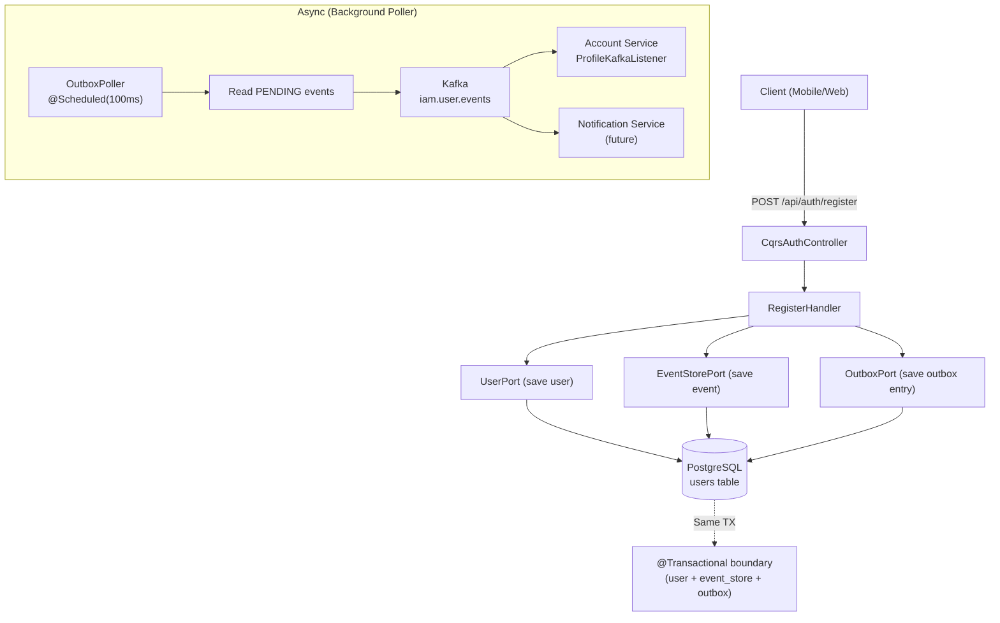
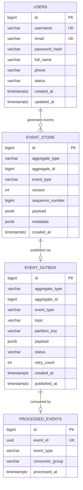
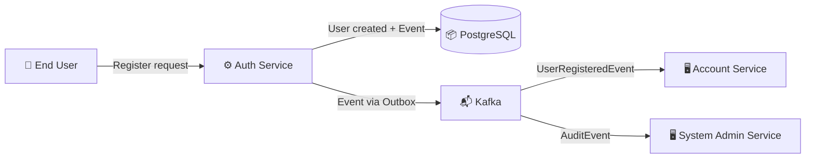
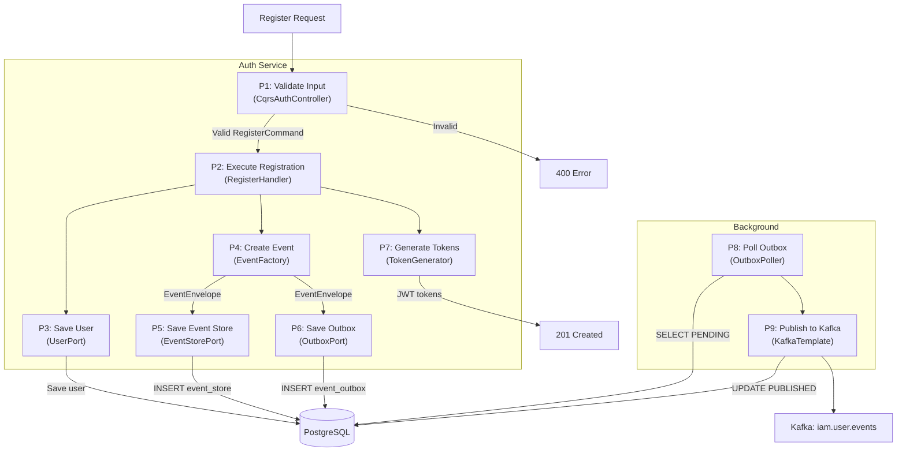
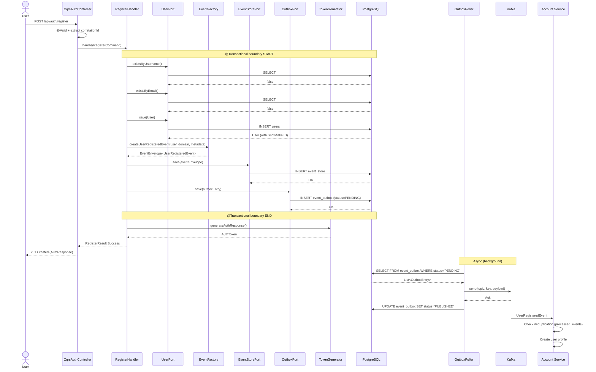
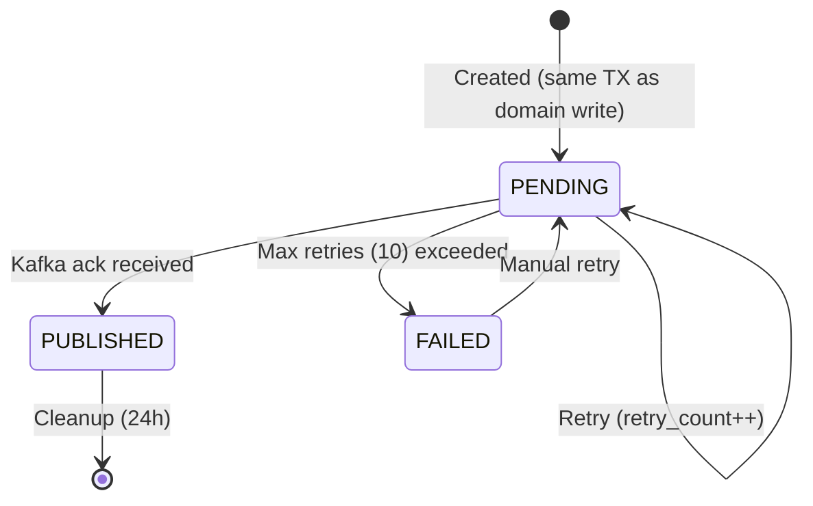

# Đặc tả kỹ thuật: User Registration Event

> Technical specification chi tiết — thiết kế để agent có thể đọc và dev code trực tiếp.

---

## 1. Tổng quan hệ thống (System Overview)

### 1.1 Kiến trúc tổng thể



### 1.2 Technology Stack

| Layer | Technology | Version | Ghi chú |
|-------|-----------|---------|---------|
| Language | Kotlin | 1.9+ | Primary language |
| Framework | Spring Boot | 3.x | With Spring Security, Spring Data JPA |
| Database | PostgreSQL | 17+ | Event store + outbox tables |
| Cache | Redis + Caffeine | - | Existing infrastructure (not directly used in this feature) |
| Messaging | Apache Kafka | 3.x | Domain event transport via outbox |
| CQRS Library | eventsourcing-utils | 0.0.1-SNAPSHOT | Command/CommandHandler base types |
| Serialization | Jackson | - | Event payload serialization to JSON |
| Migration | Flyway | - | Database schema migrations |
| ID Generation | Snowflake ID | base-core | BIGINT IDs for event_store and outbox tables |

### 1.3 Dependencies & Integrations

| Dependency | Type | Purpose | Interface |
|-----------|------|---------|-----------|
| account-service | Internal | Consumes UserRegisteredEvent for profile creation | Kafka topic: `iam.user.events` |
| system-admin-service | Internal | Consumes AuditEvent for audit persistence | Kafka topic: `iam.audit.event` |
| base-core platform | Internal | Snowflake ID generation, base entities | Maven BOM |
| eventsourcing-utils | Internal | Command/CommandHandler types | Maven dependency |
| Spring Kafka | External | Kafka producer for outbox publishing | KafkaTemplate |

---

## 2. Lược đồ dữ liệu (Data Schema)

### 2.1 Entity-Relationship Diagram



### 2.2 Bảng chi tiết Entity

#### Entity: event_store

| Field | Type | Constraint | Default | Mô tả |
|-------|------|-----------|---------|--------|
| `id` | `BIGINT` | PK | Snowflake ID | Primary key |
| `aggregate_type` | `VARCHAR(100)` | NOT NULL | - | Aggregate type: "User", "Session", etc. |
| `aggregate_id` | `BIGINT` | NOT NULL | - | Aggregate ID (e.g., userId) |
| `event_type` | `VARCHAR(200)` | NOT NULL | - | Event type with version: "user.registered.v2" |
| `version` | `INT` | NOT NULL | `1` | Schema version number |
| `sequence_number` | `BIGINT` | NOT NULL | - | Monotonic sequence per aggregate |
| `payload` | `JSONB` | NOT NULL | - | Event data payload |
| `metadata` | `JSONB` | NOT NULL | `'{}'` | Envelope metadata (correlationId, source, etc.) |
| `created_at` | `TIMESTAMPTZ` | NOT NULL | `NOW()` | Event creation timestamp |

#### Indexes (event_store)

| Index Name | Columns | Type | Purpose |
|-----------|---------|------|---------|
| `idx_event_store_aggregate` | `aggregate_type, aggregate_id` | BTREE | Query events by aggregate |
| `idx_event_store_type` | `event_type` | BTREE | Query by event type |
| `idx_event_store_created` | `created_at` | BTREE | Time-range queries |
| `uq_event_store_agg_seq` | `aggregate_type, aggregate_id, sequence_number` | UNIQUE | Prevent duplicate sequence numbers |

#### Entity: event_outbox

| Field | Type | Constraint | Default | Mô tả |
|-------|------|-----------|---------|--------|
| `id` | `BIGINT` | PK | Snowflake ID | Primary key |
| `aggregate_type` | `VARCHAR(100)` | NOT NULL | - | Aggregate type |
| `aggregate_id` | `BIGINT` | NOT NULL | - | Aggregate ID |
| `event_type` | `VARCHAR(200)` | NOT NULL | - | Event type |
| `topic` | `VARCHAR(200)` | NOT NULL | - | Kafka topic name |
| `partition_key` | `VARCHAR(200)` | NOT NULL | - | Kafka partition key |
| `payload` | `JSONB` | NOT NULL | - | Full event envelope (CloudEvents-style) |
| `status` | `VARCHAR(20)` | NOT NULL | `'PENDING'` | PENDING / PUBLISHED / FAILED |
| `retry_count` | `INT` | NOT NULL | `0` | Publish retry attempts |
| `created_at` | `TIMESTAMPTZ` | NOT NULL | `NOW()` | Entry creation time |
| `published_at` | `TIMESTAMPTZ` | NULLABLE | `NULL` | When successfully published |

#### Indexes (event_outbox)

| Index Name | Columns | Type | Purpose |
|-----------|---------|------|---------|
| `idx_outbox_status_created` | `status, created_at` | BTREE | Poller query for PENDING events |
| `idx_outbox_published_at` | `published_at` | BTREE | Cleanup of old PUBLISHED entries |

#### Entity: processed_events (consumer-side deduplication)

| Field | Type | Constraint | Default | Mô tả |
|-------|------|-----------|---------|--------|
| `id` | `BIGINT` | PK | Snowflake ID | Primary key |
| `event_id` | `UUID` | NOT NULL, UNIQUE | - | Event ID from CloudEvents envelope |
| `event_type` | `VARCHAR(200)` | NOT NULL | - | Event type for diagnostics |
| `consumer_group` | `VARCHAR(100)` | NOT NULL | - | Kafka consumer group ID |
| `processed_at` | `TIMESTAMPTZ` | NOT NULL | `NOW()` | When event was processed |

#### Indexes (processed_events)

| Index Name | Columns | Type | Purpose |
|-----------|---------|------|---------|
| `uq_processed_event_consumer` | `event_id, consumer_group` | UNIQUE | Deduplicate per consumer group |
| `idx_processed_at` | `processed_at` | BTREE | Cleanup of old entries |

### 2.3 Database Migration Scripts (draft)

```sql
-- V11__create_event_store.sql
-- Event Store: append-only table for domain events

CREATE TABLE event_store (
    id               BIGINT PRIMARY KEY,
    aggregate_type   VARCHAR(100) NOT NULL,
    aggregate_id     BIGINT NOT NULL,
    event_type       VARCHAR(200) NOT NULL,
    version          INT NOT NULL DEFAULT 1,
    sequence_number  BIGINT NOT NULL,
    payload          JSONB NOT NULL,
    metadata         JSONB NOT NULL DEFAULT '{}',
    created_at       TIMESTAMPTZ NOT NULL DEFAULT NOW()
);

CREATE INDEX idx_event_store_aggregate ON event_store(aggregate_type, aggregate_id);
CREATE INDEX idx_event_store_type ON event_store(event_type);
CREATE INDEX idx_event_store_created ON event_store(created_at);
CREATE UNIQUE INDEX uq_event_store_agg_seq ON event_store(aggregate_type, aggregate_id, sequence_number);

-- Prevent UPDATE and DELETE on event_store (append-only enforcement)
-- Note: This is enforced at application level. For DB-level enforcement:
-- REVOKE UPDATE, DELETE ON event_store FROM auth_user;

-- Event Outbox: transactional outbox for reliable Kafka publishing
CREATE TABLE event_outbox (
    id               BIGINT PRIMARY KEY,
    aggregate_type   VARCHAR(100) NOT NULL,
    aggregate_id     BIGINT NOT NULL,
    event_type       VARCHAR(200) NOT NULL,
    topic            VARCHAR(200) NOT NULL,
    partition_key    VARCHAR(200) NOT NULL,
    payload          JSONB NOT NULL,
    status           VARCHAR(20) NOT NULL DEFAULT 'PENDING',
    retry_count      INT NOT NULL DEFAULT 0,
    created_at       TIMESTAMPTZ NOT NULL DEFAULT NOW(),
    published_at     TIMESTAMPTZ
);

CREATE INDEX idx_outbox_status_created ON event_outbox(status, created_at);
CREATE INDEX idx_outbox_published_at ON event_outbox(published_at);

-- Processed Events: consumer-side deduplication
CREATE TABLE processed_events (
    id               BIGINT PRIMARY KEY,
    event_id         UUID NOT NULL,
    event_type       VARCHAR(200) NOT NULL,
    consumer_group   VARCHAR(100) NOT NULL,
    processed_at     TIMESTAMPTZ NOT NULL DEFAULT NOW()
);

CREATE UNIQUE INDEX uq_processed_event_consumer ON processed_events(event_id, consumer_group);
CREATE INDEX idx_processed_at ON processed_events(processed_at);
```

---

## 3. Luồng dữ liệu (Data Flow)

### 3.1 Data Flow Diagram — Level 0 (Context)



### 3.2 Data Flow Diagram — Level 1 (chi tiết)



### 3.3 Data Transformation Rules

| # | Input | Process | Output | Validation Rules |
|---|-------|---------|--------|-----------------|
| 1 | `RegisterCommand.username` | Pass-through | `UserRegisteredEvent.username` | NOT NULL, 3-100 chars |
| 2 | `RegisterCommand.email` | Pass-through | `UserRegisteredEvent.email` | NOT NULL, valid email format |
| 3 | `User.id (saved)` | Snowflake ID from persistence | `UserRegisteredEvent.userId` | NOT NULL, BIGINT |
| 4 | `HttpServletRequest.remoteAddr` | Extract client IP (X-Forwarded-For aware) | `UserRegisteredEvent.ipAddress` | Optional, VARCHAR(45) |
| 5 | `HttpServletRequest.User-Agent` | Pass-through from header | `UserRegisteredEvent.userAgent` | Optional, VARCHAR(500) |
| 6 | `MDC.correlationId` or `X-Correlation-ID` header | Extract or generate UUID | `EventEnvelope.correlationId` | UUID format |
| 7 | `EventEnvelope` | Jackson serialize to JSON | `event_store.payload` / `event_outbox.payload` | Valid JSON |

---

## 4. Luồng xử lý (Processing Steps)

### 4.1 Sequence Diagram — UC-001 (Enhanced Registration)



### 4.2 Bảng Step xử lý chi tiết

#### UC-001: Register User (Enhanced)

| Step | Component | Action | Input | Output | Error Handling | Ghi chú |
|------|-----------|--------|-------|--------|---------------|---------|
| 1 | CqrsAuthController | Validate request | RegisterRequestDto | Valid request | `400 Bad Request` | Bean Validation |
| 2 | CqrsAuthController | Extract correlation ID | HTTP headers / MDC | correlationId: UUID | Auto-generate if missing | X-Correlation-ID header |
| 3 | CqrsAuthController | Create RegisterCommand | DTO + metadata | RegisterCommand | - | Includes ipAddress, userAgent |
| 4 | RegisterHandler | Check username uniqueness | username | Boolean | `409 Conflict` | UserPort.existsByUsername |
| 5 | RegisterHandler | Check email uniqueness | email | Boolean | `409 Conflict` | UserPort.existsByEmail |
| 6 | RegisterHandler | Validate domain | domainCode | DomainInfo | `404 Not Found` | DomainPort.findByCodeAndActive |
| 7 | RegisterHandler | Create and save User | User domain model | User (with ID) | `500 Internal` | @Transactional |
| 8 | RegisterHandler | Create EventEnvelope | User + Domain + metadata | EventEnvelope\<UserRegisteredEvent\> | - | EventFactory |
| 9 | RegisterHandler | Save to event store | EventEnvelope | EventStoreEntry | `500 Internal` | Same transaction |
| 10 | RegisterHandler | Save to outbox | OutboxEntry | OutboxEntry | `500 Internal` | Same transaction |
| 11 | RegisterHandler | Generate tokens | User + domainCode | AuthToken | `500 Internal` | JWT RS256 |
| 12 | OutboxPoller | Poll pending events | - | List\<OutboxEntry\> | Log warning | @Scheduled(100ms) |
| 13 | OutboxPoller | Publish to Kafka | OutboxEntry | Kafka Ack | Retry (max 10) | KafkaTemplate |
| 14 | OutboxPoller | Mark published | OutboxEntry.id | status=PUBLISHED | Log error | Best-effort |

### 4.3 State Machine — Event Outbox Entry



| Transition | From | To | Trigger | Guard Condition | Side Effect |
|-----------|------|-----|---------|----------------|------------|
| Created | [*] | PENDING | Domain write committed | - | Event saved in outbox |
| Published | PENDING | PUBLISHED | Kafka ack | - | Set published_at timestamp |
| Retry | PENDING | PENDING | Kafka failure | retry_count < 10 | Increment retry_count |
| Failed | PENDING | FAILED | Kafka failure | retry_count >= 10 | Alert operations |
| Cleanup | PUBLISHED | [*] | Scheduled job | published_at < NOW() - 24h | DELETE record |

---

## 5. Luồng màn hình (Screen Flow)

### 5.1 Screen Map (Sitemap)

N/A — This feature is API-only (no UI screens). The registration endpoint already exists. This feature enhances the backend event pipeline.

### 5.2 Chi tiết từng Screen

| Screen ID | Tên | Mục đích | Data hiển thị | User Actions | Navigation |
|-----------|-----|----------|--------------|-------------|-----------|
| N/A | - | API-only feature | - | POST /api/auth/register (existing) | - |

### 5.3 Wireframe Description (text-based)

N/A — Backend-only feature. No new UI screens.

---

## 6. API Specification

### 6.1 Endpoint List

| # | Method | Path | Description | Auth | Request Body | Response |
|---|--------|------|------------|------|-------------|----------|
| 1 | `POST` | `/api/auth/register` | Register user (existing — enhanced internally) | None | RegisterRequestDto | AuthResponse (201) |
| 2 | `GET` | `/internal/events/{aggregateType}/{aggregateId}` | Query events by aggregate | JWT (SUPER_ADMIN) | Query params | Page\<EventStoreEntry\> |
| 3 | `GET` | `/internal/events` | Query events by type/time | JWT (SUPER_ADMIN) | Query params | Page\<EventStoreEntry\> |
| 4 | `POST` | `/internal/outbox/retry/{id}` | Retry failed outbox entry | JWT (SUPER_ADMIN) | - | OutboxEntry |

### 6.2 Request/Response chi tiết

#### POST /api/auth/register (existing — no API change)

**Request:** (unchanged)
```json
{
  "username": "string (required, 3-100 chars)",
  "email": "string (required, valid email)",
  "password": "string (required, min 8 chars)",
  "fullName": "string (required)",
  "phone": "string (optional)",
  "domainCode": "string (required)",
  "anonymousSessionId": "string (optional)",
  "anonymousToken": "string (optional)"
}
```

**Response (201 Created):** (unchanged)
```json
{
  "accessToken": "eyJhbGciOiJSUzI1NiJ9...",
  "refreshToken": null,
  "tokenType": "Bearer",
  "expiresIn": 900,
  "userId": 123456789,
  "username": "john_doe",
  "activeDomain": "default",
  "roles": ["USER"],
  "permissions": ["user.read"]
}
```

#### GET /internal/events/{aggregateType}/{aggregateId} (new)

**Request:**
```
GET /internal/events/User/123456789?page=0&size=20
Authorization: Bearer <admin-jwt>
```

**Response (200 OK):**
```json
{
  "content": [
    {
      "id": 987654321,
      "aggregateType": "User",
      "aggregateId": 123456789,
      "eventType": "user.registered.v2",
      "version": 2,
      "sequenceNumber": 1,
      "payload": {
        "userId": 123456789,
        "username": "john_doe",
        "email": "john@example.com",
        "fullName": "John Doe",
        "domainCode": "default"
      },
      "metadata": {
        "correlationId": "a1b2c3d4-e5f6-7890-abcd-ef1234567890",
        "source": "auth-service",
        "specversion": "1.0"
      },
      "createdAt": "2025-08-21T10:00:00Z"
    }
  ],
  "totalElements": 1,
  "totalPages": 1,
  "number": 0,
  "size": 20
}
```

### 6.3 Error Response Format (RFC 7807)

| HTTP Status | Error Type | Khi nào |
|-------------|-----------|---------|
| 400 | Validation Error | Input không hợp lệ |
| 401 | Unauthorized | Chưa đăng nhập (event query endpoints) |
| 403 | Forbidden | Không có SUPER_ADMIN role |
| 404 | Not Found | Domain không tồn tại |
| 409 | Conflict | Duplicate username/email |
| 500 | Internal Server Error | Database/Kafka failure |

---

## 7. Security Considerations

### 7.1 Authentication Flow

Registration endpoint (`POST /api/auth/register`) remains unauthenticated (public). Internal event query endpoints (`/internal/events/**`) require JWT with SUPER_ADMIN role.

### 7.2 Authorization Matrix

| Role | Register (UC-001) | Query Events (UC-006) | Retry Outbox (UC-004) |
|------|:---:|:---:|:---:|
| Anonymous | ✅ | ❌ | ❌ |
| User | ✅ | ❌ | ❌ |
| Admin | ✅ | ❌ | ❌ |
| SUPER_ADMIN | ✅ | ✅ | ✅ |

### 7.3 Data Protection

- **Event payload**: Contains PII (email, fullName, phone). Event store is a database-level audit trail — same access controls as users table.
- **Kafka encryption**: Use TLS for Kafka transport encryption. Event payload is plain JSON (not encrypted at application level — Kafka-level encryption is sufficient for internal microservice communication).
- **Event store access**: No UPDATE/DELETE allowed. Read access restricted to SUPER_ADMIN via API; direct DB access restricted to DBA.

---

## 8. Performance Requirements

| Metric | Target | Measurement Method |
|--------|--------|-------------------|
| Registration response time (with event store + outbox write) | < 500ms P95 | APM monitoring |
| Event store INSERT latency | < 10ms P95 | Slow query log |
| Outbox → Kafka publish latency | < 500ms P95 | Poller metrics |
| End-to-end event delivery (register → consumer processing) | < 2s P95 | Consumer lag monitoring |
| Outbox poller throughput | > 500 events/second | Load test |
| Event store query (by aggregate, 1000 events) | < 2s | Query profiling |

---

## 9. Agent Implementation Notes

> **Section này dành cho AI agent** — chỉ rõ code cần tạo để agent dev trực tiếp.

### 9.1 Classes to Create

| # | Class | Package | Type | Extends/Implements | Mô tả |
|---|-------|---------|------|-------------------|--------|
| 1 | `EventEnvelope` | `auth.domain.event` | Data class | - | CloudEvents-inspired event envelope with id, type, source, time, correlationId, data |
| 2 | `UserRegisteredEventV2` | `auth.domain.event` | Data class | - | Enriched registration event payload: userId, username, email, fullName, phone, domainCode, domainId, status, registrationSource, ipAddress, userAgent |
| 3 | `EventStoreEntry` | `auth.domain.event` | Data class | - | Event store record: aggregateType, aggregateId, eventType, version, sequenceNumber, payload, metadata |
| 4 | `EventStorePort` | `auth.application.port.out` | Interface | - | Outbound port: save(entry), findByAggregate(type, id), findByType(type, dateRange) |
| 5 | `OutboxEntry` | `auth.domain.event` | Data class | - | Outbox record: aggregateType, aggregateId, eventType, topic, partitionKey, payload, status |
| 6 | `OutboxPort` | `auth.application.port.out` | Interface | - | Outbound port: save(entry), findPending(limit), markPublished(id), markFailed(id) |
| 7 | `EventFactory` | `auth.application.event` | @Component | - | Creates EventEnvelope\<UserRegisteredEventV2\> from User + DomainInfo + metadata |
| 8 | `EventStoreEntity` | `auth.adapter.out.persistence.entity` | @Entity | BaseEntity | JPA entity mapping to event_store table |
| 9 | `EventOutboxEntity` | `auth.adapter.out.persistence.entity` | @Entity | BaseEntity | JPA entity mapping to event_outbox table |
| 10 | `EventStoreJpaRepository` | `auth.adapter.out.persistence.repository` | Interface | JpaRepository | Spring Data JPA repository for event_store |
| 11 | `EventOutboxJpaRepository` | `auth.adapter.out.persistence.repository` | Interface | JpaRepository | Spring Data JPA repository for event_outbox |
| 12 | `EventStorePersistenceAdapter` | `auth.adapter.out.persistence` | @Component | EventStorePort | Adapts JPA to EventStorePort interface |
| 13 | `OutboxPersistenceAdapter` | `auth.adapter.out.persistence` | @Component | OutboxPort | Adapts JPA to OutboxPort interface |
| 14 | `OutboxPoller` | `auth.adapter.out.event` | @Component | - | @Scheduled poller: reads PENDING outbox entries and publishes to Kafka |
| 15 | `OutboxCleanupScheduler` | `auth.adapter.out.event` | @Component | - | @Scheduled: deletes PUBLISHED entries older than 24h |
| 16 | `EventStoreController` | `auth.adapter.in.web` | @RestController | - | Internal API for querying event store (SUPER_ADMIN only) |

### 9.2 Classes to Modify

| # | Class | Package | Change | Details |
|---|-------|---------|--------|---------|
| 1 | `RegisterHandler` | `auth.application.command` | MODIFY | Inject EventStorePort + OutboxPort + EventFactory; save event to store + outbox in same TX; remove direct EventPublisher.publish() call |
| 2 | `RegisterCommand` | `auth.application.command` | MODIFY | Add ipAddress, userAgent, correlationId fields |
| 3 | `CqrsAuthController` | `auth.adapter.in.web` | MODIFY | Extract correlationId from headers; pass ipAddress/userAgent to RegisterCommand |
| 4 | `AuthDomainEvents.kt` | `auth.application.command` | DELETE (deprecated) | Remove duplicate UserRegisteredEvent definition; use UserRegisteredEventV2 from domain.event package |
| 5 | `EventPublisher.kt (port)` | `auth.application.port.out` | MODIFY | Remove duplicate UserRegisteredEvent definition from this file; keep other events |

### 9.3 Pattern References

| Pattern | Reference | Ghi chú |
|---------|----------|---------|
| CQRS Command/Handler | Existing `RegisterHandler` → `RegisterCommand` pattern | Extend with event store + outbox writes |
| Hexagonal Ports & Adapters | Existing `UserPort` / `UserPersistenceAdapter` pattern | Follow same pattern for EventStorePort, OutboxPort |
| Event Publishing | Replace `KafkaEventPublisher.publish()` with OutboxPoller pattern | KafkaEventPublisher still used for non-registration events; migrate incrementally |
| Base Entity | `base-core` BaseEntity with Snowflake ID | Use for EventStoreEntity, EventOutboxEntity |
| Jackson Serialization | Existing `ObjectMapper` usage in `KafkaEventPublisher` | Reuse for event payload serialization |
| Scheduled Tasks | Existing `SessionCleanupScheduler` pattern | Follow same pattern for OutboxPoller and OutboxCleanupScheduler |

### 9.4 Integration Points

| Integration | Type | Protocol | Endpoint | Data Format |
|------------|------|----------|----------|------------|
| Kafka (outbox publish) | Async | Kafka | `iam.user.events` topic | JSON (CloudEvents envelope) |
| account-service (consumer) | Async | Kafka | `iam.user.events` topic (consumer side) | JSON |
| PostgreSQL (event store) | Sync | JDBC/JPA | event_store table | SQL |
| PostgreSQL (outbox) | Sync | JDBC/JPA | event_outbox table | SQL |

### 9.5 Event Payload Schema (UserRegisteredEventV2)

```kotlin
// auth/domain/event/UserRegisteredEventV2.kt
data class UserRegisteredEventV2(
    val userId: Long,
    val username: String,
    val email: String,
    val fullName: String,
    val phone: String?,
    val domainCode: String,
    val domainId: Long,
    val status: String,                // "ACTIVE"
    val registrationSource: String,    // "DIRECT" | "SSO" | "ANONYMOUS_PROMOTION"
    val ipAddress: String?,
    val userAgent: String?
)

// auth/domain/event/EventEnvelope.kt
data class EventEnvelope<T>(
    val id: String,                    // UUID v4
    val type: String,                  // "user.registered.v2"
    val source: String,                // "auth-service"
    val specversion: String = "1.0",   // CloudEvents version
    val time: Instant,                 // Event creation time
    val correlationId: String,         // UUID for distributed tracing
    val data: T                        // Event payload
)
```

### 9.6 Kafka Topic Configuration

```yaml
# Topic: iam.user.events
# Partitions: 6 (partition by userId % 6)
# Replication factor: 3
# Retention: 7 days
# Key: userId (String)
# Value: EventEnvelope<UserRegisteredEventV2> (JSON)
```

### 9.7 Test Cases (high-level)

| # | Test | Type | Scenario | Expected |
|---|------|------|----------|----------|
| 1 | Registration saves event to event store | Integration | Valid registration | Event store entry created with correct payload |
| 2 | Registration saves outbox entry | Integration | Valid registration | Outbox entry created with status PENDING |
| 3 | Atomic transaction (user + event + outbox) | Integration | Valid registration | All 3 records in same transaction |
| 4 | Transaction rollback on event store failure | Integration | Event store INSERT fails | No user, no outbox entry |
| 5 | Outbox poller publishes to Kafka | Integration | PENDING outbox entries exist | Events published, status → PUBLISHED |
| 6 | Outbox retry on Kafka failure | Integration | Kafka unavailable | retry_count incremented, status remains PENDING |
| 7 | Outbox max retry → FAILED | Integration | Kafka fails 10 times | status → FAILED |
| 8 | Event envelope has correct CloudEvents fields | Unit | Create EventEnvelope | id (UUID), type (versioned), source, time, correlationId present |
| 9 | Enriched event payload contains all fields | Unit | Create UserRegisteredEventV2 | All fields (userId, email, fullName, etc.) populated |
| 10 | Event store query by aggregate | Integration | Events exist for aggregate | Correct events returned, ordered by sequence_number |
| 11 | Event store query unauthorized | Integration | Non-SUPER_ADMIN user | 403 Forbidden |
| 12 | Outbox cleanup removes old PUBLISHED entries | Integration | PUBLISHED entries older than 24h | Entries deleted |
| 13 | Idempotent consumer deduplication | Integration | Same event_id processed twice | Second processing skipped |
| 14 | Duplicate UserRegisteredEvent definitions removed | Architecture | Compile project | Only UserRegisteredEventV2 exists; no duplicate in AuthDomainEvents |

---

> **Traceability**: Research Brief → Business Analysis → **Technical Spec** → Implementation
> **Ready for**: `/wf_pre_openspec` hoặc `/wf_openspec` hoặc direct coding
