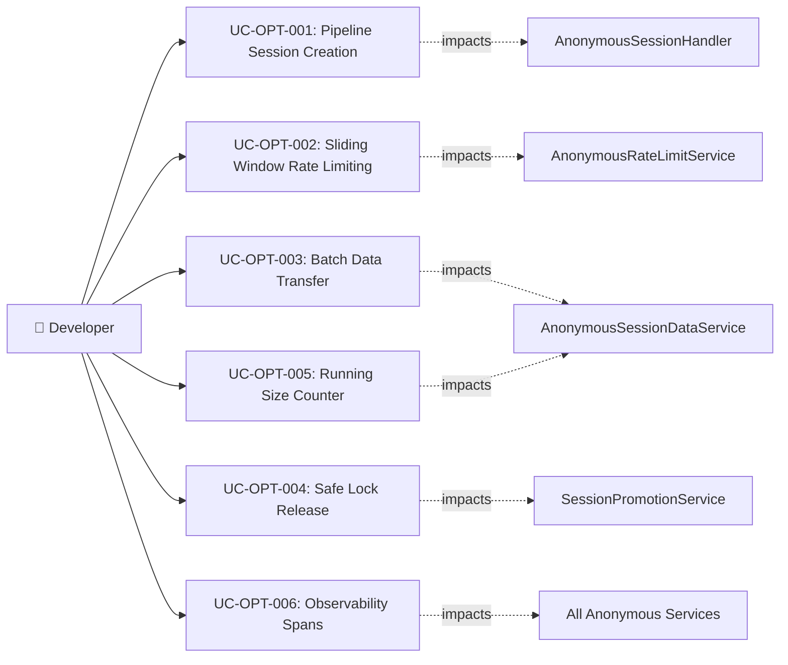

# Tài liệu phân tích nghiệp vụ: Anonymous Login Optimization

> Phân tích nghiệp vụ chi tiết — chia nhỏ theo use case, đặc tả ngữ nghĩa từng chức năng tối ưu hóa.

---

## 1. Tổng quan (Overview)

### 1.1 Bối cảnh nghiệp vụ (Business Context)

The auth-service has a fully functional anonymous login system. This optimization initiative targets performance, reliability, and observability improvements without changing external APIs or feature behavior.

The current implementation has measurable inefficiencies:
- **3-4 Redis round-trips** per anonymous session creation (should be 1)
- **N×2 Redis round-trips** per data transfer during promotion (should be ~3)
- **Burst-at-boundary** issue in fixed-window rate limiting (should be smooth)
- **Unsafe lock release** that can theoretically unlock another process's lock
- **O(N) size calculation** that scans all keys to check data limits

These inefficiencies impact latency under high concurrency and could cause subtle reliability issues in production (e.g., accidental lock release during Redis failover).

### 1.2 Mục tiêu (Objectives)

| # | Mục tiêu | KPI đo lường | Độ ưu tiên |
|---|---------|-------------|-----------|
| O-01 | Reduce anonymous session creation latency by 50%+ | P95 latency: target < 50ms (from ~100ms) | High |
| O-02 | Eliminate burst-at-boundary in rate limiting | Rate limit accuracy within 2% of true sliding window | High |
| O-03 | Reduce data transfer latency during promotion by 80%+ | P95 promotion overhead: target < 10ms (from ~50ms) | High |
| O-04 | Prevent accidental lock release by wrong owner | Zero incidents of cross-process lock release | Medium |
| O-05 | Reduce size calculation from O(N) to O(1) | P95 data store latency: target < 5ms (from ~20ms) | Medium |
| O-06 | Add observability spans for critical operations | 100% tracing coverage on anonymous session flows | Low |

### 1.3 Phạm vi (Scope)

| In Scope | Out of Scope |
|----------|-------------|
| Redis pipelining for session creation | New anonymous session features |
| Sliding window rate limiting (Lua script) | API contract changes |
| Batch data transfer during promotion | Database schema changes |
| Safe lock release with ownership verification | New endpoints |
| Running size counter optimization | UI/UX changes |
| Micrometer Observation spans | Load testing infrastructure |
| Redis memory optimization (field names) | Multi-tenant isolation |

### 1.4 Stakeholders & Actors

| Actor | Loại | Mô tả | Tương tác chính |
|-------|------|--------|----------------|
| Anonymous User | Primary | End user creating/using anonymous sessions | Experiences improved latency |
| Auth Service | System | The service being optimized | Internal optimization — no external behavior change |
| Redis | External System | In-memory data store | Receives pipelined commands, executes Lua scripts |
| DevOps/SRE | Secondary | Operations team | Benefits from observability improvements |

---

## 2. Use Case Diagram (tổng quan)



---

## 3. Danh sách Use Case (Use Case Index)

| UC-ID | Tên Use Case | Actor | Nhóm chức năng | Độ ưu tiên | Trạng thái |
|-------|-------------|-------|----------------|-----------|-----------|
| UC-OPT-001 | Pipeline Session Creation | System | Performance | High | Draft |
| UC-OPT-002 | Sliding Window Rate Limiting | System | Reliability | High | Draft |
| UC-OPT-003 | Batch Data Transfer | System | Performance | High | Draft |
| UC-OPT-004 | Safe Lock Release | System | Reliability | Medium | Draft |
| UC-OPT-005 | Running Size Counter | System | Performance | Medium | Draft |
| UC-OPT-006 | Observability Spans | System | Observability | Low | Draft |

---

## 4. Đặc tả Use Case chi tiết

### UC-OPT-001: Pipeline Session Creation

#### 4.1 Thông tin chung

| Mục | Nội dung |
|-----|----------|
| **Mã** | UC-OPT-001 |
| **Tên** | Pipeline Anonymous Session Creation |
| **Mô tả ngữ nghĩa** | Tối ưu hóa tạo anonymous session bằng cách gộp nhiều Redis commands thành 1 pipeline call, giảm network round-trips từ 3-4 xuống 1. Giá trị: giảm 50%+ latency cho mỗi session creation, tăng throughput dưới high concurrency. |
| **Actor** | System (internal optimization) |
| **Trigger** | Code refactoring — no external trigger change |
| **Độ ưu tiên** | High |
| **Tần suất** | Every anonymous session creation |
| **Nhóm chức năng** | Performance |

#### 4.2 Điều kiện

| Loại | Mô tả |
|------|--------|
| **Pre-conditions** | `AnonymousSessionHandler` currently makes 3+ sequential Redis calls |
| **Post-conditions (Success)** | Same session created, same Redis state, but via 1 pipeline round-trip |
| **Post-conditions (Failure)** | Pipeline fails → fallback to sequential calls |
| **Invariants** | External behavior unchanged — same API response, same Redis keys |

#### 4.3 Luồng chính (Basic Flow)

| Step | Actor Action | System Response | Data | Ghi chú |
|------|-------------|----------------|------|---------|
| 1 | - | Handler receives CreateAnonymousSessionCommand | Command | Same as before |
| 2 | - | Handler calls rate limit check (separate — must complete before pipeline) | Rate limit result | Cannot pipeline rate limit check with session creation |
| 3 | - | Handler generates sessionId + JWT token | UUID, JWT string | CPU-only, no Redis |
| 4 | - | Handler calls `redisTemplate.executePipelined` with: (a) HSET session hash, (b) EXPIRE session TTL | Pipeline batch | **CHANGED**: 2 sequential calls → 1 pipeline |
| 5 | - | Handler returns AnonymousSessionResult | Result | Same as before |

#### 4.4 Luồng thay thế (Alternative Flows)

##### AF-001: Pipeline failure fallback
- **Trigger**: `executePipelined()` throws exception
- **Steps**:
  1. Log warning: "Pipeline failed, falling back to sequential"
  2. Execute HSET and EXPIRE sequentially (original behavior)
- **Rejoin**: Step 5

#### 4.5 Luồng ngoại lệ (Exception Flows)

##### EF-001: Redis completely unavailable
- **Trigger**: Redis connection failure during pipeline
- **Error**: `503 Service Unavailable`
- **Handling**: Same as current — logged, propagated
- **Post-condition**: No session created

#### 4.6 Quy tắc nghiệp vụ (Business Rules)

| BR-ID | Quy tắc | Mô tả chi tiết | Validation |
|-------|---------|----------------|-----------|
| BR-OPT-001 | Pipeline atomicity not required | HSET and EXPIRE are independent operations — pipeline batching is safe even without atomicity | Integration test validates both commands execute |
| BR-OPT-002 | Rate limit check must precede pipeline | Rate limit is a gate — must complete before session creation starts | Code review: rate limit call before executePipelined |

#### 4.7 Yêu cầu phi chức năng (cho UC này)

| Loại | Yêu cầu | Target |
|------|---------|--------|
| Performance | Session creation P95 latency | < 50ms (from ~100ms) |
| Reliability | Pipeline fallback | 100% fallback success rate |

#### 4.8 Mockup / Wireframe Description

```
N/A — Internal code optimization.

Before:
  redisTemplate.opsForHash().putAll(sessionKey, sessionData)  // RTT 1
  redisTemplate.expire(sessionKey, sessionTtl)                 // RTT 2
  // Total: 2 RTTs (+ 1-2 for rate limit)

After:
  redisTemplate.executePipelined { connection ->
    connection.hashCommands().hSet(sessionKey.toByteArray(), hashMap)
    connection.keyCommands().expire(sessionKey.toByteArray(), ttlSeconds)
    null
  }
  // Total: 1 RTT (+ 1-2 for rate limit)
```

---

### UC-OPT-002: Sliding Window Rate Limiting

#### 4.1 Thông tin chung

| Mục | Nội dung |
|-----|----------|
| **Mã** | UC-OPT-002 |
| **Tên** | Sliding Window Counter Rate Limiting |
| **Mô tả ngữ nghĩa** | Thay thế fixed-window rate limiting (INCR+EXPIRE) bằng sliding window counter (Lua script). Fixed window có vấn đề burst-at-boundary: user có thể gửi 2× max requests trong 1 giây nếu straddle window boundary. Sliding window counter cung cấp smooth enforcement. Giá trị: chính xác hơn, ngăn chặn burst abuse tốt hơn. |
| **Actor** | System (internal optimization) |
| **Trigger** | Code refactoring — no external trigger change |
| **Độ ưu tiên** | High |
| **Tần suất** | Every anonymous token creation request |
| **Nhóm chức năng** | Reliability |

#### 4.2 Điều kiện

| Loại | Mô tả |
|------|--------|
| **Pre-conditions** | `AnonymousRateLimitService` uses fixed-window INCR+EXPIRE |
| **Post-conditions (Success)** | Same rate limiting behavior, smoother enforcement, no burst-at-boundary |
| **Post-conditions (Failure)** | Lua script error → fallback to fixed-window |
| **Invariants** | Same max-attempts and window-seconds configuration |

#### 4.3 Luồng chính (Basic Flow)

| Step | Actor Action | System Response | Data | Ghi chú |
|------|-------------|----------------|------|---------|
| 1 | - | Service receives IP address for rate limit check | IP string | Same as before |
| 2 | - | Service executes Lua script atomically: (a) INCR current window counter, (b) GET previous window counter, (c) calculate weighted sum: `prev × (1 - elapsed/window) + current` | Lua EVAL | **CHANGED**: 2 Redis calls → 1 Lua EVAL |
| 3 | - | If weighted sum > maxAttempts → throw AnonymousRateLimitedException | Exception | Same exception, same HTTP 429 |
| 4 | - | If within limit → return (allow) | void | Same as before |

#### 4.4 Luồng thay thế (Alternative Flows)

##### AF-001: Lua script not available
- **Trigger**: Redis version doesn't support EVAL (very unlikely with Redis 7+)
- **Steps**: Fall back to fixed-window INCR+EXPIRE
- **Rejoin**: Step 3

#### 4.5 Luồng ngoại lệ (Exception Flows)

##### EF-001: Redis unavailable
- **Trigger**: Redis connection failure
- **Error**: Fail-open (allow request through)
- **Handling**: Same as current — logged, fail-open
- **Post-condition**: Request allowed without rate limit check

#### 4.6 Quy tắc nghiệp vụ (Business Rules)

| BR-ID | Quy tắc | Mô tả chi tiết | Validation |
|-------|---------|----------------|-----------|
| BR-OPT-003 | Sliding window formula | `count = prev_count × ((window - elapsed) / window) + current_count` | Unit test with boundary cases |
| BR-OPT-004 | Lua script atomicity | Entire rate limit check+increment must be atomic (no race conditions) | Lua EVAL guarantees atomicity |
| BR-OPT-005 | Two-key design | Current window: `anon:rate:{ip}:{window_id}`, Previous: `anon:rate:{ip}:{window_id-1}` | Key pattern verification |

#### 4.7 Yêu cầu phi chức năng (cho UC này)

| Loại | Yêu cầu | Target |
|------|---------|--------|
| Performance | Rate limit check latency | < 5ms P95 (same as current) |
| Accuracy | Rate limit enforcement | Within 2% of true sliding window |

#### 4.8 Mockup / Wireframe Description

```
N/A — Internal code optimization.

Lua Script (sliding_window_rate_limit.lua):
  local current_key = KEYS[1]    -- anon:rate:{ip}:{current_window}
  local prev_key = KEYS[2]       -- anon:rate:{ip}:{prev_window}
  local max_attempts = tonumber(ARGV[1])
  local window_seconds = tonumber(ARGV[2])
  local elapsed = tonumber(ARGV[3])

  local current = tonumber(redis.call('INCR', current_key)) or 0
  if current == 1 then
    redis.call('EXPIRE', current_key, window_seconds * 2)
  end
  local prev = tonumber(redis.call('GET', prev_key)) or 0
  local weight = math.max(0, (window_seconds - elapsed) / window_seconds)
  local count = prev * weight + current

  if count > max_attempts then
    return -1  -- rate limited
  end
  return count
```

---

### UC-OPT-003: Batch Data Transfer

#### 4.1 Thông tin chung

| Mục | Nội dung |
|-----|----------|
| **Mã** | UC-OPT-003 |
| **Tên** | Batch Data Transfer During Promotion |
| **Mô tả ngữ nghĩa** | Tối ưu hóa data transfer từ anonymous session sang authenticated user bằng batch operations thay vì per-key GET+SET loop. Hiện tại mỗi data key cần 2 RTT (GET + SET). Batch sử dụng pipeline MGET + pipeline MSET giảm xuống ~3 RTT bất kể số keys. Giá trị: promotion nhanh hơn 80%, giảm Redis load. |
| **Actor** | System (internal optimization) |
| **Trigger** | Code refactoring in AnonymousSessionDataService.transferData() |
| **Độ ưu tiên** | High |
| **Tần suất** | Every session promotion |
| **Nhóm chức năng** | Performance |

#### 4.2 Điều kiện

| Loại | Mô tả |
|------|--------|
| **Pre-conditions** | `transferData()` uses SCAN + per-key GET + per-key SET |
| **Post-conditions (Success)** | Same data transferred, same Redis state, fewer RTTs |
| **Post-conditions (Failure)** | Fallback to per-key transfer |
| **Invariants** | All data keys transferred, TTLs set correctly |

#### 4.3 Luồng chính (Basic Flow)

| Step | Actor Action | System Response | Data | Ghi chú |
|------|-------------|----------------|------|---------|
| 1 | - | SCAN to collect all `anon:data:{sessionId}:*` keys into a list | List<String> | Same SCAN, but collect first |
| 2 | - | Pipeline MGET: batch-read all collected keys in 1 RTT | List<String?> | **CHANGED**: N×GET → 1 pipeline |
| 3 | - | Build target key list: `user:session_data:{userId}:{ns}:{key}` | Key mapping | CPU only |
| 4 | - | Pipeline: batch SET all target keys with TTL in 1 RTT | void | **CHANGED**: N×SET → 1 pipeline |
| 5 | - | Return DataTransferResult | itemCount, namespaces | Same as before |

#### 4.5 Luồng ngoại lệ (Exception Flows)

##### EF-001: Pipeline failure during batch transfer
- **Trigger**: Redis error during MGET or pipeline SET
- **Error**: Logged, partial result returned
- **Handling**: Mark transfer as `partial = true`, continue login
- **Post-condition**: Login succeeds, some data may be lost

#### 4.6 Quy tắc nghiệp vụ (Business Rules)

| BR-ID | Quy tắc | Mô tả chi tiết | Validation |
|-------|---------|----------------|-----------|
| BR-OPT-006 | SCAN before batch | Must collect all keys via SCAN before batch operations | Code review |
| BR-OPT-007 | Key ordering preserved | MGET returns values in same order as keys — use indexed mapping | Unit test with multiple keys |

#### 4.7 Yêu cầu phi chức năng (cho UC này)

| Loại | Yêu cầu | Target |
|------|---------|--------|
| Performance | Data transfer P95 latency | < 10ms (from ~50ms for 10 keys) |

---

### UC-OPT-004: Safe Lock Release

#### 4.1 Thông tin chung

| Mục | Nội dung |
|-----|----------|
| **Mã** | UC-OPT-004 |
| **Tên** | Safe Distributed Lock Release with Ownership Verification |
| **Mô tả ngữ nghĩa** | Thay thế simple `DELETE lockKey` bằng Lua-based conditional delete: chỉ xóa lock nếu value khớp UUID của process sở hữu. Ngăn chặn trường hợp process A acquire lock, lock hết TTL, process B acquire lock mới, process A gọi DELETE xóa nhầm lock của process B. Giá trị: đảm bảo tính toàn vẹn lock trong edge cases. |
| **Actor** | System (internal optimization) |
| **Trigger** | Code refactoring in SessionPromotionService |
| **Độ ưu tiên** | Medium |
| **Tần suất** | Every session promotion |
| **Nhóm chức năng** | Reliability |

#### 4.3 Luồng chính (Basic Flow)

| Step | Actor Action | System Response | Data | Ghi chú |
|------|-------------|----------------|------|---------|
| 1 | - | Generate UUID for lock value (not static "locked") | UUID string | **CHANGED**: static value → UUID |
| 2 | - | SET lock with UUID value: `SET anon:lock:{sid} {uuid} NX EX 30` | Boolean | Same SETNX, different value |
| 3 | - | Perform promotion (transfer, blacklist, delete session) | PromotionResult | Same as before |
| 4 | - | Release via Lua: `if GET(key) == uuid then DEL(key); return 1; end; return 0` | Lua EVAL | **CHANGED**: DEL → conditional Lua DEL |

#### 4.6 Quy tắc nghiệp vụ (Business Rules)

| BR-ID | Quy tắc | Mô tả chi tiết | Validation |
|-------|---------|----------------|-----------|
| BR-OPT-008 | UUID-based ownership | Lock value must be unique per acquisition attempt (UUID) | Code review |
| BR-OPT-009 | Lua conditional delete | Only delete if current value matches — prevents cross-process unlock | Unit test with simulated race |

---

### UC-OPT-005: Running Size Counter

#### 4.1 Thông tin chung

| Mục | Nội dung |
|-----|----------|
| **Mã** | UC-OPT-005 |
| **Tên** | Running Data Size Counter |
| **Mô tả ngữ nghĩa** | Thay thế SCAN+STRLEN loop để tính tổng data size bằng running counter `dataSize` trong session hash. Mỗi khi store data → HINCRBY dataSize newDataLength. Mỗi khi delete → HINCRBY dataSize -removedLength. Giá trị: O(1) thay vì O(N), giảm latency cho mọi data write. |
| **Actor** | System (internal optimization) |
| **Trigger** | Code refactoring in AnonymousSessionDataService |
| **Độ ưu tiên** | Medium |
| **Tần suất** | Every data store/delete operation |
| **Nhóm chức năng** | Performance |

#### 4.3 Luồng chính (Basic Flow)

| Step | Actor Action | System Response | Data | Ghi chú |
|------|-------------|----------------|------|---------|
| 1 | - | On storeData(): read `dataSize` from session hash via HGET | Long | **CHANGED**: SCAN+STRLEN → HGET |
| 2 | - | Check: `currentSize + newDataSize ≤ maxDataSizeBytes` | Boolean | Same validation |
| 3 | - | SET data key with value | void | Same as before |
| 4 | - | HINCRBY `anon:session:{sid}` `dataSize` `newDataSize` | void | **NEW**: increment counter |
| 5 | - | On deleteData(): get old value STRLEN, HINCRBY negative | void | **NEW**: decrement counter |

#### 4.6 Quy tắc nghiệp vụ (Business Rules)

| BR-ID | Quy tắc | Mô tả chi tiết | Validation |
|-------|---------|----------------|-----------|
| BR-OPT-010 | Counter consistency | Counter must be updated atomically with data write (pipeline both) | Integration test |
| BR-OPT-011 | Counter initialization | Set `dataSize=0` when creating session hash | Code review |
| BR-OPT-012 | Counter floor at zero | Never let counter go below 0 (guard in decrement logic) | Unit test |

---

## 5. Ma trận truy xuất (Traceability Matrix)

| UC-ID | FR-ID | NFR-ID | BR-ID | API Endpoint | Service Class |
|-------|-------|--------|-------|-------------|-----------|
| UC-OPT-001 | FR-OPT-001 | NFR-OPT-001 | BR-OPT-001, BR-OPT-002 | N/A (internal) | AnonymousSessionHandler |
| UC-OPT-002 | FR-OPT-002 | NFR-OPT-002, NFR-OPT-003 | BR-OPT-003, BR-OPT-004, BR-OPT-005 | N/A (internal) | AnonymousRateLimitService |
| UC-OPT-003 | FR-OPT-003 | NFR-OPT-001 | BR-OPT-006, BR-OPT-007 | N/A (internal) | AnonymousSessionDataService |
| UC-OPT-004 | FR-OPT-004 | NFR-OPT-004 | BR-OPT-008, BR-OPT-009 | N/A (internal) | SessionPromotionService |
| UC-OPT-005 | FR-OPT-005 | NFR-OPT-001 | BR-OPT-010, BR-OPT-011, BR-OPT-012 | N/A (internal) | AnonymousSessionDataService |
| UC-OPT-006 | FR-OPT-006 | NFR-OPT-005 | - | N/A (internal) | All anonymous services |

---

## 6. Yêu cầu chức năng tổng hợp (Functional Requirements)

| FR-ID | Tên | Mô tả | UC liên quan | Độ ưu tiên |
|-------|-----|--------|-------------|-----------|
| FR-OPT-001 | Pipeline session creation | Batch HSET+EXPIRE into single pipeline call | UC-OPT-001 | High |
| FR-OPT-002 | Sliding window rate limiting | Replace INCR+EXPIRE with Lua sliding window counter script | UC-OPT-002 | High |
| FR-OPT-003 | Batch data transfer | Replace per-key GET+SET with pipeline MGET+MSET | UC-OPT-003 | High |
| FR-OPT-004 | Safe lock release | Replace simple DEL with Lua conditional DEL (UUID ownership) | UC-OPT-004 | Medium |
| FR-OPT-005 | Running size counter | Maintain dataSize in session hash, use HINCRBY | UC-OPT-005 | Medium |
| FR-OPT-006 | Observability spans | Add Micrometer Observation spans to critical paths | UC-OPT-006 | Low |

---

## 7. Yêu cầu phi chức năng tổng hợp (Non-Functional Requirements)

| NFR-ID | Loại | Yêu cầu | Target | Measurement |
|--------|------|---------|--------|-------------|
| NFR-OPT-001 | Performance | Session creation P95 latency | < 50ms | APM monitoring |
| NFR-OPT-002 | Accuracy | Rate limiting precision | Within 2% of true sliding window | Unit test with boundary cases |
| NFR-OPT-003 | Performance | Rate limit check latency | < 5ms P95 | Redis metrics |
| NFR-OPT-004 | Reliability | Lock safety | Zero cross-process unlocks | Integration test with race simulation |
| NFR-OPT-005 | Observability | Tracing coverage | 100% of anonymous session flows | Span count verification |

---

## 8. Thuật ngữ nghiệp vụ (Glossary)

| Thuật ngữ | Định nghĩa | Context sử dụng |
|-----------|-----------|-----------------|
| Redis Pipelining | Sending multiple Redis commands in a single network round-trip to reduce latency | UC-OPT-001, UC-OPT-003 |
| Sliding Window Counter | Rate limiting algorithm using two adjacent fixed windows with weighted sum, eliminating burst-at-boundary | UC-OPT-002 |
| Burst-at-Boundary | Vulnerability in fixed-window rate limiting where 2× the limit can be sent by straddling the window boundary | UC-OPT-002 |
| Lua Conditional Delete | Server-side Lua script that only deletes a key if its value matches the expected owner UUID | UC-OPT-004 |
| Running Counter | A counter maintained in a Redis hash field, incremented/decremented with each data operation, avoiding full SCAN | UC-OPT-005 |
| Observation Span | A Micrometer Observation that creates a trace span for monitoring and distributed tracing | UC-OPT-006 |

---

## 9. Phụ lục (Appendix)

### 9.1 Research References
- [opensource_findings.md](./opensource_findings.md) — Redisson, Bucket4j, Resilience4j, Spring Data Redis evaluation
- [web_research.md](./web_research.md) — Redis pipelining, Lua scripting, sliding window, Kleppmann lock analysis
- [comparison_analysis.md](./comparison_analysis.md) — Comparison matrix and in-place optimization recommendation

### 9.2 Open Questions
- [ ] OQ-001: Should we add Resilience4j circuit breaker around Redis calls for anonymous sessions? Recommendation: not now — current fail-open approach is adequate.
- [ ] OQ-002: Should the running size counter have periodic reconciliation with actual SCAN+STRLEN? Recommendation: yes, as a background scheduled task.

### 9.3 Assumptions
- ⚠️ AS-001: Single-node Redis deployment (Redlock unnecessary) — Lý do: auth-service uses single Redis instance
- ⚠️ AS-002: Spring Data Redis executePipelined is available with Lettuce driver — Lý do: verified in Spring Data Redis docs
- ⚠️ AS-003: Redis 7+ supports Lua EVAL (confirmed in tech stack) — Lý do: auth-service uses Redis 7+
- ⚠️ AS-004: Optimizations are internal only — no API contract changes — Lý do: optimization scope

---

> **Next step**: Technical Specification (technical_spec.md)
> **Traceability**: Research Brief → Business Analysis → Technical Spec
