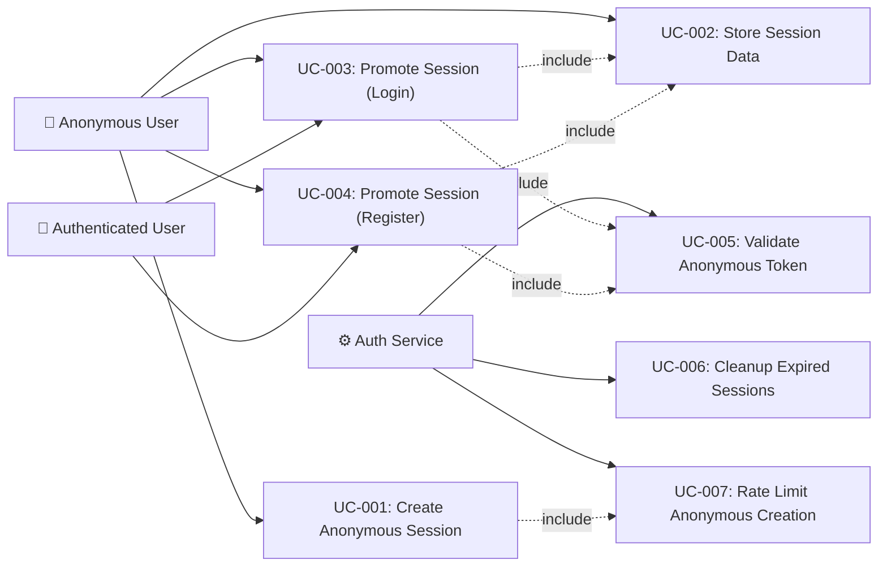

# Tài liệu phân tích nghiệp vụ: Anonymous Login Optimization

> Phân tích nghiệp vụ chi tiết — chia nhỏ theo use case, đặc tả ngữ nghĩa từng chức năng.

---

## 1. Tổng quan (Overview)

### 1.1 Bối cảnh nghiệp vụ (Business Context)

Hiện tại auth-service yêu cầu mọi user phải đăng ký/đăng nhập trước khi tương tác với hệ thống. Điều này tạo friction đáng kể cho first-time visitors — nhiều người rời đi trước khi hoàn tất đăng ký (industry average: 65-75% abandonment rate khi buộc đăng ký sớm).

Anonymous Login Optimization cho phép users bắt đầu sử dụng hệ thống ngay lập tức bằng cách cấp anonymous session. Khi user sẵn sàng, họ có thể đăng ký/đăng nhập và mọi dữ liệu tạm thời (cart, preferences, browsing history) sẽ được merge vào tài khoản chính thức — trải nghiệm liền mạch.

### 1.2 Mục tiêu (Objectives)

| # | Mục tiêu | KPI đo lường | Độ ưu tiên |
|---|---------|-------------|----------|
| O-01 | Giảm friction cho first-time users | Conversion rate tăng ≥ 15% | High |
| O-02 | Bảo toàn dữ liệu tạm thời qua session promotion | Data merge success rate ≥ 99% | High |
| O-03 | Bảo mật anonymous sessions khỏi abuse | Anonymous token abuse rate < 0.1% | High |
| O-04 | Duy trì hiệu năng hệ thống | Anonymous token response < 200ms (P95) | Medium |
| O-05 | Đơn giản hóa cleanup orphaned sessions | Orphaned session cleanup rate = 100% after TTL | Medium |

### 1.3 Phạm vi (Scope)

| In Scope | Out of Scope |
|----------|-------------|
| Anonymous token generation (JWT-based with session UUID) | Social login integration (Phase 2) |
| Anonymous session storage in Redis (cart, preferences) | Multi-device session synchronization |
| Session promotion: anonymous → authenticated with data merge | Third-party identity federation |
| Rate limiting & abuse prevention for anonymous sessions | Payment processing with anonymous tokens |
| Anonymous session TTL management & cleanup | Admin dashboard for session monitoring |
| API endpoints for anonymous auth flow | Complex analytics on anonymous behavior |
| Session fixation prevention during promotion | Audit trail for anonymous actions |

### 1.4 Stakeholders & Actors

| Actor | Loại | Mô tả | Tương tác chính |
|-------|------|--------|----------------|
| Anonymous User (Guest) | Primary | Người dùng chưa đăng ký/đăng nhập, truy cập hệ thống lần đầu | Nhận anonymous token, lưu dữ liệu tạm, browse sản phẩm |
| Authenticated User | Primary | Người dùng đã đăng nhập, có thể là guest vừa promote | Login/Register → trigger session promotion |
| Auth Service | System | Service xử lý authentication, token management | Generate/validate anonymous tokens, execute promotion |
| Redis Cache | External System | In-memory data store cho anonymous session data | Store/retrieve session data, manage TTL |
| Downstream Services | External System | Services tiêu thụ dữ liệu từ anonymous sessions (cart, catalog) | Read anonymous session data, receive merge events |

---

## 2. Use Case Diagram (tổng quan)



---

## 3. Danh sách Use Case (Use Case Index)

| UC-ID | Tên Use Case | Actor | Nhóm chức năng | Độ ưu tiên | Trạng thái |
|-------|-------------|-------|----------------|-----------|----------|
| UC-001 | Create Anonymous Session | Anonymous User | Anonymous Auth | High | Draft |
| UC-002 | Store Anonymous Session Data | Anonymous User | Session Data | High | Draft |
| UC-003 | Promote Session via Login | Anonymous User → Authenticated User | Session Promotion | High | Draft |
| UC-004 | Promote Session via Register | Anonymous User → Authenticated User | Session Promotion | High | Draft |
| UC-005 | Validate Anonymous Token | Auth Service | Token Management | High | Draft |
| UC-006 | Cleanup Expired Sessions | Auth Service (Scheduled) | Session Lifecycle | Medium | Draft |
| UC-007 | Rate Limit Anonymous Session Creation | Auth Service | Security | Medium | Draft |

---

## 4. Đặc tả Use Case chi tiết

### UC-001: Create Anonymous Session

#### 4.1 Thông tin chung

| Mục | Nội dung |
|-----|----------|
| **Mã** | UC-001 |
| **Tên** | Create Anonymous Session |
| **Mô tả ngữ nghĩa** | Khi user lần đầu truy cập hệ thống mà chưa có token, hệ thống tự động tạo một anonymous session với JWT token tạm thời. Điều này cho phép user bắt đầu tương tác ngay (duyệt sản phẩm, thêm vào cart) mà không cần đăng ký — giảm friction, tăng conversion rate. |
| **Actor** | Anonymous User (Guest) |
| **Trigger** | Client gọi `POST /api/v1/auth/anonymous` khi chưa có token hoặc token hết hạn |
| **Độ ưu tiên** | High |
| **Tần suất** | On-demand — mỗi khi có new visitor hoặc anonymous token expire |
| **Nhóm chức năng** | Anonymous Auth |

#### 4.2 Điều kiện

| Loại | Mô tả |
|------|--------|
| **Pre-conditions** | Client chưa có valid token (anonymous hoặc authenticated) |
| **Post-conditions (Success)** | Anonymous JWT token được cấp, Redis session được tạo với TTL, client có thể sử dụng token cho subsequent requests |
| **Post-conditions (Failure)** | Không tạo session, trả về error (rate limit exceeded hoặc server error) |
| **Invariants** | Tổng số anonymous sessions không vượt quá Redis memory capacity |

#### 4.3 Luồng chính (Basic Flow)

| Step | Actor Action | System Response | Data | Ghi chú |
|------|-------------|----------------|------|--------|
| 1 | Client gửi POST /api/v1/auth/anonymous với optional device fingerprint | Nhận request | `{ deviceFingerprint?: string }` | Fingerprint là optional, giúp nhận diện thiết bị |
| 2 | - | Kiểm tra rate limit (IP + fingerprint) | IP address, fingerprint | Gọi UC-007 |
| 3 | - | Generate session UUID (v4) | `sessionId: UUID` | Unique identifier cho anonymous session |
| 4 | - | Create anonymous JWT token: `sub=sessionId, type=anonymous, roles=[ROLE_ANONYMOUS]` | JWT claims | TTL ngắn hơn authenticated token (default: 24h) |
| 5 | - | Create Redis session entry: `anon:session:{sessionId}` = `{ createdAt, deviceFingerprint, data: {} }` | Redis Hash | TTL = 72h (longer than token for data retention) |
| 6 | - | Trả về AnonymousAuthResponse | `{ anonymousToken, sessionId, expiresIn, tokenType: "Bearer" }` | HTTP 201 Created |
| 7 | Client lưu anonymous token | - | LocalStorage / cookie | Client-side responsibility |

#### 4.4 Luồng thay thế (Alternative Flows)

##### AF-001: Client gửi kèm expired anonymous token
- **Trigger**: Tại Step 1, request header chứa expired anonymous JWT
- **Steps**:
  1. Extract sessionId từ expired token (không validate expiry)
  2. Check Redis session `anon:session:{sessionId}` còn tồn tại?
  3. Nếu còn → refresh token (generate new JWT với cùng sessionId), reset token TTL
  4. Nếu không → tạo session mới (về Basic Flow Step 3)
- **Rejoin**: Quay lại Step 6 của Basic Flow

##### AF-002: Client đã có valid authenticated token
- **Trigger**: Tại Step 1, request header chứa valid authenticated JWT
- **Steps**:
  1. Reject request — authenticated users không cần anonymous token
  2. Trả về 409 Conflict: "Already authenticated"
- **Rejoin**: Không — flow ends

#### 4.5 Luồng ngoại lệ (Exception Flows)

##### EF-001: Rate Limit Exceeded
- **Trigger**: Tại Step 2, IP/fingerprint đã vượt quá limit
- **Error**: `429 Too Many Requests`
- **Handling**:
  1. Trả về error response: "Anonymous session creation rate limit exceeded. Try again later."
  2. Include `Retry-After` header
- **Post-condition**: Không tạo session, rate limit counter không tăng thêm

##### EF-002: Redis Connection Failure
- **Trigger**: Tại Step 5, không thể kết nối Redis
- **Error**: `503 Service Unavailable`
- **Handling**:
  1. Log error với correlation ID
  2. Trả về error: "Service temporarily unavailable"
  3. Circuit breaker opens nếu lỗi liên tục
- **Post-condition**: Không tạo token (token và session phải đồng bộ)

#### 4.6 Quy tắc nghiệp vụ (Business Rules)

| BR-ID | Quy tắc | Mô tả chi tiết | Validation |
|-------|---------|----------------|----------|
| BR-001 | Anonymous token TTL | Anonymous JWT token expire trong 24h (configurable) | Token exp claim check |
| BR-002 | Anonymous session TTL | Redis session expire trong 72h (longer than token for data retention) | Redis TTL |
| BR-003 | Rate limit | Max 10 anonymous sessions per IP per hour | IP-based counter in Redis |
| BR-004 | Token claims | Anonymous JWT phải chứa: sub=sessionId, type=anonymous, roles=[ROLE_ANONYMOUS] | Token validation |
| BR-005 | No PII in anonymous token | Anonymous token KHÔNG được chứa email, name, hoặc bất kỳ PII | Code review |

#### 4.7 Yêu cầu phi chức năng (cho UC này)

| Loại | Yêu cầu | Target |
|------|---------|--------|
| Performance | Response time | < 200ms (P95) |
| Security | No PII in token | Zero PII fields |
| Availability | Service uptime | 99.9% |
| Concurrency | Max concurrent anonymous sessions | 10,000+ |

#### 4.8 Mockup / Wireframe Description

```
(No UI — this is an API-only interaction)

Client → POST /api/v1/auth/anonymous
         Headers: X-Device-Fingerprint: abc123 (optional)

Server → 201 Created
         {
           "anonymousToken": "eyJhbG...",
           "sessionId": "550e8400-e29b-41d4-a716-446655440000",
           "expiresIn": 86400,
           "tokenType": "Bearer"
         }
```

---

### UC-002: Store Anonymous Session Data

#### 4.1 Thông tin chung

| Mục | Nội dung |
|-----|----------|
| **Mã** | UC-002 |
| **Tên** | Store Anonymous Session Data |
| **Mô tả ngữ nghĩa** | Anonymous user cần lưu trữ dữ liệu tạm thời (cart items, preferences, browsing state) dưới anonymous session. Dữ liệu này sẽ tồn tại trong Redis và được merge vào authenticated account khi user login/register. Đây là core value proposition — giữ lại mọi thứ user đã làm trước khi đăng ký. |
| **Actor** | Anonymous User (Guest) |
| **Trigger** | Client gửi PUT /api/v1/auth/anonymous/session/data với anonymous token |
| **Độ ưu tiên** | High |
| **Tần suất** | Nhiều lần trong mỗi anonymous session (mỗi khi user thay đổi cart, preferences) |
| **Nhóm chức năng** | Session Data |

#### 4.2 Điều kiện

| Loại | Mô tả |
|------|--------|
| **Pre-conditions** | Client có valid anonymous JWT token, Redis session tồn tại |
| **Post-conditions (Success)** | Dữ liệu được lưu trong Redis hash dưới session key, TTL được refresh |
| **Post-conditions (Failure)** | Dữ liệu không được lưu, trả về error |
| **Invariants** | Session data size không vượt quá max limit (1MB per session) |

#### 4.3 Luồng chính (Basic Flow)

| Step | Actor Action | System Response | Data | Ghi chú |
|------|-------------|----------------|------|--------|
| 1 | Client gửi PUT /api/v1/auth/anonymous/session/data với anonymous token trong Authorization header | Validate anonymous token (UC-005) | JWT token | Bearer token |
| 2 | - | Extract sessionId từ token claims | `sessionId` | sub claim |
| 3 | - | Verify Redis session exists: `anon:session:{sessionId}` | Redis lookup | - |
| 4 | - | Validate request body size (≤ 1MB) | Request body | Size check |
| 5 | - | Update Redis hash fields: `HSET anon:session:{sessionId} data '{...}'` | Session data JSON | Atomic operation |
| 6 | - | Refresh session TTL | TTL reset to 72h | Keep alive |
| 7 | - | Return 200 OK with session metadata | `{ sessionId, updatedAt, expiresIn }` | - |

#### 4.4 Luồng thay thế (Alternative Flows)

##### AF-001: Partial data update (PATCH semantics)
- **Trigger**: Client sends specific fields to update, not full replacement
- **Steps**:
  1. Read current session data
  2. Deep merge: new fields overwrite existing, missing fields preserved
  3. Write merged data back
- **Rejoin**: Step 6 of Basic Flow

#### 4.5 Luồng ngoại lệ (Exception Flows)

##### EF-001: Session Expired/Not Found
- **Trigger**: Tại Step 3, Redis session không tồn tại (đã expire)
- **Error**: `404 Not Found`
- **Handling**:
  1. Trả về: "Anonymous session expired or not found"
  2. Client should create new anonymous session (UC-001)
- **Post-condition**: Data not saved

##### EF-002: Data Size Exceeded
- **Trigger**: Tại Step 4, request body > 1MB
- **Error**: `413 Payload Too Large`
- **Handling**:
  1. Reject request: "Session data exceeds maximum size (1MB)"
- **Post-condition**: Data not saved, existing data unchanged

#### 4.6 Quy tắc nghiệp vụ (Business Rules)

| BR-ID | Quy tắc | Mô tả chi tiết | Validation |
|-------|---------|----------------|----------|
| BR-006 | Max session data size | 1MB per anonymous session | Request body size check |
| BR-007 | Data format | Session data phải là valid JSON | JSON validation |
| BR-008 | TTL refresh on write | Mỗi lần write data, session TTL được refresh | Redis EXPIRE command |
| BR-009 | Namespace isolation | Session data keys isolated per session | Redis key prefix |

#### 4.7 Yêu cầu phi chức năng (cho UC này)

| Loại | Yêu cầu | Target |
|------|---------|--------|
| Performance | Write response time | < 100ms (P95) |
| Data integrity | Data consistency | Atomic writes |
| Storage | Max per session | 1MB |

#### 4.8 Mockup / Wireframe Description

```
Client → PUT /api/v1/auth/anonymous/session/data
         Headers: Authorization: Bearer <anonymous-token>
         Body: {
           "cart": { "items": [{"productId": 123, "qty": 2}] },
           "preferences": { "language": "vi", "theme": "dark" }
         }

Server → 200 OK
         {
           "sessionId": "550e8400-...",
           "updatedAt": "2025-01-20T10:30:00Z",
           "expiresIn": 259200
         }
```

---

### UC-003: Promote Session via Login

#### 4.1 Thông tin chung

| Mục | Nội dung |
|-----|----------|
| **Mã** | UC-003 |
| **Tên** | Promote Session via Login |
| **Mô tả ngữ nghĩa** | Khi anonymous user đăng nhập vào tài khoản đã có, hệ thống thực hiện session promotion: xác thực credentials → merge anonymous session data vào user account → cấp authenticated JWT → invalidate anonymous session. Đây là moment quan trọng nhất — user không được mất bất kỳ dữ liệu nào đã tích lũy. |
| **Actor** | Anonymous User → Authenticated User |
| **Trigger** | Client gửi POST /api/v1/auth/login với anonymous token trong header + login credentials trong body |
| **Độ ưu tiên** | High |
| **Tần suất** | On-demand — khi anonymous user quyết định login |
| **Nhóm chức năng** | Session Promotion |

#### 4.2 Điều kiện

| Loại | Mô tả |
|------|--------|
| **Pre-conditions** | Client có valid anonymous JWT token, user account tồn tại trong DB, credentials hợp lệ |
| **Post-conditions (Success)** | Authenticated JWT cấp, anonymous session data merged vào user, anonymous session invalidated |
| **Post-conditions (Failure)** | Anonymous session preserved (unchanged), login error returned |
| **Invariants** | Anonymous session data KHÔNG được mất trong quá trình promotion (atomic merge) |

#### 4.3 Luồng chính (Basic Flow)

| Step | Actor Action | System Response | Data | Ghi chú |
|------|-------------|----------------|------|--------|
| 1 | Client gửi POST /api/v1/auth/login với anonymous token trong `X-Anonymous-Token` header + credentials | Nhận request | `{ email, password }` + anonymous token | Dual token submission |
| 2 | - | Validate login credentials (existing LoginUseCase logic) | User entity | Reuse existing flow |
| 3 | - | Extract sessionId từ anonymous token | `sessionId` | Validate anonymous token (UC-005) |
| 4 | - | Read anonymous session data từ Redis: `HGET anon:session:{sessionId} data` | Session data JSON | May be empty |
| 5 | - | Execute data merge strategy: copy anonymous data → user's account data | Merge result | See BR-010 for merge strategy |
| 6 | - | Generate authenticated JWT (existing logic) | `accessToken, refreshToken` | Standard auth token |
| 7 | - | Invalidate anonymous session: `DEL anon:session:{sessionId}` | - | Prevent reuse |
| 8 | - | Return AuthResponse + merge result | `{ accessToken, refreshToken, expiresIn, mergedData: { cart, preferences } }` | Extended AuthResponse |

#### 4.4 Luồng thay thế (Alternative Flows)

##### AF-001: Login without anonymous token (no promotion needed)
- **Trigger**: Tại Step 1, no `X-Anonymous-Token` header present
- **Steps**:
  1. Execute standard login flow (existing LoginUseCase)
  2. Return standard AuthResponse
- **Rejoin**: Flow ends — no promotion logic executed

##### AF-002: Anonymous session already expired
- **Trigger**: Tại Step 4, Redis session not found (expired)
- **Steps**:
  1. Log warning: "Anonymous session expired before promotion"
  2. Continue with standard login (no data to merge)
  3. Return AuthResponse with `mergedData: null`
- **Rejoin**: Step 6 of Basic Flow

##### AF-003: Existing authenticated user already has data (merge conflict)
- **Trigger**: Tại Step 5, user already has cart items or preferences
- **Steps**:
  1. Apply merge strategy per BR-010:
     - Cart: UNION merge (anonymous items added to existing cart)
     - Preferences: authenticated user's preferences WIN (override anonymous)
  2. Return merged result with conflict resolution details
- **Rejoin**: Step 6 of Basic Flow

#### 4.5 Luồng ngoại lệ (Exception Flows)

##### EF-001: Invalid Credentials
- **Trigger**: Tại Step 2, email/password không hợp lệ
- **Error**: `401 Unauthorized`
- **Handling**:
  1. Return: "Invalid email or password"
  2. Anonymous session PRESERVED (user can try again)
- **Post-condition**: Anonymous session unchanged

##### EF-002: Merge Failure (partial)
- **Trigger**: Tại Step 5, data merge fails (e.g., downstream service unavailable)
- **Error**: `500 Internal Server Error` (but auth succeeds)
- **Handling**:
  1. Auth token already generated → return auth token
  2. Queue merge for retry (async)
  3. Return AuthResponse with `mergeStatus: "PENDING"`
  4. Do NOT invalidate anonymous session until merge completes
- **Post-condition**: User authenticated, merge queued for retry

#### 4.6 Quy tắc nghiệp vụ (Business Rules)

| BR-ID | Quy tắc | Mô tả chi tiết | Validation |
|-------|---------|----------------|----------|
| BR-010 | Data merge strategy | Cart: UNION merge (anonymous items added). Preferences: authenticated user WINS. Custom data: UNION with dedup by key. | Merge algorithm |
| BR-011 | Atomic promotion | Login + merge + invalidation phải atomic — nếu merge fails, anonymous session phải preserved | Transaction boundary |
| BR-012 | New session ID on promotion | Authenticated session ID phải khác anonymous session ID (session fixation prevention) | UUID comparison |
| BR-013 | Anonymous token invalidation | Anonymous token phải bị invalidate sau promotion thành công | Token blacklist or session deletion |

#### 4.7 Yêu cầu phi chức năng (cho UC này)

| Loại | Yêu cầu | Target |
|------|---------|--------|
| Performance | Total promotion time | < 500ms (P95) |
| Data integrity | Data merge success rate | ≥ 99% |
| Security | Session fixation prevention | New session ID always |
| Reliability | Merge retry on failure | Max 3 retries |

#### 4.8 Mockup / Wireframe Description

```
Client → POST /api/v1/auth/login
         Headers: 
           X-Anonymous-Token: <anonymous-jwt>
         Body: {
           "email": "user@example.com",
           "password": "secret123"
         }

Server → 200 OK
         {
           "accessToken": "eyJhbG...",
           "refreshToken": "eyJhbG...",
           "tokenType": "Bearer",
           "expiresIn": 3600,
           "sessionPromotion": {
             "status": "COMPLETED",
             "mergedData": {
               "cart": { "itemsMerged": 3 },
               "preferences": { "source": "authenticated" }
             },
             "previousSessionId": "550e8400-..."
           }
         }
```

---

### UC-004: Promote Session via Register

#### 4.1 Thông tin chung

| Mục | Nội dung |
|-----|----------|
| **Mã** | UC-004 |
| **Tên** | Promote Session via Register |
| **Mô tả ngữ nghĩa** | Khi anonymous user đăng ký tài khoản mới, hệ thống tạo user account → transfer toàn bộ anonymous session data sang user mới → cấp authenticated JWT → invalidate anonymous session. Đây là conversion moment — anonymous user trở thành registered user mà không mất bất kỳ dữ liệu nào. |
| **Actor** | Anonymous User → Authenticated User |
| **Trigger** | Client gửi POST /api/v1/auth/register với anonymous token trong header + registration data trong body |
| **Độ ưu tiên** | High |
| **Tần suất** | On-demand — khi anonymous user quyết định đăng ký |
| **Nhóm chức năng** | Session Promotion |

#### 4.2 Điều kiện

| Loại | Mô tả |
|------|--------|
| **Pre-conditions** | Client có valid anonymous JWT, email chưa tồn tại trong hệ thống |
| **Post-conditions (Success)** | User account created, anonymous data transferred, authenticated JWT cấp, anonymous session invalidated |
| **Post-conditions (Failure)** | No user created, anonymous session preserved |
| **Invariants** | Anonymous session data NOT lost during promotion |

#### 4.3 Luồng chính (Basic Flow)

| Step | Actor Action | System Response | Data | Ghi chú |
|------|-------------|----------------|------|--------|
| 1 | Client gửi POST /api/v1/auth/register với anonymous token + registration data | Nhận request | `{ email, password, fullName }` + anonymous token | - |
| 2 | - | Validate registration data (existing RegisterUseCase logic) | Validation result | Reuse existing validation |
| 3 | - | Check email uniqueness | DB query | Existing check |
| 4 | - | Create user account (existing logic) | User entity | - |
| 5 | - | Extract sessionId từ anonymous token | `sessionId` | UC-005 |
| 6 | - | Read anonymous session data từ Redis | Session data | - |
| 7 | - | Transfer data: associate anonymous data with new user ID | Transfer result | Direct transfer (no conflict — new user) |
| 8 | - | Generate authenticated JWT | `accessToken, refreshToken` | - |
| 9 | - | Invalidate anonymous session | `DEL anon:session:{sessionId}` | - |
| 10 | - | Return AuthResponse + transfer result | Extended AuthResponse | HTTP 201 |

#### 4.4 Luồng thay thế (Alternative Flows)

##### AF-001: Register without anonymous token
- **Trigger**: No `X-Anonymous-Token` header
- **Steps**: Execute standard registration (existing RegisterUseCase)
- **Rejoin**: Flow ends

#### 4.5 Luồng ngoại lệ (Exception Flows)

##### EF-001: Email Already Exists
- **Trigger**: Tại Step 3, email đã tồn tại
- **Error**: `409 Conflict`
- **Handling**: "Email already registered" — anonymous session preserved
- **Post-condition**: Anonymous session unchanged, no user created

##### EF-002: Registration Fails After Data Transfer
- **Trigger**: Tại Step 4, DB error during user creation
- **Error**: `500 Internal Server Error`
- **Handling**: Rollback — anonymous session preserved
- **Post-condition**: No user created, anonymous session unchanged

#### 4.6 Quy tắc nghiệp vụ (Business Rules)

| BR-ID | Quy tắc | Mô tả chi tiết | Validation |
|-------|---------|----------------|----------|
| BR-014 | Data transfer (not merge) | Register = new user → no conflict, data transferred directly | Simplified vs UC-003 |
| BR-015 | Atomic creation + transfer | User creation + data transfer phải atomic | @Transactional |

#### 4.7 Yêu cầu phi chức năng (cho UC này)

| Loại | Yêu cầu | Target |
|------|---------|--------|
| Performance | Total promotion time | < 500ms (P95) |
| Data integrity | Transfer success rate | ≥ 99.9% |
| Security | Session fixation prevention | New session ID |

#### 4.8 Mockup / Wireframe Description

```
Client → POST /api/v1/auth/register
         Headers: X-Anonymous-Token: <anonymous-jwt>
         Body: {
           "email": "new@example.com",
           "password": "secure123",
           "fullName": "New User"
         }

Server → 201 Created
         {
           "accessToken": "eyJhbG...",
           "refreshToken": "eyJhbG...",
           "tokenType": "Bearer",
           "expiresIn": 3600,
           "sessionPromotion": {
             "status": "COMPLETED",
             "transferredData": {
               "cart": { "itemsTransferred": 2 },
               "preferences": { "transferred": true }
             },
             "previousSessionId": "550e8400-..."
           }
         }
```

---

### UC-005: Validate Anonymous Token

#### 4.1 Thông tin chung

| Mục | Nội dung |
|-----|----------|
| **Mã** | UC-005 |
| **Tên** | Validate Anonymous Token |
| **Mô tả ngữ nghĩa** | Hệ thống cần validate anonymous JWT tokens trên mỗi request từ anonymous users. Validation bao gồm: JWT signature, expiry, token type = anonymous, session existence trong Redis. Đây là security gate — đảm bảo chỉ valid anonymous tokens mới truy cập được resources. |
| **Actor** | Auth Service (internal) |
| **Trigger** | Mỗi request từ anonymous user đến protected endpoint |
| **Độ ưu tiên** | High |
| **Tần suất** | Mỗi request (high frequency) |
| **Nhóm chức năng** | Token Management |

#### 4.2 Điều kiện

| Loại | Mô tả |
|------|--------|
| **Pre-conditions** | Request chứa JWT trong Authorization header |
| **Post-conditions (Success)** | SecurityContext populated với anonymous principal |
| **Post-conditions (Failure)** | Request rejected (401) |
| **Invariants** | Validation logic consistent cho mọi endpoints |

#### 4.3 Luồng chính (Basic Flow)

| Step | Actor Action | System Response | Data | Ghi chú |
|------|-------------|----------------|------|--------|
| 1 | - | Extract JWT từ Authorization header | Token string | Bearer prefix stripped |
| 2 | - | Validate JWT signature (HS512) | Signature check | Same key as authenticated tokens |
| 3 | - | Check JWT expiry | exp claim | - |
| 4 | - | Check token type claim = "anonymous" | type claim | Differentiate from authenticated |
| 5 | - | Extract sessionId (sub claim) | sessionId | - |
| 6 | - | Verify Redis session exists: `EXISTS anon:session:{sessionId}` | Boolean | Session may have been invalidated |
| 7 | - | Create AnonymousAuthenticationToken, set SecurityContext | Principal | Contains sessionId, roles |

#### 4.5 Luồng ngoại lệ (Exception Flows)

##### EF-001: Invalid/Expired Token
- **Error**: `401 Unauthorized` — "Anonymous token invalid or expired"

##### EF-002: Session Not Found in Redis
- **Error**: `401 Unauthorized` — "Anonymous session expired"

#### 4.6 Quy tắc nghiệp vụ (Business Rules)

| BR-ID | Quy tắc | Mô tả chi tiết | Validation |
|-------|---------|----------------|----------|
| BR-016 | Dual validation | Both JWT validity AND Redis session existence required | JWT + Redis check |
| BR-017 | Token type check | Must verify type=anonymous, reject if type mismatch | Claim inspection |

#### 4.7 Yêu cầu phi chức năng (cho UC này)

| Loại | Yêu cầu | Target |
|------|---------|--------|
| Performance | Validation time | < 10ms (P95) |
| Availability | Redis check | Circuit breaker (degrade to JWT-only if Redis down) |

#### 4.8 Mockup / Wireframe Description

```
(Internal filter — no direct API)

Request → JwtAuthenticationFilter
  → Check token type
  → If anonymous: AnonymousTokenValidator.validate(token)
  → If authenticated: existing validation logic
```

---

### UC-006: Cleanup Expired Sessions

#### 4.1 Thông tin chung

| Mục | Nội dung |
|-----|----------|
| **Mã** | UC-006 |
| **Tên** | Cleanup Expired Sessions |
| **Mô tả ngữ nghĩa** | Redis TTL tự động xóa expired sessions, nhưng scheduled job đảm bảo cleanup edge cases (e.g., sessions without TTL do bug, orphaned rate limit counters). Đảm bảo Redis memory được reclaim đúng cách. |
| **Actor** | Auth Service (Scheduled Job) |
| **Trigger** | Scheduled cron job (default: mỗi 6 tiếng) |
| **Độ ưu tiên** | Medium |
| **Tần suất** | 4 lần/ngày |
| **Nhóm chức năng** | Session Lifecycle |

#### 4.3 Luồng chính (Basic Flow)

| Step | Actor Action | System Response | Data | Ghi chú |
|------|-------------|----------------|------|--------|
| 1 | Scheduler triggers job | Scan Redis for `anon:session:*` keys without TTL | Key scan | SCAN command (non-blocking) |
| 2 | - | For each key without TTL: check `createdAt`, if > 72h → delete | Age check | Safety net |
| 3 | - | Scan rate limit counters `anon:ratelimit:*` without TTL → delete | Cleanup | - |
| 4 | - | Log cleanup summary: keys scanned, keys deleted | Metrics | - |

#### 4.5 Luồng ngoại lệ (Exception Flows)

##### EF-001: Redis Scan Timeout
- **Handling**: Log warning, retry next scheduled run
- **Post-condition**: Partial cleanup is acceptable

#### 4.6 Quy tắc nghiệp vụ (Business Rules)

| BR-ID | Quy tắc | Mô tả chi tiết | Validation |
|-------|---------|----------------|----------|
| BR-018 | Non-blocking scan | Use SCAN (not KEYS) to avoid blocking Redis | Code review |
| BR-019 | Age-based cleanup | Only delete sessions older than 72h without TTL | Timestamp check |

#### 4.7 Yêu cầu phi chức năng (cho UC này)

| Loại | Yêu cầu | Target |
|------|---------|--------|
| Performance | Scan time | < 30s for 100k keys |
| Reliability | No data loss | Only delete truly orphaned sessions |

#### 4.8 Mockup / Wireframe Description

```
(No UI — scheduled background job)

Log output:
  [INFO] AnonymousSessionCleanup: Scanned 1523 keys, deleted 12 orphaned sessions, deleted 5 stale rate limit counters
```

---

### UC-007: Rate Limit Anonymous Session Creation

#### 4.1 Thông tin chung

| Mục | Nội dung |
|-----|----------|
| **Mã** | UC-007 |
| **Tên** | Rate Limit Anonymous Session Creation |
| **Mô tả ngữ nghĩa** | Ngăn chặn abuse bằng cách giới hạn số anonymous sessions được tạo từ cùng IP/device. Prevents token farming, DoS via mass session creation, và Redis memory exhaustion. |
| **Actor** | Auth Service (internal) |
| **Trigger** | Mỗi request tạo anonymous session (UC-001 Step 2) |
| **Độ ưu tiên** | Medium |
| **Tần suất** | Mỗi anonymous session creation request |
| **Nhóm chức năng** | Security |

#### 4.3 Luồng chính (Basic Flow)

| Step | Actor Action | System Response | Data | Ghi chú |
|------|-------------|----------------|------|--------|
| 1 | - | Extract client IP from request | IP address | X-Forwarded-For aware |
| 2 | - | Extract device fingerprint (if provided) | Fingerprint | Optional |
| 3 | - | Check Redis counter: `INCR anon:ratelimit:{ip}` | Counter value | Auto-expires with TTL |
| 4 | - | If counter > limit (10/hour) → reject | Boolean | - |
| 5 | - | If first request, set TTL: `EXPIRE anon:ratelimit:{ip} 3600` | TTL | 1 hour window |
| 6 | - | Allow or deny | Pass/Fail | - |

#### 4.5 Luồng ngoại lệ (Exception Flows)

##### EF-001: Rate Limit Exceeded
- **Error**: `429 Too Many Requests` with `Retry-After` header

#### 4.6 Quy tắc nghiệp vụ (Business Rules)

| BR-ID | Quy tắc | Mô tả chi tiết | Validation |
|-------|---------|----------------|----------|
| BR-020 | IP-based rate limit | Max 10 anonymous sessions per IP per hour | Redis counter |
| BR-021 | Sliding window | 1-hour sliding window using Redis TTL | EXPIRE command |
| BR-022 | Fingerprint enhancement | If fingerprint available, rate limit per fingerprint too (max 5/hour) | Dual counter |

#### 4.7 Yêu cầu phi chức năng (cho UC này)

| Loại | Yêu cầu | Target |
|------|---------|--------|
| Performance | Rate limit check time | < 5ms |
| Security | False positive rate | < 0.01% |

#### 4.8 Mockup / Wireframe Description

```
(Internal middleware — no direct API)

Rate limit exceeded response:
  429 Too Many Requests
  Headers: Retry-After: 1800
  Body: {
    "error": "RATE_LIMIT_EXCEEDED",
    "message": "Too many anonymous sessions created. Try again later.",
    "retryAfter": 1800
  }
```

---

## 5. Ma trận truy xuất (Traceability Matrix)

| UC-ID | FR-ID | NFR-ID | BR-ID | Screen | API Endpoint | DB Entity |
|-------|-------|--------|-------|--------|-------------|----------|
| UC-001 | FR-001, FR-002 | NFR-001, NFR-003 | BR-001, BR-002, BR-003, BR-004, BR-005 | N/A (API) | POST /api/v1/auth/anonymous | Redis: anon:session:{id} |
| UC-002 | FR-003 | NFR-002 | BR-006, BR-007, BR-008, BR-009 | N/A (API) | PUT /api/v1/auth/anonymous/session/data | Redis: anon:session:{id} |
| UC-003 | FR-004, FR-005 | NFR-004, NFR-005 | BR-010, BR-011, BR-012, BR-013 | N/A (API) | POST /api/v1/auth/login (extended) | User table + Redis |
| UC-004 | FR-004, FR-006 | NFR-004, NFR-005 | BR-014, BR-015 | N/A (API) | POST /api/v1/auth/register (extended) | User table + Redis |
| UC-005 | FR-007 | NFR-006 | BR-016, BR-017 | N/A (Filter) | Internal filter | Redis |
| UC-006 | FR-008 | NFR-007 | BR-018, BR-019 | N/A (Job) | Scheduled job | Redis |
| UC-007 | FR-009 | NFR-008 | BR-020,