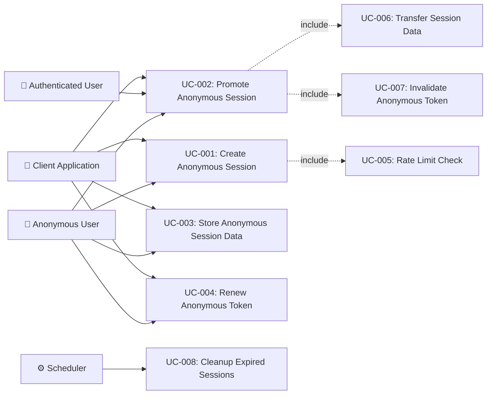

# Tài liệu phân tích nghiệp vụ: Anonymous Login Optimization

> Phân tích nghiệp vụ chi tiết — chia nhỏ theo use case, đặc tả ngữ nghĩa từng chức năng.

---

## 1. Tổng quan (Overview)

### 1.1 Bối cảnh nghiệp vụ (Business Context)

The auth-service currently only supports fully authenticated users — every API interaction requires a valid JWT obtained via login (username/password, SSO, or MFA). There is no mechanism for unauthenticated visitors to interact with the system in a limited capacity.

This creates friction for new users who want to explore features, add items to a cart, or set preferences before committing to account creation. Enterprise platforms and e-commerce systems commonly solve this with anonymous/guest sessions — short-lived, limited-permission sessions that can seamlessly upgrade to full authentication while preserving the user's accumulated data.

The business need is to reduce the barrier to first interaction, increase conversion from visitor to registered user, and provide a seamless "try before you sign up" experience without compromising security.

### 1.2 Mục tiêu (Objectives)

| # | Mục tiêu | KPI đo lường | Độ ưu tiên |
|---|---------|-------------|-----------|
| O-01 | Enable anonymous session creation without login credentials | Anonymous token generation rate, error rate | High |
| O-02 | Seamless session promotion from anonymous to authenticated | Promotion success rate, data retention rate after promotion | High |
| O-03 | Secure anonymous session lifecycle management | TTL compliance, cleanup rate, no orphaned data | High |
| O-04 | Prevent abuse of anonymous endpoints | Rate limit effectiveness, blocked abuse attempts | High |
| O-05 | Zero data loss during session promotion | Data items preserved pre/post promotion (100%) | Medium |

### 1.3 Phạm vi (Scope)

| In Scope | Out of Scope |
|----------|-------------|
| Anonymous JWT token generation with `type=anonymous` claim | Full guest checkout flow (order-service domain) |
| Anonymous session data storage in Redis with configurable TTL | UI/UX for anonymous user onboarding |
| Session promotion flow (anonymous → authenticated) with data transfer | Shopping cart domain logic (cart-service domain) |
| Anonymous session lifecycle (creation, renewal, expiration, cleanup) | Analytics/tracking of anonymous user behavior |
| IP-based rate limiting for anonymous token creation | Social login integration for anonymous promotion |
| CAPTCHA integration for abuse prevention | Mobile SDK for anonymous authentication |
| Configuration properties for anonymous session behavior | Multi-tenant anonymous session isolation |
| Integration with existing CQRS command/handler architecture | A/B testing of anonymous vs. forced-login flows |
| Anonymous token invalidation after promotion | Anonymous session data migration between Redis instances |

### 1.4 Stakeholders & Actors

| Actor | Loại | Mô tả | Tương tác chính |
|-------|------|--------|----------------|
| Anonymous User | Primary | A visitor who has not authenticated; identified only by anonymous session ID | Creates anonymous session, stores temporary data, promotes to authenticated |
| Authenticated User | Primary | A user with valid credentials who may have promoted from anonymous | Receives merged data from anonymous session after login |
| Client Application | Secondary | Frontend (web/mobile) that initiates anonymous sessions and manages tokens | Calls anonymous token API, stores token locally, sends promotion request |
| Auth Service | System | The authentication service handling anonymous token lifecycle | Generates tokens, manages Redis sessions, processes promotion |
| Redis | External System | In-memory data store for anonymous session data | Stores session data with TTL, supports atomic operations |
| Rate Limit Service | System | Existing rate limiting infrastructure | Enforces anonymous token creation limits per IP |

---

## 2. Use Case Diagram (tổng quan)



---

## 3. Danh sách Use Case (Use Case Index)

| UC-ID | Tên Use Case | Actor | Nhóm chức năng | Độ ưu tiên | Trạng thái |
|-------|-------------|-------|----------------|-----------|-----------|
| UC-001 | Create Anonymous Session | Anonymous User, Client | Session Creation | High | Draft |
| UC-002 | Promote Anonymous Session | Anonymous User → Authenticated User | Session Promotion | High | Draft |
| UC-003 | Store Anonymous Session Data | Anonymous User, Client | Session Data Management | High | Draft |
| UC-004 | Renew Anonymous Token | Anonymous User, Client | Token Lifecycle | Medium | Draft |
| UC-005 | Rate Limit Check | System (internal) | Security | High | Draft |
| UC-006 | Transfer Session Data | System (internal) | Data Migration | High | Draft |
| UC-007 | Invalidate Anonymous Token | System (internal) | Token Lifecycle | High | Draft |
| UC-008 | Cleanup Expired Sessions | System (Scheduler) | Maintenance | Low | Draft |

---

## 4. Đặc tả Use Case chi tiết

### UC-001: Create Anonymous Session

#### 4.1 Thông tin chung

| Mục | Nội dung |
|-----|----------|
| **Mã** | UC-001 |
| **Tên** | Create Anonymous Session |
| **Mô tả ngữ nghĩa** | Cho phép visitor tạo một phiên ẩn danh tạm thời để tương tác với hệ thống mà không cần đăng nhập. Giá trị: giảm ma sát cho người dùng mới, tăng tỷ lệ chuyển đổi từ visitor → registered user. |
| **Actor** | Anonymous User (via Client Application) |
| **Trigger** | Client gửi request tạo anonymous token khi user chưa có token nào |
| **Độ ưu tiên** | High |
| **Tần suất** | On-demand — mỗi khi visitor mới truy cập hệ thống |
| **Nhóm chức năng** | Session Creation |

#### 4.2 Điều kiện

| Loại | Mô tả |
|------|--------|
| **Pre-conditions** | User chưa có anonymous token hoặc authenticated token hợp lệ |
| **Post-conditions (Success)** | Anonymous JWT token được tạo và trả về client; anonymous session được khởi tạo trong Redis với TTL |
| **Post-conditions (Failure)** | Không có token nào được tạo; error response trả về client |
| **Invariants** | Tổng số anonymous sessions trong Redis không vượt quá memory quota |

#### 4.3 Luồng chính (Basic Flow)

| Step | Actor Action | System Response | Data | Ghi chú |
|------|-------------|----------------|------|---------|
| 1 | Client gửi `POST /api/v1/auth/anonymous` với IP address và optional device fingerprint | System nhận request | `{ deviceFingerprint?: string }` | IP được extract từ request header |
| 2 | - | System kiểm tra rate limit theo IP (UC-005) | IP address, rate limit config | Max 5 anonymous tokens/IP/hour (configurable) |
| 3 | - | System sinh UUID v4 cho anonymous session ID | `anonymousSessionId: UUID` | Unique identifier cho session |
| 4 | - | System sinh anonymous JWT token với claims: `sub=anonymousSessionId`, `type=anonymous`, `iat`, `exp`, `jti` | JWT token string | TTL = `app.security.anonymous.tokenTtlSeconds` (default 3600s) |
| 5 | - | System khởi tạo anonymous session trong Redis: key = `anon:session:{sessionId}`, value = `{}`, TTL = session data TTL | Redis entry | TTL = `app.security.anonymous.sessionDataTtlSeconds` (default 86400s = 24h) |
| 6 | - | System trả response với anonymous token, session ID, và expires_in | `{ token, sessionId, tokenType, expiresIn }` | HTTP 201 Created |
| 7 | Client lưu anonymous token vào local storage / cookie | - | - | Client responsibility |

#### 4.4 Luồng thay thế (Alternative Flows)

##### AF-001: Client already has valid anonymous token
- **Trigger**: Tại Step 1, Authorization header chứa valid anonymous token
- **Steps**:
  1. System parse existing token, extract session ID
  2. System check Redis session still exists
  3. If session exists: return existing token info (HTTP 200 OK)
  4. If session expired: proceed with Basic Flow from Step 3 (new session)
- **Rejoin**: Step 6 của Basic Flow

##### AF-002: CAPTCHA required (suspicious activity)
- **Trigger**: Tại Step 2, rate limit counter approaching threshold (e.g., 3rd attempt within window)
- **Steps**:
  1. System returns `HTTP 429` with `captcha_required: true`
  2. Client displays CAPTCHA challenge
  3. Client resends request with `captchaToken` field
  4. System validates CAPTCHA via `CaptchaGateway`
  5. If valid: proceed with Basic Flow from Step 3
- **Rejoin**: Step 3 của Basic Flow

#### 4.5 Luồng ngoại lệ (Exception Flows)

##### EF-001: Rate Limit Exceeded
- **Trigger**: Tại Step 2 khi IP đã vượt quá giới hạn anonymous token creation
- **Error**: `429 Too Many Requests`
- **Handling**:
  1. Hiển thị thông báo lỗi: "Too many anonymous session requests. Please try again later."
  2. Response includes `Retry-After` header with seconds until rate limit resets
- **Post-condition**: Không tạo token, rate limit counter giữ nguyên

##### EF-002: Redis Unavailable
- **Trigger**: Tại Step 5 khi Redis connection fails
- **Error**: `503 Service Unavailable`
- **Handling**:
  1. Log error with details
  2. Return error response: "Anonymous sessions are temporarily unavailable."
  3. Circuit breaker may open for subsequent requests
- **Post-condition**: Token was generated but session not stored — token is invalid since session lookup will fail

#### 4.6 Quy tắc nghiệp vụ (Business Rules)

| BR-ID | Quy tắc | Mô tả chi tiết | Validation |
|-------|---------|----------------|-----------|
| BR-001 | Anonymous token TTL | Anonymous JWT tokens expire after configurable TTL (default 1 hour). Shorter than authenticated access tokens to limit abuse window. | `exp` claim in JWT, server-side validation |
| BR-002 | Session data TTL | Anonymous session data in Redis expires after configurable TTL (default 24 hours). Longer than token TTL to allow token renewal. | Redis key TTL |
| BR-003 | Rate limit per IP | Maximum N anonymous token creations per IP per time window (default: 5 per hour). | Redis-based counter with sliding window |
| BR-004 | Anonymous tokens do NOT count toward maxSessions | Anonymous sessions are separate from authenticated session limits (`SessionProperties.maxSessions`). | `SessionPolicyService` excludes anonymous sessions |
| BR-005 | Anonymous JWT uses same RS256 signing key | Anonymous tokens are signed with the same key pair as authenticated tokens. Distinguished by `type=anonymous` claim. | `JwtService` signing logic |
| BR-006 | Maximum anonymous data size | Anonymous session data in Redis is limited to configurable max size (default 64KB) to prevent abuse. | Size check before Redis write |

#### 4.7 Yêu cầu phi chức năng (cho UC này)

| Loại | Yêu cầu | Target |
|------|---------|--------|
| Performance | Response time for token generation | < 100ms P95 |
| Security | Rate limiting | Max 5 anonymous tokens/IP/hour |
| Availability | Service uptime | 99.9% (Redis dependency) |
| Concurrency | Concurrent token creation requests | 500+ req/s |

#### 4.8 Mockup / Wireframe Description

```
N/A — This is a backend API endpoint.
Client integration is out of scope.

API Contract:
POST /api/v1/auth/anonymous
Request:  { "deviceFingerprint": "abc123" }   (optional)
Response: {
  "token": "eyJhbGciOi...",
  "sessionId": "550e8400-e29b-41d4-a716-446655440000",
  "tokenType": "Bearer",
  "expiresIn": 3600
}
```

---

### UC-002: Promote Anonymous Session

#### 4.1 Thông tin chung

| Mục | Nội dung |
|-----|----------|
| **Mã** | UC-002 |
| **Tên** | Promote Anonymous Session |
| **Mô tả ngữ nghĩa** | Nâng cấp phiên ẩn danh thành phiên xác thực — user đăng nhập hoặc đăng ký, hệ thống tự động chuyển dữ liệu tạm thời (cart, preferences) sang tài khoản đã xác thực. Giá trị: trải nghiệm liền mạch, user không mất dữ liệu khi chuyển từ browsing sang mua hàng. |
| **Actor** | Anonymous User (transitioning to Authenticated User) |
| **Trigger** | User đăng nhập hoặc đăng ký trong khi đang có anonymous session |
| **Độ ưu tiên** | High |
| **Tần suất** | On-demand — mỗi khi anonymous user quyết định đăng nhập |
| **Nhóm chức năng** | Session Promotion |

#### 4.2 Điều kiện

| Loại | Mô tả |
|------|--------|
| **Pre-conditions** | User có valid anonymous JWT token; anonymous session tồn tại trong Redis |
| **Post-conditions (Success)** | Authenticated JWT tokens (access + refresh) issued; anonymous session data transferred to authenticated user namespace in Redis; anonymous token invalidated; anonymous Redis session deleted |
| **Post-conditions (Failure)** | Anonymous session remains active; authentication error returned |
| **Invariants** | No data loss during promotion; promotion is atomic (all-or-nothing) |

#### 4.3 Luồng chính (Basic Flow)

| Step | Actor Action | System Response | Data | Ghi chú |
|------|-------------|----------------|------|---------|
| 1 | Client gửi `POST /api/v1/auth/login` với credentials + `anonymousSessionId` header/field | System nhận login request | `{ username, password, anonymousSessionId?, captchaToken?, deviceFingerprint? }` | `anonymousSessionId` là optional — chỉ present khi có anonymous session |
| 2 | - | System xác thực credentials qua existing LoginHandler flow | User entity | Reuse toàn bộ LoginHandler logic (password check, rate limit, CAPTCHA, MFA) |
| 3 | - | If credentials valid: System kiểm tra `anonymousSessionId` có tồn tại trong Redis | Redis lookup | Key: `anon:session:{sessionId}` |
| 4 | - | System acquires distributed lock on anonymous session ID | Redis lock: `anon:lock:{sessionId}` TTL=30s | Prevents concurrent promotion of same session |
| 5 | - | System reads all anonymous session data from Redis | Session data map | Key pattern: `anon:data:{sessionId}:*` |
| 6 | - | System transfers data to authenticated user namespace: `user:session_data:{userId}:*` (UC-006) | Migrated data | Merge strategy: append for collections, last-write-wins for scalars |
| 7 | - | System invalidates anonymous JWT token (UC-007): add JTI to blacklist | Token blacklist entry | Prevents reuse of anonymous token |
| 8 | - | System deletes anonymous session from Redis | Deleted keys | `anon:session:{sessionId}`, `anon:data:{sessionId}:*` |
| 9 | - | System releases distributed lock | Lock released | `anon:lock:{sessionId}` deleted |
| 10 | - | System generates authenticated tokens (access + refresh) via existing TokenGenerator | AuthResponse | Reuse TokenGenerator.generateAuthResponse() |
| 11 | - | System returns auth response with promotion metadata | `{ accessToken, refreshToken, ..., promotedFromAnonymous: true, dataTransferred: { itemCount } }` | HTTP 200 OK |

#### 4.4 Luồng thay thế (Alternative Flows)

##### AF-001: Anonymous session has expired
- **Trigger**: Tại Step 3, `anonymousSessionId` không tồn tại trong Redis (TTL expired)
- **Steps**:
  1. System logs info: "Anonymous session expired, proceeding with normal login"
  2. System continues with standard login flow (no data transfer)
  3. Response includes `promotedFromAnonymous: false`
- **Rejoin**: Step 10 của Basic Flow

##### AF-002: Login via registration (new account)
- **Trigger**: Client gửi `POST /api/v1/auth/register` với `anonymousSessionId`
- **Steps**:
  1. System processes registration via existing RegisterHandler
  2. If registration successful, system performs promotion (Steps 3-9)
  3. Return authenticated tokens with promotion metadata
- **Rejoin**: Step 10 của Basic Flow

##### AF-003: MFA required after credentials validation
- **Trigger**: Tại Step 2, user has MFA enabled
- **Steps**:
  1. System returns MFA challenge token (existing flow)
  2. Client submits MFA code with `anonymousSessionId`
  3. System verifies MFA code
  4. System proceeds with promotion (Steps 3-9)
- **Rejoin**: Step 3 của Basic Flow

#### 4.5 Luồng ngoại lệ (Exception Flows)

##### EF-001: Invalid Credentials
- **Trigger**: Tại Step 2 khi credentials không hợp lệ
- **Error**: `401 Unauthorized`
- **Handling**:
  1. Return standard login error response
  2. Anonymous session remains active — user can retry
  3. Rate limit counter incremented
- **Post-condition**: Anonymous session unchanged, login failed

##### EF-002: Concurrent Promotion (Lock Acquisition Failed)
- **Trigger**: Tại Step 4 khi another request is already promoting the same session
- **Error**: `409 Conflict`
- **Handling**:
  1. Return error: "This anonymous session is currently being promoted. Please try again."
  2. Client may retry after short delay
- **Post-condition**: No state changes; original promotion continues

##### EF-003: Data Transfer Failure (Redis Error)
- **Trigger**: Tại Step 6 khi Redis write fails during data transfer
- **Error**: Logged but does not block login
- **Handling**:
  1. Log error with session ID and user ID
  2. Authentication succeeds (tokens issued)
  3. Response includes `dataTransferred: { error: "partial_failure", itemCount: 0 }`
  4. Anonymous session data may be orphaned (cleaned up by TTL)
- **Post-condition**: User is authenticated but anonymous data may be lost

#### 4.6 Quy tắc nghiệp vụ (Business Rules)

| BR-ID | Quy tắc | Mô tả chi tiết | Validation |
|-------|---------|----------------|-----------|
| BR-007 | Promotion is one-time | Each anonymous session can only be promoted once. After promotion, session is destroyed. | Redis lock + delete after promotion |
| BR-008 | Promotion is atomic | Data transfer and token invalidation happen as a single logical operation. If data transfer fails, login still succeeds but data is marked as lost. | Try-catch with degraded response |
| BR-009 | Merge strategy | Collection data (cart items, wishlists) → append/merge. Scalar data (preferences, locale) → anonymous value takes precedence if authenticated user hasn't set it (last-write-wins with anonymous preference). | Merge logic in data transfer service |
| BR-010 | Anonymous token blacklisted after promotion | The JTI of the anonymous token is added to the token blacklist to prevent reuse. | `TokenBlacklistRepository` insert |
| BR-011 | Promotion metadata in response | Login/register response includes `promotedFromAnonymous` flag and transfer summary. | Response DTO extension |

#### 4.7 Yêu cầu phi chức năng (cho UC này)

| Loại | Yêu cầu | Target |
|------|---------|--------|
| Performance | Promotion adds max overhead to login | < 50ms additional latency |
| Security | Distributed lock on promotion | Max 30s lock TTL, automatic release |
| Reliability | Data transfer idempotency | Re-runnable without side effects |
| Concurrency | Concurrent promotion prevention | Redis SETNX-based lock |

#### 4.8 Mockup / Wireframe Description

```
N/A — Backend API.

API Contract (extended login):
POST /api/v1/auth/login
Request: {
  "username": "john",
  "password": "secret",
  "anonymousSessionId": "550e8400-e29b-41d4-a716-446655440000",
  "deviceFingerprint": "abc123"
}
Response: {
  "accessToken": "eyJhbGciOi...",
  "refreshToken": "eyJhbGciOi...",
  "tokenType": "Bearer",
  "expiresIn": 900,
  "promotedFromAnonymous": true,
  "dataTransferred": { "itemCount": 3 }
}
```

---

### UC-003: Store Anonymous Session Data

#### 4.1 Thông tin chung

| Mục | Nội dung |
|-----|----------|
| **Mã** | UC-003 |
| **Tên** | Store Anonymous Session Data |
| **Mô tả ngữ nghĩa** | Cho phép anonymous user lưu dữ liệu tạm thời (cart items, preferences, form progress) vào Redis session. Downstream services gọi auth-service API để đọc/ghi session data. Giá trị: user không mất progress khi chưa đăng nhập. |
| **Actor** | Anonymous User (via Client or downstream services) |
| **Trigger** | Client/service gửi request lưu data vào anonymous session |
| **Độ ưu tiên** | High |
| **Tần suất** | Frequent — multiple times per anonymous session |
| **Nhóm chức năng** | Session Data Management |

#### 4.2 Điều kiện

| Loại | Mô tả |
|------|--------|
| **Pre-conditions** | Valid anonymous JWT token; anonymous session exists in Redis |
| **Post-conditions (Success)** | Data stored in Redis under session namespace with TTL refreshed |
| **Post-conditions (Failure)** | Data not stored; error returned |
| **Invariants** | Total session data size ≤ max allowed (default 64KB) |

#### 4.3 Luồng chính (Basic Flow)

| Step | Actor Action | System Response | Data | Ghi chú |
|------|-------------|----------------|------|---------|
| 1 | Client gửi `PUT /api/v1/auth/anonymous/session/data` với anonymous token trong Authorization header và data payload | System validates anonymous token | `{ namespace: string, key: string, value: any }` | Bearer token authentication |
| 2 | - | System extracts `sessionId` from token `sub` claim; validates `type=anonymous` | Session ID | Reject if token type is not `anonymous` |
| 3 | - | System checks session exists in Redis | Session lookup | Key: `anon:session:{sessionId}` |
| 4 | - | System checks data size constraint (current + new ≤ 64KB) | Size calculation | BR-006 enforcement |
| 5 | - | System stores data in Redis: key = `anon:data:{sessionId}:{namespace}:{key}`, TTL = session TTL | Redis SET with TTL | TTL refreshed on each write |
| 6 | - | System returns success response | `{ stored: true, namespace, key }` | HTTP 200 OK |

#### 4.4 Luồng thay thế (Alternative Flows)

##### AF-001: Read session data
- **Trigger**: Client gửi `GET /api/v1/auth/anonymous/session/data?namespace=cart`
- **Steps**:
  1. System validates anonymous token
  2. System reads all keys under `anon:data:{sessionId}:{namespace}:*`
  3. System returns data map
- **Rejoin**: N/A (separate read flow)

#### 4.5 Luồng ngoại lệ (Exception Flows)

##### EF-001: Session Expired
- **Trigger**: Tại Step 3 khi session không tồn tại trong Redis
- **Error**: `404 Not Found`
- **Handling**:
  1. Return: "Anonymous session has expired or does not exist."
  2. Client should create new anonymous session (UC-001)
- **Post-condition**: No data stored

##### EF-002: Data Size Exceeded
- **Trigger**: Tại Step 4 khi total data size would exceed limit
- **Error**: `413 Payload Too Large`
- **Handling**:
  1. Return: "Anonymous session data limit exceeded (max 64KB)."
- **Post-condition**: No data stored, existing data unchanged

#### 4.6 Quy tắc nghiệp vụ (Business Rules)

| BR-ID | Quy tắc | Mô tả chi tiết | Validation |
|-------|---------|----------------|-----------|
| BR-006 | Maximum data size | Total session data ≤ 64KB (configurable). Prevents abuse. | Size calculation before write |
| BR-012 | Namespace isolation | Data is organized by namespace (e.g., `cart`, `preferences`). | Key structure in Redis |
| BR-013 | TTL refresh on write | Each data write refreshes the session TTL | Redis EXPIRE command after SET |

#### 4.7 Yêu cầu phi chức năng (cho UC này)

| Loại | Yêu cầu | Target |
|------|---------|--------|
| Performance | Data read/write latency | < 20ms P95 |
| Security | Token validation | Every request validates anonymous token |
| Availability | Redis uptime | 99.9% |

#### 4.8 Mockup / Wireframe Description

```
N/A — Backend API.

PUT /api/v1/auth/anonymous/session/data
Authorization: Bearer <anonymous_token>
{ "namespace": "cart", "key": "items", "value": [{"sku":"ABC","qty":2}] }

GET /api/v1/auth/anonymous/session/data?namespace=cart
Authorization: Bearer <anonymous_token>
Response: { "items": [{"sku":"ABC","qty":2}] }
```

---

### UC-004: Renew Anonymous Token

#### 4.1 Thông tin chung

| Mục | Nội dung |
|-----|----------|
| **Mã** | UC-004 |
| **Tên** | Renew Anonymous Token |
| **Mô tả ngữ nghĩa** | Anonymous tokens có TTL ngắn (1 hour). Khi token gần hết hạn, client có thể renew để tiếp tục phiên mà không mất session data. Giá trị: UX liền mạch cho user đang tích cực sử dụng nhưng chưa muốn đăng nhập. |
| **Actor** | Anonymous User (via Client) |
| **Trigger** | Client detects anonymous token nearing expiration and requests renewal |
| **Độ ưu tiên** | Medium |
| **Tần suất** | On-demand — when token approaches expiration |
| **Nhóm chức năng** | Token Lifecycle |

#### 4.2 Điều kiện

| Loại | Mô tả |
|------|--------|
| **Pre-conditions** | Valid (not yet expired) anonymous JWT token; anonymous session still exists in Redis |
| **Post-conditions (Success)** | New anonymous JWT token issued with same session ID; old token JTI blacklisted |
| **Post-conditions (Failure)** | No new token issued; client must create new anonymous session |
| **Invariants** | Session data in Redis unchanged; session ID remains the same |

#### 4.3 Luồng chính (Basic Flow)

| Step | Actor Action | System Response | Data | Ghi chú |
|------|-------------|----------------|------|---------|
| 1 | Client gửi `POST /api/v1/auth/anonymous/renew` với current anonymous token | System validates current token | Authorization: Bearer header | Token must still be valid (not expired) |
| 2 | - | System extracts session ID from token `sub`, validates `type=anonymous` | Session ID | - |
| 3 | - | System checks session exists in Redis | Redis lookup | If session expired, reject |
| 4 | - | System rate-limit check for renewal | IP-based | Prevent rapid renewal abuse |
| 5 | - | System generates new anonymous JWT with same session ID, new JTI, new expiry | New JWT | Same `sub` (sessionId), new `jti`, new `exp` |
| 6 | - | System blacklists old token JTI | Blacklist entry | Prevent old token reuse |
| 7 | - | System refreshes session TTL in Redis | Redis EXPIRE | Reset session data TTL |
| 8 | - | System returns new token | `{ token, sessionId, tokenType, expiresIn }` | HTTP 200 OK |

#### 4.4 Luồng thay thế (Alternative Flows)

None — renewal is a simple token swap.

#### 4.5 Luồng ngoại lệ (Exception Flows)

##### EF-001: Token Already Expired
- **Trigger**: Tại Step 1 khi token đã hết hạn
- **Error**: `401 Unauthorized`
- **Handling**:
  1. Return: "Anonymous token has expired. Create a new anonymous session."
- **Post-condition**: Client must call UC-001

##### EF-002: Session Not Found
- **Trigger**: Tại Step 3 khi Redis session đã hết hạn (TTL)
- **Error**: `404 Not Found`
- **Handling**:
  1. Return: "Anonymous session has expired."
- **Post-condition**: Client must call UC-001

#### 4.6 Quy tắc nghiệp vụ (Business Rules)

| BR-ID | Quy tắc | Mô tả chi tiết | Validation |
|-------|---------|----------------|-----------|
| BR-014 | Same session ID | Renewed token has the same `sub` (session ID) as the original | Token generation logic |
| BR-015 | Old token invalidated | Previous token JTI is blacklisted upon renewal | Token blacklist check in JwtAuthFilter |
| BR-016 | Max renewals | Maximum number of renewals per session (default: 24, i.e., 24 hours of 1-hour tokens) | Counter in Redis |

#### 4.7 Yêu cầu phi chức năng (cho UC này)

| Loại | Yêu cầu | Target |
|------|---------|--------|
| Performance | Renewal response time | < 50ms P95 |
| Security | Old token invalidation | Immediate blacklist |

#### 4.8 Mockup / Wireframe Description

```
N/A — Backend API.

POST /api/v1/auth/anonymous/renew
Authorization: Bearer <current_anonymous_token>
Response: {
  "token": "eyJhbGciOi...(new)",
  "sessionId": "550e8400-e29b-41d4-a716-446655440000",
  "tokenType": "Bearer",
  "expiresIn": 3600
}
```

---

## 5. Ma trận truy xuất (Traceability Matrix)

| UC-ID | FR-ID | NFR-ID | BR-ID | Screen | API Endpoint | DB Entity / Redis Key |
|-------|-------|--------|-------|--------|-------------|-----------|
| UC-001 | FR-001, FR-002 | NFR-001, NFR-002 | BR-001, BR-002, BR-003, BR-004, BR-005 | N/A | POST /api/v1/auth/anonymous | Redis: `anon:session:{id}` |
| UC-002 | FR-003, FR-004, FR-005 | NFR-003, NFR-004 | BR-007, BR-008, BR-009, BR-010, BR-011 | N/A | POST /api/v1/auth/login (extended) | Redis: `anon:*`, `user:session_data:*`; DB: token_blacklist |
| UC-003 | FR-006, FR-007 | NFR-001 | BR-006, BR-012, BR-013 | N/A | PUT/GET /api/v1/auth/anonymous/session/data | Redis: `anon:data:{id}:*` |
| UC-004 | FR-008 | NFR-001 | BR-014, BR-015, BR-016 | N/A | POST /api/v1/auth/anonymous/renew | Redis: `anon:session:{id}`; DB: token_blacklist |

---

## 6. Yêu cầu chức năng tổng hợp (Functional Requirements)

| FR-ID | Tên | Mô tả | UC liên quan | Độ ưu tiên |
|-------|-----|--------|-------------|-----------|
| FR-001 | Anonymous Token Generation | Hệ thống phải sinh JWT token với `type=anonymous` claim, `sub=sessionId(UUID)`, configurable TTL | UC-001 | High |
| FR-002 | Anonymous Session Initialization | Hệ thống phải tạo Redis session entry với TTL khi sinh anonymous token | UC-001 | High |
| FR-003 | Session Promotion on Login | Hệ thống phải hỗ trợ optional `anonymousSessionId` trong login request để trigger promotion | UC-002 | High |
| FR-004 | Anonymous Data Transfer | Hệ thống phải transfer tất cả anonymous session data sang authenticated user namespace khi promotion | UC-002 | High |
| FR-005 | Anonymous Token Invalidation | Hệ thống phải blacklist anonymous token JTI sau promotion thành công | UC-002 | High |
| FR-006 | Session Data Storage | Hệ thống phải cho phép store/retrieve key-value data trong anonymous session (namespace-based) | UC-003 | High |
| FR-007 | Session Data Size Limit | Hệ thống phải enforce max data size per anonymous session (configurable, default 64KB) | UC-003 | Medium |
| FR-008 | Token Renewal | Hệ thống phải cho phép renew anonymous token trước khi hết hạn, giữ nguyên session ID | UC-004 | Medium |

---

## 7. Yêu cầu phi chức năng tổng hợp (Non-Functional Requirements)

| NFR-ID | Loại | Yêu cầu | Target | Measurement |
|--------|------|---------|--------|-------------|
| NFR-001 | Performance | Anonymous token generation response time | < 100ms P95 | APM monitoring |
| NFR-002 | Security | Anonymous token creation rate limiting | Max 5/IP/hour | Redis rate limit counter |
| NFR-003 | Reliability | Session promotion atomicity | No partial state on failure | Integration test validation |
| NFR-004 | Performance | Promotion overhead added to login | < 50ms additional | P95 latency comparison |
| NFR-005 | Security | Anonymous session data encryption | Data at rest in Redis (if configured) | Redis TLS + encryption |
| NFR-006 | Scalability | Concurrent anonymous sessions | 10,000+ simultaneous | Load test |

---

## 8. Thuật ngữ nghiệp vụ (Glossary)

| Thuật ngữ | Định nghĩa | Context sử dụng |
|-----------|-----------|-----------------|
| Anonymous Session | A temporary, unauthenticated session identified by a UUID, stored in Redis with TTL. Allows limited interactions without login. | UC-001, UC-003 |
| Session Promotion | The process of upgrading an anonymous session to an authenticated session, transferring accumulated data. Inspired by Firebase's `linkWithCredential()`. | UC-002 |
| Anonymous Token | A JWT with `type=anonymous` claim, `sub=sessionId`, and short TTL. Signed with same RS256 key as authenticated tokens. | UC-001, UC-004 |
| Data Transfer | Migration of anonymous session data from `anon:data:{sessionId}:*` Redis keys to `user:session_data:{userId}:*` keys during promotion. | UC-002, UC-006 |
| Ephemeral Session | A session stored only in Redis (not persisted to PostgreSQL). Auto-expires via Redis TTL. | UC-001 |
| Namespace | A logical grouping for session data (e.g., `cart`, `preferences`, `form_draft`). | UC-003 |

---

## 9. Phụ lục (Appendix)

### 9.1 Research References
- [opensource_findings.md](./opensource_findings.md) — Firebase Auth, Supabase GoTrue, Spring Security, Keycloak evaluation
- [web_research.md](./web_research.md) — Internet research on anonymous auth patterns, session promotion, data merge strategies
- [comparison_analysis.md](./comparison_analysis.md) — Comparison matrix and build recommendation

### 9.2 Open Questions
- [ ] OQ-001: Should downstream services (cart-service, preference-service) call auth-service API for anonymous data, or should they use Redis directly? Recommendation: auth-service provides the API (encapsulation).
- [ ] OQ-002: What happens to anonymous data if the user logs into a different account than expected? Recommendation: always merge into the account they log into.

### 9.3 Assumptions
- ⚠️ AS-001: Anonymous session data is stored in Redis only (not PostgreSQL) — Lý do: ephemeral by design, auto-cleanup via TTL, no DB pollution
- ⚠️ AS-002: Anonymous tokens do NOT require CAPTCHA for initial creation (only after rate limit threshold) — Lý do: reduce friction for first-time visitors
- ⚠️ AS-003: Anonymous sessions do NOT count toward the `maxSessions` limit — Lý do: anonymous sessions are fundamentally different from authenticated sessions
- ⚠️ AS-004: The same RS256 signing key is used for anonymous tokens — Lý do: simplicity, single JwtService instance, distinguished by `type` claim
- ⚠️ AS-005: Session promotion is best-effort for data transfer — login succeeds even if data transfer fails — Lý do: authentication is more critical than temporary data preservation

---

> **Next step**: Technical Specification (technical_spec.md)
> **Traceability**: Research Brief → Business Analysis → Technical Spec
