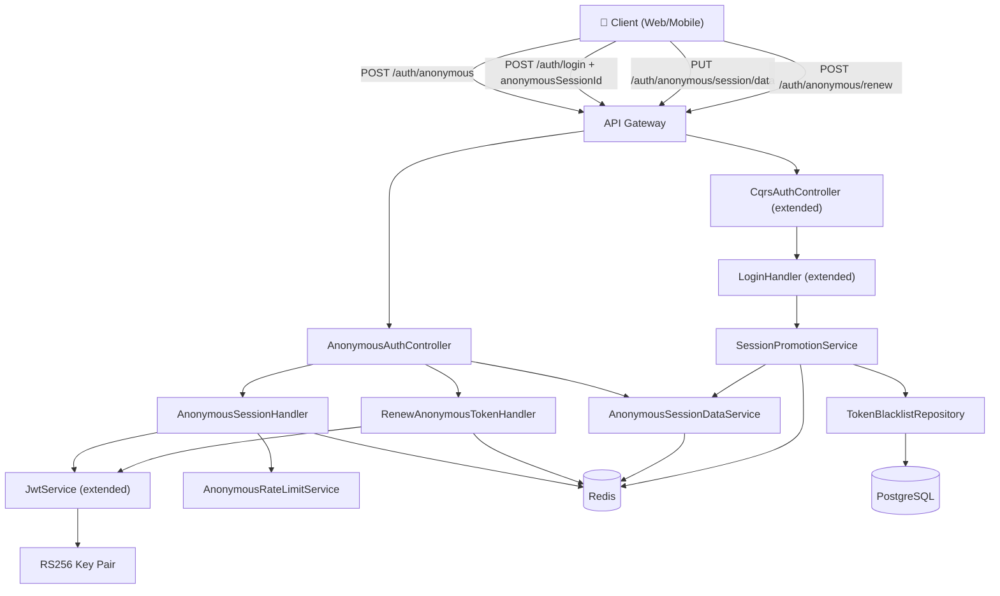
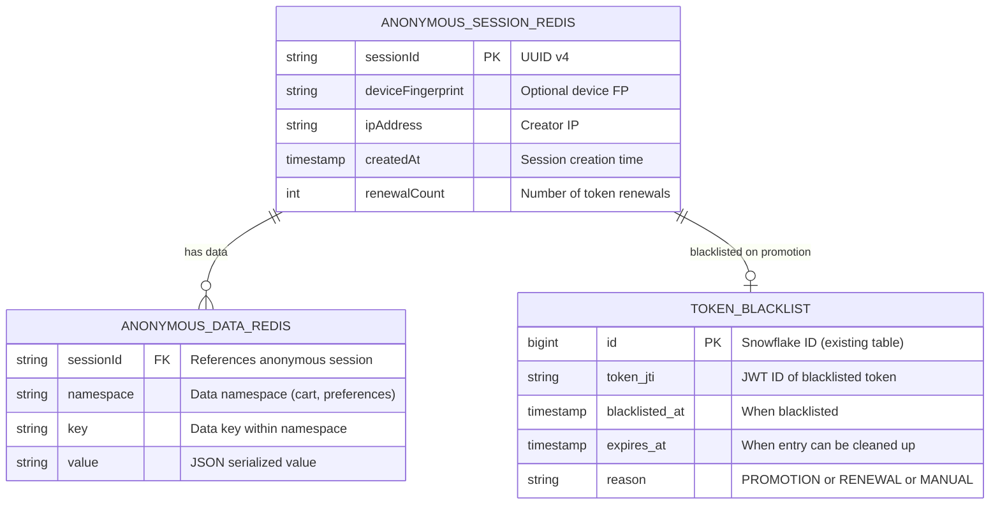
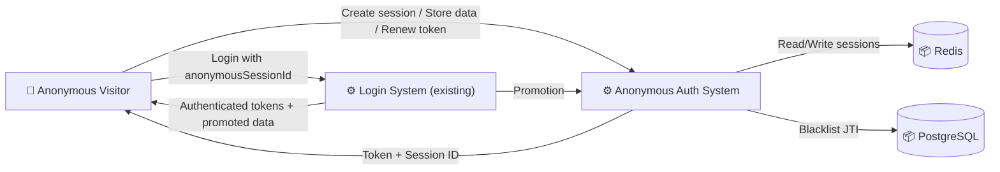
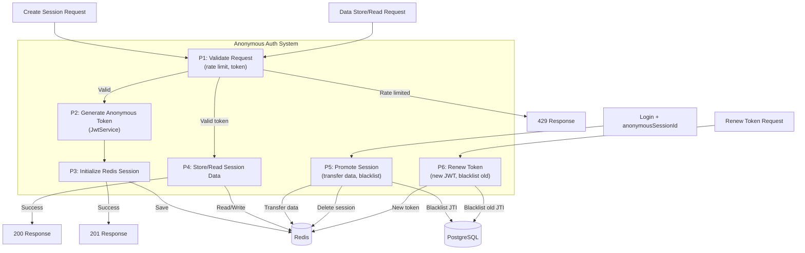
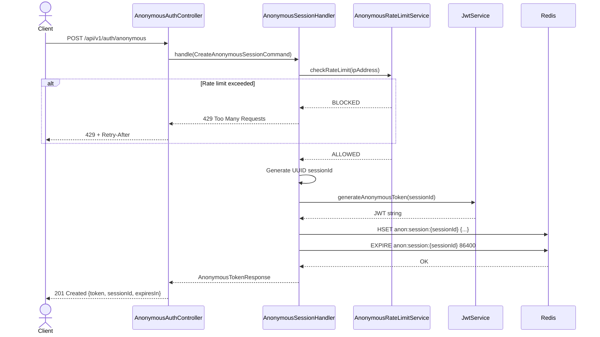
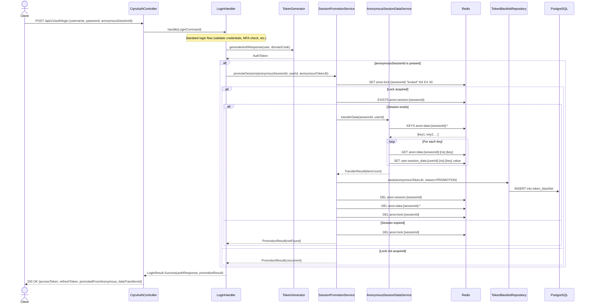
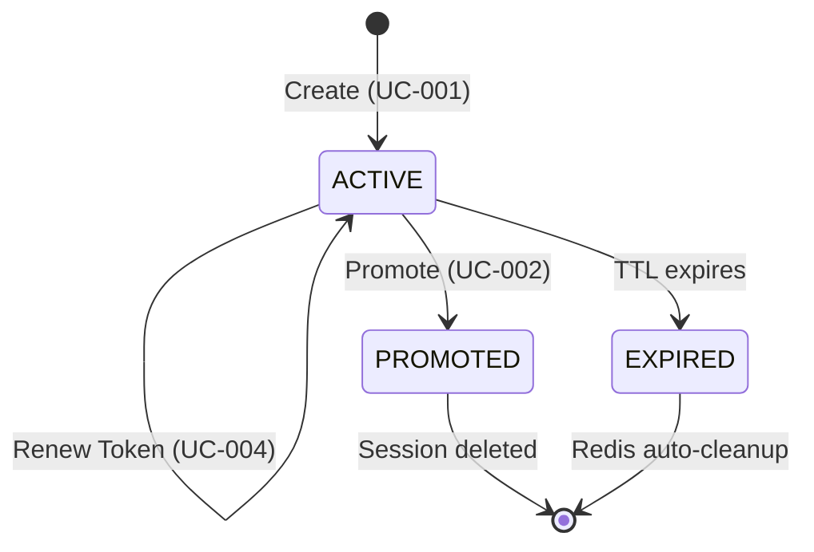
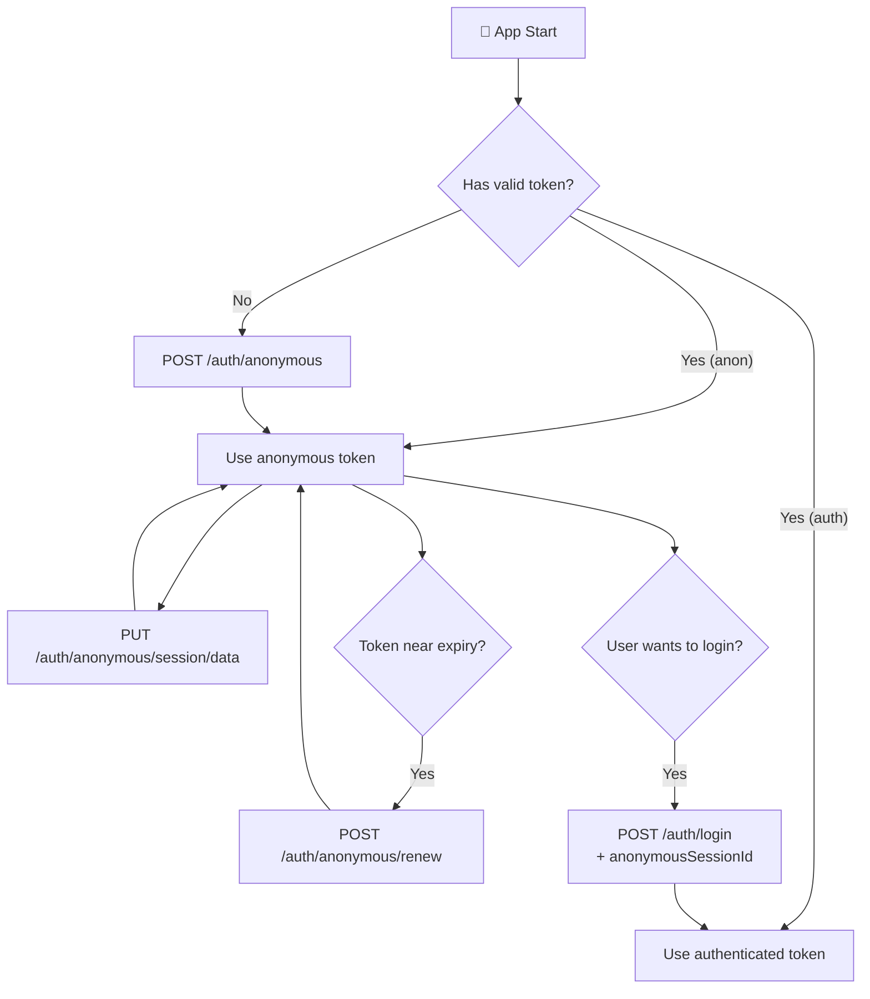
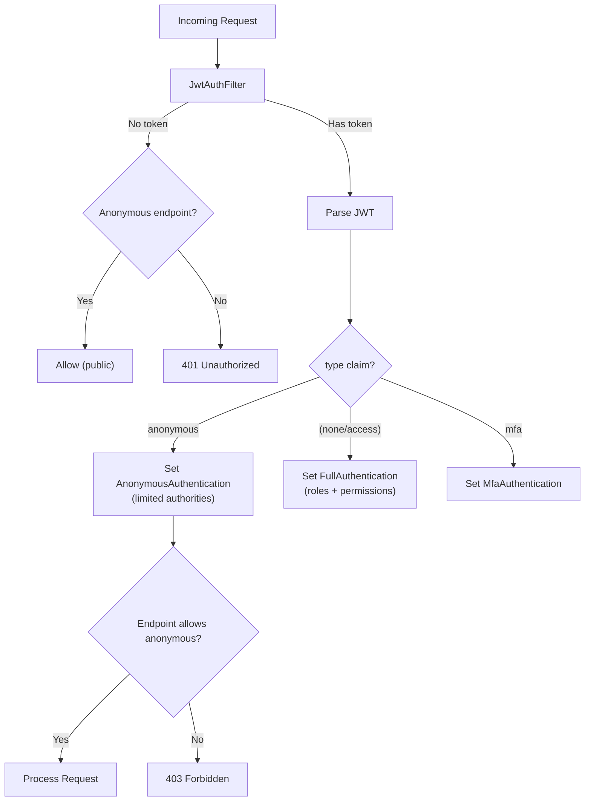

# Đặc tả kỹ thuật: Anonymous Login Optimization

> Technical specification chi tiết — thiết kế để agent có thể đọc và dev code trực tiếp.

---

## 1. Tổng quan hệ thống (System Overview)

### 1.1 Kiến trúc tổng thể



### 1.2 Technology Stack

| Layer | Technology | Version | Ghi chú |
|-------|-----------|---------|---------|
| Language | Kotlin | 1.9+ | Existing |
| Framework | Spring Boot | 3.x | Existing |
| Database | PostgreSQL | 15+ | Existing — only `token_blacklist` table reused |
| Cache | Redis | 7+ | Existing — primary store for anonymous sessions |
| Token | JJWT | 0.12+ | Existing — RS256 signing, custom claims |
| CQRS | eventsourcing-utils | Custom | Existing — `CommandHandler<C,R>` pattern |

### 1.3 Dependencies & Integrations

| Dependency | Type | Purpose | Interface |
|-----------|------|---------|-----------|
| `JwtService` | Internal | Generate/validate anonymous JWT tokens | Kotlin method call |
| `StringRedisTemplate` | Internal | Anonymous session data CRUD | Spring Data Redis |
| `TokenBlacklistRepository` | Internal | Blacklist anonymous token JTIs | JPA Repository |
| `LoginHandler` | Internal | Extended for session promotion | CQRS CommandHandler |
| `CaptchaGateway` | Internal | CAPTCHA verification for abuse prevention | Port interface |

---

## 2. Lược đồ dữ liệu (Data Schema)

### 2.1 Entity-Relationship Diagram



> ⚠️ Note: `ANONYMOUS_SESSION_REDIS` and `ANONYMOUS_DATA_REDIS` are Redis structures, NOT PostgreSQL tables. `TOKEN_BLACKLIST` is the existing PostgreSQL table.

### 2.2 Redis Key Design

#### Anonymous Session Metadata
| Key Pattern | Type | TTL | Value |
|-------------|------|-----|-------|
| `anon:session:{sessionId}` | Hash | 86400s (24h) | `{ deviceFingerprint, ipAddress, createdAt, renewalCount }` |
| `anon:data:{sessionId}:{namespace}:{key}` | String | 86400s (24h) | JSON serialized value |
| `anon:lock:{sessionId}` | String | 30s | `"locked"` (distributed lock for promotion) |
| `anon:rate:{ip}` | String | 3600s (1h) | Attempt count (rate limiting) |

#### Authenticated User Session Data (post-promotion)
| Key Pattern | Type | TTL | Value |
|-------------|------|-----|-------|
| `user:session_data:{userId}:{namespace}:{key}` | String | Configurable | JSON serialized value (migrated from anonymous) |

### 2.3 Bảng chi tiết — Existing Token Blacklist (no migration needed)

#### Entity: token_blacklist (existing)

| Field | Type | Constraint | Default | Mô tả |
|-------|------|-----------|---------|--------|
| `id` | `BIGINT` | PK | Snowflake | Primary key |
| `token_jti` | `VARCHAR(255)` | NOT NULL, UNIQUE | - | JWT ID of blacklisted token |
| `blacklisted_at` | `TIMESTAMP` | NOT NULL | `CURRENT_TIMESTAMP` | When token was blacklisted |
| `expires_at` | `TIMESTAMP` | NOT NULL | - | When this blacklist entry can be cleaned up |
| `reason` | `VARCHAR(50)` | NULLABLE | - | Reason: PROMOTION, RENEWAL, LOGOUT, MANUAL |

> No database migration needed — the existing `token_blacklist` table handles anonymous token invalidation.

---

## 3. Luồng dữ liệu (Data Flow)

### 3.1 Data Flow Diagram — Level 0 (Context)



### 3.2 Data Flow Diagram — Level 1 (chi tiết)



### 3.3 Data Transformation Rules

| # | Input | Process | Output | Validation Rules |
|---|-------|---------|--------|-----------------|
| 1 | Create request (IP, deviceFingerprint) | Generate UUID + JWT, init Redis hash | `AnonymousTokenResponse` | IP not null, rate limit check |
| 2 | Store data request (namespace, key, value) | JSON serialize value, store in Redis | Success confirmation | Session exists, data size ≤ 64KB, namespace not empty |
| 3 | Promotion request (anonymousSessionId, userId) | Read all `anon:data:{sid}:*`, write to `user:session_data:{uid}:*`, delete anonymous keys | Transfer summary | Session exists, lock acquired, user authenticated |
| 4 | Renew request (current token) | Parse token, generate new JWT with same sessionId, blacklist old JTI | New `AnonymousTokenResponse` | Token valid, session exists, renewal count < max |

---

## 4. Luồng xử lý (Processing Steps)

### 4.1 Sequence Diagram — UC-001: Create Anonymous Session



### 4.2 Sequence Diagram — UC-002: Promote Anonymous Session (during Login)



### 4.3 Bảng Step xử lý chi tiết

#### UC-001: Create Anonymous Session

| Step | Component | Action | Input | Output | Error Handling | Ghi chú |
|------|-----------|--------|-------|--------|---------------|---------|
| 1 | Controller | Extract IP, parse request | HttpServletRequest | `CreateAnonymousSessionCommand` | `400 Bad Request` | IP from X-Forwarded-For or remote addr |
| 2 | Handler | Check rate limit | IP address | ALLOWED/BLOCKED | `429 Too Many Requests` | `AnonymousRateLimitService` |
| 3 | Handler | Generate session ID | - | UUID | - | `UUID.randomUUID()` |
| 4 | JwtService | Generate anonymous token | sessionId, TTL | JWT string | `500 Internal` | New method: `generateAnonymousToken()` |
| 5 | Handler | Initialize Redis session | sessionId, metadata | Redis hash | `503 Service Unavailable` | `StringRedisTemplate.opsForHash()` |
| 6 | Controller | Return response | Token, sessionId | `AnonymousTokenResponse` | - | HTTP 201 |

#### UC-002: Promote Anonymous Session

| Step | Component | Action | Input | Output | Error Handling | Ghi chú |
|------|-----------|--------|-------|--------|---------------|---------|
| 1 | LoginHandler | Standard login authentication | Credentials | User entity | `401 Unauthorized` | Existing flow unchanged |
| 2 | LoginHandler | Check if anonymousSessionId present | LoginCommand | Boolean | - | Optional field |
| 3 | PromotionSvc | Acquire distributed lock | sessionId | Lock result | `409 Conflict` | Redis SETNX, 30s TTL |
| 4 | PromotionSvc | Verify session exists | sessionId | Boolean | Skip if not found | Redis EXISTS |
| 5 | DataSvc | Transfer data | sessionId, userId | TransferResult | Log warning, continue | Best-effort transfer |
| 6 | PromotionSvc | Blacklist anonymous token JTI | JTI string | Saved entity | Log warning, continue | Existing BlacklistRepository |
| 7 | PromotionSvc | Delete anonymous session | sessionId | Deleted count | Log warning | Redis DEL |
| 8 | PromotionSvc | Release lock | sessionId | - | Auto-expires at 30s | Redis DEL |

### 4.4 State Machine — Anonymous Session Lifecycle



| Transition | From | To | Trigger | Guard Condition | Side Effect |
|-----------|------|-----|---------|----------------|------------|
| Create | [*] | ACTIVE | POST /auth/anonymous | Rate limit passed | Redis session created, JWT issued |
| Store Data | ACTIVE | ACTIVE | PUT /auth/anonymous/session/data | Data size ≤ 64KB | Redis data key created/updated |
| Renew | ACTIVE | ACTIVE | POST /auth/anonymous/renew | Token valid, renewal count < max | New JWT issued, old JTI blacklisted |
| Promote | ACTIVE | PROMOTED | POST /auth/login + sessionId | Credentials valid, lock acquired | Data transferred, token blacklisted |
| Expire | ACTIVE | EXPIRED | Redis TTL | TTL reached | Automatic cleanup by Redis |

---

## 5. Luồng màn hình (Screen Flow)

### 5.1 Screen Map

```
N/A — This feature is a backend-only API.
No UI screens are in scope.
Client integration is handled by frontend teams.
```

### 5.2 API-Driven Flow



---

## 6. API Specification

### 6.1 Endpoint List

| # | Method | Path | Description | Auth | Request Body | Response |
|---|--------|------|------------|------|-------------|----------|
| 1 | `POST` | `/api/v1/auth/anonymous` | Create anonymous session | None (public) | `CreateAnonymousSessionRequest` | `AnonymousTokenResponse` (201) |
| 2 | `POST` | `/api/v1/auth/anonymous/renew` | Renew anonymous token | Anonymous JWT | None | `AnonymousTokenResponse` (200) |
| 3 | `PUT` | `/api/v1/auth/anonymous/session/data` | Store session data | Anonymous JWT | `StoreAnonymousDataRequest` | `StoreDataResponse` (200) |
| 4 | `GET` | `/api/v1/auth/anonymous/session/data` | Read session data | Anonymous JWT | Query: `namespace` | `Map<String, Any>` (200) |
| 5 | `DELETE` | `/api/v1/auth/anonymous/session/data` | Delete session data key | Anonymous JWT | Query: `namespace`, `key` | 204 |
| 6 | `POST` | `/api/v1/auth/login` | Login (extended with promotion) | None (public) | `LoginRequest` (extended) | `AuthResponse` (extended) (200) |

### 6.2 Request/Response chi tiết

#### POST /api/v1/auth/anonymous

**Request:**
```json
{
  "deviceFingerprint": "string (optional, max 64 chars)"
}
```

**Response (201 Created):**
```json
{
  "token": "eyJhbGciOiJSUzI1NiIsImtpZCI6ImF1dGgtc2VydmljZS1rZXktMSJ9...",
  "sessionId": "550e8400-e29b-41d4-a716-446655440000",
  "tokenType": "Bearer",
  "expiresIn": 3600
}
```

**Error Response (429 Too Many Requests):**
```json
{
  "type": "https://api.auth-service.com/errors/rate-limit",
  "title": "Rate Limit Exceeded",
  "status": 429,
  "detail": "Too many anonymous session requests from this IP. Try again later.",
  "instance": "/api/v1/auth/anonymous",
  "retryAfter": 1800
}
```

#### POST /api/v1/auth/anonymous/renew

**Request:** None (token in Authorization header)

**Response (200 OK):**
```json
{
  "token": "eyJhbGciOiJSUzI1NiIs...(new token)",
  "sessionId": "550e8400-e29b-41d4-a716-446655440000",
  "tokenType": "Bearer",
  "expiresIn": 3600
}
```

#### PUT /api/v1/auth/anonymous/session/data

**Request:**
```json
{
  "namespace": "string (required, e.g. 'cart', 'preferences')",
  "key": "string (required, e.g. 'items', 'locale')",
  "value": "any (required, JSON serializable, max 64KB total per session)"
}
```

**Response (200 OK):**
```json
{
  "stored": true,
  "namespace": "cart",
  "key": "items",
  "sessionId": "550e8400-e29b-41d4-a716-446655440000"
}
```

#### GET /api/v1/auth/anonymous/session/data?namespace=cart

**Response (200 OK):**
```json
{
  "namespace": "cart",
  "data": {
    "items": [{"sku": "ABC", "qty": 2}]
  }
}
```

#### POST /api/v1/auth/login (extended)

**Request (extended with anonymousSessionId):**
```json
{
  "username": "string (required)",
  "password": "string (required)",
  "anonymousSessionId": "string (optional, UUID of anonymous session to promote)",
  "captchaToken": "string (optional)",
  "domainCode": "string (optional)",
  "deviceFingerprint": "string (optional)"
}
```

**Response (200 OK — with promotion):**
```json
{
  "accessToken": "eyJhbGciOi...",
  "refreshToken": "eyJhbGciOi...",
  "tokenType": "Bearer",
  "expiresIn": 900,
  "userId": 123456789,
  "username": "john",
  "activeDomain": "default",
  "roles": ["USER"],
  "permissions": ["read:profile", "write:profile"],
  "promotedFromAnonymous": true,
  "dataTransferred": {
    "itemCount": 3,
    "namespaces": ["cart", "preferences"]
  }
}
```

### 6.3 Error Response Format (RFC 7807)

| HTTP Status | Error Type | Khi nào |
|-------------|-----------|---------|
| 400 | Validation Error | Invalid request body |
| 401 | Unauthorized | Invalid/expired anonymous token |
| 404 | Not Found | Anonymous session not found in Redis |
| 409 | Conflict | Concurrent promotion attempt |
| 413 | Payload Too Large | Session data exceeds 64KB limit |
| 429 | Rate Limit Exceeded | Too many anonymous token requests |
| 500 | Internal Server Error | System error |
| 503 | Service Unavailable | Redis connection failure |

---

## 7. Security Considerations

### 7.1 Authentication Flow



### 7.2 Authorization Matrix

| Role | Create Anonymous (UC-001) | Store Data (UC-003) | Renew Token (UC-004) | Promote/Login (UC-002) | Admin Cleanup |
|------|:---:|:---:|:---:|:---:|:---:|
| No Auth (public) | ✅ | ❌ | ❌ | ✅ (login is public) | ❌ |
| Anonymous Token | ❌ | ✅ | ✅ | ✅ | ❌ |
| Authenticated User | ❌ | ❌ | ❌ | N/A | ❌ |
| Admin | ❌ | ❌ | ❌ | N/A | ✅ |

### 7.3 Data Protection

- **Anonymous tokens** use the same RS256 signing as authenticated tokens — tamper-proof
- **Anonymous session data** stored in Redis — protected by Redis AUTH password and TLS (if configured)
- **No PII** should be stored in anonymous sessions — anonymous sessions are for transient application state only
- **Rate limiting** prevents IP-based abuse of anonymous token creation
- **Token blacklisting** prevents reuse of promoted/renewed anonymous tokens
- **Distributed lock** prevents race conditions during session promotion
- **Data size limit** (64KB) prevents Redis memory abuse

---

## 8. Performance Requirements

| Metric | Target | Measurement Method |
|--------|--------|-------------------|
| Anonymous token generation (P95) | < 100ms | APM monitoring |
| Session data read/write (P95) | < 20ms | Redis latency metrics |
| Promotion overhead on login (P95) | < 50ms additional | Before/after comparison |
| Token renewal (P95) | < 50ms | APM monitoring |
| Concurrent anonymous sessions | 10,000+ | Load test |
| Redis memory per session | < 100KB | Redis memory analysis |

---

## 9. Agent Implementation Notes

> **Section này dành cho AI agent** — chỉ rõ code cần tạo để agent dev trực tiếp.

### 9.1 Classes to Create

| # | Class | Package | Type | Extends/Implements | Mô tả |
|---|-------|---------|------|-------------------|--------|
| 1 | `AnonymousAuthController` | `auth.adapter.in.web` | @RestController | - | Anonymous session endpoints (create, renew, data CRUD) |
| 2 | `AnonymousSessionHandler` | `auth.application.command` | @Component | `CommandHandler<CreateAnonymousSessionCommand, AnonymousTokenResult>` | Creates anonymous session + generates token |
| 3 | `RenewAnonymousTokenHandler` | `auth.application.command` | @Component | `CommandHandler<RenewAnonymousTokenCommand, AnonymousTokenResult>` | Renews anonymous token, blacklists old |
| 4 | `SessionPromotionService` | `auth.application` | @Service | - | Orchestrates session promotion: lock → transfer → blacklist → delete |
| 5 | `AnonymousSessionDataService` | `auth.application` | @Service | - | CRUD operations on anonymous session data in Redis |
| 6 | `AnonymousRateLimitService` | `auth.application` | @Service | - | IP-based rate limiting for anonymous token creation |
| 7 | `CreateAnonymousSessionCommand` | `auth.application.command` | Data class | - | Command: deviceFingerprint, ipAddress |
| 8 | `RenewAnonymousTokenCommand` | `auth.application.command` | Data class | - | Command: currentTokenJti, sessionId |
| 9 | `AnonymousTokenResult` | `auth.application` | Sealed class | - | Result: Success(token, sessionId, expiresIn) |
| 10 | `AnonymousTokenResponse` | `auth.adapter.in.web.dto` | Data class | - | API response DTO |
| 11 | `CreateAnonymousSessionRequest` | `auth.adapter.in.web.dto` | Data class | - | API request DTO |
| 12 | `StoreAnonymousDataRequest` | `auth.adapter.in.web.dto` | Data class | - | API request DTO for data storage |
| 13 | `StoreDataResponse` | `auth.adapter.in.web.dto` | Data class | - | API response DTO for data storage |
| 14 | `PromotionResult` | `auth.application` | Data class | - | Result of session promotion (success, itemCount, namespaces) |
| 15 | `AnonymousProperties` | `shared.config` | Data class | - | Config: tokenTtlSeconds, sessionDataTtlSeconds, maxDataSizeBytes, rateLimit |

### 9.2 Classes to Modify

| # | Class | Package | Change | Mô tả |
|---|-------|---------|--------|--------|
| 1 | `JwtService` | `auth.application` | Add method | `generateAnonymousToken(sessionId: String): String` — generates JWT with `type=anonymous`, `sub=sessionId` |
| 2 | `JwtService` | `auth.application` | Add method | `parseAnonymousToken(token: String): Claims` — validates token and checks `type=anonymous` |
| 3 | `LoginCommand` | `auth.application.command` | Add field | `anonymousSessionId: String?` — optional anonymous session to promote |
| 4 | `LoginHandler` | `auth.application.command` | Add promotion | After successful auth, if `anonymousSessionId` present, call `SessionPromotionService.promoteSession()` |
| 5 | `LoginResult.Success` | `auth.application` | Add field | `promotionResult: PromotionResult?` — promotion metadata |
| 6 | `AuthResponse` | `auth.adapter.in.web.dto` | Add fields | `promotedFromAnonymous: Boolean`, `dataTransferred: DataTransferSummary?` |
| 7 | `SecurityConfig` | `shared.config` | Add paths | Add `/api/v1/auth/anonymous` to `permitAll()` list |
| 8 | `SecurityProperties` | `shared.config` | Add block | Add `anonymous: AnonymousProperties` configuration |
| 9 | `JwtAuthFilter` | `shared.security` | Extend | Recognize `type=anonymous` tokens and set limited `ROLE_ANONYMOUS` authority |
| 10 | `CqrsAuthController` | `auth.adapter.in.web` | Extend | Pass `anonymousSessionId` from request to `LoginCommand` |

### 9.3 Pattern References

| Pattern | Reference | Ghi chú |
|---------|----------|---------|
| CQRS Handler | `auth.application.command.LoginHandler` | Follow same CommandHandler<C,R> pattern |
| Token Generation | `auth.application.JwtService.generateMfaToken()` | Same pattern — custom claims, configurable TTL |
| Rate Limiting | `auth.application.LoginRateLimitService` | Same Redis-based sliding window pattern |
| Redis Operations | `auth.application.MfaRateLimitService` | Same `StringRedisTemplate` usage pattern |
| Controller | `auth.adapter.in.web.CqrsAuthController` | Same REST controller conventions |
| Config Properties | `shared.config.SecurityProperties` | Nested data class pattern |
| Error Handling | `shared.exception.*` | Custom exceptions extending `BaseException` |

### 9.4 Integration Points

| Integration | Type | Protocol | Endpoint | Data Format |
|------------|------|----------|----------|------------|
| `JwtService.generateAnonymousToken()` | Sync | Internal call | - | Kotlin method |
| `StringRedisTemplate` | Sync | Redis | Redis server | String/Hash |
| `TokenBlacklistRepository` | Sync | JPA | PostgreSQL | Entity |
| `CaptchaGateway` | Sync | HTTP | CAPTCHA provider | REST API |
| `LoginHandler` (extended) | Sync | CQRS | Internal | `LoginCommand` → `LoginResult` |

### 9.5 Configuration Properties (to add to application.yml)

```yaml
app:
  security:
    anonymous:
      enabled: true
      token-ttl-seconds: 3600          # Anonymous JWT TTL (1 hour)
      session-data-ttl-seconds: 86400  # Redis session data TTL (24 hours)
      max-data-size-bytes: 65536       # Max 64KB per anonymous session
      max-renewals: 24                 # Max token renewals per session
      rate-limit:
        max-attempts: 5                # Max anonymous tokens per IP per window
        window-seconds: 3600           # Rate limit window (1 hour)
        lock-seconds: 1800             # Lockout duration (30 min)
      captcha-threshold: 3             # Require CAPTCHA after N attempts
```

### 9.6 Test Cases (high-level)

| # | Test | Type | Scenario | Expected |
|---|------|------|----------|----------|
| 1 | Create anonymous session | Integration | Valid request, first time | 201 + token + sessionId; Redis session created |
| 2 | Create — rate limited | Integration | 6th request from same IP within 1 hour | 429 + retryAfter header |
| 3 | Create — CAPTCHA required | Integration | 4th request from same IP | 429 + captcha_required flag |
| 4 | Store session data | Integration | Valid anonymous token, valid data | 200 + data stored in Redis |
| 5 | Store — session expired | Integration | Token valid but Redis session TTL expired | 404 |
| 6 | Store — data too large | Integration | Data exceeds 64KB limit | 413 |
| 7 | Read session data | Integration | Valid anonymous token, existing namespace | 200 + data map |
| 8 | Renew token | Integration | Valid token, session exists | 200 + new token, old JTI blacklisted |
| 9 | Renew — expired token | Integration | Expired anonymous token | 401 |
| 10 | Renew — max renewals | Integration | 25th renewal attempt | 429 or 400 |
| 11 | Login with promotion | Integration | Valid credentials + valid anonymousSessionId | 200 + auth tokens + promotedFromAnonymous=true + dataTransferred |
| 12 | Login with expired session | Integration | Valid credentials + expired anonymousSessionId | 200 + auth tokens + promotedFromAnonymous=false |
| 13 | Login without anonymousSessionId | Integration | Valid credentials, no anonymous session | 200 + auth tokens + promotedFromAnonymous=false (existing behavior) |
| 14 | Concurrent promotion | Integration | Two simultaneous login requests with same sessionId | One succeeds, other gets 409 or degraded result |
| 15 | Token reuse after promotion | Integration | Use anonymous token after promotion | 401 (JTI blacklisted) |
| 16 | Anonymous token in JwtAuthFilter | Unit | Anonymous JWT parsed correctly | SecurityContext has ROLE_ANONYMOUS, limited authorities |
| 17 | Anonymous access to protected endpoint | Integration | Anonymous token accessing authenticated-only endpoint | 403 Forbidden |
| 18 | Redis unavailable | Integration | Redis down during session creation | 503 Service Unavailable |

---

> **Traceability**: Research Brief → Business Analysis → **Technical Spec** → Implementation
> **Ready for**: `/wf_pre_openspec` hoặc `/wf_openspec` hoặc direct coding
