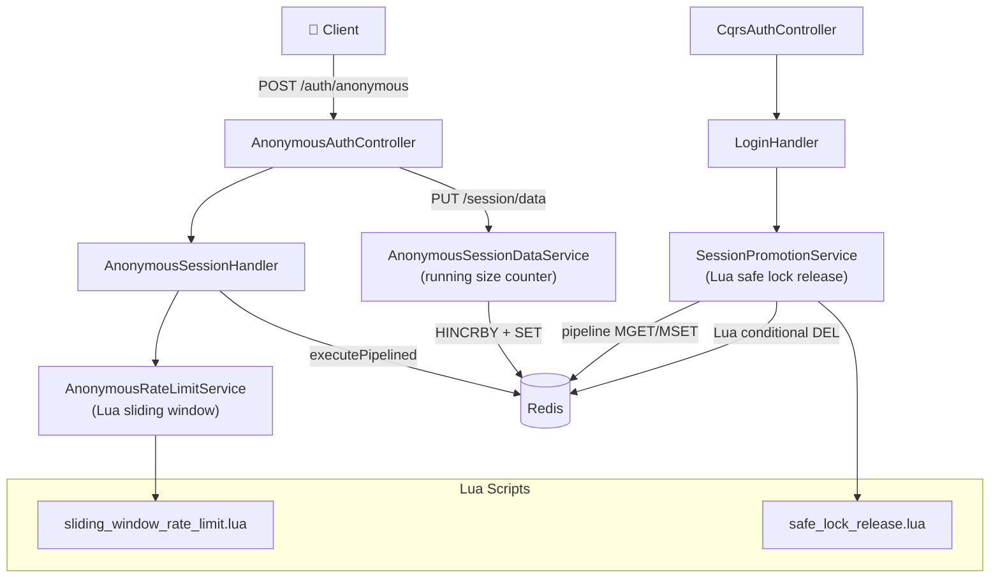
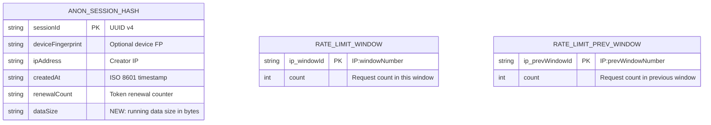
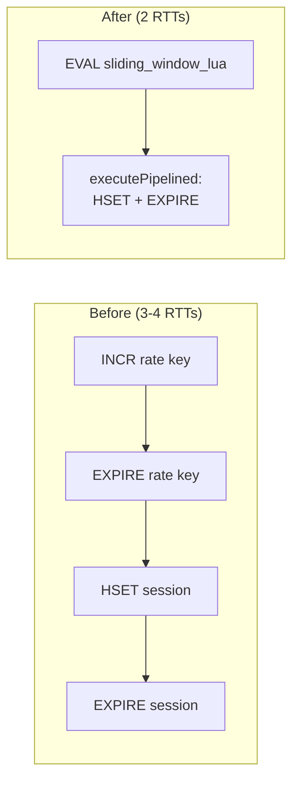
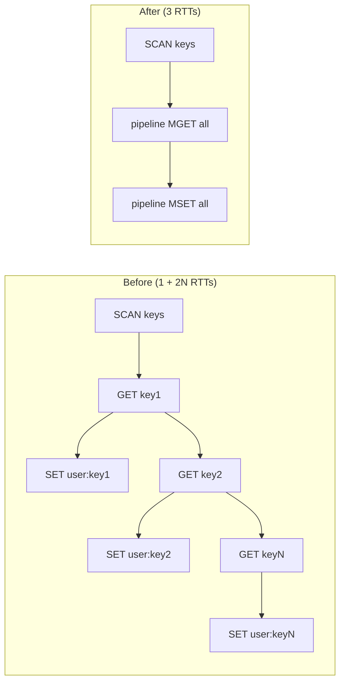
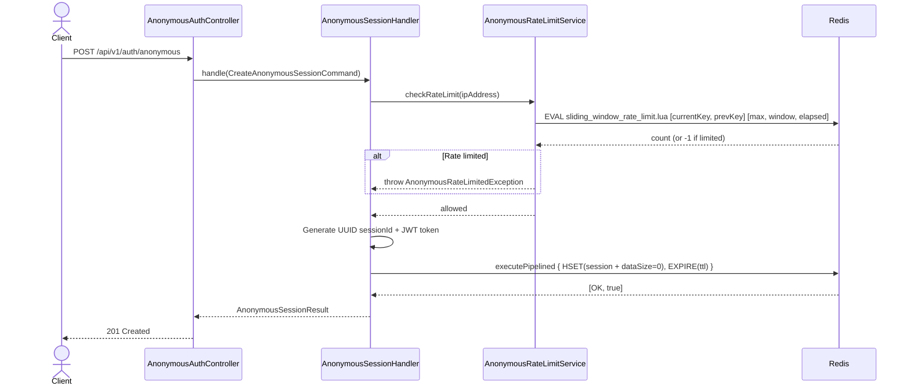
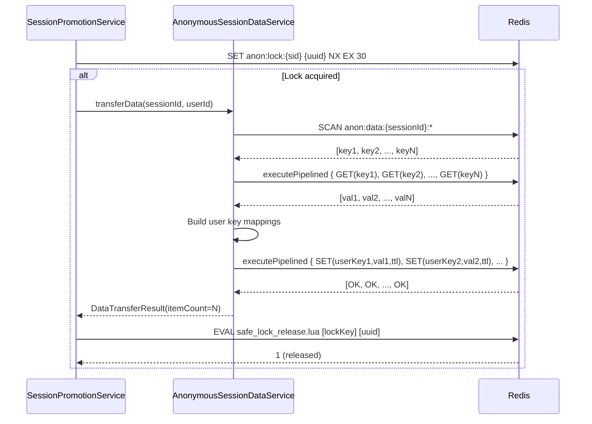

# Đặc tả kỹ thuật: Anonymous Login Optimization

> Technical specification chi tiết — thiết kế để agent có thể đọc và dev code trực tiếp.

---

## 1. Tổng quan hệ thống (System Overview)

### 1.1 Kiến trúc tổng thể



### 1.2 Technology Stack

| Layer | Technology | Version | Ghi chú |
|-------|-----------|---------|---------|
| Language | Kotlin | 1.9+ | Existing — no change |
| Framework | Spring Boot | 3.x | Existing — no change |
| Cache | Redis | 7+ | Existing — leverage Lua EVAL, pipelining |
| Redis Client | Lettuce | 6.x (via Spring Boot) | Existing — supports pipelining via connection |
| Metrics | Micrometer | 1.12+ | Existing — add Observation spans |
| CQRS | eventsourcing-utils | Custom | Existing — no change |

### 1.3 Dependencies & Integrations

| Dependency | Type | Purpose | Interface |
|-----------|------|---------|-----------|
| `StringRedisTemplate` | Internal | Pipelining, Lua script execution | `executePipelined()`, `execute(RedisScript)` |
| `DefaultRedisScript<Long>` | Internal | Lua script beans | Spring bean configuration |
| Micrometer Observation | Internal | Tracing spans | `Observation.createNotStarted()` |

> **No new external dependencies** — all changes use existing Spring Boot/Spring Data Redis APIs.

---

## 2. Lược đồ dữ liệu (Data Schema)

### 2.1 Redis Key Design Changes



### 2.2 Key Changes Detail

| Key Pattern | Change | Before | After |
|-------------|--------|--------|-------|
| `anon:session:{sessionId}` | **MODIFIED** | Hash: `{deviceFingerprint, ipAddress, createdAt, renewalCount}` | Hash: `{deviceFingerprint, ipAddress, createdAt, renewalCount, **dataSize**}` |
| `anon:rate:{ip}` | **REPLACED** | String: single counter, fixed window | N/A — replaced by sliding window keys |
| `anon:rate:{ip}:{windowId}` | **NEW** | N/A | String: counter for current time window |
| `anon:rate:{ip}:{windowId-1}` | **NEW** | N/A | String: counter for previous time window (auto-expires) |
| `anon:lock:{sessionId}` | **MODIFIED** | String: static `"locked"` | String: UUID of lock owner |

### 2.3 No Database Migration Needed

No PostgreSQL schema changes. All modifications are Redis key structure changes only.

---

## 3. Luồng dữ liệu (Data Flow)

### 3.1 Optimized Session Creation Flow



### 3.2 Optimized Data Transfer Flow



### 3.3 Data Transformation Rules

| # | Input | Process | Output | Validation Rules |
|---|-------|---------|--------|-----------------|
| 1 | Session creation command | Pipeline: HSET(session_data + dataSize=0) + EXPIRE | Redis hash with dataSize field | Same validation, pipelined execution |
| 2 | Rate limit IP | Lua: INCR current + GET prev + weighted sum | Allow/deny (Long result) | -1 = denied, ≥0 = allowed |
| 3 | Data store + size | HGET dataSize → validate → SET data → HINCRBY dataSize | Updated data + counter | dataSize + newSize ≤ maxSize |
| 4 | Lock release | Lua: if GET(lock) == uuid then DEL(lock) | 1 (released) or 0 (not owner) | UUID must match |

---

## 4. Luồng xử lý (Processing Steps)

### 4.1 Sequence Diagram — Optimized Session Creation



### 4.2 Sequence Diagram — Optimized Data Transfer (Promotion)



### 4.3 Bảng Step xử lý chi tiết

#### UC-OPT-001: Pipeline Session Creation

| Step | Component | Action | Before | After | Performance Impact |
|------|-----------|--------|--------|-------|--------------------|
| 1 | RateLimitSvc | Rate limit check | 2 RTT (INCR + EXPIRE) | 1 RTT (Lua EVAL) | -50% RTT |
| 2 | Handler | Generate sessionId + JWT | CPU only | CPU only | No change |
| 3 | Handler | Create Redis session | 2 RTT (HSET + EXPIRE) | 1 RTT (pipeline) | -50% RTT |
| **Total** | | | **3-4 RTT** | **2 RTT** | **-50% RTT** |

#### UC-OPT-003: Batch Data Transfer

| Step | Component | Action | Before | After | Performance Impact |
|------|-----------|--------|--------|-------|--------------------|
| 1 | DataSvc | Collect keys | 1 SCAN (multi-RTT) | 1 SCAN (same) | No change |
| 2 | DataSvc | Read values | N × GET (N RTT) | 1 pipeline MGET (1 RTT) | -N+1 RTT |
| 3 | DataSvc | Write to user namespace | N × SET (N RTT) | 1 pipeline MSET (1 RTT) | -N+1 RTT |
| **Total** | | | **1 + 2N RTT** | **~3 RTT** | **-2(N-1) RTT** |

---

## 5. Luồng màn hình (Screen Flow)

```
N/A — Internal optimization. No UI changes.
No API contract changes. Same endpoints, same request/response format.
```

---

## 6. API Specification

### 6.1 No API Changes

All optimizations are internal — no endpoint, request, or response changes.

| # | Endpoint | Change | Impact |
|---|---------|--------|--------|
| 1 | POST `/api/v1/auth/anonymous` | Internal: pipeline + Lua rate limit | Faster response, same contract |
| 2 | PUT `/api/v1/auth/anonymous/session/data` | Internal: running size counter | Faster response, same contract |
| 3 | POST `/api/v1/auth/login` | Internal: batch transfer + safe lock | Faster promotion, same contract |
| 4 | POST `/api/v1/auth/anonymous/renew` | No change in this optimization | N/A |

---

## 7. Security Considerations

### 7.1 No Security Changes

All optimizations are performance/reliability improvements. Security model remains unchanged:
- Same RS256 JWT tokens
- Same rate limiting rules (different algorithm, same limits)
- Same distributed lock pattern (stronger ownership verification)

### 7.2 Security Improvements

| Improvement | Before | After | Benefit |
|-------------|--------|-------|---------|
| Lock ownership verification | Static "locked" value — any process can release | UUID value — only owner can release via Lua | Prevents accidental cross-process unlock |
| Rate limiting accuracy | Fixed window — burst-at-boundary possible | Sliding window — smooth enforcement | Better abuse prevention at window boundaries |

---

## 8. Performance Requirements

| Metric | Current | Target | Improvement | How |
|--------|---------|--------|-------------|-----|
| Session creation P95 | ~100ms | < 50ms | 50%+ reduction | Pipeline + Lua rate limit |
| Data transfer P95 (10 keys) | ~50ms | < 10ms | 80%+ reduction | Batch MGET/MSET |
| Rate limit check P95 | ~10ms (2 RTT) | < 5ms (1 RTT) | 50% reduction | Lua script |
| Data store (with size check) P95 | ~20ms (SCAN+STRLEN) | < 5ms (HGET) | 75% reduction | Running counter |
| Redis memory per session | ~500 bytes | ~520 bytes | +4% (dataSize field) | Acceptable trade-off |

---

## 9. Agent Implementation Notes

> **Section này dành cho AI agent** — chỉ rõ code cần sửa đổi để agent dev trực tiếp.

### 9.1 Classes to Create

| # | Class | Package | Type | Mô tả |
|---|-------|---------|------|--------|
| 1 | `RedisLuaScriptConfig` | `shared.config` | @Configuration | Define `DefaultRedisScript<Long>` beans for Lua scripts |
| 2 | `sliding_window_rate_limit.lua` | `resources/redis/` | Lua file | Sliding window counter Lua script |
| 3 | `safe_lock_release.lua` | `resources/redis/` | Lua file | Conditional lock release Lua script |

### 9.2 Classes to Modify

| # | Class | Package | Change | Mô tả |
|---|-------|---------|--------|--------|
| 1 | `AnonymousSessionHandler` | `auth.application.command` | Refactor | Replace sequential HSET+EXPIRE with `executePipelined()`. Add `dataSize=0` to initial session hash. |
| 2 | `AnonymousRateLimitService` | `auth.application` | Refactor | Replace INCR+EXPIRE with Lua sliding window counter script execution. Change key pattern to include window ID. |
| 3 | `AnonymousSessionDataService` | `auth.application` | Refactor | (a) Replace `getSessionDataSize()` SCAN+STRLEN with HGET `dataSize`. (b) Add HINCRBY after storeData/deleteData. (c) Replace per-key transfer loop with pipeline MGET+MSET in `transferData()`. |
| 4 | `SessionPromotionService` | `auth.application` | Refactor | (a) Store UUID as lock value instead of static "locked". (b) Replace `delete(lockKey)` with Lua safe release script. |
| 5 | `SecurityProperties.AnonymousProperties` | `shared.config` | Add field | Add `slidingWindowEnabled: Boolean = true` for feature flag / fallback. |

### 9.3 Lua Scripts to Create

#### `resources/redis/sliding_window_rate_limit.lua`

```lua
-- Sliding window counter rate limiting
-- KEYS[1] = current window key (anon:rate:{ip}:{currentWindow})
-- KEYS[2] = previous window key (anon:rate:{ip}:{prevWindow})
-- ARGV[1] = max attempts
-- ARGV[2] = window size in seconds
-- ARGV[3] = elapsed seconds in current window
-- Returns: weighted count (or -1 if rate limited)

local current_key = KEYS[1]
local prev_key = KEYS[2]
local max_attempts = tonumber(ARGV[1])
local window_seconds = tonumber(ARGV[2])
local elapsed = tonumber(ARGV[3])

-- Increment current window counter
local current = tonumber(redis.call('INCR', current_key)) or 0
if current == 1 then
    -- Set TTL to 2× window to keep for next window's calculation
    redis.call('EXPIRE', current_key, window_seconds * 2)
end

-- Get previous window count
local prev = tonumber(redis.call('GET', prev_key)) or 0

-- Calculate weighted sum
local weight = math.max(0, (window_seconds - elapsed) / window_seconds)
local count = prev * weight + current

if count > max_attempts then
    return -1
end

return math.floor(count)
```

#### `resources/redis/safe_lock_release.lua`

```lua
-- Safe lock release with ownership verification
-- KEYS[1] = lock key
-- ARGV[1] = expected owner UUID
-- Returns: 1 if released, 0 if not owner

if redis.call('GET', KEYS[1]) == ARGV[1] then
    redis.call('DEL', KEYS[1])
    return 1
end
return 0
```

### 9.4 Pattern References

| Pattern | Reference | Ghi chú |
|---------|----------|---------|
| Pipeline usage | Spring Data Redis `executePipelined(RedisCallback)` | Return null from callback; results in List<Object> |
| Lua script execution | `StringRedisTemplate.execute(RedisScript<T>, keys, args)` | Use DefaultRedisScript with cached SHA1 |
| Sliding window algorithm | Redis Labs rate limiting documentation | Two-counter weighted formula |
| Safe lock release | Kleppmann's distributed locking analysis | UUID ownership + Lua conditional DEL |
| Running counter | Redis HINCRBY command | Atomic increment on hash field |
| Observation spans | Micrometer `Observation.createNotStarted(name, registry)` | Start/stop around critical sections |

### 9.5 Configuration Properties Changes

```yaml
# No new config properties needed — optimization uses existing config values.
# Optional: add feature flag for sliding window
app:
  security:
    anonymous:
      # Existing config — unchanged
      token-ttl-seconds: ${ANON_TOKEN_TTL:3600}
      session-ttl-seconds: ${ANON_SESSION_TTL:86400}
      max-data-size-bytes: ${ANON_MAX_DATA_SIZE:65536}
      max-renewals: ${ANON_MAX_RENEWALS:24}
      promoted-data-ttl-seconds: ${ANON_PROMOTED_TTL:604800}
      rate-limit:
        max-attempts: 5
        window-seconds: 3600
        lock-seconds: 0
      # NEW: feature flag for sliding window (optional)
      # sliding-window-enabled: ${ANON_SLIDING_WINDOW:true}
```

### 9.6 Test Cases (high-level)

| # | Test | Type | Scenario | Expected |
|---|------|------|----------|----------|
| 1 | Pipeline session creation | Integration | Create anonymous session | Same result, fewer Redis RTTs; verify HSET+EXPIRE in pipeline |
| 2 | Pipeline fallback | Unit | executePipelined throws | Fallback to sequential calls, session still created |
| 3 | Sliding window - within limit | Unit | 3 requests in 1 window | All allowed, count = 3 |
| 4 | Sliding window - at boundary | Unit | 5 requests at end of window + 1 at start of next | 6th request denied (weighted count > 5) |
| 5 | Sliding window - Redis down | Unit | Redis unavailable | Fail-open, request allowed |
| 6 | Batch transfer - 10 keys | Integration | Promote session with 10 data keys | All 10 transferred, 3 RTTs (SCAN + pipeline GET + pipeline SET) |
| 7 | Batch transfer - 0 keys | Integration | Promote session with no data | Graceful handling, itemCount=0 |
| 8 | Safe lock release - owner | Unit | Release lock with correct UUID | Lock deleted, return 1 |
| 9 | Safe lock release - not owner | Unit | Release lock with wrong UUID | Lock NOT deleted, return 0 |
| 10 | Safe lock release - expired | Unit | Release lock that already expired | Lock not found, return 0 (graceful) |
| 11 | Running size counter - store | Integration | Store 1KB data | dataSize incremented by 1024 |
| 12 | Running size counter - delete | Integration | Delete data key | dataSize decremented by removed size |
| 13 | Running size counter - limit | Integration | Store data exceeding 64KB | AnonymousDataLimitExceededException via HGET check |
| 14 | Running size counter - init | Integration | New session | dataSize = 0 in session hash |
| 15 | Observation spans | Integration | Create session, store data, promote | Spans visible in test observation registry |

### 9.7 Code Change Examples

#### Before → After: AnonymousSessionHandler (Pipeline)

```kotlin
// BEFORE (3 sequential calls)
val sessionData = mapOf("deviceFingerprint" to ..., "ipAddress" to ..., "createdAt" to ..., "renewalCount" to "0")
redisTemplate.opsForHash<String, String>().putAll(sessionKey, sessionData)
redisTemplate.expire(sessionKey, sessionTtl)

// AFTER (1 pipelined call)
val sessionData = mapOf(
    "deviceFingerprint" to ..., "ipAddress" to ..., "createdAt" to ...,
    "renewalCount" to "0", "dataSize" to "0"  // NEW field
)
redisTemplate.executePipelined { connection ->
    val keyBytes = sessionKey.toByteArray()
    sessionData.forEach { (field, value) ->
        connection.hashCommands().hSet(keyBytes, field.toByteArray(), value.toByteArray())
    }
    connection.keyCommands().expire(keyBytes, sessionTtl.seconds)
    null
}
```

#### Before → After: AnonymousRateLimitService (Lua)

```kotlin
// BEFORE (2 sequential calls, fixed window)
val attempts = ops.increment(key) ?: 1
if (attempts == 1L) redisTemplate.expire(key, Duration.ofSeconds(config.windowSeconds))
if (attempts > config.maxAttempts) throw AnonymousRateLimitedException(...)

// AFTER (1 Lua EVAL, sliding window)
val windowId = System.currentTimeMillis() / (config.windowSeconds * 1000)
val currentKey = "$RATE_PREFIX$ipAddress:$windowId"
val prevKey = "$RATE_PREFIX$ipAddress:${windowId - 1}"
val elapsed = (System.currentTimeMillis() % (config.windowSeconds * 1000)) / 1000

val result = redisTemplate.execute(
    slidingWindowScript,
    listOf(currentKey, prevKey),
    config.maxAttempts.toString(),
    config.windowSeconds.toString(),
    elapsed.toString()
)

if (result == -1L) throw AnonymousRateLimitedException(retryAfterSeconds = config.windowSeconds - elapsed)
```

#### Before → After: SessionPromotionService (Safe Lock)

```kotlin
// BEFORE (simple DEL)
private fun releaseLock(sessionId: String) {
    redisTemplate.delete("$LOCK_PREFIX$sessionId")
}

// AFTER (Lua conditional DEL)
private fun releaseLock(sessionId: String, ownerUuid: String) {
    redisTemplate.execute(
        safeLockReleaseScript,
        listOf("$LOCK_PREFIX$sessionId"),
        ownerUuid
    )
}
```

---

> **Traceability**: Research Brief → Business Analysis → **Technical Spec** → Implementation
> **Ready for**: `/wf_pre_openspec` hoặc `/wf_openspec` hoặc direct coding
