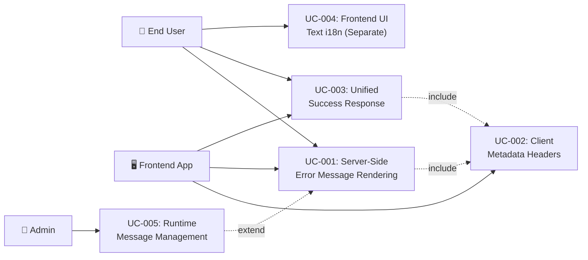

# Tài liệu phân tích nghiệp vụ: API Response & i18n Standard

> Phân tích nghiệp vụ chi tiết — chia nhỏ theo use case, đặc tả ngữ nghĩa từng chức năng.

---

## 1. Tổng quan (Overview)

### 1.1 Bối cảnh nghiệp vụ (Business Context)

Hệ thống auth-service phục vụ nhiều client platforms (web, mobile, desktop). Hiện tại, mỗi client tự build error message từ error code + params, dẫn đến logic duplicate, inconsistent wording, và không thể hỗ trợ đa ngôn ngữ. Cần chuẩn hóa để server render message hoàn chỉnh, client chỉ hiển thị.

### 1.2 Mục tiêu (Objectives)

| # | Mục tiêu | KPI đo lường | Độ ưu tiên |
|---|---------|-------------|-----------|
| O-01 | Server render message i18n hoàn chỉnh cho tất cả API responses | 100% endpoints return localized message/detail | High |
| O-02 | Client chỉ show message — không tự compose | 0 client-side message templates cho API errors | High |
| O-03 | Unified response contract (ApiResponse + ProblemDetail) | 100% success = ApiResponse, 100% error = ProblemDetail | High |
| O-04 | Client gửi metadata headers trên mọi request | 100% requests include Accept-Language | Medium |
| O-05 | Support ≥ 2 ngôn ngữ (en + vi) | Message bundles cho en + vi | Medium |

### 1.3 Phạm vi (Scope)

| In Scope | Out of Scope |
|----------|-------------|
| Server-side i18n message rendering (MessageSource) | Real-time translation service (Google Translate) |
| Accept-Language locale resolution | Admin CRUD UI for i18n messages |
| Message bundles (.properties) for en, vi | Khmer translation content (structure only) |
| DatabaseMessageSource (runtime message management) | Client-side i18n overhaul (react-i18next) |
| ProblemDetail (RFC 9457) for errors | Changing ApiResponse<T> structure |
| Content-Language response header | Pagination/filtering i18n |
| Client metadata headers (X-App-Version, X-Client-Platform) | API versioning via headers |

### 1.4 Stakeholders & Actors

| Actor | Loại | Mô tả | Tương tác chính |
|-------|------|--------|----------------|
| End User | Primary | User cuối sử dụng app qua web/mobile | Nhận API messages đa ngôn ngữ |
| Frontend Application | Primary | React web app (admindashboard) | Gửi Accept-Language, hiển thị message/detail |
| Mobile App | Primary | iOS/Android client (future) | Gửi Accept-Language, hiển thị message/detail |
| Auth Service | System | Spring Boot backend | Resolve locale, render message, return response |
| MessageSource | System | Spring MessageSource (DB + file composite) | Resolve message key → localized string |
| Admin | Secondary | System admin quản lý i18n messages | Thêm/sửa message qua DB (i18n_messages table) |

---

## 2. Use Case Diagram (tổng quan)



---

## 3. Danh sách Use Case (Use Case Index)

| UC-ID | Tên Use Case | Actor | Nhóm chức năng | Độ ưu tiên | Trạng thái |
|-------|-------------|-------|----------------|-----------|-----------|
| UC-001 | Server-Side Error Message Rendering | End User, Frontend App | i18n Error Handling | High | Draft |
| UC-002 | Client Metadata Headers | Frontend App | Request Contract | Medium | Draft |
| UC-003 | Unified Success Response Format | End User, Frontend App | Response Contract | High | Draft |
| UC-004 | Frontend UI Text i18n (Separate) | End User | Frontend i18n | Medium | Draft |
| UC-005 | Runtime Message Management | Admin | i18n Administration | Low | Draft |

---

## 4. Đặc tả Use Case chi tiết

### UC-001: Server-Side Error Message Rendering

#### 4.1 Thông tin chung

| Mục | Nội dung |
|-----|----------|
| **Mã** | UC-001 |
| **Tên** | Render Error Message Server-Side |
| **Mô tả ngữ nghĩa** | Khi server trả lỗi, message PHẢI được render hoàn chỉnh (đã interpolate params) bằng ngôn ngữ mà client request. Điều này đảm bảo SINGLE SOURCE OF TRUTH cho error messages — tất cả clients (web, mobile, desktop) nhận cùng wording, không cần duplicate message templates. |
| **Actor** | End User (trigger), Frontend App (receive), Auth Service (render) |
| **Trigger** | Client gửi API request gây ra exception |
| **Độ ưu tiên** | High |
| **Tần suất** | On-demand — mỗi khi có error response |
| **Nhóm chức năng** | i18n Error Handling |

#### 4.2 Điều kiện

| Loại | Mô tả |
|------|--------|
| **Pre-conditions** | MessageSource bean configured (I18nConfig); Message bundles present (auth-messages*.properties); AuthControllerAdvice extends BaseControllerAdvice |
| **Post-conditions (Success)** | ProblemDetail response with localized `detail` field; Content-Language header set; errorCode present for client logic |
| **Post-conditions (Failure)** | Fallback to English default message; Content-Language = en; error still returned with correct HTTP status |
| **Invariants** | errorCode (machine-readable) NEVER changes by locale; HTTP status matches exception type |

#### 4.3 Luồng chính (Basic Flow)

| Step | Actor Action | System Response | Data | Ghi chú |
|------|-------------|----------------|------|---------|
| 1 | Client gửi request với `Accept-Language: vi-VN` | LocaleResolver reads header → `LocaleContextHolder.setLocale(vi)` | Locale=vi | AcceptHeaderLocaleResolver |
| 2 | - | Controller delegates to Handler | Request DTO | CQRS pattern |
| 3 | - | Handler throws AuthException (e.g., `RateLimitExceededException`) | authError=AUTH_020, retryAfterSeconds=60, dimension="IP" | Domain exception |
| 4 | - | AuthControllerAdvice.handleAuthException() catches | AuthException | @ExceptionHandler |
| 5 | - | extractMessageArgs(ex) → `[60, "IP"]` | args array | Per-exception type mapping |
| 6 | - | resolveMessage("auth.rate_limited", [60, "IP"], defaultMsg) | MessageSource lookup | DB → file → default chain |
| 7 | - | MessageSource returns "Quá nhiều lần đăng nhập (IP). Vui lòng đợi." | Interpolated Vietnamese | MessageFormat {0}, {1} |
| 8 | - | Build ProblemDetail: detail=resolved, errorCode=AUTH_020, retryAfterSeconds=60 | ProblemDetail JSON | RFC 9457 |
| 9 | - | Set Content-Language: vi | Response header | RFC 7231 |
| 10 | Client receives 429 response | Show `problem.detail` directly — no string building | ProblemDetail | Client just displays |

#### 4.4 Luồng thay thế (Alternative Flows)

##### AF-001: Accept-Language missing
- **Trigger**: Tại Step 1 khi header not present
- **Steps**:
  1. LocaleResolver falls back to default locale `en`
  2. Continue from Step 2 with locale=en
- **Rejoin**: Quay lại Step 2 của Basic Flow

##### AF-002: Multiple Accept-Language values
- **Trigger**: Tại Step 1 khi `Accept-Language: vi-VN, vi;q=0.9, en;q=0.8`
- **Steps**:
  1. AcceptHeaderLocaleResolver picks highest quality value: `vi-VN` → `vi`
  2. Continue from Step 2 with locale=vi
- **Rejoin**: Quay lại Step 2 của Basic Flow

#### 4.5 Luồng ngoại lệ (Exception Flows)

##### EF-001: Message key not found in bundle
- **Trigger**: Tại Step 6 khi message key không có trong DB hoặc file
- **Error**: MessageSource returns null for key
- **Handling**:
  1. Fallback to `ErrorCodeBase.description` (English hardcoded)
  2. Log warning: "Missing i18n key: auth.rate_limited for locale: vi"
- **Post-condition**: Response still returned with English fallback message

##### EF-002: MessageFormat interpolation mismatch
- **Trigger**: Tại Step 7 khi args count doesn't match template placeholders
- **Error**: `IllegalArgumentException` from `MessageFormat`
- **Handling**:
  1. Catch exception, log warning
  2. Return raw template without interpolation
- **Post-condition**: Response returned with un-interpolated template

##### EF-003: DatabaseMessageSource query fails
- **Trigger**: Tại Step 6 khi DB is unavailable
- **Error**: Database connection error
- **Handling**:
  1. DatabaseMessageSource logs warning, returns null
  2. AbstractMessageSource delegates to parent (file-based)
  3. File-based MessageSource resolves successfully
- **Post-condition**: Response returned with file-based message (transparent to client)

#### 4.6 Quy tắc nghiệp vụ (Business Rules)

| BR-ID | Quy tắc | Mô tả chi tiết | Validation |
|-------|---------|----------------|-----------|
| BR-001 | Server MUST render message | Server PHẢI render message hoàn chỉnh — client KHÔNG ĐƯỢC tự compose từ error params | Code review: no client-side message templates |
| BR-002 | Default language = en | Nếu không có Accept-Language, dùng English | Config: `defaultLocale=Locale.ENGLISH` |
| BR-003 | errorCode is locale-invariant | `errorCode` field (AUTH_001, AUTH_020...) KHÔNG thay đổi theo ngôn ngữ | Unit test: same errorCode regardless of locale |
| BR-004 | Message key = ErrorCodeBase.msgCode | Convention: message bundle key = `AuthErrorCode.msgCode` (e.g., `auth.rate_limited`) | Compile-time: enum values match .properties keys |

#### 4.7 Yêu cầu phi chức năng (cho UC này)

| Loại | Yêu cầu | Target |
|------|---------|--------|
| Performance | Message resolution time | < 5ms (Caffeine cached) |
| Performance | DB fallback time | < 50ms (cold) |
| Availability | Service works without DB i18n | Yes — file bundles as fallback |
| Concurrency | Thread-safe locale resolution | LocaleContextHolder (thread-local) |

#### 4.8 Mockup / Wireframe Description

```
Error Response (ProblemDetail — 429):
┌─────────────────────────────────────────────────────┐
│  HTTP/1.1 429 Too Many Requests                      │
│  Content-Type: application/problem+json              │
│  Content-Language: vi                                 │
│  Retry-After: 60                                      │
├─────────────────────────────────────────────────────┤
│  {                                                    │
│    "type": "https://auth-service/errors/rate_limited",│
│    "title": "AUTH_020",                               │
│    "status": 429,                                     │
│    "detail": "Quá nhiều lần đăng nhập (IP). Đợi.",   │
│    "errorCode": "AUTH_020",                           │
│    "retryAfterSeconds": 60,                           │
│    "dimension": "IP"                                  │
│  }                                                    │
└─────────────────────────────────────────────────────┘
```

---

### UC-002: Client Metadata Headers

#### 4.1 Thông tin chung

| Mục | Nội dung |
|-----|----------|
| **Mã** | UC-002 |
| **Tên** | Send Client Metadata Headers |
| **Mô tả ngữ nghĩa** | Mỗi request từ client kèm metadata headers để server resolve locale, log audit info, và hỗ trợ feature flagging. Đây là CONTRACT giữa client và server — đảm bảo server có đủ thông tin để personalize response. |
| **Actor** | Frontend App |
| **Trigger** | Mỗi API request từ client |
| **Độ ưu tiên** | Medium |
| **Tần suất** | Mỗi API call — daily thousands |
| **Nhóm chức năng** | Request Contract |

#### 4.2 Điều kiện

| Loại | Mô tả |
|------|--------|
| **Pre-conditions** | ky HTTP client configured with `beforeRequest` hook; i18n language setting available |
| **Post-conditions (Success)** | Request includes Accept-Language, X-App-Version, X-Client-Platform headers |
| **Post-conditions (Failure)** | Request sent without headers; server uses defaults |
| **Invariants** | Headers are set once on app init and updated only when language changes |

#### 4.3 Luồng chính (Basic Flow)

| Step | Actor Action | System Response | Data | Ghi chú |
|------|-------------|----------------|------|---------|
| 1 | App initializes | Read `i18n.language` setting | `vi` | From localStorage or browser |
| 2 | - | Read `APP_VERSION` from env/config | `1.0.0` | Build-time constant |
| 3 | - | Detect platform | `web` | Runtime detection |
| 4 | - | Set global headers via ky `beforeRequest` hook | Headers object | Once on init |
| 5 | User triggers API call | ky includes headers automatically | `Accept-Language: vi-VN`, `X-App-Version: 1.0.0`, `X-Client-Platform: web` | Every request |

#### 4.4 Luồng thay thế (Alternative Flows)

##### AF-001: User changes language
- **Trigger**: Tại any time khi user changes language setting
- **Steps**:
  1. `i18n.changeLanguage('en')` → updates react-i18next
  2. Update ky global header: `Accept-Language: en`
  3. Subsequent API calls use new locale
- **Rejoin**: Continues normal request flow

#### 4.5 Luồng ngoại lệ (Exception Flows)

##### EF-001: Headers not configured
- **Trigger**: ky instance not configured with global headers
- **Error**: No Accept-Language sent
- **Handling**:
  1. Server defaults to `en` locale
  2. Response in English
- **Post-condition**: Functional but not localized

#### 4.6 Quy tắc nghiệp vụ (Business Rules)

| BR-ID | Quy tắc | Mô tả chi tiết | Validation |
|-------|---------|----------------|-----------|
| BR-005 | Accept-Language RFC 7231 | Format: `vi-VN, vi;q=0.9, en;q=0.8` with quality values | HTTP header validation |
| BR-006 | X-App-Version = semver | Semantic versioning format `MAJOR.MINOR.PATCH` | Regex validation |
| BR-007 | X-Client-Platform enum | Value ∈ {web, ios, android, desktop} | Server-side validation |

#### 4.7 Yêu cầu phi chức năng (cho UC này)

| Loại | Yêu cầu | Target |
|------|---------|--------|
| Performance | Header overhead | < 200 bytes per request |
| Reliability | Missing headers handled | Server defaults applied |

#### 4.8 Mockup / Wireframe Description

```
Request Headers:
┌─────────────────────────────────────────────┐
│  POST /api/auth/login HTTP/1.1              │
│  Content-Type: application/json             │
│  Authorization: Bearer <token>              │
│  Accept-Language: vi-VN, vi;q=0.9, en;q=0.8│
│  X-App-Version: 1.0.0                       │
│  X-Client-Platform: web                     │
│  X-Device-Fingerprint: <hash>               │
└─────────────────────────────────────────────┘
```

---

### UC-003: Unified Success Response Format

#### 4.1 Thông tin chung

| Mục | Nội dung |
|-----|----------|
| **Mã** | UC-003 |
| **Tên** | Return Unified Success Response with i18n |
| **Mô tả ngữ nghĩa** | Tất cả success responses dùng `ApiResponse<T>` với `message` field i18n server-side. Client hiển thị `message` trực tiếp cho toast/notification. Đảm bảo consistency giữa success và error response localization. |
| **Actor** | End User, Frontend App |
| **Trigger** | API request xử lý thành công |
| **Độ ưu tiên** | High |
| **Tần suất** | Majority of API calls |
| **Nhóm chức năng** | Response Contract |

#### 4.2 Điều kiện

| Loại | Mô tả |
|------|--------|
| **Pre-conditions** | MessageSource configured; Message bundles include success keys (e.g., `auth.login_success`) |
| **Post-conditions (Success)** | ApiResponse<T> with localized message, Content-Language header set |
| **Post-conditions (Failure)** | ApiResponse<T> with English default message |
| **Invariants** | `code` = "00" for all successes; `data` contains business payload |

#### 4.3 Luồng chính (Basic Flow)

| Step | Actor Action | System Response | Data | Ghi chú |
|------|-------------|----------------|------|---------|
| 1 | Client sends login request | Controller receives, delegates to handler | LoginCommand | CQRS |
| 2 | - | Handler processes successfully | LoginResult.Success | Business logic |
| 3 | - | Controller resolves success message via MessageSource | `MessageSource.getMessage("auth.login_success", null, locale)` | i18n |
| 4 | - | MessageSource returns "Đăng nhập thành công" | Localized string | Vietnamese |
| 5 | - | Controller builds `ApiResponse.success(data, resolvedMessage)` | ApiResponse JSON | Wrapper |
| 6 | - | Set Content-Language: vi | Response header | RFC 7231 |
| 7 | Client receives 200 OK | Show `response.message` as toast | "Đăng nhập thành công" | Direct display |

#### 4.4 Luồng thay thế (Alternative Flows)

##### AF-001: No success message key defined
- **Trigger**: Tại Step 3 khi no message key for this success action
- **Steps**:
  1. Use generic success message: `MessageSource.getMessage("success.default", null, locale)`
  2. Continue from Step 5
- **Rejoin**: Quay lại Step 5 của Basic Flow

#### 4.5 Luồng ngoại lệ (Exception Flows)

##### EF-001: MessageSource fails for success message
- **Trigger**: Tại Step 3 khi message resolution fails
- **Error**: Key not found
- **Handling**:
  1. Fallback to hardcoded English: "Operation successful"
  2. Log warning
- **Post-condition**: Response returned with English fallback

#### 4.6 Quy tắc nghiệp vụ (Business Rules)

| BR-ID | Quy tắc | Mô tả chi tiết | Validation |
|-------|---------|----------------|-----------|
| BR-008 | Success = ApiResponse<T> | Success response PHẢI dùng `ApiResponse<T>` (base-core) | Code review |
| BR-009 | Error = ProblemDetail | Error response PHẢI dùng ProblemDetail (RFC 9457) | Code review |
| BR-010 | Distinguish by HTTP status | Client dùng HTTP status code: 2xx = success, 4xx/5xx = error | HTTP standard |

#### 4.7 Yêu cầu phi chức năng (cho UC này)

| Loại | Yêu cầu | Target |
|------|---------|--------|
| Performance | Response time impact | < 2ms overhead for message resolution |
| Consistency | All success responses have message | 100% endpoints |

#### 4.8 Mockup / Wireframe Description

```
Success Response (ApiResponse<T> — 200):
┌──────────────────────────────────────────┐
│  HTTP/1.1 200 OK                          │
│  Content-Type: application/json           │
│  Content-Language: vi                      │
├──────────────────────────────────────────┤
│  {                                        │
│    "code": "00",                          │
│    "msgCode": "SUCCESS",                  │
│    "message": "Đăng nhập thành công",     │
│    "data": {                              │
│      "accessToken": "eyJ...",             │
│      "userId": 123                        │
│    },                                     │
│    "timestamp": 1723372800000             │
│  }                                        │
└──────────────────────────────────────────┘
```

---

### UC-004: Frontend UI Text i18n (Separate)

#### 4.1 Thông tin chung

| Mục | Nội dung |
|-----|----------|
| **Mã** | UC-004 |
| **Tên** | Manage Frontend UI Text i18n |
| **Mô tả ngữ nghĩa** | UI text (buttons, labels, placeholders, navigation) i18n riêng bằng react-i18next, KHÔNG lấy từ server. Đảm bảo tách biệt giữa API message i18n (server) và UI text i18n (client). Language switch đồng bộ cả 2 layer. |
| **Actor** | End User |
| **Trigger** | User đổi language setting |
| **Độ ưu tiên** | Medium |
| **Tần suất** | On-demand — khi user đổi ngôn ngữ |
| **Nhóm chức năng** | Frontend i18n |

#### 4.2 Điều kiện

| Loại | Mô tả |
|------|--------|
| **Pre-conditions** | react-i18next configured; locale JSON files bundled with frontend |
| **Post-conditions (Success)** | UI text updated to new language; Accept-Language header updated for API calls |
| **Post-conditions (Failure)** | Fallback to English UI text |
| **Invariants** | Server API messages and frontend UI text always in same language |

#### 4.3 Luồng chính (Basic Flow)

| Step | Actor Action | System Response | Data | Ghi chú |
|------|-------------|----------------|------|---------|
| 1 | User clicks "Tiếng Việt" | i18n.changeLanguage('vi') | locale=vi | react-i18next |
| 2 | - | Re-render all UI text components | Buttons, labels, placeholders | Instant |
| 3 | - | Update ky global header: Accept-Language: vi-VN | Header update | Sync |
| 4 | User triggers next API call | Server returns Vietnamese messages | API response | Consistent |

#### 4.5 Luồng ngoại lệ (Exception Flows)

##### EF-001: Locale JSON file missing
- **Trigger**: Tại Step 1 khi locale file not bundled
- **Error**: i18next fallback
- **Handling**:
  1. i18next falls back to `en` locale
  2. UI shows English text
- **Post-condition**: Functional with English fallback

#### 4.6 Quy tắc nghiệp vụ (Business Rules)

| BR-ID | Quy tắc | Mô tả chi tiết | Validation |
|-------|---------|----------------|-----------|
| BR-011 | UI text = frontend bundles | UI text (labels, buttons) từ react-i18next JSON files | Code review |
| BR-012 | API messages = server i18n | API `message`/`detail` từ server MessageSource | Integration test |
| BR-013 | Language switch syncs both | Khi user đổi language → cả UI text và API messages đổi | E2E test |

#### 4.7 Yêu cầu phi chức năng (cho UC này)

| Loại | Yêu cầu | Target |
|------|---------|--------|
| Performance | Language switch time | < 100ms (UI re-render) |
| UX | No page reload | In-place re-render |

#### 4.8 Mockup / Wireframe Description

```
Language Selector:
┌─────────────────────────────────┐
│  Settings                        │
├─────────────────────────────────┤
│  Language: [🇻🇳 Tiếng Việt ▼]  │
│            ┌─────────────┐      │
│            │ 🇺🇸 English  │      │
│            │ 🇻🇳 Tiếng Việt│     │
│            └─────────────┘      │
└─────────────────────────────────┘
```

---

### UC-005: Runtime Message Management

#### 4.1 Thông tin chung

| Mục | Nội dung |
|-----|----------|
| **Mã** | UC-005 |
| **Tên** | Manage i18n Messages at Runtime |
| **Mô tả ngữ nghĩa** | Admin có thể thêm/sửa/xóa i18n messages qua DB (i18n_messages table) mà không cần redeploy. DatabaseMessageSource tự động pick up changes qua Caffeine cache TTL (5 phút). Hữu ích cho fixing typos, adding new translations, A/B testing message wording. |
| **Actor** | Admin |
| **Trigger** | Admin thêm/sửa message trong i18n_messages table |
| **Độ ưu tiên** | Low |
| **Tần suất** | Rare — khi cần sửa message |
| **Nhóm chức năng** | i18n Administration |

#### 4.2 Điều kiện

| Loại | Mô tả |
|------|--------|
| **Pre-conditions** | i18n_messages table exists; DatabaseMessageSource configured |
| **Post-conditions (Success)** | New message visible after cache TTL (≤ 5 min) |
| **Post-conditions (Failure)** | File bundle fallback continues to work |
| **Invariants** | File bundles always available as fallback |

#### 4.3 Luồng chính (Basic Flow)

| Step | Actor Action | System Response | Data | Ghi chú |
|------|-------------|----------------|------|---------|
| 1 | Admin inserts row: code=auth.rate_limited, locale=vi, message="..." | DB row created | I18nMessageEntity | Direct DB or admin API |
| 2 | - | Caffeine cache TTL expires (≤ 5 min) | Cache eviction | Automatic |
| 3 | Next API error for auth.rate_limited | DatabaseMessageSource queries DB | New message | Cache miss → DB hit |
| 4 | - | New message cached, returned to client | Cached for 5 min | Transparent |

#### 4.6 Quy tắc nghiệp vụ (Business Rules)

| BR-ID | Quy tắc | Mô tả chi tiết | Validation |
|-------|---------|----------------|-----------|
| BR-014 | DB messages override file bundles | DatabaseMessageSource is checked before file-based source | Config: parent chain order |
| BR-015 | Cache TTL = 5 minutes | Changes visible within 5 minutes without restart | Config: Caffeine TTL |
| BR-016 | is_active flag for soft delete | Messages can be deactivated without deleting | DB constraint |

#### 4.7 Yêu cầu phi chức năng (cho UC này)

| Loại | Yêu cầu | Target |
|------|---------|--------|
| Performance | DB query time | < 50ms |
| Availability | Service works without DB i18n | Yes — file bundle fallback |
| Cache | Hit ratio | > 95% (5-min TTL) |

---

## 5. Ma trận truy xuất (Traceability Matrix)

| UC-ID | FR-ID | NFR-ID | BR-ID | Screen | API Endpoint | DB Entity |
|-------|-------|--------|-------|--------|-------------|-----------|
| UC-001 | FR-001, FR-002, FR-003 | NFR-001, NFR-002 | BR-001, BR-002, BR-003, BR-004 | N/A (response format) | All error endpoints | I18nMessageEntity |
| UC-002 | FR-004, FR-005 | NFR-003 | BR-005, BR-006, BR-007 | N/A (request headers) | All endpoints | N/A |
| UC-003 | FR-006, FR-007 | NFR-001, NFR-004 | BR-008, BR-009, BR-010 | N/A (response format) | All success endpoints | N/A |
| UC-004 | FR-008 | NFR-005 | BR-011, BR-012, BR-013 | Language selector | N/A | N/A |
| UC-005 | FR-009, FR-010 | NFR-006, NFR-007 | BR-014, BR-015, BR-016 | Admin DB access | N/A | I18nMessageEntity |

---

## 6. Yêu cầu chức năng tổng hợp (Functional Requirements)

| FR-ID | Tên | Mô tả | UC liên quan | Độ ưu tiên |
|-------|-----|--------|-------------|-----------|
| FR-001 | Server-side message rendering | Hệ thống phải render message i18n hoàn chỉnh trong response | UC-001 | High |
| FR-002 | Message interpolation | Hệ thống phải interpolate params vào message template (MessageFormat {0}) | UC-001 | High |
| FR-003 | Fallback chain | Hệ thống phải fallback: DB → file → default khi message key not found | UC-001 | High |
| FR-004 | Accept-Language resolution | Hệ thống phải đọc Accept-Language header để resolve locale | UC-002 | High |
| FR-005 | Client metadata logging | Hệ thống phải log X-App-Version, X-Client-Platform vào MDC | UC-002 | Medium |
| FR-006 | Success response i18n | Hệ thống phải i18n `message` field trong ApiResponse<T> | UC-003 | High |
| FR-007 | Content-Language header | Hệ thống phải set Content-Language trên tất cả responses | UC-003, UC-001 | Medium |
| FR-008 | Frontend language sync | Frontend phải đồng bộ language setting với Accept-Language header | UC-004 | Medium |
| FR-009 | DB message management | Hệ thống phải hỗ trợ thêm/sửa message qua i18n_messages table | UC-005 | Low |
| FR-010 | Cache invalidation | Message cache phải tự invalidate sau TTL (5 phút) | UC-005 | Low |

---

## 7. Yêu cầu phi chức năng tổng hợp (Non-Functional Requirements)

| NFR-ID | Loại | Yêu cầu | Target | Measurement |
|--------|------|---------|--------|-------------|
| NFR-001 | Performance | Message resolution overhead | < 5ms (cached) | APM trace |
| NFR-002 | Availability | Service works without DB i18n | Yes | Failover test |
| NFR-003 | Performance | Header parsing overhead | < 1ms | Negligible |
| NFR-004 | Consistency | All responses have Content-Language | 100% | Integration test |
| NFR-005 | UX | Language switch without reload | In-place re-render | Manual test |
| NFR-006 | Performance | DB query for message | < 50ms | Slow query log |
| NFR-007 | Reliability | Cache hit ratio | > 95% | Redis/Caffeine metrics |

---

## 8. Thuật ngữ nghiệp vụ (Glossary)

| Thuật ngữ | Định nghĩa | Context sử dụng |
|-----------|-----------|-----------------|
| MessageSource | Spring interface for resolving localized messages from bundles or DB | Server-side i18n core abstraction |
| ProblemDetail | RFC 9457 standard error response format with type, title, status, detail | Error API responses |
| ApiResponse<T> | Base-core success response wrapper with code, msgCode, message, data | Success API responses |
| DatabaseMessageSource | Custom AbstractMessageSource that queries i18n_messages table with Caffeine cache | Runtime message management |
| Accept-Language | HTTP header indicating client's preferred languages with quality values | Locale negotiation |
| Content-Language | HTTP response header indicating the language of the response content | Response localization indicator |
| ErrorCodeBase | Base-core enum base class carrying code, msgCode, description per error type | Error code convention |

---

## 9. Phụ lục (Appendix)

### 9.1 Research References

- [opensource_findings.md](./opensource_findings.md)
- [web_research.md](./web_research.md)
- [comparison_analysis.md](./comparison_analysis.md)

### 9.2 Open Questions

- [ ] OQ-001: Should Content-Language be set via a servlet filter (all responses) or per-controller method?
- [ ] OQ-002: Should base-core's BaseControllerAdvice get MessageSource injection, or only auth-service's AuthControllerAdvice?

### 9.3 Assumptions

- ⚠️ AS-001: Frontend ky client `beforeRequest` hook is reliable for global headers — Lý do: confirmed via codebase scan, already used for Authorization header
- ⚠️ AS-002: Caffeine cache 5-min TTL is acceptable delay for message updates — Lý do: i18n message changes are rare, 5-min is standard practice
- ⚠️ AS-003: Base-core BaseControllerAdvice accepts nullable MessageSource without breaking other services — Lý do: Kotlin nullable type, default to no-op if null

---

> **Next step**: Technical Specification (technical_spec.md)
> **Traceability**: Research Brief → Business Analysis → Technical Spec
