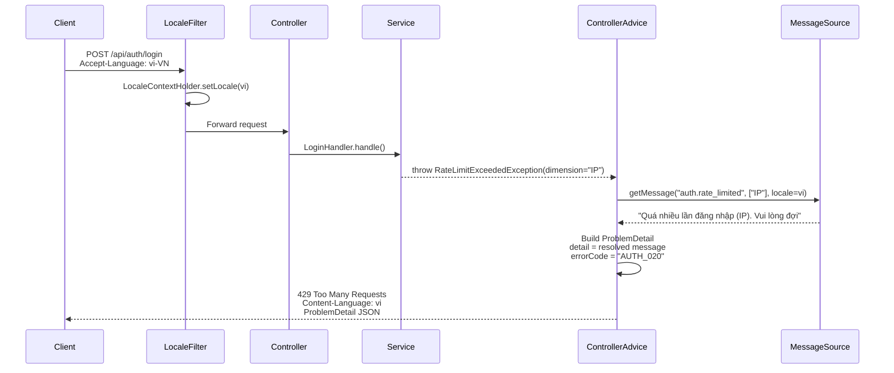
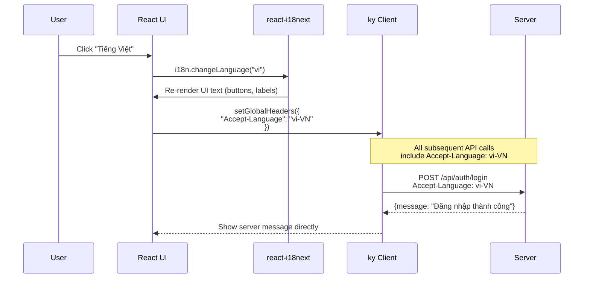

# Technical Specification: API Response & i18n Standard

## Architecture

```mermaid
flowchart TB
    subgraph Client["Client Layer"]
        FE["Frontend (React)"]
        FE_I18N["react-i18next<br/>UI Text i18n"]
        API_CLIENT["ky HTTP Client<br/>+ Global Headers"]
    end

    subgraph Headers["Request Headers"]
        H1["Accept-Language: vi-VN"]
        H2["X-App-Version: 1.0.0"]
        H3["X-Client-Platform: web"]
        H4["Authorization: Bearer ..."]
    end

    subgraph Server["Server Layer"]
        FILTER["LocaleResolverFilter<br/>(AcceptHeaderLocaleResolver)"]
        CTRL["Controller"]
        SVC["Service / Handler"]
        ADVICE["ControllerAdvice"]
        MSG_SRC["MessageSource<br/>(ReloadableResourceBundle)"]
        BUNDLES["Message Bundles<br/>messages_en.properties<br/>messages_vi.properties<br/>messages_km.properties"]
    end

    subgraph Response["Response Format"]
        R_OK["2xx: ApiResponse&#60;T&#62;<br/>{code, msgCode, message, data}"]
        R_ERR["4xx/5xx: ProblemDetail<br/>{type, title, status, detail, errorCode, ...}"]
    end

    FE --> FE_I18N
    FE --> API_CLIENT
    API_CLIENT --> H1 & H2 & H3 & H4
    H1 & H2 & H3 & H4 --> FILTER
    FILTER --> CTRL
    CTRL --> SVC
    SVC -->|Exception| ADVICE
    CTRL -->|Success| R_OK
    ADVICE --> MSG_SRC
    MSG_SRC --> BUNDLES
    ADVICE --> R_ERR
```



## Data Schema

### Request Headers Contract

```yaml
# Standard headers — REQUIRED
Accept-Language: "vi-VN, vi;q=0.9, en;q=0.8"  # RFC 7231

# Custom headers — RECOMMENDED
X-App-Version: "1.0.0"       # Semantic version
X-Client-Platform: "web"      # web | ios | android | desktop

# Existing headers — unchanged
Authorization: "Bearer <token>"
X-Device-Fingerprint: "<hash>"
Content-Type: "application/json"
```

### Success Response Contract: `ApiResponse<T>`

```json
{
  "code": "00",
  "msgCode": "SUCCESS",
  "message": "Đăng nhập thành công",       // ← server-rendered i18n
  "data": {
    "accessToken": "eyJ...",
    "userId": 123,
    "username": "admin",
    "roles": ["ADMIN"]
  },
  "timestamp": 1723372800000
}
```

**Response headers:**
```
Content-Type: application/json
Content-Language: vi
```

### Error Response Contract: `ProblemDetail` (RFC 9457)

```json
{
  "type": "https://auth-service/errors/rate_limited",
  "title": "AUTH_020",
  "status": 429,
  "detail": "Quá nhiều lần đăng nhập (IP). Vui lòng đợi.",   // ← server-rendered i18n
  "instance": "/api/auth/login",
  "errorCode": "AUTH_020",                                     // ← machine-readable (client logic)
  "retryAfterSeconds": 60,                                     // ← extension (client logic)
  "dimension": "IP"                                            // ← extension (client logic)
}
```

**Response headers:**
```
Content-Type: application/problem+json
Content-Language: vi
Retry-After: 60
```

### Client-Side Usage (Simplified)

```typescript
// ✅ AFTER — Client chỉ show message/detail
try {
  const result = await authLogin(credentials);
  showToast(result.message);  // "Đăng nhập thành công"
} catch (error) {
  if (error instanceof HTTPError) {
    const problem = await error.response.json();

    // Show server-rendered message directly
    setErrorMessage(problem.detail);

    // Machine-readable code cho client logic (không build string)
    switch (problem.errorCode) {
      case 'AUTH_007': setCaptchaRequired(true); break;
      case 'AUTH_020': setRateLimitRetry(problem.retryAfterSeconds); break;
      // No string building needed!
    }
  }
}
```

## Server Implementation

### Message Bundle Structure

```
src/main/resources/
├── messages.properties          # Default (English)
├── messages_vi.properties       # Vietnamese
└── messages_km.properties       # Khmer
```

**messages.properties (English — default):**
```properties
# Auth errors
auth.invalid_credentials=Invalid username or password
auth.account_locked=Your account is temporarily locked due to {0} failed attempts
auth.token_expired=Session expired. Please sign in again
auth.captcha_required=Security verification required
auth.captcha_failed=Security verification failed. Please try again
auth.rate_limited=Too many login attempts ({0}). Please wait
auth.session_limit=Maximum {0} sessions reached. An existing session was revoked
auth.mfa_code_invalid=Invalid verification code

# Success messages
success.login=Login successful
success.logout=Logged out successfully
success.password_changed=Password changed successfully
```

**messages_vi.properties (Vietnamese):**
```properties
# Auth errors
auth.invalid_credentials=Sai tên đăng nhập hoặc mật khẩu
auth.account_locked=Tài khoản tạm khóa do {0} lần đăng nhập thất bại
auth.token_expired=Phiên đăng nhập hết hạn. Vui lòng đăng nhập lại
auth.captcha_required=Yêu cầu xác minh bảo mật
auth.captcha_failed=Xác minh bảo mật thất bại. Vui lòng thử lại
auth.rate_limited=Quá nhiều lần đăng nhập ({0}). Vui lòng đợi
auth.session_limit=Đã đạt tối đa {0} phiên. Phiên cũ đã bị thu hồi
auth.mfa_code_invalid=Mã xác minh không hợp lệ

# Success messages
success.login=Đăng nhập thành công
success.logout=Đã đăng xuất thành công
success.password_changed=Đổi mật khẩu thành công
```

### Sequence Diagram: Server-Side i18n Error Flow



### Sequence Diagram: Frontend Language Sync



## API Endpoints

Không có endpoint mới — chỉ thay đổi response behavior trên **toàn bộ existing endpoints**.

| Change | Scope | Description |
|--------|-------|-------------|
| Request headers | All endpoints | Client gửi `Accept-Language`, `X-App-Version`, `X-Client-Platform` |
| Error `detail` | All error responses | Server-rendered i18n message thay vì English hardcode |
| Success `message` | All success responses | Server-rendered i18n message |
| Response header | All responses | `Content-Language: <resolved-locale>` |

## Component Changes

### base-core (shared library)

| File | Change |
|------|--------|
| `MessageSourceConfig.kt` [NEW] | `@Configuration` — configure `ReloadableResourceBundleMessageSource` |
| `LocaleConfig.kt` [NEW] | `AcceptHeaderLocaleResolver` bean + supported locales filter |
| `BaseControllerAdvice.kt` [MODIFY] | Inject `MessageSource`, resolve message in `handleBusinessException()` |
| `ApiResponse.kt` [MODIFY] | Add `lang` field (optional) for `Content-Language` |
| `messages.properties` [NEW] | Default English message bundles |

### auth-service

| File | Change |
|------|--------|
| `AuthControllerAdvice.kt` [MODIFY] | Inject `MessageSource`, resolve `detail` via `getMessage(msgCode, args, locale)` |
| `messages.properties` [NEW] | Auth-specific message bundles (en, vi, km) |
| `CqrsAuthController.kt` [MODIFY] | Use `MessageSource` for success messages |
| `ClientMetadataFilter.kt` [NEW] | Extract `X-App-Version`, `X-Client-Platform` → MDC for logging |

### admindashboard (frontend)

| File | Change |
|------|--------|
| `api.ts` [MODIFY] | Add `Accept-Language`, `X-App-Version`, `X-Client-Platform` to global headers |
| `I18nProvider.tsx` [MODIFY] | Sync `Accept-Language` header when language changes |
| `JwtSignInForm.tsx` [MODIFY] | Remove hardcoded error messages — show `problem.detail` directly |
| `SignInPageForm.tsx` [MODIFY] | Same as above |
| `authService.ts` [MODIFY] | Return `message` from `ApiResponse` for success toasts |

## Agent Implementation Notes

### Priority Order
1. **base-core**: `MessageSourceConfig` + `LocaleConfig` + `BaseControllerAdvice` refactor
2. **auth-service**: Message bundles + `AuthControllerAdvice` refactor
3. **frontend**: Header injection + message simplification

### Risk Assessment
- **Low risk**: Adding headers, message bundles — no behavior change
- **Medium risk**: `BaseControllerAdvice` refactor — shared library, affects all services
- **Low risk**: Frontend simplification — reduces code complexity

### Testing Strategy
- Unit test: `MessageSource.getMessage()` with different locales
- Integration test: Send `Accept-Language` → verify response language
- Frontend test: Verify `problem.detail` displayed (not hardcoded string)
