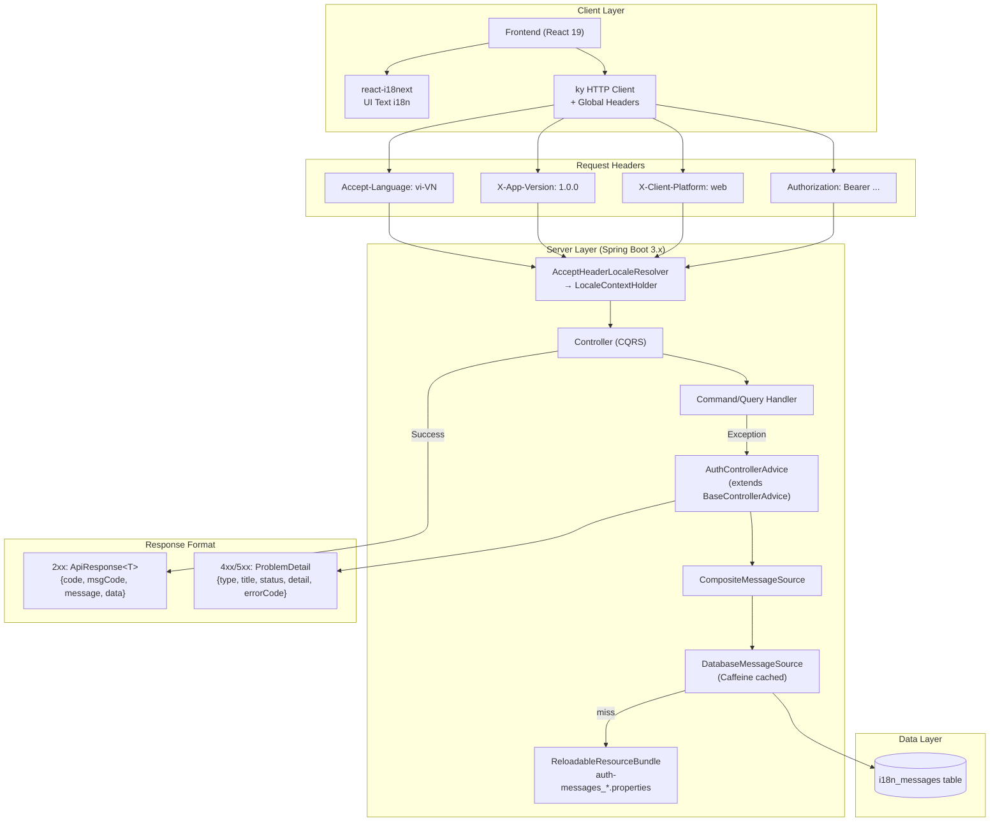
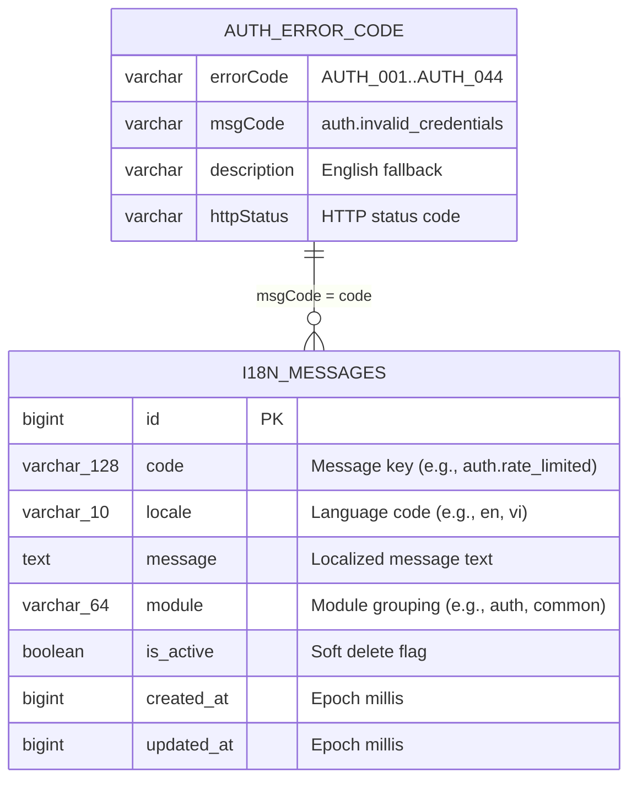
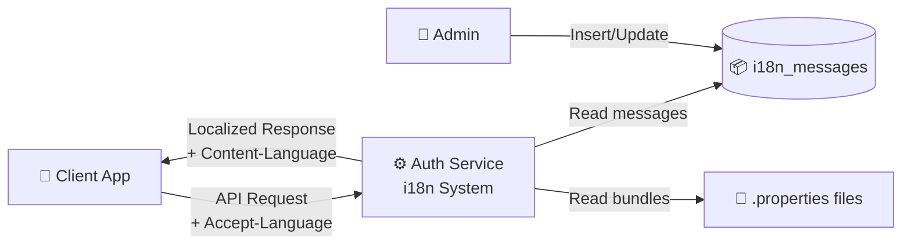
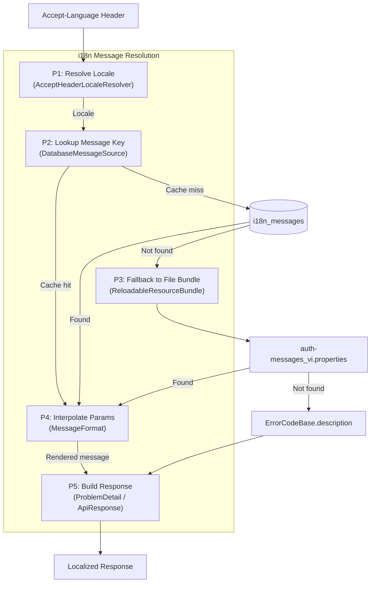
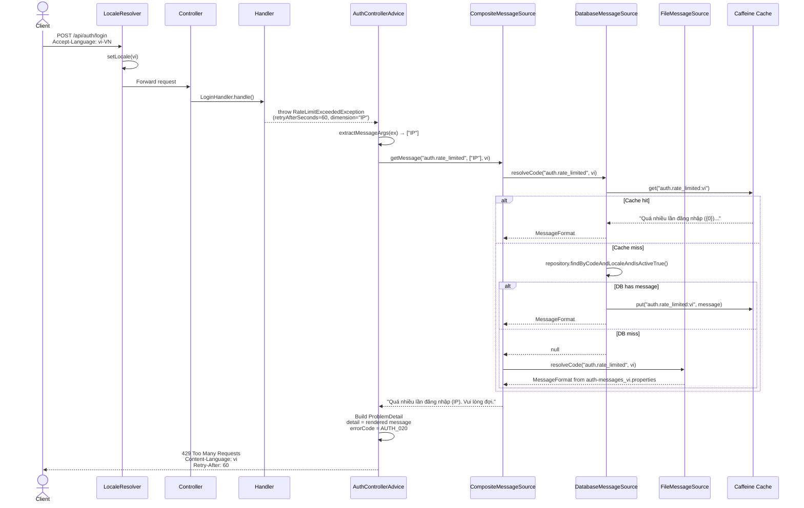
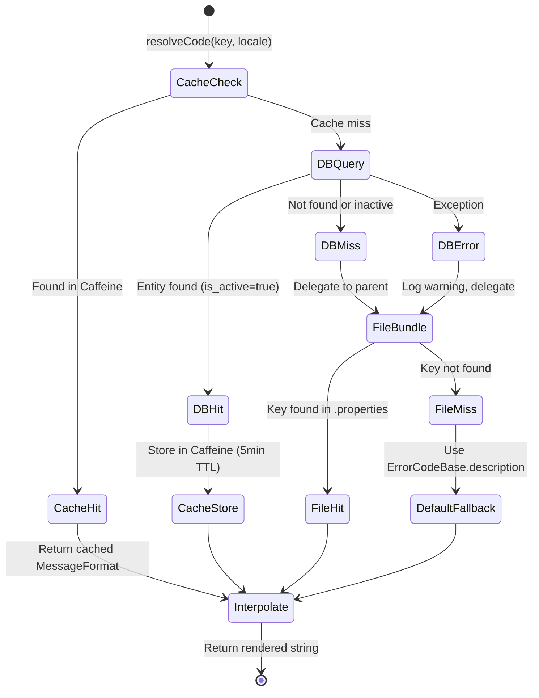
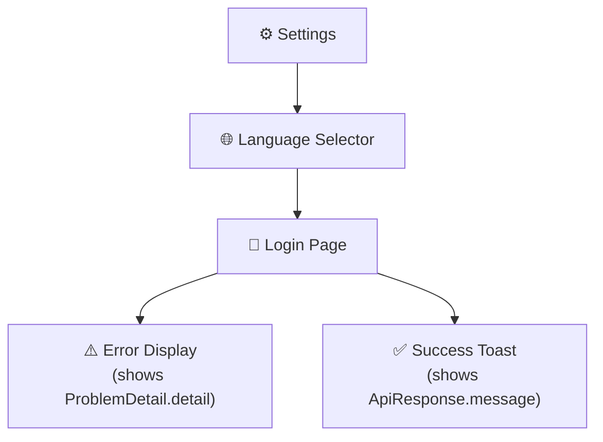

# Đặc tả kỹ thuật: API Response & i18n Standard

> Technical specification chi tiết — thiết kế để agent có thể đọc và dev code trực tiếp.

---

## 1. Tổng quan hệ thống (System Overview)

### 1.1 Kiến trúc tổng thể



### 1.2 Technology Stack

| Layer | Technology | Version | Ghi chú |
|-------|-----------|---------|---------|
| Language | Kotlin | 1.9+ | Coroutines not used (servlet stack) |
| Framework | Spring Boot | 3.x | Native ProblemDetail support |
| Database | PostgreSQL | 15+ | i18n_messages table |
| Cache | Caffeine | 3.x | In-process cache for DB MessageSource |
| Cache (external) | Redis | 7.x | Rate limiting only (not i18n) |
| HTTP Client (FE) | ky | 1.x | Fetch-based, global headers hook |
| Frontend i18n | react-i18next | 13+ | UI text only |
| Base library | base-core | internal | Shared across microservices |

### 1.3 Dependencies & Integrations

| Dependency | Type | Purpose | Interface |
|-----------|------|---------|-----------|
| base-core | Internal library | ApiResponse, BaseControllerAdvice, ErrorCodeBase | Kotlin classes |
| Spring MessageSource | Framework | i18n message resolution | `getMessage(code, args, locale)` |
| PostgreSQL (i18n_messages) | Database | Runtime message storage | JPA/JDBC |
| Caffeine | Library | Cache for DB message queries | In-process cache |
| react-i18next | Frontend library | UI text i18n | JavaScript API |

---

## 2. Lược đồ dữ liệu (Data Schema)

### 2.1 Entity-Relationship Diagram



### 2.2 Bảng chi tiết Entity

#### Entity: I18nMessageEntity

| Field | Type | Constraint | Default | Mô tả |
|-------|------|-----------|---------|--------|
| `id` | `BIGINT` | PK, AUTO_INCREMENT | - | Primary key |
| `code` | `VARCHAR(128)` | NOT NULL | - | Message key matching ErrorCodeBase.msgCode |
| `locale` | `VARCHAR(10)` | NOT NULL | - | Language code (e.g., `en`, `vi`, `km`) |
| `message` | `TEXT` | NOT NULL | - | Localized message text with MessageFormat placeholders |
| `module` | `VARCHAR(64)` | NOT NULL | `'common'` | Module grouping for bulk operations |
| `is_active` | `BOOLEAN` | NOT NULL | `true` | Soft delete flag |
| `created_at` | `BIGINT` | NOT NULL | `System.currentTimeMillis()` | Creation epoch millis |
| `updated_at` | `BIGINT` | NOT NULL | `System.currentTimeMillis()` | Update epoch millis |

#### Indexes

| Index Name | Columns | Type | Purpose |
|-----------|---------|------|---------|
| `idx_i18n_code_locale` | `code, locale` | BTREE UNIQUE | Primary lookup by DatabaseMessageSource |
| `idx_i18n_module_locale` | `module, locale` | BTREE | Bulk preloading by module |
| `idx_i18n_is_active` | `is_active` | BTREE | Filter active messages |

### 2.3 Database Migration Scripts (draft)

```sql
-- V1__create_i18n_messages.sql
CREATE TABLE IF NOT EXISTS i18n_messages (
    id BIGSERIAL PRIMARY KEY,
    code VARCHAR(128) NOT NULL,
    locale VARCHAR(10) NOT NULL,
    message TEXT NOT NULL,
    module VARCHAR(64) NOT NULL DEFAULT 'common',
    is_active BOOLEAN NOT NULL DEFAULT true,
    created_at BIGINT NOT NULL,
    updated_at BIGINT NOT NULL,
    CONSTRAINT uq_i18n_code_locale UNIQUE (code, locale)
);

CREATE INDEX idx_i18n_module_locale ON i18n_messages (module, locale);
CREATE INDEX idx_i18n_is_active ON i18n_messages (is_active);
```

---

## 3. Luồng dữ liệu (Data Flow)

### 3.1 Data Flow Diagram — Level 0 (Context)



### 3.2 Data Flow Diagram — Level 1 (chi tiết)



### 3.3 Data Transformation Rules

| # | Input | Process | Output | Validation Rules |
|---|-------|---------|--------|-----------------|
| 1 | `Accept-Language: vi-VN, vi;q=0.9, en;q=0.8` | Parse quality values, select best match | `Locale("vi")` | RFC 7231 §5.3.5, supported locales filter |
| 2 | `AuthErrorCode.msgCode` = `"auth.rate_limited"` | Lookup in MessageSource chain | `"Quá nhiều lần đăng nhập ({0}). Vui lòng đợi."` | NOT NULL, UTF-8 |
| 3 | Template + args `["IP"]` | `MessageFormat.format(template, args)` | `"Quá nhiều lần đăng nhập (IP). Vui lòng đợi."` | Args count matches placeholders |

---

## 4. Luồng xử lý (Processing Steps)

### 4.1 Sequence Diagram — UC-001: Server-Side Error i18n



### 4.2 Bảng Step xử lý chi tiết

#### UC-001: Server-Side Error Message Rendering

| Step | Component | Action | Input | Output | Error Handling | Ghi chú |
|------|-----------|--------|-------|--------|---------------|---------|
| 1 | LocaleResolver | Parse Accept-Language | HTTP header | Locale object | Missing → default `en` | Spring built-in |
| 2 | Controller | Delegate to handler | Request DTO | Handler result | N/A | CQRS pattern |
| 3 | Handler | Execute business logic | Command | Exception thrown | Domain exceptions | AuthException hierarchy |
| 4 | AuthControllerAdvice | Catch AuthException | AuthException | Message args | N/A | @ExceptionHandler |
| 5 | AuthControllerAdvice | Extract message args | AuthException subtype | Array<Any>? | null if no args | Per-exception mapping |
| 6 | CompositeMessageSource | Resolve message | msgCode, args, locale | Rendered string | Fallback chain | DB → file → default |
| 7 | AuthControllerAdvice | Build ProblemDetail | Rendered message + error info | ProblemDetail JSON | N/A | RFC 9457 |
| 8 | AuthControllerAdvice | Set headers | Locale | Content-Language, Retry-After | N/A | RFC 7231 |

#### UC-003: Unified Success Response

| Step | Component | Action | Input | Output | Error Handling | Ghi chú |
|------|-----------|--------|-------|--------|---------------|---------|
| 1 | LocaleResolver | Parse Accept-Language | HTTP header | Locale object | Missing → default `en` | Spring built-in |
| 2 | Controller | Process success | Handler result | Success data | N/A | CQRS pattern |
| 3 | Controller | Resolve success message | MessageSource, key, locale | Rendered string | Default "Success" | MessageSource lookup |
| 4 | Controller | Build ApiResponse | Data + message | ApiResponse<T> | N/A | base-core wrapper |
| 5 | Controller | Set Content-Language | Locale | Response header | N/A | RFC 7231 |

### 4.3 State Machine (Message Resolution Chain)



| Transition | From | To | Trigger | Guard Condition | Side Effect |
|-----------|------|-----|---------|----------------|------------|
| Cache lookup | CacheCheck | CacheHit | Key in cache | TTL not expired | None |
| Cache miss | CacheCheck | DBQuery | Key not in cache | - | DB query |
| DB found | DBQuery | DBHit | Entity exists | is_active=true | None |
| DB miss | DBQuery | FileBundle | Entity not found | - | Delegate to parent |
| DB error | DBQuery | FileBundle | Exception thrown | - | Log warning |
| Store cache | DBHit | CacheStore | - | - | Caffeine.put() |
| File found | FileBundle | FileHit | Key in .properties | - | None |
| Fallback | FileMiss | DefaultFallback | Key not in any source | - | Use hardcoded English |

---

## 5. Luồng màn hình (Screen Flow)

### 5.1 Screen Map (Sitemap)



### 5.2 Chi tiết từng Screen

| Screen ID | Tên | Mục đích | Data hiển thị | User Actions | Navigation |
|-----------|-----|----------|--------------|-------------|-----------|
| SCR-001 | Login Error | Hiển thị lỗi đăng nhập | `problem.detail` (server-rendered) | Retry, switch CAPTCHA | → Login form |
| SCR-002 | Success Toast | Thông báo thành công | `response.message` (server-rendered) | Dismiss | → Dashboard |
| SCR-003 | Language Selector | Đổi ngôn ngữ | Current language, available options | Select language | → Re-render all text |

### 5.3 Wireframe Description (text-based)

#### SCR-001: Login Error Display
```
┌─────────────────────────────────────┐
│  Login Form                          │
├─────────────────────────────────────┤
│  ⚠️ Error Alert:                     │
│  ┌─────────────────────────────────┐│
│  │ problem.detail (server-rendered)││
│  │ "Sai tên đăng nhập hoặc mật    ││
│  │  khẩu"                          ││
│  └─────────────────────────────────┘│
│  [ Username: _________ ]            │
│  [ Password: _________ ]            │
│  [ Login ]                           │
└─────────────────────────────────────┘
```

---

## 6. API Specification

### 6.1 Endpoint List

No new endpoints — changes apply to response behavior on ALL existing endpoints.

| # | Change | Scope | Description |
|---|--------|-------|-------------|
| 1 | Request headers | All endpoints | Client sends Accept-Language, X-App-Version, X-Client-Platform |
| 2 | Error `detail` field | All error responses | Server-rendered i18n message via MessageSource |
| 3 | Success `message` field | All success responses | Server-rendered i18n message via MessageSource |
| 4 | Content-Language header | All responses | Response header set to resolved locale |

### 6.2 Request/Response chi tiết

#### Error Response Example (429 — Rate Limited)

**Request:**
```
POST /api/auth/login
Accept-Language: vi-VN
Content-Type: application/json
```

**Response (429 Too Many Requests):**
```json
{
  "type": "https://auth-service/errors/rate_limited",
  "title": "AUTH_020",
  "status": 429,
  "detail": "Quá nhiều lần đăng nhập (IP). Vui lòng đợi.",
  "instance": "/api/auth/login",
  "errorCode": "AUTH_020",
  "retryAfterSeconds": 60,
  "dimension": "IP"
}
```

**Response headers:**
```
Content-Type: application/problem+json
Content-Language: vi
Retry-After: 60
```

#### Success Response Example (200 — Login)

**Response (200 OK):**
```json
{
  "code": "00",
  "msgCode": "SUCCESS",
  "message": "Đăng nhập thành công",
  "data": {
    "accessToken": "eyJhbGciOiJSUzI1NiIs...",
    "refreshToken": "dGhpcyBpcyBhIHJlZnJl...",
    "userId": 123,
    "username": "admin",
    "roles": ["ADMIN"]
  },
  "timestamp": 1723372800000
}
```

**Response headers:**
```
Content-Type: application/json
Content-Language: vi
```

#### Error Response Example (401 — Invalid Credentials)

**Response (401 Unauthorized):**
```json
{
  "type": "https://auth-service/errors/invalid_credentials",
  "title": "AUTH_001",
  "status": 401,
  "detail": "Sai tên đăng nhập hoặc mật khẩu",
  "instance": "/api/auth/login",
  "errorCode": "AUTH_001"
}
```

### 6.3 Error Response Format (RFC 9457)

| HTTP Status | Error Type | Khi nào |
|-------------|-----------|---------|
| 400 | Bad Request | Input validation (bean validation) |
| 401 | Unauthorized | Invalid credentials, expired token |
| 403 | Forbidden | Permission denied, account locked |
| 404 | Not Found | Resource not found |
| 409 | Conflict | Duplicate resource, session limit |
| 412 | Precondition Required | CAPTCHA required |
| 413 | Payload Too Large | Anonymous data limit exceeded |
| 426 | Upgrade Required | Cipher version sunset |
| 429 | Too Many Requests | Rate limited |
| 500 | Internal Server Error | Decryption failed, system error |
| 503 | Service Unavailable | KMS unavailable |

---

## 7. Security Considerations

### 7.1 Authentication Flow

No change to authentication flow — i18n is orthogonal to security. All existing JWT/OAuth2 mechanisms remain unchanged. `Accept-Language` is a standard header and does not carry auth-sensitive data.

### 7.2 Authorization Matrix

N/A — i18n feature does not add new RBAC requirements. All existing endpoint authorizations remain unchanged.

### 7.3 Data Protection

- Message bundles (.properties files) contain no PII
- `i18n_messages` table contains no PII — only message templates
- `Accept-Language` header reveals user language preference — LOW privacy risk, standard HTTP
- `X-App-Version` and `X-Client-Platform` used for audit/logging — no sensitive data

---

## 8. Performance Requirements

| Metric | Target | Measurement Method |
|--------|--------|-------------------|
| Message resolution (cached) | < 5ms | APM trace on MessageSource.getMessage() |
| Message resolution (DB cold) | < 50ms | APM trace on DatabaseMessageSource.resolveCode() |
| Cache hit ratio | > 95% | Caffeine metrics |
| Header parsing overhead | < 1ms | Negligible — Spring built-in |
| Overall response time impact | < 5ms increase | P95 latency before/after |
| Memory (cache) | < 10MB | Caffeine maxSize=500 entries |

---

## 9. Agent Implementation Notes

> **Section này dành cho AI agent** — chỉ rõ code cần tạo/sửa để agent dev trực tiếp.

### 9.1 Classes to Create

| # | Class | Package | Type | Extends/Implements | Mô tả |
|---|-------|---------|------|-------------------|--------|
| 1 | `ClientMetadataFilter.kt` | `shared.config` | @Component (OncePerRequestFilter) | OncePerRequestFilter | Extract X-App-Version, X-Client-Platform → MDC for logging |

### 9.2 Classes Already Implemented (EXISTING — verify/extend only)

| # | Class | Package | Status | Notes |
|---|-------|---------|--------|-------|
| 1 | `I18nConfig.kt` | `shared.config` | ✅ DONE | CompositeMessageSource: DB → file bundles |
| 2 | `DatabaseMessageSource.kt` | `shared.i18n` | ✅ DONE | AbstractMessageSource + Caffeine cache |
| 3 | `I18nMessageEntity.kt` | `shared.i18n` | ✅ DONE | JPA entity for i18n_messages |
| 4 | `I18nMessageRepository.kt` | `shared.i18n` | ✅ DONE | findByCodeAndLocaleAndIsActiveTrue |
| 5 | `AuthControllerAdvice.kt` | `shared.exception` | ✅ DONE | MessageSource injection, resolveMessage(), extractMessageArgs() |
| 6 | `auth-messages.properties` | `resources/messages` | ✅ DONE | 30+ keys (en) |
| 7 | `auth-messages_vi.properties` | `resources/messages` | ✅ DONE | 30+ keys (vi) |

### 9.3 Classes to Modify

| # | Class | Package | Change | Priority |
|---|-------|---------|--------|----------|
| 1 | `CqrsAuthController.kt` | `auth.adapter.in.web` | Inject MessageSource, resolve success messages via getMessage() | High |
| 2 | `api.ts` | `admindashboard/src/utils` | Add Accept-Language, X-App-Version, X-Client-Platform to global headers | Medium |
| 3 | `I18nProvider.tsx` | `admindashboard/src/@i18n` | Sync Accept-Language header when language changes | Medium |
| 4 | `JwtSignInForm.tsx` | `admindashboard/.../forms` | Remove hardcoded error messages — show `problem.detail` directly | Medium |
| 5 | `SignInPageForm.tsx` | `admindashboard/.../forms` | Same as above — show server message directly | Medium |

### 9.4 Pattern References

| Pattern | Reference | Ghi chú |
|---------|----------|---------|
| Flow style | CQRS — Controller → Handler | Follow existing CqrsAuthController pattern |
| Auth pattern | JWT + Spring Security | Unchanged |
| Exception handling | AuthControllerAdvice → ProblemDetail | Already i18n-aware |
| Error handling | RFC 9457 ProblemDetail | Standard compliant |
| i18n resolution | CompositeMessageSource: DB → file | Already configured in I18nConfig |

### 9.5 Integration Points

| Integration | Type | Protocol | Endpoint | Data Format |
|------------|------|----------|----------|------------|
| MessageSource | Sync | In-process | `getMessage(code, args, locale)` | String |
| i18n_messages table | Sync | JPA/JDBC | `findByCodeAndLocaleAndIsActiveTrue()` | Entity |
| Caffeine cache | Sync | In-process | `cache.get()` / `cache.put()` | String |
| react-i18next | Frontend | JS API | `i18n.changeLanguage()` | JSON |
| ky HTTP client | Frontend | HTTP | `beforeRequest` hook | Headers |

### 9.6 Test Cases (high-level)

| # | Test | Type | Scenario | Expected |
|---|------|------|----------|----------|
| 1 | Error i18n Vietnamese | Integration | Login fails with `Accept-Language: vi` | ProblemDetail.detail in Vietnamese |
| 2 | Error i18n English | Integration | Login fails with `Accept-Language: en` | ProblemDetail.detail in English |
| 3 | Error i18n fallback | Integration | Login fails without Accept-Language | ProblemDetail.detail in English (default) |
| 4 | Success i18n | Integration | Login succeeds with `Accept-Language: vi` | ApiResponse.message in Vietnamese |
| 5 | Content-Language header | Integration | Any response | Content-Language header matches locale |
| 6 | DB message override | Integration | DB has custom message for key | DB message used instead of file |
| 7 | DB unavailable fallback | Integration | DB down, file bundle exists | File bundle message used |
| 8 | Message interpolation | Unit | `auth.session_limit` with args `[3]` | "Đã đạt tối đa 3 phiên hoạt động" |
| 9 | Missing message key | Unit | Non-existent key | Fallback to ErrorCodeBase.description |
| 10 | Client metadata filter | Integration | Request with X-App-Version | MDC contains version |

### 9.7 Implementation Priority

```
Phase 1 (DONE — already implemented):
  ✅ I18nConfig (CompositeMessageSource)
  ✅ DatabaseMessageSource + Caffeine cache
  ✅ I18nMessageEntity + Repository
  ✅ AuthControllerAdvice (MessageSource + resolveMessage)
  ✅ auth-messages.properties (en + vi)

Phase 2 (REMAINING — ~3 developer-days):
  🔲 CqrsAuthController — success message i18n
  🔲 ClientMetadataFilter — X-App-Version, X-Client-Platform → MDC
  🔲 Frontend api.ts — Accept-Language global header
  🔲 Frontend I18nProvider — language sync
  🔲 Frontend forms — remove hardcoded error messages
  🔲 Integration tests — locale-based response verification
```

---

> **Traceability**: Research Brief → Business Analysis → **Technical Spec** → Implementation
> **Ready for**: `/wf_pre_openspec` hoặc `/wf_openspec` hoặc direct coding
