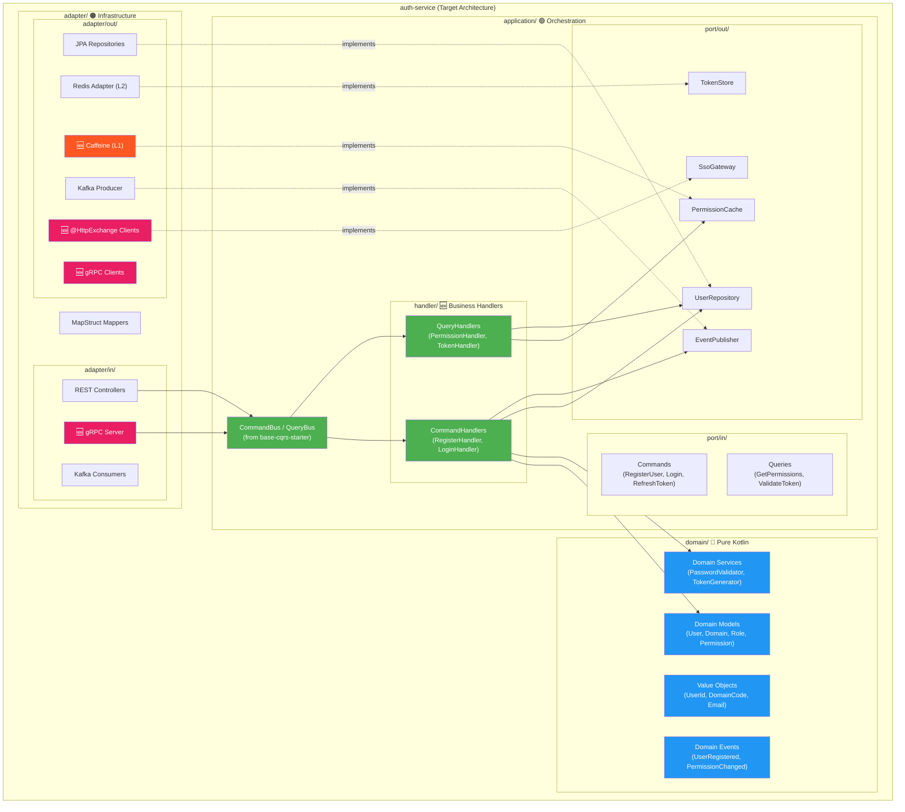
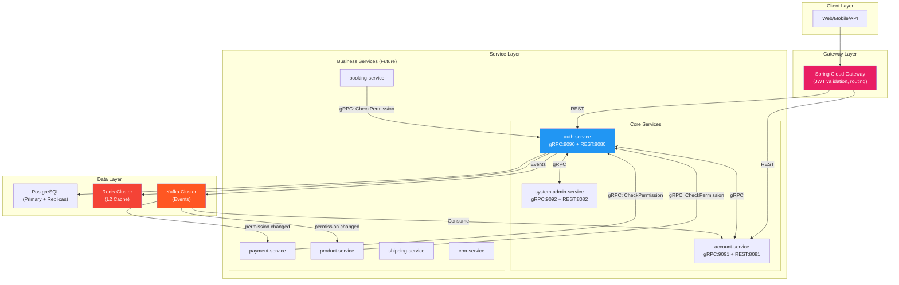
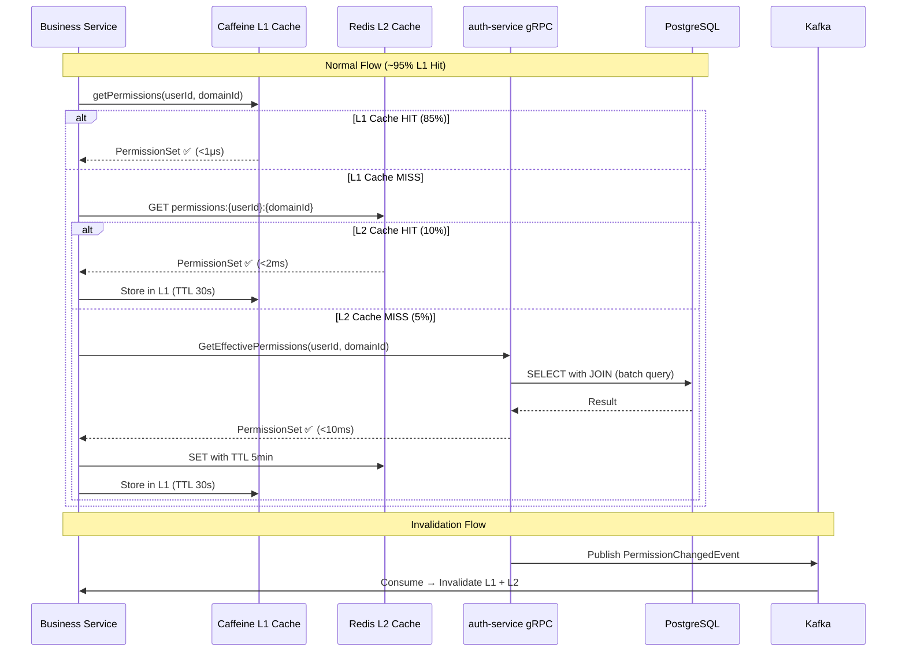
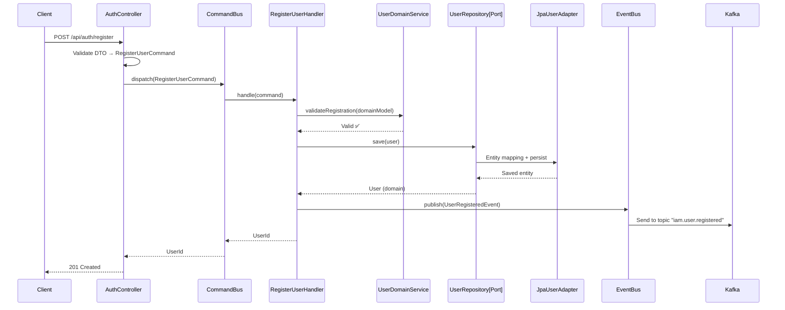
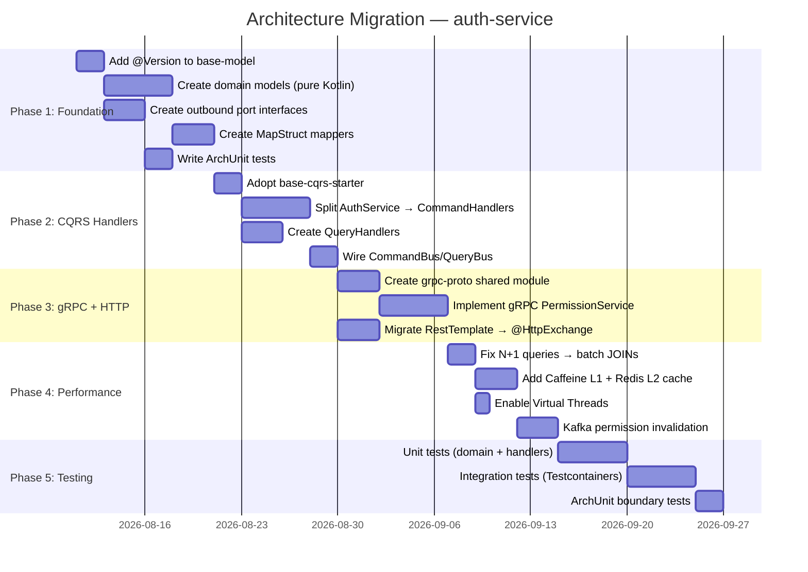

# Technical Specification — Architecture Optimization (v2 — Enriched)

## 1. Architecture Diagrams (Updated)

### 1.1 Target Architecture — Full Hexagonal + CQRS + gRPC



### 1.2 Multi-Service Communication — gRPC + Kafka



### 1.3 RBAC Distribution at 100M TPS



## 2. Detailed Component Design

### 2.1 CQRS Command Flow (Business Handler Pattern)



### 2.2 gRPC Permission Service

```protobuf
syntax = "proto3";
package com.ntt.auth.grpc;

option java_multiple_files = true;
option java_package = "com.ntt.auth.grpc";

// Permission Service — exposed via gRPC for all business services
service PermissionService {
  // Check single permission (fast, cached)
  rpc CheckPermission(CheckPermissionRequest) returns (CheckPermissionResponse);
  
  // Get all effective permissions for user+domain (for JWT refresh)
  rpc GetEffectivePermissions(EffectivePermissionsRequest) returns (PermissionSet);
  
  // Validate JWT token (delegate to auth-service)
  rpc ValidateToken(ValidateTokenRequest) returns (TokenValidationResponse);
  
  // Bulk permission check (reduce round-trips)
  rpc CheckPermissions(stream CheckPermissionRequest) returns (stream CheckPermissionResponse);
}

message CheckPermissionRequest {
  int64 user_id = 1;
  int64 domain_id = 2;
  string resource_code = 3;
  string action_code = 4;
}

message CheckPermissionResponse {
  bool allowed = 1;
  string deny_reason = 2;    // Empty if allowed
  string policy_id = 3;      // Which policy decided
}

message EffectivePermissionsRequest {
  int64 user_id = 1;
  int64 domain_id = 2;
}

message PermissionSet {
  repeated string role_codes = 1;
  repeated PermissionEntry permissions = 2;
}

message PermissionEntry {
  string resource_code = 1;
  string action_code = 2;
}

message ValidateTokenRequest {
  string token = 1;
}

message TokenValidationResponse {
  bool valid = 1;
  int64 user_id = 2;
  string username = 3;
  repeated string roles = 4;
  int64 active_domain_id = 5;
}
```

### 2.3 @HttpExchange — SSO Provider Client (SOTA)

```kotlin
// 1. Define contract interface
@HttpExchange
interface SsoProviderClient {
    
    @PostExchange("/oauth2/token")
    fun exchangeToken(
        @RequestBody request: TokenExchangeRequest
    ): TokenResponse
    
    @GetExchange("/oauth2/userinfo")
    fun getUserInfo(
        @RequestHeader("Authorization") bearerToken: String
    ): SsoUserInfo
    
    @GetExchange("/.well-known/openid-configuration")
    fun getOpenIdConfig(): OpenIdConfiguration
}

// 2. Register via @ImportHttpServices (Spring Boot 4.1)
@Configuration
@ImportHttpServices(
    group = "sso-provider",
    types = [SsoProviderClient::class]
)
class SsoClientConfig

// 3. Configure in application.yml
// spring:
//   http:
//     client:
//       service:
//         sso-provider:
//           base-url: "https://accounts.google.com"
//           connect-timeout: 2s
//           read-timeout: 5s

// 4. Usage in adapter
@Component
class HttpSsoGateway(
    private val ssoClient: SsoProviderClient
) : SsoGateway {  // implements outbound port
    
    override fun exchangeAuthorizationCode(code: String): SsoUserInfo {
        val tokenResponse = ssoClient.exchangeToken(
            TokenExchangeRequest(code = code, grantType = "authorization_code")
        )
        return ssoClient.getUserInfo("Bearer ${tokenResponse.accessToken}")
    }
}
```

## 3. Gradle Multi-Module Design

### 3.1 Shared Library Structure

```kotlin
// services/shared/grpc-proto/build.gradle.kts
plugins {
    id("ntt.spring-library-conventions")
    id("com.google.protobuf") version "0.9.4"
}

dependencies {
    implementation("io.grpc:grpc-protobuf")
    implementation("io.grpc:grpc-stub")
    implementation("com.google.protobuf:protobuf-kotlin")
}

protobuf {
    protoc { artifact = "com.google.protobuf:protoc:4.29.0" }
    plugins {
        id("grpc") { artifact = "io.grpc:protoc-gen-grpc-java:1.71.0" }
    }
    generateProtoTasks {
        all().forEach { it.plugins { id("grpc") } }
    }
}
```

```kotlin
// services/shared/domain-common/build.gradle.kts
plugins {
    id("ntt.spring-library-conventions")
}

// PURE KOTLIN — no Spring, no JPA dependencies!
dependencies {
    // Only Kotlin stdlib
}
```

```kotlin
// services/shared/security-common/build.gradle.kts
plugins {
    id("ntt.spring-library-conventions")
}

dependencies {
    api(project(":shared:grpc-proto"))
    implementation("com.github.ben-manes.caffeine:caffeine")  // L1 cache
    implementation("org.springframework.boot:spring-boot-starter-data-redis")  // L2 cache
    implementation("org.springframework.kafka:spring-kafka")  // Cache invalidation
}
```

### 3.2 Service Build File (Updated)

```kotlin
// services/auth-service/build.gradle.kts
plugins {
    id("ntt.spring-app-conventions")
}

dependencies {
    // Platform BOM
    implementation(platform("com.ntt:platform"))
    
    // Shared libraries
    implementation(project(":shared:grpc-proto"))
    implementation(project(":shared:domain-common"))
    implementation(project(":shared:security-common"))
    
    // base-core starters
    implementation("com.ntt:base-web-starter")
    implementation("com.ntt:base-data-starter")
    implementation("com.ntt:base-security-starter")
    implementation("com.ntt:base-cqrs-starter")        // CommandBus/QueryBus
    implementation("com.ntt:base-messaging-starter")    // EventBus
    implementation("com.ntt:base-resilience-starter")   // CircuitBreaker
    implementation("com.ntt:base-observability-starter")// Metrics/Tracing
    
    // gRPC (Spring Boot 4.1 native)
    implementation("org.springframework.boot:spring-boot-starter-grpc")
    
    // MapStruct
    implementation(libs.mapstruct)
    kapt(libs.mapstruct.processor)
    
    // Testing
    testImplementation("com.ntt:base-testing-starter")
    testImplementation(libs.archunit.junit5)
}
```

## 4. Domain Model Design (Immutability Analysis per User Feedback)

### 4.1 Immutability Decision Matrix

| Model | Mutable? | Reason | Kotlin Type |
|-------|:--------:|--------|-------------|
| `UserId` | ❌ Immutable | Value Object, identity | `@JvmInline value class UserId(val value: Long)` |
| `DomainCode` | ❌ Immutable | Value Object | `@JvmInline value class DomainCode(val value: String)` |
| `Email` | ❌ Immutable | Value Object with validation | `@JvmInline value class Email(val value: String)` |
| `UserStatus` | ❌ Immutable | State enum | `sealed interface UserStatus` |
| `User` (domain) | ⚠️ Mixed | Has mutable state (status, password) | Regular class with immutable ID |
| `Permission` | ❌ Immutable | Value Object (resource × action) | `data class Permission(resource, action)` |
| `AuthToken` | ❌ Immutable | Created once, never modified | `data class AuthToken(access, refresh, expiresAt)` |
| `Policy` | ⚠️ Mixed | Can be updated (conditions, status) | Regular class |
| `Role` | ⚠️ Mixed | Permissions can change | Regular class |

### 4.2 Domain Model Examples

```kotlin
// domain/model/User.kt — Domain model (NOT JPA entity)
class User(
    val id: UserId,
    val username: String,
    val email: Email,
    private var passwordHash: String,
    var status: UserStatus,
    val mfaEnabled: Boolean,
    val mfaMethod: MfaMethod,
    val createdAt: Instant
) {
    fun verifyPassword(rawPassword: String, encoder: PasswordEncoder): Boolean {
        if (status is UserStatus.Locked) throw AccountLockedException()
        return encoder.matches(rawPassword, passwordHash)
    }
    
    fun lock(until: Instant) {
        status = UserStatus.LockedUntil(until)
    }
}

// domain/model/UserStatus.kt — Type-safe sealed interface
sealed interface UserStatus {
    data object Active : UserStatus
    data object Disabled : UserStatus
    data class Locked(val reason: String) : UserStatus
    data class LockedUntil(val until: Instant) : UserStatus
}

// domain/model/vo/UserId.kt — Value Object
@JvmInline
value class UserId(val value: Long)

@JvmInline
value class Email(val value: String) {
    init { require(value.contains("@")) { "Invalid email format" } }
}
```

## 5. Performance Optimization Design

### 5.1 RBAC Query Optimization (Replace N+1)

```kotlin
// BEFORE: N+1 in RbacEngine (current)
permissionIds.forEach { permId ->
    val perm = permissionRepository.findById(permId)     // Query 1
    val resource = domainResourceRepository.findById(...) // Query 2  
    val action = actionRepository.findById(...)           // Query 3
}

// AFTER: Single batch query
@Query("""
    SELECT new com.ntt.auth.domain.model.Permission(
        dr.code, a.code
    )
    FROM RolePermissionEntity rp
    JOIN PermissionEntity p ON rp.permissionId = p.id
    JOIN DomainResourceEntity dr ON p.resourceId = dr.id
    JOIN ActionEntity a ON p.actionId = a.id
    WHERE rp.roleId IN :roleIds
""")
fun findEffectivePermissions(@Param("roleIds") roleIds: Set<Long>): List<Permission>
```

### 5.2 Virtual Threads Configuration

```yaml
# application.yml
spring:
  threads:
    virtual:
      enabled: true  # Enable Virtual Threads (JDK 25)

# JVM flags
# -XX:+UseZGC -XX:+ZGenerational -Xms2g -Xmx4g
```

### 5.3 Multi-Tier Cache Configuration

```yaml
spring:
  cache:
    caffeine:
      spec: maximumSize=10000,expireAfterWrite=30s
  data:
    redis:
      host: localhost
      port: 6379
      lettuce:
        pool:
          max-active: 50
          max-idle: 20
```

## 6. ArchUnit Tests — Architecture Enforcement

```kotlin
@ArchTest
val domainShouldNotDependOnFramework = noClasses()
    .that().resideInAPackage("..domain..")
    .should().dependOnClassesThat()
    .resideInAnyPackage(
        "org.springframework..",
        "jakarta.persistence..",
        "org.hibernate..",
        "io.grpc.."
    )

@ArchTest
val applicationShouldNotDependOnAdapter = noClasses()
    .that().resideInAPackage("..application..")
    .should().dependOnClassesThat()
    .resideInAPackage("..adapter..")

@ArchTest
val handlersShouldOnlyAccessPorts = classes()
    .that().resideInAPackage("..handler..")
    .should().onlyAccessClassesThat()
    .resideInAnyPackage(
        "..domain..",
        "..port..",
        "..dto..",
        "..handler..",
        "java..",
        "kotlin.."
    )
```

## 7. Migration Strategy (Incremental)



## 8. API Endpoints (No Change — Internal Restructure Only)

All existing REST API endpoints remain identical. Internal restructure:

```
Controller → CommandBus.dispatch(command) → Handler → Domain → Port → Adapter
                    ↕
             QueryBus.dispatch(query) → Handler → Port → Cache/DB
```

**NEW gRPC endpoints** (additional, not replacing REST):

| Service | Method | Port |
|---------|--------|:----:|
| `PermissionService.CheckPermission` | Unary | 9090 |
| `PermissionService.GetEffectivePermissions` | Unary | 9090 |
| `PermissionService.ValidateToken` | Unary | 9090 |
| `PermissionService.CheckPermissions` | Bidirectional stream | 9090 |
