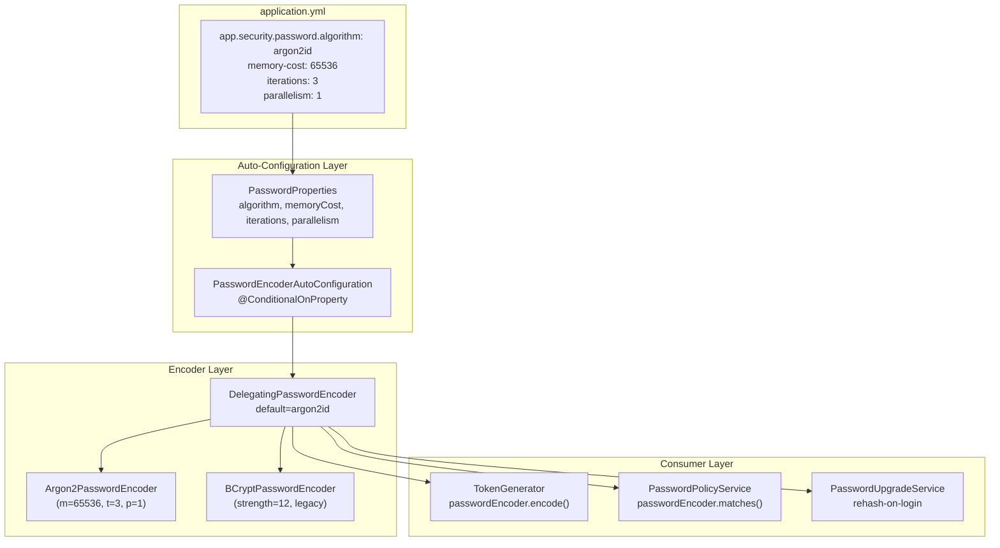
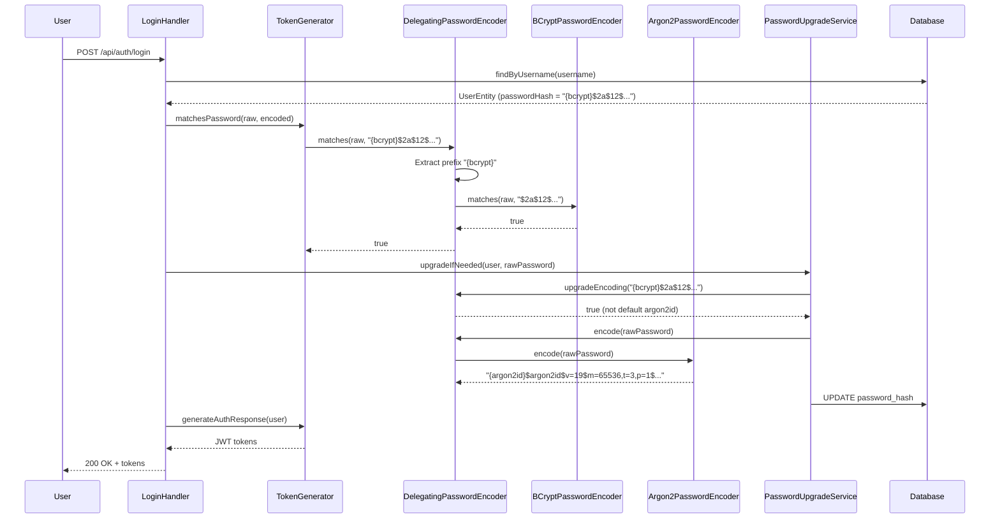
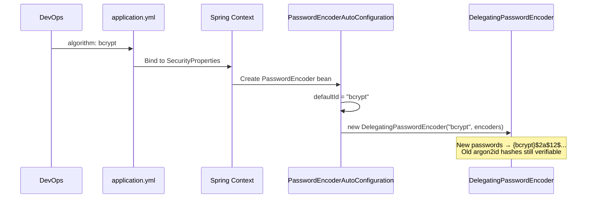

# Technical Specification — Argon2id Password Encoder Auto-Configuration

## 1. Architecture Overview



## 2. Database Impact

### Hiện tại
```
password_hash: $2a$12$xxxxx... (BCrypt, no prefix)
```

### Sau migration
```
password_hash: {argon2id}$argon2id$v=19$m=65536,t=3,p=1$salt$hash (mới)
password_hash: {bcrypt}$2a$12$xxxxx... (legacy, rehash khi login)
```

### Migration Script (V__add_password_hash_prefix.sql)
```sql
-- Add {bcrypt} prefix to existing hashes (one-time migration)
UPDATE users 
SET password_hash = CONCAT('{bcrypt}', password_hash)
WHERE password_hash NOT LIKE '{%}%'
  AND password_hash LIKE '$2a$%';

-- Also update password_history table
UPDATE password_history
SET password_hash = CONCAT('{bcrypt}', password_hash)
WHERE password_hash NOT LIKE '{%}%'
  AND password_hash LIKE '$2a$%';
```

## 3. File Changes

### [NEW] PasswordEncoderAutoConfiguration.kt
```
shared/config/PasswordEncoderAutoConfiguration.kt
```
**Purpose**: Bean auto-config cho PasswordEncoder based on YAML property.

```kotlin
@Configuration
class PasswordEncoderAutoConfiguration(
    private val securityProperties: SecurityProperties
) {

    @Bean
    fun passwordEncoder(): PasswordEncoder {
        val passwordProps = securityProperties.password
        
        // Build encoder map — always include both for backward compatibility
        val encoders = mutableMapOf<String, PasswordEncoder>(
            "bcrypt" to BCryptPasswordEncoder(passwordProps.bcryptStrength),
            "argon2id" to Argon2PasswordEncoder(
                passwordProps.argon2.saltLength,
                passwordProps.argon2.hashLength,
                passwordProps.argon2.parallelism,
                passwordProps.argon2.memoryCost,
                passwordProps.argon2.iterations
            )
        )
        
        // Default encoder = configured algorithm
        val defaultId = passwordProps.algorithm  // "argon2id" or "bcrypt"
        
        return DelegatingPasswordEncoder(defaultId, encoders).apply {
            // Fallback for hashes without prefix (legacy BCrypt)
            setDefaultPasswordEncoderForMatches(
                BCryptPasswordEncoder(passwordProps.bcryptStrength)
            )
        }
    }
}
```

### [MODIFY] SecurityProperties.kt — PasswordProperties
```kotlin
data class PasswordProperties(
    /** Active algorithm — "argon2id" (default, recommended) or "bcrypt" (legacy). */
    val algorithm: String = "argon2id",
    /** BCrypt hashing strength — default 12 (legacy/fallback). */
    val bcryptStrength: Int = 12,
    /** Argon2id tuning parameters. */
    val argon2: Argon2Properties = Argon2Properties(),
    val maxFailedAttempts: Int = 3,
    val lockDurationMinutes: Int = 15
) {
    /** Argon2id algorithm parameters (OWASP 2024 recommended). */
    data class Argon2Properties(
        /** Salt length in bytes — default 16. */
        val saltLength: Int = 16,
        /** Hash length in bytes — default 32. */
        val hashLength: Int = 32,
        /** Parallelism (threads) — default 1 (OWASP recommended). */
        val parallelism: Int = 1,
        /** Memory cost in KiB — default 65536 (64 MB, OWASP recommended). */
        val memoryCost: Int = 65536,
        /** Time cost (iterations) — default 3 (OWASP recommended). */
        val iterations: Int = 3
    )
}
```

### [MODIFY] SecurityConfig.kt
- **Remove**: `passwordEncoder()` bean definition (lines 110-113)
- **Remove**: BCrypt imports
- Bean moves to `PasswordEncoderAutoConfiguration`

### [NEW] PasswordUpgradeService.kt
```
auth/application/PasswordUpgradeService.kt
```
**Purpose**: Rehash-on-login — detect legacy BCrypt hash → re-encode với Argon2id.

```kotlin
@Service
class PasswordUpgradeService(
    private val passwordEncoder: PasswordEncoder,
    private val userRepository: UserRepository
) {
    fun upgradeIfNeeded(user: UserEntity, rawPassword: String) {
        // Check if current hash needs upgrade
        // DelegatingPasswordEncoder.upgradeEncoding() returns true 
        // if hash is NOT encoded with the current default encoder
        if (passwordEncoder.upgradeEncoding(user.passwordHash)) {
            val newHash = passwordEncoder.encode(rawPassword)
            user.passwordHash = newHash
            userRepository.save(user)
        }
    }
}
```

### [MODIFY] application-security.yml
```yaml
app:
  security:
    password:
      algorithm: argon2id           # "argon2id" (default) or "bcrypt"
      bcrypt-strength: 12           # Legacy BCrypt fallback
      argon2:
        salt-length: 16             # Bytes
        hash-length: 32             # Bytes  
        parallelism: 1              # Threads (OWASP: 1)
        memory-cost: 65536          # KiB (64 MB, OWASP recommended)
        iterations: 3               # Time cost (OWASP: 3)
      max-failed-attempts: 3
      lock-duration-minutes: 15
```

### [MODIFY] build.gradle.kts
```kotlin
// Promote BouncyCastle from testImplementation → implementation
implementation("org.bouncycastle:bcprov-jdk18on:1.80")
```

### [NEW] Flyway migration
```
V__add_password_hash_prefix.sql
```

## 4. Sequence Diagram — Login with Rehash



## 5. Sequence Diagram — DevOps Config Switch



## 6. Memory Impact Analysis

| Concurrent Logins | Memory per Hash | Total Memory |
|---|---|---|
| 1 | 64 MB | 64 MB |
| 10 | 64 MB | 640 MB |
| 50 | 64 MB | 3.2 GB |
| 100 | 64 MB | 6.4 GB |

> [!WARNING]
> **Argon2id uses 64MB per concurrent hash operation.** Với Virtual Threads unbounded, cần rate-limit concurrent password hashing để tránh OOM. Recommend: max 20 concurrent hashes → 1.28GB.

### Mitigation: Semaphore-based concurrency limit
```kotlin
private val hashSemaphore = Semaphore(20) // max 20 concurrent hashes

fun encode(raw: String): String {
    hashSemaphore.acquire()
    try {
        return delegate.encode(raw)
    } finally {
        hashSemaphore.release()
    }
}
```

## 7. API Endpoints

Không có API endpoint mới. Tất cả thay đổi transparent qua `PasswordEncoder` interface.

## 8. Agent Implementation Notes

### Impact Assessment
- **Risk Level**: MEDIUM — core security component nhưng backward compatible
- **Blast Radius**: 4 files modify + 3 files new + 1 migration
- **Testing Required**: Unit + Integration + JMH benchmark comparison
- **Rollback Strategy**: Set `algorithm: bcrypt` in YAML → immediate rollback

### Deployment Checklist
1. ✅ Deploy Flyway migration (add `{bcrypt}` prefix)
2. ✅ Deploy code changes
3. ✅ Monitor: login latency p95, memory usage, error rate
4. ✅ Wait 1-2 weeks → monitor migration progress
5. ✅ Optional: Force password reset for users who haven't logged in

---

## 9. Validation Phase 6

- [x] Architecture diagram present (Mermaid)
- [x] Database impact documented (migration script)
- [x] 2 sequence diagrams (login rehash, config switch)
- [x] Screen flow: N/A (backend only)
- [x] API endpoints: No new endpoints (transparent)
- [x] Agent Implementation Notes complete
