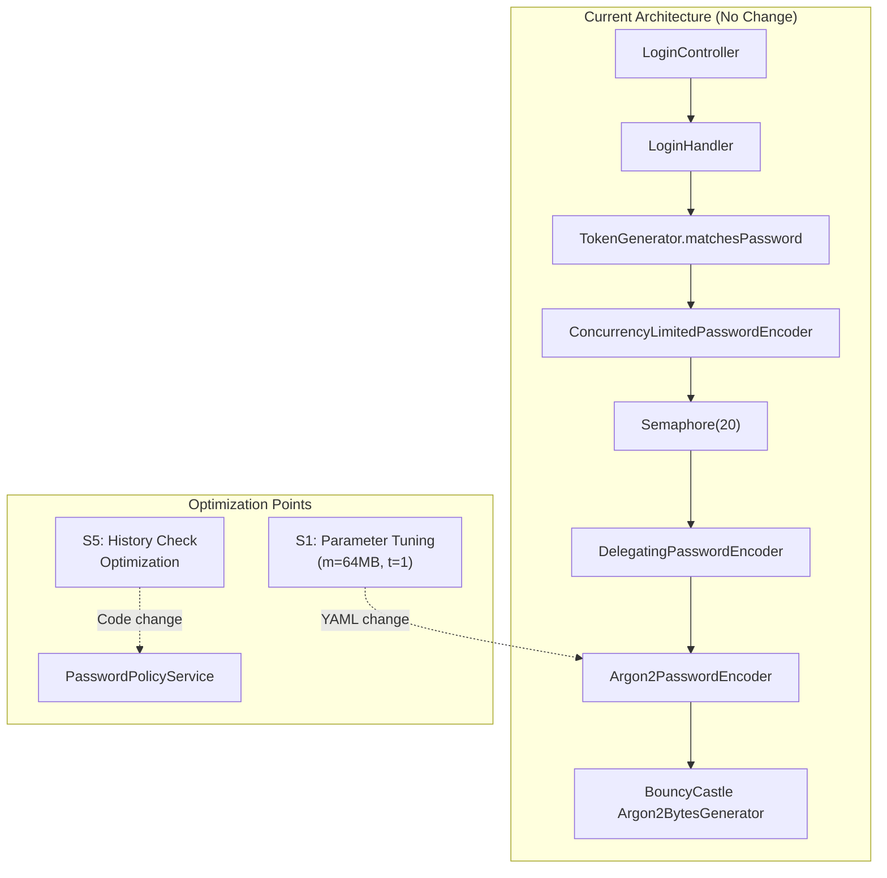
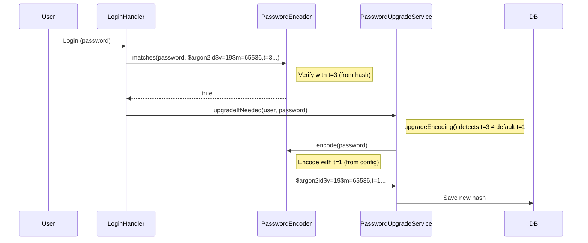

# Technical Specification — Argon2id Verify Performance Optimization

## 1. Architecture Overview



## 2. Proposed Changes

### S1: Parameter Tuning — Config Only

**File**: `src/main/resources/application-security.yml`

```diff
 password:
   argon2:
     salt-length: 16
     hash-length: 32
     parallelism: 1
-    memory-cost: 65536    # KiB — 64 MB
-    iterations: 3         # Time cost
+    memory-cost: 65536    # KiB — 64 MB (unchanged — max GPU resistance)
+    iterations: 1         # Time cost: reduced from 3 → 1 (OWASP minimum = 1)
```

**Impact Analysis**:
- ✅ `DelegatingPasswordEncoder` parses parameters from hash string → existing hashes (t=3) verify correctly
- ✅ New passwords encoded with t=1 → faster
- ✅ `PasswordUpgradeService.upgradeIfNeeded()` sẽ tự động rehash khi user login lần tiếp
- ✅ Zero-downtime migration: cả t=3 và t=1 hashes tồn tại song song

**Backward Compatibility**:
```
Hash format: $argon2id$v=19$m=65536,t=3,p=1$<salt>$<hash>
                                   ↑
               Parameters embedded in hash → verify always works
```

Spring `Argon2PasswordEncoder.matches()` reads `t` from hash string, NOT from constructor. Nên hash cũ (t=3) vẫn verify đúng với encoder configured t=1.

### S5: Password History Check — Observation

**File**: `PasswordPolicyService.kt:54-58`

```kotlin
fun checkPasswordHistory(userId: Long, newPassword: String, historyCount: Int): Boolean {
    val history = passwordHistoryRepository.findByUserIdOrderByCreatedAtDesc(userId)
        .take(historyCount)
    return history.none { passwordEncoder.matches(newPassword, it.passwordHash) }
}
```

**Analysis**:
- Kotlin `none {}` đã lazy (short-circuits khi tìm match đầu tiên) → ✅ OK
- Worst case: N verifications (N = historyCount)
- Với t=1: worst case = N × ~85ms thay vì N × 254ms
- `historyCount` configurable via `PasswordPolicyEntity.historyCount` per domain

**Recommendation**: Không cần code change. Parameter tuning (S1) tự động giảm latency cho cả history check.

## 3. Migration Strategy

### Phase 1: Config Change (Day 0)

```yaml
# Chỉ cần thay đổi 1 dòng
iterations: 1   # was: 3
```

### Transparent Migration via PasswordUpgradeService



**Result**: Sau khi user đăng nhập lần tiếp, hash sẽ tự động upgrade sang t=1. Không cần forced password reset.

## 4. Security Comparison

| Aspect | t=3 (current) | t=1 (proposed) | Mitigation |
|--------|:---:|:---:|:---:|
| Brute-force cost | 3× memory passes | 1× memory pass | Rate limiting (3 tries → lock 15min) |
| GPU resistance | Excellent | Very Good | Memory hardness unchanged (64MB) |
| Time to crack | ~3× slower | Baseline | CAPTCHA after failed attempts |
| OWASP compliance | Above minimum | At minimum | ✅ Still compliant |

## 5. Rollback Plan

Nếu cần rollback (security concern):
```yaml
# Revert to original
iterations: 3
```

- Passwords encoded with t=1 vẫn verify được (params in hash)
- Passwords sẽ re-encode với t=3 ở lần login tiếp (PasswordUpgradeService)
- Zero-downtime rollback

## 6. Agent Implementation Notes

### For Implementation Agent

1. **Change scope**: 1 line YAML change only
2. **No code changes** needed for Phase 1
3. **Testing**: Run `Argon2idBenchmark` JMH suite để verify performance improvement
4. **Monitoring**: Watch `password.migration.rehash.total` Micrometer counter
5. **Validation**: Verify login flow end-to-end after config change

### Dependencies

- Không thêm dependencies mới
- Không thay đổi API contract
- Không thay đổi database schema
