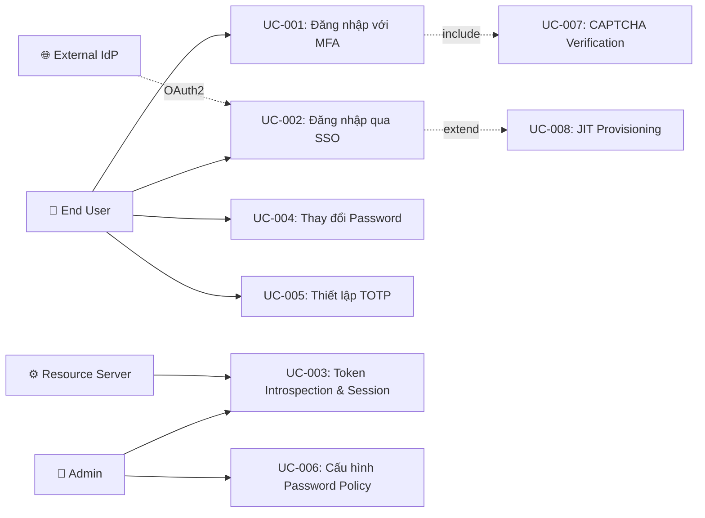

# Tài liệu phân tích nghiệp vụ: Auth Core Features

> Phân tích nghiệp vụ chi tiết — chia nhỏ theo use case, đặc tả ngữ nghĩa từng chức năng.

---

## 1. Tổng quan (Overview)

### 1.1 Bối cảnh nghiệp vụ (Business Context)

Hệ thống ERP IAM cần bảo vệ tài khoản người dùng và dữ liệu nghiệp vụ bằng nhiều lớp xác thực, đồng thời đảm bảo trải nghiệm đăng nhập liền mạch thông qua SSO. Password policy cần linh hoạt theo từng business domain (booking, payment, loyalty) với mức độ nghiêm ngặt khác nhau. JWT signing cần chuyển sang asymmetric (RS256) để resource servers có thể verify token mà không cần shared secret.

### 1.2 Mục tiêu (Objectives)

| # | Mục tiêu | KPI đo lường | Độ ưu tiên |
|---|---------|-------------|-----------|
| O-01 | Triển khai MFA cho tất cả user accounts | % users enabled MFA ≥ 80% (enforced) | High |
| O-02 | Tích hợp SSO với ≥ 3 IdPs (Google, Microsoft, Keycloak) | SSO login success rate ≥ 99% | High |
| O-03 | Migrate JWT sang RS256 + expose JWKS endpoint | 100% tokens signed RS256, HMAC fallback removed | High |
| O-04 | Password policy per domain + history + expiry | 100% password changes validated against domain policy | Medium |

### 1.3 Phạm vi (Scope)

| In Scope | Out of Scope |
|----------|-------------|
| MFA flow (OTP SMS/Email + TOTP + CAPTCHA) | Biometric/WebAuthn/Passkey |
| SSO/OAuth2 (Google, Microsoft, Keycloak) | SMS/Email provider implementation (adapter pattern) |
| JWT RS256 signing + JWKS endpoint | Key management service (KMS) |
| Token introspection (RFC 7662) | Token analytics dashboard |
| Password policy per domain (Passay) | Admin UI for policy management |
| Password history + expiry enforcement | Password breach database lookup |
| Trusted device skip MFA | Device management admin panel |
| Session binding + force logout | Session analytics |

### 1.4 Stakeholders & Actors

| Actor | Loại | Mô tả | Tương tác chính |
|-------|------|--------|----------------|
| End User | Primary | Người dùng ERP đăng nhập, thay đổi mật khẩu, thiết lập MFA | Login, MFA verify, password change, TOTP setup |
| System Administrator | Primary | Admin cấu hình password policy, force logout, quản lý SSO | Policy config, session management |
| Resource Server | External System | Downstream services validate tokens | Token introspection, JWKS fetching |
| External IdP | External System | Google, Microsoft, Keycloak | OAuth2 authorization code flow |
| Notification Service | External System | Gửi OTP qua SMS/Email (future) | OTP delivery events |

---

## 2. Use Case Diagram (tổng quan)



---

## 3. Danh sách Use Case (Use Case Index)

| UC-ID | Tên Use Case | Actor | Nhóm chức năng | Độ ưu tiên | Trạng thái |
|-------|-------------|-------|----------------|-----------|-----------|
| UC-001 | Đăng nhập với MFA | End User | FR-001 MFA | High | Implemented |
| UC-002 | Đăng nhập qua SSO/OAuth2 | End User | FR-002 SSO | High | Implemented |
| UC-003 | Token Introspection & Session Management | Resource Server, Admin | FR-003 Token | High | Implemented |
| UC-004 | Thay đổi Password (với Policy Validation) | End User | FR-004 Password | Medium | Implemented |
| UC-005 | Thiết lập TOTP Authenticator | End User | FR-001 MFA | High | Implemented |
| UC-006 | Cấu hình Password Policy per Domain | System Admin | FR-004 Password | Medium | Implemented |

---

## 4. Đặc tả Use Case chi tiết

### UC-001: Đăng nhập với MFA

#### 4.1 Thông tin chung

| Mục | Nội dung |
|-----|----------|
| **Mã** | UC-001 |
| **Tên** | Đăng nhập với Multi-Factor Authentication |
| **Mô tả ngữ nghĩa** | Người dùng cần xác minh danh tính qua 2 bước (something you know + something you have) để đảm bảo rằng ngay cả khi mật khẩu bị lộ, kẻ tấn công vẫn không thể truy cập hệ thống. Đây là lớp bảo vệ quan trọng nhất cho tài khoản ERP chứa dữ liệu nghiệp vụ nhạy cảm. |
| **Actor** | End User |
| **Trigger** | User gửi credentials tới login endpoint |
| **Độ ưu tiên** | High |
| **Tần suất** | Daily (mỗi lần đăng nhập) |
| **Nhóm chức năng** | FR-001 MFA |

#### 4.2 Điều kiện

| Loại | Mô tả |
|------|--------|
| **Pre-conditions** | Tài khoản user tồn tại, status = ACTIVE, MFA enabled trên account |
| **Post-conditions (Success)** | User nhận JWT (access + refresh), session được tạo, audit log ghi nhận |
| **Post-conditions (Failure)** | MFA token bị revoke (nếu max attempts), failed login count tăng, audit log ghi nhận |
| **Invariants** | User account status không thay đổi trong quá trình MFA (trừ lock do max attempts) |

#### 4.3 Luồng chính (Basic Flow)

| Step | Actor Action | System Response | Data | Ghi chú |
|------|-------------|----------------|------|---------|
| 1 | Gửi username + password tới `POST /api/auth/login` | Validate credentials (BCrypt match) | `LoginRequest` | Rate limit check (IP + username) |
| 2 | - | Check `user.mfaEnabled` và `user.mfaMethod` | `UserEntity` | - |
| 3 | - | Nếu MFA enabled: generate mfaToken (JWT, 5min, type=mfa) | `mfaToken` | Redis-backed |
| 4 | - | Nếu method = SMS/Email: generate OTP, store Redis (TTL=300s) | `otp:{userId}:{channel}` | OtpService |
| 5 | - | Trả `LoginResult.MfaRequired(mfaToken, method, expiresIn)` | `MfaRequiredResponse` | HTTP 200 |
| 6 | Nhận OTP qua SMS/Email hoặc mở Authenticator App | - | - | - |
| 7 | Gửi OTP code + mfaToken tới `POST /api/auth/mfa/verify` | Validate mfaToken (parse JWT, check type=mfa) | `MfaVerifyRequest` | - |
| 8 | - | Validate OTP code (Redis check) hoặc TOTP code (samstevens verify) | - | Constant-time comparison |
| 9 | - | Issue full JWT (access + refresh), create session | `AuthResponse` | HTTP 200 |

#### 4.4 Luồng thay thế (Alternative Flows)

##### AF-001: MFA Not Enabled
- **Trigger**: Tại Step 2 khi `user.mfaEnabled = false`
- **Steps**:
  1. System skip MFA, issue JWT trực tiếp
  2. Return `AuthResponse` (full tokens)
- **Rejoin**: End (skip Steps 3-9)

##### AF-002: Trusted Device Skip MFA
- **Trigger**: Tại Step 2 khi `request.trustedDeviceHash == user.trustedDeviceHash`
- **Steps**:
  1. Log "Trusted device matched — skipping MFA"
  2. Issue JWT trực tiếp
- **Rejoin**: End (skip Steps 3-9)

#### 4.5 Luồng ngoại lệ (Exception Flows)

##### EF-001: Invalid Credentials
- **Trigger**: Tại Step 1 khi password không match
- **Error**: `INVALID_CREDENTIALS`
- **Handling**:
  1. Increment `failedLoginCount`
  2. Nếu `failedLoginCount >= maxFailedAttempts` → lock account
  3. Return 401 Unauthorized
- **Post-condition**: `failedLoginCount` tăng, có thể LOCKED

##### EF-002: MFA Code Invalid (attempt < 3)
- **Trigger**: Tại Step 8 khi OTP code sai
- **Error**: `MFA_CODE_INVALID`
- **Handling**:
  1. Redis INCR attempts
  2. Return 401 (retry with same mfaToken)
- **Post-condition**: Attempt count tăng

##### EF-003: MFA Max Attempts Exceeded
- **Trigger**: Tại Step 8 khi attempts >= 3
- **Error**: `MFA_MAX_ATTEMPTS`
- **Handling**:
  1. Delete OTP keys from Redis
  2. Return 403 (login again from Step 1)
- **Post-condition**: mfaToken invalidated, phải login lại

##### EF-004: MFA Token Expired
- **Trigger**: Tại Step 7 khi mfaToken expired (>5 min)
- **Error**: `MFA_TOKEN_EXPIRED`
- **Handling**: Return 401, yêu cầu login lại
- **Post-condition**: Phải login lại

##### EF-005: CAPTCHA Required
- **Trigger**: Tại Step 1 khi `failedLoginCount >= threshold - 1`
- **Error**: `CAPTCHA_REQUIRED`
- **Handling**: Return 428 Precondition Required, kèm captcha requirement
- **Post-condition**: Client phải gửi lại request với captchaToken

##### EF-006: Password Expired
- **Trigger**: Sau Step 1 credentials valid, trước Step 2 MFA check
- **Error**: `PASSWORD_EXPIRED`
- **Handling**: Return 403, redirect to change-password flow
- **Post-condition**: No tokens issued, user must change password first

#### 4.6 Quy tắc nghiệp vụ (Business Rules)

| BR-ID | Quy tắc | Mô tả chi tiết | Validation |
|-------|---------|----------------|-----------|
| BR-001 | OTP TTL | OTP SMS/Email hết hạn sau 5 phút (300 giây) | Redis TTL |
| BR-002 | OTP Max Attempts | Tối đa 3 lần nhập sai OTP per mfaToken | Redis INCR + check |
| BR-003 | TOTP Window | TOTP drift tolerance ±1 step (±30 giây) | `DefaultCodeVerifier.setAllowedTimePeriodDiscrepancy(1)` |
| BR-004 | Trusted Device | Trusted device cookie = 30 ngày, SHA-256 hash | Cookie + DB field |
| BR-005 | CAPTCHA Trigger | Yêu cầu CAPTCHA khi `failedLoginCount >= maxFailedAttempts - 1` | Config per domain |
| BR-006 | MFA Rate Limit | Max 5 OTP verify failures trong 15 phút, lock 30 phút | Redis sliding window |

#### 4.7 Yêu cầu phi chức năng (cho UC này)

| Loại | Yêu cầu | Target |
|------|---------|--------|
| Performance | Login response time | < 500ms (P95) |
| Performance | MFA verify response time | < 300ms (P95) |
| Security | OTP storage | Redis only, never in DB or logs |
| Security | TOTP secret | AES-256-GCM encrypted at rest |
| Availability | Login endpoint | 99.9% uptime |
| Concurrency | Concurrent logins | 100+ users |

#### 4.8 Mockup / Wireframe Description

```
┌─────────────────────────────────────┐
│  Header: ERP Login                  │
├─────────────────────────────────────┤
│  Form (Phase 1):                    │
│    [ Username: ______________ ]     │
│    [ Password: ______________ ]     │
│    [ CAPTCHA widget (if needed) ]   │
│    [ Login ]                        │
├─────────────────────────────────────┤
│  Form (Phase 2 - MFA):             │
│    [ Enter 6-digit code: ______ ]   │
│    [ Verify ]  [ Resend Code ]      │
│    [ □ Trust this device 30 days ]  │
├─────────────────────────────────────┤
│  Footer: Status info                │
└─────────────────────────────────────┘
```

---

### UC-002: Đăng nhập qua SSO/OAuth2

#### 4.1 Thông tin chung

| Mục | Nội dung |
|-----|----------|
| **Mã** | UC-002 |
| **Tên** | Đăng nhập qua SSO/OAuth2 |
| **Mô tả ngữ nghĩa** | Cho phép người dùng sử dụng tài khoản doanh nghiệp hiện có (Google Workspace, Microsoft 365, Keycloak) để truy cập ERP mà không cần nhớ thêm mật khẩu. Giảm friction đăng nhập và tận dụng enterprise IdP security policies. |
| **Actor** | End User |
| **Trigger** | User click "Login with [Provider]" |
| **Độ ưu tiên** | High |
| **Tần suất** | Daily |
| **Nhóm chức năng** | FR-002 SSO |

#### 4.2 Điều kiện

| Loại | Mô tả |
|------|--------|
| **Pre-conditions** | External IdP đã cấu hình, SSO enabled cho domain |
| **Post-conditions (Success)** | User nhận internal JWT, UserIdentityEntity linked, session tạo |
| **Post-conditions (Failure)** | No session created, error returned |
| **Invariants** | Identity linking dùng `sub` claim (KHÔNG email) |

#### 4.3 Luồng chính (Basic Flow)

| Step | Actor Action | System Response | Data | Ghi chú |
|------|-------------|----------------|------|---------|
| 1 | Click "Login with [Provider]" | Frontend redirect tới IdP authorization endpoint | - | Browser redirect |
| 2 | Xác thực trên IdP + approve consent | IdP redirect callback với authorization code | `code`, `state` | - |
| 3 | Frontend gửi code tới `POST /api/auth/sso/callback` | Exchange code → ID token từ IdP | `SsoCallbackRequest` | OAuth2TokenExchanger |
| 4 | - | Extract claims (`sub`, `email`, `name`) từ ID token | `IdpUserInfo` | - |
| 5 | - | Check `user_identities` by provider + sub | DB query | - |
| 6 | - | Nếu tồn tại: build AuthResponse cho linked userId | `AuthResponse` | - |
| 7 | - | Return JWT (access + refresh) | HTTP 200 | - |

#### 4.4 Luồng thay thế (Alternative Flows)

##### AF-001: JIT Provisioning (user chưa tồn tại + auto-provision ON)
- **Trigger**: Tại Step 5 khi user chưa tồn tại và `sso.autoProvisionEnabled = true`
- **Steps**:
  1. Create `UserEntity` (username = email, passwordHash = "!SSO_ONLY!")
  2. Create `UserIdentityEntity` (provider, sub, email, name)
  3. Publish Kafka event `iam.user.sso_provisioned` (TODO: implement when Kafka configured)
  4. Build AuthResponse
- **Rejoin**: Step 7

#### 4.5 Luồng ngoại lệ (Exception Flows)

##### EF-001: Auto-provision Disabled + User Not Found
- **Trigger**: Tại Step 5 khi user chưa tồn tại và `autoProvisionEnabled = false`
- **Error**: `SSO_USER_NOT_PROVISIONED`
- **Handling**: Return 403, hướng dẫn liên hệ admin
- **Post-condition**: No account created

##### EF-002: IdP Token Invalid
- **Trigger**: Tại Step 3 khi code exchange fails
- **Error**: `SSO_TOKEN_INVALID`
- **Handling**: Return 401
- **Post-condition**: No session

##### EF-003: Identity Conflict
- **Trigger**: Khi link identity, `sub` đã linked tới user khác
- **Error**: `SSO_IDENTITY_CONFLICT`
- **Handling**: Return 409 Conflict
- **Post-condition**: No changes

#### 4.6 Quy tắc nghiệp vụ (Business Rules)

| BR-ID | Quy tắc | Mô tả chi tiết | Validation |
|-------|---------|----------------|-----------|
| BR-007 | Identity Linking | Luôn dùng `sub` claim (KHÔNG dùng email — có thể thay đổi) | Hard rule |
| BR-008 | Auto-provision | Config per environment (`SSO_AUTO_PROVISION` env var) | Boolean config |
| BR-009 | SSO-only User | SSO users có `passwordHash = "!SSO_ONLY!"`, KHÔNG thể login bằng password | Marker check |
| BR-010 | Unlink Protection | Không thể unlink last SSO identity nếu user không có password | Identity count check |

#### 4.7 Yêu cầu phi chức năng (cho UC này)

| Loại | Yêu cầu | Target |
|------|---------|--------|
| Performance | SSO callback response time | < 2000ms (includes IdP round-trip) |
| Security | OAuth2 state parameter | CSRF protection |
| Availability | SSO endpoint | 99.9% (dependent on IdP availability) |

#### 4.8 Mockup / Wireframe Description

```
┌─────────────────────────────────────┐
│  Header: ERP Login                  │
├─────────────────────────────────────┤
│  [ Login with Google     🟢 ]       │
│  [ Login with Microsoft  🔵 ]       │
│  [ Login with Keycloak   🟤 ]       │
│  ─── OR ───                         │
│  [ Username: ______________ ]       │
│  [ Password: ______________ ]       │
│  [ Login ]                          │
└─────────────────────────────────────┘
```

---

### UC-003: Token Introspection & Session Management

#### 4.1 Thông tin chung

| Mục | Nội dung |
|-----|----------|
| **Mã** | UC-003 |
| **Tên** | Token Introspection & Session Management |
| **Mô tả ngữ nghĩa** | Resource servers cần validate tokens mà không parse JWT locally (RFC 7662), và admins cần revoke sessions ngay lập tức khi phát hiện tài khoản bị compromise. JWKS endpoint cho phép resource servers tự verify JWT signatures. |
| **Actor** | Resource Server (introspect), System Administrator (session revoke) |
| **Trigger** | Resource server sends token for validation; Admin initiates force logout |
| **Độ ưu tiên** | High |
| **Tần suất** | Very high (every API request for introspection), rare (force logout) |
| **Nhóm chức năng** | FR-003 Token |

#### 4.2 Điều kiện

| Loại | Mô tả |
|------|--------|
| **Pre-conditions** | Valid JWT or resource server credentials |
| **Post-conditions (Success)** | Introspection: response with active status. Revoke: all sessions invalidated |
| **Post-conditions (Failure)** | Error response returned |
| **Invariants** | JWKS endpoint always available regardless of auth state |

#### 4.3 Luồng chính (Basic Flow) — Introspection

| Step | Actor Action | System Response | Data | Ghi chú |
|------|-------------|----------------|------|---------|
| 1 | Resource server sends `POST /api/auth/introspect` | Parse token, extract claims | `IntrospectionRequest` | - |
| 2 | - | Check jti in `token_blacklist` | DB query | - |
| 3 | - | Return `IntrospectionResponse(active, sub, roles, permissions, exp)` | `IntrospectionResponse` | HTTP 200 |

#### 4.5 Luồng ngoại lệ (Exception Flows)

##### EF-001: Token Blacklisted
- **Trigger**: Tại Step 2 khi jti found in blacklist
- **Error**: N/A (not error — return `active: false`)
- **Handling**: Return `IntrospectionResponse(active=false)`
- **Post-condition**: Token rejected by resource server

##### EF-002: Token Malformed
- **Trigger**: Tại Step 1 khi token cannot be parsed
- **Error**: N/A (return `active: false`)
- **Handling**: Return `IntrospectionResponse(active=false)`
- **Post-condition**: No session impact

#### 4.6 Quy tắc nghiệp vụ (Business Rules)

| BR-ID | Quy tắc | Mô tả chi tiết | Validation |
|-------|---------|----------------|-----------|
| BR-011 | Access Token TTL | 5-15 phút (cấu hình per domain, default 15 min) | Config |
| BR-012 | Refresh Token Rotation | Mỗi lần refresh → revoke old, issue new | Always on |
| BR-013 | JWKS Endpoint | Expose RSA public key at `/.well-known/jwks.json` | Always on |
| BR-014 | Blacklisted Token | Token with blacklisted jti → `active: false` | Redis/DB check |

---

### UC-004: Thay đổi Password (với Policy Validation)

#### 4.1 Thông tin chung

| Mục | Nội dung |
|-----|----------|
| **Mã** | UC-004 |
| **Tên** | Thay đổi Password với Domain-scoped Policy Validation |
| **Mô tả ngữ nghĩa** | Domain "payment" cần password policy nghiêm ngặt hơn domain "booking" vì liên quan đến giao dịch tài chính. Mật khẩu phải pass domain-specific complexity rules VÀ không trùng N mật khẩu gần nhất. |
| **Actor** | End User |
| **Trigger** | User gửi request change password hoặc system force change (expired) |
| **Độ ưu tiên** | Medium |
| **Tần suất** | On-demand (user-initiated) hoặc periodic (forced by expiry policy) |
| **Nhóm chức năng** | FR-004 Password |

#### 4.2 Điều kiện

| Loại | Mô tả |
|------|--------|
| **Pre-conditions** | User authenticated (JWT), knows current password |
| **Post-conditions (Success)** | Password updated, history entry added, `passwordChangedAt` updated |
| **Post-conditions (Failure)** | No change to password or history |
| **Invariants** | Password always stored as BCrypt hash (strength 12) |

#### 4.3 Luồng chính (Basic Flow)

| Step | Actor Action | System Response | Data | Ghi chú |
|------|-------------|----------------|------|---------|
| 1 | Gửi `POST /api/auth/change-password` (old, new) | Validate old password | `ChangePasswordRequest` | BCrypt match |
| 2 | - | Load PasswordPolicy for user's domain | `PasswordPolicyEntity` | Cache lookup |
| 3 | - | Validate new password via Passay (complexity rules) | `List<RuleViolation>` | Dynamic rules |
| 4 | - | Check password history (last N hashes) | `password_history` | BCrypt.matches() each |
| 5 | - | Hash new password, update user, insert history | DB operations | @Transactional |
| 6 | - | Prune old history entries (> historyCount) | DB cleanup | - |
| 7 | - | Update `passwordChangedAt = now()` | `UserEntity` | For expiry tracking |
| 8 | - | Return 200 OK | - | Audit log |

#### 4.5 Luồng ngoại lệ (Exception Flows)

##### EF-001: Password Policy Violation
- **Trigger**: Tại Step 3 khi Passay validation fails
- **Error**: `PASSWORD_POLICY_VIOLATION`
- **Handling**: Return 400 with list of violation messages
- **Post-condition**: No password change

##### EF-002: Password Recently Used
- **Trigger**: Tại Step 4 khi new password matches history
- **Error**: `PASSWORD_RECENTLY_USED`
- **Handling**: Return 400
- **Post-condition**: No password change

#### 4.6 Quy tắc nghiệp vụ (Business Rules)

| BR-ID | Quy tắc | Mô tả chi tiết | Validation |
|-------|---------|----------------|-----------|
| BR-015 | Default Policy | minLength=8, requireUppercase=true, requireDigit=true, historyCount=5 | Global default |
| BR-016 | Password Expiry | Check `password_changed_at` + `maxAgeDays` on login | Login flow check |
| BR-017 | Policy Scope | Policy áp dụng cho register + change-password | Both flows |
| BR-018 | History Pruning | Keep only last `historyCount` entries per user | After insert |

---

### UC-005: Thiết lập TOTP Authenticator

#### 4.1 Thông tin chung

| Mục | Nội dung |
|-----|----------|
| **Mã** | UC-005 |
| **Tên** | Thiết lập TOTP Authenticator App |
| **Mô tả ngữ nghĩa** | Cho phép người dùng thiết lập xác thực TOTP bằng ứng dụng Authenticator (Google Authenticator, Authy, Microsoft Authenticator). Quy trình gồm 2 bước: setup (nhận QR code) và confirm (xác nhận code từ app). |
| **Actor** | End User |
| **Trigger** | User chọn enable TOTP MFA trong settings |
| **Độ ưu tiên** | High |
| **Tần suất** | One-time per user (initial setup) |
| **Nhóm chức năng** | FR-001 MFA |

#### 4.2 Điều kiện

| Loại | Mô tả |
|------|--------|
| **Pre-conditions** | User authenticated, TOTP not yet enabled |
| **Post-conditions (Success)** | `totpSecretEncrypted` saved on user, `mfaEnabled = true`, `mfaMethod = TOTP` |
| **Post-conditions (Failure)** | No changes to user entity |
| **Invariants** | TOTP secret always AES-256-GCM encrypted before persistence |

#### 4.3 Luồng chính (Basic Flow)

| Step | Actor Action | System Response | Data | Ghi chú |
|------|-------------|----------------|------|---------|
| 1 | Call `POST /api/auth/mfa/totp/setup` | Generate TOTP secret (Base32) | `TotpSetupResponse` | dev.samstevens.totp |
| 2 | - | Build `otpauth://` URI with issuer, account | QR code data | - |
| 3 | - | Return QR URI + secret (display once) | HTTP 200 | Secret NOT yet persisted |
| 4 | User scans QR code with Authenticator app | - | - | - |
| 5 | User reads 6-digit code from app | - | - | - |
| 6 | Call `POST /api/auth/mfa/totp/confirm` with code | Verify TOTP code against secret | `TotpConfirmRequest` | - |
| 7 | - | AES-256-GCM encrypt secret, save to user entity | DB update | @Transactional |
| 8 | - | Set `mfaEnabled = true`, `mfaMethod = TOTP` | `UserEntity` | - |
| 9 | - | Return 200 OK with success confirmation | HTTP 200 | - |

#### 4.5 Luồng ngoại lệ (Exception Flows)

##### EF-001: TOTP Confirm Code Invalid
- **Trigger**: Tại Step 6 khi TOTP code does not match generated secret
- **Error**: `TOTP_CONFIRM_FAILED`
- **Handling**: Return 400, user can retry with new code
- **Post-condition**: Secret not persisted, setup can be retried

#### 4.6 Quy tắc nghiệp vụ (Business Rules)

| BR-ID | Quy tắc | Mô tả chi tiết | Validation |
|-------|---------|----------------|-----------|
| BR-019 | TOTP Secret Encryption | Secret phải AES-256-GCM encrypt trước khi persist | Code enforcement |
| BR-020 | TOTP Confirm Required | Setup chưa hoàn tất cho đến khi user confirm bằng valid code | Two-step process |
| BR-003 | TOTP Window | TOTP drift tolerance ±1 step (±30 giây) | `DefaultCodeVerifier.setAllowedTimePeriodDiscrepancy(1)` |

#### 4.8 Mockup / Wireframe Description

```
┌─────────────────────────────────────┐
│  Header: Setup Authenticator        │
├─────────────────────────────────────┤
│  Step 1: Scan QR Code              │
│    ┌──────────┐                     │
│    │ [QR CODE]│  Secret: JBSW...    │
│    └──────────┘  (copy to clipboard)│
│                                     │
│  Step 2: Enter code from app        │
│    [ 6-digit code: ______ ]         │
│    [ Confirm ]  [ Cancel ]          │
├─────────────────────────────────────┤
│  Footer: Use Google Authenticator   │
└─────────────────────────────────────┘
```

---

### UC-006: Cấu hình Password Policy per Domain

#### 4.1 Thông tin chung

| Mục | Nội dung |
|-----|----------|
| **Mã** | UC-006 |
| **Tên** | Cấu hình Password Policy per Domain |
| **Mô tả ngữ nghĩa** | Admin cần cấu hình password policy khác nhau cho từng business domain. Domain "payment" cần chính sách nghiêm ngặt hơn domain "booking". |
| **Actor** | System Administrator |
| **Trigger** | Admin cần thay đổi password policy cho một domain |
| **Độ ưu tiên** | Medium |
| **Tần suất** | Rare (initial setup + occasional updates) |
| **Nhóm chức năng** | FR-004 Password |

#### 4.2 Điều kiện

| Loại | Mô tả |
|------|--------|
| **Pre-conditions** | Admin authenticated with ADMIN role, domain exists |
| **Post-conditions (Success)** | Policy saved/updated, Passay validator cache invalidated |
| **Post-conditions (Failure)** | No changes to policy |
| **Invariants** | One policy per domain (UNIQUE constraint on domain_id) |

#### 4.3 Luồng chính (Basic Flow)

| Step | Actor Action | System Response | Data | Ghi chú |
|------|-------------|----------------|------|---------|
| 1 | Call `GET /api/admin/domains/{id}/password-policy` | Load current policy (or defaults) | `PasswordPolicyEntity` | - |
| 2 | Modify policy values | - | - | Admin UI |
| 3 | Call `PUT /api/admin/domains/{id}/password-policy` | Validate policy values | `PasswordPolicyEntity` | Business validation |
| 4 | - | Save/update policy | DB upsert | @Transactional |
| 5 | - | Invalidate Passay validator cache for domain | Cache eviction | `ConcurrentHashMap.remove()` |
| 6 | - | Return updated policy | HTTP 200 | - |

#### 4.5 Luồng ngoại lệ (Exception Flows)

##### EF-001: Invalid Policy Values
- **Trigger**: Tại Step 3 khi validation fails (e.g., minLength > maxLength)
- **Error**: `INVALID_POLICY_VALUES`
- **Handling**: Return 400 with validation errors
- **Post-condition**: No policy change

#### 4.6 Quy tắc nghiệp vụ (Business Rules)

| BR-ID | Quy tắc | Mô tả chi tiết | Validation |
|-------|---------|----------------|-----------|
| BR-015 | Default Policy | minLength=8, requireUppercase=true, requireDigit=true, historyCount=5 | Global fallback |
| BR-021 | Policy Validation | minLength <= maxLength, historyCount >= 0, maxAgeDays > 0 | Input validation |
| BR-022 | Cache Invalidation | After policy update, invalidate Passay validator cache for that domain | Immediate effect |

---

## 5. Ma trận truy xuất (Traceability Matrix)

| UC-ID | FR-ID | NFR-ID | BR-ID | Screen | API Endpoint | DB Entity |
|-------|-------|--------|-------|--------|-------------|-----------|
| UC-001 | FR-001 | NFR-001, NFR-002 | BR-001..BR-006 | Login + MFA | POST /api/auth/login, POST /api/auth/mfa/verify | UserEntity, Redis |
| UC-002 | FR-002 | NFR-003 | BR-007..BR-010 | SSO Login | POST /api/auth/sso/callback, GET /api/auth/sso/providers | UserIdentityEntity |
| UC-003 | FR-003 | NFR-004 | BR-011..BR-014 | N/A (API only) | POST /api/auth/introspect, GET /.well-known/jwks.json | TokenBlacklist |
| UC-004 | FR-004 | NFR-005 | BR-015..BR-018 | Password Change | POST /api/auth/change-password | PasswordPolicyEntity, PasswordHistoryEntity |
| UC-005 | FR-001 | NFR-002 | BR-003, BR-019..BR-020 | TOTP Setup | POST /api/auth/mfa/totp/setup, POST /api/auth/mfa/totp/confirm | UserEntity (totpSecretEncrypted) |
| UC-006 | FR-004 | NFR-005 | BR-015, BR-021..BR-022 | Admin Policy | PUT /api/admin/domains/{id}/password-policy | PasswordPolicyEntity |

---

## 6. Yêu cầu chức năng tổng hợp (Functional Requirements)

| FR-ID | Tên | Mô tả | UC liên quan | Độ ưu tiên |
|-------|-----|--------|-------------|-----------|
| FR-001 | Multi-Factor Authentication | Hệ thống phải hỗ trợ MFA qua OTP SMS, Email, TOTP Authenticator, và CAPTCHA | UC-001, UC-005 | High |
| FR-002 | SSO & OAuth2 Integration | Hệ thống phải hỗ trợ SSO login qua Google, Microsoft, Keycloak với JIT provisioning | UC-002 | High |
| FR-003 | Token Management RS256 | Hệ thống phải sign JWT bằng RS256, expose JWKS endpoint, hỗ trợ token introspection | UC-003 | High |
| FR-004 | Password Policy per Domain | Hệ thống phải enforce password complexity, history, và expiry rules theo từng business domain | UC-004, UC-006 | Medium |

---

## 7. Yêu cầu phi chức năng tổng hợp (Non-Functional Requirements)

| NFR-ID | Loại | Yêu cầu | Target | Measurement |
|--------|------|---------|--------|-------------|
| NFR-001 | Performance | Login response time | < 500ms P95 | APM monitoring |
| NFR-002 | Security | TOTP secret encryption | AES-256-GCM at rest | Code review |
| NFR-003 | Performance | SSO callback response time | < 2000ms P95 | APM monitoring |
| NFR-004 | Availability | Auth endpoints uptime | 99.9% | SLA monitoring |
| NFR-005 | Security | Password hash strength | BCrypt strength 12 | Config check |

---

## 8. Thuật ngữ nghiệp vụ (Glossary)

| Thuật ngữ | Định nghĩa | Context sử dụng |
|-----------|-----------|-----------------|
| MFA | Multi-Factor Authentication — xác thực đa yếu tố | UC-001, UC-005 |
| TOTP | Time-based One-Time Password (RFC 6238) | UC-001, UC-005 |
| OTP | One-Time Password gửi qua SMS/Email | UC-001 |
| JIT Provisioning | Just-In-Time — tự động tạo tài khoản khi đăng nhập SSO lần đầu | UC-002 |
| JWKS | JSON Web Key Set — endpoint expose public keys | UC-003 |
| Token Introspection | RFC 7662 — validate token server-side | UC-003 |
| Passay | Java library cho password validation rules | UC-004, UC-006 |
| Domain | Business domain trong ERP (booking, payment, loyalty) | UC-004, UC-006 |
| mfaToken | Short-lived JWT (type=mfa, 5min) dùng cho MFA challenge | UC-001 |

---

## 9. Phụ lục (Appendix)

### 9.1 Research References

- [opensource_findings.md](./opensource_findings.md)
- [web_research.md](./web_research.md)
- [comparison_analysis.md](./comparison_analysis.md)

### 9.2 Open Questions

- [ ] OQ-001: SMS/Email delivery provider cụ thể? (adapter pattern cho phép defer decision)
- [ ] OQ-002: Keycloak realm configuration chi tiết cho production? (config-only, không ảnh hưởng code)

### 9.3 Assumptions

- ⚠️ AS-001: Spring Boot 3.2 sẽ tiếp tục được dùng (không upgrade lên 4.x trong ngắn hạn) — Lý do: stability, production readiness
- ⚠️ AS-002: Redis luôn available cho MFA flow — Lý do: OTP storage + rate limiting require Redis
- ⚠️ AS-003: `dev.samstevens.totp` 1.7.1 vẫn stable dù GitHub repo 404 — Lý do: TOTP là stable protocol, library trên Maven Central

---

> **Next step**: Technical Specification (technical_spec.md)
> **Traceability**: Research Brief → Business Analysis → Technical Spec
