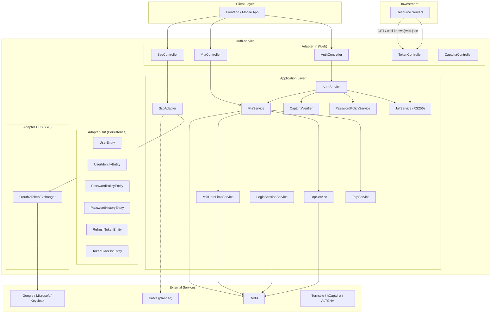
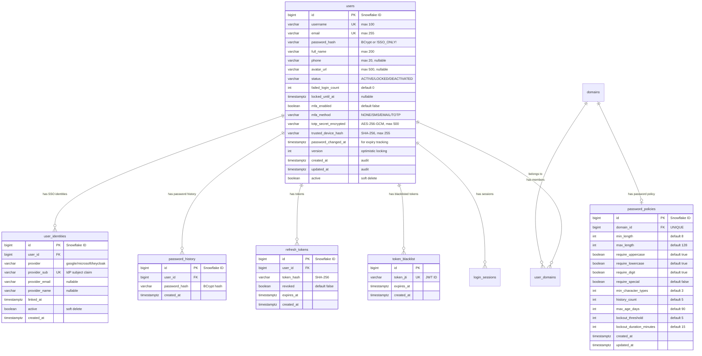
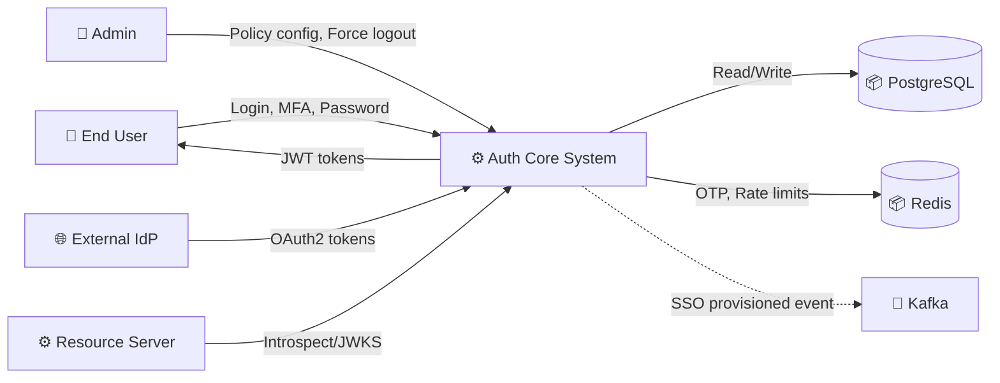
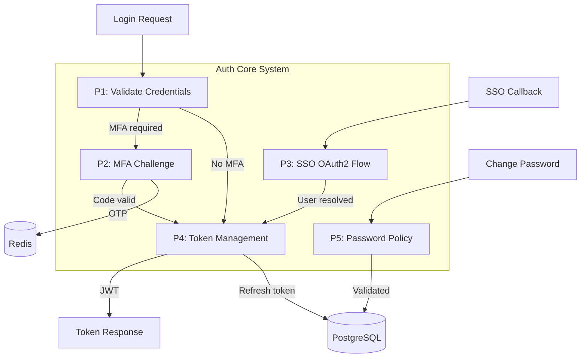
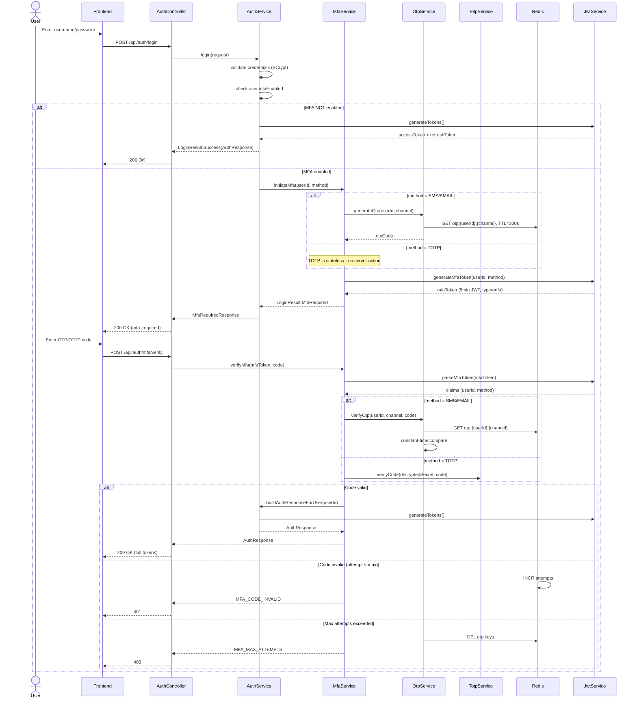
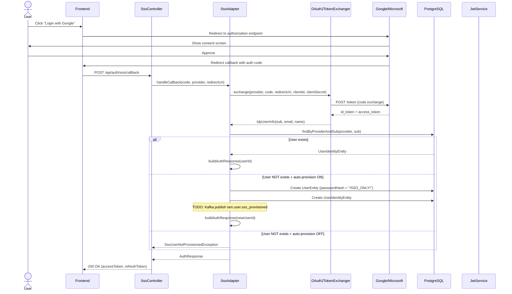
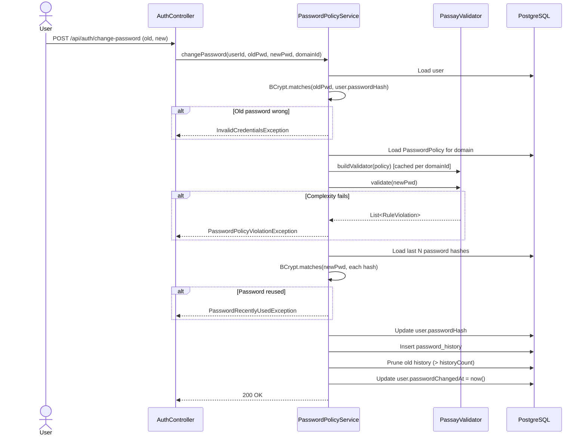
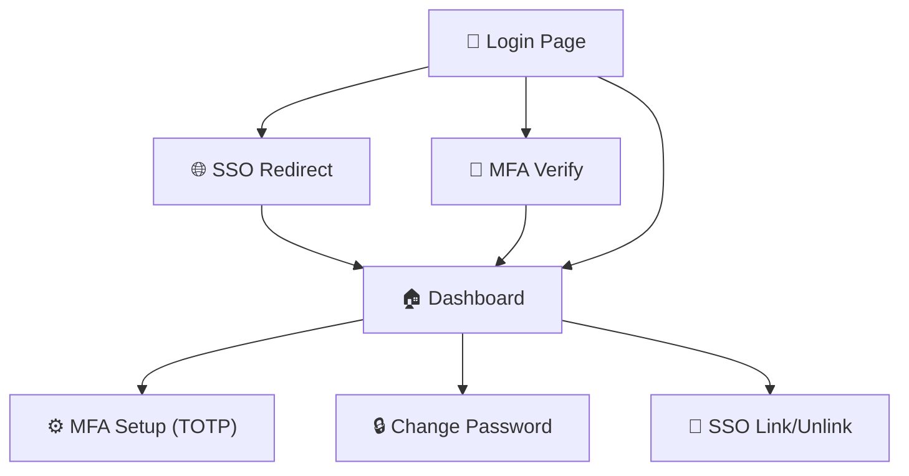

# Đặc tả kỹ thuật: Auth Core Features

> Technical specification chi tiết — thiết kế để agent có thể đọc và dev code trực tiếp.

---

## 1. Tổng quan hệ thống (System Overview)

### 1.1 Kiến trúc tổng thể



### 1.2 Technology Stack

| Layer | Technology | Version | Ghi chú |
|-------|-----------|---------|---------|
| Language | Kotlin | 1.9+ | Coroutines-ready |
| Framework | Spring Boot | 3.2+ | Spring Security 6+ |
| Database | PostgreSQL | 17 | Flyway migrations V1..V9 |
| Cache | Redis | Latest | OTP, rate limiting, session |
| Cache (L1) | Caffeine | Latest | Permission cache, password validator cache |
| JWT | JJWT | 0.12+ | RS256 primary, HMAC fallback |
| TOTP | dev.samstevens.totp | 1.7.1 | TOTP generation/verification |
| Password | Passay | 1.6.4 | Dynamic rules composition |
| OAuth2 | Spring Security OAuth2 | 6.x | Resource server + client |
| E2EE | Google Tink | 1.15.0 | AES-GCM encryption |
| Build | Gradle Kotlin DSL | Latest | Multi-module |

### 1.3 Dependencies & Integrations

| Dependency | Type | Purpose | Interface |
|-----------|------|---------|-----------|
| RBAC Engine | Internal | User roles + permissions for JWT claims | `RbacEngine.getUserRoles()`, `getEffectivePermissions()` |
| PBAC Engine | Internal | Attribute-based policy evaluation | `PolicyEvaluator` |
| Redis | Infrastructure | OTP storage, MFA rate limits, login sessions | Spring Data Redis `StringRedisTemplate` |
| Kafka (planned) | Infrastructure | SSO provisioning events | `iam.user.sso_provisioned` topic |
| Google IdP | External | OAuth2 authorization | OIDC protocol |
| Microsoft IdP | External | OAuth2 authorization | OIDC protocol |
| Keycloak IdP | External (optional) | OAuth2 authorization | OIDC protocol |
| CAPTCHA Provider | External | Bot prevention | REST API (siteverify) |

---

## 2. Lược đồ dữ liệu (Data Schema)

### 2.1 Entity-Relationship Diagram



### 2.2 Bảng chi tiết Entity

#### Entity: users (ALTER — V2 migration)

| Field | Type | Constraint | Default | Mô tả |
|-------|------|-----------|---------|--------|
| `mfa_enabled` | `BOOLEAN` | NOT NULL | `FALSE` | MFA on/off toggle |
| `mfa_method` | `VARCHAR(20)` | | `'NONE'` | NONE/SMS/EMAIL/TOTP |
| `totp_secret_encrypted` | `VARCHAR(500)` | NULLABLE | `NULL` | AES-256-GCM encrypted TOTP secret |
| `trusted_device_hash` | `VARCHAR(255)` | NULLABLE | `NULL` | SHA-256 of device fingerprint |
| `password_changed_at` | `TIMESTAMPTZ` | NULLABLE | `NULL` | For password expiry calculation |

#### Entity: user_identities (NEW — V2 migration)

| Field | Type | Constraint | Default | Mô tả |
|-------|------|-----------|---------|--------|
| `id` | `BIGINT` | PK | Snowflake | Primary key |
| `user_id` | `BIGINT` | FK → users, NOT NULL | - | Owner user |
| `provider` | `VARCHAR(50)` | NOT NULL | - | google/microsoft/keycloak |
| `provider_sub` | `VARCHAR(255)` | NOT NULL, UNIQUE(provider, provider_sub) | - | IdP subject claim |
| `provider_email` | `VARCHAR(255)` | NULLABLE | - | Email from IdP |
| `provider_name` | `VARCHAR(200)` | NULLABLE | - | Display name from IdP |
| `linked_at` | `TIMESTAMPTZ` | NOT NULL | `NOW()` | When identity was linked |
| `active` | `BOOLEAN` | NOT NULL | `TRUE` | Soft delete |

#### Indexes

| Index Name | Columns | Type | Purpose |
|-----------|---------|------|---------|
| `idx_user_identities_user` | `user_id WHERE active = TRUE` | BTREE (partial) | Find user's SSO identities |
| `idx_password_history_user` | `user_id` | BTREE | Password history lookup |
| `uq_password_policies_domain` | `domain_id` | UNIQUE | One policy per domain |

### 2.3 Database Migration Scripts (already applied)

```sql
-- V2__auth_core_features.sql (ALREADY APPLIED)
-- 1. ALTER users — MFA and password tracking
ALTER TABLE users ADD COLUMN mfa_enabled BOOLEAN NOT NULL DEFAULT FALSE;
ALTER TABLE users ADD COLUMN mfa_method VARCHAR(20) DEFAULT 'NONE';
ALTER TABLE users ADD COLUMN totp_secret_encrypted VARCHAR(500);
ALTER TABLE users ADD COLUMN trusted_device_hash VARCHAR(255);
ALTER TABLE users ADD COLUMN password_changed_at TIMESTAMPTZ;

-- 2. user_identities table
CREATE TABLE user_identities (...);
CREATE INDEX idx_user_identities_user ON user_identities(user_id) WHERE active = TRUE;

-- 3. password_policies table
CREATE TABLE password_policies (...);

-- 4. password_history table
CREATE TABLE password_history (...);
CREATE INDEX idx_password_history_user ON password_history(user_id);
```

---

## 3. Luồng dữ liệu (Data Flow)

### 3.1 Data Flow Diagram — Level 0 (Context)



### 3.2 Data Flow Diagram — Level 1 (chi tiết)



### 3.3 Data Transformation Rules

| # | Input | Process | Output | Validation Rules |
|---|-------|---------|--------|-----------------|
| 1 | `LoginRequest.password` | BCrypt verify against `user.passwordHash` | Boolean match | NOT NULL |
| 2 | `LoginRequest.captchaToken` | Verify via `CaptchaVerifier.verify()` | Boolean valid | Required when `failedLoginCount >= threshold` |
| 3 | `SsoCallbackRequest.code` | Exchange with IdP → `IdpUserInfo(sub, email, name)` | User identity claims | NOT NULL, valid authorization code |
| 4 | `ChangePasswordRequest.newPassword` | Passay validate → BCrypt hash → persist | `PasswordHistoryEntity` | Complexity + history check |
| 5 | `MfaVerifyRequest.code` | Redis OTP match or TOTP verify | Boolean valid | 6-digit string, constant-time compare |

---

## 4. Luồng xử lý (Processing Steps)

### 4.1 Sequence Diagram — UC-001: Two-Phase MFA Login



### 4.2 Sequence Diagram — UC-002: SSO OAuth2 + JIT Provisioning



### 4.3 Sequence Diagram — UC-004: Password Change with Policy



---

## 5. Luồng màn hình (Screen Flow)

### 5.1 Screen Map (Sitemap)



### 5.2 Chi tiết từng Screen

| Screen ID | Tên | Mục đích | Data hiển thị | User Actions | Navigation |
|-----------|-----|----------|--------------|-------------|-----------|
| SCR-001 | Login Page | Xác thực credentials + CAPTCHA | Username, Password, CAPTCHA widget, SSO buttons | Login, SSO login | → SCR-002 (MFA) or Dashboard |
| SCR-002 | MFA Verify | Nhập OTP/TOTP code | 6-digit input, Resend button, Trust device checkbox | Verify, Resend | → Dashboard (success), ← SCR-001 (max attempts) |
| SCR-003 | TOTP Setup | Thiết lập TOTP Authenticator | QR code, secret key, 6-digit confirm input | Scan QR, Confirm | → Dashboard |
| SCR-004 | Change Password | Thay đổi mật khẩu | Old password, New password, Confirm, Policy hints | Submit, Cancel | → Dashboard |
| SCR-005 | SSO Link/Unlink | Quản lý SSO identities | Linked providers list, Link/Unlink buttons | Link, Unlink | → Dashboard |

### 5.3 Wireframe Description (text-based)

#### SCR-001: Login Page
```
┌─────────────────────────────────────┐
│  Header: ERP Login                  │
├─────────────────────────────────────┤
│  [ Login with Google     🟢 ]       │
│  [ Login with Microsoft  🔵 ]       │
│  ─── OR ───                         │
│  [ Username: ______________ ]       │
│  [ Password: ______________ ]       │
│  [ CAPTCHA widget (if needed) ]     │
│  [ Login ]                          │
├─────────────────────────────────────┤
│  Footer: Forgot password?           │
└─────────────────────────────────────┘
```

---

## 6. API Specification

### 6.1 Endpoint List

| # | Method | Path | Description | Auth | Request Body | Response |
|---|--------|------|------------|------|-------------|----------|
| 1 | `POST` | `/api/auth/login` | Login (phase 1) | Public | LoginRequest | AuthResponse or MfaRequiredResponse |
| 2 | `POST` | `/api/auth/register` | Register new user | Public | RegisterRequest | AuthResponse (201) |
| 3 | `POST` | `/api/auth/refresh` | Refresh token | Public | RefreshTokenRequest | AuthResponse |
| 4 | `POST` | `/api/auth/mfa/verify` | Verify MFA code (phase 2) | mfaToken | MfaVerifyRequest | AuthResponse |
| 5 | `POST` | `/api/auth/mfa/totp/setup` | Setup TOTP (get QR) | JWT | - | TotpSetupResponse |
| 6 | `POST` | `/api/auth/mfa/totp/confirm` | Confirm TOTP setup | JWT | TotpConfirmRequest | {success: true} |
| 7 | `POST` | `/api/auth/mfa/resend` | Resend OTP code | mfaToken | MfaResendRequest | MfaRequiredResponse |
| 8 | `PUT` | `/api/auth/mfa/settings` | Enable/disable MFA | JWT | MfaSettingsRequest | MfaSettingsResponse |
| 9 | `POST` | `/api/auth/sso/callback` | SSO OAuth2 callback | Public | SsoCallbackRequest | AuthResponse |
| 10 | `GET` | `/api/auth/sso/providers` | List SSO providers | Public | - | List of SsoProviderInfoDto |
| 11 | `POST` | `/api/auth/sso/link` | Link SSO identity | JWT | SsoLinkRequest | {linked: true} |
| 12 | `DELETE` | `/api/auth/sso/unlink/{provider}` | Unlink SSO identity | JWT | - | {linked: false} |
| 13 | `POST` | `/api/auth/introspect` | Token introspection (RFC 7662) | Internal | IntrospectionRequest | IntrospectionResponse |
| 14 | `GET` | `/.well-known/jwks.json` | JWKS public key endpoint | Public | - | {keys: [...]} |
| 15 | `POST` | `/api/auth/sessions/{userId}/revoke-all` | Force logout all sessions | ADMIN | - | RevokeSessionsResponse |
| 16 | `POST` | `/api/auth/change-password` | Change password with policy | JWT | ChangePasswordRequest | 200 OK |
| 17 | `GET` | `/api/admin/domains/{id}/password-policy` | Get domain policy | ADMIN | - | PasswordPolicyEntity |
| 18 | `PUT` | `/api/admin/domains/{id}/password-policy` | Update domain policy | ADMIN | PasswordPolicyEntity | PasswordPolicyEntity |

### 6.2 Request/Response chi tiết

#### POST /api/auth/login

**Request:**
```json
{
  "username": "string (required)",
  "password": "string (required)",
  "domainCode": "string (optional, defaults to primary)",
  "captchaToken": "string (optional, required when CAPTCHA triggered)",
  "trustedDeviceHash": "string (optional, SHA-256 hash)"
}
```

**Response (200 OK — No MFA):**
```json
{
  "accessToken": "eyJhbGciOiJSUzI1NiIs...",
  "refreshToken": "eyJhbGciOiJSUzI1NiIs...",
  "tokenType": "Bearer",
  "expiresIn": 900,
  "userId": 123456789,
  "username": "john.doe",
  "activeDomain": "booking",
  "roles": ["USER"],
  "permissions": ["booking:read", "booking:create"]
}
```

**Response (200 OK — MFA Required):**
```json
{
  "mfaToken": "eyJhbGciOiJSUzI1NiIs...",
  "method": "TOTP",
  "expiresIn": 300
}
```

#### POST /api/auth/mfa/verify

**Request:**
```json
{
  "mfaToken": "string (required, JWT from login phase 1)",
  "code": "string (required, 6-digit OTP/TOTP)"
}
```

**Response (200 OK):**
```json
{
  "accessToken": "...",
  "refreshToken": "...",
  "tokenType": "Bearer",
  "expiresIn": 900,
  "userId": 123456789,
  "username": "john.doe",
  "activeDomain": "booking",
  "roles": ["USER"],
  "permissions": ["booking:read"]
}
```

#### POST /api/auth/introspect

**Request:**
```json
{
  "token": "string (required, JWT access token)"
}
```

**Response (200 OK):**
```json
{
  "active": true,
  "sub": "123456789",
  "username": "john.doe",
  "roles": ["USER"],
  "permissions": ["booking:read"],
  "exp": 1719000000,
  "iat": 1718999100,
  "iss": "auth-service",
  "jti": "550e8400-e29b-41d4-a716-446655440000"
}
```

### 6.3 Error Response Format (RFC 7807)

| HTTP Status | Error Type | Khi nào |
|-------------|-----------|---------|
| 400 | Validation Error / PASSWORD_POLICY_VIOLATION | Input không hợp lệ, password fails complexity |
| 401 | INVALID_CREDENTIALS / MFA_CODE_INVALID / MFA_TOKEN_EXPIRED | Sai credentials hoặc MFA code |
| 403 | MFA_MAX_ATTEMPTS / SSO_USER_NOT_PROVISIONED / PASSWORD_EXPIRED | Account locked, SSO not provisioned, password expired |
| 404 | NOT_FOUND | Resource không tồn tại |
| 409 | SSO_IDENTITY_CONFLICT / DUPLICATE_RESOURCE | Identity đã linked user khác, duplicate username/email |
| 428 | CAPTCHA_REQUIRED | Cần gửi CAPTCHA token |
| 429 | RATE_LIMIT_EXCEEDED | Too many requests |
| 500 | INTERNAL_SERVER_ERROR | Lỗi hệ thống |

---

## 7. Security Considerations

### 7.1 Authentication Flow

- **Phase 1**: Credentials (username + password + optional CAPTCHA) → `mfaToken` (if MFA enabled) or full JWT
- **Phase 2**: MFA code + `mfaToken` → full JWT (access + refresh)
- **SSO**: OAuth2 authorization code flow → internal JWT
- **Token refresh**: Refresh token rotation (old revoked, new issued)

### 7.2 Authorization Matrix

| Role | Login (UC-001) | SSO (UC-002) | Introspect (UC-003) | Change Password (UC-004) | Force Logout | Policy Config |
|------|:---:|:---:|:---:|:---:|:---:|:---:|
| End User | ✅ | ✅ | ❌ | ✅ (own) | ❌ | ❌ |
| Admin | ✅ | ✅ | ✅ | ✅ (own) | ✅ | ✅ |
| Resource Server | ❌ | ❌ | ✅ | ❌ | ❌ | ❌ |

### 7.3 Data Protection

- **TOTP Secret**: AES-256-GCM encrypted at rest (`TOTP_ENCRYPTION_KEY` env var, 256-bit)
- **Password**: BCrypt hash (strength 12), never stored plaintext
- **Refresh Token**: SHA-256 hash stored in DB (raw token returned to client once)
- **OTP**: Redis-only storage (TTL auto-cleanup), never persisted to DB
- **JWT Private Key**: Environment variable / file path (`JWT_PRIVATE_KEY_PATH`), never committed to repo
- **SSO Client Secrets**: Environment variables (`GOOGLE_CLIENT_SECRET`, etc.)

---

## 8. Performance Requirements

| Metric | Target | Measurement Method |
|--------|--------|-------------------|
| Login response time (P95) | < 500ms | APM monitoring |
| MFA verify response time (P95) | < 300ms | APM monitoring |
| SSO callback response time (P95) | < 2000ms | APM (includes IdP round-trip) |
| JWKS endpoint response time (P95) | < 50ms | Cached response |
| Token introspection response time (P95) | < 100ms | APM monitoring |
| Password change response time (P95) | < 1000ms | BCrypt + history check |
| Concurrent login throughput | > 100 req/s | Load test |
| Redis OTP latency | < 10ms | Redis metrics |
| Password validator cache hit ratio | > 95% | ConcurrentHashMap metrics |

---

## 9. Agent Implementation Notes

> **Section này dành cho AI agent** — chỉ rõ code cần tạo để agent dev trực tiếp.

### 9.1 Classes to Create

| # | Class | Package | Type | Extends/Implements | Mô tả |
|---|-------|---------|------|-------------------|--------|
| 1 | `AuthController` | `auth.adapter.in.web` | @RestController | - | Login, register, refresh, change-password endpoints |
| 2 | `MfaController` | `auth.adapter.in.web` | @RestController | - | MFA verify, TOTP setup, resend OTP, settings |
| 3 | `SsoController` | `auth.adapter.in.web` | @RestController | - | SSO callback, providers, link/unlink |
| 4 | `TokenController` | `auth.adapter.in.web` | @RestController | - | Introspect, JWKS, session revocation |
| 5 | `AuthService` | `auth.application` | @Service | - | Core login/register/refresh/switchDomain |
| 6 | `MfaService` | `auth.application` | @Service | - | MFA orchestration (OTP/TOTP/trusted device) |
| 7 | `OtpService` | `auth.application` | @Service | - | Redis-backed OTP generation/verification |
| 8 | `TotpService` | `auth.application` | @Service | - | TOTP via dev.samstevens.totp, AES-256-GCM encrypt |
| 9 | `CaptchaVerifier` | `auth.application` | Interface | - | Pluggable CAPTCHA verification |
| 10 | `SsoAdapter` | `auth.application` | @Service | - | OAuth2 callback, JIT provisioning, identity link/unlink |
| 11 | `JwtService` | `auth.application` | @Service | - | RS256 JWT generation, parsing, JWKS |
| 12 | `PasswordPolicyService` | `auth.application` | @Service | - | Passay validation, history check, expiry |
| 13 | `MfaRateLimitService` | `auth.application` | @Service | - | Redis-backed MFA rate limiting |
| 14 | `UserEntity` | `rbac.adapter.out.persistence.entity` | @Entity | SnowflakePersistentAuditableEntity | User account + MFA fields |
| 15 | `UserIdentityEntity` | `rbac.adapter.out.persistence.entity` | @Entity | SnowflakeBaseEntity | SSO identity linking |
| 16 | `PasswordPolicyEntity` | `rbac.adapter.out.persistence.entity` | @Entity | SnowflakeBaseEntity | Per-domain password rules |
| 17 | `PasswordHistoryEntity` | `rbac.adapter.out.persistence.entity` | @Entity | SnowflakeBaseEntity | Password hash history |
| 18 | `OAuth2TokenExchanger` | `auth.adapter.out.sso` | @Component | - | Exchange auth code with IdPs |

### 9.2 Pattern References

| Pattern | Reference | Ghi chú |
|---------|----------|---------|
| Flow style | Hexagonal (port/adapter) — `adapter/in/web`, `adapter/out/persistence`, `application` | Follow existing structure |
| Auth pattern | Two-phase MFA login (mfaToken JWT) | Custom, works on Spring Boot 3.x |
| Base class | `SnowflakePersistentAuditableEntity` (users), `SnowflakeBaseEntity` (other entities) | Snowflake ID + audit |
| Error handling | RFC 7807 ProblemDetail via `GlobalExceptionHandler` | Existing pattern |
| Config | `@ConfigurationProperties(prefix = "app.security")` with nested classes | SecurityProperties |
| CQRS | Command/Handler pattern (LoginCommand → LoginHandler) | Existing pattern |

### 9.3 Integration Points

| Integration | Type | Protocol | Endpoint | Data Format |
|------------|------|----------|----------|------------|
| Redis | Sync | Spring Data Redis | `otp:{userId}:{channel}`, `mfa:ratelimit:*` | String values |
| PostgreSQL | Sync | JPA/Hibernate | All entity tables | ORM |
| Google IdP | Sync | HTTPS | OAuth2 token endpoint | JSON |
| Microsoft IdP | Sync | HTTPS | OAuth2 token endpoint | JSON |
| Keycloak IdP | Sync | HTTPS | OAuth2 token endpoint | JSON |
| Kafka (planned) | Async | Spring Kafka | `iam.user.sso_provisioned` | JSON |

### 9.4 Test Cases (high-level)

| # | Test | Type | Scenario | Expected |
|---|------|------|----------|----------|
| 1 | Login success (no MFA) | Integration | Valid credentials, MFA disabled | 200 + AuthResponse with tokens |
| 2 | Login success (MFA enabled) | Integration | Valid credentials, MFA enabled | 200 + MfaRequiredResponse |
| 3 | MFA verify success | Integration | Valid mfaToken + correct OTP | 200 + AuthResponse |
| 4 | MFA verify failure | Unit | Wrong OTP code (< max attempts) | 401 + MFA_CODE_INVALID |
| 5 | MFA max attempts | Integration | 3 wrong OTP codes | 403 + MFA_MAX_ATTEMPTS |
| 6 | CAPTCHA required | Integration | Failed logins >= threshold, no captcha token | 428 + CAPTCHA_REQUIRED |
| 7 | SSO callback success | Integration | Valid auth code | 200 + AuthResponse |
| 8 | SSO JIT provisioning | Integration | New user, auto-provision ON | 200 + new UserEntity + UserIdentityEntity |
| 9 | SSO user not provisioned | Integration | New user, auto-provision OFF | 403 + SSO_USER_NOT_PROVISIONED |
| 10 | Token introspection active | Integration | Valid token, not blacklisted | 200 + active: true |
| 11 | Token introspection inactive | Integration | Expired/blacklisted token | 200 + active: false |
| 12 | JWKS endpoint | Integration | GET /.well-known/jwks.json | 200 + RS256 public key |
| 13 | Change password success | Integration | Valid old + new (passes policy + history) | 200 OK |
| 14 | Change password policy violation | Unit | New password too short | 400 + violation messages |
| 15 | Change password recently used | Integration | New password matches history | 400 + PASSWORD_RECENTLY_USED |
| 16 | Password expired on login | Integration | `password_changed_at` + `maxAgeDays` exceeded | 403 + PASSWORD_EXPIRED |
| 17 | TOTP setup | Integration | Authenticated user | 200 + QR URI + secret |
| 18 | SSO unlink last identity | Integration | SSO-only user, single identity | 400 + CANNOT_UNLINK_LAST_IDENTITY |

---

> **Traceability**: Research Brief → Business Analysis → **Technical Spec** → Implementation
> **Ready for**: `/wf_pre_openspec` hoặc `/wf_openspec` hoặc direct coding
