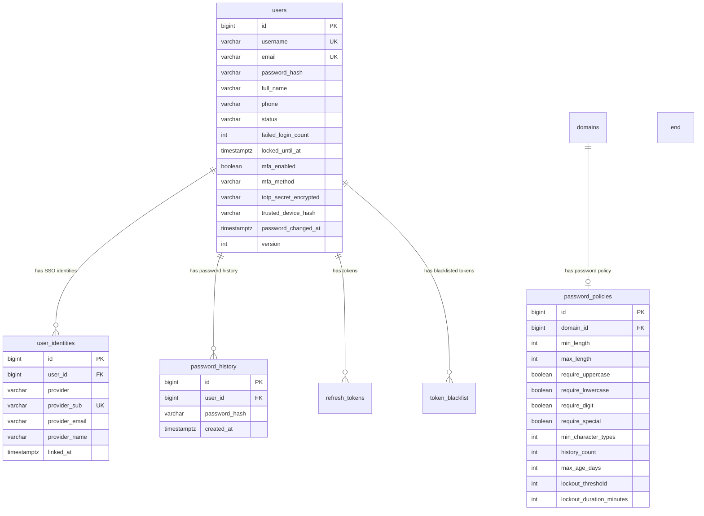
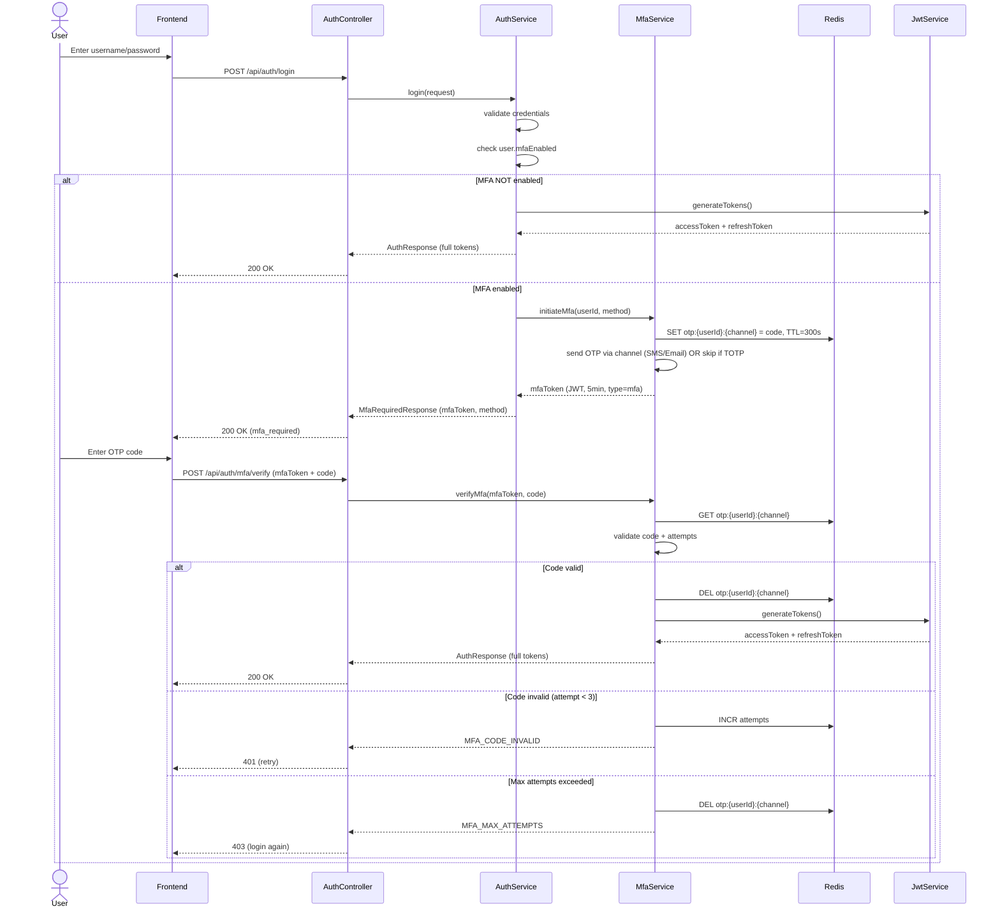
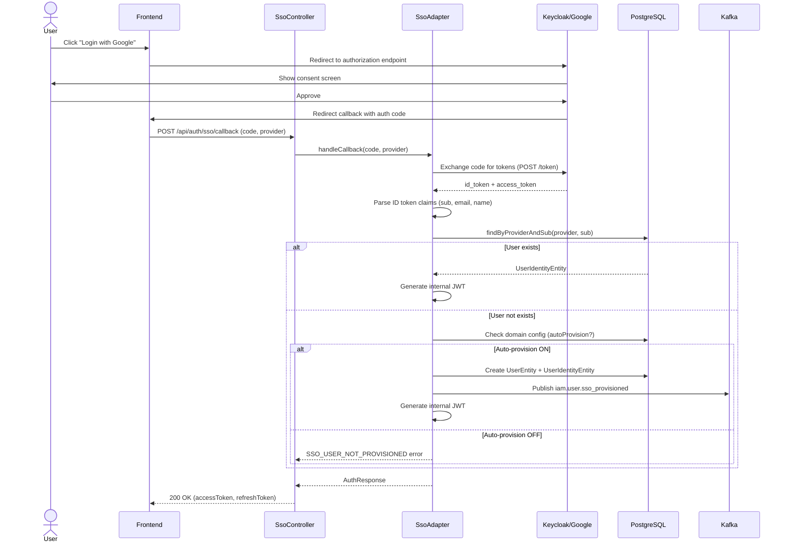
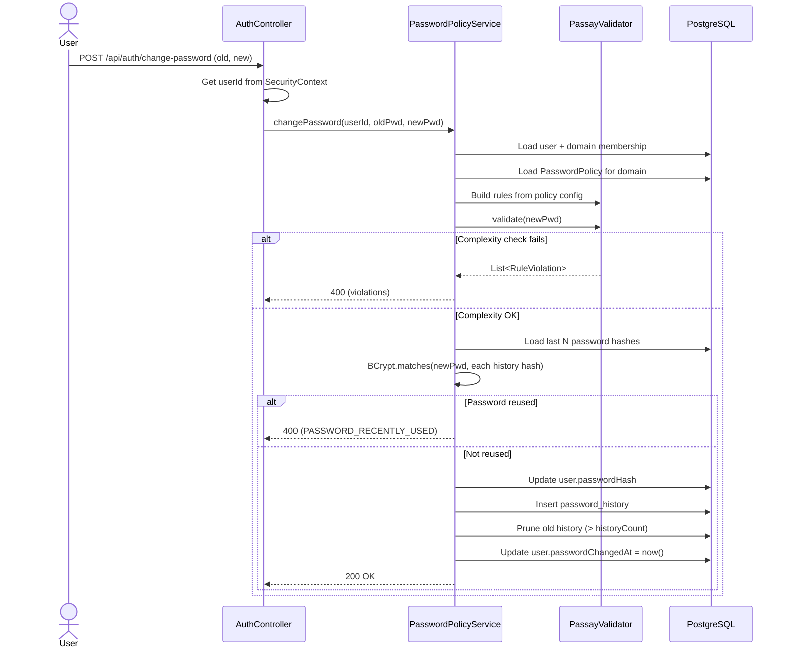

# Technical Specification: Auth Core Features (FR-001 → FR-004)

## 1. Architecture Overview

```mermaid
graph TB
    subgraph "Client Layer"
        FE["Frontend/Mobile App"]
    end

    subgraph "auth-service"
        AC["AuthController"]
        MFA["MfaController"]
        SSO["SsoController"]

        AS["AuthService"]
        MS["MfaService"]
        TS["TotpService"]
        OS["OtpService"]
        CS["CaptchaVerifier"]
        SA["SsoAdapter"]
        JWT["JwtService (RS256)"]
        PPS["PasswordPolicyService"]

        subgraph "Data Layer"
            UE["UserEntity"]
            PPE["PasswordPolicyEntity"]
            PHE["PasswordHistoryEntity"]
            UIE["UserIdentityEntity"]
        end
    end

    subgraph "External"
        Redis["Redis"]
        Kafka["Kafka"]
        IdP["Keycloak / Google / MSFT"]
        CAPTCHA["Turnstile / hCaptcha"]
    end

    subgraph "Downstream"
        AccSvc["account-service"]
    end

    FE --> AC
    FE --> MFA
    FE --> SSO

    AC --> AS
    MFA --> MS
    SSO --> SA

    AS --> JWT
    AS --> PPS
    MS --> TS
    MS --> OS
    MS --> CS

    SA --> IdP
    SA --> Kafka
    Kafka --> AccSvc

    OS --> Redis
    MS --> Redis
    JWT --> Redis
end
```

## 2. Entity Relationship Diagram



## 3. Sequence Diagrams

### 3.1 Two-Phase MFA Login Flow



### 3.2 SSO OAuth2 Login + JIT Provisioning



### 3.3 Password Change with Policy Validation



## 4. API Specification

### 4.1 MFA Endpoints

| Method | Path | Description | Auth |
|---|---|---|---|
| POST | `/api/auth/mfa/verify` | Verify OTP/TOTP code | mfaToken |
| POST | `/api/auth/mfa/totp/setup` | Setup TOTP (get QR code) | JWT |
| POST | `/api/auth/mfa/totp/confirm` | Confirm TOTP setup | JWT |
| POST | `/api/auth/mfa/resend` | Resend OTP via SMS/Email | mfaToken |
| PUT | `/api/auth/mfa/settings` | Enable/disable MFA, change method | JWT |

### 4.2 SSO Endpoints

| Method | Path | Description | Auth |
|---|---|---|---|
| POST | `/api/auth/sso/callback` | Handle OAuth2 callback | Public |
| GET | `/api/auth/sso/providers` | List available SSO providers for domain | Public |
| POST | `/api/auth/sso/link` | Link existing account to SSO identity | JWT |
| DELETE | `/api/auth/sso/unlink/{provider}` | Unlink SSO identity | JWT |

### 4.3 Token Endpoints

| Method | Path | Description | Auth |
|---|---|---|---|
| POST | `/api/auth/introspect` | Token introspection (RFC 7662) | Internal |
| GET | `/.well-known/jwks.json` | Public key endpoint (JWKS) | Public |
| POST | `/api/auth/sessions/{userId}/revoke-all` | Force logout all sessions | ADMIN |

### 4.4 Password Policy Endpoints

| Method | Path | Description | Auth |
|---|---|---|---|
| GET | `/api/admin/domains/{id}/password-policy` | Get domain password policy | ADMIN |
| PUT | `/api/admin/domains/{id}/password-policy` | Update domain password policy | ADMIN |
| POST | `/api/auth/change-password` | Change password (with policy validation) | JWT |
| POST | `/api/auth/forgot-password` | Initiate password reset | Public |
| POST | `/api/auth/reset-password` | Complete password reset with token | Public |

## 5. Data Schema Changes (Migration V2)

### New Tables

```sql
-- User SSO Identities
CREATE TABLE user_identities (
    id              BIGINT PRIMARY KEY,
    user_id         BIGINT NOT NULL REFERENCES users(id),
    provider        VARCHAR(50) NOT NULL,
    provider_sub    VARCHAR(255) NOT NULL,
    provider_email  VARCHAR(255),
    provider_name   VARCHAR(200),
    linked_at       TIMESTAMPTZ NOT NULL DEFAULT NOW(),
    active          BOOLEAN NOT NULL DEFAULT TRUE,
    created_at      TIMESTAMPTZ NOT NULL DEFAULT NOW(),
    UNIQUE(provider, provider_sub)
);

-- Password Policies per Domain
CREATE TABLE password_policies (
    id                      BIGINT PRIMARY KEY,
    domain_id               BIGINT NOT NULL UNIQUE REFERENCES domains(id),
    min_length              INT NOT NULL DEFAULT 8,
    max_length              INT NOT NULL DEFAULT 128,
    require_uppercase       BOOLEAN NOT NULL DEFAULT TRUE,
    require_lowercase       BOOLEAN NOT NULL DEFAULT TRUE,
    require_digit           BOOLEAN NOT NULL DEFAULT TRUE,
    require_special         BOOLEAN NOT NULL DEFAULT FALSE,
    min_character_types     INT NOT NULL DEFAULT 3,
    history_count           INT NOT NULL DEFAULT 5,
    max_age_days            INT NOT NULL DEFAULT 90,
    lockout_threshold       INT NOT NULL DEFAULT 5,
    lockout_duration_minutes INT NOT NULL DEFAULT 15,
    created_at              TIMESTAMPTZ NOT NULL DEFAULT NOW(),
    updated_at              TIMESTAMPTZ NOT NULL DEFAULT NOW()
);

-- Password History
CREATE TABLE password_history (
    id              BIGINT PRIMARY KEY,
    user_id         BIGINT NOT NULL REFERENCES users(id),
    password_hash   VARCHAR(255) NOT NULL,
    created_at      TIMESTAMPTZ NOT NULL DEFAULT NOW()
);
CREATE INDEX idx_password_history_user ON password_history(user_id);
```

### Alter Existing Tables

```sql
-- Add MFA and SSO columns to users table
ALTER TABLE users ADD COLUMN mfa_enabled BOOLEAN NOT NULL DEFAULT FALSE;
ALTER TABLE users ADD COLUMN mfa_method VARCHAR(20) DEFAULT 'NONE';
ALTER TABLE users ADD COLUMN totp_secret_encrypted VARCHAR(500);
ALTER TABLE users ADD COLUMN trusted_device_hash VARCHAR(255);
ALTER TABLE users ADD COLUMN password_changed_at TIMESTAMPTZ;
```

## 6. Agent Implementation Notes

### Dependencies cần thêm (build.gradle.kts)
```kotlin
implementation("dev.samstevens.totp:totp:1.7.1")
implementation("org.passay:passay:1.6.4")
implementation("org.springframework.boot:spring-boot-starter-data-redis")
implementation("org.springframework.boot:spring-boot-starter-oauth2-resource-server")
implementation("org.springframework.boot:spring-boot-starter-oauth2-client")
```

### Cấu hình application.yml bổ sung
```yaml
app:
  security:
    mfa:
      otp-ttl-seconds: 300
      max-attempts: 3
      totp-window: 1
    captcha:
      provider: turnstile  # turnstile | hcaptcha | recaptcha
      secret-key: ${CAPTCHA_SECRET_KEY}
      site-key: ${CAPTCHA_SITE_KEY}
    sso:
      enabled: false  # Enable per domain in domains.config
  jwt:
    algorithm: RS256
    private-key-path: ${JWT_PRIVATE_KEY_PATH}
    public-key-path: ${JWT_PUBLIC_KEY_PATH}
    key-id: "auth-service-key-1"
```

### Key Design Decisions
1. **MFA Token**: Short-lived JWT (5min, type=mfa, sub=userId) — NOT stored in DB, stateless
2. **OTP Storage**: Redis key `otp:{userId}:{channel}` với TTL — atomic, tự cleanup
3. **TOTP Secret**: AES-256 encrypted in DB — decrypt tại runtime khi verify
4. **CAPTCHA**: Pluggable interface `CaptchaVerifier` — swap provider via config
5. **RS256 Key**: RSA 2048-bit key pair, JWKS auto-exposed at `/.well-known/jwks.json`
6. **Password Validator Cache**: `ConcurrentHashMap<domainId, PasswordValidator>` — invalidate on policy update
