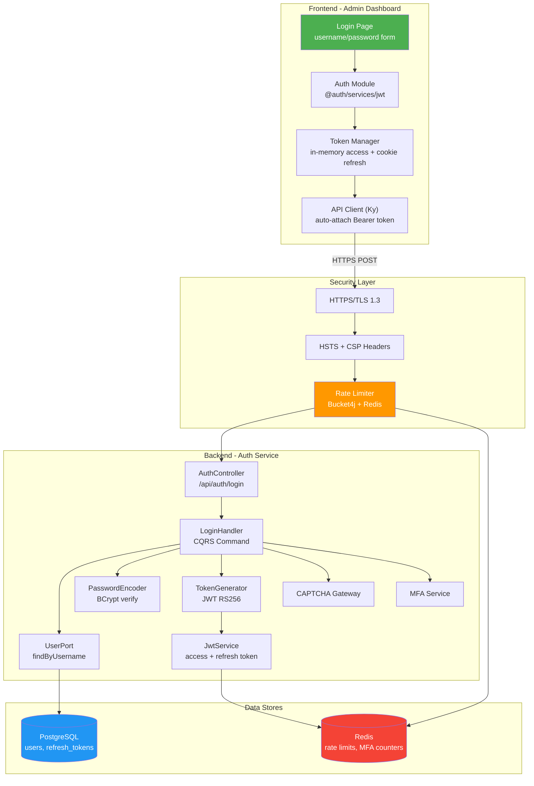
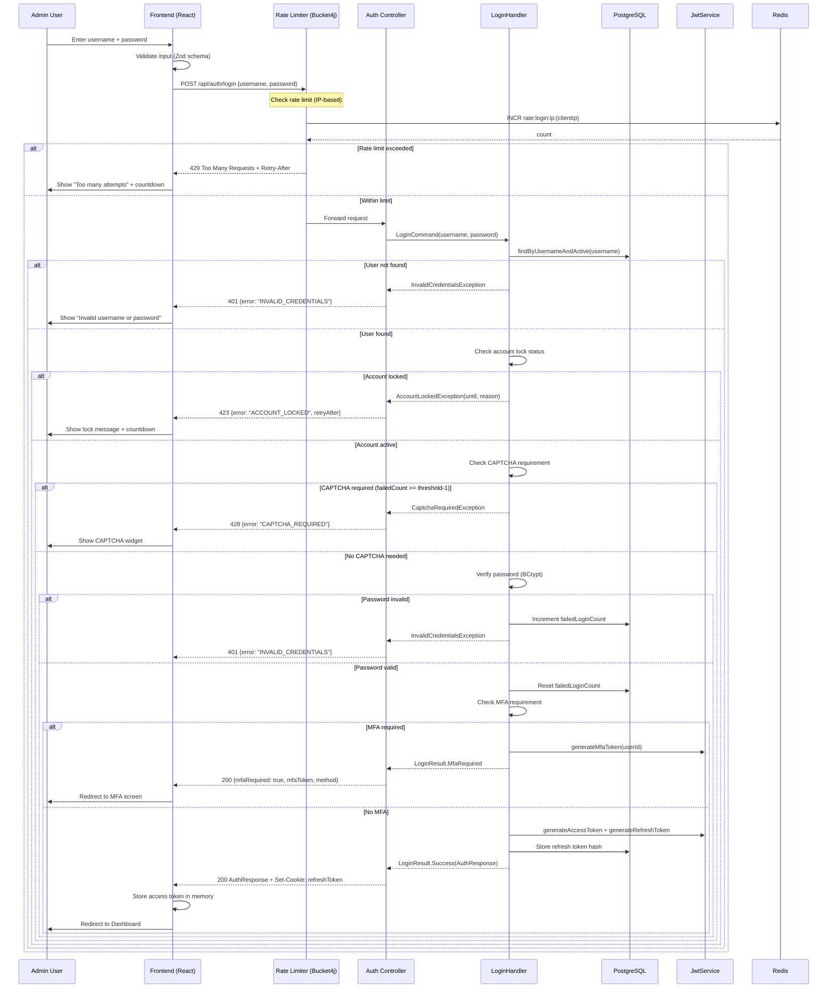
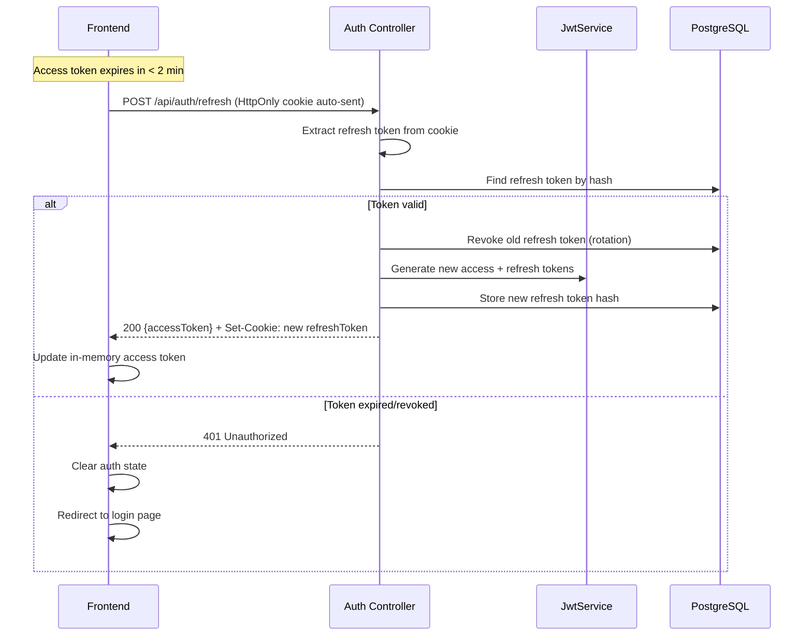
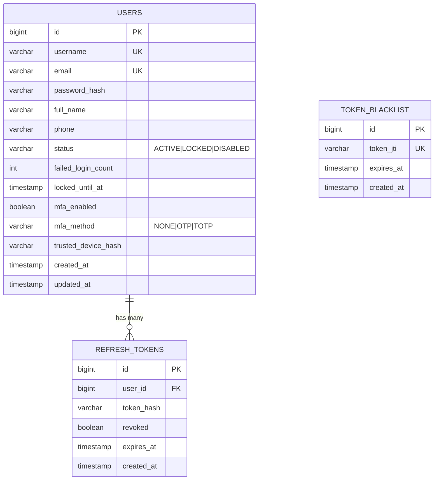
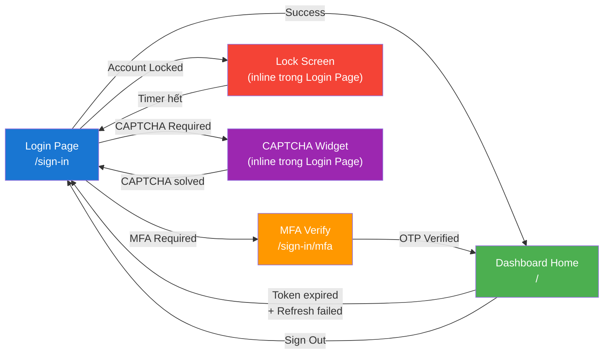

# Technical Specification — Auth Login Admin Dashboard

## 1. Architecture Overview

### High-Level Architecture Diagram



---

## 2. Sequence Diagrams

### 2.1 Login Flow (Happy Path)



### 2.2 Silent Token Refresh Flow



---

## 3. Data Schema

### 3.1 ERD (Liên quan đến Auth)



### 3.2 Redis Key Schema

| Key Pattern | Type | TTL | Purpose |
|-------------|------|-----|---------|
| `rate:login:ip:{clientIp}` | String (counter) | 60s | Login rate limit per IP |
| `rate:login:user:{username}` | String (counter) | 300s | Login rate limit per username |
| `mfa:verify:attempts:{userId}:OTP` | String (counter) | 900s | MFA OTP attempt counter |
| `mfa:verify:lock:{userId}:OTP` | String ("locked") | 1800s | MFA OTP lock |

---

## 4. API Specification

### 4.1 POST /api/auth/login

**Request:**
```json
{
  "username": "admin01",
  "password": "SecureP@ss123",
  "domainCode": "default",
  "captchaToken": null,
  "trustedDeviceHash": null
}
```

**Response (Success — 200):**
```json
{
  "accessToken": "eyJhbGciOiJSUzI1NiIs...",
  "refreshToken": "— set via HttpOnly cookie —",
  "tokenType": "Bearer",
  "expiresIn": 900,
  "userId": 1,
  "username": "admin01",
  "activeDomain": "default",
  "roles": ["ADMIN"],
  "permissions": ["user:read", "user:write", "role:manage"]
}
```

**Response Headers (Success):**
```
Set-Cookie: refresh_token=<opaque_token>; HttpOnly; Secure; SameSite=Strict; Path=/api/auth; Max-Age=604800
```

**Error Responses:**

| Status | Error Code | Description |
|--------|-----------|-------------|
| 401 | `INVALID_CREDENTIALS` | Username/password không đúng |
| 423 | `ACCOUNT_LOCKED` | Account bị lock, kèm `retryAfter` |
| 428 | `CAPTCHA_REQUIRED` | CAPTCHA cần được hoàn thành |
| 429 | `TOO_MANY_REQUESTS` | Rate limit exceeded, kèm `Retry-After` header |
| 403 | `PASSWORD_EXPIRED` | Password hết hạn, cần đổi |

### 4.2 POST /api/auth/refresh

**Request:** No body — refresh token sent via HttpOnly cookie

**Response (Success — 200):**
```json
{
  "accessToken": "eyJhbGciOiJSUzI1NiIs...",
  "tokenType": "Bearer",
  "expiresIn": 900
}
```

---

## 5. Screen Flow



---

## 6. Agent Implementation Notes

### 6.1 Frontend Changes

| File | Action | Description |
|------|--------|-------------|
| `src/@auth/authApi.ts` | **MODIFY** | Thay `mock/auth/*` → `/api/auth/*`, thêm cookie handling |
| `src/@auth/services/jwt/JwtAuthProvider.tsx` | **MODIFY** | In-memory token, cookie-based refresh, error handling |
| `src/app/(public)/(auth)/components/forms/SignInPageForm.tsx` | **MODIFY** | Email → Username field |
| `src/app/(public)/(auth)/components/tabs/sign-in/JwtSignInTab.tsx` | **MODIFY** | Add error states (locked, captcha, rate limit) |
| `src/@auth/services/jwt/components/JwtSignInForm.tsx` | **MODIFY** | Add real API integration + error display |
| `src/utils/api.ts` | **MODIFY** | Add credentials: 'include' cho cookie, CSRF header |
| `src/@auth/services/jwt/utils/jwtUtils.ts` | **MODIFY** | Token expiry check utility |

### 6.2 Backend Changes

| File | Action | Description |
|------|--------|-------------|
| `shared/config/SecurityConfig.kt` | **MODIFY** | Add CORS config cho cookie, CSRF cookie-to-header |
| `auth/adapter/in/web/AuthController.kt` | **MODIFY** | Set HttpOnly cookie cho refresh token |
| `shared/config/RateLimitConfig.kt` | **NEW** | Bucket4j + Redis configuration |
| `auth/adapter/in/web/filter/LoginRateLimitFilter.kt` | **NEW** | Rate limit filter cho `/api/auth/login` |
| `shared/config/SecurityProperties.kt` | **MODIFY** | Add rate limit properties |
| `shared/config/WebConfig.kt` | **MODIFY** | Add security headers (HSTS, CSP) |

### 6.3 Implementation Phases

| Phase | Scope | Priority |
|-------|-------|----------|
| **Phase 1** | FE: Username field + Real API integration | 🔴 P0 |
| **Phase 2** | BE: Rate limiting (Bucket4j) + FE error handling | 🔴 P0 |
| **Phase 3** | BE+FE: HttpOnly cookie cho refresh token | 🔴 P0 |
| **Phase 4** | BE: Security headers (HSTS, CSP) + CORS | 🟡 P1 |
| **Phase 5** | FE: CAPTCHA widget integration | 🟡 P1 |
| **Phase 6** | BE: Access token TTL reduction (30 → 15 min) | 🟡 P1 |
| **Phase 7** | Edge: WAF/CDN recommendation (documentation only) | 🟢 P2 |

---

## 7. Security Checklist

- [ ] HTTPS enforced (TLS 1.3)
- [ ] HSTS header set
- [ ] CSP header configured
- [ ] Refresh token in HttpOnly cookie
- [ ] Access token in-memory only
- [ ] Rate limiting on login endpoint (Bucket4j)
- [ ] Account lockout after 3 failed attempts
- [ ] CAPTCHA integration
- [ ] Password hashing with BCrypt (strength ≥ 12)
- [ ] JWT RS256 signing
- [ ] Token rotation on refresh
- [ ] Token blacklist for revocation
- [ ] No credentials in URL (POST only)
- [ ] Input validation (Zod FE + Bean Validation BE)
- [ ] Audit logging for login events
